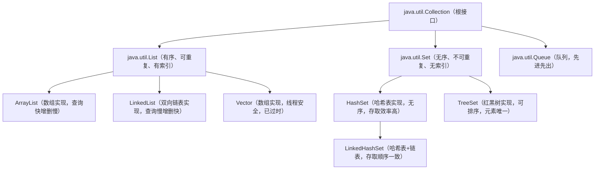
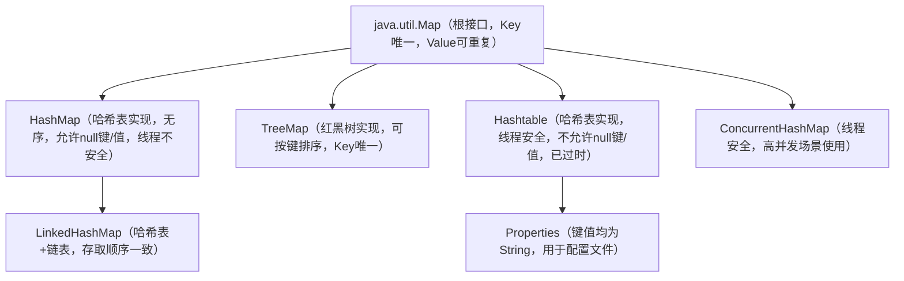

# Java程序设计总复习完整版
## 第一章 Hello World
1. **Java是什么语言?**
Java是一门**跨平台、面向对象、编译+解释型的高级编程语言**，具备健壮性、安全性、多线程、分布式等核心特性，核心设计理念是“一次编写，到处运行（Write Once, Run Anywhere）”。

2. **JDK、JRE、JVM的定义与关系**
- **JVM(Java Virtual Machine)**：Java虚拟机，是Java实现跨平台的核心，负责将字节码文件翻译成对应操作系统可执行的机器码，不同平台需要安装对应的JVM。
- **JRE(Java Runtime Environment)**：Java运行时环境，包含**JVM + Java程序运行所需的核心类库**，是运行Java程序的最小环境。
- **JDK(Java Development Kit)**：Java开发工具包，包含**JRE + Java开发工具（javac编译器、java运行工具、jdb调试工具等）+ 开发用的核心类库**，是开发Java程序的完整环境。
- 包含关系：**JDK ⊃ JRE ⊃ JVM**

3. **Java程序的执行过程(生命周期)**
完整执行流程分为三大阶段：
4. **编写源码**：程序员编写后缀为`.java`的Java源文件，编写符合语法规范的代码。
5. **编译阶段**：通过`javac`编译器，将`.java`源文件编译成JVM可识别的、平台无关的`.class`字节码文件；若源码有语法错误，编译会失败，无法生成字节码文件。
6. **运行阶段**：通过`java`命令启动JVM，由类加载器加载`.class`字节码文件，经字节码校验器校验后，JVM的解释器/即时编译器（JIT）将字节码翻译成当前平台可执行的机器码，最终由CPU执行。

## 第二章 Java语法
1. **标识符的特点与规范**
标识符是给类、方法、变量、常量、包等起名字的符号，分为强制规则和行业规范。
- **强制规则（违反则编译报错）**：
  1. 由字母（A-Z/a-z）、数字（0-9）、美元符号`$`、下划线`_`组成
  2. 不能以数字开头
  3. 严格区分大小写
  4. 不能使用Java的关键字、保留字作为标识符
- **行业命名规范（提升代码可读性）**：
  1. 类名/接口名：大驼峰命名法，每个单词首字母大写，如`HelloWorld`、`UserService`
  2. 变量名/方法名：小驼峰命名法，首单词小写，后续单词首字母大写，如`userName`、`getUserAge()`
  3. 常量名：全大写，单词间用下划线分隔，如`MAX_AGE`、`DEFAULT_TIMEOUT`
  4. 包名：全小写，域名反转，如`com.example.demo`

5. **Java的数据类型与8种基本数据类型**
Java数据类型分为**基本数据类型**和**引用数据类型**两大类，其中8种基本数据类型如下：

| 数据类型   | 关键字     | 占用内存           | 取值范围                                       | 核心备注                              |
| ------ | ------- | -------------- | ------------------------------------------ | --------------------------------- |
| 字节型    | byte    | 1字节（8位）        | -128 ~ 127                                 |                                   |
| 短整型    | short   | 2字节（16位）       | -32768 ~ 32767                             |                                   |
| 整型     | int     | 4字节（32位）       | -2147483648 ~ 2147483647                   | Java整数默认类型，最大正整数为2¹⁰-1=2147483647 |
| 长整型    | long    | 8字节（64位）       | -9223372036854775808 ~ 9223372036854775807 | 赋值时数值末尾需加`L`（推荐）/`l`              |
| 单精度浮点型 | float   | 4字节（32位）       | 约±3.4E+38                                  | 赋值时数值末尾需加`F`/`f`                  |
| 双精度浮点型 | double  | 8字节（64位）       | 约±1.7E+308                                 | Java浮点数默认类型                       |
| 字符型    | char    | 2字节（16位）       | 0 ~ 65535（'\u0000' ~ '\uffff'）             | 存储单个Unicode字符，用单引号包裹              |
| 布尔型    | boolean | 无明确JVM规范，逻辑占1位 | 仅true/false                                | 不参与数值运算                           |

3. **String是否是基本数据类型?**
String**不是**基本数据类型，它是`java.lang`包下的引用数据类型（类），底层JDK8及之前基于字符数组实现，JDK9及之后基于字节数组实现，用于表示字符串序列。

4. **自动类型转换与强制类型转换**
- **自动类型转换（隐式转换）**
  1. 规则：小范围类型自动转为大范围类型，无精度丢失风险，无需手动处理。
  2. 合法转换顺序：`byte → short → int → long → float → double`；`char`可自动转为`int`及以上类型。
  3. 注意：`byte`、`short`、`char`之间不会相互自动转换，三者运算时会先自动提升为`int`类型。

- **强制类型转换（显式转换）**
  1. 语法：`目标类型 变量名 = (目标类型) 原数值/变量;`
  2. 场景：大范围类型转为小范围类型，必须手动强制转换。
  3. 风险：① 精度丢失：浮点型转整型会舍弃小数部分；② 数据溢出：超出目标类型取值范围时，数值会发生错乱。

4. **三元表达式**
三元表达式是Java唯一的三目运算符，用于简化简单的if-else逻辑。
- 语法：`条件表达式 ? 表达式1 : 表达式2;`
- 执行规则：先判断条件表达式的boolean结果，为true时返回/执行表达式1，为false时返回/执行表达式2。
- 示例：
  ```java
  int a=1;int b=4; 
  boolean c = a>b?true:false; // 执行结果c=false
  ```
- 要求：表达式1和表达式2的类型需兼容，可嵌套使用。

6. **switch结构与break关键字**
- 语法结构：
  ```java
  switch(表达式) {
      case 常量值1:
          // 执行语句
          break;
      case 常量值2:
          // 执行语句
          break;
      default:
          // 无匹配时执行的语句
          break;
  }
  ```
- 表达式支持的类型：
  1. JDK1.0~1.4：仅支持`byte`、`short`、`int`、`char`
  2. JDK1.5~1.6：新增支持对应包装类、枚举类型`enum`
  3. JDK1.7+：新增支持`String`类型
  4. 不支持`long`、`float`、`double`、`boolean`类型
- break关键字的作用：
  1. 终止当前switch分支的执行，跳出整个switch结构。
  2. 若case分支后不写break，会发生**case穿透**：匹配到该case后，会继续执行后续所有case和default的语句，直到遇到break或switch结束。

3. **循环中continue和break的区别**

| 关键字 | 适用范围 | 核心作用 | 执行效果 |
|--------|----------|----------|----------|
| break | 循环结构、switch结构 | 终止整个循环/switch的执行 | 跳出当前所在循环体，直接执行循环后的代码；嵌套循环中默认跳出最近的一层循环 |
| continue | 仅循环结构 | 跳过本次循环剩余语句，进入下一次循环 | 不终止循环，仅终止当前这一次循环的执行，直接进入循环条件判断，开启下一轮循环 |

8. **方法的定义、返回值与return关键字**
方法是封装了特定功能的代码块，实现代码复用。
- 方法定义语法：
  ```java
  [访问修饰符] [修饰符] 返回值类型 方法名([参数类型1 参数名1, 参数类型2 参数名2,...]) {
      // 方法体（功能代码）
      [return 返回值;]
  }
  ```
- 返回值与return规则：
  1. 方法声明了非`void`的返回值类型，方法体中**必须**通过`return`返回对应类型的数值，且类型必须兼容。
  2. 方法返回值类型为`void`，可写`return;`（仅终止方法，不能带返回值），也可不写。
  3. `return`执行后，方法立即终止，其后的代码不会被执行。
- 核心规范：Java不允许在方法内部定义方法，包括main方法，方法必须定义在类的成员级别。

9. **方法重载的特点**
方法重载（Overload）是编译时多态的体现，定义：**同一个类中，方法名相同，参数列表不同的多个方法，与返回值类型、访问修饰符无关**。
- 参数列表不同的判定标准（满足其一即可）：
  1. 参数个数不同
  2. 参数类型不同
  3. 参数的类型顺序不同（仅当参数类型不同时有效）
- 注意：仅返回值类型不同、仅参数名不同，都不构成方法重载，编译会报错。

10. **数组的下标规则与二维数组的使用**
数组是相同类型数据的有序集合，属于引用数据类型，一旦初始化，长度不可变。
- 一维数组下标规则：
  1. 下标从0开始，最大下标为`数组名.length - 1`。
  2. 访问超出下标范围的元素，会抛出`ArrayIndexOutOfBoundsException`数组下标越界异常。
- 二维数组核心特性：
  Java中的二维数组本质是**数组的数组**，即一维数组的每个元素又是一个一维数组。
- 特殊初始化与易错点：
  示例`int[][] a = new int[3][];  a[0][1]=1;`：**这行代码会抛出NullPointerException空指针异常**。
  原因：`int[][] a = new int[3][];`仅初始化了二维数组的3行，每行的一维数组未初始化，默认值为null，直接访问下标会触发空指针。
  正确写法：
  ```java
  int[][] a = new int[3][];
  a[0] = new int[2]; // 先给第0行初始化长度为2的一维数组
  a[0][1] = 1; // 再进行元素赋值
  ```

## 第三章 面向对象上
1. **面向对象的核心特性**
面向对象编程（OOP）的四大核心特性：**封装、继承、多态、抽象**，其中三大核心特性为封装、继承、多态。
- 封装：将对象的属性和操作数据的方法绑定，隐藏内部实现细节，仅对外暴露必要的访问接口，实现高内聚、低耦合。
- 继承：子类继承父类的属性和方法，实现代码复用，是多态的前提。
- 多态：同一个行为，不同对象具有不同的表现形式，分为编译时多态和运行时多态。
- 抽象：抽取一类对象的共同特征，忽略无关细节，形成抽象类或接口，是三大特性的基础。

2. **对象的创建 new 关键字**
对象创建的完整流程（以`Person p = new Person();`为例）：
3. 类加载：JVM检查Person类是否已加载，未加载则执行类的加载、验证、准备、解析、初始化流程。
4. 内存分配：在堆内存中为Person对象分配空间，给成员变量赋默认零值。
5. 初始化执行：执行构造代码块，调用对应的构造方法，完成对象成员变量的显式初始化。
6. 返回引用：将堆中对象的内存地址赋值给栈中的引用变量p，后续通过p操作该对象。

7. **对象与引用的关系（内存模型）**
- 对象：new关键字创建的、存放在**堆内存**中的类的实例，是实际存储数据的实体，每个对象有独立的内存空间。
- 引用：存放在**栈内存**中的变量，存储的是堆中对象的内存地址，相当于指向对象的“指针”。
- 核心关系：
  1. 引用 ≠ 对象，一个对象可以被多个引用同时指向，一个引用同一时间只能指向一个对象（或null）。
  2. 当一个对象没有任何引用指向时，会被JVM的垃圾回收器判定为垃圾，在合适的时机被回收。

3. **访问修饰符**
Java有4种访问权限修饰符，用于控制类、属性、方法的可见范围，权限从大到小为：`public > protected > default > private`

| 修饰符 | 同一类内 | 同包内 | 不同包的子类 | 不同包的非子类 | 备注 |
|--------|----------|--------|--------------|----------------|------|
| public 公共的 | ✅ | ✅ | ✅ | ✅ | 所有位置都可访问 |
| protected 受保护的 | ✅ | ✅ | ✅ | ❌ | 同包可访问，不同包仅子类可访问 |
| default 默认的 | ✅ | ✅ | ❌ | ❌ | 不写修饰符时默认生效，仅同包可访问 |
| private 私有的 | ✅ | ❌ | ❌ | ❌ | 仅当前类内部可访问 |

补充：外部类的访问修饰符只能是public或default，内部类可使用全部4种修饰符。

5. **封装的目的与实现步骤**
- 封装的核心目的：
  1. 隐藏内部实现细节，降低代码耦合度，提升代码安全性。
  2. 避免外部随意修改对象属性，可在访问接口中加入数据校验，保证数据合法性。
  3. 提升代码可维护性，内部实现修改时，只要对外接口不变，不影响外部调用。
- 封装的实现步骤：
  1. 私有化成员变量：使用`private`修饰属性，禁止外部直接访问。
  2. 提供公共的get/set方法：使用`public`修饰getter（获取属性值）和setter（设置属性值）方法，作为外部访问的唯一接口。
  3. 在get/set方法中添加业务逻辑，如数据合法性校验。

4. **构造方法的语法与调用时机**
构造方法是类中用于创建对象、初始化对象成员变量的特殊方法。
- 语法规则：
  1. 方法名必须和类名完全一致（包括大小写）。
  2. 没有返回值类型，连void都不能写。
  3. 可以有参数，分为无参构造和有参构造，支持重载。
  4. 可使用访问修饰符控制对象创建的权限。
- 调用时机：
  构造方法**只能在创建对象时，通过new关键字调用**，每次new创建对象，都会调用对应的构造方法，创建几个对象就调用几次。
- 补充规则：
  1. 类中没有手动编写任何构造方法时，编译器会自动生成一个默认的无参构造方法。
  2. 手动编写了有参构造方法后，编译器不会再生成默认无参构造，如需使用必须手动编写。

3. **this关键字的使用**
this关键字代表**当前正在执行的对象**，即谁调用这个方法，this就代表谁。
- 核心用法：
  1. `this.成员变量`：区分成员变量和局部变量，解决重名冲突。
  2. `this.成员方法`：调用当前对象的其他成员方法，通常可省略。
  3. `this()`：调用本类中的其他构造方法。
     - 规则：只能在构造方法中使用，必须写在构造方法的**第一行**，且只能出现一次，不能循环调用。
- 核心问题：**静态方法中不能使用this**。
  原因：static静态方法属于类，类加载时就已初始化，不依赖对象创建；而this代表当前对象，是对象创建后才存在的，二者生命周期不匹配，编译会直接报错。

8. **构造块与静态块的执行特点与顺序**
- 构造块（构造代码块）：
  1. 定义：类中、方法外，直接用`{}`包裹的代码块。
  2. 执行特点：每次创建对象时都会执行，**优先于构造方法执行**，每new一次就执行一次，用于所有对象的统一初始化。
- 静态块（静态代码块）：
  1. 定义：类中用`static`修饰的`{}`包裹的代码块。
  2. 执行特点：**类加载时执行，且仅执行一次**，优先于构造块、构造方法执行；只能访问静态成员，用于类的静态资源初始化。
- 完整执行顺序（优先级从高到低）：
  父类静态块 → 子类静态块 → 父类构造块 → 父类构造方法 → 子类构造块 → 子类构造方法

9. **static关键字的特性**
static可修饰成员变量、成员方法、代码块、内部类，核心是“属于类，而非对象”。
- 静态变量（类变量）：
  1. 用static修饰的成员变量，存放在方法区的静态常量池中，类加载时初始化，**整个JVM中只有唯一一份**，被该类的所有对象共享。
  2. 生命周期与类一致，类被卸载时才会被回收。
- 静态方法（类方法）：
  1. 用static修饰的成员方法，属于类，无需创建对象，直接通过类名调用。
  2. 静态方法中只能直接访问静态成员，不能直接访问非静态成员，不能使用this、super关键字。
  3. 反之非静态方法可以访问静态成员
- 访问规范：
  推荐使用**类名.静态属性** / **类名.静态方法()** 的方式访问，语义清晰；语法上也可通过对象访问，不推荐。

## 第四章 面向对象下
1. **继承的语法、目的与核心规则**
继承是子类（派生类）通过extends关键字继承父类（基类/超类）的属性和方法，实现代码复用，是Java中“is-a”关系的体现。
- 语法：
  ```java
  [访问修饰符] class 子类名 extends 父类名 {
      // 子类独有的属性和方法
  }
  ```
- 核心目的：① 代码复用，抽取多个子类的共同特征到父类，避免重复代码；② 功能扩展，子类可新增独有方法，或重写父类方法。
- 核心规则：
  1. Java类是**单继承**的，一个子类**只能有一个直接父类**，不支持多继承。
  2. 一个父类可以有多个子类，支持多层继承（C继承B，B继承A），即一个类可以有多个间接父类。
  3. 子类只能继承父类中非private修饰的成员，private成员仅父类内部可访问。
  4. 子类构造方法中，会默认通过`super()`调用父类的无参构造，若父类没有无参构造，子类必须通过`super(参数)`手动调用父类有参构造，且必须写在第一行。

5. **方法重写的前提与语法特点**
方法重写（Override/覆盖）：子类中定义了和父类**方法名、参数列表完全相同**的方法，用于覆盖父类的方法实现，是运行时多态的核心。
- 重写的前提：
  1. 必须存在继承关系（子类extends父类）或接口实现关系（类implements接口）。
  2. 子类重写的方法，必须是父类中可继承的方法（非private、非final、非static）。
- 重写的语法规则（两同两小一大）：
  1. **两同**：方法名必须完全相同；参数列表必须完全相同（个数、类型、顺序一致）。
  2. **两小**：子类方法的返回值类型，引用类型需小于等于父类，基本类型/void必须完全相同；子类方法抛出的异常类型，必须小于等于父类。
  3. **一大**：子类方法的访问权限，必须大于等于父类方法的访问权限。
- 补充：父类private、final、static修饰的方法，子类无法重写。

3. **super与this的对比**
super关键字代表当前对象的父类对象的引用，用于访问父类的可继承成员。

| 对比项  | this                                                        | super                          |
| ---- | ----------------------------------------------------------- | ------------------------------ |
| 核心含义 | 代表当前对象本身的引用                                                 | 代表当前对象的父类对象的引用                 |
| 访问成员 | 访问本类的成员，本类没有时向上找父类                                          | 直接访问父类的可继承成员，跳过本类              |
| 调用构造 | this()：调用本类的其他构造方法，必须在构造方法第一行                               | super()：调用父类的构造方法，必须在子类构造方法第一行 |
| 静态方法 | 不能在静态方法中使用                                                  | 不能在静态方法中使用                     |
| 共同点  | 1. 都只能在非静态的成员方法、构造方法中使用；2. 调用构造方法时都必须在第一行，因此不能同时出现在同一个构造方法中 |                                |

4. **final修饰的类和方法的特点**
final含义为“最终的、不可修改的”，可修饰类、方法、变量。
- final修饰类：该类**不能被继承**，没有子类，如Java中的String、Math、Integer等类都是final修饰的。
- final修饰方法：该方法**不能被子类重写**，但可以被子类继承和正常调用，锁定方法的实现逻辑，防止被篡改。
- 补充：final修饰变量时，变量一旦赋值就不可修改；修饰引用类型变量时，引用的地址不可修改，但对象内部的属性值可以修改。

5. **抽象类与抽象方法**
- 抽象类：用`abstract`关键字修饰的类，叫做抽象类。
- 抽象方法：用`abstract`关键字修饰，只有方法声明、没有方法体的方法，叫做抽象方法。
- 核心关系：
  1. 包含抽象方法的类，**必须**被声明为抽象类。
  2. 抽象类中，可以没有抽象方法。
  3. 抽象类的子类，**必须重写抽象父类中所有的抽象方法**，除非子类也被声明为抽象类。
- 核心特点：
  1. 抽象类**不能通过new关键字实例化对象**，只能被继承。
  2. 抽象类中可以有成员变量、构造方法、普通方法、静态方法、抽象方法、常量。
  3. abstract不能和final同时修饰类，不能和final、private、static同时修饰方法，二者语义矛盾。

4. **接口的版本演进与可定义内容**
接口（interface）是Java中抽象方法的集合，是一种行为契约和规范，类通过`implements`关键字实现接口，一个类可以实现多个接口，解决了类单继承的限制。
- JDK8之前的接口特点：
  只能定义`public static final`公共静态常量和`public abstract`公共抽象方法，没有方法体，实现类必须重写所有抽象方法。
- JDK8新增特性：
  新增`default`默认方法（有方法体，实现类可直接使用或重写）、`static`静态方法（有方法体，只能通过接口名调用）。
- JDK9及JDK11新增特性：
  新增`private`私有实例方法和`private static`私有静态方法，用于抽取接口内部的重复代码，仅接口内部可访问。
- JDK11中接口可定义的完整内容：
  1. public static final 公共静态常量
  2. public abstract 公共抽象方法
  3. public default 默认方法
  4. public static 静态方法
  5. private 私有实例方法
  6. private static 私有静态方法

7. **多态的定义与实现步骤**
多态的核心是**父类/接口的引用指向子类/实现类的对象**，调用方法时，实际执行的是子类/实现类重写后的方法。
- 多态的分类：
  1. 编译时多态（静态多态）：编译期确定方法执行版本，典型实现是**方法重载**。
  2. 运行时多态（动态多态）：运行时确定方法执行版本，是Java多态的核心，典型实现是**方法重写+向上转型**。
- 运行时多态的实现前提：
  1. 必须有继承关系或接口实现关系
  2. 必须有方法重写
  3. 必须有向上转型（父类/接口引用指向子类/实现类对象）
- 核心特点：
  成员方法：编译看左边（父类/接口），运行看右边（子类/实现类）；
  成员变量：编译看左边，运行看左边，无多态特性。

8. **对象的向上转型与向下转型**
对象转型是多态的核心操作，前提是两个类型必须存在继承关系或接口-实现类关系。
- 向上转型（自动转型）：
  1. 定义：子类对象赋值给父类/接口的引用，小范围转大范围，自动完成。
  2. 语法：`父类类型 引用名 = new 子类类型();`
  3. 特点：安全无异常；转型后只能调用父类中定义的方法，无法调用子类独有方法；子类重写的方法，执行子类的实现。
- 向下转型（强制转型）：
  1. 定义：父类/接口的引用赋值给子类类型的引用，大范围转小范围，必须手动强制转换。
  2. 语法：`子类类型 引用名 = (子类类型) 父类引用;`
  3. 特点：不安全，类型不匹配会抛出`ClassCastException`类型转换异常；目的是恢复子类独有的方法。
- 安全转型辅助：`instanceof`关键字
  作用：判断一个引用指向的对象是否属于某个类型，返回boolean值，避免转型异常。
  语法：`对象引用 instanceof 类型`

9. **Object类的核心特点与常用方法**
- Object类的核心特点：
  Object类是Java中所有类的根父类（超类），所有类都直接或间接继承了Object类；若一个类没有显式继承其他类，编译器会自动让其继承Object类；Object类在`java.lang`包中，默认导入，无需手动引入。
- 核心常用方法：
  9. `toString()`：返回对象的字符串表示形式，默认返回“类名@十六进制哈希值”，通常需要重写，返回对象的属性信息，方便调试。
  
  10. `equals()`：判断两个对象是否相等，默认实现和等号 一致，比较对象的内存地址；String等类重写了该方法，改为比较对象的内容，业务类通常也需要重写。
  
  11. 其他方法：`hashCode()`、`getClass()`、`clone()`、`wait()`、`notify()`等。

12. **内部类的分类与匿名内部类**
- 内部类的定义：定义在一个类内部的类，叫做内部类，包含内部类的类叫做外部类。
- 内部类的分类：成员内部类、静态内部类、局部内部类、匿名内部类。
- 匿名内部类核心知识点：
  1. 定义：没有显式类名的局部内部类，创建对象时同时定义类并实例化，编译后生成`外部类名$数字.class`字节码文件。
  2. 语法：
     ```java
     父类/接口 引用名 = new 父类/接口() {
         // 重写父类/接口的抽象方法
     };
     ```
  3. 使用前提：必须继承一个父类，或实现一个接口（二选一）；必须重写所有抽象方法；只能创建一个对象实例。
  4. 常用场景：接口/抽象类的实现类仅使用一次，无需单独定义类，如线程创建、事件监听、回调函数等场景。

## 第五章 异常处理
1. **异常发生后不处理的后果**
异常是程序运行过程中发生的非正常情况，会导致程序正常指令流中断，不处理会产生以下后果：
2. 程序会立即终止，异常发生位置之后的代码不会执行。
3. JVM会将异常类型、异常信息、堆栈轨迹打印到控制台。
4. 正在执行的文件操作、数据库连接、网络请求等资源无法正常释放，造成资源泄漏、数据不一致。
5. 用户会看到程序崩溃、无响应，体验极差。

6. **异常处理的目的**
异常处理的核心目的**不是**避免异常的发生（很多异常如网络中断、文件不存在是不可避免的），而是：
3. 异常发生时捕获异常，保证程序不会直接崩溃，后续代码可继续执行，提升程序健壮性。
4. 对异常进行针对性处理，如用户提示、事务回滚、资源释放、日志记录、故障恢复。
5. 区分异常类型，做差异化处理，方便问题定位和排查，提升代码可维护性。

6. **异常的继承结构图**
Java异常体系的根类是`java.lang.Throwable`，它有两个直接子类：`Error`和`Exception`，完整结构如下：
```
java.lang.Object
    └── java.lang.Throwable
        ├── java.lang.Error（错误，JVM级严重问题，程序无法处理）
        └── java.lang.Exception（异常，程序可捕获处理）
            ├── java.lang.RuntimeException（运行时异常/非受检异常，编译不检查）
            └── 非RuntimeException（编译时异常/受检异常，编译强制检查）
```
- 常见运行时异常：`NullPointerException`空指针、`ArrayIndexOutOfBoundsException`数组越界、`ClassCastException`类型转换、`ArithmeticException`算术异常、`NumberFormatException`数字格式异常。
- 常见编译时异常：`IOException`IO异常、`FileNotFoundException`文件未找到、`SQLException`SQL异常、`ClassNotFoundException`类未找到、`InterruptedException`线程中断异常。

4. **异常处理的核心手段**
Java异常处理的5个核心关键字：`try`、`catch`、`finally`、`throws`、`throw`。
- 捕获异常：try-catch-finally
  语法：
  ```java
  try {
      // 可能发生异常的代码
  } catch (异常类型1 异常变量名) {
      // 对应异常的处理逻辑
  } catch (异常类型2 异常变量名) {
      // 对应异常的处理逻辑
  } finally {
      // 无论是否发生异常，最终一定会执行的代码（资源释放）
  }
  ```
  规则：多个catch块时，异常类型必须从小到大（子类到父类）排序；finally块只有执行`System.exit(0)`终止JVM时才不会执行，其他情况一定会执行。
- 声明抛出异常：throws
  作用：在方法声明处，声明该方法可能抛出的异常，告知调用者处理风险。
  语法：`[修饰符] 返回值类型 方法名(参数列表) throws 异常类型1, 异常类型2,... {}`
  规则：编译时异常必须通过throws声明或try-catch捕获，否则编译报错；调用者调用了throws声明的方法，必须处理该异常。
- 手动抛出异常：throw
  作用：在代码中手动创建异常对象并抛出，主动触发异常处理流程。
  语法：`throw 异常对象;`
  示例：`if(age < 0) { throw new IllegalArgumentException("年龄不能为负数"); }`
  规则：throw执行后，后续代码不会执行；抛出编译时异常，必须配套throws或try-catch。

5. **自定义异常的目的与实现步骤**
- 自定义异常的目的：
  1. 内置异常无法满足业务场景需求，区分业务异常和系统异常。
  2. 携带更多业务信息（错误码、错误描述等），方便问题定位。
  3. 统一项目异常处理规范，提升代码可读性和可维护性。
- 实现步骤：
  1. 定义异常类，继承`Exception`（编译时异常）或`RuntimeException`（运行时异常，推荐）。
  2. 提供无参构造方法。
  3. 提供带异常信息的有参构造方法，调用父类构造。
  4. 可选：提供带异常信息和异常原因的构造方法，支持异常链传递。
- 示例：
  ```java
  public class BusinessException extends RuntimeException {
      public BusinessException() {
          super();
      }
      public BusinessException(String message) {
          super(message);
      }
      public BusinessException(String message, Throwable cause) {
          super(message, cause);
      }
  }
  ```

## 第六章 Java常用类
1. **String字符串内容相等的判断方式**
- 核心结论：判断两个字符串的**内容是否相同**，必须使用**equals()方法**，不能使用等号（ == ）。
- 等号（ == ）与`equals()`的核心区别：
  1. 两个等号( == )：对于引用数据类型（包括String），比较的是两个引用的**内存地址是否相同**，即是否指向堆中的同一个对象。
  2. `equals()`：String类重写了该方法，改为比较两个字符串的**字符内容是否完全一致**，只要字符序列、大小写完全相同，就返回true，与内存地址无关。
- 注意事项：使用equals()时，推荐用常量字符串调用，避免空指针异常，如`"abc".equals(str)`，而非`str.equals("abc")`。

2. **String的substring()截取方法**
substring()用于截取字符串，返回新的字符串，原字符串不会修改（String不可变）。
- 方法1：`public String substring(int beginIndex)`
  作用：从指定索引beginIndex开始，截取到字符串的末尾，包含beginIndex位置的字符。
- 方法2：`public String substring(int beginIndex, int endIndex)`
  核心规则：**前闭后开（前包括，后不包括）**，包含beginIndex位置的字符，不包含endIndex位置的字符；截取长度为`endIndex - beginIndex`。

3. **java.lang.* 包的特点**
4. java.lang包是Java语言的核心包，包含了Java最基础、最核心的类，是Java程序运行的基础。
5. Java编译器会**自动为所有Java源文件导入java.lang包下的所有类**，无需程序员手动编写`import java.lang.*;`，可直接使用。
6. 包内核心类：Object、String、Math、System、8种基本数据类型的包装类、Thread、所有异常类等。
7. 只有java.lang包是默认导入的，其他包都必须手动import导入，否则编译报错。

## 第七章 集合
1. **集合的继承结构图**
Java集合分为两大根接口：**Collection接口**（单列集合，存储单个元素）和**Map接口**（双列集合，存储键值对），均在`java.util`包中。
- Collection单列集合继承结构：
### 1. Collection 单列集合继承结构 Mermaid 代码


---

### 2. Map 双列集合继承结构 Mermaid 代码


---


2. **集合的遍历方式**
- 增强for循环（forEach循环，JDK5+）
  语法：
  ```java
  for(元素类型 变量名 : 集合/数组) {
      // 处理当前元素
  }
  ```
  特点：底层基于迭代器实现，语法简洁，遍历过程中不能增删集合元素，否则会抛出并发修改异常。
- 迭代器Iterator遍历
  核心方法：`boolean hasNext()`（判断是否有下一个元素）、`E next()`（获取下一个元素）、`void remove()`（删除当前元素）。
  语法：
  ```java
  Iterator<元素类型> iterator = 集合对象.iterator();
  while(iterator.hasNext()) {
      元素类型 变量名 = iterator.next();
      // 处理元素，可通过iterator.remove()安全删除
  }
  ```
  特点：Collection集合通用的遍历方式，支持遍历过程中安全删除元素。
- forEach()方法（JDK8+，Lambda表达式）
  语法：
  ```java
  集合对象.forEach(元素 -> {
      // 处理元素的逻辑
  });
  ```
  特点：代码最简洁，基于函数式接口实现。

3. **集合get()方法与数组元素获取的区别**
- get()方法的核心规则：
  `get(int index)`是**List接口独有的方法**，Set、Queue接口没有该方法；作用是通过索引获取List集合中指定位置的元素，索引从0开始，最大索引为`list.size()-1`，越界会抛出`IndexOutOfBoundsException`。
- Map集合的get()方法：`map.get(Object key)`是通过**键Key**获取对应的值Value，不是通过索引，和List的get()方法完全不同。
- List的get()与数组元素获取的对比：

| 对比项  | List集合获取元素                | 数组获取元素                         |
| ---- | ------------------------- | ------------------------------ |
| 语法   | list.get(index)           | 数组名[index]                     |
| 索引范围 | 0 ~ list.size()-1         | 0 ~ 数组名.length-1               |
| 越界异常 | IndexOutOfBoundsException | ArrayIndexOutOfBoundsException |

## 补充：Java垃圾回收机制（GC）
Java垃圾回收（Garbage Collection，GC）是JVM提供的自动内存管理机制，自动回收堆内存中不再被使用的对象，释放内存空间，无需程序员手动分配和释放内存。
1. **GC的核心作用区域**：主要回收**堆内存**中的对象实例，方法区的元空间也会被GC回收，栈内存随线程结束自动释放，不参与GC。
2. **垃圾判定算法**：JVM采用**可达性分析算法**，以GC Roots对象为起点，若对象到GC Roots没有任何引用链相连，判定为可回收垃圾；不采用引用计数法（无法解决循环引用问题）。
3. **核心垃圾回收算法**：
   - 复制算法：用于新生代，将内存分为Eden区和两个Survivor区（默认8:1:1），回收时将存活对象复制到空的Survivor区，无内存碎片，效率高。
   - 标记-清除/标记-整理算法：用于老年代，标记可回收对象后，要么直接清除，要么将存活对象整理到内存一端，解决内存碎片问题。
   - 分代收集算法：JVM默认采用，根据对象存活周期分为新生代和老年代，不同代采用不同的回收算法。
4. **GC的类型**：Minor GC（新生代GC，执行频率高，速度快）、Full GC/Major GC（老年代GC，执行速度慢，频繁触发会影响程序性能）。
5. **核心特点**：GC自动执行，程序员无法精准控制；可通过`System.gc()`建议JVM执行GC，但不保证立即执行；对象被判定为垃圾后，会先执行`finalize()`方法，给对象一次自救机会，该方法仅执行一次。


