# 用户级线程（User-Level Threads）

---

## 一、为什么要引入线程（从进程到线程）

在进程模型下：

* 进程是**资源分配的基本单位**
* 但进程切换开销大、进程间通信复杂

于是引出一个更轻量的并发单位：

> **线程：CPU 调度的基本单位（轻量级执行流）**

一个进程可以包含多个线程：

* **共享进程资源**
* **并发执行不同任务**

---

## 二、示例：浏览器中的多线程分工（典型应用场景）

### 1. 线程拆分逻辑

以网页浏览器为例，一个进程内拆分多个线程：

* **数据接收线程**

  * 从服务器下载 HTML / 图片 / CSS
  * IO 密集型，大量时间阻塞在网络等待
* **文本显示线程**

  * 解析 HTML，渲染文本
  * 对用户输入敏感，要求响应快
* **图片处理线程**

  * 图片解码、格式转换
  * CPU 密集型
* **图片显示线程**

  * 将处理后的图片绘制到窗口
  * 与文本显示协同完成页面渲染

---

### 2. 为什么不用单线程 / 多进程？

**单线程的问题**：

* IO 阻塞 → 整个浏览器卡死
* 图片处理 → 阻塞界面响应

**多进程的问题**：

* 数据必须通过 IPC（管道 / 共享内存）
* 通信和同步成本高
* 设计复杂

**多线程的优势**：

> **并发执行 + 共享地址空间**

---

## 三、用户级线程的核心特征（重点）

### 1. 线程共享进程资源

同一进程内的线程共享：

* 地址空间
* 全局变量
* 堆
* 文件描述符
* 窗口 / 显示资源

**示例理解**：

* 接收线程把数据写入内存地址 `100`
* 显示线程可直接读取该地址
* **无需任何 IPC 或数据拷贝**

---

### 2. 线程之间通信成本极低

| 模型  | 通信方式   | 成本 |
| --- | ------ | -- |
| 多线程 | 直接读写内存 | 极低 |
| 多进程 | IPC    | 高  |

这正是浏览器、IDE、游戏引擎大量使用多线程的原因。

---

## 四、多线程 vs 多进程（标准对比表）

| 维度    | 多线程        | 多进程    |
| ----- | ---------- | ------ |
| 地址空间  | 共享         | 私有     |
| 数据通信  | 直接内存访问     | IPC    |
| 切换开销  | 小          | 大      |
| 编程复杂度 | 中（需同步）     | 高      |
| 稳定性   | 线程崩溃影响整个进程 | 进程相互隔离 |

**考试常见问法**：

> “为什么多线程通信快但不安全？”

答案关键词：**共享地址空间 + 竞态条件**

---

## 五、用户级线程的实现示例（概念级）

```c
void WebExplorer()
{
    char URL[] = "http://cms.hit.edu.cn";
    char buffer[1000];   // 线程共享缓冲区

    // IO 线程：下载数据
    pthread_create(..., GetData, URL, buffer);

    // 显示线程：渲染内容
    pthread_create(..., Show, buffer);
}
```

**关键点**：

* `buffer` 是线程共享数据
* 不需要拷贝、不需要 IPC
* 多线程在**同一进程地址空间内并发执行**

---

## 六、用户级线程的执行时间线（理解调度）

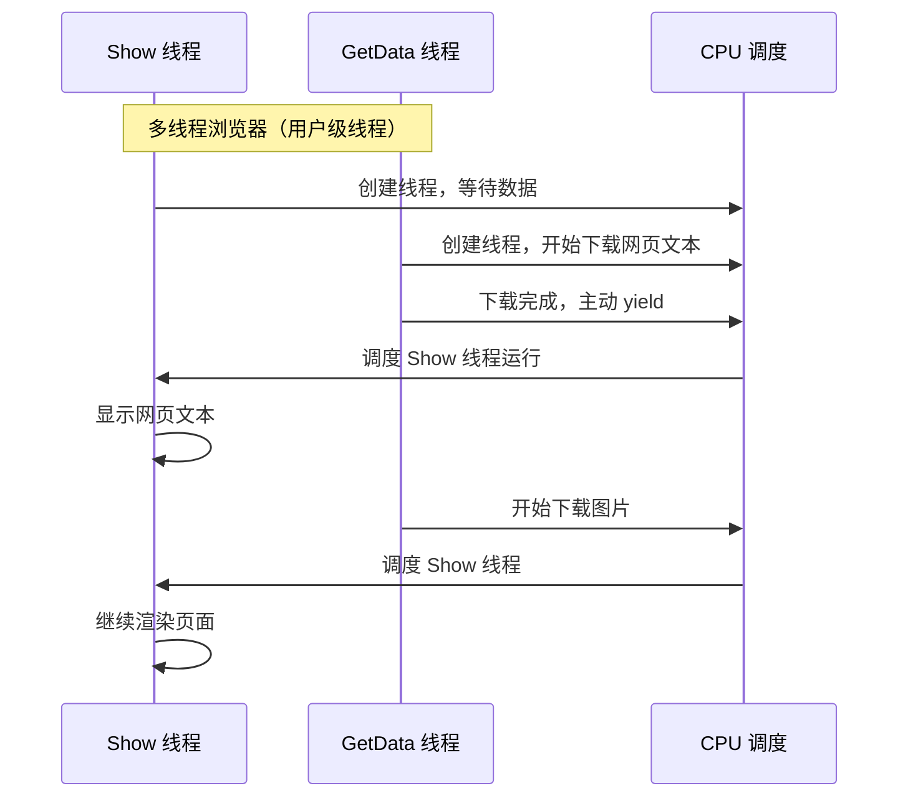

**说明**：

* IO 与渲染并发进行
* 用户界面始终保持响应

---

## 七、必须点出的隐患：线程安全问题（必考）

由于线程共享地址空间：

* `GetData` 与 `Show` 同时访问 `buffer`
* 可能出现：

  * 数据未写完就被读取
  * 数据被覆盖
  * 状态不一致

**本质问题**：

> 多个线程并发访问共享数据，没有同步约束

---


# 两个执行序列与一个栈

## ——多线程为什么必须拥有独立栈


## 一、这个例子的核心目的

结论：

> **多个线程如果共享同一个栈，会导致执行现场被破坏，程序无法继续正确执行。**

因此引出操作系统中的一条**硬性设计原则**：

> **每个线程必须拥有独立的栈空间。**

---

## 二、场景设定：两个“线程”，一个栈

假设存在两个并发执行序列（可理解为两个线程），但**错误地共享同一个进程栈**。

### 执行序列 1（线程 1）

```c
// 地址 100
void A() {
    B();   // 返回地址 104
}

// 地址 200
void B() {
    Yield();   // 地址 204
}
```

### 执行序列 2（线程 2）

```c
// 地址 300
void C() {
    D();   // 返回地址 304
}

// 地址 400
void D() {
    Yield();   // 地址 404
}
```

---

## 三、共享栈下的实际执行过程


### 步骤 1：线程 1 运行到 `B()` 中的 `Yield()`

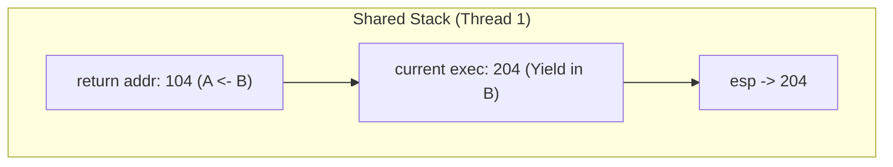

说明：
* 步骤 1：线程 1 先运行

* A() 调用 B()

* 栈中压入返回地址 104

* 执行到 B() 中的 Yield()（204）

* 当前栈保存的是：线程 1 的执行现场
---

### 步骤 2：第一次切换（线程 1 → 线程 2）

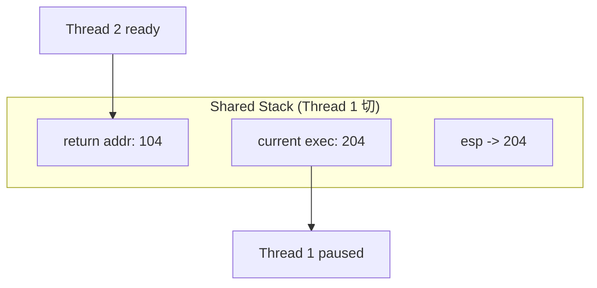

* Yield() 切换到线程 2

* 线程 1 的执行现场依赖当前栈内容保存

---

### 步骤 3：线程 2 运行，覆盖共享栈

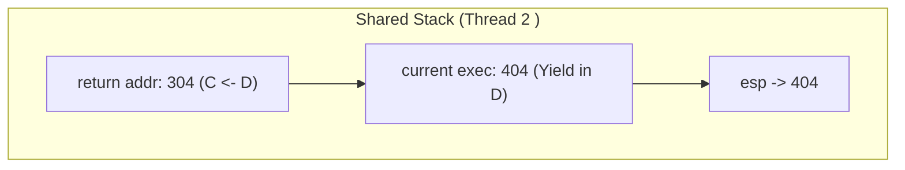

* C() 调用 D()

* 栈中压入返回地址 304

* 执行到 D() 中的 Yield()（404）
**含义是**：
`104 / 204` 已经被 `304 / 404` 覆盖

---

### 步骤 4：第二次切换失败（找不到线程 1 现场）

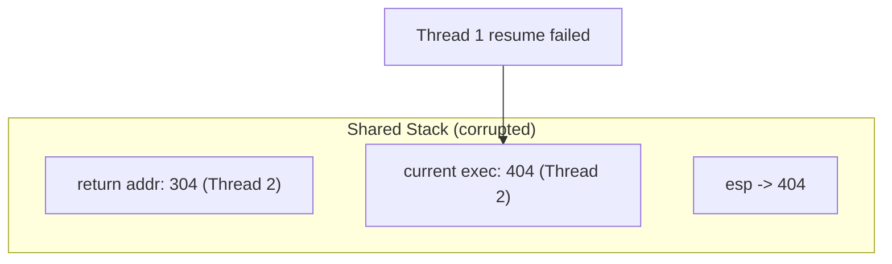
* 线程 2 调用 Yield()，试图返回线程 1

* 但此时栈中已经没有线程 1 的返回地址 204

* 执行流无法恢复，程序行为失控
---

### 总结图


---


## 结论

> **线程切换的前提是：执行现场必须完整保存，而执行现场依赖于栈。
> 因此，每个线程必须拥有独立的栈空间。**


---

## 四、问题本质

### 1. 栈里保存的是什么？

栈中保存的是**线程的执行现场**，包括：

* 返回地址（PC）
* 局部变量
* 调用关系

### 2. 错误的根源

* 两个线程 **共享一个栈**
* 栈帧相互覆盖
* 被切换出去的线程，其执行现场被破坏

### 3. 直接后果

* 无法正确返回原来的执行位置
* 程序崩溃或执行顺序错乱

---

## 五、结论

1. **线程切换必须保存执行现场**

   * 包括 PC 和栈指针 `esp`

2. **共享栈是不可行的**

   * 多线程共享栈会导致栈帧覆盖
   * 执行现场丢失，程序无法恢复

3. **操作系统的设计原则**

   > **每个线程必须拥有独立的栈空间**

---

## 六、`Yield()` 的真实含义

* `Yield()` 表示线程**主动让出 CPU**
* 在让出之前，必须：

  * 保存当前线程的 `PC`
  * 保存当前线程的 `esp`
  * 将它们写入线程控制块（TCB）
* 切换回来时，从 TCB 中恢复
 **没有独立栈，这一步根本无法成立**

---

## 七、 独立栈

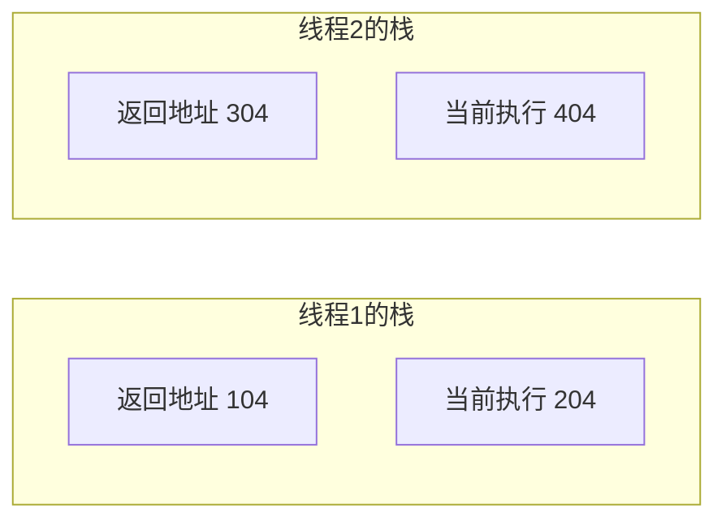

**正确设计：**

* 每个线程一份栈
* 切换只需切换 `esp`

**错误设计：**

* 多线程共享一份栈
* 栈帧覆盖 → 执行现场丢失

---

## 八、总结

> **线程是共享资源的执行单元，但“执行现场”必须私有，而栈正是执行现场的核心载体。**

---


# 从一个栈到两个栈

---

## 一、问题回顾与核心解决思路

上一页已经证明：

> **多个线程如果共享同一个栈，在线程切换时一定会发生栈帧覆盖，导致执行现场丢失。**

因此，操作系统给出的**标准解决方案**是：

> **为每个线程分配独立的栈空间，并在切换时显式保存 / 恢复栈指针。**

这正是“线程 ≠ 进程，但线程也有自己执行现场”的本质体现。

---

## 二、关键组件

### 1. 线程控制块（TCB）

每个线程在内核（或线程库）中都有一个 **TCB（Thread Control Block）**，至少包含：

* 线程标识
* 程序计数器（PC）
* **栈指针（esp）**

在本例中：

* **TCB1**：对应线程 1，保存 `esp = 1000`
* **TCB2**：对应线程 2，保存 `esp = 2000`

> **TCB 的作用**：
> 在线程切换时，保存当前线程的执行现场，并恢复目标线程的执行现场。

---

### 2. 独立的线程栈

* **线程 1 栈（起始地址 1000）**

  * 返回地址：104
  * 当前执行地址：204
* **线程 2 栈（起始地址 2000）**

  * 返回地址：304
  * 当前执行地址：404

**关键结论**：

> 栈的物理地址不同 → 栈帧永不覆盖 → 执行现场永久安全

---

## 三、修正后的 `Yield()` 思想

```c
void Yield() {
    // 保存当前线程的栈指针
    current_TCB->esp = esp;

    // 切换到下一个线程
    next_TCB = scheduler();

    // 恢复目标线程的栈指针
    esp = next_TCB->esp;

    // PC 的恢复由上下文切换机制完成
}
```

### 为什么必须去掉 `jmp 204` ？

* 不同线程的恢复地址 **不相同**
* 硬编码跳转地址：

  * 不通用
  * 不可扩展
  * 不符合线程抽象

**正确做法**：

> PC 和 esp 一起作为“执行现场”，统一由 TCB 保存和恢复

---

## 四、执行流程（逻辑串联）

1. 线程 1 运行时：

   * `esp → 1000` 对应的栈
   * 执行到 `204` 暂停
2. 发生 `Yield()`：

   * 当前线程的 `esp` 保存进 TCB
3. 切换到线程 2：

   * 从 TCB2 恢复 `esp → 2000`
   * 从 `404` 继续执行
4. 再次切换回来：

   * 线程 1 的栈内容仍完整存在
   * 执行从 `204` 正确恢复

---

## 五、状态示意图

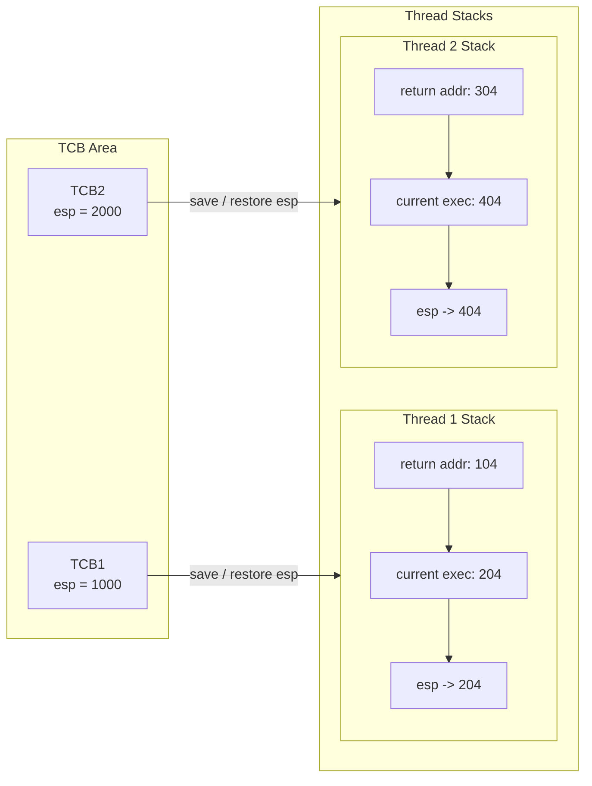

---

## 六、总结

1. **线程切换的本质是执行现场的保存与恢复**
2. **每个线程必须拥有独立的栈，否则执行流必然混乱**
3. **TCB + 独立栈 是线程存在的最低硬件与软件条件**

---

# 多线程完整实现

## 一、两个线程的核心结构（TCB + 独立栈）
### 核心知识点
线程的本质是**共享进程资源 + 独立执行现场**，创建线程的核心就是为每个线程分配：
1.  **线程控制块（TCB）**：保存线程的执行现场（栈指针`esp`、程序计数器`PC`等）
2.  **独立栈空间**：存储线程的局部变量、返回地址，避免栈帧覆盖
3.  关联TCB与栈：通过`esp`指针绑定，确保切换时能正确恢复执行现场

### 代码拆解：`ThreadCreate` 核心实现
```c
void ThreadCreate(A)
{
    // 1. 分配线程控制块（TCB）
    TCB *tcb = malloc();
    // 2. 分配独立栈空间
    *stack = malloc();
    // 3. 将线程入口函数（A）的地址压入栈顶
    *stack = A;  // A的地址为100
    // 4. 关联TCB与栈：设置TCB的esp指向栈顶
    tcb.esp = stack;
}
```
> 关键设计：栈中压入函数入口地址，线程启动时从该地址开始执行；TCB保存`esp`，确保切换时能找到栈的位置。

### 内存布局示意图（Mermaid）
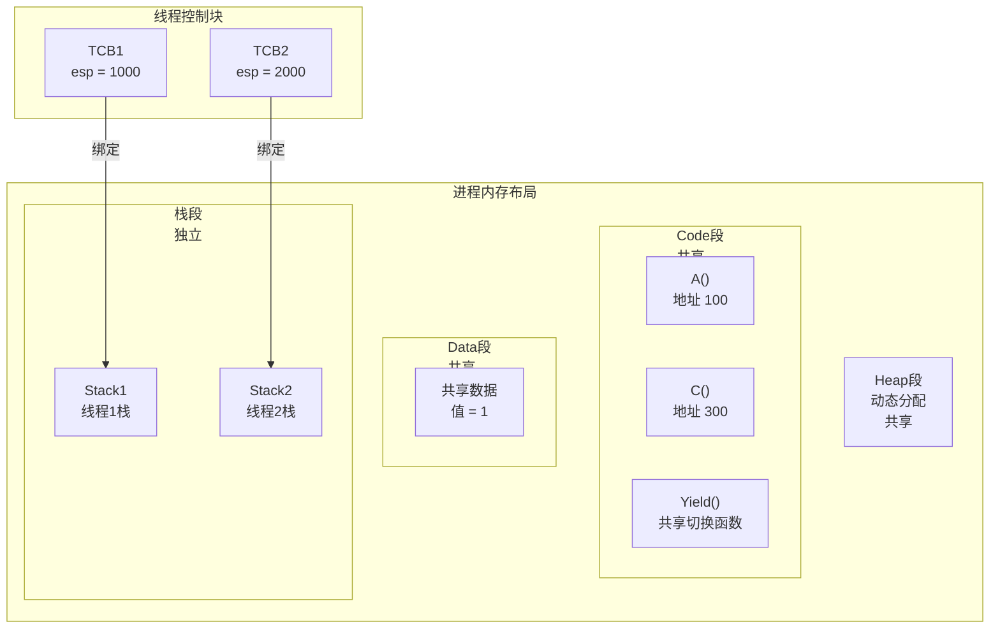

---

## 二、多线程浏览器完整实现
### 核心逻辑
将**线程创建**、**上下文切换**、**业务逻辑（GetData/Show）**整合，形成可运行的多线程程序，核心是通过`Yield()`实现线程间的协作式切换。

### 完整代码拆解
#### 1. 主入口：`WebExplorer`
```c
void WebExplorer()  // 等价于main()
{
    // 创建GetData线程，传递URL和共享buffer
    ThreadCreate(GetData, URL, buffer);
    // 创建Show线程，传递共享buffer
    ThreadCreate(Show, buffer);
    // 主线程进入循环，主动触发线程切换
    while(1) Yield();
}
```

#### 2. 业务线程：`GetData`
```c
void GetData(char *URL, char *p)
{
    连接URL;
    下载数据到buffer;
    Yield();  // 下载完成后主动切换，让Show线程渲染
    ...
}
```

#### 3. 线程创建：`ThreadCreate`
```c
void ThreadCreate(func, arg1)
{
    申请独立栈空间;
    申请TCB;
    将func和arg1压入栈;
    关联TCB与栈（设置tcb.esp = 栈顶）;
}
```

#### 4. 上下文切换：`Yield`
```c
void Yield()
{
    压入当前执行现场（寄存器、PC等）;
    将当前esp保存到当前TCB;
    Next();  // 调度函数：选择下一个要执行的线程（可优先调度Show）
    从下一个TCB中取出esp;
    恢复执行现场，切换到新线程的栈;
}
```

#### 5. 编译命令
```bash
gcc -o explorer get.c yield.c ...  # 手动链接
# 或使用线程库
gcc get.c ... -lthread
```

### 执行时序示意图（Mermaid）
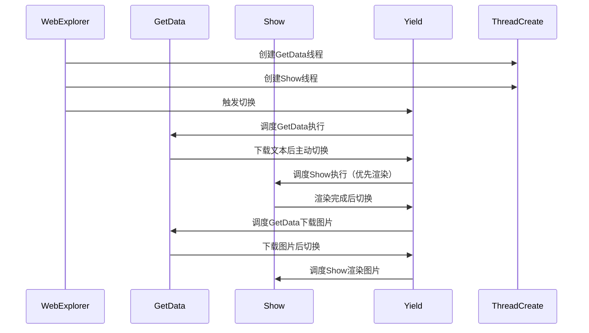


# 用户级线程 对比 内核级线程

---

## 一、用户级线程（ULT，User-Level Thread）

### 1. 本质定义

> **内核只看到进程，看不到线程；线程由用户态线程库管理。**

---

### 2. 核心特征（必背）

* **管理位置**：用户空间（线程库）
* **内核视角**：一个进程 = 一个执行单元
* **切换方式**：用户态 `Yield()`，不陷入内核
* **调度方式**：协作式（线程自己让出 CPU）
* **切换开销**：极小

---

### 3. 致命缺陷（考试重点）

* **阻塞扩散问题**
  只要**一个线程**因系统调用阻塞（如 IO）：

  >  **整个进程被内核挂起**
* 即使同一进程中还有其他“就绪线程”，也**无法运行**

> 例：
> `GetData` 等网络 → 阻塞
> `Show` 明明就绪 → 也跑不了

---

### 4. 结构示意图

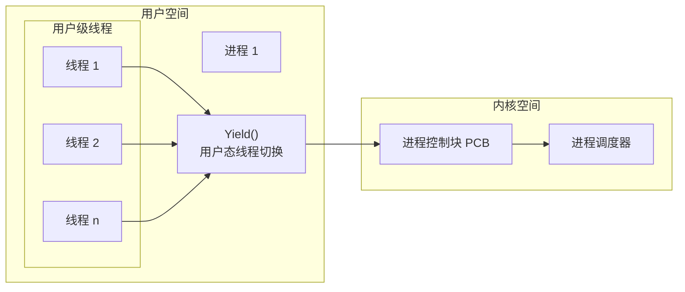

**图要点**：

* 线程全在用户空间
* 内核只调度 **PCB**

---

## 二、内核级线程（KLT，Kernel-Level Thread）

### 1. 本质定义

> **内核直接管理线程，调度单位是线程本身。**

---

### 2. 核心特征（必背）

* **管理位置**：内核
* **内核视角**：一个进程 = 多个线程
* **切换方式**：内核态切换
* **调度方式**：抢占式（内核决定）
* **切换开销**：较大（陷入内核）

---

### 3. 核心优势（与 ULT 对照）

* **阻塞不扩散**

  * 一个线程阻塞
  * 内核仍可调度同进程的其他线程
* **支持多 CPU 并行**

  * 不同线程可同时运行在不同 CPU 上

---

### 4. 结构示意图（可直接用）

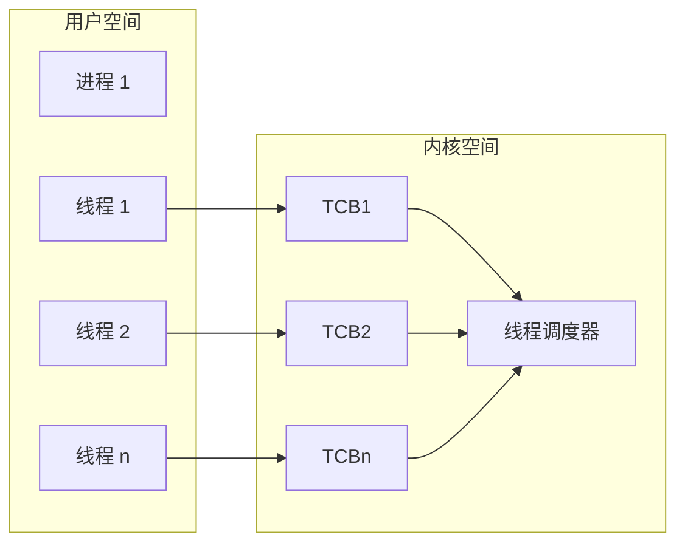

**图要点**：

* 每个线程都有 **内核 TCB**
* 内核直接调度线程

---

## 三、ULT vs KLT 对比表（高频考点）

| 对比维度     | 用户级线程（ULT） | 内核级线程（KLT） |
| -------- | ---------- | ---------- |
| 管理者      | 用户态线程库     | 内核         |
| 内核是否感知线程 | 否          | 是          |
| 调度单位     | 进程         | 线程         |
| 切换位置     | 用户空间       | 内核空间       |
| 切换开销     | 小          | 大          |
| IO 阻塞影响  | 阻塞整个进程     | 只阻塞当前线程    |
| 调度方式     | 协作式        | 抢占式        |
| 多 CPU 并行 | 不支持        | 支持         |

---

## 四、总结

* **用户级线程**：
  切换快，但一个线程阻塞会拖死整个进程
* **内核级线程**：
  切换慢，但阻塞隔离、支持多核并行
* **现代操作系统**：
  基本都采用 **内核级线程** 或 **混合模型**

---


