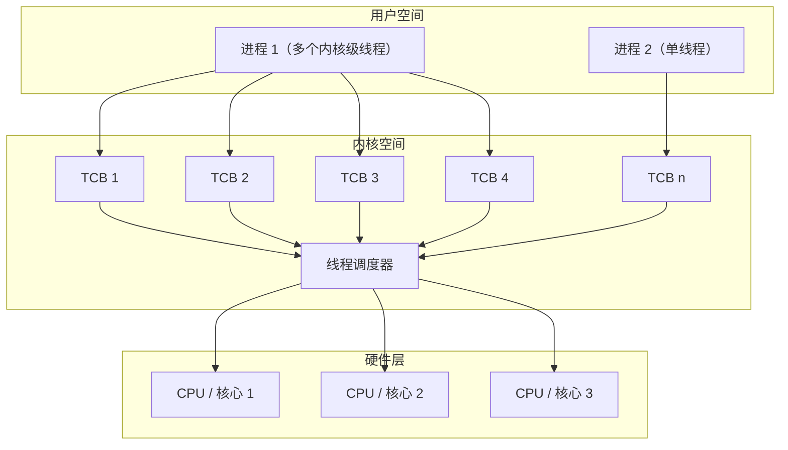
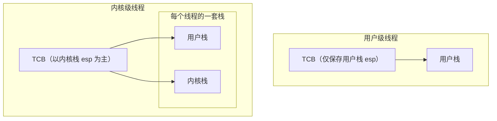
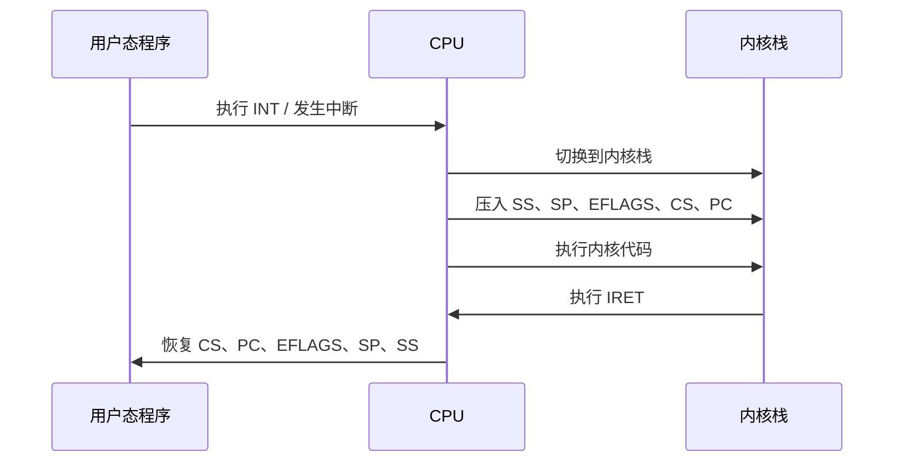

# 内核级线程

> 核心问题：为什么在多核 / 多处理器系统中，操作系统必须使用内核级线程？


## 一、核心结论

> **只有内核级线程，才能让一个进程中的多个执行流真正同时运行在多个 CPU / 核心上。**

用户级线程在多核环境下：

* 只能“看起来同时”
* 实际上仍然**只能占用一个 CPU**

---

## 二、整体层级关系

内核级线程的优势，来自于三层结构的配合：

```
用户空间（线程） 
        ↓
内核空间（线程调度）
        ↓
硬件层（多 CPU / 多核）
```

内核**感知线程**，才能把线程直接映射到硬件执行单元。

---

## 三、内核级线程在多核场景下的三大核心优势

### 1. 真正的并行（Parallelism，而非 Concurrency）

* 内核为**每个线程**维护独立 TCB
* 调度器的调度单位是**线程**
* 因此可以做到：

> 同一进程的不同线程
> → 被同时调度到不同 CPU / 核心上运行

这是真正的**并行执行**，不是时间片切换。

**对比：**

* 用户级线程：并发（假并行）
* 内核级线程：并行（真并行）

---

### 2. 阻塞不扩散（多核下尤为关键）

在内核级线程模型中：

* 某个线程因 IO 阻塞
* 内核仅阻塞**该线程**
* 其余线程：

  * 仍可被调度
  * 仍可占用其他 CPU / 核心

> 在多核系统中，这意味着 **CPU 利用率不会被白白浪费**

---

### 3. 硬件并行能力的直接利用

#### （1）多处理器（Multi-Processor）

* 多个物理 CPU
* 每个 CPU：

  * 独立 Cache
  * 独立 MMU
* 内核可将线程分配到不同 CPU

#### （2）多核（Multi-Core）

* 单一 CPU 芯片
* 多个核心
* 共享 Cache / MMU
* 内核可将线程分配到不同核心

> **无论哪种硬件结构，KLT 都能直接吃满硬件并行能力**

---

## 四、用户级线程 vs 内核级线程（多核场景对比）

| 维度       | 用户级线程（ULT） | 内核级线程（KLT） |
| -------- | ---------- | ---------- |
| 内核是否感知线程 | 否          | 是          |
| 调度单位     | 进程         | 线程         |
| 多核利用能力   | 无法利用       | 充分利用       |
| 执行形态     | 并发（切换）     | 并行（同时）     |
| IO 阻塞影响  | 整个进程阻塞     | 仅当前线程阻塞    |

---

## 五、结构示意图




* 用户空间只有“线程概念”
* 内核通过 TCB 管理线程
* 调度器把线程直接派发到 CPU / 核心

---

## 六、总结

> **多核系统的性能提升，前提是“调度单位必须是线程”，
> 因此必须采用内核级线程模型。**

---


# 笔记整理：内核级线程和用户级线程核心差异分析 

> 本页回答三个核心问题：
> **谁管线程？栈怎么配？切换时到底切什么？**

---

## 一、核心差异总览（考试直接用）

| 对比维度     | 用户级线程（ULT）      | 内核级线程（KLT）                  |
| -------- | --------------- | --------------------------- |
| 线程创建     | 用户态库函数          | 系统调用，进入内核                   |
| 内核是否感知线程 | 否（只看到进程）        | 是（直接管理线程）                   |
| TCB 管理   | 用户空间线程库         | 内核直接维护                      |
| 线程切换     | 用户态完成（Yield 可见） | 内核完成（Yield 不可见）             |
| 栈结构      | 每线程 1 个用户栈      | **每线程 1 套栈（用户栈 + 内核栈）**     |
| TCB 关联   | 仅用户栈 esp        | **以内核栈 esp 为主，同时记录用户栈 esp** |

---

## 二、最关键的本质变化：**从“一个栈”到“一套栈”**

### 1. 用户级线程（ULT）

* 线程始终运行在用户态
* 不会真正进入内核
* 因此：

  * **只需要用户栈**
  * TCB 里只保存用户栈的 `esp`

> 切换 = 切用户栈

---

### 2. 内核级线程（KLT）

* 线程可能：

  * 执行用户代码（用户态）
  * 进入系统调用 / 中断（内核态）
* 因此 **必须分离两种执行现场**

#### 每个线程拥有：

* **用户栈**：
  保存用户函数调用、局部变量、返回地址
* **内核栈**：
  保存系统调用 / 中断时的内核执行现场

> 这是操作系统的硬性要求，不是实现习惯问题

---

## 三、TCB 到底“绑”谁？（高频考点）

### 用户级线程

* TCB 只关心一件事：

  * 当前用户栈的 `esp`

### 内核级线程

* TCB 至少记录：

  * **内核栈 esp**（调度的第一现场）
  * 用户栈 esp（返回用户态时使用）

> **调度发生在内核态，所以 TCB 以“内核栈”为锚点**

---

## 四、线程切换时，内核到底做了什么？

### 用户级线程切换

1. 保存当前用户栈 esp
2. 恢复目标线程的用户栈 esp
3. 继续执行

✔ 快
✘ 一旦阻塞，整个进程完蛋

---

### 内核级线程切换（标准流程）

1. 保存当前线程：

   * 内核栈 esp
   * 用户栈 esp
2. 调度器选择下一个线程
3. 恢复目标线程：

   * 先切内核栈 esp
   * 再切用户栈 esp
4. 返回用户态继续执行

✔ 稳定
✔ 支持多核
✘ 开销更大

---

## 五、栈结构示意图



**读图要点：**

* ULT：TCB → 用户栈
* KLT：TCB → 内核栈（主）+ 用户栈（辅）

---

## 六、总结

> **用户级线程：切的是用户栈**
> **内核级线程：切的是内核栈，再回用户栈**

---


# 用户栈与内核栈的关联机制（详解一套和一个) 

> 本页解决一个核心问题：
> **CPU 是如何在“用户栈”和“内核栈”之间安全切换的？**


## 一、为什么“一个栈”不够用？（引出问题）

### 假设只有一个栈（用户栈）

当用户程序执行到系统调用或中断时：

* CPU 需要保存：

  * 当前执行位置（PC）
  * 寄存器状态
  * 标志寄存器
* 然后跳转执行内核代码

⚠ 问题来了：

* 内核代码如果还用**用户栈**：

  * 用户程序可以伪造/破坏栈内容
  * 多线程时，现场会互相覆盖
  * 内核安全性、稳定性彻底崩溃

 **结论**：
**内核绝对不能使用用户栈**

---

## 二、标准解决方案：每个线程“一套栈”

> 这就是反复强调的：
> **“不是一个栈，是一套栈”**

### 一套栈 = 两个栈

| 栈类型 | 用途                 |
| --- | ------------------ |
| 用户栈 | 用户态函数调用、局部变量       |
| 内核栈 | 内核态（中断 / 系统调用）执行现场 |

并且：

* **每个内核级线程都有自己的一套栈**
* 不同线程的内核栈彼此隔离

---

## 三、中断：连接“用户栈 ↔ 内核栈”的关键机制


> **“中断又一次帮助了操作系统”**

指的正是这里。

---

## 四、从用户态 → 内核态（INT 触发）

### 发生条件

* 系统调用（如 `int 0x80`）
* 硬件中断（时钟、IO）

### CPU 自动完成的事情（**硬件级别**）

>  不是操作系统代码手动做的，是 CPU 指令级支持

CPU 会**自动切换到当前线程的内核栈**，并按固定顺序压入：

| 压入内核栈的内容 | 含义       |
| -------- | -------- |
| SS       | 用户栈段     |
| SP       | 用户栈指针    |
| EFLAGS   | CPU 状态   |
| CS       | 用户代码段    |
| PC       | 用户态下一条指令 |

 **关键点**：

* **用户栈指针 SP 被保存到了内核栈**
* 内核因此“知道用户栈在哪里”

---

## 五、在内核态执行期间，用的是谁的栈？

答案非常重要：

> **只用内核栈**

* 系统调用处理函数
* 中断处理程序
* 调度器
* 上下文切换代码

全部运行在 **当前线程的内核栈** 上。

 这也是为什么：

* **TCB 必须关联内核栈**
* 内核调度是“以内核栈为锚点”的

---

## 六、从内核态 → 用户态（IRET 返回）

当内核处理完成，执行 `IRET` 指令：

CPU 会**自动反向弹栈**：

1. 弹出 CS
2. 弹出 PC
3. 弹出 EFLAGS
4. 弹出 SP
5. 弹出 SS

结果：

* 用户栈恢复
* 程序从中断前的位置继续执行
* 像“什么都没发生过”

---

## 七、流程示意



---

## 八、和“一个栈 vs 一套栈”的直接对应关系

### 用户级线程（一个栈）

* 没有内核栈
* 没有真正的中断切换
* 一阻塞 → 全进程挂起

### 内核级线程（一套栈）

* 每线程：用户栈 + 内核栈
* 中断时自动切内核栈
* 可安全抢占、可多核调度

---

## 九、总结

> **内核级线程之所以必须有内核栈，是因为中断和系统调用发生在内核态，而 CPU 在中断时会自动把用户态执行现场压入内核栈，只有“一套栈”才能保证执行现场不被破坏。**


# 代码样例

> **用户级线程：一个线程只有「一个栈」（用户栈）**
> **内核级线程：一个线程有「一套栈」（用户栈 + 内核栈）**

而**系统调用 `int 0x80`**，就是把
**“一个栈不够用”**
**“为什么必须要一套栈”**

---

## 一、从代码出发：先只看「用户栈」

### 用户态调用链

* 用户程序

```c
A() {        // 100
    B();     // return -> 104
}

B() {        // 200
    read();  // return -> 204
}

read() {     // 300
    int 0x80; // return -> 304
}
```

### 此时：**只有一个用户栈**

```
| 204 |  ← B() 返回地址
| 104 |  ← A() 返回地址
```

**关键点：**

* 这一步 **完全在用户态**
* 栈里 **全是用户函数的返回地址**
* **还没出现“内核栈”**

---

## 二、`int 0x80` 出现的瞬间：为什么“一个栈不够了”

执行到：

```c
int 0x80;
```

CPU 要做三件“用户自己绝对不能干的事”：

1. 切换到 **内核态**
2. 执行 **内核代码**
3. 将来 **还能回到刚才的用户现场**

### 问题来了

**内核代码能不能用用户栈？**

**不能：**

* 用户栈在用户地址空间
* 内核不能信任用户栈
* 用户栈可能被破坏 / 越界 / 不安全

---

## 三、于是：硬件强制引入「内核栈」

### `int 0x80` 干了什么（考试核心）

CPU **自动完成**：

```
用户态 → 内核态
用户栈 → 内核栈
```

并且把**用户态的现场**压入**内核栈**：

```
内核栈（当前线程专属）：
| 用户SS |
| 用户SP |
| EFLAGS |
| 用户CS |
| 用户PC (=304) |
```

这一步的本质是：

> **“我现在要离开用户栈了，但我得记住它”**

---

## 四、这一步直接回答了「一个栈 vs 一套栈」

### 1 用户级线程（一个栈）

* 线程 **从不进入内核**
* 不需要保存 `SS/SP`
* 不需要内核态执行
*  **一个用户栈就够**

### 2 内核级线程（一套栈）

* 线程 **必然进入内核**
* 需要：

  * 用户态执行 → 用户栈
  * 内核态执行 → 内核栈
*  **必须是一套栈**

> 这不是设计选择
> **这是硬件 + 安全强制要求**

---

## 五、继续看流程：内核为什么“只认内核栈”

内核态执行：

* 内核程序
```c
//1000:
system_call();
    call sys_read(); // 2000
```

此时：

* 函数调用
* 局部变量
* 返回地址 `1000`

**全都压在内核栈**

 用户栈 **完全不动**

---

## 六、`IRET`：两套栈重新“接上”的瞬间

`IRET` 干的事可以一句话概括：

> **“把刚才存在内核栈里的用户态现场，原封不动还给 CPU”**

顺序是硬件规定好的：

```
CS
PC (=304)
EFLAGS
SP
SS
```

然后：

```
CPU 回到用户态
继续用 用户栈
```

用户栈状态恢复成：

```
| 204 |
| 104 |
```

---

## 七、理解

> **内核级线程不是“多一个栈”，而是“多一个执行空间”**

| 执行状态 | 用什么栈 |
| ---- | ---- |
| 用户态  | 用户栈  |
| 内核态  | 内核栈  |

 **所以叫“一套栈”**

---

## 八、总结

* 用户级线程：
  **线程始终在用户态执行，仅需要一个用户栈**

* 内核级线程：
  **线程可能在用户态和内核态之间切换，因此每个线程必须拥有一套栈（用户栈 + 内核栈）**

* 系统调用 `int 0x80`：
  **是从“一个栈不够用”过渡到“必须一套栈”的硬件证据**

---


> **内核级线程切换的本质不是“跳到另一个函数”，而是“换了一根内核栈”，然后用 `ret → iret` 把执行流自然带到另一个线程。**


---


## 一总览

> **内核级线程切换的本质：不是直接跳到用户程序，而是先切内核栈，再靠 `ret` → 内核代码 → `iret` 两级返回，最终回到用户态。**

这是老师反复强调 `switch_to` 的原因。

---

## 二、为什么线程切换一定发生在内核态？

代码关键：

```c
sys_read() {
    启动磁盘读;
    将自己变成阻塞;
    找到next线程;
    switch_to(cur, next);
}
```

结论：

> **线程切换只能在内核态发生**
> 因为：

* 只有内核能修改线程状态（就绪 / 阻塞）
* 只有内核能访问并修改 TCB
* 只有内核知道每个线程的内核栈地址

所以：
**`switch_to` 一定运行在内核态，使用的是内核栈**

---

## 三、线程 S：为什么内核栈里会有这么多东西？

你给出的线程 S 内核栈：

```
| 用户SS : 用户SP |
| EFLAGS |
| 用户PC = 304 |
| 用户CS |
| 1000 |
| ??? |
```

逐层拆：

### 1 前四项：INT 0x80 的“硬件自动压栈”

这是**用户态 → 内核态**时 CPU 自动做的：

```
SS
SP
EFLAGS
CS
PC (=304)
```

用途只有一个：
**将来能 `iret` 回到用户态继续执行**

---

### 2 `1000` 是什么？

> `1000` = `system_call` 中
> `call sys_read()` 的返回地址

这是一次**普通的内核函数调用压栈**，不是中断。

---

### 3 `???` 是什么？（这页的第一个关键点）

> `???` = **线程 S 在内核态被切走时的断点**

也就是：

```c
sys_read() {
    ...
    switch_to(cur, next);  // 就在这里被切走
}
```

CPU 需要记住：

> **将来线程 S 被再次调度时，要从 sys_read 的哪个位置继续执行**

所以这个返回地址也必须在内核栈中。

结论一句话版：

> **线程 S 的内核栈，保存的是：
> 用户态断点 + 内核态断点**

---

## 四、`switch_to` 真正干了哪三件事


> `switch_to: 仍然是通过TCB找到内核栈指针；然后通过ret切到某个内核程序；最后再用CS:PC切到用户程序`

逐条翻译：

---

### ① 通过 TCB 切换内核栈（最核心）

```c
switch_to(cur, next) {
    save cur->ksp;
    load next->ksp;
}
```

此时 CPU 并不知道“切线程”
它只知道：

> **当前栈变了**

但这一步已经决定了一切。

---

### ② `ret`：切到“另一个线程的内核执行流”

这是**最容易误解的一步**。

* `ret` 并不是“返回用户态”
* 它只是：

  > **从当前内核栈中弹出一个地址，继续在内核态执行**

而因为内核栈已经换成线程 T 的：

> `ret` 弹出的就是 **线程 T 预先准备好的内核入口**

---

## 五、线程 T：创建时为什么要“埋好坑”（问号全解）

你提到老师原话：

> “最关键的地方来了：T 创建时如何填写 ?? 和 ???? ”

现在我们一个个填。

---

### 1 `PC = 500` 是什么？

这是线程 T 的**用户态入口函数**：

```c
C() { ... }   // 地址 500
```

线程第一次运行，用户态就应该从这里开始。

---

### 2 `CS = ??` 是什么？

就是：

> **线程 T 的用户态代码段选择子**

和普通用户程序一样，没有任何特殊。

---

### 3 `????` 是什么？（整页最关键）

> **是一段包含 `iret` 的内核代码**

用途一句话说明：

> **这是“第二级返回”的跳板**

---

## 六、为什么需要“第二级返回”？（必考理解点）

回忆整个过程：

1. `switch_to` 用的是 **ret**
2. `ret` 只能：

   * 内核态 → 内核态
3. 但线程最终必须：

   * 内核态 → 用户态

那谁来完成这一步？

答案：

> **线程 T 的内核栈里，提前放了一段 `iret` 执行现场**

流程串起来是：

```
switch_to
  ↓
ret
  ↓
线程T内核态入口
  ↓
执行 iret
  ↓
恢复 CS:PC
  ↓
进入用户态 C()
```


> “先 ret 切到内核程序，
> 再用 CS:PC 切到用户程序”

---

## 七 、总结

> **内核级线程切换不是直接跳到用户态，而是：
> 切内核栈 → ret 进入目标线程的内核执行流 → iret 返回目标线程的用户态。
> 线程创建时必须在内核栈中预设好 iret 现场，否则线程无法启动。**


# 内核级线程创建 `ThreadCreate`：从“建线程”到“能被切换”

> 核心问题只有一个：
> **为什么一个新线程第一次被 `switch_to`，就能直接跑起来？**

答案就在 **ThreadCreate 对内核栈的初始化**。

---

## 一、ThreadCreate 的本质任务（先给总览）

`ThreadCreate` 干的不是“启动线程”，而是：

1. 给线程准备 **将来被调度时所需的一切现场**
2. 让调度器 **只靠切内核栈就能运行它**

所以它的核心不是“创建”，而是：

> **伪造一个“已经被中断过”的线程现场**

---

## 二、ThreadCreate 完整流程（按执行顺序）

```c
void ThreadCreate(...)
{
    // 1. 分配线程控制块
    TCB tcb = get_free_page();

    // 2. 分配内核栈
    krlstack = alloc_kernel_stack();

    // 3. 分配 / 传入用户栈
    userstack = alloc_or_pass_user_stack();

    // 4. 初始化用户栈和内核栈（关键）
    init_user_stack(userstack);
    init_kernel_stack(krlstack, userstack);

    // 5. TCB 绑定内核栈
    tcb.esp = krlstack;

    // 6. 设置状态为就绪
    tcb.state = READY;

    // 7. 加入就绪队列
    ready_queue.push(tcb);
}
```

真正决定“这个线程能不能被切换运行”的，只有 **第 4、5 步**。

---

## 三、用户栈初始化：只解决一件事

### 用户栈里放什么？

* 线程入口函数 `C()` 的参数
* 初始的用户态调用环境

### 用户栈解决的问题是：

> **当线程进入用户态时，函数 C() 能正常执行**

注意：
用户栈 **不参与线程切换**，切换发生在内核栈。

---

## 四、内核栈初始化：整页的灵魂


> **线程创建时，内核栈里必须“提前放好 iret 所需的一切东西”**

因为将来第一次调度这个线程时：

* 不会经历 `int 0x80`
* 不会自然产生中断现场
* 但 `switch_to` 仍然会用 `ret + iret` 恢复它

---

### 2. 内核栈里到底“预存”了什么？

按老师图里的顺序，对应你笔记中的表格：

#### （1）用户态现场（给 iret 用）

```
SS : SP     // 用户栈位置
EFLAGS      // CPU 状态
PC = 500    // 用户态入口 C()
CS          // 用户代码段
```

作用只有一个：

> **让 iret 之后，CPU 直接从 C() 开始执行**

---

#### （2）寄存器恢复代码

```
popa
pop ds
```

作用：

* 恢复通用寄存器
* 恢复段寄存器
* 模拟一次“完整中断返回前的状态”

---

#### （3）中断出口代码（最关键）

```
iret
```

这一步完成：

> **内核态 → 用户态 的“第二级返回”**

---

### 3. 这一步解决了什么问题？
那个疑问：

> “怎么通过内核栈切换用户栈？”

答案：

> **因为内核栈里已经预存了用户栈的 SS:SP，
> `iret` 会自动恢复用户栈指针，从而完成用户栈切换。**

---

## 五、TCB 只绑内核栈的真正原因（必考理解）

```c
tcb.esp = krlstack;
```

这行代码意味着：

1. 调度器切线程时
2. 只需要：

   * 保存当前 `esp`
   * 恢复目标 `esp`
3. CPU 接下来做的所有事：

   * `ret`
   * 执行内核代码
   * `iret`

**全部由内核栈内容自动驱动**

所以：

> **TCB 不需要直接关心用户栈
> 用户栈是被“内核栈间接管理”的**

---

## 六、把 ThreadCreate 和 switch_to 串成一条线

### ThreadCreate 做的事：

* 提前伪造好：

  * 一次“中断返回现场”
  * 一次“内核执行流入口”

### switch_to 做的事：

1. 切内核栈（通过 TCB）
2. `ret` → 进入该线程的内核执行流
3. 执行到预设的 `iret`
4. 回到用户态执行 `C()`

**两者是前后配合的一套设计**。

---

## 七、内核级线程总结

1. 内核级线程创建时，真正关键的是 **内核栈初始化**
2. 内核栈中必须预存：

   * 用户态 CS、PC、SS、SP、EFLAGS
   * 寄存器恢复代码
   * `iret` 中断出口
3. TCB 只绑定内核栈指针，线程切换完全依赖内核栈
4. 新线程第一次运行，并不是从用户态开始，而是：

   * 先在内核态
   * 再通过 `iret` 返回用户态

---