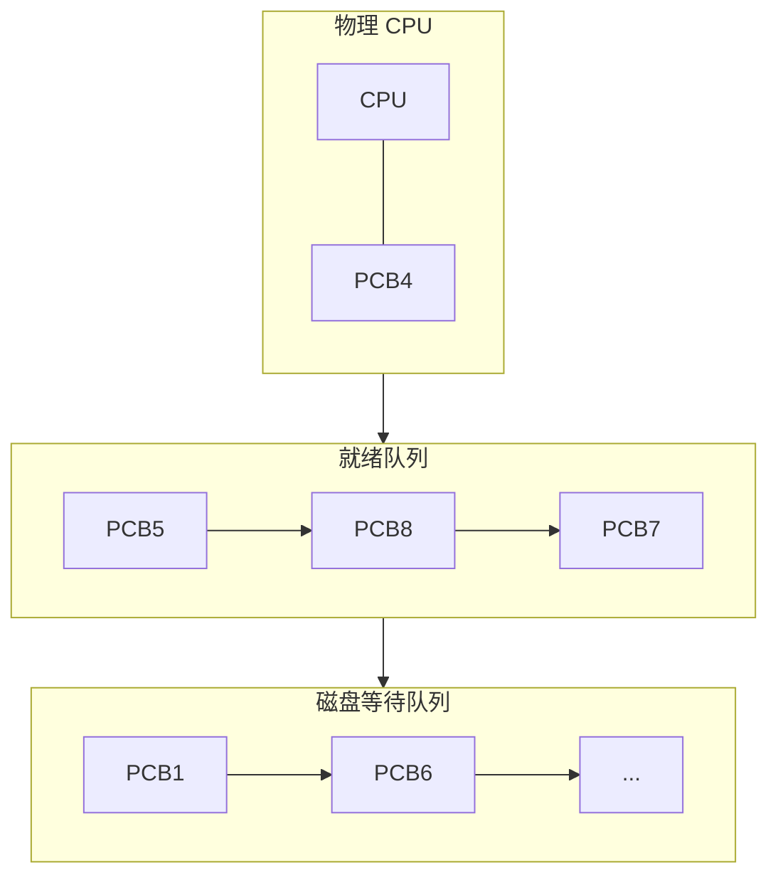
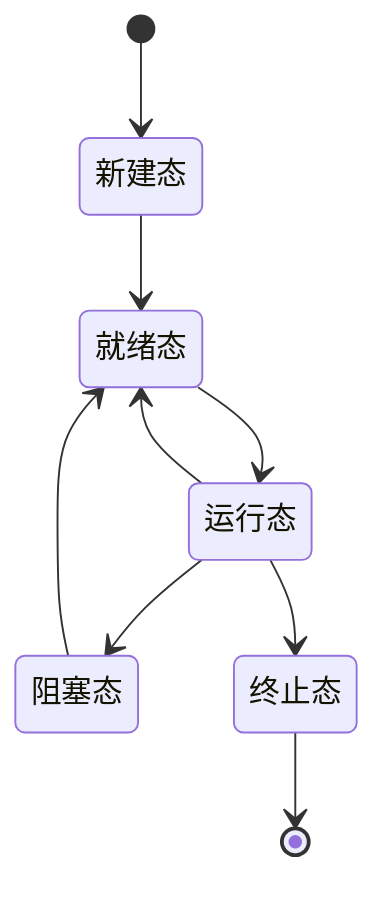
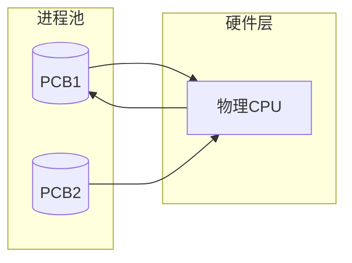
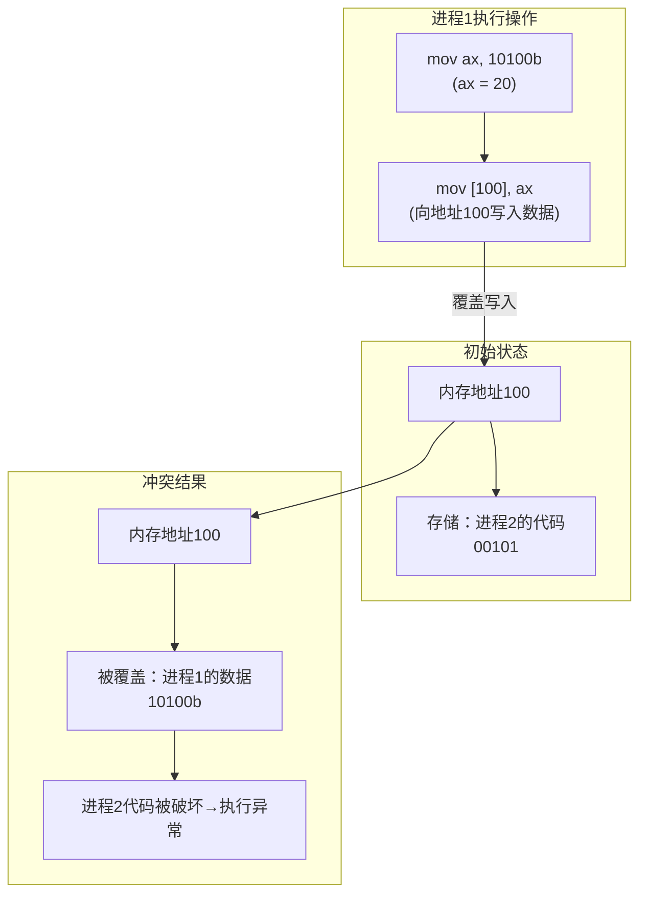
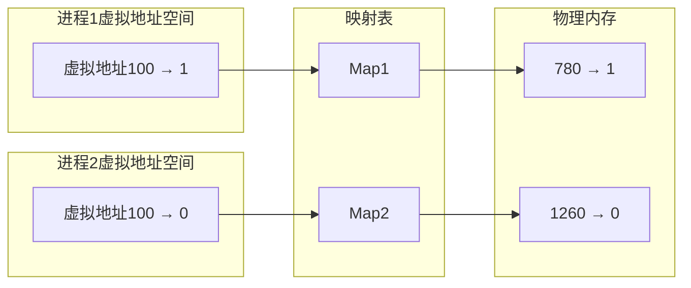
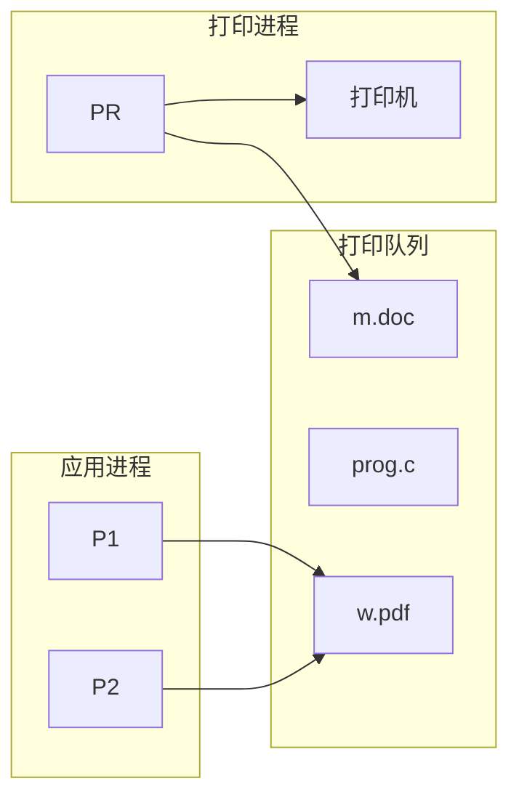
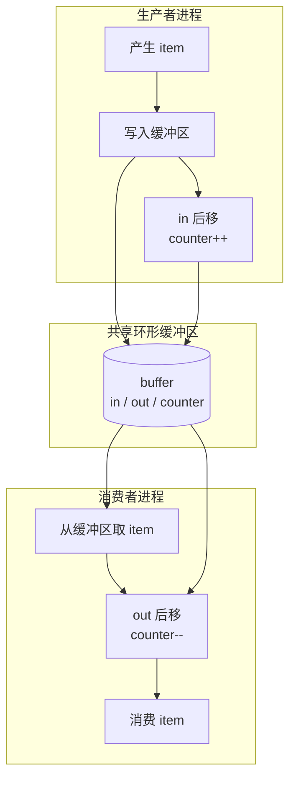
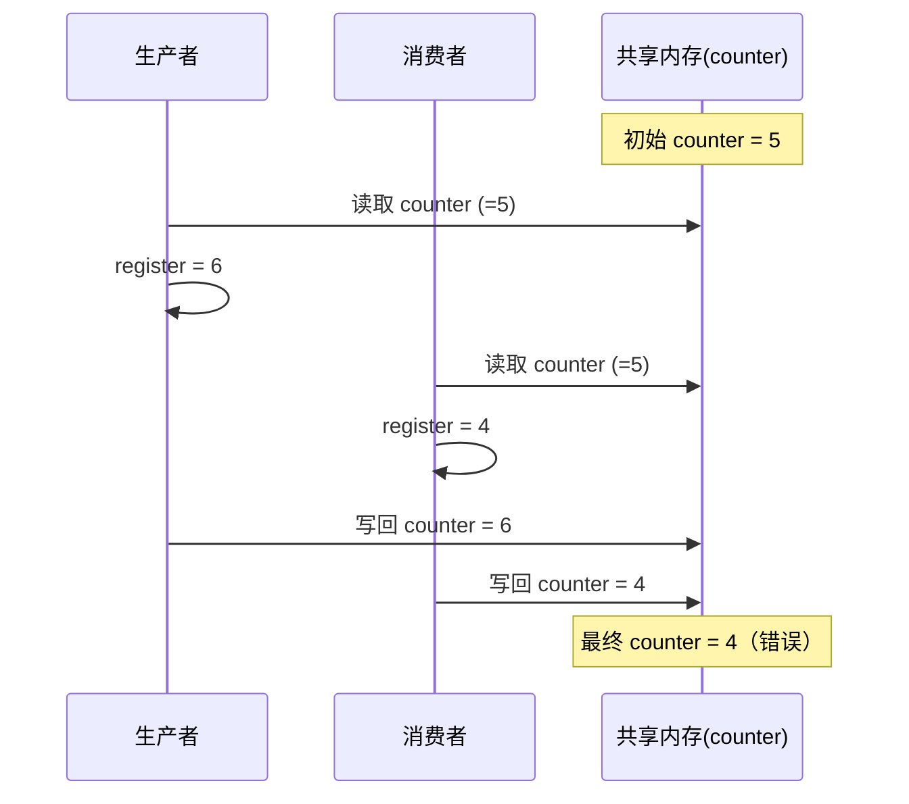
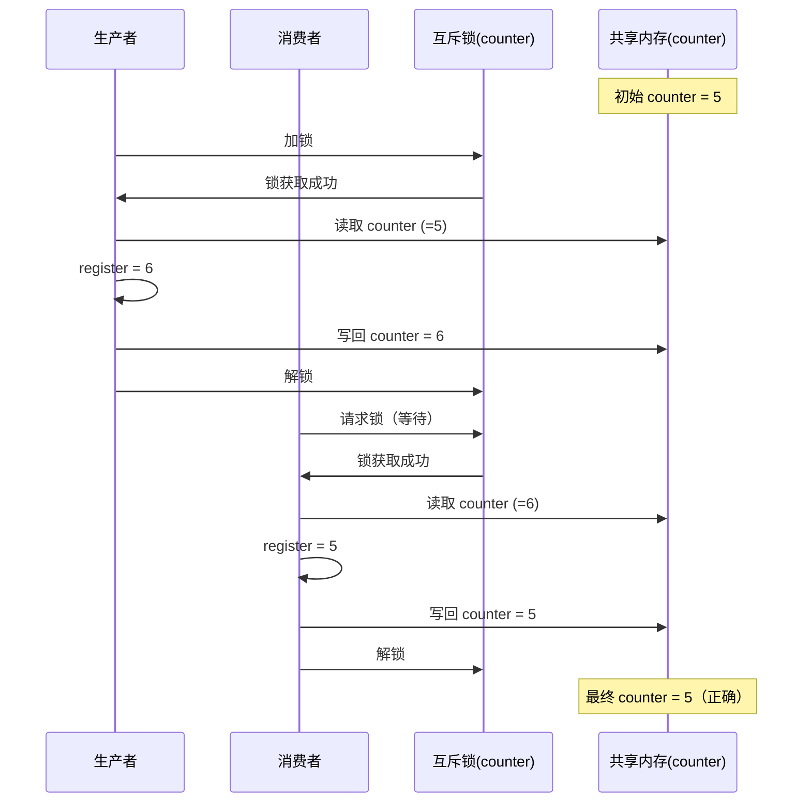

# 第三章 多进程 / 线程

---

## 管理 CPU 的直观方法

CPU 本身非常“简单”，它几乎只干三件事：

1. 用 **PC（程序计数器）** 找内存
2. 把指令取到 **IR（指令寄存器）**
3. 执行指令，然后 **PC++**

也就是说，在没有多进程之前：

> **CPU 并不关心你是谁，只关心 PC 指向哪**

给 CPU 如下内存布局：

```
50: mov ax, [100]
51: mov bx, [101]
52: add ax, bx
……
100: 0
101: 1
```

只要当前状态是：

* PC = 52
* ax = 1
* bx = 1

那么下一步一定执行：

```
add ax, bx
```

**这里不需要任何“管理逻辑”参与**。

在单任务模型中，这句话是 **100% 成立的**：

> **设好 PC 初值就完事**

---

### PC 的真实含义（非常重要）

严格来说，程序的“执行状态”并不只由 PC 决定：

* PC 决定 **从哪条指令开始**
* ax / bx / flags 决定 **指令如何执行**
* 栈指针决定 **函数调用能否继续**

但在最直观的层面，可以先粗暴地记成一句话：

> **控制了 PC，就控制了 CPU 接下来干什么**

这也是为什么示意图中通常画成：

* 左边：内存中的指令
* 中间：PC 指向
* 右边：IR 和寄存器状态

这是理解后续调度问题的**关键抽象视角**。

---

### 一个 CPU 面对多个程序的问题

如果现在不是一个程序，而是两个：

* 程序 A：PC = 52
* 程序 B：PC = 3000

而 CPU **只有一个 PC 寄存器**，那怎么办？

唯一可能的做法是：

> **轮流把不同程序的 PC 写进 CPU**

于是，立刻引出了三个必然问题：

1. **保存 PC（以及寄存器）**
2. **恢复 PC（以及寄存器）**
3. **决定下一个 PC 用谁的**

这三件事合在一起，才叫：

> **管理 CPU**

---

## CPU 为什么会“闲着”？（I/O 引出的问题）

表面上看，这里是在比较两段程序“快或慢”，
但真正要问的是：

> **CPU 明明很快，为什么程序却这么慢？**

---

### 情况一：纯计算

```c
int main(int argc, char* argv[])
{
    int i, to, sum = 0;
    to = atoi(argv[1]);
    for(i = 1; i <= to; i++)
    {
        sum = sum + i;
    }
}
```

* 时间：`0.015s`
* 循环次数：`10^8`

特点：

* CPU 几乎一直在执行指令
* PC 连续递增
* IR 不断装入新指令
* **CPU 利用率接近 100%**

这是 CPU 最擅长的工作模式。

---

### 情况二：引入 I/O

```c
int main(int argc, char* argv[])
{
    int i, to, *fp, sum = 0;
    to = atoi(argv[1]);
    for(i = 1; i <= to; i++)
    {
        sum = sum + i;
        fprintf(fp, "%d\n", sum);
    }
}
```

* 时间：`0.859s`
* 循环次数：`10^3`

关键变化：

* `fprintf` 会触发 I/O
* I/O 远慢于 CPU
* **CPU 需要等待 I/O 完成**

此时发生了本质转变：

> **CPU 大部分时间不是在“算”，而是在“等”**

---

### 从 CPU 视角看发生了什么

`fprintf` 不是一条普通指令，它会：

1. 陷入内核
2. 发起 I/O 请求
3. 等待设备完成（磁盘 / 终端）

在等待期间：

* PC 没有执行有意义的用户代码
* IR 没有装入新的计算指令
* **CPU 实际处于空转或阻塞状态**

---

### 本页结论（真正的落点）

程序本身没有逻辑错误，但暴露了一个系统级问题：

> **单进程模型下，一旦遇到 I/O，CPU 就只能干等**

也就是说：

* 程序慢
* 不是因为算得慢
* 而是因为 **CPU 在等 I/O**

---

## 怎么解决 CPU 等 I/O 的问题？

### 从指令流角度看问题

```asm
50: mov ax, [100]
51: mov bx, [101]
52: add ax, bx
53: 启动磁盘读写   // I/O 操作
54: xxxx
```

到第 53 行时：

* I/O 启动
* 程序必须等待
* 后续指令无法继续

此时：

* 程序在等
* CPU 也在等
* **CPU 闲置**

而内存中明明还有其他代码：

```asm
200: xxxx
201: xxxx
202: xxxx
```

---

### 问题本质

> **当当前程序因为 I/O 阻塞时，CPU 能不能去执行别的程序？**

如果不能：

* I/O 慢
* CPU 空转
* 系统性能低

如果能：

* 就必须引入新的执行机制

---

### 多道程序：交替执行，而不是傻等

单道程序（串行）：

```
A: CPU → I/O → CPU → I/O
B: 等 A 全部结束
```

多道程序（交替）：

```
A: 用 CPU → 等 I/O
B: 接管 CPU
A: I/O 完成 → 等 CPU
B: 等 I/O → CPU 再给 A
```

核心变化只有一句话：

> **CPU 和 I/O 不再同时等待，而是轮流忙**

---

### 结论（从资源角度）

多道程序的目标不是让某个程序更快，而是：

> **让整个系统更忙**

* CPU 利用率提高
* 设备利用率提高
* 系统吞吐量变大

---

## 一个 CPU 面对多个程序？

在多道程序环境下：

* 只有一个 CPU
* 内存中有多个程序
* 现象上看“同时运行”

这就是并发的直观含义：

> **一个 CPU 上交替执行多个程序**

---

### 直觉方案：切换 PC

假设有两段程序：

程序 1：

```asm
50: mov ax, 1
51: mov bx, 1
52: add ax, bx
……
```

程序 2：

```asm
200: mov ax, 10
201: mov bx, 10
202: add ax, bx
……
```

当程序 1 需要让出 CPU：

* OS 把 PC 改成 200
* CPU 执行程序 2

表面上看完全合理。

---

### 致命问题：切回来怎么办？

程序 1 被切走时：

* ax、bx 已被修改
* PC 已经在 53
* 还有其他寄存器状态

如果只记住入口地址：

* 程序无法从原位置继续
* 执行状态全部丢失

于是得到一个关键结论：

> **运行中的程序，和静态程序已经不一样了**

---

## 引入 PCB 与进程概念

### 保存运行状态

为了能“走走停停”，系统必须保存：

* PC
* 通用寄存器
* 其他执行相关状态

例如某一时刻：

| 项目 | 值  |
| -- | -- |
| ax | 2  |
| bx | 1  |
| PC | 53 |

---

### PCB（进程控制块）

为此，引入结构：

> **PCB（Process Control Block）**

唯一作用：

> **记录程序当前的执行状态**

每个被运行过的程序，都对应一个 PCB。

---

### 进程的定义（被逼出来的）

此时，“程序”这个概念已经不够用了：

* 程序：静态代码和数据
* 系统真正管理的是：运行状态

因此自然得到：

> **进程 = 程序 + 运行时状态**

即：

**进程是执行中的程序。**

---

### 程序 vs 进程

* 程序：

  * 静态
  * 没有执行状态
* 进程：

  * 有开始和结束
  * 会被切换
  * 必须保存寄存器和 PC

所有这些“不一样”：

> **统一体现在 PCB 中**

---

### 本小节总结

> **为了让一个 CPU 交替运行多个程序，必须保存运行状态；
> 一旦保存运行状态，“程序”这个概念就不够用了，于是产生了“进程”。**

从这里开始，后续的：

* 调度
* 时间片
* 上下文切换


## 多进程图像

---

### 什么叫“多个进程推进”？

* 启动的每一个程序 → 一个进程
* 每个进程都拥有：

  * 独立的执行状态
  * 独立的寄存器现场
  * 独立的资源描述信息
* 操作系统的职责是：

  1. 记录每个进程的状态
  2. 在合适的时机切换 CPU 给下一个进程
  3. 使多个进程“看起来同时运行”

这构成了**多进程并发执行的基本图像**。

---

### 进程与 PCB

右侧示意图的本质是 **进程 + PCB（进程控制块）**。

#### 1. 进程标识（PID）

* `PID: 1 / PID: 2 / PID: 3`
* PID 是进程的唯一标识
* 操作系统依靠 PID 管理和区分进程

---

#### 2. PCB 中记录的内容

示例描述：

```
算出 ax = 1，启动磁盘写，正在等待完成...
```

在 PCB 中对应为：

* 程序计数器（PC）
* 寄存器内容（如 AX）
* 进程状态：

  * 运行态
  * 就绪态
  * 阻塞态（等待 I/O）

当进程等待磁盘 I/O 时：

* 无法继续执行
* 被标记为阻塞态
* CPU 立即切换给其他进程

---

#### 3. 用户视角与操作系统视角

* 用户看到的是：

  * 多个程序“同时运行”
* 实际上：

  * CPU 在操作系统控制下
  * 在不同进程之间快速切换

**并发是操作系统制造出的执行假象。**

---

### 多进程引入的根本动机

> 单个进程在进行 I/O 操作时，CPU 会处于等待状态，造成 CPU 利用率低下。
> 操作系统通过引入多进程机制，在一个进程等待 I/O 时调度其他就绪进程执行，从而提高 CPU 的整体利用率。这种在多个进程之间交替使用 CPU 的机制，形成了多进程并发执行的图像。

---

## 一、系统启动：第一个进程的产生

---

### 内核启动阶段（尚无进程）

* 机器上电
* BIOS / UEFI
* 引导加载器
* 加载并跳转到内核

此阶段仅有内核代码在 CPU 上执行，**尚未形成进程概念**。

---

### 第一个进程的创建

教学化抽象代码：

```c
if (!fork()) {
    init();
}
```

其本质含义是：

* 内核初始化完成后
* 主动创建第一个用户态进程
* PID = 1

该进程即 **1 号进程（init）**。

---

### 1 号进程的地位

> **1 号进程是系统中所有用户进程的祖先。**

其职责包括：

* 完成用户态初始化
* 启动系统服务
* 启动用户交互环境

现代系统中通常为 `systemd`，但理论模型中仍以 `init` 描述。

---

## 二、Shell：用户进入多进程系统的入口

---

### Shell 的性质

* Shell 是普通用户进程
* 不是内核的一部分
* 是用户创建进程的主要入口

---

### Shell 的基本工作模型

```c
while (1) {
    scanf("%s", cmd);
    if (!fork()) {
        exec(cmd);
    }
    wait();
}
```

---

### 一条命令的执行过程

#### 1. 读取命令

```c
scanf("%s", cmd);
```

Shell 等待用户输入。

---

#### 2. 创建子进程

```c
fork();
```

* 父进程：Shell
* 子进程：Shell 的副本
* 尚未执行新程序

---

#### 3. 加载新程序

```c
exec(cmd);
```

* 仅子进程执行
* 用新程序替换当前进程的代码和数据
* PID 不变

**fork 决定“谁来执行”，exec 决定“执行什么”。**

---

#### 4. 父进程等待

```c
wait();
```

* Shell 进入等待态
* 回收子进程资源
* 避免产生僵尸进程

---

### “一命令一进程”

> Shell 对每一条用户命令，都会创建一个独立的子进程执行；命令结束后，该子进程被回收，Shell 再次等待输入。

---

## 三、进程树结构

```
内核
  ↓
1号进程（init / systemd）
  ↓
Shell
  ↓
用户命令进程1
用户命令进程2
用户命令进程3
```

* 每个进程都有父进程
* 最终均可追溯至 1 号进程

---

## 四、多进程的组织方式：PCB + 状态 + 队列

---

### PCB 的核心地位

* 每个进程对应一个 PCB
* 操作系统管理 PCB，而非程序本身
* PCB 保存进程的完整执行状态

---

### 多进程的队列组织结构



---

### 进程状态转换图



---

## 五、多进程的交替执行机制

---

### 进程进入等待并触发调度

```c
启动磁盘读写;
pCur.state = 'W';
将 pCur 放入 DiskWaitQueue;
schedule();
```

含义：

* 当前进程无法继续执行
* 必须让出 CPU

---

### 调度器的核心逻辑

```c
schedule() {
    pNew = getNext(ReadyQueue);
    switch_to(pCur, pNew);
}
```

---

### 上下文切换的本质

```c
switch_to(pCur, pNew) {
    保存 pCur 寄存器到 PCB;
    恢复 pNew 寄存器到 CPU;
}
```

---

### 进程切换示意图



---

## 六、多进程对内存的影响

---

### 冲突问题的本质

* 多个进程直接使用同一套物理地址
* 数据可能覆盖代码
* 进程之间互相破坏

---

### 冲突示意图




---

## 解决方案：虚拟地址 + 映射表


 **进程带动内存的使用**


### 内存映射示意图



---

### 核心结论

* 每个进程拥有独立的虚拟地址空间
* 相同虚拟地址可映射到不同物理地址
* 进程管理与内存管理不可分离

> **没有虚拟内存，多进程在内存层面无法成立。**

---

## 多进程协作：打印队列模型


### 多进程合作示意图



---

### 核心逻辑

* 生产者-消费者模型
* 队列作为缓冲区
* 指针控制任务顺序

---


# 生产者–消费者问题的一个最小实例

---

## 一、问题背景：共享资源 + 并发访问

生产者–消费者问题的核心，并不在“生产”或“消费”本身，而在于：

> **多个进程并发访问同一份共享数据**

下面通过一个**不包含任何同步机制**的最小实例，先把问题本身完整暴露出来。

---

## 二、共享数据的定义（多进程全局资源）

```c
#define BUFFER_SIZE 10
typedef struct { ... } item;

item buffer[BUFFER_SIZE];   // 环形缓冲区，最多存放 10 个 item
int in = 0, out = 0;        // 写入指针、读取指针
int counter = 0;            // 当前缓冲区中的 item 数量
```

**关键点：**

* `buffer / in / out / counter`
  对生产者和消费者**同时可见**
* 它们位于**共享内存**
* 多进程并发访问时，若缺乏控制，就可能破坏一致性

---

## 三、生产者进程的基本逻辑（无同步）

```c
while (true) {
    // 缓冲区满时忙等
    while (counter == BUFFER_SIZE);

    buffer[in] = item;                  // 写入数据
    in = (in + 1) % BUFFER_SIZE;         // 写指针循环后移
    counter++;                           // 更新共享计数
}
```

**生产者的三步核心操作：**

1. 向缓冲区写入数据
2. 移动写指针 `in`
3. 修改共享变量 `counter`

---

## 四、消费者进程的基本逻辑（无同步）

```c
while (true) {
    // 缓冲区空时忙等
    while (counter == 0);

    item = buffer[out];                 // 读取数据
    out = (out + 1) % BUFFER_SIZE;       // 读指针循环后移
    counter--;                           // 更新共享计数
}
```

**消费者的三步核心操作：**

1. 从缓冲区读取数据
2. 移动读指针 `out`
3. 修改共享变量 `counter`

---

## 五、整体结构示意（逻辑视图）



---

## 六、问题自然浮现：并发竞争

上述实现在**单进程或理想顺序下是正确的**，但在并发环境中并不安全，原因在于：

* `counter++`、`counter--` **不是原子操作**
* 多个进程可能同时：

  * 读取同一个 `counter`
  * 各自修改并写回
* 可能导致：

  * 计数错误
  * 缓冲区覆盖
  * 数据被重复消费或遗漏

**本质原因：**

> 对共享数据的访问缺乏同步与互斥保证

---

# 两个合作的进程都在修改 `counter`

---

## 一、问题背景：共享变量被同时修改

### 共享数据

```c
int counter = 0;   // 多进程共享变量
```

### 初始状态

```
counter = 5
```

**关键点：**

* `counter` 位于共享内存
* 生产者与消费者都会对它进行修改

---

## 二、关键事实：`counter++ / counter--` 不是原子操作

### `counter++` 的真实执行过程

```c
register = counter;        // ① 读
register = register + 1;  // ② 改
counter  = register;      // ③ 写
```

### `counter--` 的真实执行过程

```c
register = counter;        // ① 读
register = register - 1;  // ② 改
counter  = register;      // ③ 写
```

> 一条看似简单的语句，底层却包含 **读 → 改 → 写** 三个步骤

---

## 三、错误的并发交错（Race Condition）

### 期望结果

* 一个 `+1`
* 一个 `-1`
* **最终应回到 5**

### 实际发生的执行顺序

```
1. P 读取 counter = 5
2. P 计算得到 6（尚未写回）
3. C 读取 counter = 5
4. C 计算得到 4
5. P 写回 counter = 6
6. C 写回 counter = 4
```

### 最终结果

```
counter = 4   ❌
```

**更新被覆盖，信息丢失**

---

## 四、并发竞争示意（时序图）



---

## 五、核心结论

1. `counter++ / counter--` 是**非原子操作**
2. 并发执行时，中间步骤可能被打断并交错
3. 这类问题称为 **竞争条件（Race Condition）**

**解决方向是明确的：**

> 必须使用同步机制（互斥锁、信号量）来保护对 `counter` 的访问

---


## 核心在于进程同步：保证合理的推进顺序

---

### 核心思想

> **在修改共享变量 `counter` 时，必须阻断其他进程的并发访问**，
> 通过 **加锁 → 执行 → 解锁**，把“读–改–写”这段代码变成一个**不可被打断的整体**。

这正是**进程同步**要解决的问题。

---

### 一、回顾：无同步时的问题本质

在没有任何同步机制的情况下，`counter++ / counter--` 会被拆解为：

```
读 → 改 → 写
```

多个进程可能在这三步之间**相互穿插执行**。

* 无同步的错误执行序列

```
1. P.register = counter;
2. P.register = P.register + 1;
3. C.register = counter;
4. C.register = C.register - 1;
5. counter = P.register;
6. counter = C.register;
```

**结果：**

* 后写入的值覆盖了先写入的值
* 更新丢失
* `counter` 最终错误

**根因：**

> 对共享变量的访问没有形成“原子操作”

---

### 二、引入同步：用锁保护共享变量

解决思路非常直接：

> **凡是访问和修改 `counter` 的代码，都必须一次只允许一个进程执行**

这段代码称为 **临界区（Critical Section）**，需要用**互斥锁**保护。

---

### 三、加锁后的正确执行流程

* 生产者 P 的执行逻辑

1. **获取锁（加锁）**
   阻断其他进程访问 `counter`
2. 在锁保护下执行完整的“读–改–写”：

   ```
   P.register = counter;
   P.register = P.register + 1;
   counter = P.register;
   ```
3. **释放锁（解锁）**
   允许其他进程进入临界区

---

### 消费者 C 的执行逻辑

1. **等待锁可用**
2. **获取锁（加锁）**
3. 在锁保护下执行完整的“读–改–写”：

   ```
   C.register = counter;
   C.register = C.register - 1;
   counter = C.register;
   ```
4. **释放锁（解锁）**

---

## 四、同步执行的时序示意（正确情况）



---

### 五、核心结论

1. **进程同步的本质**：
   控制多个进程对共享资源的执行顺序
2. **互斥锁的作用**：
   保证临界区代码一次只被一个进程执行
3. **结果**：
   “读–改–写”变成原子操作，避免竞争条件

---
