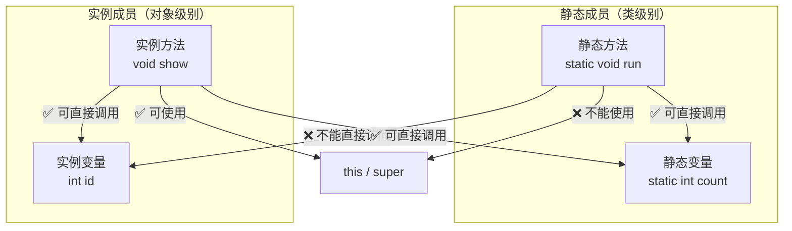

# Java复习提纲

- 选择题30分，2-3道多选题
- 判断题16分，8道题
- 填空题10分，5空
- 简答题10分
- 代码阅读题10分
- 编程题24分：简单的编程题10分 + 14分（也不难）

# Hello World

- 源文件 `.java` → 编译器 `javac` 编译 → 解析器 → 字节码 `.class`
- JVM：跨平台特性

<Quiz :q='{"type":"single","question":"Java源程序文件编译后生成的字节码文件扩展名是？","options":["A. .java","B. .class","C. .exe","D. .jar"],"answer":"B","explanation":"javac 编译 .java 文件后生成 .class 字节码文件，由 JVM 解释执行。"}' />

<Quiz :q='{"type":"single","question":"下列哪个是 Java 的入口方法签名？","options":["A. public void main(String[] args)","B. public static void main(String[] args)","C. static void main(String[] args)","D. public static int main(String[] args)"],"answer":"B","explanation":"Java 程序入口必须是 public static void main(String[] args)，由 JVM 调用。"}' />

<Quiz :q='{"type":"tf","question":"Java 是纯面向对象的语言，具有\"一次编写，到处运行\"的特性。","answer":"true","explanation":"Java 通过 JVM 实现跨平台，字节码在不同平台的 JVM 上运行，达到 Write Once, Run Anywhere。"}' />

# 基础语法

# 标识符

<Quiz :q='{"type": "multi", "question": "以下哪些是合法的标识符？", "options": ["A. String", "B. int", "C. name", "D. 4item"], "answer": ["C"], "explanation": "String 和 int 是关键字；4item 以数字开头不合法。只有 name 合法。"}' />
<Quiz :q='{"type": "single", "question": "下列属于合法的 Java 标识符的是？", "options": ["A. ABC（双引号括起）", "B. &5678", "C. +rriwo", "D. saler"], "answer": "D", "explanation": "标识符由字母、数字、_、$组成，不能以数字开头，不能是关键字。"}' />

- **组成要素**：字母、数字、`$`、`_`
- **硬性要求**：不能是关键字、数字不能开头
- **命名约定**：
  - 类名：大驼峰
  - 方法名：小驼峰
  - 常量名：全大写 + `_`
  - 包名：全小写
  - `dao`、`entity`、`service`、`util`


# 变量和常量

<Quiz :q='{"type": "single", "question": "下列关于成员变量默认值的描述中，错误的是？", "options": ["A. char 默认值是 \\u0000", "B. int 默认值是 0", "C. long 默认值是 0", "D. float 默认值是 0.0f"], "answer": "C", "explanation": "long 默认值是 0L，不是 0。"}' />

- 变量的作用域
- 变量赋值：`float`（f 后缀）、`long`（L 后缀）、`char`（单引号）、`boolean`（`true`/`false`）
- 常量（`final`）：只能赋值一次


# 数据类型

<Quiz :q='{"type": "single", "question": "下列选项中属于自动类型转换的是？", "options": ["A. double 转 int", "B. int 转 short", "C. int 转 double", "D. long 转 int"], "answer": "C", "explanation": "小范围到大范围自动转换。int 到 double 自动；其他需要强制转换。"}' />

- **基本数据类型**（8种）：
  - 整型：`byte`、`short`、`int`、`long`
  - 浮点型：`float`、`double`
  - 字符型：`char`
  - 布尔型：`boolean`
- **类型转换**：
  - 自动类型转换（小→大）
  - 强制类型转换（大→小，可能丢失精度）


# 运算符

- `++`、`--`、`&&`、`&`、`||`、`|`、`=`（短路与/或 vs 非短路与/或）

# 三元表达式 & switch

- 三元：`条件 ? 值1 : 值2`
- `switch`：不同 JDK 版本的支持差异（JDK 7+ 支持 String，JDK 14+ 支持箭头表达式）

# 循环

<Quiz :q='{"type": "single", "question": "for(int x = 0, y = 0; !x && y <= 5; y++) 循环执行次数是？", "options": ["A. 0", "B. 5", "C. 6", "D. 无穷"], "answer": "A", "explanation": "x 是 int 类型，!x 编译错误，循环执行 0 次。"}' />

- 循环条件的结果**必定是 `boolean`**
- `break`：跳出循环
- `continue`：跳过本次循环


# 方法

<Quiz :q='{"type": "single", "question": "关于程序入口 main 方法说法错误的是？", "options": ["A. main 中可以将 void 改成 String", "B. main 中只有一条语句也要用 {} 括起", "C. main 是程序入口", "D. 一个程序只能有一个入口"], "answer": "A", "explanation": "main 必须是 public static void main(String[] args)，void 不能改。"}' />
<Quiz :q='{"type": "single", "question": "一个类可定义多个同名方法（参数不同），这种特性称为？", "options": ["A. 隐藏", "B. 覆盖", "C. 重载", "D. 重写"], "answer": "C", "explanation": "重载（Overloading）：同名不同参。覆盖/重写是子类重写父类方法。"}' />

- 语法：`返回值类型 方法名(参数列表) { return 返回值; }`
- 方法里**不能**再定义方法
- `main` 方法签名：`public static void main(String[] args)`


# 数组

<Quiz :q='{"type": "single", "question": "以下代码输出什么？<br><pre>int[] a = {1, 2, 3, 4, 5};\nfor (int count = 0; count &lt; 5; count++)\n    System.out.print(a[count++]);</pre>", "options": ["A. 运行时异常", "B. 12345", "C. 135", "D. 24"], "answer": "C", "explanation": "count++ 导致取 a[0]、a[2]、a[4]，输出 135。"}' />
<Quiz :q='{"type": "single", "question": "使用 Arrays 类应导入？", "options": ["A. import java.lang.*;", "B. import java.util.*;", "C. package java.lang.*;", "D. package java.util.*;"], "answer": "B", "explanation": "Arrays 在 java.util 包中。"}' />
<Quiz :q='{"type": "single", "question": "以下代码输出什么？<br><pre>char[] ch = {&#39;a&#39;, &#39;b&#39;, &#39;c&#39;};\nfor (int i = 0; i &lt; ch.length; i++) {\n    System.out.print(ch[i]);\n    i++;\n}</pre>", "options": ["A. abc", "B. 979899", "C. ac", "D. 编译出错"], "answer": "C", "explanation": "循环体内 i++ 导致跳过一个元素，取 ch[0]=a、ch[2]=c，输出 ac。"}' />
<Quiz :q='{"type": "single", "question": "以下数组声明错误的是？", "options": ["A. int[] ABC", "B. double ABC[]", "C. String[] name", "D. char ABC[10]"], "answer": "D", "explanation": "数组声明不能指定大小，char ABC[10] 语法错误。"}' />
<Quiz :q='{"type": "single", "question": "以下数组赋值错误的是？", "options": ["A. int[] a = new int[4];", "B. int[] a = {1, 2, 3, 4};", "C. int[] a = new int[]{1, 2, 3, 4};", "D. int[] a = new int[4]{1, 2, 3, 4};"], "answer": "D", "explanation": "提供初始化列表时不能同时指定数组大小。"}' />
<Quiz :q='{"type": "single", "question": "以下代码输出什么？<br><pre>int[] a = {1, 3, 5, 7, 9};\nfor (int i = 0; i &lt; a.length; i++)\n    System.out.print(a[i] + \" \");</pre>", "options": ["A. 1 3 5 7 9", "B. 1 2 3 4 5", "C. 1 2 3 4", "D. 1 3 5 7"], "answer": "A", "explanation": "数组内容 {1, 3, 5, 7, 9}，按顺序遍历输出。"}' />

- 定义：`int[] a = new int[5];` 或 `int[] a = {1,2,3};`
- 下标有效范围：`0` ~ `length-1`
- 二维数组：可以只有行没有列，`int[][] a = new int[2][];`


# 面向对象基础

# 三大特性

- 封装、继承、多态
- 面向对象与面向过程的区别

# 类和对象

<Quiz :q='{"type": "single", "question": "声明一个类需要什么关键字？", "options": ["A. public", "B. private", "C. class", "D. 以上都是"], "answer": "C", "explanation": "class 是声明类的关键字。"}' />
<Quiz :q='{"type": "single", "question": "Circle x = new Circle()，以下哪句最确切？", "options": ["A. x 包含 int 数据", "B. x 包含 Circle 对象", "C. x 包含 Circle 对象的引用", "D. x 可赋 int 值"], "answer": "C", "explanation": "x 是引用变量，存储的是 Circle 对象的地址。"}' />
<Quiz :q='{"type": "single", "question": "既能修饰类也能修饰类成员的是？", "options": ["A. extends", "B. Float", "C. public", "D. static"], "answer": "C", "explanation": "public 可修饰类（顶级类）和成员。static 只能修饰成员。"}' />
<Quiz :q='{"type": "single", "question": "private 成员可以被哪些对象访问？", "options": ["A. 同包其他类", "B. 仅本类私有方法", "C. 仅本类所有方法", "D. 所有其他类"], "answer": "C", "explanation": "private 成员只能在定义它的类内部访问。"}' />
<Quiz :q='{"type": "single", "question": "下面关于类的定义，哪个正确？", "options": ["A. public void HH { }", "B. public class MOVE() { }", "C. public class void number { }", "D. public class Car { }"], "answer": "D", "explanation": "类定义格式：public class 类名 { }。"}' />

- 类的定义
- 创建对象：`类名 对象名 = new 类名([参数])`
- 创建对象过程中的内存变化（堆、栈）
- 对象是具体而独立的
- 通过对象调用属性和方法
- 访问修饰符
- 包的定义：全小写


# 封装

<Quiz :q='{"type": "single", "question": "修改 Person 的 name 属性应使用？", "options": ["A. new Person(Tom, 1996)", "B. getName(Tom)", "C. 直接赋值 myName", "D. setName(Tom)"], "answer": "D", "explanation": "setName 是 setter 方法，可修改私有属性。A 创建新对象，C 不能访问私有成员。"}' />

- 目的：隐藏实现细节，保护数据
- 步骤：属性私有化（`private`）→ 提供 `getter`/`setter`


# 构造方法

<Quiz :q='{"type": "single", "question": "下面哪句说法正确？", "options": ["A. 无显式构造时自动生成缺省构造器", "B. 必须显式定义构造", "C. 每个类都有缺省构造", "D. 缺省构造可以有参数"], "answer": "A", "explanation": "无显式构造时，编译器自动生成无参缺省构造。"}' />
<Quiz :q='{"type": "single", "question": "关于构造方法描述错误的是？", "options": ["A. 创建对象时自动调用", "B. 参数必须不同", "C. 参数必须相同", "D. 名称与类名相同"], "answer": "C", "explanation": "构造方法重载要求参数必须不同。"}' />

- 语法特点：
  - 方法名和类名必须相同
  - 不能有返回值类型声明（包括 `void`）
- 执行时机：对象创建时由 JVM 自动调用
- 构造方法的重载

```java
public class A {
    public A() { }
    public A(int x) { }
}
```


# this

- 当前类的一个对象
- `this.属性`、`this.方法()`、`this([参数])`（访问本类其他构造方法）
- **不能在静态方法中使用**

<Quiz :q='{"type":"single","question":"this 关键字可以在以下哪个环境中使用？","options":["A. 静态方法中","B. 实例方法中","C. 静态块中","D. 以上都可以"],"answer":"B","explanation":"this 指向当前实例对象，静态方法/静态块没有当前对象，不能使用 this。"}' />

# 构造块 & 静态块

- 执行顺序：**静态块 → 构造块 → 构造方法**

<Quiz :q='{"type":"single","question":"以下执行顺序正确的是？","options":["A. 构造块 → 静态块 → 构造方法","B. 构造方法 → 构造块 → 静态块","C. 静态块 → 构造块 → 构造方法","D. 静态块 → 构造方法 → 构造块"],"answer":"C","explanation":"类加载时执行静态块（一次），创建对象时先执行构造块，再执行构造方法。"}' />

# static

| 特性 | 静态成员（static） | 实例成员（非static） |
|------|------------------|-------------------|
| 归属 | 属于**类**，类加载时分配 | 属于**对象**，创建对象时分配 |
| 内存 | 方法区（共享一份） | 堆区（每个对象独立一份） |
| 访问方式 | `类名.成员`（推荐）或 `对象.成员`（不推荐） | 必须通过 `对象.成员` |
| 能否访问实例变量 | ❌ 不能直接访问（没有当前对象） | ✅ 可以直接访问 |
| 能否使用 `this`/`super` | ❌ 不能（没有当前对象） | ✅ 可以 |



- **静态方法调用链**：`静态方法 → 静态成员（✅）`，`静态方法 → 实例成员（❌）`，`静态方法 → this/super（❌）`
- **实例方法调用链**：`实例方法 → 实例成员（✅）`，`实例方法 → 静态成员（✅）`，`实例方法 → this/super（✅）`

<Quiz :q='{"type":"multi","question":"关于 static 方法的正确说法有哪些？","options":["A. 只能访问静态数据","B. 只能调用其他静态方法","C. 可以访问实例变量","D. 不能使用 this 或 super"],"answer":["A","B","D"],"explanation":"静态方法属于类，不依赖对象实例，因此：①只能直接访问静态成员（静态变量/其他静态方法）；②不能访问实例变量（必须通过对象引用才能访问）；③不能使用 this/super（因为没有当前对象）。A、B、D 正确，C 错误。"}' />

# 继承

# 基本概念

- 目的：代码重用
- 关键字：`extends`
- Java **单继承**（类），接口**多继承**
- 子类继承父类的非 `private` 成员，不能继承构造方法

<Quiz :q='{"type":"tf","question":"Java 支持类的多继承。","answer":"false","explanation":"Java 类只支持单继承（一个类只能有一个直接父类），但接口支持多继承。"}' />

<Quiz :q='{"type":"single","question":"子类可以继承父类的哪些成员？","options":["A. 所有成员","B. 非 private 成员","C. 只有 public 成员","D. 只有 protected 成员"],"answer":"B","explanation":"子类继承父类所有非 private 成员（public、protected、默认权限）。构造方法不能被继承。"}' />

# 方法重写

- 从父类继承的方法才能重写
- 语法：方法签名不变，方法体变化
  - 方法名、参数列表、返回值类型（可协变）不变
  - 访问权限不能更严格

<Quiz :q='{"type":"tf","question":"final 方法可以被重写。","answer":"false","explanation":"final 方法不能被重写，final 的作用就是禁止子类覆写该方法。"}' />

<Quiz :q='{"type":"single","question":"关于方法重写（Override）的说法错误的是？","options":["A. 方法名必须相同","B. 参数列表必须相同","C. 返回值类型必须完全相同","D. 子类访问权限不能比父类更严格"],"answer":"C","explanation":"重写的返回值类型可以是原返回类型的子类型（协变返回类型），不一定完全相同。"}' />

# super

- 当前类对应的父类对象
- `super.属性`、`super.方法()`、`super([参数])`（访问父类构造方法）
- 与 `this` 对比记忆
- 注意事项：
  - `this` 和 `super` 不能在静态方法中使用
  - 在构造方法中 `this([参数])` 或 `super([参数])` 必须位于第一行

<Quiz :q='{"type":"single","question":"在子类构造方法中调用父类构造方法应使用哪个关键字？","options":["A. this","B. super","C. parent","D. base"],"answer":"B","explanation":"super([参数]) 调用父类构造方法，且必须位于子类构造方法的第一行。"}' />

# final

- `final class`：不能被继承
- `final method`：不能被重写
- `final variable`：常量，只能赋值一次

# 抽象类和抽象方法

- `abstract` 关键字
- 抽象类中可以没有抽象方法；有抽象方法的类必须是抽象类
- 抽象类不能创建对象，必须依赖子类
- 一般子类必须实现抽象父类**所有**抽象方法
- 抽象类的子类如果是抽象类，则可不实现抽象方法

<Quiz :q='{"type":"single","question":"以下关于抽象类的说法正确的是？","options":["A. 抽象类必须有抽象方法","B. 抽象类可以没有抽象方法","C. 抽象类可以直接 new 创建对象","D. 抽象类不能有构造方法"],"answer":"B","explanation":"抽象类可以没有抽象方法（但反之不成立——有抽象方法的类必须是抽象类）。抽象类不能实例化，可以有构造方法（供子类调用）。"}' />

# 接口

- 不同 JDK 版本接口特性有差异
  - JDK 7：只能有抽象方法和静态常量
  - JDK 8：新增 `default` 方法（实现类对象调用）、静态方法（接口名调用）
  - JDK 9+：新增私有方法
- 静态常量：`接口名.常量名` 调用
- 接口可以多继承：`interface A extends B, C`
- 一般类先继承再实现：`class A extends B implements C, D`

<Quiz :q='{"type":"single","question":"函数式接口（Functional Interface）是指？","options":["A. 包含多个抽象方法的接口","B. 恰好包含一个抽象方法的接口","C. 只包含静态方法的接口","D. 只包含默认方法的接口"],"answer":"B","explanation":"函数式接口有且仅有一个抽象方法，可用 Lambda 表达式实现，如 Runnable、Comparator。"}' />

<Quiz :q='{"type":"multi","question":"接口中可以包含哪些成员？（JDK 8 以后）","options":["A. 抽象方法","B. default 方法（默认实现）","C. 静态方法（有方法体）","D. 实例变量"],"answer":["A","B","C"],"explanation":"JDK 8+ 接口可以有抽象方法、default 方法和静态方法。接口中不能有实例变量，只能有静态常量。"}' />

<Quiz :q='{"type":"single","question":"接口中的 default 方法如何调用？","options":["A. 接口名.方法名()","B. 实现类对象.方法名()","C. 类名.方法名()","D. 直接调用方法名"],"answer":"B","explanation":"default 方法是实例方法，通过实现类对象调用。接口的静态方法则通过接口名调用。"}' />

# 对象的类型转换

- **向上转型**（自动）：`父类 = 子类对象`、`接口 = 实现类对象`
- **向下转型**（强制）：`子类 = (子类)父类对象`、`实现类 = (实现类)接口对象`

# 多态

- 实现多态的条件：
  - 方法重载
  - 向上转型 + 方法重写

<Quiz :q='{"type": "single", "question": "以下代码输出什么？<br><pre>class A { void display() { System.out.print(\"A\"); } }<br><pre>class B extends A { void display() { System.out.print(\"B\"); } }\nA obj = new B();\nobj.display();&lt;/pre&gt;</pre>", "options": ["A. A", "B. B", "C. 编译错误", "D. 运行时错误"], "answer": "B", "explanation": "多态：父类引用指向子类对象，调用被覆盖的方法时执行子类版本（运行时绑定）。"}' />

<Quiz :q='{"type":"single","question":"以下关于重载和重写的描述正确的是？","options":["A. 重载是运行时多态，重写是编译时多态","B. 重载是编译时多态，重写是运行时多态","C. 两者都是编译时多态","D. 两者都是运行时多态"],"answer":"B","explanation":"重载（Overload）是编译时多态，根据参数类型/个数确定调用哪个方法。重写（Override）是运行时多态，根据实际对象类型确定。"}' />

<Quiz :q='{"type":"single","question":"表达式 Base y = new Derived()（Derived extends Base）描述正确的是？","options":["A. 编译错误","B. 这是向上转型","C. 这是向下转型","D. 对象切片"],"answer":"B","explanation":"子类对象赋值给父类引用是向上转型（自动转换），Java 不存在对象切片。"}' />

# Object 类

- `toString()`、`equals()`、`hashCode()`

<Quiz :q='{"type":"single","question":"toString() 方法定义在哪个类中？","options":["A. java.lang.String","B. java.lang.Object","C. java.util","D. java.lang.System"],"answer":"B","explanation":"toString() 定义在 java.lang.Object 中，所有类都可覆写该方法。"}' />

# 内部类

- 匿名内部类

<Quiz :q='{"type":"single","question":"以下关于匿名内部类的描述正确的是？","options":["A. 使用 anonymous 关键字声明","B. 没有类名，定义和实例化在同一表达式","C. 必须是静态类","D. 不能实现接口"],"answer":"B","explanation":"匿名内部类没有类名，在定义时同时实例化，常用于实现接口或继承类的简写形式。"}' />

# Lambda 表达式

- 语法：`(参数列表) -> { 方法体 }`

# 异常

# 基本概念

- 异常：导致程序不能正常运行的情况
- 异常的描述和异常的处理

# 异常导致的后果

# 异常处理的目的

# 类的继承结构

```
Throwable
├── Error
└── Exception
    ├── 其他（受检异常）
    └── RuntimeException（非受检异常）
```

<Quiz :q='{"type":"single","question":"Java 中所有异常类的根类是？","options":["A. Exception","B. Error","C. Throwable","D. RuntimeException"],"answer":"C","explanation":"Throwable 是 Error 和 Exception 的父类，是所有异常和错误的根类。"}' />

<Quiz :q='{"type":"single","question":"整数除法中除数为 0 会抛出什么异常？","options":["A. NullPointerException","B. NumberFormatException","C. ArithmeticException","D. ArrayIndexOutOfBoundsException"],"answer":"C","explanation":"整数除以 0 抛出 ArithmeticException（注意：浮点数除以 0 不会抛异常，结果为 Infinity）。"}' />

# 异常的处理方式

- `try` - `catch` - `finally`
- `throw`：手动抛出异常
- `throws`：声明方法可能抛出的异常

<Quiz :q='{"type":"single","question":"try-catch 中哪个块无论是否发生异常都会执行？","options":["A. try","B. catch","C. finally","D. throw"],"answer":"C","explanation":"finally 块在任何情况下都会执行（除非 JVM 退出），用于释放资源等清理操作。"}' />

<Quiz :q='{"type":"single","question":"throw 和 throws 的区别是什么？","options":["A. 功能完全相同","B. throws 声明异常，throw 抛出异常","C. throw 声明异常，throws 抛出异常","D. 两者都在方法签名中使用"],"answer":"B","explanation":"throws 在方法签名中声明可能抛出的异常，throw 在方法体中实际抛出异常实例。"}' />

# 自定义异常

- `extends Exception` → 受检异常
- `extends RuntimeException` → 非受检异常

<Quiz :q='{"type":"single","question":"自定义受检异常应继承哪个类？","options":["A. RuntimeException","B. Exception","C. Error","D. Throwable"],"answer":"B","explanation":"继承 Exception 类是受检异常（编译器强制处理），继承 RuntimeException 是非受检异常。"}' />

# 常用类与集合

# String

<Quiz :q='{"type": "single", "question": "以下代码创建了几个 String 对象？<br><pre>String a = new String(\"Hello\");\nString b = new String(\"Hello\");\nString c = \"Hello\";\nString d = \"Hello\";</pre>", "options": ["A. 2", "B. 3", "C. 4", "D. 1"], "answer": "B", "explanation": "new 创建 2 个堆对象，字面量 \"Hello\" 在字符串常量池中只有 1 个，共 3 个对象。c 和 d 指向池中同一个对象。"}' />

<Quiz :q='{"type":"single","question":"String 类的 compareTo() 方法返回值类型是？","options":["A. boolean","B. int","C. char","D. String"],"answer":"B","explanation":"compareTo() 返回 int：相等返回 0，小于返回负数，大于返回正数。"}' />

<Quiz :q='{"type":"single","question":"String 类的 substring(1, 3) 对 \"abcde\" 的结果是？","options":["A. \"abc\"","B. \"bc\"","C. \"bcd\"","D. \"cd\""],"answer":"B","explanation":"substring(begin, end) 取 [begin, end)，即索引 1 到 2 的字符：\"bc\"。"}' />

# List & Set & Map

- **增强 for 循环**：`for(元素类型 变量名 : 数组或集合对象) { ... }`
- **泛型**在集合中的使用：`List<Integer> a = new ArrayList<>();`

<Quiz :q='{"type":"single","question":"关于 ArrayList 和 LinkedList 的描述正确的是？","options":["A. ArrayList 头部插入 O(1)","B. LinkedList 头部插入 O(1)","C. 两者随机访问都是 O(1)","D. LinkedList 比 ArrayList 更省内存"],"answer":"B","explanation":"LinkedList 双向链表头插 O(1)，ArrayList 数组头插 O(n)。ArrayList 随机访问 O(1)，LinkedList 随机访问 O(n)。"}' />

<Quiz :q='{"type":"single","question":"以下哪个集合不允许存储重复元素？","options":["A. ArrayList","B. LinkedList","C. Set","D. Map"],"answer":"C","explanation":"Set 接口不允许重复元素（如 HashSet、TreeSet）。List 允许重复，Map 存储键值对。"}' />

<Quiz :q='{"type":"single","question":"List<String> list = new ArrayList<>(); 中使用了什么 Java 特性？","options":["A. 反射","B. 泛型","C. 注解","D. 序列化"],"answer":"B","explanation":"<String> 是泛型，指定集合中元素的类型，编译时提供类型安全检查。"}' />

# 补充练习

<Quiz :q='{"type":"tf","question":"Java 中 == 比较的是对象的内容是否相等。","answer":"false","explanation":"== 比较的是引用地址（引用类型）或值（基本类型）。内容比较需用 equals()。"}' />

<Quiz :q='{"type":"tf","question":"finally 块一定会执行，即使 catch 中写了 return。","answer":"true","explanation":"finally 在 return 之前执行（除非遇到 System.exit()）。"}' />

<Quiz :q='{"type":"tf","question":"StringBuffer 是线程安全的，StringBuilder 不是。","answer":"true","explanation":"StringBuffer 的方法使用 synchronized 修饰，是线程安全的；StringBuilder 性能更好但非线程安全。"}' />

<Quiz :q='{"type":"multi","question":"以下哪些是 Java 中合法的基本数据类型？","options":["A. byte","B. string","C. boolean","D. char"],"answer":["A","C","D"],"explanation":"String 是引用类型，不是基本数据类型。byte、boolean、char 都是基本数据类型。"}' />

<Quiz :q='{"type":"single","question":"以下关于泛型集合声明的写法正确的是？","options":["A. List<String> list = new List<String>();","B. List<String> list = new ArrayList<String>();","C. List<String> list = new ArrayList<>();","D. B 和 C 都正确"],"answer":"D","explanation":"List 是接口不能实例化。ArrayList<>()（钻石运算符，Java 7+）与 ArrayList<String>() 等价。"}' />

<Quiz :q='{"type":"tf","question":"Java 中方法参数传递采用传引用方式（对象类型）。","answer":"false","explanation":"Java 始终是值传递。对象类型的参数传递的是引用的副本，不是对象本身。"}' />

<Quiz :q='{"type":"tf","question":"抽象类不能使用 new 关键字实例化。","answer":"true","explanation":"抽象类不能被实例化，必须由子类继承后通过子类创建对象。"}' />

<Quiz :q='{"type":"tf","question":"Java 8 以后，接口中可以定义带有方法体的默认方法。","answer":"true","explanation":"JDK 8 引入了 default 方法，允许接口中定义有默认实现的方法。"}' />

<Quiz :q='{"type":"single","question":"Runnable 在 Java 中属于什么？","options":["A. 抽象类","B. 接口","C. 普通类","D. 方法"],"answer":"B","explanation":"Runnable 是函数式接口，包含一个抽象的 run() 方法，用于创建线程。"}' />

<Quiz :q='{"type":"single","question":"以下哪个不是 Java 的特性？","options":["A. 面向对象","B. 支持指针","C. 动态性","D. 平台无关"],"answer":"B","explanation":"Java 刻意不支持指针操作，这是其安全性和简单性的重要设计选择。"}' />

# 填空题

<details>
<summary>点击显示答案</summary>

1. Java 中用于继承类的关键字是 **\_\_\_\_**。→ `extends`

2. `int` 的包装类是 **\_\_\_\_**。→ `Integer`

3. 实现 Runnable 接口必须实现的方法是 **\_\_\_\_**。→ `run()`

4. 在同一包内和子类中可访问、其他包不可访问的访问修饰符是 **\_\_\_\_**。→ `protected`

5. 不允许存储重复元素的集合接口是 **\_\_\_\_**。→ `Set`

6. `char` 类型在 Java 中占 **\_\_\_\_** 个字节。→ `2`

7. Java 中所有类的根类是 **\_\_\_\_**。→ `Object`

8. 声明常量的关键字是 **\_\_\_\_**。→ `final`

9. 接口中定义的变量默认是 `public static final`，也称为 **\_\_\_\_**。→ 静态常量

10. 增强 for 循环的语法是 `for(元素类型 变量名 : **\_\_\_**)`。→ `数组或集合对象`

</details>
