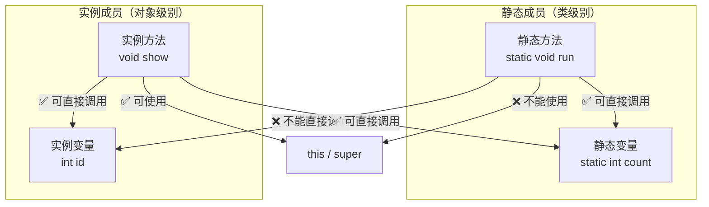

# Java复习提纲

- 选择题30分，2-3道多选题
- 判断题16分，8道题
- 填空题10分，5空
- 简答题10分
- 代码阅读题10分
- 编程题24分：简单的编程题10分 + 14分（也不难）


# 第1章 Java开发入门

<Quiz :q='{"type": "single", "question": "Java 一次编译，随处运行的特点在于其什么？", "options": ["A. 跨平台性", "B. 面向对象性", "C. 多线程性", "D. 安全性"], "answer": "A", "explanation": "Java 编译生成字节码 .class 文件，由不同平台的 JVM 解释执行，实现跨平台（Write Once, Run Anywhere）。"}' />

- 源文件 `.java` → 编译器 `javac` 编译 → 解析器 → 字节码 `.class`
- JVM：跨平台特性

<Quiz :q='{"type":"single","question":"Java源程序文件编译后生成的字节码文件扩展名是？","options":["A. .java","B. .class","C. .exe","D. .jar"],"answer":"B","explanation":"javac 编译 .java 文件后生成 .class 字节码文件，由 JVM 解释执行。"}' />

<Quiz :q='{"type":"single","question":"下列哪个是 Java 的入口方法签名？","options":["A. public void main(String[] args)","B. public static void main(String[] args)","C. static void main(String[] args)","D. public static int main(String[] args)"],"answer":"B","explanation":"Java 程序入口必须是 public static void main(String[] args)，由 JVM 调用。"}' />

<Quiz :q='{"type":"tf","question":"Java 是纯面向对象的语言，具有\"一次编写，到处运行\"的特性。","answer":"true","explanation":"Java 通过 JVM 实现跨平台，字节码在不同平台的 JVM 上运行，达到 Write Once, Run Anywhere。"}' />


<Quiz :q='{"type": "single", "question": "下面哪个是 JDK 提供的编译器？", "options": ["A. java.exe", "B. javac.exe", "C. javap.exe", "D. javaw.exe"], "answer": "B", "explanation": "javac.exe 编译 .java 为 .class。"}' />
<Quiz :q='{"type": "single", "question": "表达式 (11+3*8)/4%3 的值是？", "options": ["A. 31", "B. 0", "C. 1", "D. 2"], "answer": "D", "explanation": "11+24=35, 35/4=8, 8%3=2。"}' />
<Quiz :q='{"type": "single", "question": "对于 int a[]=new int[3]，错误的是？", "options": ["A. a.length 为 3", "B. a[1] 为 1", "C. a[0] 为 0", "D. a[2] 等于 a[2]"], "answer": "B", "explanation": "数组元素默认初始化为 0。"}' />
<Quiz :q='{"type": "single", "question": "表达式 1+2+\"aa\"+3 的值是？", "options": ["A. 12aa3", "B. 3aa3", "C. 12aa", "D. aa3"], "answer": "B", "explanation": "先算 1+2=3，拼接 \"aa\"→3aa，再拼接 3→3aa3。"}' />
# 第2章 Java编程基础


<Quiz :q='{"type": "single", "question": "如下哪个是合法的 Java 标识符？", "options": ["A. fieldname", "B. super", "C. 3number", "D. #number"], "answer": "A", "explanation": "标识符不能是关键字（super），不能以数字开头（3number），不能包含 # 等特殊字符。"}' />
<Quiz :q='{"type": "single", "question": "如下哪个是 Java 中有效的关键字？", "options": ["A. name", "B. hello", "C. false", "D. good"], "answer": "C", "explanation": "false 是 boolean 字面量关键字。"}' />

<Quiz :q='{"type": "multi", "question": "以下哪些是合法的标识符？", "options": ["A. String", "B. int", "C. name", "D. 4item"], "answer": ["C"], "explanation": "String 和 int 是关键字；4item 以数字开头不合法。只有 name 合法。"}' />
<Quiz :q='{"type": "single", "question": "下列属于合法的 Java 标识符的是？", "options": ["A. ABC（双引号括起）", "B. &5678", "C. +rriwo", "D. saler"], "answer": "D", "explanation": "标识符由字母、数字、_、$组成，不能以数字开头，不能是关键字。"}' />

- **组成要素**：字母、数字、`$`、`_`
- **硬性要求**：不能是关键字、数字不能开头
- **命名约定**：
  - 类名：大驼峰
  - 方法名：小驼峰
  - 常量名：全大写 + `_`
  - 包名：全小写
  - `dao`、`entity`、`service`、`util`


<Quiz :q='{"type": "single", "question": "下列关于成员变量默认值的描述中，错误的是？", "options": ["A. char 默认值是 \\u0000", "B. int 默认值是 0", "C. long 默认值是 0", "D. float 默认值是 0.0f"], "answer": "C", "explanation": "long 默认值是 0L，不是 0。"}' />

- 变量的作用域
- 变量赋值：`float`（f 后缀）、`long`（L 后缀）、`char`（单引号）、`boolean`（`true`/`false`）
- 常量（`final`）：只能赋值一次


<details>
<summary>填空题：若 x=5, y=10，则 x&lt;y 和 x&gt;=y 的逻辑值分别为____和____。</summary>
答案：true, false
</details>

<Quiz :q='{"type": "single", "question": "以下哪个不是 Java 的原始数据类型？", "options": ["A. int", "B. Boolean", "C. float", "D. char"], "answer": "B", "explanation": "Java 区分大小写，原始布尔类型是 boolean（小写），Boolean 是包装类。"}' />

<Quiz :q='{"type": "single", "question": "下列选项中属于自动类型转换的是？", "options": ["A. double 转 int", "B. int 转 short", "C. int 转 double", "D. long 转 int"], "answer": "C", "explanation": "小范围到大范围自动转换。int 到 double 自动；其他需要强制转换。"}' />

- **基本数据类型**（8种）：
  - 整型：`byte`、`short`、`int`、`long`
  - 浮点型：`float`、`double`
  - 字符型：`char`
  - 布尔型：`boolean`

- **类型转换**：
  - 自动类型转换（小→大）
  - 强制类型转换（大→小，可能丢失精度）


<details>
<summary>填空题：设 x=2，则表达式 (x++)/3 的值是____。</summary>
答案：0
</details>

<Quiz :q='{"type": "single", "question": "设 x=1, y=2, z=3，则表达式 y+=z--/++x 的值是？", "options": ["A. 3", "B. 3.5", "C. 4", "D. 5"], "answer": "A", "explanation": "z-- 先返回 3 再自减为 2；++x 使 x=2 并返回 2；3/2 整数除法=1；y+=1 → y=3。"}' />

<Quiz :q='{"type": "single", "question": "表达式 10/3 的结果是？", "options": ["A. 3.3", "B. 3.33", "C. 3", "D. 3.0"], "answer": "C", "explanation": "两个整数相除结果仍是整数，截断小数部分，10/3=3。若需小数应写成 10.0/3 或 10/3.0。"}' />

- `++`、`--`、`&&`、`&`、`||`、`|`、`=`（短路与/或 vs 非短路与/或）


- 三元：`条件 ? 值1 : 值2`
- `switch`：不同 JDK 版本的支持差异（JDK 7+ 支持 String，JDK 14+ 支持箭头表达式）


<Quiz :q='{"type": "single", "question": "以下代码执行后 count 的值是什么？\nint count = 1;\nfor (int i = 1; i <= 5; i++) {\n    count += i;\n}\nSystem.out.println(count);", "options": ["A. 5", "B. 1", "C. 15", "D. 16"], "answer": "D", "explanation": "count 初始 1，循环 i=1~5 累加：1+1+2+3+4+5 = 16。"}' />

<Quiz :q='{"type": "single", "question": "关于选择结构，下列哪个说法正确？", "options": ["A. if 和 else 必须成对出现", "B. if 可以没有 else 对应", "C. switch 的每个 case 必须写 break", "D. switch 必须有 default"], "answer": "B", "explanation": "if 可单独使用无 else；switch 的 case 可不写 break（穿透），default 可选。"}' />

<Quiz :q='{"type": "single", "question": "for(int x = 0, y = 0; !x && y <= 5; y++) 循环执行次数是？", "options": ["A. 0", "B. 5", "C. 6", "D. 无穷"], "answer": "A", "explanation": "x 是 int 类型，!x 编译错误，循环执行 0 次。"}' />

- 循环条件的结果**必定是 `boolean`**

<details>
<summary>程序阅读题：输出结果？</summary>

```
int a = 0, b = 0;
if (a++ > 0 && ++b > 0) { b++; }
System.out.println(a);
System.out.println(b);
```

答案：a=1, b=0（a++先取值0后自增为1，条件为假，&&短路，++b不执行）
</details>

- `break`：跳出循环
- `continue`：跳过本次循环


<Quiz :q='{"type": "single", "question": "关于程序入口 main 方法说法错误的是？", "options": ["A. main 中可以将 void 改成 String", "B. main 中只有一条语句也要用 {} 括起", "C. main 是程序入口", "D. 一个程序只能有一个入口"], "answer": "A", "explanation": "main 必须是 public static void main(String[] args)，void 不能改。"}' />
<Quiz :q='{"type": "single", "question": "一个类可定义多个同名方法（参数不同），这种特性称为？", "options": ["A. 隐藏", "B. 覆盖", "C. 重载", "D. 重写"], "answer": "C", "explanation": "重载（Overloading）：同名不同参。覆盖/重写是子类重写父类方法。"}' />

- 语法：`返回值类型 方法名(参数列表) { return 返回值; }`
- 方法里**不能**再定义方法
- `main` 方法签名：`public static void main(String[] args)`


<Quiz :q='{"type": "single", "question": "已知数组 array，最后一个元素的下标是？", "options": ["A. array.size", "B. array.length", "C. array.size-1", "D. array.length-1"], "answer": "D", "explanation": "数组下标从 0 到 length-1。"}' />
<Quiz :q='{"type": "single", "question": "int[] x={12,35,8,7,2}，Arrays.sort(x) 后？", "options": ["A. 2 7 8 12 35", "B. 12 35 8 7 2", "C. 35 12 8 7 2", "D. 8 7 12 35 2"], "answer": "A", "explanation": "Arrays.sort() 升序排序。"}' />
<Quiz :q='{"type": "single", "question": "以下代码输出什么？<br><pre>int[] a = {1, 2, 3, 4, 5};\nfor (int count = 0; count &lt; 5; count++)\n    System.out.print(a[count++]);</pre>", "options": ["A. 运行时异常", "B. 12345", "C. 135", "D. 24"], "answer": "C", "explanation": "count++ 导致取 a[0]、a[2]、a[4]，输出 135。"}' />
<Quiz :q='{"type": "single", "question": "使用 Arrays 类应导入？", "options": ["A. import java.lang.*;", "B. import java.util.*;", "C. package java.lang.*;", "D. package java.util.*;"], "answer": "B", "explanation": "Arrays 在 java.util 包中。"}' />
<Quiz :q='{"type": "single", "question": "以下代码输出什么？<br><pre>char[] ch = {&#39;a&#39;, &#39;b&#39;, &#39;c&#39;};\nfor (int i = 0; i &lt; ch.length; i++) {\n    System.out.print(ch[i]);\n    i++;\n}</pre>", "options": ["A. abc", "B. 979899", "C. ac", "D. 编译出错"], "answer": "C", "explanation": "循环体内 i++ 导致跳过一个元素，取 ch[0]=a、ch[2]=c，输出 ac。"}' />
<Quiz :q='{"type": "single", "question": "以下数组声明错误的是？", "options": ["A. int[] ABC", "B. double ABC[]", "C. String[] name", "D. char ABC[10]"], "answer": "D", "explanation": "数组声明不能指定大小，char ABC[10] 语法错误。"}' />
<Quiz :q='{"type": "single", "question": "以下数组赋值错误的是？", "options": ["A. int[] a = new int[4];", "B. int[] a = {1, 2, 3, 4};", "C. int[] a = new int[]{1, 2, 3, 4};", "D. int[] a = new int[4]{1, 2, 3, 4};"], "answer": "D", "explanation": "提供初始化列表时不能同时指定数组大小。"}' />
<Quiz :q='{"type": "single", "question": "以下代码输出什么？<br><pre>int[] a = {1, 3, 5, 7, 9};\nfor (int i = 0; i &lt; a.length; i++)\n    System.out.print(a[i] + \" \");</pre>", "options": ["A. 1 3 5 7 9", "B. 1 2 3 4 5", "C. 1 2 3 4", "D. 1 3 5 7"], "answer": "A", "explanation": "数组内容 {1, 3, 5, 7, 9}，按顺序遍历输出。"}' />

- 定义：`int[] a = new int[5];` 或 `int[] a = {1,2,3};`
- 下标有效范围：`0` ~ `length-1`
- 二维数组：可以只有行没有列，`int[][] a = new int[2][];`


<details>
<summary>程序阅读题：以下代码输出什么？</summary>

```
public class TestArray {
    public static void main(String args[]) {
        int a[] = {5,9,6,8,7};
        for (int i = 0; i < a.length-1; i++) {
            int k = i;
            for (int j = i; j < a.length; j++)
                if (a[j] < a[k]) k = j;
            int temp = a[i]; a[i] = a[k]; a[k] = temp;
        }
        for (int i = 0; i < a.length; i++)
            System.out.print(a[i] + " ");
    }
}
```

答案：5 6 7 8 9（选择排序，升序排列）
</details>


<details>
<summary>程序阅读题：以下代码输出什么？</summary>

```
public class Test {
    public static void main(String args[]) {
        int a[] = {10,20,30,40,50,60,70,80,90};
        int s = 0;
        for (int i = 0; i < a.length; i++)
            if (a[i] % 3 == 0) s += a[i];
        System.out.println("s=" + s);
    }
}
```

答案：s=180（30+60+90 能被 3 整除的元素之和）
</details>


<details>
<summary>程序阅读题：以下程序输出什么？</summary>

```
public class Test {
    public static void main(String args[]) {
        String s1 = "hello";
        String s2 = new String("hello");
        if (s1.equals(s2))
            System.out.println("相等");
        else
            System.out.println("不相等");
    }
}
```

答案：相等（equals 比较字符串内容）
</details>

<Quiz :q='{"type": "single", "question": "String aStr=\"One\";String bStr=aStr;\naStr.toUpperCase();aStr.trim();\nSystem.out.println(\"[\"+aStr+\",\"+bStr+\"]\"+1+2);", "options": ["A. [ONE,One]12", "B. [One,One]3", "C. [ONE,ONE]12", "D. [One,One]12"], "answer": "D", "explanation": "String 不可变，原字符串不变。"}' />
<Quiz :q='{"type": "single", "question": "int num1=100;int num2=num1--;\nSystem.out.println(++num1);\nSystem.out.println(num2);", "options": ["A. 100 100", "B. 99 99", "C. 100 99", "D. 98 99"], "answer": "C", "explanation": "num1-- 先赋值 100 给 num2 再自减；++num1 自增为 100 再输出。"}' />
# 第3章 面向对象（上）


- 封装、继承、多态
- 面向对象与面向过程的区别


<Quiz :q='{"type": "single", "question": "下列有关类、对象和实例的叙述，正确的是？", "options": ["A. 三者没有差别", "B. 类是对象的抽象，对象是类的具体化，实例即对象", "C. 对象是类的抽象，类是对象的具体化", "D. 类是对象的抽象，对象是类的具体化，实例是类的另一个名称"], "answer": "B", "explanation": "类是创建对象的模板（抽象），对象是类的实例（具体化），实例是对象的同义词。"}' />

<Quiz :q='{"type": "single", "question": "下列哪个不是面向对象程序设计方法的特点？", "options": ["A. 封装", "B. 继承", "C. 多态", "D. 结构化"], "answer": "D", "explanation": "OOP 三大特征是封装、继承和多态。结构化是面向过程编程的特点。"}' />

<Quiz :q='{"type": "single", "question": "声明一个类需要什么关键字？", "options": ["A. public", "B. private", "C. class", "D. 以上都是"], "answer": "C", "explanation": "class 是声明类的关键字。"}' />
<Quiz :q='{"type": "single", "question": "Circle x = new Circle()，以下哪句最确切？", "options": ["A. x 包含 int 数据", "B. x 包含 Circle 对象", "C. x 包含 Circle 对象的引用", "D. x 可赋 int 值"], "answer": "C", "explanation": "x 是引用变量，存储的是 Circle 对象的地址。"}' />
<Quiz :q='{"type": "single", "question": "既能修饰类也能修饰类成员的是？", "options": ["A. extends", "B. Float", "C. public", "D. static"], "answer": "C", "explanation": "public 可修饰类（顶级类）和成员。static 只能修饰成员。"}' />
<Quiz :q='{"type": "single", "question": "private 成员可以被哪些对象访问？", "options": ["A. 同包其他类", "B. 仅本类私有方法", "C. 仅本类所有方法", "D. 所有其他类"], "answer": "C", "explanation": "private 成员只能在定义它的类内部访问。"}' />
<details>
<summary>填空题：在同一包内和子类中可访问、其他包不可访问的访问修饰符是？</summary>
答案：`protected`
</details>
<Quiz :q='{"type": "single", "question": "下面关于类的定义，哪个正确？", "options": ["A. public void HH { }", "B. public class MOVE() { }", "C. public class void number { }", "D. public class Car { }"], "answer": "D", "explanation": "类定义格式：public class 类名 { }。"}' />

- 类的定义
- 创建对象：`类名 对象名 = new 类名([参数])`
- 创建对象过程中的内存变化（堆、栈）
- 对象是具体而独立的
- 通过对象调用属性和方法
- 访问修饰符
- 包的定义：全小写


<Quiz :q='{"type": "single", "question": "修改 Person 的 name 属性应使用？", "options": ["A. new Person(Tom, 1996)", "B. getName(Tom)", "C. 直接赋值 myName", "D. setName(Tom)"], "answer": "D", "explanation": "setName 是 setter 方法，可修改私有属性。A 创建新对象，C 不能访问私有成员。"}' />

- 目的：隐藏实现细节，保护数据
- 步骤：属性私有化（`private`）→ 提供 `getter`/`setter`


<Quiz :q='{"type": "single", "question": "下列构造函数定义中，哪种形式是错误的？", "options": ["A. public MyClass() {}", "B. public MyClass(int x) {}", "C. public int MyClass() {}", "D. public MyClass(int x, int y) {}"], "answer": "C", "explanation": "构造函数不能有返回值类型声明（连 void 都不能写）。C 选项 public int MyClass() 实际上是一个普通方法，不是构造函数。"}' />

<Quiz :q='{"type": "single", "question": "下面哪句说法正确？", "options": ["A. 无显式构造时自动生成缺省构造器", "B. 必须显式定义构造", "C. 每个类都有缺省构造", "D. 缺省构造可以有参数"], "answer": "A", "explanation": "无显式构造时，编译器自动生成无参缺省构造。"}' />
<Quiz :q='{"type": "single", "question": "关于构造方法描述错误的是？", "options": ["A. 创建对象时自动调用", "B. 参数必须不同", "C. 参数必须相同", "D. 名称与类名相同"], "answer": "C", "explanation": "构造方法重载要求参数必须不同。"}' />

- 语法特点：
  - 方法名和类名必须相同
  - 不能有返回值类型声明（包括 `void`）
- 执行时机：对象创建时由 JVM 自动调用
- 构造方法的重载

```java
public class A {
    public A() { }
    public A(int x) { }
}
```


- 当前类的一个对象
- `this.属性`、`this.方法()`、`this([参数])`（访问本类其他构造方法）
- **不能在静态方法中使用**

<Quiz :q='{"type":"single","question":"this 关键字可以在以下哪个环境中使用？","options":["A. 静态方法中","B. 实例方法中","C. 静态块中","D. 以上都可以"],"answer":"B","explanation":"this 指向当前实例对象，静态方法/静态块没有当前对象，不能使用 this。"}' />


- 执行顺序：**静态块 → 构造块 → 构造方法**

<Quiz :q='{"type":"single","question":"以下执行顺序正确的是？","options":["A. 构造块 → 静态块 → 构造方法","B. 构造方法 → 构造块 → 静态块","C. 静态块 → 构造块 → 构造方法","D. 静态块 → 构造方法 → 构造块"],"answer":"C","explanation":"类加载时执行静态块（一次），创建对象时先执行构造块，再执行构造方法。"}' />


<Quiz :q='{"type": "single", "question": "为类 AB 写一个方法 method，要求用类名 AB 作前缀就能调用，方法头应为？", "options": ["A. static void method()", "B. public void method()", "C. final void method()", "D. abstract void method()"], "answer": "A", "explanation": "通过类名直接调用的是静态方法，用 static 修饰。实例方法必须通过对象调用。"}' />

| 特性 | 静态成员（static） | 实例成员（非static） |
|------|------------------|-------------------|
| 归属 | 属于**类**，类加载时分配 | 属于**对象**，创建对象时分配 |
| 内存 | 方法区（共享一份） | 堆区（每个对象独立一份） |
| 访问方式 | `类名.成员`（推荐）或 `对象.成员`（不推荐） | 必须通过 `对象.成员` |
| 能否访问实例变量 | ❌ 不能直接访问（没有当前对象） | ✅ 可以直接访问 |
| 能否使用 `this`/`super` | ❌ 不能（没有当前对象） | ✅ 可以 |



- **静态方法调用链**：`静态方法 → 静态成员（✅）`，`静态方法 → 实例成员（❌）`，`静态方法 → this/super（❌）`
- **实例方法调用链**：`实例方法 → 实例成员（✅）`，`实例方法 → 静态成员（✅）`，`实例方法 → this/super（✅）`

<Quiz :q='{"type":"multi","question":"关于 static 方法的正确说法有哪些？","options":["A. 只能访问静态数据","B. 只能调用其他静态方法","C. 可以访问实例变量","D. 不能使用 this 或 super"],"answer":["A","B","D"],"explanation":"静态方法属于类，不依赖对象实例，因此：①只能直接访问静态成员（静态变量/其他静态方法）；②不能访问实例变量（必须通过对象引用才能访问）；③不能使用 this/super（因为没有当前对象）。A、B、D 正确，C 错误。"}' />


<details>
<summary>程序阅读题：以下代码输出什么？</summary>

```
public class Person {
    String name;
    int age;
    public Person(String name, int age) {
        this.name = name;
        this.age = age;
    }
    public static void main(String[] args) {
        Person c = new Person("Peter", 17);
        System.out.println(c.name + " is " + c.age + " years old!");
    }
}
```

答案：Peter is 17 years old!
</details>


<details>
<summary>程序阅读题：以下代码输出什么？</summary>

```
public class Computer {
    String mainbord, cpu;
    public Computer(String s1, String s2) {
        mainbord = s1;
        cpu = s2;
    }
    public static void main(String[] args) {
        Computer c = new Computer("华硕", "Intel");
        System.out.println("mainbord:" + c.mainbord + " cpu:" + c.cpu);
    }
}
```

答案：mainbord:华硕 cpu:Intel
</details>


<details>
<summary>简答题：什么是继承？</summary>

通过必要的说明能够实现某个类无需重新定义就拥有另一个类的某些属性和方法，这种关系称为继承。先定义的类称为父类（基类），后定义的类称为子类（派生类）。Java 支持单继承（一个子类只能有一个直接父类），但可以通过接口实现多重继承的效果。继承的目的主要是代码复用和方法扩展（重写）。
</details>


<details>
<summary>简答题：请简述重载（Overload）和重写（Override）的区别？</summary>

①**重载**发生在同一个类中，方法名相同但参数列表不同（个数、类型或顺序），与返回值无关，是编译时多态（静态绑定）。
②**重写**发生在父子类之间，子类重新定义父类的同名同参方法，方法名、参数列表、返回值类型（可协变）必须相同，访问权限不能更严格，是运行时多态（动态绑定）。
</details>


<details>
<summary>简答题：什么是实例变量和类变量？它们的区别？</summary>

用 static 修饰的变量是**类变量**（静态变量），属于类本身，所有对象共享同一份内存，通过类名直接访问。
没有被 static 修饰的变量是**实例变量**，属于每个对象，不同对象的实例变量分配不同的内存空间，互不影响。

区别：①归属不同（类 vs 对象）②内存分配时机不同（类加载时 vs 创建对象时）③访问方式不同（类名.变量名 vs 对象.变量名）。
</details>


<details>
<summary>简答题：用 abstract 修饰符修饰的类和方法有什么特点？</summary>

①用 abstract 修饰的类称为抽象类，不能通过 new 创建对象，必须产生子类，由子类创建对象。
②用 abstract 修饰的方法称为抽象方法，只有方法声明没有方法体（没有 {}），必须被子类实现。
③如果一个类是抽象类的子类且不是抽象类，它必须实现父类的所有抽象方法。
④抽象类中可以同时包含抽象方法和具体方法。
</details>
<Quiz :q='{"type": "single", "question": "class Super{int i=0;Super(String t){i=1;}}\nclass Sub extends Super{Sub(String t){i=2;}}\nnew Sub(\"Hello\")结果？", "options": ["A. 编译失败", "B. 0", "C. 1", "D. 2"], "answer": "A", "explanation": "父类无默认构造，子类未调用 super，编译失败。"}' />
<Quiz :q='{"type": "single", "question": "C extends B, B extends A, cat是C对象，错误的是？", "options": ["A. cat instanceof B true", "B. bird instanceof A true", "C. cat instanceof A true", "D. bird instanceof C true"], "answer": "D", "explanation": "bird可能是B的其他子类，不一定是C。"}' />
<Quiz :q='{"type": "single", "question": "类方法和实例方法描述错误的是？", "options": ["A. static修饰的是类方法", "B. 类方法可调用实例方法", "C. 实例方法可调用类方法", "D. 类方法中不能用this"], "answer": "B", "explanation": "静态方法不能直接调用实例方法。"}' />
<Quiz :q='{"type": "single", "question": "子类父类不同包，父类哪种属性子类可访问？", "options": ["A. private", "B. 默认", "C. protected", "D. 都不可以"], "answer": "C", "explanation": "protected在不同包子类中可访问。"}' />
<Quiz :q='{"type": "single", "question": "接口描述错误的是？", "options": ["A. 一个类只允许实现一个接口", "B. 定义接口用interface", "C. 实现类给出抽象方法实现", "D. JDK8前接口只有抽象方法"], "answer": "A", "explanation": "一个类可实现多个接口。"}' />
# 第4章 面向对象（下）

<Quiz :q='{"type": "single", "question": "以下程序输出什么？\nclass Animal {\n    Animal() { System.out.print(\"Animal \"); }\n}\nclass Dog extends Animal {\n    Dog() { System.out.print(\"Dog \"); }\n    public static void main(String[] args) { new Dog(); }\n}", "options": ["A. Dog", "B. Animal", "C. Animal Dog", "D. Dog Animal"], "answer": "C", "explanation": "创建子类对象时，先调用父类构造器（Animal），再调用子类构造器（Dog），输出 Animal Dog。"}' />


- 异常：导致程序不能正常运行的情况
- 异常的描述和异常的处理


- 当前类对应的父类对象

<details>
<summary>简答题：简述 this 和 super 关键字的作用？</summary>

this：引用当前对象的实例变量和方法；调用当前对象的构造方法。
super：引用当前对象的父类实例变量和方法；调用父类的构造方法。
</details>

- `super.属性`、`super.方法()`、`super([参数])`（访问父类构造方法）
- 与 `this` 对比记忆
- 注意事项：
  - `this` 和 `super` 不能在静态方法中使用
  - 在构造方法中 `this([参数])` 或 `super([参数])` 必须位于第一行

<Quiz :q='{"type":"single","question":"在子类构造方法中调用父类构造方法应使用哪个关键字？","options":["A. this","B. super","C. parent","D. base"],"answer":"B","explanation":"super([参数]) 调用父类构造方法，且必须位于子类构造方法的第一行。"}' />


<Quiz :q='{"type": "single", "question": "下列修饰符中与访问控制无关的是？", "options": ["A. private", "B. public", "C. protected", "D. final"], "answer": "D", "explanation": "private/public/protected 是访问控制修饰符。final 用于修饰不可变类、方法和变量，与访问控制无关。"}' />

<details>
<summary>填空题：声明常量的关键字是？</summary>
答案：`final`
</details>

- `final class`：不能被继承
- `final method`：不能被重写
- `final variable`：常量，只能赋值一次


<Quiz :q='{"type": "single", "question": "以下关于抽象方法的说法正确的是？", "options": ["A. 可以有方法体", "B. 可出现在非抽象类中", "C. 是没有方法体的方法", "D. 抽象类中的方法都是抽象方法"], "answer": "C", "explanation": "抽象方法只有声明没有方法体。"}' />
- `abstract` 关键字
- 抽象类中可以没有抽象方法；有抽象方法的类必须是抽象类
- 抽象类不能创建对象，必须依赖子类
- 一般子类必须实现抽象父类**所有**抽象方法
- 抽象类的子类如果是抽象类，则可不实现抽象方法

<Quiz :q='{"type":"single","question":"以下关于抽象类的说法正确的是？","options":["A. 抽象类必须有抽象方法","B. 抽象类可以没有抽象方法","C. 抽象类可以直接 new 创建对象","D. 抽象类不能有构造方法"],"answer":"B","explanation":"抽象类可以没有抽象方法（但反之不成立——有抽象方法的类必须是抽象类）。抽象类不能实例化，可以有构造方法（供子类调用）。"}' />


<details>
<summary>填空题：类的定义实现____重继承，接口实现____重继承。</summary>
答案：单, 多
</details>

<Quiz :q='{"type": "single", "question": "定义一个接口必须使用的关键字是？", "options": ["A. public", "B. class", "C. interface", "D. static"], "answer": "C", "explanation": "interface 是定义接口的关键字。"}' />
<Quiz :q='{"type": "single", "question": "实现接口用哪个关键字？", "options": ["A. implements", "B. extends", "C. interface", "D. class"], "answer": "A", "explanation": "implements 用于类实现接口。"}' />
- 不同 JDK 版本接口特性有差异
<details>
<summary>填空题：接口中定义的变量默认是 public static final，也称为？</summary>
答案：静态常量
</details>
  - JDK 7：只能有抽象方法和静态常量
  - JDK 8：新增 `default` 方法（实现类对象调用）、静态方法（接口名调用）
  - JDK 9+：新增私有方法
- 静态常量：`接口名.常量名` 调用
- 接口可以多继承：`interface A extends B, C`
- 一般类先继承再实现：`class A extends B implements C, D`

<Quiz :q='{"type":"single","question":"函数式接口（Functional Interface）是指？","options":["A. 包含多个抽象方法的接口","B. 恰好包含一个抽象方法的接口","C. 只包含静态方法的接口","D. 只包含默认方法的接口"],"answer":"B","explanation":"函数式接口(Functional Interface)是指有且仅有一个抽象方法的接口，常用 @FunctionalInterface 注解标记。即使接口中还有 default 方法或 static 方法，只要抽象方法只有一个，仍然是函数式接口。Lambda 表达式本质上就是函数式接口的匿名实现，编译器会自动推断类型。常见的函数式接口包括：Runnable（run）、Comparator（compare）、Callable（call）、Consumer（accept）、Supplier（get）、Function（apply）、Predicate（test）。非函数式接口（含多个抽象方法）不能用 Lambda 表达式。"}' />

<Quiz :q='{"type":"multi","question":"接口中可以包含哪些成员？（JDK 8 以后）","options":["A. 抽象方法","B. default 方法（默认实现）","C. 静态方法（有方法体）","D. 实例变量"],"answer":["A","B","C"],"explanation":"JDK 8+ 接口可以有抽象方法、default 方法和静态方法。接口中不能有实例变量，只能有静态常量。"}' />

<Quiz :q='{"type":"single","question":"接口中的 default 方法如何调用？","options":["A. 接口名.方法名()","B. 实现类对象.方法名()","C. 类名.方法名()","D. 直接调用方法名"],"answer":"B","explanation":"default 方法是实例方法，由接口实现类对象调用。接口中的静态方法必须通过接口名调用（如 MyInterface.staticMethod()）。default 方法可以有方法体，子类可以继承或重写。区分三种接口成员：\n①抽象方法→实现类实现\n②default方法→实现类对象调用\n③静态方法→接口名调用"}' />


- **向上转型**（自动）：`父类 = 子类对象`、`接口 = 实现类对象`
- **向下转型**（强制）：`子类 = (子类)父类对象`、`实现类 = (实现类)接口对象`


- 实现多态的条件：
  - 方法重载
  - 向上转型 + 方法重写

<Quiz :q='{"type": "single", "question": "以下代码输出什么？<br><pre>class A { void display() { System.out.print(\"A\"); } }\nclass B extends A { void display() { System.out.print(\"B\"); } }\nA obj = new B();\nobj.display();</pre>", "options": ["A. A", "B. B", "C. 编译错误", "D. 运行时错误"], "answer": "B", "explanation": "多态成立的三个条件：①继承（或接口实现）②方法重写③父类引用指向子类对象（向上转型）。本题 A obj = new B() 是向上转型，obj 编译时类型是 A、运行时类型是 B。调用 display() 时 JVM 根据实际对象类型 B 执行 B 的方法（动态绑定/运行时多态）。如果 display 是 static 方法或直接访问成员变量，则没有多态效果（编译时绑定）。"}' />

<Quiz :q='{"type":"single","question":"以下关于重载和重写的描述正确的是？","options":["A. 重载是运行时多态，重写是编译时多态","B. 重载是编译时多态，重写是运行时多态","C. 两者都是编译时多态","D. 两者都是运行时多态"],"answer":"B","explanation":"重载（Overload）是编译时多态，根据参数类型/个数确定调用哪个方法。重写（Override）是运行时多态，根据实际对象类型确定。"}' />

<Quiz :q='{"type":"single","question":"表达式 Base y = new Derived()（Derived extends Base）描述正确的是？","options":["A. 编译错误","B. 这是向上转型","C. 这是向下转型","D. 对象切片"],"answer":"B","explanation":"子类对象赋值给父类引用是向上转型（自动转换），Java 不存在对象切片。"}' />


<details>
<summary>填空题：Java 中所有类的根类是？</summary>
答案：`Object`
</details>

- `toString()`、`equals()`、`hashCode()`

<Quiz :q='{"type":"single","question":"toString() 方法定义在哪个类中？","options":["A. java.lang.String","B. java.lang.Object","C. java.util","D. java.lang.System"],"answer":"B","explanation":"toString() 定义在 java.lang.Object 类中（java.lang 包自动导入，无需 import）。Object 是所有类的根父类，因此所有 Java 类都继承了 toString()。默认实现返回 类名@哈希码，通常需要重写来返回有意义的字符串表示。System.out.println(obj) 打印时会自动调用 obj.toString()。类似的还有 equals() 和 hashCode()。"}' />


- 匿名内部类

<Quiz :q='{"type":"single","question":"以下关于匿名内部类的描述正确的是？","options":["A. 使用 anonymous 关键字声明","B. 没有类名，定义和实例化在同一表达式","C. 必须是静态类","D. 不能实现接口"],"answer":"B","explanation":"匿名内部类没有类名，在定义时同时实例化，常用于实现接口或继承类的简写形式。"}' />


- 语法：`(参数列表) -> { 方法体 }`


<details>
<summary>程序阅读题：以下代码输出什么？</summary>

```
class Animal {
    Animal() { System.out.print("Animal "); }
}
public class Dog extends Animal {
    Dog() { System.out.print("Dog "); }
    public static void main(String[] args) {
        Dog snoppy = new Dog();
    }
}
```

答案：Animal Dog（创建子类对象时先调用父类构造方法）
</details>


<details>
<summary>程序阅读题：以下代码输出什么？</summary>

```
class Parent {
    String one, two;
    public Parent(String a, String b) { one = a; two = b; }
    public void print() { System.out.println(one); }
}
public class Child extends Parent {
    public Child(String a, String b) { super(a,b); }
    public void print() { System.out.println(one + " to " + two); }
    public static void main(String args[]) {
        Parent p = new Parent("south", "north");
        Parent t = new Child("east", "west");
        p.print();
        t.print();
    }
}
```

答案：south
east to west（多态：t 实际类型是 Child，调用 Child 的 print）
</details>


<details>
<summary>程序阅读题：以下代码输出什么？</summary>

```
class Father {
    int a = 100;
    public void miner() { a--; }
}
class Son extends Father {
    int a = 0;
    public int getA() { return super.a; }
}
public class Test {
    public static void main(String[] args) {
        Father x = new Father();
        Son y = new Son();
        System.out.println(y.a);
        System.out.println(y.getA());
        y.miner();
        System.out.println(y.a);
        System.out.println(y.getA());
    }
}
```

答案：0
100
0
99（子类变量 a 隐藏了父类的 a，super.a 访问父类版本）
</details>


<details>
<summary>程序阅读题：以下程序的输出结果？</summary>

```
public class Course {
    private String cNumber, cName;
    private int cUnit;
    public Course(String number, String name, int unit) {
        cNumber = number; cName = name; cUnit = unit;
    }
    public void printCourseInfo() {
        System.out.println("课程号:" + cNumber + " 课程名:" + cName + " 学分:" + cUnit);
    }
}
class CourseTest {
    public static void main(String[] args) {
        Course c = new Course("101", "ASP", 3);
        c.printCourseInfo();
    }
}
```

答案：课程号:101 课程名:ASP 学分:3
</details>


<details>
<summary>简答题：简述 Java 中异常处理的机制？</summary>

Java 的异常处理是面向对象的。当程序出现异常时，系统生成一个异常对象并抛出，该对象包含了异常的类型、出现位置等信息。

Java 的异常处理通过 5 个关键字实现：
- **try**：监视可能抛出异常的代码块
- **catch**：捕获并处理指定类型的异常
- **finally**：无论是否发生异常都会执行的代码块（如资源释放）
- **throw**：在方法体中手动抛出异常对象
- **throws**：在方法签名中声明该方法可能抛出的异常类型

受检异常（除 RuntimeException 及其子类）必须要么用 try-catch 处理，要么用 throws 声明抛出。
</details>


<details>
<summary>填空题：Java中进行异常处理的5个关键字是____。</summary>
答案：try, catch, finally, throw, throws
</details>


<details>
<summary>填空题：Java中抛出异常对象用____，声明异常类型用____。</summary>
答案：throw, throws
</details>

<Quiz :q='{"type": "tf", "question": "finally必须和try或try-catch配合使用。", "options": [], "answer": "true", "explanation": "finally不能独立存在。"}' />
# 第5章 异常


- 异常：导致程序不能正常运行的情况
- 异常的描述和异常的处理


```
Throwable
├── Error
└── Exception
    ├── 其他（受检异常）
    └── RuntimeException（非受检异常）
```

<Quiz :q='{"type":"single","question":"Java 中所有异常类的根类是？","options":["A. Exception","B. Error","C. Throwable","D. RuntimeException"],"answer":"C","explanation":"Throwable 是 Java 异常体系的根类，位于 java.lang 包。其下两个分支：\n① Error（非受检）→ JVM 内部错误，程序无法处理，如 OutOfMemoryError、StackOverflowError\n② Exception（受检/非受检）→ 程序可处理的异常，又分为 RuntimeException（非受检，如 NullPointerException）和其他 Exception（受检，如 IOException）\n受检异常必须 try-catch 或 throws 声明，非受检异常可以不处理。"}' />

<Quiz :q='{"type":"single","question":"整数除法中除数为 0 会抛出什么异常？","options":["A. NullPointerException","B. NumberFormatException","C. ArithmeticException","D. ArrayIndexOutOfBoundsException"],"answer":"C","explanation":"整数除以 0 抛出 ArithmeticException（注意：浮点数除以 0 不会抛异常，结果为 Infinity）。"}' />


<details>
<summary>填空题：异常处理由____、____和 finally 组成。</summary>
答案：try, catch
</details>

<details>
<summary>填空题：自定义异常通过继承____类。</summary>
答案：Exception
</details>

<Quiz :q='{"type": "single", "question": "对于可能抛出异常的语句，编程时应该？", "options": ["A. 必须 try/catch 或用 throws", "B. 出错才 try/catch", "C. 可以不管", "D. 只能用 try/catch"], "answer": "A", "explanation": "受检异常必须处理。"}' />
<Quiz :q='{"type": "tf", "question": "catch 参数有父子关系，父类放后面。", "options": [], "answer": "true", "explanation": ""}' />
<Quiz :q='{"type": "tf", "question": "异常处理中多个 catch 时，父类异常应放在后面，子类异常放在前面。", "answer": "true", "explanation": "子类异常在前、父类在后，否则子类异常会被父类 catch 提前捕获，永远无法执行到子类 catch。"}' />

- `try` - `catch` - `finally`
- `throw`：手动抛出异常
- `throws`：声明方法可能抛出的异常

<Quiz :q='{"type":"single","question":"try-catch 中哪个块无论是否发生异常都会执行？","options":["A. try","B. catch","C. finally","D. throw"],"answer":"C","explanation":"finally 块在任何情况下都会执行（除非 JVM 退出），用于释放资源等清理操作。"}' />

<Quiz :q='{"type":"single","question":"throw 和 throws 的区别是什么？","options":["A. 功能完全相同","B. throws 声明异常，throw 抛出异常","C. throw 声明异常，throws 抛出异常","D. 两者都在方法签名中使用"],"answer":"B","explanation":"throw 和 throws 的区别：\n① throw（方法体内）→ 实际抛出一个异常对象，如 throw new IOException()，每次只能抛一个\n② throws（方法签名末尾）→ 声明该方法可能抛出的异常类型，如 void read() throws IOException，可声明多个用逗号隔开\n③ throw 后接的是异常实例，throws 后接的是异常类名\n④ 受检异常要么用 try-catch 处理，要么用 throws 继续往外抛"}' />


- `extends Exception` → 受检异常
- `extends RuntimeException` → 非受检异常

<Quiz :q='{"type":"single","question":"自定义受检异常应继承哪个类？","options":["A. RuntimeException","B. Exception","C. Error","D. Throwable"],"answer":"B","explanation":"自定义异常：\n① 继承 Exception → 受检异常（Checked Exception），编译器强制要求 try-catch 或 throws 声明，适用于可预见的业务异常\n② 继承 RuntimeException → 非受检异常（Unchecked Exception），编译器不强制处理，适用于程序逻辑错误\n③ 通常提供两个构造方法：无参构造和带 String message 参数的构造（调用父类 super(message)）"}' />


<details>
<summary>程序阅读题：以下代码能否正确执行？为什么？</summary>

```
BufferedReader buf = new BufferedReader(new InputStreamReader(System.in));
String str = buf.readLine();  // 输入: exit
int x = Integer.parseInt(str);
System.out.println(x * x);
```

答案：不能正确执行。输入 "exit" 后 Integer.parseInt("exit") 抛出 NumberFormatException（运行时异常），程序中断。
</details>

# 集合


<Quiz :q='{"type": "single", "question": "String 的 equals vs ==：\nString s1 = new String(\"abc\");\nString s2 = new String(\"abc\");\nSystem.out.print(s1.equals(s2) + \" \" + (s1 == s2));", "options": ["A. true false", "B. false true", "C. true true", "D. false false"], "answer": "A", "explanation": "equals() 比较内容→true；== 比较引用→false。"}' />
<Quiz :q='{"type": "single", "question": "以下代码输出什么？<br><pre>String s = new String(\"abcdefg\");\nfor (int i = 0; i &lt; s.length(); i += 2)\n    System.out.print(s.charAt(i));</pre>", "options": ["A. aceg", "B. ACEG", "C. abcdefg", "D. abcd"], "answer": "A", "explanation": "i=0,2,4,6 时分别取字符 a、c、e、g，输出 aceg。"}' />

<Quiz :q='{"type": "single", "question": "已知 String s = \"story\"; 下面哪个语句不合法？", "options": ["A. s += \"books\";", "B. s = s + 100;", "C. int len = s.length;", "D. String t = s + \"abc\";"], "answer": "C", "explanation": "length 是 String 的方法，必须用 s.length() 调用（带括号），不是 public 属性。"}' />

<Quiz :q='{"type": "single", "question": "以下代码输出什么？\nString s1 = new String(\"abc\");\nString s2 = new String(\"abc\");\nboolean b1 = s1.equals(s2);\nboolean b2 = (s1 == s2);\nSystem.out.print(b1 + \" \" + b2);", "options": ["A. true false", "B. false true", "C. true true", "D. false false"], "answer": "A", "explanation": "equals() 比较内容相等为 true；== 比较引用地址，两个 new 对象在堆中不同，为 false。"}' />

<Quiz :q='{"type": "single", "question": "String s1 = \"aaa\"; s1.concat(\"bbb\"); System.out.println(s1); 输出是？", "options": ["A. aaa", "B. aaabbb", "C. bbbaaa", "D. bbb"], "answer": "A", "explanation": "String 是不可变对象，concat() 返回拼接后的新字符串但不改变原字符串，s1 仍为 aaa。"}' />

<Quiz :q='{"type": "single", "question": "以下代码创建了几个 String 对象？<br><pre>String a = new String(\"Hello\");\nString b = new String(\"Hello\");\nString c = \"Hello\";\nString d = \"Hello\";</pre>", "options": ["A. 2", "B. 3", "C. 4", "D. 1"], "answer": "B", "explanation": "new 创建 2 个堆对象，字面量 \"Hello\" 在字符串常量池中只有 1 个，共 3 个对象。c 和 d 指向池中同一个对象。"}' />

<Quiz :q='{"type":"single","question":"String 类的 compareTo() 方法返回值类型是？","options":["A. boolean","B. int","C. char","D. String"],"answer":"B","explanation":"compareTo() 是 Comparable 接口中的方法，返回值类型为 int：\n① 当前对象 < 参数对象 → 返回负数\n② 当前对象 == 参数对象 → 返回 0\n③ 当前对象 > 参数对象 → 返回正数\nString 类实现了 Comparable 接口，按字典序（lexicographic）比较。区别于 equals()：equals 返回 boolean，compareTo 返回 int 且能区分大小顺序。"}' />

<Quiz :q='{"type":"single","question":"String 类的 substring(1, 3) 对 \"abcde\" 的结果是？","options":["A. \"abc\"","B. \"bc\"","C. \"bcd\"","D. \"cd\""],"answer":"B","explanation":"substring(begin, end) 取 [begin, end)，即索引 1 到 2 的字符：\"bc\"。"}' />


<Quiz :q='{"type": "single", "question": "关于集合的说法不正确的是？", "options": ["A. List/Set/Map 都是 java.util 接口", "B. List 可含重复元素且有序", "C. Set 不含重复元素", "D. Map 的键可重复"], "answer": "D", "explanation": "Map 的键不能重复。List 可重复且有序，Set 不可重复。"}' />

- **增强 for 循环**：
<details>
<summary>填空题：不允许存储重复元素的集合接口是？</summary>
答案：`Set`（如 HashSet、TreeSet）
</details>

<details>
<summary>填空题：增强 for 循环的语法中冒号后面应填写什么？</summary>
答案：`数组或集合对象`，格式：`for(元素类型 变量名 : 数组或集合对象)`
</details>

- `for(元素类型 变量名 : 数组或集合对象) { ... }`
- **泛型**在集合中的使用：`List<Integer> a = new ArrayList<>();`

<Quiz :q='{"type":"single","question":"关于 ArrayList 和 LinkedList 的描述正确的是？","options":["A. ArrayList 头部插入 O(1)","B. LinkedList 头部插入 O(1)","C. 两者随机访问都是 O(1)","D. LinkedList 比 ArrayList 更省内存"],"answer":"B","explanation":"LinkedList 双向链表头插 O(1)，ArrayList 数组头插 O(n)。ArrayList 随机访问 O(1)，LinkedList 随机访问 O(n)。"}' />

<Quiz :q='{"type":"single","question":"以下哪个集合不允许存储重复元素？","options":["A. ArrayList","B. LinkedList","C. Set","D. Map"],"answer":"C","explanation":"Set 接口不允许重复元素（如 HashSet、TreeSet）。List 允许重复，Map 存储键值对。"}' />

<Quiz :q='{"type":"single","question":"List<String> list = new ArrayList<>(); 中使用了什么 Java 特性？","options":["A. 反射","B. 泛型","C. 注解","D. 序列化"],"answer":"B","explanation":"<String> 是泛型，指定集合中元素的类型，编译时提供类型安全检查。"}' />


<details>
<summary>程序阅读题：以下代码输出什么？</summary>

```
public class Sum {
    public static void main(String[] args) {
        int j = 10;
        System.out.println("j is : " + j);
        calculate(j);
        System.out.println("At last, j is : " + j);
    }
    static void calculate(int j) {
        for (int i = 0; i < 10; i++) j++;
        System.out.println("j in calculate() is: " + j);
    }
}
```

答案：j is : 10
j in calculate() is: 20
At last, j is : 10（Java 值传递，方法内修改不影响原变量）
</details>


<details>
<summary>程序阅读题：以下代码输出什么？</summary>

```
String s = "12345#aaa#bbb#67890";
int n = s.indexOf("#");
int k = s.indexOf("#", n+1);
int m = s.indexOf("#", k+1);
String s2 = s.substring(m+1);
System.out.println(s2);
```

答案：67890（substring 从第三个 # 之后取到末尾）
</details>

<Quiz :q='{"type": "single", "question": "ArrayList底层数据结构是？", "options": ["A. 数组", "B. 链表", "C. 哈希表", "D. 红黑树"], "answer": "A", "explanation": "ArrayList底层用Object[]数组实现。"}' />
<Quiz :q='{"type": "single", "question": "String和StringBuffer区别正确的是？", "options": ["A. String不可变", "B. StringBuffer不可变", "C. 两者方法一致", "D. 两者都可直接赋值"], "answer": "A", "explanation": "String不可变，StringBuffer可变且线程安全。"}' />


<details>
<summary>填空题：Java中以键值对存储对象的接口是____。</summary>
答案：Map
</details>

# Java 17 新特性（LTS，2021.09）

Java 17 是继 Java 8 以来最重要的长期支持版本，Spring Boot 3.x 最低要求 Java 17。

## Sealed Classes（密封类）

限制哪些类可以继承或实现该接口，JDK 15 预览 → JDK 17 正式。

```java
// 密封接口：只允许 A、B 实现
sealed interface Shape permits Circle, Rectangle, Triangle { }

// 密封类：只允许 A、B 继承
sealed class Animal permits Dog, Cat { }
final class Dog extends Animal { }
final class Cat extends Animal { }

// 非密封
non-sealed class Bird extends Animal { }
```

- `sealed`：声明密封类/接口
- `permits`：指定允许继承/实现的子类列表
- 子类必须是 `final`、`sealed` 或 `non-sealed`

## Pattern Matching for instanceof

`instanceof` 匹配后自动类型转换，省去强制转型。

```java
// 旧：判断 + 强转
if (o instanceof String) {
    String s = (String) o;
    System.out.println(s.length());
}

// 新：判断 + 自动转换
if (o instanceof String s) {
    System.out.println(s.length());
}
```

## Pattern Matching for switch（预览）

switch 可以直接匹配类型，简洁很多。

```java
// 旧：if-else 链
static String formatter(Object o) {
    String formatted = "unknown";
    if (o instanceof Integer i) formatted = String.format("int %d", i);
    else if (o instanceof Long l) formatted = String.format("long %d", l);
    else if (o instanceof String s) formatted = String.format("String %s", s);
    return formatted;
}

// 新：switch 模式匹配
static String formatterPatternSwitch(Object o) {
    return switch (o) {
        case Integer i -> String.format("int %d", i);
        case Long l    -> String.format("long %d", l);
        case String s  -> String.format("String %s", s);
        default        -> o.toString();
    };
}
```

switch 还能处理 `null`：

```java
switch (s) {
    case null      -> System.out.println("Oops");
    case "Foo"     -> System.out.println("Great");
    case "Bar"     -> System.out.println("Great");
    default         -> System.out.println("Ok");
}
```

## Enhanced Pseudo-Random Number Generators

新增 `RandomGenerator` 接口和多种算法实现（如 `L128X256MixRandom`），可互换使用。

```java
RandomGeneratorFactory<RandomGenerator> factory =
    RandomGeneratorFactory.of("L128X256MixRandom");
RandomGenerator rg = factory.create(System.currentTimeMillis());
int num = rg.nextInt(10);  // 生成 [0,10) 随机数
```


# 补充练习

<Quiz :q='{"type":"tf","question":"Java 中 == 比较的是对象的内容是否相等。","answer":"false","explanation":"== 比较的是引用地址（引用类型）或值（基本类型）。内容比较需用 equals()。"}' />

<Quiz :q='{"type":"tf","question":"finally 块一定会执行，即使 catch 中写了 return。","answer":"true","explanation":"finally 在 return 之前执行（除非遇到 System.exit()）。"}' />

<Quiz :q='{"type":"tf","question":"StringBuffer 是线程安全的，StringBuilder 不是。","answer":"true","explanation":"StringBuffer 的方法使用 synchronized 修饰，是线程安全的；StringBuilder 性能更好但非线程安全。"}' />

<Quiz :q='{"type":"multi","question":"以下哪些是 Java 中合法的基本数据类型？","options":["A. byte","B. string","C. boolean","D. char"],"answer":["A","C","D"],"explanation":"String 是引用类型，不是基本数据类型。byte、boolean、char 都是基本数据类型。"}' />

<Quiz :q='{"type":"single","question":"以下关于泛型集合声明的写法正确的是？","options":["A. List<String> list = new List<String>();","B. List<String> list = new ArrayList<String>();","C. List<String> list = new ArrayList<>();","D. B 和 C 都正确"],"answer":"D","explanation":"List 是接口不能实例化。ArrayList<>()（钻石运算符，Java 7+）与 ArrayList<String>() 等价。"}' />

<Quiz :q='{"type":"tf","question":"Java 中方法参数传递采用传引用方式（对象类型）。","answer":"false","explanation":"Java 始终是值传递。对象类型的参数传递的是引用的副本，不是对象本身。"}' />

<Quiz :q='{"type":"tf","question":"抽象类不能使用 new 关键字实例化。","answer":"true","explanation":"抽象类不能被实例化，必须由子类继承后通过子类创建对象。"}' />

<Quiz :q='{"type":"tf","question":"Java 8 以后，接口中可以定义带有方法体的默认方法。","answer":"true","explanation":"JDK 8 引入了 default 方法，允许接口中定义有默认实现的方法。"}' />

<Quiz :q='{"type":"single","question":"Runnable 在 Java 中属于什么？","options":["A. 抽象类","B. 接口","C. 普通类","D. 方法"],"answer":"B","explanation":"Runnable 是函数式接口，包含一个抽象的 run() 方法，用于创建线程。"}' />
<details>
<summary>填空题：实现 Runnable 接口必须实现的方法是？</summary>
答案：`run()` 方法
</details>

<Quiz :q='{"type":"single","question":"以下哪个不是 Java 的特性？","options":["A. 面向对象","B. 支持指针","C. 动态性","D. 平台无关"],"answer":"B","explanation":"Java 刻意不支持指针操作，这是其安全性和简单性的重要设计选择。"}' />


