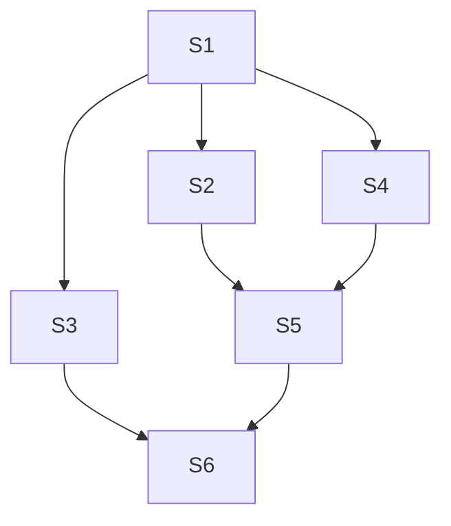
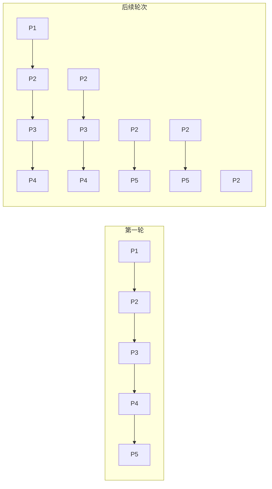
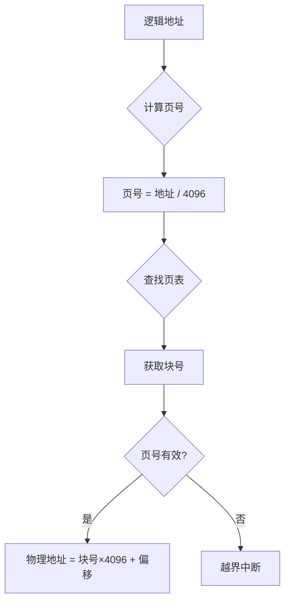
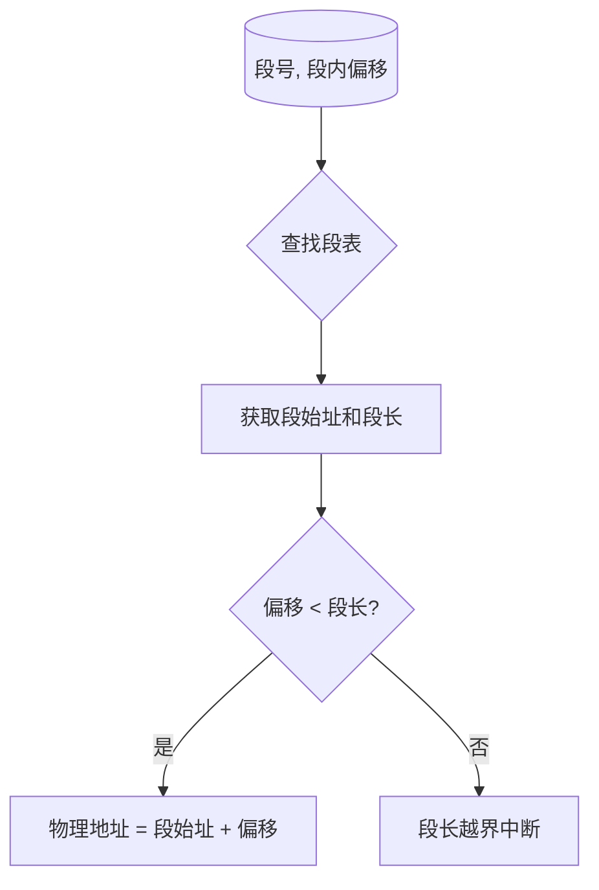

```mermaid
gantt
    title 多道程序运行时间线
    dateFormat  ss
    axisFormat %S

    section 程序A
    A计算1    : 0, 20ms
    A I/O     : 20, 20ms
    A计算2    : 40, 10ms

    section 程序B
    B计算1    : 20, 30ms
    B I/O     : 50, 40ms
    B计算2    : 90, 20ms

    section 程序C
    C计算1    : 50, 10ms
    C I/O     : 60, 20ms
    C计算2    : 80, 10ms

    section I/O设备
    I/O_A     : 20, 20ms
    I/O_B     : 50, 40ms
    I/O_C     : 80, 20ms
```

# 操作系统期末复习

## 作业题汇总

---

### 作业1：多道程序运行时间计算（第1章）

#### 题目描述
设内存中有三道程序 A、B、C，它们按 A→B→C 的先后次序执行，它们进行"计算"和"I/O 操作"的时间如下表所示，假设三道程序使用相同的 I/O 设备。

| 程序 | 计算 | I/O 操作 | 计算 |
|------|------|----------|------|
| A | 20 | 20 | 10 |
| B | 30 | 40 | 20 |
| C | 10 | 20 | 10 |

试画出多道运行时三道程序的时间关系图，并计算完成三道程序要花多少时间。

#### 解析

**时间线图：**



**关键分析：**
1. **0-20ms**: A 计算，B、C 等待
2. **20-40ms**: A I/O，B 计算（I/O 与计算并行）
3. **40-50ms**: A 计算完成，B 继续计算，C 等待
4. **50-60ms**: B I/O，C 开始计算
5. **60-80ms**: B I/O，C 等待 I/O 设备
6. **80-90ms**: B I/O，C 计算完成
7. **90-110ms**: B 计算完成

**总时间 = 110ms**

---

### 作业2：进程同步（第3章）

#### 题目描述
进程之间的关系如下图所示，试用 P、V 操作描述它们之间的同步。



**进程依赖关系：**
- S3、S4、S2 都需要等待 S1 完成
- S5 需要等待 S2、S4 完成
- S6 需要等待 S3、S5 完成

#### 解析

```c
// 定义信号量
semaphore s12 = 0, s13 = 0, s14 = 0;  // S1完成后通知S2,S3,S4
semaphore s25 = 0, s45 = 0;           // S2,S4完成后通知S5
semaphore s36 = 0, s56 = 0;           // S3,S5完成后通知S6

// 进程 S1
process S1() {
    // 执行 S1
    V(s12);  // 通知 S2
    V(s13);  // 通知 S3
    V(s14);  // 通知 S4
}

// 进程 S2
process S2() {
    P(s12);  // 等待 S1
    // 执行 S2
    V(s25);  // 通知 S5
}

// 进程 S3
process S3() {
    P(s13);  // 等待 S1
    // 执行 S3
    V(s36);  // 通知 S6
}

// 进程 S4
process S4() {
    P(s14);  // 等待 S1
    // 执行 S4
    V(s45);  // 通知 S5
}

// 进程 S5
process S5() {
    P(s25);  // 等待 S2
    P(s45);  // 等待 S4
    // 执行 S5
    V(s56);  // 通知 S6
}

// 进程 S6
process S6() {
    P(s36);  // 等待 S3
    P(s56);  // 等待 S5
    // 执行 S6
}
```

---

### 作业3：调度算法计算（第4章）

#### 题目描述
设有5个进程，它们的提交时间和运行时间如下表所示：

| 进程名 | 提交时间 | 需运行时间 |
|--------|----------|------------|
| P1 | 10.1小时 | 0.3小时 |
| P2 | 10.3小时 | 0.6小时 |
| P3 | 10.5小时 | 0.3小时 |
| P4 | 10.6小时 | 0.3小时 |
| P5 | 10.7小时 | 0.2小时 |

请给出以下每种调度算法的各个进程的开始时间、完成时间、周转时间、带权周转时间，及所有进程的平均周转时间和平均带权周转时间。（结果除不尽时保留两位小数）

(1) 先来先服务调度算法  
(2) 短进程优先  
(3) 时间片轮转调度算法（假设时间片大小为 0.1 小时）  
(4) 优先权调度算法（P1,P2,P3,P4,P5优先权分别为3,5,2,1,4，这里5为最高优先权）

#### 解析

##### (1) 先来先服务（FCFS）


| 进程 | 提交 | 运行 | 开始 | 完成 | 周转 | 带权周转 |
|------|------|------|------|------|------|----------|
| P1 | 10.1 | 0.3 | 10.1 | 10.4 | 0.3 | 1.00 |
| P2 | 10.3 | 0.6 | 10.4 | 11.0 | 0.7 | 1.17 |
| P3 | 10.5 | 0.3 | 11.0 | 11.3 | 0.8 | 2.67 |
| P4 | 10.6 | 0.3 | 11.3 | 11.6 | 1.0 | 3.33 |
| P5 | 10.7 | 0.2 | 11.6 | 11.8 | 1.1 | 5.50 |

**平均周转时间 = 0.78**  
**平均带权周转 = 2.73**

##### (2) 短进程优先（SPF）


| 进程 | 提交 | 运行 | 开始 | 完成 | 周转 | 带权周转 |
|------|------|------|------|------|------|----------|
| P1 | 10.1 | 0.3 | 10.1 | 10.4 | 0.3 | 1.00 |
| P5 | 10.7 | 0.2 | 10.4 | 10.6 | 0.2 | 1.00 |
| P3 | 10.5 | 0.3 | 10.6 | 10.9 | 0.4 | 1.33 |
| P4 | 10.6 | 0.3 | 10.9 | 11.2 | 0.6 | 2.00 |
| P2 | 10.3 | 0.6 | 11.2 | 11.8 | 1.5 | 2.50 |

**平均周转时间 = 0.60**  
**平均带权周转 = 1.57**

##### (3) 时间片轮转（RR, 时间片=0.1）



| 进程 | 提交 | 运行 | 开始 | 完成 | 周转 | 带权周转 |
|------|------|------|------|------|------|----------|
| P1 | 10.1 | 0.3 | 10.1 | 10.6 | 0.5 | 1.67 |
| P2 | 10.3 | 0.6 | 10.3 | 11.8 | 1.5 | 2.50 |
| P3 | 10.5 | 0.3 | 10.5 | 11.1 | 0.6 | 2.00 |
| P4 | 10.6 | 0.3 | 10.6 | 11.3 | 0.7 | 2.33 |
| P5 | 10.7 | 0.2 | 10.7 | 11.0 | 0.3 | 1.50 |

**平均周转时间 = 0.72**  
**平均带权周转 = 2.00**

##### (4) 优先权调度（5最高）


| 进程 | 提交 | 运行 | 优先级 | 开始 | 完成 | 周转 | 带权周转 |
|------|------|------|--------|------|------|------|----------|
| P1 | 10.1 | 0.3 | 3 | 10.1 | 10.4 | 0.3 | 1.00 |
| P2 | 10.3 | 0.6 | 5 | 10.4 | 11.0 | 0.7 | 1.17 |
| P5 | 10.7 | 0.2 | 4 | 11.0 | 11.2 | 0.5 | 2.50 |
| P3 | 10.5 | 0.3 | 2 | 11.2 | 11.5 | 1.0 | 3.33 |
| P4 | 10.6 | 0.3 | 1 | 11.5 | 11.8 | 1.2 | 4.00 |

**平均周转时间 = 0.74**  
**平均带权周转 = 2.40**

---

### 作业4：分页存储管理地址计算（第5章）

#### 题目描述
在分页存储管理方式下，页面大小为 4KB，已装入内存。内存的作业的页表如下：

| 页号 | 块号 |
|------|------|
| 0 | 2 |
| 1 | 6 |
| 2 | 12 |
| 3 | 20 |
| 4 | 27 |

请计算下列逻辑地址所对应的物理地址：376, 2872, 18702, 4769, 20837。

#### 解析

**地址转换流程：**



**页面大小 = 4KB = 4096 字节**

| 逻辑地址 | 页号 | 页内偏移 | 块号 | 物理地址 |
|----------|------|----------|------|----------|
| 376 | 0 | 376 | 2 | **8568** |
| 2872 | 0 | 2872 | 2 | **11064** |
| 18702 | 4 | 2318 | 27 | **113090** |
| 4769 | 1 | 673 | 6 | **25249** |
| 20837 | 5 | 525 | - | **越界** |

---

### 作业5：分段存储管理地址计算（第5章）

#### 题目描述
某个采用分段存储管理的系统为装入内存的一个作业建立了如下段表：

| 段号 | 段始址 | 段长 |
|------|--------|------|
| 0 | 2100 | 630B |
| 1 | 3500 | 140B |
| 2 | 190 | 100B |
| 3 | 1200 | 520B |
| 4 | 3900 | 970B |

计算该作业访问内存地址 (0,337), (1,100), (2,200), (3,550), (4,850) 时的物理地址。

#### 解析

**地址转换流程：**



| 逻辑地址 | 段号 | 段内偏移 | 段始址 | 段长 | 是否越界 | 物理地址 |
|----------|------|----------|--------|------|----------|----------|
| (0,337) | 0 | 337 | 2100 | 630 | 否 | **2437** |
| (1,100) | 1 | 100 | 3500 | 140 | 否 | **3600** |
| (2,200) | 2 | 200 | 190 | 100 | **是** | 段长越界 |
| (3,550) | 3 | 550 | 1200 | 520 | **是** | 段长越界 |
| (4,850) | 4 | 850 | 3900 | 970 | 否 | **4750** |

---

*整理时间：2025年5月*
