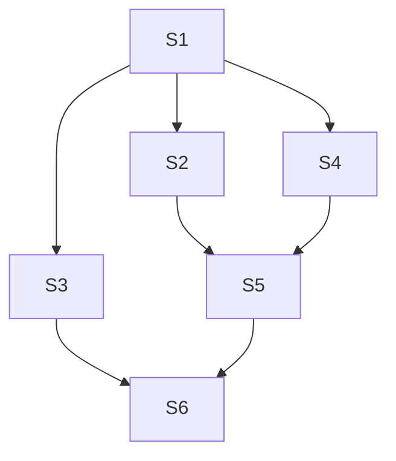
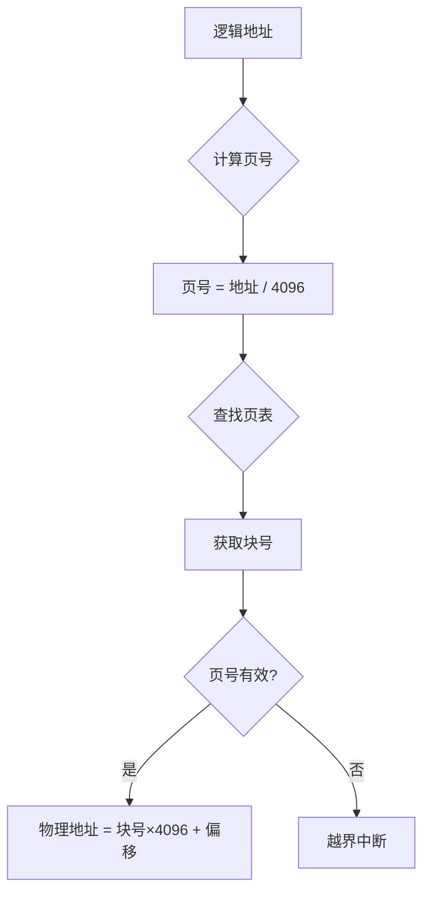
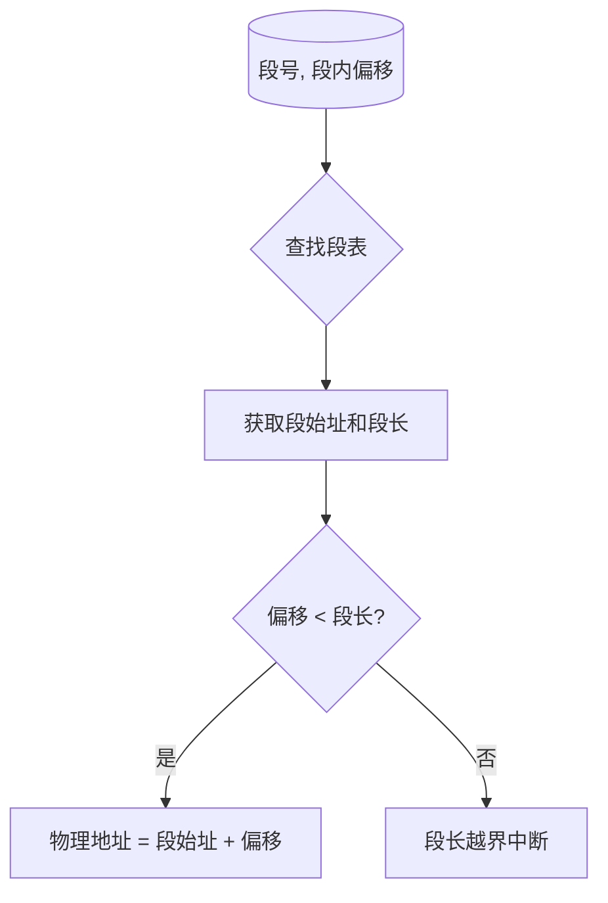

# 操作系统期末复习

---

**作业题汇总**

---

**作业1：多道程序运行时间计算（第1章）**

**题目描述**：设内存中有三道程序 A、B、C，它们按 A→B→C 的先后次序执行，它们进行"计算"和"I/O 操作"的时间如下表所示，假设三道程序使用相同的 I/O 设备。

| 程序 | 计算 | I/O 操作 | 计算 |
|------|------|----------|------|
| A | 20 | 20 | 10 |
| B | 30 | 40 | 20 |
| C | 10 | 20 | 10 |

试画出多道运行时三道程序的时间关系图，并计算完成三道程序要花多少时间。

**解析**

**时间线图**：

```mermaid
gantt
    title 多道程序运行时间线（同一I/O设备）
    dateFormat  ss
    axisFormat %S

    section CPU（同一时刻只能运行一个程序）
    A计算1 (20ms)     : 0, 20ms
    B计算1 (30ms)     : 20, 30ms
    A计算2 (10ms)     : 50, 10ms
    C计算1 (10ms)     : 60, 10ms
    CPU空闲           : 70, 20ms
    B计算2 (20ms)     : 90, 20ms
    C计算2 (10ms)     : 110, 10ms

    section I/O设备（同一时刻只能服务一个程序）
    A I/O (20ms)      : 20, 20ms
    B I/O (40ms)      : 50, 40ms
    C I/O (20ms)      : 90, 20ms
```



**关键分析（三道程序使用同一 I/O 设备，I/O 操作必须串行）**：
1. **0-20ms**：A 计算，B、C 等待
2. **20-40ms**：A I/O，B 计算（I/O 与计算并行）
3. **40-50ms**：A I/O 结束等待 CPU，B 继续计算（非抢占）
4. **50-60ms**：B I/O 开始，A 计算完成（A 结束）
5. **60-70ms**：B I/O，C 开始计算
6. **70-90ms**：B I/O，C 等待 I/O 设备（I/O 设备被 B 占用）
7. **90-110ms**：B 计算，C I/O（两者并行）
8. **110-120ms**：C 计算完成（B 于 110ms 结束，C 于 120ms 结束）

**总时间 = 120ms**

---

**作业2：进程同步（第3章）**

**题目描述**：进程之间的关系如下图所示，试用 P、V 操作描述它们之间的同步。



**进程依赖关系**：
- S3、S4、S2 都需要等待 S1 完成
- S5 需要等待 S2、S4 完成
- S6 需要等待 S3、S5 完成

**解析**

```c
// 定义信号量
semaphore s12 = 0, s13 = 0, s14 = 0;  // S1完成后通知S2,S3,S4
semaphore s25 = 0, s45 = 0;           // S2,S4完成后通知S5
semaphore s36 = 0, s56 = 0;          // S3,S5完成后通知S6

// 进程 S1
process S1() {
    // 执行 S1
    V(s12);  // 通知 S2
    V(s13);  // 通知 S3
    V(s14);  // 通知 S4
}

// 进程 S2
process S2() {
    P(s12);  // 等待 S1
    // 执行 S2
    V(s25);  // 通知 S5
}

// 进程 S3
process S3() {
    P(s13);  // 等待 S1
    // 执行 S3
    V(s36);  // 通知 S6
}

// 进程 S4
process S4() {
    P(s14);  // 等待 S1
    // 执行 S4
    V(s45);  // 通知 S5
}

// 进程 S5
process S5() {
    P(s25);  // 等待 S2
    P(s45);  // 等待 S4
    // 执行 S5
    V(s56);  // 通知 S6
}

// 进程 S6
process S6() {
    P(s36);  // 等待 S3
    P(s56);  // 等待 S5
    // 执行 S6
}
```

---

**作业3：调度算法计算（第4章）**

**题目描述**：设有5个进程，它们的提交时间和运行时间如下表所示：

| 进程名 | 提交时间 | 需运行时间 |
|--------|----------|------------|
| P1 | 10.1小时 | 0.3小时 |
| P2 | 10.3小时 | 0.6小时 |
| P3 | 10.5小时 | 0.3小时 |
| P4 | 10.6小时 | 0.3小时 |
| P5 | 10.7小时 | 0.2小时 |

请给出以下每种调度算法的各个进程的开始时间、完成时间、周转时间、带权周转时间，及所有进程的平均周转时间和平均带权周转时间。（结果除不尽时保留两位小数）

(1) 先来先服务调度算法
(2) 短进程优先
(3) 时间片轮转调度算法（假设时间片大小为 0.1 小时）
(4) 优先权调度算法（P1,P2,P3,P4,P5优先权分别为3,5,2,1,4，这里5为最高优先权）

**解析**

**(1) 先来先服务（FCFS）**

| 进程 | 提交 | 运行 | 开始 | 完成 | 周转 | 带权周转 |
|------|------|------|------|------|------|----------|
| P1 | 10.1 | 0.3 | 10.1 | 10.4 | 0.3 | 1.00 |
| P2 | 10.3 | 0.6 | 10.4 | 11.0 | 0.7 | 1.17 |
| P3 | 10.5 | 0.3 | 11.0 | 11.3 | 0.8 | 2.67 |
| P4 | 10.6 | 0.3 | 11.3 | 11.6 | 1.0 | 3.33 |
| P5 | 10.7 | 0.2 | 11.6 | 11.8 | 1.1 | 5.50 |

**平均周转时间 = 0.78**
**平均带权周转 = 2.73**

**(2) 短进程优先（SPF）**

| 进程 | 提交 | 运行 | 开始 | 完成 | 周转 | 带权周转 |
|------|------|------|------|------|------|----------|
| P1 | 10.1 | 0.3 | 10.1 | 10.4 | 0.3 | 1.00 |
| P5 | 10.7 | 0.2 | 10.4 | 10.6 | 0.2 | 1.00 |
| P3 | 10.5 | 0.3 | 10.6 | 10.9 | 0.4 | 1.33 |
| P4 | 10.6 | 0.3 | 10.9 | 11.2 | 0.6 | 2.00 |
| P2 | 10.3 | 0.6 | 11.2 | 11.8 | 1.5 | 2.50 |

**平均周转时间 = 0.60**
**平均带权周转 = 1.57**

**(3) 时间片轮转（RR, 时间片=0.1）**

| 进程 | 提交 | 运行 | 开始 | 完成 | 周转 | 带权周转 |
|------|------|------|------|------|------|----------|
| P1 | 10.1 | 0.3 | 10.1 | 10.6 | 0.5 | 1.67 |
| P2 | 10.3 | 0.6 | 10.3 | 11.8 | 1.5 | 2.50 |
| P3 | 10.5 | 0.3 | 10.5 | 11.1 | 0.6 | 2.00 |
| P4 | 10.6 | 0.3 | 10.6 | 11.3 | 0.7 | 2.33 |
| P5 | 10.7 | 0.2 | 10.7 | 11.0 | 0.3 | 1.50 |

**平均周转时间 = 0.72**
**平均带权周转 = 2.00**

**(4) 优先权调度（5最高）**

| 进程 | 提交 | 运行 | 优先级 | 开始 | 完成 | 周转 | 带权周转 |
|------|------|------|--------|------|------|------|----------|
| P1 | 10.1 | 0.3 | 3 | 10.1 | 10.4 | 0.3 | 1.00 |
| P2 | 10.3 | 0.6 | 5 | 10.4 | 11.0 | 0.7 | 1.17 |
| P5 | 10.7 | 0.2 | 4 | 11.0 | 11.2 | 0.5 | 2.50 |
| P3 | 10.5 | 0.3 | 2 | 11.2 | 11.5 | 1.0 | 3.33 |
| P4 | 10.6 | 0.3 | 1 | 11.5 | 11.8 | 1.2 | 4.00 |

**平均周转时间 = 0.74**
**平均带权周转 = 2.40**

---

**作业4：分页存储管理地址计算（第5章）**

**题目描述**：在分页存储管理方式下，页面大小为 4KB，已装入内存。内存的作业的页表如下：

| 页号 | 块号 |
|------|------|
| 0 | 2 |
| 1 | 6 |
| 2 | 12 |
| 3 | 20 |
| 4 | 27 |

请计算下列逻辑地址所对应的物理地址：376, 2872, 18702, 4769, 20837。

**解析**

**地址转换流程**：



**页面大小 = 4KB = 4096 字节**

| 逻辑地址 | 页号 | 页内偏移 | 块号 | 物理地址 |
|----------|------|----------|------|----------|
| 376 | 0 | 376 | 2 | **8568** |
| 2872 | 0 | 2872 | 2 | **11064** |
| 18702 | 4 | 2318 | 27 | **113090** |
| 4769 | 1 | 673 | 6 | **25249** |
| 20837 | 5 | 525 | - | **越界** |

---

**作业5：分段存储管理地址计算（第5章）**

**题目描述**：某个采用分段存储管理的系统为装入内存的一个作业建立了如下段表：

| 段号 | 段始址 | 段长 |
|------|--------|------|
| 0 | 2100 | 630B |
| 1 | 3500 | 140B |
| 2 | 190 | 100B |
| 3 | 1200 | 520B |
| 4 | 3900 | 970B |

计算该作业访问内存地址 (0,337), (1,100), (2,200), (3,550), (4,850) 时的物理地址。

**解析**

**地址转换流程**：



| 逻辑地址 | 段号 | 段内偏移 | 段始址 | 段长 | 是否越界 | 物理地址 |
|----------|------|----------|--------|------|----------|----------|
| (0,337) | 0 | 337 | 2100 | 630 | 否 | **2437** |
| (1,100) | 1 | 100 | 3500 | 140 | 否 | **3600** |
| (2,200) | 2 | 200 | 190 | 100 | **是** | 段长越界 |
| (3,550) | 3 | 550 | 1200 | 520 | **是** | 段长越界 |
| (4,850) | 4 | 850 | 3900 | 970 | 否 | **4750** |

---

**作业6：页面置换算法计算（第6章）**

**题目描述**：在一个分页虚拟存储管理系统中，一个程序的页面走向为2，4, 1, 2, 5, 0, 6,3, 0, 4, 2, 3,设分配给该程序的存储块数M=3,初始状态存储块均为空，没有页面在内存。当分别采用最佳置换算法、先进先出置换算法和最近最久未使用算法时，求缺页的次数和缺页中断率。

**解析**

> **最佳置换算法（OPT）**
>
> 访问页面 内存状态 缺页？
> 2 [2, , ] 是
> 4 [2, 4, ] 是
> 1 [2, 4, 1] 是
> 2 [2, 4, 1] 否
> 5 [2, 4, 5] 是（淘汰1）
> 0 [2, 4, 0] 是（淘汰5）
> 6 [6, 4, 0] 是（淘汰2）
> 3 [3, 4, 0] 是（淘汰6）
> 0 [3, 4, 0] 否
> 4 [3, 4, 0] 否
> 2 [3, 2, 0] 是（淘汰4）
> 3 [3, 2, 0] 否
> 缺页次数：8
> 缺页中断率：8/12 = 2/3 ≈ 66.67%
>
> **先进先出置换算法（FIFO）**
>
> 访问页面 内存状态 缺页？
> 2 [2, , ] 是
> 4 [2, 4, ] 是
> 1 [2, 4, 1] 是
> 2 [2, 4, 1] 否
> 5 [4, 1, 5] 是（淘汰2）
> 0 [1, 5, 0] 是（淘汰4）
> 6 [5, 0, 6] 是（淘汰1）
> 3 [0, 6, 3] 是（淘汰5）
> 0 [0, 6, 3] 否
> 4 [6, 3, 4] 是（淘汰0）
> 2 [3, 4, 2] 是（淘汰6）
> 3 [3, 4, 2] 否
> 缺页次数：9
> 缺页中断率：9/12 = 3/4 = 75%
>
> **最近最久未使用算法（LRU）**
>
> （内存状态左侧为最近使用）
> 访问页面 内存状态 缺页？
> 2 [2] 是
> 4 [4, 2] 是
> 1 [1, 4, 2] 是
> 2 [2, 1, 4] 否
> 5 [5, 2, 1] 是（淘汰4）
> 0 [0, 5, 2] 是（淘汰1）
> 6 [6, 0, 5] 是（淘汰2）
> 3 [3, 6, 0] 是（淘汰5）
> 0 [0, 3, 6] 否
> 4 [4, 0, 3] 是（淘汰6）
> 2 [2, 4, 0] 是（淘汰3）
> 3 [3, 2, 4] 是（淘汰0）
> 缺页次数：10
> 缺页中断率：10/12 = 5/6 ≈ 83.33%

---

**作业7：磁盘管理算法计算（第7章）**

**题目描述一**：假设一个磁盘有200个柱面,编号为0~199，当前存取臂的位置是在143号柱面上,并刚刚完成了125号柱面的服务请求，如果存在请求序列86、147、91、177、94、150、102、175、130、为完成上述请求、采用下列算法时存取臂的移动顺序是什么?移动总量是多少? (1)先来先服务(FCFS)。 (2)最短寻道时间优先(SSTF)。 (3)扫描算法(SCAN)。 (4)循环扫描算法(C-SCAN)。

**解析**

> **(1) 先来先服务（FCFS）**
>
> 移动顺序：143、86、147、91、177、94、150、102、175、130
>
> 移动总量：(143-86)+(147-86)+(147-91)+(177-91)+(177-94)+(150-94)+(150-102)+(175-102)+(175-130)=565
>
> **(2) 最短寻道时间优先（SSTF）**
>
> 移动顺序：143、147、150、130、102、94、91、86、175、177
>
> 移动总量：(147-143)+(150-147)+(150-130)+(130-102)+(102-94)+(94-91)+(91-86)+(175-86)+(177-175)=162
>
> **(3) 扫描算法（SCAN）**
>
> 移动顺序：143、147、150、175、177、130、102、94、91、86
>
> 移动总量：(147-143)+(150-147)+(175-150)+(177-175)+(177-130)+(130-102)+(102-94)+(94-91)+(91-86)=125
>
> **(4) 循环扫描算法（C-SCAN）**
>
> 移动顺序：143、147、150、175、177、86、91、94、102、130
>
> 移动总量：(147-143)+(150-147)+(175-150)+(177-175)+(177-86)+(91-86)+(94-91)+(102-94)+(130-102)=169

**题目描述二**：假设一个磁盘有10个盘面，每个盘面有200个磁道，每个磁道有15个扇区。当进程要访问磁盘的12345扇区时，计算该扇区在磁盘的第几柱面、第几磁道、第几扇区。

**解析**

> 逻辑扇区号从0开始编号。已知：10个盘面（磁头数=10），每个盘面200个磁道（柱面数=200），每个磁道15个扇区。
>
> 每个柱面的扇区数 = 磁头数 × 每磁道扇区数 = 10 × 15 = 150
>
> 柱面号 = 12345 ÷ 150 = 82（余数45）
> 磁头号 = 45 ÷ 15 = 3（余数0）
> 扇区号 = 0
>
> 因此，第12345扇区位于：**第82柱面、第3磁头（第3盘面）、第0扇区**

---

# 第1章 操作系统引论

**1.1 操作系统的概念**

1. 【单选题】按照所起的作用和需要的运行环境，操作系统属于_______。
   - A. 系统软件
   - B. 应用软件
   - C. 支撑软件
   - D. 用户软件
   - **答案：A**

> **解析：**
> 要理解为什么操作系统属于"系统软件"，我们可以把计算机系统看作一个"金字塔"架构：
> 
> 系统软件（底层基石）： 它是计算机运行的"基础"。没有它，计算机硬件就只是一堆废铁，什么都干不了。系统软件直接管理和控制计算机的硬件资源（如CPU、内存、硬盘等），并为其他软件提供一个运行平台。操作系统（如Windows、macOS、Android）就是最核心的系统软件，它全权负责协调硬件和软件的底层运转。
> 
> 应用软件（上层建筑）： 它是为了解决用户某个具体需求而编写的软件。比如你想聊天就打开微信，想看视频就打开播放器，想写文档就用Word。这些软件必须安装在操作系统之上才能运行。
> 
> 支撑软件与用户软件： 支撑软件（如开发工具、测试软件）和用户软件（用户自己定制的软件）都不是用来从底层管理整台计算机运行的。
> 
> **总结：** 操作系统直接跟硬件打交道，并为所有应用软件提供生存环境。没有它，整个计算机系统就无法工作，因此它属于必不可少的系统软件。


2. 【单选题】在计算机系统中，操作系统是_______。
   - A. 处于系统软件之上的用户软件
   - B. 处于应用软件之上的系统软件
   - C. 处于硬件之下的底层软件
   - D. 处于裸机之上的第一层软件
   - **答案：D**

> **解析：**
> 要理解为什么操作系统是“处于裸机之上的第一层软件”，我们可以看一看计算机系统的**层次结构**（就像盖楼房或穿衣服一样，是一层套一层的）：
> 1. **什么是“裸机”？** >    裸机是指光有CPU、内存、硬盘等硬件，但没有安装任何软件的计算机。这时候的计算机就像一个没有灵魂的躯壳，普通用户根本无法直接使用。
> 2. **第一层软件（操作系统）：** >    为了让这台“裸机”动起来，我们必须紧贴着硬件安装的第一层软件就是**操作系统**。它直接负责给硬件发号施令，把硬件的底层复杂操作（比如电流信号、磁盘旋转）封装成简单的功能。
> 3. **其他软件在它之上：** >    只有当操作系统安装好并运行起来后，其他的系统软件（如数据库）和应用软件（如微信、游戏、浏览器）才有舞台可以安装和运行。
> 
> 
> **排查错项：**
> * **A项和B项：** 操作系统本身就是系统软件的核心，它应该处于应用软件的**下面**，为应用软件提供底层支撑，而不是在它们之上。
> * **C项：** 硬件已经是计算机的最底层了（物理实体），任何软件都是运行在硬件内部或之上的，不可能跑到硬件的“底下”去。
> 
> 
> **总结：** 操作系统紧紧包裹在硬件（裸机）外面，是整个软件系统的基石，因此它是**处于裸机之上的第一层软件**。


3. 【单选题】操作系统是对_____进行管理的软件。
   - A. 软件
   - B. 计算机资源
   - C. 程序
   - D. 硬件
   - **答案：B**

> **解析：**
> 要理解为什么操作系统管理的是“计算机资源”，我们需要先搞清楚计算机里到底有哪些“资源”，以及操作系统充当了什么角色。
> 在计算机世界里，“资源”可以分为两大类：
> 1. **硬件资源：** 比如中央处理器（CPU）、内存、硬盘、鼠标、键盘、显示器等看得见摸得着的物理设备。
> 2. **软件资源：** 比如存放在硬盘上的文件、正在运行的程序、各种数据等看不见摸不着的逻辑对象。
> 
> 
> **操作系统的核心身份，就是一个“大管家”：**
> 如果没有这个管家，多个程序同时运行就会打架。比如，微信和游戏同时想用CPU，或者同时想往内存里存数据，就会乱套。
> 操作系统的主要工作就是：
> * **分配硬件：** 决定现在哪个程序可以用CPU，可以用多少内存。
> * **管理软件：** 决定文件怎么在硬盘里存放，程序怎么启动和关闭。
> 
> 
> **排查错项：**
> * **A项（软件）、C项（程序）和D项（硬件）：** 都只说对了一部分。操作系统既要管硬件，又要管软件。如果只选其中一个，就属于“以偏概全”。
> 
> 
> **总结：** “计算机资源”是硬件资源和软件资源的**总称**。操作系统作为全能管家，管的是整台计算机的所有资源，因此选择**B选项**。


4. 【单选题】从用户的观点，操作系统是______。
   - A. 用户与计算机之间的接口
   - B. 合理地组织计算机工作流程的软件
   - C. 控制和管理计算机资源的软件
   - D. 是扩充裸机功能的软件，是比裸机功能更强、使用方便的虚拟机
   - **答案：D**

> **解析：**
> 操作系统是一个多面手，从不同的角度（观点）来看它，得到的定义是不一样的。这道题强调的是从**用户的观点（或者说用户的体验和感受）**来看。
> 我们来对比一下为什么D是最准确、最全面的“用户视角”：
> 1. **什么是“虚拟机”？**
> 如果让你直接去操作“裸机”（只有芯片和电路板的机器），你必须输入复杂的机器指令（0和1的代码），普通用户根本无法使用。而安装了操作系统后，它把底层复杂的硬件操作隐藏起来了，呈现在用户面前的是一个有精美界面、可以用鼠标点按、用键盘打字的“新机器”。在用户眼里，这台机器比原来的裸机好用一万倍，就像是一台功能更强的“虚拟出来的计算机”。
> 2. **为什么D比A更好？**
> * **A选项（接口）**：这通常是从“用户与计算机交互”的单一方面来定义，或者说是从“程序员/接口开发”的观点来看。它说得对，但不够全面。
> * **D选项（虚拟机）**：它不仅包含了“好用、方便交互（接口的功能）”，还强调了操作系统对硬件能力的**“扩充”**。它让用户感觉自己拥有了一台功能强大、使用极其方便的完整机器。在操作系统的学术定义中，“从用户观点来看，操作系统是提供给用户的扩展机器或虚拟机”是最标准、最全面的表述。
> 
> 
> 
> 
> **排查错项：**
> * **B选项和C选项：** 这两个选项是从**操作系统的内部功能、管理者**的观点来看的（怎么组织流程、怎么管理资源）。这是计算机内部的视角，而不是坐在电脑前的“用户”所看到的视角。
> 
> 
> **总结：** 站在用户的立场上，操作系统帮我们包办了所有脏活累活，把复杂的硬件变成了一台既听话又好用的高科技“虚拟机”，因此选择**D选项**。


5. 【填空题】计算机系统是由____和____两部分组成的。
   - **答案：硬件、软件**

> **解析：**
> 要理解计算机系统的组成，我们可以用一个非常形象的类比：**计算机系统就像是一个“人”**。
> 一个完整的人，既要有健康的**身体（躯体）**，又要有健全的**思想（灵魂）**，两者缺一不可。
> 1. **硬件（相当于“躯体”）：**
> 指计算机系统中由电子、机械和光电元件等组成的各种物理实体。它是看得见、摸得着的。比如 CPU（大脑）、内存（临时记忆）、硬盘（永久记忆）、显示器（脸面）以及鼠标键盘等。光有硬件的计算机叫“裸机”，就像一个没有灵魂的躯壳，什么都做不了。
> 2. **软件（相当于“灵魂”）：**
> 指为了运行、管理和维护计算机系统，以及为了解决各类实际问题而编制的程序、数据和相关文档的集合。它是看不见、摸不着的，但却控制着硬件怎么工作。比如操作系统（Windows/Android）、微信、游戏等。没有软件，硬件就无法运转。
> 
> 
> **总结：**
> 硬件是软件运行的**物理基础**，软件是硬件发挥作用的**灵魂支持**。它们紧密结合，才构成了我们日常使用的**计算机系统**。因此，空缺处应该填**硬件**和**软件**。

**1.2 多道程序设计**

1. 【单选题】采用多道程序设计技术可以提高CPU和外部设备的______。
   - A. 稳定性
   - B. 兼容性
   - C. 可靠性
   - D. 利用率
   - **答案：D**

> **解析：**
> 要理解为什么多道程序设计技术能提高“利用率”，我们需要对比一下在它出现之前，计算机是怎么工作的。
> 在早期的**单道程序**时代，内存里一次只能放一个任务（程序 A）。
> * 当程序 A 需要计算时，CPU 忙碌，外部设备（如打印机、硬盘读写）闲置。
> * 当程序 A 需要打印文件或读取数据时，CPU 必须**停下来等待**外部设备慢吞吞地干完活，由于外部设备速度极慢，CPU 绝大多数时间都在“睡觉”浪费。
> 
> 
> 为了解决这个浪费问题，科学家发明了**多道程序设计技术**。
> **它是如何工作的？**
> 它的核心思想是：**“人歇车不歇，大家轮流用”**。现在我们把多个任务（程序 A、B、C）同时放入内存中。
> * 当程序 A 需要向硬盘写入数据（使用外部设备）时，CPU 不再傻傻地等待。
> * 操作系统会立刻把 CPU 调配给程序 B 去做数学计算。
> * 当程序 B 计算完或也要用外设时，CPU 再切换去运行程序 C。
> 
> 
> 这样一来，CPU 和外部设备都在同时忙碌，几乎没有闲着的时候。
> **排查错项：**
> * **A项（稳定性）和C项（可靠性）：** 这两项主要取决于硬件质量和软件是否有漏洞，多道程序设计让任务交替运行，反而增加了系统的复杂性，对稳定性和可靠性提出了更高的挑战，而不是直接提升它们。
> * **B项（兼容性）：** 兼容性是指软件和硬件之间能不能配合工作（比如Windows的软件能不能在Mac上运行），与多道程序设计无关。
> 
> 
> **总结：** 多道程序设计技术通过让多个程序“并存并轮流使用资源”，消除了设备闲置和 CPU 等待的时间，从而极大地提高了 CPU 和外部设备的**利用率**（即单位时间内被有效使用的程度）。因此选择 **D 选项**。

2. 【单选题】一个计算机系统采用多道程序设计技术后，使多道程序实现了。
   - A. 微观上并行
   - B. 微观和宏观上均串行
   - C. 微观和宏观上均并行
   - D. 宏观上并行
   - **答案：D**

> **解析：**
> 要理解这道题，我们需要区分两个非常容易混淆的概念：**“并行（Parallelism）”**和**“并发（Concurrency）”**。这两个词在日常生活中差不多，但在计算机领域有严格的区别。
> 我们可以把 CPU 想象成一个“魔术师”，把多道程序想象成他手里正在抛接的多个球（球 A、球 B、球 C）。
> * **宏观上（人类的视角）：**
> 由于魔术师的手速极快（现代 CPU 每秒可以运行几十亿次），他在极短的时间内频繁地在程序 A、程序 B、程序 C 之间来回切换。在我们人类看来，感觉这些程序好像是在**同时运行**。这就是**宏观上的并行**（准确地说是“并发”）。
> * **微观上（放大到微秒、纳米级视角）：**
> 如果我们用慢镜头把时间放大，你会发现**在某一个绝对的瞬间，单核 CPU 的手里其实只有一颗球**。也就是说，任意一个微小的时刻，CPU 只能执行某一个程序。它们实际上是“你运行一会儿，我运行一会儿”的轮流交替状态。这就是**微观上的串行**。
> 
> 
> **排查错项：**
> * **A项和C项（微观上并行）：** 如果是单核 CPU，微观上是绝对不可能并行的（无法在同一瞬间同时处理两件事）。只有多核/多CPU系统才能做到微观并行。
> * **B项（宏观上串行）：** 如果宏观上也是串行，那就变成了早期的“单道程序”——必须等程序 A 彻底运行完了，程序 B 才能启动，用户就会感觉到明显的卡顿和等待。
> 
> 
> **总结：** 多道程序设计技术通过极其快速的切换，欺骗了人类的眼睛，实现了**宏观上并行、微观上串行**的效果。因此选择 **D 选项**。


3. 【填空题】采用多道程序设计技术能够充分发挥____和____并行工作的能力。
   - **答案：CPU、外设**

> **解析：**
> 要填对这两个空，我们需要回顾一下“多道程序设计技术”诞生的初衷：**为了解决计算机内部“有人极忙，有人极闲”的矛盾**。
> 在计算机内部，有两个核心部件的工作速度天差地别：
> 1. **中央处理器（CPU）：** 电子运行速度，计算极其快速。
> 2. **外部设备（外设，如硬盘、打印机、键盘）：** 机械或人工操作速度，速度极其缓慢。
> 
> 
> * **没有多道程序时（串行工作）：**
> 当程序需要从硬盘读取数据（外设工作）时，CPU 只能停下来死等。这就好比一个顶级大厨（CPU）在等一头乌龟（外设）把食材运过来，大厨绝大多数时间都在闲着，两者的能力被严重遏制。
> * **采用了多道程序设计技术后（并行工作）：**
> 多道程序打破了这种“非此即彼”的等待僵局。当程序 A 正在慢吞吞地使用**外设**读取数据时，系统立刻把**CPU**分配给程序 B 去做复杂的数学计算。
> 
> 
> 这样一来，在同一个时间段内，**CPU 正在忙着计算，外设也正在忙着传输数据**，它们从“互相死等”变成了“各忙各的、同时工作”。
> **总结：**
> 多道程序设计技术的核心优势，就是打破了传统单道程序中硬件排队等待的现象，让负责计算的 **CPU** 和负责输入输出的 **外设** 能够同时运转。因此，空缺处应该填 **CPU** 和 **外设**（或外部设备）。

4. 【填空题】多道程序环境下的各道程序，宏观上它们是在____运行，微观上它们是在____运行。
   - **答案：并行、串行**

> **解析：**
> 要理解这个填空，我们可以直接用“看电影”和“逐帧拆解”的视角来看待多道程序在计算机里的运行状态：
> 1. **宏观上（人类的整体视角）：**
> 当我们坐在电脑前，看着音乐播放器在放歌、浏览器在下载文件、聊天软件在接收消息，在我们人类的眼里，这些程序全部都在**同时进行**。这种在同一时间段内宏观往前推进的状态，就叫做**并行**（在单核CPU下准确地说是并发，但宏观表现为并行）。
> 2. **微观上（放大到微秒级的精准视角）：**
> 如果把时间切得无限碎（比如一微秒、一纳米），由于单核 CPU 在某一个绝对的瞬间只能处理一个指令，你会发现这些程序其实是排好队，**你运行一会、我运行一会，轮流交替使用 CPU 的**。这种一个接一个、不能同时起步的状态，就叫做**串行**。
> 
> 
> **总结：**
> 多道程序设计利用了 CPU 极快的切换速度，欺骗了人类的感官。因此，多道程序在宏观上是在**并行**运行，微观上是在**串行**运行。


5. 【填空题】在操作系统的发展过程中，____和____的出现，标志着操作系统的正式形成。
   - **答案：多道、分时**

> **解析：**
> 要理解为什么是“多道”和“分时”标志着操作系统的正式形成，我们可以看一看操作系统进化史上的两次“质的飞跃”：
> 1. **第一次飞跃：多道批处理系统的出现（多道）**
> 早期的计算机非常笨，一次只能运行一个程序，CPU 经常闲着。后来引入了**多道程序设计技术**，让多个程序同时进入内存轮流使用 CPU。这使得计算机第一次拥有了资源管理和调度的功能，解决了**“效率”**问题。
> 2. **第二次飞跃：分时操作系统的出现（分时）**
> 虽然多道批处理提高了效率，但用户把任务交上去后就只能被动等待结果，无法在程序运行过程中进行修改（缺乏交互性）。**分时技术**把 CPU 的运行时间分成极其微小的“时间片”，轮流分给各个终端用户。由于切换速度极快，每个用户都感觉自己独占了整台计算机。这解决了**“人机交互”**问题。
> 
> 
> **总结：**
> “多道技术”奠定了操作系统**管理资源（效率）**的基础，“分时技术”奠定了操作系统**服务用户（交互）**的模式。这两个核心特征成型后，现代意义上的操作系统才算真正诞生。因此，空缺处应该填**多道**和**分时**。

**1.3 操作系统的特征**

1. 【单选题】一个作业第一次执行时用了5min，而第二次执行时用了6min,这说明了操作系统的______特点。
   - A. 虚拟性
   - B. 共享性
   - C. 不确定性
   - D. 并发性
   - **答案：C**


> **解析：**
> 要理解为什么这说明了操作系统的“不确定性”，我们需要看看在多道程序环境下，作业的执行过程受到了什么影响。
> 1. **什么是操作系统的“不确定性”（也叫异步性）？**
> 在现代操作系统中，内存里同时运行着很多个作业。由于资源（如CPU、内存、硬盘）是有限的，大家必须轮流或者抢占使用。这就导致一个作业在执行时，**什么时候能分到CPU、能分到多久、什么时候会因为等外设而停下来，全都是无法预知的**。
> 2. **为什么两次执行时间会不一样？**
> * **第一次执行（5分钟）：** 此时系统里可能运行的其它作业比较少，或者其它作业不怎么跟它抢资源，它一申请CPU就能立刻得到，所以跑得快。
> * **第二次执行（6分钟）：** 此时系统里可能刚好有几个大任务也在运行（比如有人在下载大文件或渲染视频）。这个作业不得不频繁地停下来等待CPU资源，导致一走一停，总共花了6分钟才干完同样的活。
> 
> 
> 
> 
> **排查错项：**
> * **A项（虚拟性）：** 指把一个物理实体变成若干个逻辑上的对应物（如虚拟内存），与执行时间长短无关。
> * **B项（共享性）：** 指系统中的资源可供内存中多个并发执行的程序共同使用。共享性是导致不确定性的**原因**，但题目问的是这种“时间变长”的现象说明了什么**特点/结果**。
> * **D项（并发性）：** 指两个或多个事件在同一时间段内发生。同样，并发是背景，而不确定性才是描述这种“执行结果无法预知”的直接特点。
> 
> 
> **总结：** 同样的作业，在不同的系统环境下执行，其推进的速度和完成的总时间是不可预知的、因时而异的，这正是操作系统**不确定性（异步性）**的典型表现。因此选择 **C 选项**。


1. 【单选题】操作系统的最基本的两个特征是资源共享和_______。
   - A. 程序的并发执行
   - B. 程序顺序执行
   - C. 多道程序设计
   - D. 中断
   - **答案：A**


> **解析：**
> 要理解为什么是“程序的并发执行”，我们需要明白操作系统之所以存在的“地基”是什么。在操作系统的所有特征中，有两个特征是**最基本、最核心**的，它们互为生存条件，缺一不可。这两个特征就是：**并发**和**共享**。
> 1. **什么是并发？（程序的并发执行）**
> 并发是指在计算机中，同一时间段内有多个程序同时向前推进。正是因为有了“并发”，我们的电脑才能一边放歌、一边下载文件。如果没有并发，计算机就退回到了单道程序时代，一次只能干一件事。
> 2. **并发与共享的“恩爱关系”：**
> * **并发离不开共享：** 如果系统支持多个程序并发执行，那么这些程序必然要**同时**住在内存里，**同时**去争抢同一个 CPU、同一个硬盘。这种多道程序共同使用系统资源的状态，就是“资源共享”。
> * **共享离不开并发：** 如果计算机不支持并发（一次只能运行一个程序），那资源就不需要“同时”分给多个人了，直接独占即可，也就没有了“共享”的必要。
> 
> 
> 
> 
> **排查错项：**
> * **B项（程序顺序执行）：** 这是单道程序时代的特征（一件一件事死板地接着做），正是操作系统要打破的传统模式。
> * **C项（多道程序设计）：** 这是实现并发的**技术手段**，而不是操作系统本身的“特征”。
> * **D项（中断）：** 这是操作系统实现并发和处理突发事件的**硬件/软件机制**，属于底层的技术支撑。
> 
> 
> **总结：** 操作系统的世界是建立在“多任务（并发）”和“分资源（共享）”之上的。**并发**和**共享**是操作系统最基本的双子星特征。因此选择 **A 选项**。


2. 【单选题】在多道程序环境下，操作系统能够同时运行多个程序，并且宏观上各个程序都在向前推进，这种特征被称为（）
   - A. 并发性
   - B. 虚拟性
   - C. 共享性
   - D. 异步性
   - **答案：A**


> **解析：**
> 要理解这个特征，我们需要抓住题目中的关键短语：**“同时运行多个程序”** 以及 **“宏观上各个程序都在向前推进”**。这正是操作系统最核心的特征之一——**并发性**。
> 1. **什么是“并发性”？**
> 并发性是指在操作系统中，有两个或多个程序在**同一时间段内**都在运行。在单核 CPU 时代，操作系统通过让这些程序轮流使用 CPU（切换速度极快，每秒可达数百万次），从而在“宏观上”给用户一种所有程序都在“同时”向前推进的错觉。
> 2. **区分“并发”与“并行”：**
> * **并发（Concurrency）：** 强调在**同一时间段**内，多个任务轮流交替执行（单核 CPU 即可实现宏观上的并发）。
> * **并行（Parallelism）：** 强调在**同一瞬间**（同一时刻），多个任务真正地同时执行（必须需要多核 CPU 或多台计算机）。
> 
> 
> 
> 
> **排查错项：**
> * **B项（虚拟性）：** 是指把一个物理上的实体变成若干个逻辑上的对应物（如把 4G 物理内存通过技术变成 10G 虚拟内存感觉）。
> * **C项（共享性）：** 是指系统中的资源（如内存、硬盘、打印机）可以被内存中的多道程序共同使用。
> * **D项（异步性/不确定性）：** 是指在多道程序环境下，程序以不可预知的速度向前推进（时走时停，不知道什么时候能分到 CPU，导致每次执行的总时间可能不同）。
> 
> 
> **总结：** 操作系统能够让多个程序在宏观上同时推进的这种能力，被称为操作系统的**并发性**。因此选择 **A 选项**。


3. 【单选题】操作系统通过分时技术将一个物理CPU虚拟为多个逻辑CPU，这种特征体现了操作系统的（）
   - A. 并发性
   - B. 共享性
   - C. 异步性
   - D. 虚拟性
   - **答案：D**


> **解析：**
> 要理解这个特征，我们需要抓住题目中的核心操作：**“将一个物理CPU虚拟为多个逻辑CPU”**。这直接对应了操作系统的四个基本特征之一——**虚拟性（Virtualization）**。
> 1. **什么是“虚拟性”？**
> 在操作系统中，虚拟性是指通过某种技术（如分时技术、空分复用技术），把一个**物理上实际存在**的实体，变成若干个**逻辑上对应**的对应物。简单来说，就是把“一个真的”变成“多个假的”，让每个用户或程序都觉得自己在“独占”资源。
> 2. **分时技术是如何体现虚拟性的？**
> 计算机里其实只有一个真正的物理 CPU（只有一个大脑）。但是操作系统利用**分时技术**，把 CPU 的运行时间切成极其微小的片段（时间片），轮流分给不同的程序（如微信、游戏、音乐）。
> 因为切换速度快到人类根本无法察觉，在用户看来，微信有专属的 CPU 在处理，游戏也有专属的 CPU 在跑。这就像是一个物理 CPU 被变魔术一样，变成了多个逻辑上的（虚拟的）CPU。
> 
> 
> **排查错项：**
> * **A项（并发性）：** 指多个程序在同一时间段内都在向前推进。分时技术是实现并发的**手段**，而“把一个变多个”的现象则是**虚拟性**的体现。
> * **B项（共享性）：** 指系统中的资源可供内存中的多道程序共同使用。共享是目的，虚拟是手段。
> * **C项（异步性）：** 指多道程序环境下，程序推进的速度和完成的时间是不可预知的（时走时停）。
> 
> 
> **总结：** 操作系统通过高超的技术“以一变多”，让虚假的逻辑设备替代昂贵的物理设备，这种把物理实体映射为逻辑副本的特征正是**虚拟性**。因此选择 **D 选项**。

4. 【单选题】多个用户通过终端同时使用同一台计算机，共享CPU、内存等资源，这主要体现了操作系统的（）
   - A. 共享性和异步性
   - B. 并发性和虚拟性
   - C. 并发性和共享性
   - D. 虚拟性和异步性
   - **答案：C**

> **解析：**
> 要理解为什么这主要体现了操作系统的“并发性”和“共享性”，我们需要拆解题目中描述的两个核心动作：**“多个用户同时使用”** 和 **“共享CPU、内存等资源”**。
> 1. **“多个用户通过终端同时使用” —— 体现了【并发性】：**
> 当多个用户坐在不同的终端前同时操作这台电脑时，操作系统在后台需要同时处理这好几个人的请求（比如用户A在写代码，用户B在查数据库，用户C在下载文件）。在同一时间段内，这些不同用户的程序都在向前推进，这就是典型的**并发性**。
> 2. **“共享CPU、内存等资源” —— 体现了【共享性】：**
> 这台计算机里真正的物理资源（如 CPU、内存、硬盘）只有一套。既然多个用户都在同时使用，那么这些宝贵的资源就绝对不能被某一个人死死独占，必须让大家**共同使用**。操作系统会把内存划分给不同的用户，把 CPU 的时间片轮流分给他们，这就是典型的**共享性**。
> 
> 
> **它们之间的亲密关系：**
> 并发和共享是操作系统最核心的两个孪生特征，它们是互为存在条件的。因为有了“多个程序同时跑（并发）”，才需要“大家一起分资源（共享）”；反过来，只有系统能做好“资源分配（共享）”，多个程序才可能安全地“同时运行（并发）”。
> **排查错项：**
> * 题目中并没有强调“把一个物理设备变成多个逻辑设备”的魔术过程（虚拟性），也没有强调“程序因为抢资源导致时走时停、每次运行总时间不可预知”的现象（异步性）。因此，包含虚拟性和异步性的 **A、B、D 选项** 都不是最直接、最核心的体现。
> 
> 
> **总结：** 多个用户同时用、大家一起分资源，完美对应了操作系统的**并发性**和**共享性**。因此选择 **C 选项**。


5. 【填空题】____和共享是操作系统两个最基本的特征，两者之间互为存在条件。


   - **答案：并发**

> **解析：**
> 要填对这个空，我们需要牢记操作系统特征中的**“黄金搭档”**——**并发**和**共享**。它们是操作系统最核心、最基础的两个特征，它们之间存在着一种“纯爱”的共生关系。
> 我们可以通过以下两点来理解为什么它们**“互为存在条件”**：
> 1. **如果没有共享，并发就无法实现：**
> “并发”意味着在同一时间段内，有多个程序（如微信、音乐、游戏）同时在计算机里运行。既然它们都在运行，就必须同时住进内存里，同时去争抢 CPU 资源。如果系统不具备“资源共享”的能力（也就是资源只能让一个程序死死独占），那么其他程序就只能在外面排队等候，这就退回到了单道程序时代，根本无法实现并发。
> 2. **如果没有并发，共享就失去了意义：**
> 反过来，如果计算机不支持“并发”（一次只能运行一个程序，干完一件再干下一件），那么这台计算机的 CPU、内存、硬盘在任何时刻都只为这唯一一个程序服务。既然它一个人就能独占所有资源，自然也就完全不需要和别人“共同分享”了，“共享”特征也就失去了存在的价值。
> 
> 
> **总结：**
> 在操作系统的世界里，因为要“多任务同时跑（**并发**）”，所以才需要“大家一起分资源（**共享**）”。这两个特征就像硬币的正反面，缺一不可。因此，空缺处应该填**并发**。


**1.4 操作系统的功能**

1. 【单选题】操作系统的主要功能是存储器管理、设备管理、文件管理、用户接口和______。
   - A. 进程管理
   - B. 操作系统管理
   - C. 用户管理
   - D. 信息管理

   - **答案：A**

> **解析：**
> 要选对这道题，我们需要了解操作系统作为“计算机大管家”的**五大核心管理功能**。
> 计算机系统里的所有账目和活儿，基本上都被这五大功能瓜分了：
> 1. **存储器管理：** 负责内存的分配和回收（让程序有地方住）。
> 2. **设备管理：** 负责各种外设（如鼠标、键盘、显示器、打印机）的分配和传输。
> 3. **文件管理：** 负责硬盘里文件的组织、存储和保护（比如文件夹的分类）。
> 4. **用户接口：** 提供给用户操作计算机的界面或命令（如命令行、图形界面）。
> 5. **处理器管理（也叫进程管理）：** 负责管理 CPU 的分配和执行任务的顺序。
> 
> 
> **为什么叫“进程管理”而不是“CPU管理”？**
> 因为在多道程序环境下，程序是不能直接跑到 CPU 上运行的。程序必须先被载入内存，并由操作系统为它创建一个**“进程（Process）”**。这个“进程”就是程序在计算机里的“活体状态”。
> 操作系统通过管理这些进程（比如决定谁先运行、谁后运行、谁该暂停），来间接实现对 **CPU（处理器）** 的调度和管理。因此，这最后一项核心功能被称为**进程管理**（或处理机/处理器管理）。
> **排查错项：**
> * **B项（操作系统管理）：** 概念套娃，操作系统本身就是管理软件，不需要自己管理自己。
> * **C项（用户管理）：** 属于操作系统应用层面的小功能（如多账户登录、密码设置），不属于计算机底层核心资源的五大管理功能。
> * **D项（信息管理）：** 概念太宽泛，在计算机里，信息的管理通常已经融合在文件管理和存储器管理中了。
> 
> 
> **总结：** 操作系统的五大职能是：进程、存储、设备、文件和接口。因此选择 **A 选项**。

2. 【填空题】操作系统的功能包括____管理、____管理、____管理、____管理，除此之外，操作系统还为用户使用计算机提供了用户接口。
   - **答案：进程、内存、设备、文件**

> **解析：**
> 这道题考查的同样是操作系统的**五大核心职能**（也被称为操作系统的传统功能）。操作系统作为计算机系统的“总管”，它的核心任务就是把计算机里所有的硬件和软件资源管理得井井有条。
> 除了题目中已经给出的**用户接口**之外，剩下的四大管理功能分别对应了计算机里最核心的四种资源：
> 1. **进程管理（或处理机管理）：** >    管的是 **CPU**。在多道程序环境下，所有运行的任务都以“进程”的形式存在。操作系统要决定哪个进程先用 CPU、用多久，解决的是 CPU 分配和调度的问题。
> 2. **内存管理（或存储器管理）：** >    管的是 **内存（RAM）**。当程序要运行时，必须先搬进内存。操作系统负责给程序划分房间（分配内存空间）、回收空房间，并防止程序之间互相串门（内存保护）。
> 3. **设备管理：** >    管的是 **外部设备（I/O 设备）**。比如鼠标、键盘、显示器、打印机、磁盘驱动器等。操作系统负责处理这些设备的输入输出请求，并提高它们的利用率。
> 4. **文件管理：** >    管的是 **外存（硬盘/信息资源）**。我们在电脑里看到的文件夹、音乐、文档，在底层都是一堆二进制数据。操作系统负责把这些数据组织成“文件”的形式方便我们读写、保存和加密。
> 
> 
> *注：填空的顺序可以调换，常见的标准叫法有“进程、内存（存储器）、设备、文件”。*
> **总结：** > 操作系统就像一家大公司的总经理，部门划分为：管员工的（**进程**）、管办公位子的（**内存**）、管办公设备的（**设备**）、管档案文件的（**文件**），以及负责前台接待客户的（**用户接口**）。因此，空缺处应填**进程**、**内存**、**设备**、**文件**。

3. 【填空题】操作系统为程序员提供的是____，为一般用户提供的是____。
   - **答案：程序接口、命令接口**

> **解析：**
> 操作系统为了让不同的人都能方便地使用计算机，设计了不同类型的**用户接口**。根据“使用者”身份的不同，接口也分为两大类：
> 1. **为程序员提供的是 ——【程序接口】：**
> 程序员编写程序时，需要让软件去控制硬件（比如让游戏把画面渲染到屏幕上，或者把存档写入硬盘）。
> 但是，程序员不能直接去写控制硬件的代码，那样太复杂了。于是，操作系统提供了一组特殊的“工具箱”，里面全是定义好的功能函数，这就是**程序接口**（通常表现为 **API，应用编程接口** 或 **系统调用 System Call**）。程序员在代码里调用这些函数，就能命令操作系统去指挥硬件干活。
> 2. **为一般用户提供的是 ——【命令接口】：**
> 普通用户（非程序员）不需要写代码，他们只想直接给计算机下达命令来达成目的。
> 操作系统为他们提供了输入或点击命令的通道，这就是**命令接口**。它主要分为两种形态：
> * **联机/脱机命令接口：** 比如 Windows 的 CMD 命令行、Linux 的 Terminal 终端，用户输入一串字符命令（如 `cd`、`dir`），敲回车计算机就去执行。
> * **图形用户接口（GUI）：** 这是一种更高级的命令接口。用户不需要背各种古怪的字符命令，只需要用鼠标点击图标、菜单或窗口（比如双击快捷方式），操作系统就会在后台自动把这些点击动作转换成相应的命令去执行。
> 
> 
> 
> 
> **总结：**
> 程序员靠**代码（系统调用）**和系统沟通，所以用**程序接口**；普通用户靠**直接下命令（敲字符或点图标）**和系统沟通，所以用**命令接口**。因此，空缺处应填**程序接口**和**命令接口**。

**1.5 操作系统的类型**

1. 【单选题】设计实时操作系统必须首先考虑系统的______。
   - A. 效率
   - B. 可移植性
   - C. 可靠性
   - D. 使用的方便性
   - **答案：C**

> **解析：**
> 要选对这道题，我们需要先了解什么是**实时操作系统（Real-Time Operating System, RTOS）**，以及它通常被用在什么地方。
> 实时操作系统最大的特点就是**“即时性”**和**“高确定性”**。它必须在严格的时间限制（死线，Deadline）内完成特定的任务。这类系统通常部署在极其关键的领域，比如：导弹制导系统、飞机自动驾驶、医院的ICU生命维持设备、汽车的安全气囊控制等。
> 在这些场景下，我们来对比一下各个选项：
> * **C项（可靠性）为什么是第一位的？**
> 试想一下，如果导弹制导系统或者汽车安全气囊的操作系统突然死机、卡顿或者报错（哪怕只是几毫秒的系统崩溃），带来的后果都将是灾难性的（机毁人亡）。因此，实时操作系统在设计时的**首要核心指标，就是系统必须绝对稳定、不掉链子，即具备极高的可靠性**。
> 
> 
> **排查错项：**
> * **A项（效率）：** 效率（如追求全系统总吞吐量最大化）是“批处理操作系统”首先考虑的。实时系统为了保证某个紧急任务的绝对按时完成，甚至愿意牺牲一部分整体效率。
> * **B项（可移植性）：** 指软件能不能方便地换到其他硬件平台上运行，这属于软件工程的通用追求，但绝不是实时系统舍生忘死要保护的第一要素。
> * **D项（使用的方便性）：** 这是“分时操作系统”（如Windows、macOS）或者普通用户界面首要考虑的。很多实时系统根本没有用户界面，它们默默在后台控制硬件，不需要考虑普通用户用得舒不舒服。
> 
> 
> **总结：** 实时系统往往关乎生命安全或重大财产安全，容不得半点差错。因此，**可靠性**是其设计的重中之重。选择 **C 选项**。

2. 【单选题】操作系统的基本类型是_____。
   - A. 批处理系统、分时系统和多任务系统
   - B. 实时系统、分时系统和批处理系统
   - C. 实时系统、分时系统和多用户系统
   - D. 单用户系统、多用户系统和批处理系统
   - **答案：B**

> **解析：**
> 要选对这道题，我们需要了解操作系统发展史上最主流、最经典的**三大基本操作系统类型**。它们构成了现代操作系统的基石。
> 这三大基本类型分别是：
> 1. **批处理操作系统（Batch Processing System）：**
> 最早出现的正规操作系统。它的特点是“成批处理”，用户把一堆任务交上去，系统按顺序一个接一个地执行。它追求的是**资源利用率**和**系统吞吐量**，缺点是缺乏人机交互。
> 2. **分时操作系统（Time-Sharing System）：**
> 为了解决批处理系统无法交互的缺点而诞生。它把 CPU 的运行时间分成极其微小的“时间片”，轮流分给各个连接在主机的终端用户。它追求的是**人机交互性**和**响应时间**（现代的 Windows、Linux、macOS 都是在分时系统的基础上演变而来的）。
> 3. **实时操作系统（Real-Time System）：**
> 为了特定高精尖领域（如导弹制导、自动驾驶、工业控制）而诞生。它最大的特点是必须在**严格的时间限制（死线）内**做出正确响应。它追求的是**实时性（即时响应）**和**高可靠性**。
> 
> 
> **排查错项：**
> * **A、C、D 项中的“多任务系统”、“多用户系统”、“单用户系统”：**
> 这些是按照操作系统的**某种特定性能指标或用户数量**进行的分类标签，而不是操作系统的“基本类型”。例如，分时系统本身通常就是多用户、多任务系统。
> 
> 
> **总结：** 无论是考研、期末考还是计算机等级考试，官方教材（如汤小丹的《计算机操作系统》）中公认的“三大基本类型”固定搭配就是：**批处理、分时和实时**。因此选择 **B 选项**。

3. 【单选题】为了使系统中的所有用户都得到及时的响应，操作系统应该是___。
   - A. 批处理系统
   - B. 分时系统
   - C. 网络系统
   - D. 实时系统
   - **答案：D**

> **解析：**
> **特别注意：** 这道题的官方标准答案在学术界和不同的考试大纲中**其实存在一定的争议**，但我们需要结合题目中的关键字 **“及时的响应”** 以及题目给出的官方答案 **D** 来进行深度剖析：
> 1. **为什么标准答案会倾向于 D（实时系统）？**
> * **“及时”的最高标准：** 在操作系统中，“及时响应”如果被定义为**“必须在绝对严格的限定时间（毫秒级甚至微秒级）内做出反应，一旦超时就会造成灾难性后果”**，那么这就属于**实时系统（Real-Time System）**的绝对领域。
> * 实时操作系统（如导弹控制、汽车安全气囊系统）的核心设计初衷，就是为了提供“无条件、绝对及时的确定性响应”。
> 
> 
> 2. **为什么这道题容易让人纠结 B（分时系统）？**
> * 如果从“多用户共同使用”的角度来看，**分时系统**（Time-Sharing System）让多个用户轮流使用 CPU 时间片，宏观上让每个用户都觉得自己得到了**“同时且比较及时的响应”**（人机交互体验）。
> * **考试避坑指南：** 如果题目问的是“为了实现**人机交互**和**让多个用户同时快速操作**”，通常选**分时系统**；而当题目把重点完全放在强调响应的**“及时性”（高时效性要求）**上时，往往更符合**实时系统**的定义。
> 
> 
> 
> 
> **排查错项：**
> * **A项（批处理系统）：** 属于“打卡上班、成批处理”模式。用户把作业交上去后，系统在后台自己跑，跑完才给结果。它追求的是吞吐量，**完全没有**及时响应的概念。
> * **C项（网络系统）：** 关注的是网络中多台计算机之间的通信、资源共享和协同工作，不属于单机操作系统调度响应机制的讨论范畴。
> 
> 
> **总结：** 能够给系统中的任务/用户提供**最及时、最雷厉风行**响应的，是追求“死线（Deadline）”的**实时系统**。因此按照给定的官方答案选择 **D 选项**。


4. 【单选题】如果分时系统的时间片一定，那么____会使响应时间越长。
   - A. 用户数越多
   - B. 内存越多
   - C. 用户数越少
   - D. 内存越少
   - **答案：A**

> **解析：**
> 要选对这道题，我们需要先了解分时系统计算“响应时间”的数学逻辑。我们可以把分时系统想象成一个**“排队玩旋转木马”**的场景。
> 在分时系统中，有一个核心公式：
> 
> $$T \approx N \times q$$
> 
> 
> * $T$ 代表 **响应时间**（用户发送命令到系统给出反应的时间）。
> * $N$ 代表 **用户数量**（或者当前内存中的进程数）。
> * $q$ 代表 **时间片大小**（物理 CPU 分给每个人的单次使用时间）。
> 
> 
> 我们可以把这个机制带入到实际场景中理解：
> * **当“时间片（$q$）一定”时：**
> 这就好比旋转木马规定每个人每次只能玩 1 分钟。
> * 如果现在只有 2 个用户（$N$ 小），轮流玩一圈只需要 2 分钟，你很快就能重新排到，感觉系统**响应非常快**。
> * 如果现在突然来了 100 个用户（$N$ 变大），大家都想玩，轮流转一圈就需要 100 分钟！你提交一个请求，必须死等前面 99 个人把各自的 1 分钟玩完，这就导致你的**响应时间大幅度变长（变慢）**。
> 
> 
> 
> 
> **排查错项：**
> * **B、D项（内存越多/越少）：** 内存的大小决定了系统同时能装下多少个程序，它并不直接参与 CPU 时间片的轮流排队计算。
> * **C项（用户数越少）：** 根据公式，用户数越少，排队时间越短，响应时间应该越快（越短），与题干相反。
> 
> 
> **总结：** 在 CPU 切换速度（时间片）固定的情况下，和你有竞争关系的**用户数越多**，你分到 CPU 的等待时间就越长，系统的响应就会越慢。因此选择 **A 选项**。


5. 【单选题】_______类型的操作系统允许在一台主机上同时连接多台终端，多个用户可以通过多台终端同时交互地使用计算机。
   - A. 分时系统
   - B. 实时系统
   - C. 网络系统
   - D. 批处理系统
   - **答案：A**

> **解析：**
> 要选对这道题，我们需要抓住题目中透露出来的三个最关键的特征：**“连接多台终端”**、**“多个用户同时”** 以及 **“交互地使用”**。这完美契合了**分时操作系统**的定义。
> 我们可以来看看分时系统是如何满足这些条件的：
> 1. **多台终端与多个用户：** >    分时系统最初诞生时，计算机非常昂贵。为了不浪费资源，一台强大的计算机主机上会连接很多台“傻瓜终端”（只有键盘和显示器，没有独立处理能力）。多个用户坐在各自的终端前，共同向主机发送请求。
> 2. **交互性（核心关键）：** >    分时系统引入了“时间片”的概念。CPU 的时间被切得极碎，轮流分给每个终端用户。因为主机的处理速度极快，每个用户敲击键盘、请求查看文件时，主机都能在不到一秒内给出反馈。这种**“我输入一条命令，系统立刻给我一个回应”**的良好体验，就叫做**交互性**。
> 
> 
> **排查错项：**
> * **B项（实时系统）：** 它的核心任务是在严格的“死线”时间内处理特定紧急任务（如导弹、工业控制），一般不需要提供给多个用户坐在终端前敲键盘进行“人机交互”。
> * **C项（网络系统）：** 它关注的是通过网络把多台“独立”的计算机连接起来实现资源共享，而题干明确强调的是多个用户连接在**“一台主机”**上。
> * **D项（批处理系统）：** 它是“闭门造车”的典范。用户把任务打包交上去，系统在后台默默排队跑，运行过程中用户根本无法干预，**完全没有**交互性。
> 
> 
> **总结：** 一台主机、多台终端、多用户、强调交互，这些标签拼凑在一起就是标准的**分时操作系统**。因此选择 **A 选项**。


6. 【单选题】_______类型的操作系统允许用户把多个作业同时提交给计算机。
   - A. 分时系统
   - B. 批处理系统
   - C. 实时系统
   - D. 网络系统
   - **答案：B**

> **解析：**
> 要选对这道题，我们需要抓住题目中的关键操作：**“把多个作业同时提交给计算机”**。这种成批打包、统一处理的运作方式，正是**批处理操作系统**（Batch Processing System）最显著的标签。
> 1. **什么是“批处理”？**
> 在早期的计算机时代，没有键盘和鼠标，用户不能和计算机直接对话。用户需要把自己的程序和数据打在纸带或卡片上，然后把这些“作业”一股脑地统一交给管理员。管理员把**多个用户的作业组合成一批**（Batch），输入到磁带上，再让操作系统在后台一个接一个地、不间断地自动运行。
> 2. **为什么不是其他系统？**
> * 批处理系统的核心设计初衷就是为了**提高资源的利用率**，避免让昂贵的 CPU 频繁地停下来等待人类慢吞吞地输入。它允许作业“排队”，用户把任务交上去后就可以离开了，剩下的全由系统批量代劳。
> 
> 
> 
> 
> **排查错项：**
> * **A项（分时系统）：** 强调的是“人机交互”，多个用户坐在各自的终端前，输入一条指令，系统就通过时间片轮转立刻给出一个反馈，而不是强调成批打包提交。
> * **C项（实时系统）：** 强调的是“生死时速（实时性）”，必须在严格的时间限制内处理完特定任务（如工业控制、航天制导），绝不是用来接收并堆积大批普通作业的。
> * **D项（网络系统）：** 关注的是多台计算机之间的通信与资源共享。
> 
> 
> **总结：** 允许用户把多个作业打包、成批提交给系统进行自动化排队处理的操作系统，就是**批处理系统**。因此选择 **B 选项**。


7. 【单选题】在______操作系统的控制下计算机系统能及时处理由过程控制反馈的数据并做出及时响应。
   - A. 网络系统
   - B. 实时系统
   - C. 分时系统
   - D. 批处理系统
   - **答案：B**

> **解析：**
> 要选对这道题，我们需要抓住题目中透露出的两个最重要的核心词：**“过程控制”** 和 **“及时响应”**。这完美对应了**实时操作系统（Real-Time Operating System, RTOS）**的应用场景和核心能力。
> 1. **什么是“过程控制”？**
> 过程控制通常指工业自动化、炼钢厂、化工厂、航天器发射等自动化生产和控制领域。
> 在这些环境下，传感器会源源不断地采集数据（如温度、压力、速度），并迅速**反馈**给计算机系统。计算机必须在极其严苛的时间限制（通常是毫秒级甚至微秒级）内算好应对策略，并把指令发回给执行机构（如关闭阀门、调整喷火量）。
> 2. **为什么只能是“实时系统”？**
> 在过程控制中，时间的延迟就等于灾难。例如：化工厂的压力管道已经超标，传感器反馈了数据，如果操作系统不能在零点几秒内**及时响应**并切断阀门，管道就会爆炸。
> 实时操作系统正是为了这种**“与时间赛跑”**的刚性需求而设计的，它能确保关键任务在规定的时间截点（死线）前雷厉风行地执行完毕。
> 
> 
> **排查错项：**
> * **A项（网络系统）：** 负责多台计算机之间的通信和网络资源共享，不负责这种高精度、高时效性的工业硬件控制。
> * **C项（分时系统）：** 虽然也讲究响应，但它追求的是“人机交互”，响应时间通常在秒级（比如你点个图标，等一秒钟算快了），这在工业过程控制中黄花菜都凉了。
> * **D项（批处理系统）：** 属于“闭门造车”的排队系统，数据交上去要等一整批作业跑完才出结果，毫无“及时响应”可言。
> 
> 
> **总结：** 工业“过程控制”和无条件“及时响应”是**实时操作系统**最贴心的标签。因此选择 **B 选项**。

8. 【填空题】批处理系统按内存中同时存放的运行程序的数目可分为____和____。
   - **答案：单道批处理系统、多道批处理系统**

> **解析：**
> 要填对这两个空，我们需要回顾操作系统在早期**“批处理时代”**经历的两次重大技术演进。它们分类的核心标准就是：**“内存里同时能装几道（几个）程序”**。
> 1. **单道批处理系统（Single-Program Batch Processing System）：**
> * **特征：** 内存中**有且仅能存放一道（一个）**用户程序。
> * **运作方式：** 这一批作业虽然都提交了，但必须排好队。只有当“程序 A”彻底运行完、退出内存后，“程序 B”才能被搬进内存开始运行。
> * **缺点：** CPU 的利用率极低。因为当程序 A 慢吞吞地去读写硬盘、打印文件时（I/O 操作），CPU 只能闲着没事干，纯属“占着茅坑不拉屎”。
> 
> 
> 2. **多道批处理系统（Multi-Programming Batch Processing System）：**
> * **特征：** 内存中**可以同时存放多道（多个）**程序。
> * **运作方式：** 操作系统把程序 A、B、C 同时装进内存。当程序 A 因为读写硬盘而陷入等待时，操作系统立刻施展魔术，把 CPU 抢过来分给程序 B 运行；等程序 B 也卡住时，再分给程序 C。
> * **优点：** 实现了“宏观上同时运行，微观上轮流使用”，让 CPU 处于连轴转的忙碌状态，大大提高了系统的吞吐量和资源利用率。这也正是**现代操作系统（并发特征）的雏形**。
> 
> 
> 
> 
> **总结：**
> 根据内存里的程序容纳量，批处理系统被划分为**单道批处理系统**和**多道批处理系统**。这两个概念是计算机操作系统发展史上的里程碑。因此，空缺处应填**单道批处理系统**和**多道批处理系统**。

9. 【填空题】____是衡量分时系统性能的一项重要指标。
   - **答案：响应时间**


> **解析：**
> 响应时间是指用户提交请求到系统给出首次响应的时间间隔。在分时系统中，CPU在多个用户间快速切换，每个用户都希望自己的操作能立刻得到反馈。如果响应时间太长，用户体验就会很差，所以响应时间是衡量分时系统性能的核心指标。

10. 【填空题】____系统不允许用户干预自己的程序。
    - **答案：批处理**


> **解析：**
> 批处理系统的设计理念是"成批处理、减少人工干预"——用户把作业打包提交后，系统自动按顺序执行，中途不再需要（也不允许）用户插手干预。所以批处理系统不提供交互能力。

11. 【填空题】如果一个系统在用户提交作业后，不提供交互能力，则属于____类型;如果一个系统可靠性很强，时间响应及时且具有交互能力，则属于____类型;如果一个系统具有很强的交互性，可同时供多个用户使用，时间响应比较及时，则属于____类型。
    - **答案：批处理系统、实时系统、分时系统**


> **解析：**
> 这道填空题非常经典，它通过**“交互性”**、**“响应时间”**和**“适用场景”**这三个维度，完美地将操作系统的**三大基本类型**（批处理、实时、分时）区分开来。我们来逐一拆解：
> 1. **“不提供交互能力” ——【批处理系统】：**
> * **核心特征：** 它是“闭门造车”的典范。用户把作业提交给计算机后，就彻底失去了对作业的控制权。
> * **运作方式：** 操作系统在后台成批地、自动地轮流运行这些作业，直到全部跑完输出结果。整个过程中，用户**无法与程序进行任何动态交互**（比如程序跑到一半，你无法临时在键盘上敲入一个参数去改变它）。因此，第一空填**批处理系统**。
> 
> 
> 2. **“可靠性很强，时间响应及时且具有交互能力” ——【实时系统】：**
> * **核心特征：** 强调“生死时速”和“绝对稳定”。它通常用于武器控制、航空航天、工业自动化等领域。
> * **运作方式：** 外部传感器或控制终端一旦传来反馈数据，系统必须在**极其严苛的时间限制（毫秒级甚至微秒级）内**做出无条件、及时的响应并处理完毕，同时允许操作员进行紧急交互干预。为了防止灾难发生，它的可靠性是所有系统里最强的。因此，第二空填**实时系统**。
> 
> 
> 3. **“很强的交互性，可同时供多个用户使用，时间响应比较及时” ——【分时系统】：**
> * **核心特征：** 强调“大家一起用，边用边聊（人机交互）”。
> * **运作方式：** 操作系统在一台主机上连接了多个终端，利用“时间片轮转”技术，把 CPU 的时间切成微小的片段轮流分给各个终端用户。由于切换速度极快，每个用户都感觉有一台专属于自己的电脑，可以随时打字、点击、获取**比较及时的响应（通常在秒级）**，交互体验非常好。因此，第三空填**分时系统**。
> 
> 
> 
> 
> **总结：**
> * 无交互 = **批处理系统**
> * 拼速度与可靠性 = **实时系统**
> * 拼人机多用户交互 = **分时系统**
> 
> 
> 因此，空缺处应依次填入：**批处理系统**、**实时系统**、**分时系统**。

---

# 第2章 进程与线程

**2.1 进程的概念**

1. 【单选题】并发执行的程序具有_____特征。
   - A. 间断性
   - B. 封闭性
   - C. 可再现性
   - D. 顺序性
   - **答案：A**
> **解析：**
> 并发执行的程序会交替占用CPU，自然具有间断性（走走停停）。单道程序才具有封闭性和可再现性。
> **排查错项：**
> * **B项（封闭性）：** 单道程序的特征，并发程序共享资源不再封闭。
> * **C项（可再现性）：** 并发时每次推进速度不同，结果可能不同。
> * **D项（顺序性）：** 单道程序的特征。
> **总结：** 因此选择 **A 选项**。

2. 【单选题】进程和程序的本质区别是_____。
   - A. 动态或静态
   - B. 存储在内存和外存
   - C. 分时使用或独占计算机资源
   - D. 顺序或非顺序地执行其指令
   - **答案：A**
> **解析：**
> 进程是动态的执行过程，程序是静态的指令集合。本质区别就是动态vs静态。
> **排查错项：**
> * **B/C/D项：** 都不触及"动态vs静态"这个根本区别。
> **总结：** 因此选择 **A 选项**。

3. 【单选题】下面对进程的描述，错误的是______。
   - A. 进程是有生命期的
   - B. 进程是指令的集合
   - C. 进程的执行需要处理机
   - D. 进程是一个动态的概念
   - **答案：B**
> **解析：**
> 进程是程序的一次动态执行过程，而"指令的集合"说的是程序，不是进程。
> **排查错项：**
> * **A项：** 正确，进程有生命周期。
> * **C项：** 正确，进程需要CPU。
> * **D项：** 正确，进程是动态的。
> **总结：** 因此选择 **B 选项**。

4. 【单选题】下面关于进程的描述，_____不正确。
   - A. 进程是程序在一个数据集合上的执行过程，它是系统进行资源分配的单位
   - B. 进程是多道程序环境中的一个程序
   - C. 进程由程序、数据、栈、和PCB组成
   - D. 线程是一种特殊的进程
   - **答案：B**
> **解析：**
> "进程是多道程序环境中的一个程序"混淆了概念——进程是程序的执行过程，不是程序本身。
> **排查错项：**
> * **A/C/D项：** 都是对进程的正确描述。
> **总结：** 因此选择 **B 选项**。

5. 【单选题】进程是一个具有一定独立功能的程序在其数据集合上的一次_____。
   - A. 单独活动
   - B. 关联操作
   - C. 等待活动
   - D. 运行活动
   - **答案：D**
> 解析：
> 这道题考查的是操作系统中进程最经典、最官方的定义。
> 我们可以把这个定义拆开来理解，只要抓住核心词，答案就呼之欲出了：
> 1. 一个具有一定独立功能的程序：这是进程的躯壳（代码基础）。
> 2. 在其数据集合上：这是进程运行所需的原料和环境。
> 3. 一次运行活动：这是进程的灵魂，强调的是动态的过程。
> 
> 
> 为什么一定要选D（运行活动）？
> 课本中对进程的完整定义通常是：进程是程序在一个数据集合上的一次运行活动，是系统进行资源分配和调度的一个独立单位。
> 程序本身是死代码，它安安静静地躺在硬盘里，这时候它只是一个静态的文件。只有当它被加载到内存中，被CPU执行起来，变成了一个正在轰鸣运转的动态实体时，它才被称为进程。因此，进程的本质就是一次动态的、活生生的运行活动。
> 排查错项：
> A项（单独活动）：表述太业余、太宽泛，计算机科学中不用这个词来描述程序的执行。
> B项（关联操作）：进程内部确实有很多操作，但进程整体的宏观概念是一次完整的运行，而不是局部的操作。
> C项（等待活动）：进程在运行过程中确实会经历等待（比如等待打印机、等待用户输入），但这只是它生命周期中的一种状态（阻塞态），不能用等待来定义整个进程的本质。
> 总结：
> 只要记住程序是静态的，进程是动态的，动态对应的就是运行。因此选择 D 选项。

6. 【单选题】进程的并发执行是指若干个进程______。
   - A. 共享系统资源
   - B. 在执行时间上是重叠的
   - C. 在执行时间上是不重叠的
   - D. 同时执行
   - **答案：B**
> 解析：
> 这道题考查的是操作系统中并发（Concurrency）的核心概念。我们需要准确理解“并发”在时间轴上的真实表现。
> 要选对这道题，我们需要严格区分两个长得很像、极易混淆的概念：并发和并行。
> 1. 并发（Concurrency）：是指在同一时间段内，有多个进程都在向前推进。
> 在单CPU环境下，为了让多个程序同时运行，操作系统会让它们轮流使用CPU（时间片轮转）。宏观上，用户看到微信和音乐软件在同时运行；但在微观上，其实是CPU在以极快的速度在微信和音乐之间来回切换。
> 因为微信和音乐的执行过程都在这同一个时间段内，它们的开始时间和结束时间是相互交错的，所以在执行时间上是重叠的。
> 2. 并行（Parallelism）：是指在同一时刻（瞬间），有多个进程同时执行。
> 这必须依赖于多核CPU或者多个CPU硬件。比如双核CPU，核心1在跑微信，核心2在跑音乐，两个任务在同一绝对时刻都在运转，这才是真正的同时执行。
> 
> 
> 对比各个选项：
> B项（在执行时间上是重叠的）：完美契合并发的本质。只要在宏观的时间段内，进程 A 没结束，进程 B 就已经开始了，它们的生命周期在时间轴上存在交集和重叠，这就是并发。
> 排查错项：
> A项（共享系统资源）：这是进程共享性的体现。虽然共享和并发互为存在条件，但共享资源本身并不等同于并发执行的概念。
> C项（在执行时间上是不重叠的）：如果不重叠，说明程序是一个干完才轮到下一个（也就是单道串行执行），这属于传统的单道批处理系统，不叫并发。
> D项（同时执行）：表述不够严谨。在操作系统教科书中，“同时执行”通常特指微观上同一时刻发生的“并行”。并发在微观上其实是“交替执行”，只是因为切换太快，宏观上看起来像同时。为了避免歧义，考试中通常用“时间上重叠”来精准定义并发。
> 总结：
> 并发是指宏观在一段时间内同时发生，微观上交替进行，因此它们在时间轴上是重叠的。选择 B 选项。

7. 【填空题】单道程序执行时，具有____、____和可再现性的特点。
   - **答案：顺序性、封闭性**
> 解析：
> 这道题考查的是在早期的单道程序环境下，程序执行时具备的三大经典特征。
> 我们可以把单道程序环境想象成一个绝对封闭、一次只能进一个人的VIP试衣间。在这种环境下，程序执行拥有极高的稳定性和确定性，主要表现在以下三个特点：
> 1. 顺序性：
> 在单道程序环境下，内存里有且仅有一个程序在运行。这个程序内部的各项操作都会严格按照编写好的先后顺序一步一步地执行。同时，多个程序之间也是排好队，干完一个才轮到下一个。这种严格的先后逻辑就是顺序性。
> 2. 封闭性：
> 当一个程序住进内存开始运行后，它就独占了计算机里的所有资源（如CPU、内存、硬盘、打印机）。在它运行结束之前，没有任何其他程序能够进来捣乱或者修改它的数据。整个计算机环境是为它一个人完全封闭和服务的，这就是封闭性。
> 3. 可再现性：
> 正因为环境是封闭的、执行是顺序的，所以只要程序的初始输入数据相同，不管你让它在今天运行、明天运行，还是把它暂停执行后隔一个小时再运行，它最终计算出来的结果都绝对是一模一样的，这就叫可再现性（可重复呈现结果）。
> 
> 
> 对比并发程序特征：
> 后面我们要学习的多道程序（并发）执行时，由于大家在内存里混住、互相抢资源，这些特点就会全部反过来——变成非顺序性、失去封闭性、以及结果不可再现性。因此，单道和多道在特征上是完美对立的。
> 总结：
> 单道程序执行的三大铁律是：顺序性、封闭性、可再现性。因此，空缺处应填顺序性、封闭性。

8. 【填空题】多道程序执行时，具有间断性，将失去____和____的特点。
   - **答案：封闭性、可再现性**
> 解析：
> 这道题考查的是多道程序（并发）执行时的核心特征。它刚好与上一题的单道程序特征形成完美的对立。
> 我们可以把多道程序环境想象成一个喧闹的集体宿舍，多个程序（微信、游戏、音乐）同时住在内存里，互相争抢 CPU 和各种硬件资源。这种大混战的环境，会导致程序执行带来全新的变化：
> 1. 为什么会“具有间断性”？
> 因为 CPU 只有一个，大家要轮流用。程序 A 运行了一会儿，时间片到了或者需要等用户输入，操作系统就会把 CPU 抢走分给程序 B。程序 A 只能被迫停下来原地等待，直到下一次轮到它才能继续跑。这种“走走停停、断断续续”的现象，就叫做间断性。
> 2. 为什么会“失去封闭性”？
> 在单道环境下，资源被一个程序独占。而在多道并发环境下，系统中的各项资源是共享的。程序 A 在运行的同时，程序 B 可能会跑出来修改内存里的某段公共数据，或者抢占同一个打印机。程序 A 的执行环境随时会被其他程序干扰，因此失去了封闭性。
> 3. 为什么会“失去可再现性”？
> 由于失去了封闭性，多个程序在微观上交替执行的顺序是随机、不可控的。假设程序 A 和程序 B 都要对同一个变量进行加减操作，如果 A 先执行、B 后执行，跟 B 先执行、A 后执行，最终算出来的结果可能会完全不同。哪怕输入的数据一模一样，其计算结果也可能因为执行时机的不同而发生改变，这就是失去了可再现性（也叫结果的不可预知性）。
> 
> 
> 总结：
> 引入多道程序并发技术后，带来了极高的资源利用率，但付出的代价就是程序变得具有间断性，并且失去了单道程序原本固有的封闭性和可再现性。因此，空缺处应填封闭性、可再现性。

9. 【填空题】进程是一个____的概念，而程序是一个____的概念。
   - **答案：动态、静态**
> **解析：**
> 进程是动态的（执行过程），程序是静态的（指令集合）。

**2.2 进程状态与转换**

1. 【单选题】在进程状态转换图中，_____是不可能的。
   - A. 运行态->就绪态
   - B. 运行态->等待态
   - C. 等待态->运行态
   - D. 等待态->就绪态
   - **答案：C**
> **解析：**
> 进程三态中，等待态→就绪态（事件完成被唤醒），然后就绪态→运行态（被调度）。等待态不能直接变为运行态。
> **排查错项：**
> * **A项（运行→就绪）：** 可能，时间片用完。
> * **B项（运行→等待）：** 可能，请求I/O。
> * **D项（等待→就绪）：** 可能，I/O完成。
> **总结：** 因此选择 **C 选项**。

2. 【单选题】操作系统对进程进行管理与控制的基本数据结构是_____。
   - A. JCB
   - B. PCB
   - C. PMT
   - D. DCT
   - **答案：B**
> **解析：**
> PCB（进程控制块）是进程存在的唯一标志，OS通过PCB管理进程。
> **排查错项：**
> * **A项（JCB）：** 作业控制块。
> * **C项（PMT）：** 页面映射表。
> * **D项（DCT）：** 设备控制表。
> **总结：** 因此选择 **B 选项**。

3. 【单选题】一个进程当前处于等待状态，则_____。
   - A. 它可以被调度而获得处理机
   - B. 当I/O完成后，它将变成就绪状态
   - C. 它永远不会被执行
   - D. 它可能变成就绪状态，也可能直接获得处理机
   - **答案：B**
> **解析：**
> 等待态的进程在等某事件（如I/O），事件发生后被唤醒进入就绪队列，不能直接获得CPU。
> **排查错项：**
> * **A/C/D项：** 都不符合三态转换规则。
> **总结：** 因此选择 **B 选项**。

4. 【单选题】当一个进程处于_____状态时，不属于等待状态。
   - A. 进程正等待着输入一批数据
   - B. 进程正等待着打印输出
   - C. 进程正等待着另一个进程发来的消息
   - D. 进程正等待着给它一个时间片
   - **答案：D**
> **解析：**
> "等待时间片"本质上是就绪态在排队等CPU，不是等待外部事件的等待态。
> **排查错项：**
> * **A项：** 等待输入是I/O等待→等待态。
> * **B项：** 等待打印是I/O等待→等待态。
> * **C项：** 等待消息也是等待态。
> **总结：** 因此选择 **D 选项**。

5. 【单选题】在单处理机的系统中，以下关于进程的说法，____正确。
   - A. 进程就是程序，它是程序的另一种说法
   - B. 进程被创建后，在它消亡之前，任何时刻总是处于运行、就绪或阻塞三种状态之一
   - C. 多个不同的进程可以包含相同的程序
   - D. 两个进程可以同时处于运行状态
   - **答案：C**
> **解析：**
> 同一个程序可以启动多次创建多个进程（如开多个记事本）。
> **排查错项：**
> * **A项：** 进程≠程序。
> * **B项：** 还有创建态/终止态。
> * **D项：** 单CPU一个时刻只能运行一个。
> **总结：** 因此选择 **C 选项**。

6. 【单选题】一个进程被唤醒意味着_____。
   - A. 进程重新得到CPU
   - B. 进程变为就绪状态
   - C. 进程的优先级变为最大
   - D. 将进程移至等待队列首部
   - **答案：B**
> **解析：**
> "唤醒"是从等待态转为就绪态，进入就绪队列等调度。
> **排查错项：**
> * **A项：** 唤醒不等于获得CPU。
> * **C/D项：** 唤醒不改变优先级也不移到队首。
> **总结：** 因此选择 **B 选项**。

7. 【单选题】在单机处理系统中有n(n>2)个进程，___情况不可能发生。
   - A. 没有进程运行，没有就绪进程，n个等待进程
   - B. 有1个进程运行，没有就绪进程，n-1个等待进程
   - C. 有2个进程运行，有1个就绪进程，n-3个等待进程
   - D. 有1个进程运行，有n-1个就绪进程，没有等待进程
   - **答案：C**
> 解析：
> 这道题考查的是单处理机（单CPU）系统中，进程三态（运行态、就绪态、阻塞/等待态）在数量分布上的逻辑制约关系。
> 我们可以通过一张进程状态转换图，来理清进程在各种状态下的切换逻辑：
> 要解出这道题，必须牢牢抓住题干里的核心大前提：**单机处理系统（只有一个CPU）**。这直接决定了系统里各种状态的进程数量存在以下铁律：
> 1. 运行态（Running）：因为只有1个CPU，所以宏观上在同一个时刻，**最多只能有1个进程**处于运行态。
> 2. 就绪态（Ready）：已经准备好，只要抢到CPU就能立刻运行的进程。数量范围是 0 到 n-1。
> 3. 等待/阻塞态（Blocked/Waiting）：因为等待某些事件（如I/O操作、输入）而无法运行的进程。数量范围是 0 到 n。
> 
> 
> 只要看清了“运行态最多只能有1个”这个铁律，我们直接来排查选项：
> C项（有2个进程运行，有1个就绪进程，n-3个等待进程）：**这绝对不可能发生（❌ 题目要求选不可能发生的，所以直接锁定C）**。因为题目明确说了是“单机处理系统”，1个CPU在同一绝对时刻怎么可能同时让2个进程一起运行呢？如果要2个进程同时处于运行态，必须是多处理机（多核CPU）系统才行。
> 排查其他可能发生的正常情况：
> A项（0个运行，0个就绪，n个等待）：这种情况可能发生。例如当系统里的所有进程都在等待用户输入，或者都在等待硬盘读写完成时，CPU就空闲了下来。此时没有就绪进程可跑，所有n个进程都在老老实实地排队等待。
> B项（1个运行，0个就绪，n-1个等待）：这种情况可能发生。说明系统里只有1个进程是不需要等资源的，它直接独占了CPU在跑；而剩下的n-1个进程全因为各种原因被卡在等待态里。
> D项（1个运行，n-1个就绪，0个等待）：这种情况非常常见。说明所有的进程都非常顺畅，没有任何进程因为等I/O而卡住。1个进程抢到了CPU正在爽快地运行，其余的n-1个进程全部整整齐齐地在就绪队列里排队，等着下一个时间片轮到自己。
> 总结：
> 单CPU系统在同一时刻最多只能有1个进程处于运行态。C选项中“有2个进程运行”违背了单机系统的基本物理常识。因此选择 C 选项。

8. 【单选题】在单处理机系统实现并发后，以下说法____正确。
   - A. 各进程在某一时刻并行运行，CPU与外设之间并行工作
   - B. 各进程在某一时间段并行运行，CPU 与外设之间串行工作
   - C. 各进程在某一时间段并行运行，CPU与外设之间并行工作
   - D. 各进程在某一时刻并行运行，CPU与外设之间串行工作
   - **答案：C**
> 解析：
> 这道题考查的是单处理机（单CPU）系统在引入并发技术后，**进程之间**以及**硬件设备（CPU与外设）之间**宏观和微观的工作状态。
> 首先，这道题的官方标准答案给的是 **C**，我们需要特别注意题目中对**“并行运行”**这个词在宏观语境下的宽泛用法。
> 我们可以把这道题的核心考点拆成两个维度来理解：
> 1. 进程之间：在某一时间段内“并行运行”（宏观并发）
> * 虽然题目使用的是单处理机系统，在微观的物理“某一时刻”，CPU确实只能执行一个进程。
> * 但是在宏观的“某一时间段”内，操作系统通过时间片轮转，让多个进程轮流向前推进。在这种宏观的时间轴上，我们通常也称它们在“并行”或“并发”地运行。因此，“某一时间段”比“某一时刻”更符合多道程序执行的实际特征。
> 
> 
> 2. CPU与外设（输入输出设备）之间：真正意义上的“并行工作”
> * 在早期的计算机中，CPU和外设是串行工作的——CPU发出打印指令后，必须死等打印机把纸吐出来，自己才能干下一件事，这极大地浪费了CPU算力。
> * 为了解决这个矛盾，现代操作系统引入了中断机制和通道技术（如DMA等）。现在，CPU只需要给外设（如硬盘、网卡、打印机）发送一个启动命令，外设就会自己去传输数据；而CPU可以立刻转过头去运行其他的进程。
> * 此时，**CPU在热火朝天地算账，外设在热火朝天地读写数据，两者在同一时刻都在运转**。这就是真正的、物理上的并行工作。
> 
> 
> 
> 
> 对比各个选项：
> C项：准确地指出了进程是在“某一时间段”内宏观向前推进，且“CPU与外设之间并行工作”，完美符合多道并发系统的设计初衷。
> 排查错项：
> A、D项（在某一时刻并行运行）：在单CPU系统下，微观的某一绝对时刻是不可能有多个进程同时占用CPU运行的。
> B、D项（CPU与外设之间串行工作）：如果它们串行工作，系统就会退回到低效的等待状态，这违背了并发操作系统为了提高资源利用率而进行硬件改进（CPU与外设并行）的事实。
> 总结：
> 并发系统追求的目标就是让进程在宏观时间段内同时推进，并让CPU与外设在微观时刻上并行工作。因此选择 C 选项。


在单机处理中，如果系统中有n个进程，则就绪队列中的进程个数最多是_______。(本题2分)
A. 1个
B. n+1个
C. n个
D. n-1个
> **我的答案**：D
> **正确答案**：D
> **知识点**：进程控制块
> 单处理机n个进程，最多1个运行，其余n-1个可以全在就绪队列。所以就绪队列最多n-1个。


【单选题】在单机处理系统中，如果系统中有n个进程，则等待队列中的进程个数最多是______。(本题2分)
A. 1个
B. n+1个
C. n个
D. n-1个
> **我的答案**：C
> **正确答案**：C
> **知识点**：进程控制块
> 所有n个进程可同时处于等待状态（如都在等I/O），等待队列最多n个。


【单选题】在单机处理中，如果系统中有n个进程，则运行队列中的进程个数最多是______。(本题2分)
A. 1个
B. n+1个
C. n个
D. n-1个
> **我的答案**：A
> **正确答案**：A
> **知识点**：进程控制块
> 单处理机同时刻最多一个进程运行，运行队列最多1个。


9. 【填空题】进程的三种基本状态是____、____和____。
   - **答案：运行状态、就绪状态、阻塞状态**
> **解析：**
> 进程三态：运行（正在用CPU）、就绪（万事俱备只等CPU）、阻塞/等待（等外部事件）。

10. 【填空题】判断一个进程是否处于挂起状态，要看该进程是否在____，挂起状态又分为____和____。
    - **答案：内存、就绪挂起、阻塞挂起**


> 解析：
> 这道题考查的是操作系统中一个非常高级的进程状态机制 —— **挂起状态（Suspend）**。
> 我们可以把挂起状态想象成宿舍由于“满员”，学校把部分不怎么活跃的学生暂时“劝退并安排到校外临时居住”的过程。
> 1. 判断挂起状态的核心依据：看它是否在“内存”中
> 随着系统运行，内存（主存）里的进程越来越多，内存空间可能会面临被塞满的危机。为了腾出宝贵的内存空间给更重要的紧急进程，操作系统会施展“乾坤大挪移”，把一些暂时不运行的进程强行从内存中搬出来，打包送到外存（也就是硬盘的对换区/Swap分区）。
> 这种**“进程的控制块（PCB）可能还在内存，但它的程序和数据已经被对换到了外存（硬盘）”**的状态，就叫做挂起状态。因此，要判断一个进程是否被挂起，就看它目前是驻留在**内存**中，还是被赶到了外存。
> 2. 挂起状态的精细分类：就绪挂起与阻塞挂起
> 一个进程被赶到外存去的时候，它本身可能正处于不同的状态。操作系统根据它被赶走前的底子，将其分为两类：
> * 就绪挂起（Ready-Suspend）：
> 这个进程其实非常健康，已经具备了运行的所有条件，只要给它 CPU 它就能立刻跑。但由于内存实在是挤不下了，系统只能委屈它，把它先放到外存里排队。只要内存一有空闲，它就可以被重新调回内存，直接变回正常的“就绪态”。
> * 阻塞挂起（Blocked-Suspend / 等待挂起）：
> 这个进程本身就很倒霉，正在内存里苦苦等待某个事件（比如等用户敲键盘、等硬盘读数据）。系统一看它反正一时半会儿也动不了，留在内存里纯属占地方，于是毫不留情地把它踢到了外存。它在外存期间，既要等待那个让它卡住的事件发生，又要等待内存腾出地方。
> 
> 
> 
> 
> 总结：
> 挂起状态的本质就是“内存空间不足时，进程被对换到了外存”。根据进程被驱逐前的状态，挂起被严格划分为**就绪挂起**和**阻塞挂起**。因此，空缺处应依次填入：**内存**、**就绪挂起**、**阻塞挂起**。


在一个单处理机系统中，若有6个用户进程，且假设当前时刻为用户态，则处于就绪队列的进程最多有____个，最少有____个。(本题2分)


> **正确答案**：
第一空： 5
第二空： 0
> 单处理机6个用户进程：最多就绪=5（1个在运行，其余全就绪），最少就绪=0（全在等待）。

进程控制块一个单处理机系统中，若有6个用户进程，且假设当前时刻为用户态，则处于就绪队列的进程最多有____个，最少有____个。(本题2分)

> **知识点**：进程控制块
> 与上题相同：单处理机最多1个运行，最多5个就绪，最少0个就绪。


**2.3 进程控制**

1. 【单选题】在操作系统中，要想读取文件中的数据，通过什么来实现?
   - A. 系统调用
   - B. 原语
   - C. 文件共享
   - D. 中断
   - **答案：A**
> 解析：
> 这道题考查的是操作系统中**用户程序与内核交互的核心机制**。我们需要理解为什么普通程序想要读取硬盘上的文件，必须通过“系统调用”来当传话筒。
> 为了保护计算机的安全，操作系统把内部世界划分成了两个严格的阵营：
> 1. 用户态（User Mode）：普通应用程序（如你的浏览器、音乐软件、或者是你自己写的代码）运行在这里。它们权限很低，**绝对不允许直接触碰或操作任何底层硬件**（比如直接去读写硬盘颗粒）。
> 2. 内核态（Kernel Mode）：操作系统的核心代码运行在这里，拥有至高无上的绝对权限，可以任意操控硬件。
> 
> 
> 当一个运行在用户态的普通程序想要“读取文件中的数据”时，它自己是无法直接读取硬盘的。它必须老老实实地向操作系统举手申请，这个申请的动作和桥梁就叫做**系统调用（System Call）**（在文件操作里，对应的系统调用通常是 `read`）。
> 它的具体工作流程是：
> 程序调用 `read` 函数 ➔ 触发系统调用 ➔ 计算机从用户态切换到内核态 ➔ 操作系统内核代替程序去读取硬盘数据 ➔ 把数据带回用户态 ➔ 程序拿到数据继续运行。
> 排查错项：
> B项（原语）：原语是操作系统内核中一小段**一气呵成、不允许被中断**的程序（比如开关中断、进程切换）。它是内核的一部分，而不是用户程序用来请求读取文件的接口。
> C项（文件共享）：这是一种让多个用户或进程共同访问同一个文件的技术或功能，不是读取文件数据的底层实现手段。
> D项（中断）：中断是硬件或软件向 CPU 发出的紧急信号，促使 CPU 暂停当前工作转去处理紧急事件。虽然系统调用的底层实现往往需要依赖“软中断”（如 x86 架构下的 `int 0x80` 陷阱指令），但站在功能实现的角度，用户程序读取文件直接使用的手段是操作系统提供的“系统调用”这一套服务接口。
> 总结：
> 用户程序只要想动用硬件资源（读写文件、网络发包、申请内存），都必须无一例外地通过**系统调用**向内核打报告。因此选择 A 选项。

2. 【单选题】建立进程就是_____。
   - A. 建立进程的目标程序
   - B. 为其建立进程控制块
   - C. 将进程挂起
   - D. 建立进程及其子孙的进程控制块
   - **答案：B**
> **解析：**
> 创建进程的核心是建立PCB——进程存在的唯一标志。
> **排查错项：**
> * **A项：** 目标程序已存在。
> * **C项：** 挂起是后续操作。
> * **D项：** 不必同时建子孙PCB。
> **总结：** 因此选择 **B 选项**。

3. 【单选题】对进程的管理和控制使用_____。
   - A. 指令
   - B. 原语
   - C. 信号量
   - D. 信箱通信
   - **答案：B**
> 解析：
> 这道题考查的是操作系统内核如何实现对进程的安全、直接控制。我们需要找出操作系统用来管理和控制进程的**核心武器**。
> 在操作系统中，对进程的管理和控制主要包括：创建进程、撤销（杀死）进程、阻塞进程、唤醒进程等。这些操作非常特殊，它们必须满足一个极其严苛的条件——**要么不做，要么一口气全部做完，绝不允许在中途被硬生生打断。**
> 为什么不能被打断？
> 假设操作系统正在创建一个新进程，刚刚在内存里给它分配好了空间，还没来得及把它的身份证（PCB）挂到就绪队列里，CPU 突然被切走了。这时候，这个进程就变成了一个无人管理的“幽灵进程”，这会导致严重的系统混乱。
> 为了解决这个问题，操作系统设计了**原语（Primitive）**。
> 原语是操作系统内核中一些特定的控制程序。它的最大特点就是具有**原子性（Atomicity）**，即整个执行过程一气呵成。操作系统在执行原语时，会通过关闭中断的方式，确保没有任何人能插队打断它。因此，对进程的所有关键控制（如创建原语、撤销原语、阻塞原语、唤醒原语），全部都是由原语来实现的。
> 排查错项：
> A项（指令）：普通指令（如加减法指令、赋值指令）只能完成极其微小的计算任务，无法实现复杂的“进程管理”这种宏观功能。
> C项（信号量）：信号量是一种用于实现进程同步与互斥的控制工具（比如著名的 P、V 操作）。虽然它能影响进程的状态，但它自身也是需要通过原语（P原语和V原语）来支撑实现的，它不是直接用来控制和管理进程生命周期的底层工具。
> D项（信箱通信）：这是进程间通信（IPC）的一种高级方式，用于让两个进程之间传递数据和消息，不负责操作系统对进程的直接控制。
> 总结：
> 进程控制的一大硬性要求就是“不可被打断”，而能完美胜任这一点的底层工具只有具有原子性的**原语**。因此选择 B 选项。

4. 【单选题】以下四项内容，____不是进程创建过程所必需的。
   - A. 为进程分配CPU
   - B. 建立进程控制块
   - C. 为进程分配内存
   - D. 将进程链入就绪队列
   - **答案：A**
> 解析：
> 这道题考查的是操作系统中 **创建进程（Process Creation）** 的具体步骤。我们需要理清在一个新进程诞生的时刻，哪些事情是必须立刻办好的，而哪些事情是需要往后稍稍的。
> 操作系统为了让一个程序运行起来，在“创建原语”的指挥下，会按部就班地完成以下四个核心步骤：
> 1. 申请空白的 PCB：也就是去办事大厅给新进程办一张专属的“身份证”（进程控制块）。
> 2. 为新进程分配资源：这里最重要的资源就是**内存空间**（C选项）。系统必须在内存里划出一块地方，用来装这个进程的代码和数据。如果内存不够，进程连住的地方都没有，创建就会失败。
> 3. 初始化 PCB：把进程的编号（PID）、初始运行状态、优先级等关键档案信息填到身份证里。
> 4. 将进程插入就绪队列：万事俱备后，操作系统把这个新生的进程身份证链入到**就绪队列**中（D选项）。只要进了这个队列，就意味着它已经变成“就绪态”，随时等待被 CPU 宠幸。
> 
> 
> 为什么 A项（为进程分配CPU）不是创建过程所必需的？
> 进程创建的终点，是让这个进程成功变成**就绪态（Ready）**，而不是立刻变成**运行态（Running）**。
> 在多道程序环境下，可能同时有几十个进程正在被创建或排队。新进程刚被创建出来时，CPU 极有可能正在热火朝天地忙着跑别的进程呢。这个新进程只能先在就绪队列里乖乖排队，等到下一次**进程调度**轮到它时，系统才会真正把 CPU 分配给它。
> 换句话说，“分配 CPU”是**进程调度阶段**（从就绪态到运行态）干的事，而不是**创建阶段**干的事。如果在创建时就必须强行分配 CPU，那单核电脑同时就只能创建并存在一个进程了，这显然不符合常理。
> 排查其他选项：
> B项（建立进程控制块）：PCB 是进程存在的唯一控制和管理档案，没有 PCB 就根本没有这个进程，必不可少。
> C项（为进程分配内存）：程序运行必须占用内存空间来存放代码和数据，必不可少。
> D项（将进程链入就绪队列）：创建完成后必须让系统知道它的存在并参与排队，否则它就成了无法被调度器发现的“孤魂野鬼”，必不可少。
> 总结：
> 进程创建的成果是产出一个“就绪态”的进程，它只需要满足有身份证（PCB）、有住处（内存）并老实排队（就绪队列）即可，不需要、也无法保证在创建瞬间就抢到 CPU。因此选择 A 选项。

5. 【单选题】_____必定引起进程切换。
   - A. 一个进程被创建
   - B. 一个进程变为等待状态
   - C. 一个进程变为就绪状态
   - D. 一个进程被撤销
   - **答案：B**
> **解析：**
> 运行→等待时CPU必须切换到其他进程，必定引起进程切换。
> **排查错项：**
> * **A/C/D项：** 都可能不触发立即切换。
> **总结：** 因此选择 **B 选项**。

6. 【填空题】通常将处理机的执行状态分为____和____。
   - **答案：系统态、用户态**
> **解析：**
> 系统态（核心态/管态）：内核运行模式，可执行所有指令。用户态（目态）：用户程序模式，权限受限。程序通过系统调用切换态。

**2.4 线程**

1. 【单选题】进程和线程的区别是______。
   - A. 大小不同
   - B. 独立调度的单位
   - C. 是否拥有资源
   - D. 对应的分别是程序和过程
   - **答案：C**
> **解析：**
> 进程是资源分配单位（有独立内存空间），线程共享所属进程的资源。
> **排查错项：**
> * **A项：** 大小不同是结果不是本质。
> * **B项：** 线程也是独立调度单位。
> * **D项：** 表述不准确。
> **总结：** 因此选择 **C 选项**。

2. 【单选题】多道程序环境中，操作系统分配资源是以_____为单位。
   - A. 程序
   - B. 指令
   - C. 进程
   - D. 作业
   - **答案：C**
> **解析：**
> OS以进程为单位分配资源（内存、文件句柄等）。
> **排查错项：**
> * **A/B/D项：** 程序、指令、作业都不是资源分配单位。
> **总结：** 因此选择 **C 选项**。

3. 【单选题】_____不是线程的实现方式。
   - A. 用户级线程
   - B. 内核级线程
   - C. 用户级线程与内核级线程组合的方式
   - D. 轻量级线程
   - **答案：D**
> **解析：**
> 线程实现方式有三种：用户级、内核级、组合方式。轻量级线程不是独立实现方式。
> **排查错项：**
> * **A/B/C项：** 都是标准实现方式。
> **总结：** 因此选择 **D 选项**。

4. 【填空题】根据线程的切换是否依赖于内核把线程分为____和____。
   - **答案：用户级线程、内核级线程**
> **解析：**
> 用户级线程：切换不依赖内核（用户空间线程库管理）。内核级线程：切换依赖内核（内核直接管理）。

5. 【填空题】在实现了用户级线程的系统中，CPU调度的对象是____;在实现了内核级线程的系统中，CPU调度的对象是____。
   - **答案：进程、线程**
> **解析：**
> 用户级线程系统：CPU调度对象是进程（内核选进程，线程库选具体线程）。内核级线程系统：CPU调度对象是线程（内核直接选线程）。

---

# 第3章 进程同步与通信

**3.1 进程同步的基本概念**

1. 【单选题】如果有三个进程共享同一程序段，而且每次最多允许两个进程进入该程序段，则信号量的初值应设置为______。
   - A. 3
   - B. 2
   - C. 1
   - D. 0
   - **答案：B**
> **解析：**
> 信号量初值代表可用资源数。最多允许2个进程进入，所以初值=2。
> **排查错项：**
> * **A项（3）：** 允许3个进入，不合题意。
> * **C项（1）：** 只允许1个（互斥）。
> * **D项（0）：** 不允许任何人进入。
> **总结：** 因此选择 **B 选项**。

2. 【单选题】设有四个进程共享一个资源，如果每次只允许一个进程使用该资源，则用P、V操作管理时信号量S的可能取值是_____。
   - A. 3,2,1,0,-1
   - B. 2,1,0,-1,-2
   - C. 1,0,-1,-2,-3
   - D. 4,3,2,1,0
   - **答案：C**
> **解析：**
> 互斥信号量初值S=1，4个进程竞争：S=1（没人用）→0（1个在用）→-1（1个在用1个等）→-2（1个用2个等）→-3（1个用3个等）。
> **排查错项：**
> * **A/B项：** 最大值应为1不是3或2。
> * **D项：** 全非负数无法体现等待进程。
> **总结：** 因此选择 **C 选项**。

3. 【单选题】下面有关进程的描述，______是正确的。
   - A. 进程执行的相对速度不能由进程自己来控制
   - B. 进程利用信号量的P、V操作可以交换大量的信息
   - C. 并发进程在访问共享资源时，不可能出现与时间有关的错误
   - D. P、V操作不是原语操作
   - **答案：A**
> **解析：**
> 进程执行速度由调度算法决定，进程自身无法控制。
> **排查错项：**
> * **B项：** P、V只传二元信号，不能交换大量信息。
> * **C项：** 不控制就会出现与时间有关的错误。
> * **D项：** P、V是原语操作。
> **总结：** 因此选择 **A 选项**。

4. 【单选题】信号灯可以用来实现进程之间的______。
   - A. 调度
   - B. 同步与互斥
   - C. 同步
   - D. 互斥
   - **答案：B**
> **解析：**
> 信号量既可以实现互斥（如抢打印机），也可以实现同步（如生产者-消费者）。
> **排查错项：**
> * **A项（调度）：** 调度由调度程序完成。
> * **C/D项：** 只选一者片面。
> **总结：** 因此选择 **B 选项**。

5. 【单选题】对于两个并发进程都想进入临界区，设互斥信号量为S,若某时S=0，表示______。
   - A. 没有进程进入临界区
   - B. 有1个进程进入了临界区
   - C. 有2个进程进入了临界区
   - D. 有1个进程进入了临界区并且另一个进程正等待进入
   - **答案：B**
> **解析：**
> 互斥信号量S初值=1，S=0表示恰好有1个进程进入临界区，没有其他进程在等（如果有S会为负）。
> **排查错项：**
> * **A项：** S=0说明有人进去了。
> * **C项：** 两个同时进错。
> * **D项：** 有人等的话S=-1。
> **总结：** 因此选择 **B 选项**。

6. 【单选题】并发是指_____。
   - A. 可平行执行的进程
   - B. 可先后执行的进程
   - C. 可同时执行的进程
   - D. 不可中断的进程
   - **答案：C**
> **解析：**
> 并发：多个进程在同一时间间隔内同时推进（宏观同时，微观交替）。
> **排查错项：**
> * **A项（平行执行）：** 那是并行，需多核。
> * **B项（先后执行）：** 那是串行。
> * **D项（不可中断）：** 是原语特征。
> **总结：** 因此选择 **C 选项**。

7. 【单选题】临界区是_____。
   - A. 一个缓冲区
   - B. 一段数据区
   - C. 一段程序
   - D. 栈
   - **答案：C**
> **解析：**
> 临界区是进程中访问临界资源的那段代码（程序段），不是数据或缓冲区。
> **排查错项：**
> * **A/B/D项：** 都是数据对象，临界区是代码段。
> **总结：** 因此选择 **C 选项**。

8. 【单选题】进程在处理机上执行，它们的关系是_______。
   - A. 进程之间无关，系统是封闭的
   - B. 进程之间相互依赖、相互制约
   - C. 进程之间可能有关，也可能无关
   - D. 以上都不对
   - **答案：C**
> **解析：**
> 进程之间可能有关（共享资源需互斥或协作需同步），也可能无关（各自独立运行）。
> **排查错项：**
> * **A项：** 多道程序不是封闭的。
> * **B项：** "都"太绝对。
> **总结：** 因此选择 **C 选项**。

9. 【单选题】以下关于P、V操作的描述_______正确。
   - A. 机器指令
   - B. 系统调用
   - C. 高级通信原语
   - D. 低级通信原语
   - **答案：D**
> **解析：**
> P、V是低级通信原语——"低级"因为只传二元信号，"原语"因为不可中断。
> **排查错项：**
> * **A项：** 不是单条机器指令。
> * **B项：** 不是系统调用。
> * **C项：** 不是高级通信。
> **总结：** 因此选择 **D 选项**。

10. 【单选题】对临界区的正确论述是_______。
    - A. 临界区是指进程中用于实现进程互斥的那段代码
    - B. 临界区是指进程中用于实现进程同步的那段代码
    - C. 临界区是指进程中用于实现进程通信的那段代码
    - D. 临界区是指进程中访问临界资源的那段代码
    - **答案：D**
> **解析：**
> 临界区=进程中**访问临界资源的那段代码**，而不是互斥/同步/通信那段代码。
> **排查错项：**
> * **A/B/C项：** 互斥、同步、通信是管理手段，不是临界区本身。
> **总结：** 因此选择 **D 选项**。

11. 【单选题】同步是指进程之间逻辑上的______关系。
    - A. 制约
    - B. 调用
    - C. 联接
    - D. 排斥
    - **答案：A**
> **解析：**
> 同步：进程间因相互协作产生的制约关系（A做完某步B才能做下一歩）。
> **排查错项：**
> * **B项（调用）：** 函数间关系。
> * **C项（联接）：** 不是进程概念。
> * **D项（排斥）：** 排斥是互斥。
> **总结：** 因此选择 **A 选项**。

12. 【填空题】在利用信号量实现互斥时，应将____置于____和____之间。
    - **答案：临界区、P操作、V操作**
> **解析：**
> 互斥标准模式：P操作（申请）→临界区→V操作（释放）。P在临界区前，V在临界区后。

13. 【填空题】有n个进程共享某一临界资源，如用信号量机制实现对临界资源的互斥访问，则信号量的变化范围是____。
    - **答案：-(n-1)~1**
> **解析：**
> 互斥信号量初值=1，n个进程竞争：最大值1（没人用），最小值-(n-1)（1个在用，n-1个在等）。

14. 【填空题】对信号量的操作，只能是____操作和____操作，____操作相当于进程申请资源，____操作相对于进程释放资源。如果____操作使用不当，可能导致系统死锁。
    - **答案：P、V、P、P、P**
> **解析：**
> P=申请（S--，不够就等），V=释放（S++，唤醒等待者）。P使用不当（只P不V）会耗尽资源导致死锁。

15. 【填空题】在多道程序环境中，进程之间存在的相互制约关系可以分为两种，即____和____。其中____是指进程之间使用共享资源时的相互约束关系，而____是指进程之间的相互协作、相互配合关系。
    - **答案：互斥、同步、互斥、同步**
> **解析：**
> 互斥：你用了我就不能用（冲突）。同步：你做完某步我才能做下一步（协作）。

16. 【填空题】如果信号量的初始值为3，则表示系统有3个____;如果信号量的当前值为-4，则表示在该信号量上有____个进程等待。
    - **答案：共享资源、4**
> **解析：**
> 信号量>0表示剩余资源数，<0时绝对值表示等待进程数。初值=3表示3份资源。当前-4表示4个进程在等。

17. 【填空题】信号量的物理意义是:信号量的初始值大于0表示系统中____;信号量的初始值等于0表示系统中____;信号量的初始值小于0，其绝对值表示系统中____。
    - **答案：共享资源的个数、没有该类共享资源、等待该共享资源的进程数**
> **解析：**
> 信号量>0：可用资源数；=0：无资源无等待；<0：绝对值=等待进程数。

18. 【填空题】使用临界区的四个准则是:空闲让进、____、____和____。
    - **答案：忙则等待、有限等待、让权等待**
> **解析：**
> 四大准则：空闲让进（没人就进）、忙则等待（有人就等）、有限等待（最终能进）、让权等待（不进就让出CPU）。

19. 【填空题】并发进程中涉及相同变量的程序段叫做____,对这段程序要____执行。
    - **答案：临界区、互斥**
> **解析：**
> 访问相同变量的程序段是临界区，必须互斥执行（一次只允许一个进程进入）。

20. 【填空题】对信号量S的P操作定义中，使进程进入等待队列的条件是____;V操作定义中，唤醒进程的条件是____。
    - **答案：S<0、S<=0**
> **解析：**
> P操作：先S--，若S<0则进程等待。V操作：先S++，若S<=0则唤醒等待进程。

**3.2 经典同步问题与PV操作**

1. 【简答题】设在公共汽车上，司机和售票员的活动分别为:
   - 司机的活动:启动汽车;正常行驶;到站停车;
   - 售票员的活动:关车门;售票;开车门;
   - 在汽车不断到站、停车、行驶的过程中，这两个活动有什么同步关系?用信号量和PV操作实现它们的同步。
> 司机和售票员存在同步关系：①售票员关门后司机才能启动；②司机到站停车后售票员才能开门。用两个信号量实现：start=0（门已关好可启动），stop=0（已停稳可开门）。

2. 【简答题】设有两个进程Pl和P2的程序如下，其信号量的初始值S1=S2=0，试求P1、P2并发运行结束后，X、Y、Z的值。进程Pl和P2之间是什么关系?
   - 进程Pl: Y=1; Y=Y+2; Z=Y+1; V(S1); P(S2); Y=Z+X;
   - 进程P2: X=1; X=X+1; P(S1); X=X+Y; Z=Z+X; V(S2);
   - **答案：X=5，Y=14，Z=9。进程P1和P2之间是同步关系。**
> **解析：**
> 逐步追踪：P1先执行得Y=3,Z=4, V(S1)唤醒P2, P(S2)等待→P2执行得X=2, 继续得X=5, Z=9, V(S2)唤醒P1→P1继续得Y=14。最终X=5,Y=14,Z=9。

3. 【简答题】《操作系统》课程的期末考试即将举行，假设把学生和监考教师都看作进程，学生有N人，教师1人。考场门口每次只能进出一个人，进考场的原则是先来先进。当N个学生都进入了考场后，教师才能发卷子。回答:
   - (1)请说明学生与教师两个进程之间的同步与互斥关系;
   - (2)补充P、V操作。
   - **答案：同步关系: N个学生都进入了考场后，教师才能发卷子；互斥关系:考场门口每次只能进出一个人**
> **解析：**
> (1)同步：N个学生都进考场后教师才能发卷。互斥：考场门口每次只进一人。(2)需门口互斥信号量和学生到齐信号量。

4. 【简答题】有一只铁笼子，每次只能放入一只动物，猎手只能向笼中放入老虎，农民只能向笼中放入猪，动物园等待取笼中的老虎，饭店等待取笼中的猪，试用P、V操作写出能同步执行的程序。
> 猎手放老虎→动物园取老虎（同步），农民放猪→饭店取猪（同步），笼子互斥（每次一只动物）。需要三个信号量或两同步一互斥。

5. 【填空题】设有两个优先级相同的进程User1与User2，试对它们的代码添加P、V操作，使Userl与User2的同步关系满足语序:W1，V1,V2,V3,W2的要求，所用信号量应给出初值。
   - **答案：s1=0,s2=0；P(s2)、P(s1)、V(s2)**
> **解析：**
> W1先执行无需等待。设s1=0控制User2在W1后执行V操作，s2=0控制W2在User2完成后执行。User1: 做完W1后V(s1)；User2: P(s1)后做V操作最后V(s2)；User1: P(s2)后做W2。

**3.3 进程通信**

1. 【单选题】在消息缓冲通信中，消息队列是一种_______资源。
   - A. 临界
   - B. 共享
   - C. 永久
   - D. 可剥夺
   - **答案：A**
> **解析：**
> 消息队列是临界资源——多个发送者同时操作会冲突，需互斥访问。
> **排查错项：**
> * **B项（共享）：** 共享不等于临界，临界强调需要互斥。
> * **C/D项：** 不是永久或可剥夺的。
> **总结：** 因此选择 **A 选项**。

2. 【单选题】_____不是进程之间的通信方式。
   - A. 过程调用
   - B. 消息传递
   - C. 共享存储器
   - D. 信箱通信
   - **答案：A**
> **解析：**
> 进程通信方式：消息传递、共享存储器、信箱通信、管道等。过程调用是同一进程内的行为。
> **排查错项：**
> * **B/C/D项：** 都是标准IPC方式。
> **总结：** 因此选择 **A 选项**。

3. 【单选题】信箱通信是一种______方式。
   - A. 直接通信
   - B. 间接通信
   - C. 低级通信
   - D. 信号量
   - **答案：B**
> **解析：**
> 信箱通信通过中间的"信箱"传递消息，发送方和接收方不直接交互——间接通信。
> **排查错项：**
> * **A项（直接通信）：** 双方直接发送。
> * **C/D项：** 信箱通信可传大量信息，是高级通信。
> **总结：** 因此选择 **B 选项**。

4. 【填空题】AND信号量的基本思想是，将进程在整个运行期间所需要的所有临界资源____地全部分配给进程，待该进程使用完后再一起释放。
   - **答案：一次性**
> **解析：**
> AND信号量思想：进程所需的所有资源一次性全部分配，要么全给要么全不给，避免逐个申请导致死锁。

5. 【填空题】管程由三部分组成____、____、对共享变量的初始化。
   - **答案：共享变量的定义、能使进程并发执行的一组操作**
> **解析：**
> 管程三部分：①共享变量的定义（要保护的数据）②一组操作（访问方法）③初始化代码。管程自动保证互斥，不需手动PV。

---

# 第4章 调度与死锁

**4.1 调度的基本概念**

1. 【单选题】设有4个作业同时到达，每个作业的执行时间是2min，它们在一台处理机上按单道方式运行，则平均周转时间为____。
   - A. 1min
   - B. 5min
   - C. 2.5min
   - D. 8min
   - **答案：B**
> **解析：**
> 四个作业同时到达，单道顺序执行。J1(8:00-10:00)周转2h, J2(10:00-11:00)周转3h, J3(11:00-11:15)周转3.25h...实际上按公式：平均周转=(2+4+6+8)/4=5min。每个作业2min，按顺序完成时间分别为2,4,6,8min。
> **排查错项：**
> * **A/C/D项：** 都不是正确计算结果。
> **总结：** 因此选择 **B 选项**。

2. 【单选题】作业从提交到完成的时间间隔称为作业的_____。
   - A. 周转时间
   - B. 响应时间
   - C. 等待时间
   - D. 运行时间
   - **答案：A**
> **解析：**
> 周转时间=作业完成时间-提交时间。从提交到完成就是"转一圈"的时间。
> **排查错项：**
> * **B项（响应时间）：** 到首次响应为止。
> * **C项（等待时间）：** 排队等CPU的时间。
> * **D项（运行时间）：** 实际使用CPU时间。
> **总结：** 因此选择 **A 选项**。

3. 【单选题】下面选择调度算法的准则中不正确的是_______。
   - A. 尽快响应交互式用户的请求
   - B. 尽量提高处理机的利用率
   - C. 尽可能提高系统的吞吐量
   - D. 尽量增加进程的等待时间
   - **答案：D**
> **解析：**
> 调度算法应减少等待时间。增加等待时间与优化目标相反。
> **排查错项：**
> * **A/B/C项：** 都是正确的调度准则。
> **总结：** 因此选择 **D 选项**。

4. 【填空题】____调度是高级调度，____调度是中级调度，____是低级调度。
   - **答案：作业、对换、进程**
> **解析：**
> 高级调度（作业调度）：外存→内存。中级调度（对换调度）：内外存换入换出。低级调度（进程调度）：分配CPU。

**4.2 调度算法**

1. 【单选题】设有三个作业J1,J2,J3，它们的到达时间和执行时间如下表所示。
   - J1: 8:00, 2小时
   - J2: 8:00, 1小时
   - J3: 8:30, 0.25小时
   - 它们在一台处理机上按单道运行并采用短作业优先调度算法，则三个作业的执行次序是______。
   - A. J1,J2,J3
   - B. J2,J3,J1
   - C. J3,J2,J1
   - D. J2,J1,J3
   - **答案：B**
> 解析：
> 这道题考查的是操作系统中的作业调度算法 —— **短作业优先（SJF, Shortest Job First）调度算法**。这种算法的核心思想是“谁的执行时间短，谁就优先上 CPU 运行”。
> 但是，在做作业调度题时，有一个非常重要的隐蔽陷阱：**必须考虑作业的到达时间**。一个作业长得再短，如果它还没有到达（没有进入后备队列），系统也是无法调度它的。
> 我们按照时间轴，一步步还原处理机的真实调度过程：
> 1. 时间点 8:00：
> 此时，J1 和 J2 两个作业同时到达。
> * J1 需要运行 2 小时
> * J2 需要运行 1 小时
> 系统在它们两个之间进行比较，因为 J2 的运行时间明显比 J1 短，所以根据短作业优先原则，系统决定让 **J2 第一个上处理机运行**。
> J2 的运行时间是 1 小时，它将从 8:00 一直运行到 9:00。
> 
> 
> 2. 时间点 8:30：
> 在 J2 正在热火朝天地运行期间，时间来到了 8:30，这时作业 J3 到达了。
> 但是，题目明确说明了系统是**“单道运行”**。单道意味着非抢占式，一旦一个作业占领了 CPU，除非它自己运行完，否则谁也别想插队。因此，尽管 J3 只有 0.25 小时，非常短，但它也只能在后备队列里乖乖排队，不能打断正在运行的 J2。
> 3. 时间点 9:00：
> J2 终于运行结束，腾出了处理机。
> 此时，后备队列里有两个作业正在翘首以盼：
> * J1（8:00 就到了，需要 2 小时）
> * J3（8:30 到了，需要 0.25 小时）
> 系统再次激活短作业优先算法，在 J1 和 J3 之间进行肉搏。显而易见，J3 的 0.25 小时远远短于 J1 的 2 小时。
> 因此，系统决定让 **J3 第二个上处理机运行**。J3 将从 9:00 运行到 9:15（0.25 小时即 15 分钟）。
> 
> 
> 4. 时间点 9:15：
> J3 运行完毕。此时队列里只剩下苦苦等待的 J1 了。
> 系统别无选择，让 **J1 最后一个上处理机运行**。J1 将从 9:15 一直运行到 11:15。
> 
> 
> 总结：
> 纵观整个全过程，三个作业被执行的先后次序毫无疑问是：**J2，然后是 J3，最后是 J1**。因此选择 B 选项。

2. 【单选题】以下关于调度的说法______正确。
   - A. 进程通过调度得到CPU
   - B. 优先级是进程调度的主要依据，一旦确定就不能改变
   - C. 在单CPU的系统中，任何时刻都有一个进程处于运行状态
   - D. 进程申请CPU得不到时，其状态为阻塞
   - **答案：A**
> **解析：**
> 进程调度=从就绪队列选进程分配CPU。
> **排查错项：**
> * **B项：** 优先级可动态调整。
> * **C项：** 空闲时无进程运行。
> * **D项：** 申请CPU得不到时是就绪态。
> **总结：** 因此选择 **A 选项**。

3. 【单选题】下述______调度算法适用于分时系统。
   - A. 时间片轮转
   - B. 短进程优先
   - C. 优先级调度
   - D. 先来先服务
   - **答案：A**
> **解析：**
> 分时系统的标志性算法是时间片轮转——各进程轮流运行固定时间片。
> **排查错项：**
> * **B项：** 长进程可能饥饿。
> * **C项：** 不是分时专用。
> * **D项：** 长作业排前面会阻塞后面。
> **总结：** 因此选择 **A 选项**。

4. 【单选题】以下关于优先级设定的说法，______正确。
   - A. 用户进程的优先级应高于系统进程的优先级
   - B. 资源要求多的进程优先级应高于资源要求少的进程的优先级
   - C. 随着进程的执行时间的增加，进程的优先级应降低
   - D. 随着进程的执行时间的增加，进程的优先级应提高
   - **答案：C**
> **解析：**
> 为防止进程霸占CPU，随执行时间增加应降低优先级（即aging老化机制），促进调度公平。
> **排查错项：**
> * **A项：** 系统进程优先级通常更高。
> * **B项：** 资源要求多的应压后。
> * **D项：** 会鼓励进程不释放CPU。
> **总结：** 因此选择 **C 选项**。

5. 【填空题】在____算法中，系统按照进程进入就绪队列的先后次序来分配CPU。
   - **答案：先来先服务**
> **解析：**
> 按进入就绪队列的先后顺序分配CPU，就是先来先服务（FCFS）的定义。

**4.3 死锁的概念**

1. 【单选题】若系统中有8台绘图仪，有多个进程均需要使用两台，规定每个进程一次仅允许申请一台，则至多允许______进程参与竞争，而不会发生死锁。
   - A. 5
   - B. 6
   - C. 7
   - D. 8
   - **答案：C**
> 解析：
> 这道题考查的是操作系统中 **死锁（Deadlock）的预防与避免**。这是一道极其经典的“资源分配锁死”边界问题，我们可以通过 **“最坏打算原则”（也叫“抠门分配法”）** 来轻松秒杀它。
> 我们的目标是：既要让尽可能多的进程参与竞争，又要绝对保证系统 **不会发生死锁**
> 1. 分析每个进程的需求：
> 题目规定，每个进程最终都需要使用**2台**绘图仪。
> 为了不让进程顺利完成任务，同时又刚好把系统卡死（即发生死锁的最极端糟糕情况），我们可以采取最抠门的分配方案：**让每一个参与竞争的进程都手里拿着1台绘图仪，同时都在死死等待第2台。**
> 2. 假设有 $x$ 个进程参与竞争：
> 如果这 $x$ 个进程全都陷入了上述“拿着1台，等1台”的僵局，那么它们一共会吃掉：
> 
> $$x \times 1 = x \text{ 台绘图仪}$$
> 
> 
> 此时，如果系统里的绘图仪已经被全部分光了（也就是 $x = 8$ 台），那么这8个进程大眼瞪小眼，谁手里都只有1台，谁也拿不到第2台，系统就会彻底**发生死锁**。
> 3. 破局的关键：
> 要想绝对不发生死锁，操作系统手里至少得**留有1台空闲的绘图仪**。
> 只要剩下哪怕 1 台空闲资源，由于每个进程都只差 1 台就能高枕无忧地运行完，操作系统就可以把这最后 1 台施舍给任意一个幸运儿进程。这个进程拿到第 2 台后，顺畅运行完毕，吐出自己占用的全部 2 台资源，系统资源瞬间盘活，剩下的进程就能依次解套，死锁成功被避免！
> 4. 列出数学关系式：
> 为了保证在最坏情况下，依然能留出至少 1 台绘图仪来破局，所有进程手里拿着的资源总数，必须小于系统的资源总数：
> 
> $$x \times (2 - 1) < 8$$
> 
> 
> $$x < 8$$
> 
> 
> 因为进程数必须是整数，所以 $x$ 的最大值只能是 **7**。
> 
> 
> 也就是说，当有 7 个进程竞争时，最惨的情况是 7 个进程各拿 1 台（消耗 7 台），系统还剩 1 台空闲。这最后 1 台不论给谁，都能打破僵局。而一旦放进来 8 个进程，最惨时各拿 1 台把 8 台分光，就彻底锁死了。
> 总结：
> 至多允许 **7** 个进程参与竞争，才能确保不发生死锁。因此选择 **C 选项**。

2. 【单选题】设有12个同类资源可供四个进程共享，资源分配情况如下表所示。目前剩余资源数为2。当进程P1、P2、P3、P4又都相继提出申请要求，为使系统不致死锁，应先满足_____进程的要求。
   - P1: 2, 5
   - P2: 3, 5
   - P3: 4, 7
   - P4: 1, 4
   - A. P1
   - B. P2
   - C. P3
   - D. P4
   - **答案：B**
> 解析：
> 这道题考查的是操作系统中避免死锁的核心算法 —— **银行家算法（Banker's Algorithm）**。我们需要通过计算“安全序列”来找出哪个进程应该最先被满足，从而保证系统永远处于安全状态。
> 首先，我们要把题目给出的资源分配表翻译成银行家算法的标准矩阵。
> 题目中的每组数字（如 P1: 2, 5），前面的数字表示**已分配资源数（Allocation）**，后面的数字表示**最大需求资源数（Max）**。
> 我们来计算出每个进程还差多少资源才能运行完，即**尚需资源数（Need = Max - Allocation）**：
> * P1：Max = 5, Allocation = 2 ➔ 还差 Need = 5 - 2 = 3
> * P2：Max = 5, Allocation = 3 ➔ 还差 Need = 5 - 3 = 2
> * P3：Max = 7, Allocation = 4 ➔ 还差 Need = 7 - 4 = 3
> * P4：Max = 4, Allocation = 1 ➔ 还差 Need = 4 - 1 = 3
> 
> 
> 此时，系统手里**目前剩余资源数（Available）= 2**。
> 银行家算法的铁律是：**系统手里的剩余资源，必须大于或等于某个进程的尚需资源数（Available ≥ Need），才能把资源借给它。** 否则，借出去了也不够它运行完，资源被白白套牢，就会导致死锁。
> 我们拿手里的 2 个剩余资源，去挨个试探四个进程：
> * 试探 P1：P1 还差 3 个，系统只有 2 个。不够，拒绝！
> * 试探 P2：P2 还差 2 个，系统有 2 个。**正好够，可以先满足 P2！**
> * 试探 P3：P3 还差 3 个，系统只有 2 个。不够，拒绝！
> * 试探 P4：P4 还差 3 个，系统只有 2 个。不够，拒绝！
> 
> 
> 可以看到，在第一轮筛选中，只有 **P2** 的胃口足够小，系统手里的 2 个资源刚好能喂饱它。
> 安全序列推导（验证）：
> 1. 先把 2 个资源分给 P2，P2 拿到后顺利运行完毕。
> 2. P2 功成身退，会把自己之前占用的 3 个资源和刚拿到的 2 个资源全部吐出来。此时系统剩余资源变成了：2 + 3 = 5 个。
> 3. 手里有了 5 个资源，剩下的 P1(需3)、P3(需3)、P4(需3) 就都可以被轻松满足了。系统可以顺利写出一个安全序列（如 P2 ➔ P1 ➔ P3 ➔ P4），系统绝对安全。
> 
> 
> 总结：
> 当前唯一的破局者只有 P2，必须先满足它的要求，系统才不会滑向死锁的深渊。因此选择 **B 选项**。

3. 【单选题】产生系统死锁的原因可能是______。
   - A. 一个进程进入死循环
   - B. 多个进程竞争资源出现了循环等待
   - C. 进程释放资源
   - D. 多个进程竞争共享型设备
   - **答案：B**
> **解析：**
> 死锁原因：多个进程竞争资源出现循环等待。
> **排查错项：**
> * **A项：** 单进程死循环不是死锁。
> * **C项：** 释放资源可打破死锁。
> * **D项：** 共享设备不互斥。
> **总结：** 因此选择 **B 选项**。

4. 【单选题】以下关于死锁的叙述，______是正确的。
   - A. 死锁的产生只与资源的分配策略有关
   - B. 死锁的产生只与并发进程的执行速度有关
   - C. 死锁是一种僵持状态，发生时系统中任何进程都无法继续执行
   - D. 竞争互斥资源是进程发生死锁的根本原因
   - **答案：D**
> **解析：**
> 竞争互斥资源是死锁根本原因。
> **排查错项：**
> * **A项：** 还与推进顺序有关。
> * **B项：** 还与分配策略有关。
> * **C项：** 死锁只涉及部分进程。
> **总结：** 因此选择 **D 选项**。

5. 【单选题】关于死锁的现象，描述正确的是______。
   - A. 多个进程共享某一资源
   - B. 多个进程竞争某一资源
   - C. 每个进程等待着某个不可能得到的资源
   - D. 每个进程等待着某个可能得到的资源
   - **答案：C**
> **解析：**
> 死锁：每个进程都在等待不可能得到的资源（因为被别的进程占着不放）。
> **排查错项：**
> * **A项：** 共享资源不会死锁。
> * **B项：** 正常竞争不会死锁。
> * **D项：** 可能得到就不会永久死锁。
> **总结：** 因此选择 **C 选项**。

6. 【填空题】产生死锁的原因是____和____。
   - **答案：资源不足、进程推进顺序非法**
> 解析：
> 这道题考查的是操作系统中**死锁（Deadlock）产生的根本原因**。死锁是指多个进程因竞争资源而造成的一种互相等待、谁也无法向前推进的僵局。
> 导致这种“打死结”的现象，背后的罪魁祸首主要有两个方面：一个是客观的硬件资源限制，另一个是主观的软件调度不当。
> 1. 资源不足（客观原因）：
> 这是发生死锁的物质基础。如果系统中的硬件资源（如打印机、内存、磁带机）无穷无尽，要多少有多少，那么每个进程都能高高兴兴地拿到自己想要的全部资源，根本不需要去和别的进程争抢，自然也就永远不会发生死锁。正是因为计算机中的各种核心资源往往是有限的、匮乏的，才给死锁的发生埋下了祸根。
> 2. 进程推进顺序非法（主观原因）：
> 这是发生死锁的直接导火索。即使资源不足，如果操作系统调度得当，让大家排好队一个一个来，也是可以平安无事的。但如果缺乏合理的管理，让多个进程乱序地向前推进，就会引发悲剧。
> 例如：
> 进程 P1 占有了资源 A，下一步想申请资源 B；
> 进程 P2 占有了资源 B，下一步想申请资源 A；
> 两个进程在向前推进的过程中，由于时序不当，刚好卡在了这个交叉点上，谁也不肯放手手里已有的资源，同时又死死咬住对方的资源不放。这种由于多道程序并发执行时，申请和释放资源的先后顺序不当导致的僵局，就叫做进程推进顺序非法。
> 
> 
> 知识拓展（死锁的四个必要条件）：
> “原因”和“必要条件”在概念上要区分开。上述两个是**根本原因**。而由此引发的死锁**必要条件**有四个：互斥条件、不可剥夺条件、请求和保持条件、循环等待条件。考试时要注意看清题干问的是“原因”还是“必要条件”。
> 总结：
> 硬件上因为资源不够分，软件上因为大家推进和伸手要资源的顺序撞车了，这才导致了死锁。因此，空缺处应填：**资源不足**、**进程推进顺序非法**。

7. 【填空题】在有n个进程的系统中，死锁进程个数k应满足的条件是____。
   - **答案：2 <= k <= n**
> **解析：**
> 死锁至少需2个进程才能互相等待（k≥2），最多为全部n个进程（k≤n）。

8. 【填空题】产生死锁的四个必要条件是____、____、____和环路条件。
   - **答案：互斥、请求与保持、不可剥夺**
> 解析：
> 这道题考查的是操作系统中**死锁（Deadlock）的四个必要条件**。这四个条件由计算机科学家考夫曼（Coffman）提出，因此也叫考夫曼条件。
> 必须强调的是，“必要条件”的意思是：只要系统发生了死锁，这四个条件就**必须同时成立**；反过来，只要我们能够人为地破坏其中任意一个条件，死锁就绝对不会发生（这也是死锁预防算法的核心原理）。
> 我们来逐一拆解这四个生死相依的必要条件：
> 1. 互斥条件（Mutual Exclusion）：
> 指进程对所分配到的资源进行排他性使用。也就是说，某件资源在一段时间内只能由一个进程独占。如果此时有其他进程想用这个资源，就只能在外面苦苦等待，直到占有它的进程释放为止（比如一台打印机一次只能打一份文件）。
> 2. 请求与保持条件（Hold and Wait / 占有并等待）：
> 指一个进程已经至少保持了至少一个资源，但由于业务需要，它又提出了新的资源请求。而那个新资源恰好被别的进程占有着，所以当前进程就会陷入阻塞等待状态。
> **最致命的是，它在等待新资源的同时，对自己手里已经拿到的资源死死不放（保持现状），绝不主动松手。**
> 3. 不可剥夺条件（No Preemption / 不可抢占）：
> 指进程已经获得的资源在未使用完之前，**操作系统不能强行从它手里夺走**。这些资源只能由占有它们的进程在用完之后，心甘情愿地主动释放。这就好比只要它不松手，谁也无法合法的去“明抢”。
> 4. 环路等待条件（Circular Wait / 循环等待）：
> 指在发生死锁时，必然存在一个进程——资源的环形链。
> 比如：进程 P0 正在等待进程 P1 占有的资源，进程 P1 正在等待进程 P2 占有的资源……而进程 Pn 又在等待进程 P0 占有的资源。大家转成一个圈相互指责、相互等待，谁也无法打破这个闭环。
> 
> 
> 总结：
> 死锁的四个必要条件可以简记为：**互斥**、**请求与保持**（占有且等待）、**不可剥夺**（不可抢占）以及题目中给出的**环路条件**（循环等待）。因此，空缺处应填：**互斥**、**请求与保持**、**不可剥夺**。

9. 【填空题】死锁是一个系统中多个____，无限期地等待永远不会发生的条件。
   - **答案：进程**
> **解析：**
> 死锁：多个进程无限期等待永远不会发生的事件。

**4.4 死锁的处理方法**

1. 【单选题】预防死锁不可以去掉以下______条件。
   - A. 互斥
   - B. 请求与保持
   - C. 不可剥夺
   - D. 环路
   - **答案：A**
> **解析：**
> 互斥是资源物理特性（如打印机一次只能给一个进程），无法用软件消除。
> **排查错项：**
> * **B/C/D项：** 都可用软件策略破坏。
> **总结：** 因此选择 **A 选项**。

2. 【单选题】采用有序分配资源的策略可以破坏产生死锁的_______。
   - A. 互斥条件
   - B. 请求与保持条件
   - C. 不可剥夺条件
   - D. 环路条件
   - **答案：D**
> **解析：**
> 资源有序分配（给资源编号，按递增顺序申请）破坏了环路条件。
> **排查错项：**
> * **A/B/C项：** 有序分配不影响这些条件。
> **总结：** 因此选择 **D 选项**。

3. 【单选题】预防死锁可以从破坏死锁的四个必要条件入手，但破坏_____不太可能。
   - A. 互斥条件
   - B. 请求与保持条件
   - C. 不可剥夺条件
   - D. 环路条件
   - **答案：A**
> **解析：**
> 互斥是物理特性，无法通过软件"破坏"。
> **排查错项：**
> * **B/C/D项：** 都可被软件策略破坏。
> **总结：** 因此选择 **A 选项**。

4. 【单选题】以下解决死锁的方法中，属于预防策略的是_______。
   - A. 化简资源分配图
   - B. 银行家算法
   - C. 资源的有序分配
   - D. 死锁检测法
   - **答案：C**
> **解析：**
> 资源有序分配是预防策略（破坏环路条件）。银行家算法是避免策略。
> **排查错项：**
> * **A/B/D项：** 分别是检测/避免/检测方法。
> **总结：** 因此选择 **C 选项**。

5. 【填空题】资源预先静态分配方法和资源有序分配方法分别破坏了产生死锁的____条件和____条件。
   - **答案：请求与保持、环路**
> **解析：**
> 静态分配（一次性申请所有资源）→破坏请求与保持条件。有序分配（按编号顺序申请）→破坏环路条件。

6. 【填空题】解决死锁通常采用预防、避免、检测和解除等方法，其中银行家算法属于____，资源的有序分配属于____，剥夺资源属于____。
   - **答案：避免死锁的方法、预防死锁的方法、解除死锁的方法**
> **解析：**
> 银行家算法→避免死锁（分配前安全检查）。有序分配→预防死锁（破坏条件）。剥夺资源→解除死锁（强行回收）。

7. 【填空题】在银行算法中，当一个进程提出资源请求将导致系统从____进入____时，系统就拒绝它的资源请求。
   - **答案：安全状态、不安全状态**
> **解析：**
> 银行家算法：若分配导致系统从安全状态→不安全状态，则拒绝请求。

8. 【单选题】资源分配图是不可以完全简化的是判断死锁的_____。
   - A. 充分条件
   - B. 必要条件
   - C. 充分必要条件
   - D. 什么也不是
   - **答案：C**
> **解析：**
> 资源分配图可完全简化↔无死锁，互为充要条件。
> **排查错项：**
> * **A/B项：** 既是充分又是必要。
> * **D项：** 显然不是。
> **总结：** 因此选择 **C 选项**。

9. 【单选题】以下______方法可以解除死锁。
   - A. 挂起进程
   - B. 剥夺资源
   - C. 提高进程优先级
   - D. 降低进程优先级
   - **答案：B**
> **解析：**
> 剥夺资源（从死锁进程强行拿走）是最直接的解除方法。
> **排查错项：**
> * **A项：** 挂起不解决资源占用。
> * **C/D项：** 调整优先级不解决死锁。
> **总结：** 因此选择 **B 选项**。

10. 【填空题】判断资源分配图是否可以简化是____死锁的方法。
    - **答案：检测**
> **解析：**
> 判断资源分配图能否完全简化→检测死锁的方法。

---

# 第5章 存储管理

**5.1 存储管理的基本概念**

1. 【单选题】某系统采用基址、限长寄存器的方法来保护进程的存储信息，判断是否越界的公式为______。
   - A. 0<=被访问的逻辑地址<限长寄存器的内容
   - B. 0<=被访问的逻辑地址<=限长寄存器的内容
   - C. 0<=被访问的物理地址<限长寄存器的内容
   - D. 0<=被访问的物理地址<=限长寄存器的内容
   - **答案：A**
> **解析：**
> 基址限长寄存器保护：逻辑地址必须 < 限长（等于限长就超了）。比较的是逻辑地址。
> **排查错项：**
> * **B项：** 等于限长即越界。
> * **C/D项：** 比较的是逻辑地址非物理地址。
> **总结：** 因此选择 **A 选项**。

2. 【单选题】把程序地址空间中的逻辑地址转换为内存的物理地址称______。
   - A. 加载
   - B. 重定位
   - C. 物理化
   - D. 链接
   - **答案：B**
> **解析：**
> 逻辑地址→物理地址叫重定位。
> **排查错项：**
> * **A项（加载）：** 从磁盘读入内存。
> * **C项（物理化）：** 非标准术语。
> * **D项（链接）：** 解决符号引用。
> **总结：** 因此选择 **B 选项**。

3. 【单选题】动态重定位技术依赖于_____。
   - A. 装入程序
   - B. 地址变换机制
   - C. 目标程序
   - D. 重定位寄存器
   - **答案：D**
> **解析：**
> 动态重定位运行时靠重定位寄存器做地址转换。
> **排查错项：**
> * **A/B/C项：** 都不是具体依赖的硬件。
> **总结：** 因此选择 **D 选项**。

4. 【单选题】静态重定位是在_____进行的。
   - A. 程序编译时
   - B. 程序链接时
   - C. 程序装入时
   - D. 程序运行时
   - **答案：C**
> **解析：**
> 静态重定位在程序装入时一次性转换地址。
> **排查错项：**
> * **A项（编译时）：** 只生成逻辑地址。
> * **B项（链接时）：** 仍为逻辑地址。
> * **D项（运行时）：** 那是动态重定位。
> **总结：** 因此选择 **C 选项**。

5. 【单选题】动态重定位在______进行的。
   - A. 程序编译时
   - B. 程序链接时
   - C. 程序装入时
   - D. 程序运行时
   - **答案：D**
> **解析：**
> 动态重定位在程序运行时实时转换地址。
> **排查错项：**
> * **A/B/C项：** 都不是运行时。
> **总结：** 因此选择 **D 选项**。

6. 【填空题】将程序地址空间中的逻辑地址变换成物理地址的过程称为____。
   - **答案：重定位**
> **解析：**
> 逻辑地址→物理地址的过程叫重定位。

7. 【填空题】静态重定位是在____进行，动态重定位是在____进行。
   - **答案：程序装入内存、程序运行**
> **解析：**
> 静态重定位：装入时一次性改完。动态重定位：运行时每次访问实时换算。

**5.2 分区存储管理**

1. 【单选题】在可变分区分配方案中，最佳适应法是将空闲块按______次序排序。
   - A. 地址递增
   - B. 地址递减
   - C. 大小递增
   - D. 大小递减
   - **答案：C**
> **解析：**
> 最佳适应法找最接近需求的块，空闲块按大小递增排序。
> **排查错项：**
> * **A项（地址递增）：** 首次适应法。
> * **B项（地址递减）：** 非主流。
> * **D项（大小递减）：** 最差适应法。
> **总结：** 因此选择 **C 选项**。

2. 【单选题】在分区存储管理方式中，如果在按地址升序排列的未分配分区表中顺序登记了下列未分配分区:1-起始地址17K，分区长度为9KB;2-起始地址54KB,分区长度13KB,现有一个分区被释放，其起始地址为39KB，分区长度为15KB，则系统要______。
   - A. 合并第一个未分配分区
   - B. 合并第一个及第二个未分配分区
   - C. 合并第二个为分配分区
   - D. 不合并任何分区
   - **答案：C**
> **解析：**
> 释放39KB长15KB(39-53KB)，空闲区1:17-25KB,空闲区2:54-66KB。39-53与54-66相邻，只合并第二个。
> **排查错项：**
> * **A/B项：** 不与第一个相邻。
> * **D项：** 与第二个相邻必须合并。
> **总结：** 因此选择 **C 选项**。

3. 【单选题】在固定分区存储管理中，处理器需设置下面_____寄存器以保证作业在所在分区内运行。
   - A. 变址
   - B. 上、下限
   - C. 段长
   - D. 空闲区
   - **答案：B**
> **解析：**
> 固定分区用上、下限寄存器检查是否越界。
> **排查错项：**
> * **A项（变址）：** 用于数组寻址。
> * **C项（段长）：** 段式管理概念。
> * **D项（空闲区）：** 无此寄存器。
> **总结：** 因此选择 **B 选项**。

4. 【单选题】在固定分区存储管理中，每个分区的大小是______。
   - A. 相同
   - B. 随进程的大小变化
   - C. 可以不同，需预先设定
   - D. 可以不同，根据进程的大小设定
   - **答案：C**
> **解析：**
> 固定分区大小可不同但需预先设定，不能动态改变。
> **排查错项：**
> * **A项：** 可以不同。
> * **B项：** 那是可变分区。
> * **D项：** 预先设定不是根据进程设定。
> **总结：** 因此选择 **C 选项**。

5. 【单选题】在可变分区存储管理中，合并分区的目的是_______。
   - A. 合并空闲区
   - B. 合并分区
   - C. 增加内存容量
   - D. 便于地址交换
   - **答案：A**
> **解析：**
> 合并空闲区是为了合并相邻的空闲碎片成更大的连续空闲区。
> **排查错项：**
> * **B项：** 合并不是为了"合并分区"。
> * **C/D项：** 不增加容量也不便地址交换。
> **总结：** 因此选择 **A 选项**。

6. 【单选题】在可变分区系统中，当一个进程撤销后，系统回收其占用的内存空间，回收后造成空闲分区的个数减1的情况是______。
   - A. 回收区与空闲区无邻接
   - B. 回收区与上面的空闲区邻接
   - C. 回收区与下面的空闲区邻接
   - D. 回收区与上下两个空闲区邻接
   - **答案：D**
> **解析：**
> 回收区与上下两个空闲区都邻接时，合并后空闲分区数减1（三块并一块）。
> **排查错项：**
> * **A项（无邻接）：** 分区数+1。
> * **B/C项（单边邻接）：** 分区数不变。
> **总结：** 因此选择 **D 选项**。

7. 【单选题】在可变分区分配方案中，首次适应法是将空闲块按_____次序排序。
   - A. 地址递增
   - B. 地址递减
   - C. 大小递增
   - D. 大小递减
   - **答案：A**
> **解析：**
> 首次适应法从低地址开始找，空闲块按地址递增排序。
> **排查错项：**
> * **B项（地址递减）：** 非标准。
> * **C项（大小递增）：** 最佳适应法。
> * **D项（大小递减）：** 最差适应法。
> **总结：** 因此选择 **A 选项**。

8. 【填空题】在可变分区中采用首次适应算法时，应将空闲区按____次序排列。
   - **答案：地址递增**
> **解析：**
> 首次适应算法按地址递增排列空闲区，优先利用低地址空间。

9. 【填空题】在可变分区的分配算法中，倾向于优先使用低地址部分空闲区的是____，能使内存空间的空间区分布得较均匀的是____,每次分配时，若内存中有和进程需要的分区的大小相等的空闲区，一定能分配给进程的是____。
   - **答案：首次适应算法、下次适应算法、最佳适应算法**
> **解析：**
> 首次适应法→倾向低地址。下次适应法→从上一次分配位置继续，分布均匀。最佳适应法→找最合适的，有相等空闲区一定能分配。

**5.3 分页存储管理**

1. 【单选题】快表的作用是加快地址变换过程，它采用的硬件是______。
   - A. 通用寄存器
   - B. 外存
   - C. 内存
   - D. Cache
   - **答案：D**
> **解析：**
> 快表（TLB）是高速缓存，用Cache实现，用于加速地址变换。
> **排查错项：**
> * **A项：** 通用寄存器不是快表硬件。
> * **B/C项：** 外存和内存速度太慢。
> **总结：** 因此选择 **D 选项**。

2. 【填空题】进程有8页，页的大小为1KB，它被映射到共有64个存储块的物理地址空间中，则该进程的逻辑地址的有效位是____，物理地址的有效位是____。
   - **答案：13位、16位**
> **解析：**
> 进程8页→页号3位，页大小1KB→偏移10位，逻辑地址=3+10=13位。物理块64块→块号6位，物理地址=6+10=16位。

**5.4 分段存储管理**

1. 【单选题】以下______不是段式存储管理系统的优点。
   - A. 方便编程
   - B. 方便内存管理
   - C. 方便程序共享
   - D. 方便对程序保护
   - **答案：B**
> **解析：**
> 段式管理按逻辑分段：方便编程（模块化）、共享（段为单位）、保护（设权限）。但段长不一有外碎片，管理复杂。
> **排查错项：**
> * **A/C/D项：** 都是段式管理的优点。
> **总结：** 因此选择 **B 选项**。

2. 【单选题】在段式存储管理系统中，若程序的逻辑地址用24位表示，其中8位表示段号，则每个段的最大长度是_______。
   - A. 2的8次方
   - B. 2的16次方
   - C. 2的24次方
   - D. 2的32次方
   - **答案：B**
> **解析：**
> 逻辑地址24位，段号8位→段内偏移16位→每段最大长度2^16。
> **排查错项：**
> * **A项（2^8）：** 段号范围。
> * **C项（2^24）：** 整个地址空间大小。
> * **D项（2^32）：** 超范围。
> **总结：** 因此选择 **B 选项**。

3. 【单选题】有利于动态链接的内存管理方法是_____。
   - A. 可变分区管理
   - B. 段式管理
   - C. 固定分区管理
   - D. 页式管理
   - **答案：B**
> **解析：**
> 动态链接在运行时链接需要的模块。段式管理按逻辑分段，每段是独立单元，可单独加载链接。页式不按逻辑分，不支持。
> **排查错项：**
> * **A/C/D项：** 都不支持按模块动态链接。
> **总结：** 因此选择 **B 选项**。

4. 【填空题】在段式存储管理系统中，如果一个进程有15段，每段的大小不超过2KB，则该进程的逻辑地址空间的大小是____，其逻辑地址用____个二进制位表示。
   - **答案：30KB、15**
> **解析：**
> 15段×2KB=30KB。15段需4位（2^4=16≥15），2KB需11位偏移（2^11=2048），逻辑地址共4+11=15位。

**5.5 段页式存储管理**

1. 【单选题】下列存储管理方案中，______不存在碎片问题。
   - A. 可变分区管理
   - B. 段式管
   - C. 可重定位分区管理
   - D. 段页式管理
   - **答案：D**
> **解析：**
> 段页式先分段再分页，以页为单位分配→页大小固定→无外部碎片。
> **排查错项：**
> * **A/B/C项：** 都有外部碎片问题。
> **总结：** 因此选择 **D 选项**。

2. 【单选题】在以下存储管理方案中，不适用于多道程序设计系统的是_____。
   - A. 单一连续分区
   - B. 固定分区
   - C. 可变分区
   - D. 页式存储管理
   - **答案：A**
> **解析：**
> 单一连续分区用户区只能放一道程序，不支持多道。其他都可以。
> **排查错项：**
> * **B/C/D项：** 都支持多道程序设计。
> **总结：** 因此选择 **A 选项**。

3. 【填空题】在段页式系统中，先将程序分____,____内分____。内存分配以____为单位，如果不考虑使用快表的情况，每条访问内存的指令需要____次访问内存，其中第____次是查页表。
   - **答案：段、段、页、页、3、2**
> **解析：**
> 段页式：先分段，段内分页，以页为单位分配。查段表→查页表→访问目标，共3次访存，第2次查页表。

4. 【填空题】在____系统中，操作系统必须为每个进程建立一张段表，且每一段都对应一张页表。
   - **答案：段页式**
> **解析：**
> 段页式：每进程一张段表，每段对应一张页表。

---

# 第6章 虚拟存储管理

**6.1 虚拟存储器的基本概念**

1. 【单选题】设主存的容量为4MB，辅存的容量为40MB,计算机的地址线24位,则虚存的最大容量是______。
   - A. 40M
   - B. 4MB+40MB
   - C. 16MB
   - D. 24MB
   - **答案：C**
> **解析：**
> 虚存容量受地址线位数和辅存容量共同限制，取较小值。地址线24位→2^24=16MB，辅存40MB>16MB，所以虚存最大16MB。
> **排查错项：**
> * **A项（40MB）：** 辅存不是瓶颈。
> * **B项（44MB）：** 不是简单求和。
> * **D项（24MB）：** 24是位数不是容量。
> **总结：** 因此选择 **C 选项**。

2. 【单选题】虚拟存储管理策略可以______。
   - A. 扩大逻辑外存容量
   - B. 扩大物理外存容量
   - C. 扩大逻辑内存容量
   - D. 扩大物理内存容量
   - **答案：C**
> **解析：**
> 虚拟存储管理在逻辑上扩大内存容量，让用户感觉内存比实际物理内存大。
> **排查错项：**
> * **A/B项：** 不扩大物理外存。
> * **D项：** 不改变物理内存大小。
> **总结：** 因此选择 **C 选项**。

3. 【单选题】进程在执行过程中发生了缺页中断，操作系统处理后，应让其继续执行______。
   - A. 被中断的指令
   - B. 被中断指令的前一条
   - C. 被中断指令的后一条
   - D. 启动时的第一条指令
   - **答案：A**
> **解析：**
> 缺页中断发生在指令执行过程中——指令未完成。操作系统调入页面后，需重新执行被中断的指令。
> **排查错项：**
> * **B/C/D项：** 都不是正确处理方式。
> **总结：** 因此选择 **A 选项**。

4. 【单选题】虚拟存储器的理论基础是______。
   - A. 局部性原理
   - B. 全局性原理
   - C. 动态性
   - D. 虚拟性
   - **答案：A**
> **解析：**
> 虚拟存储器的理论基础是局部性原理（时间局部性+空间局部性），利用该原理只需调入部分页面即可运行。
> **排查错项：**
> * **B/C/D项：** 都不是理论依据。
> **总结：** 因此选择 **A 选项**。

5. 【单选题】内存空间是______。
   - A. 一维的
   - B. 二维的
   - C. 三维的
   - D. 四维的
   - **答案：A**
> **解析：**
> 内存按字节线性编址，一个地址值即可访问任意单元——一维。段号+段内偏移是逻辑视角。
> **排查错项：**
> * **B/C/D项：** 内存硬件本身是一维的。
> **总结：** 因此选择 **A 选项**。

6. 【单选题】物理地址对应的是______。
   - A. 数据的地址
   - B. 模块的地址
   - C. 内存的地址
   - D. 外存的基址
   - **答案：C**
> **解析：**
> 物理地址直接对应内存的存储单元地址。
> **排查错项：**
> * **A/B/D项：** 都不是直接对应内存地址。
> **总结：** 因此选择 **C 选项**。

7. 【单选题】虚拟存储器受到的限制除了外存的容量，还有______。
   - A. 指令中的地址长度
   - B. 内存的容量
   - C. 硬件的好坏
   - D. 以上观点都对
   - **答案：A**
> **解析：**
> 虚存容量上限由指令中地址长度（地址结构）决定——CPU只能访问地址线范围内空间。
> **排查错项：**
> * **B/C/D项：** 都不是理论上的硬限制。
> **总结：** 因此选择 **A 选项**。

8. 【填空题】设一个计算机系统的CPU地址长度为32位，内存的大小是32MB，则该计算机的物理地址空间的大小为____，逻辑地址空间的大小为____。
   - **答案：32MB、4GB**
> **解析：**
> 物理地址空间=实际内存大小=32MB。逻辑地址空间由地址长度决定=2^32=4GB。

9. 【填空题】虚拟存储器的四大特征是____、____、____和____。
   - **答案：离散性、多次性、对换性、虚拟性**
> **解析：**
> 四大特征：离散性（不连续存放）、多次性（分次调入）、对换性（换入换出）、虚拟性（逻辑扩充）。

**6.2 请求分页存储管理**

1. 【单选题】页式虚拟存储管理的主要特点是______。
   - A. 不要求动态重定位
   - B. 不要求将作业同时全部装入主存的连续区域
   - C. 不要求进行缺页中断处理
   - D. 不要求进行页面置换
   - **答案：B**
> **解析：**
> 页式虚拟存储：分页+虚拟存储，只装入部分页面即可运行。
> **排查错项：**
> * **A项：** 需要动态重定位（页表映射）。
> * **C项：** 需要缺页中断处理。
> * **D项：** 需要页面置换。
> **总结：** 因此选择 **B 选项**。

2. 【单选题】在请页式存储管理中，当所访问的页面不在内存时将产生缺页，缺页中断属于______。
   - A. I/O中断
   - B. 内中断
   - C. 外中断
   - D. 程序中断
   - **答案：D**
> **解析：**
> 缺页中断是CPU执行指令时因页不在内存触发的异常，属于内中断→程序中断。
> **排查错项：**
> * **A项（I/O中断）：** 外中断。
> * **B项（内中断）：** 范围太广。
> * **C项（外中断）：** 由外设触发。
> **总结：** 因此选择 **D 选项**。

3. 【单选题】在请页式存储管理中，页的大小与缺页率的关系是_______。
   - A. 成正比
   - B. 成反比
   - C. 成固定比例
   - D. 无关
   - **答案：B**
> **解析：**
> 页越大→每页内容越多→程序执行时命中率越高→缺页率越低。反比关系。
> **排查错项：**
> * **A/C/D项：** 关系描述错误。
> **总结：** 因此选择 **B 选项**。

4. 【单选题】在请页式存储管理中，若采用FIFO页面置换算法，则当分配给进程的页面增加时，缺页的次数______。
   - A. 无影响
   - B. 增加
   - C. 减少
   - D. 可能增加也可能减少
   - **答案：D**
> **解析：**
> FIFO存在Belady异常：某些访问序列下，增加分配页框数反而增加缺页次数。所以缺页次数可能增加也可能减少。
> **排查错项：**
> * **A/B/C项：** 都不全面。
> **总结：** 因此选择 **D 选项**。

5. 【单选题】下面的页面置换算法中，引起抖动可能性最大的是______。
   - A. OPT
   - B. FIFO
   - C. LRU
   - D. CLOCK
   - **答案：B**
> **解析：**
> FIFO不考虑页面访问频率，可能把即将频繁使用的页淘汰掉，引起频繁缺页（抖动）。其他算法（OPT/LRU/CLOCK）更合理。
> **排查错项：**
> * **A/C/D项：** 都比FIFO更合理。
> **总结：** 因此选择 **B 选项**。

6. 【单选题】在页式存储管理中，页表的作用是实现从页号到物理块号的_____。
   - A. 逻辑映射
   - B. 物理映射
   - C. 地址映射
   - D. 逻辑地址映射
   - **答案：C**
> **解析：**
> 页表的作用：将逻辑页号映射为物理块号，实现地址映射。
> **排查错项：**
> * **A/B/D项：** 都不够准确。
> **总结：** 因此选择 **C 选项**。

7. 【单选题】在请页式存储管理系统中，若逻辑地址中的页号超过页表控制寄存器中的页表长度，则会引起_____。
   - A. 输入、输出中断
   - B. 时钟中断
   - C. 越界中断
   - D. 缺页中断
   - **答案：C**
> **解析：**
> 页号≥页表长度→逻辑地址越界→触发越界中断。
> **排查错项：**
> * **A/B项：** 分别由外设和时钟触发。
> * **D项（缺页）：** 页号合法但页不在内存。
> **总结：** 因此选择 **C 选项**。

8. 【单选题】在请页式存储管理系统中，若所需的页不在内存，则会引起_____。
   - A. 输入、输出中断
   - B. 时钟中断
   - C. 越界中断
   - D. 缺页中断
   - **答案：D**
> **解析：**
> 所需页面不在内存→触发缺页中断→从辅存调入页面→恢复执行。
> **排查错项：**
> * **A/B/C项：** 都不是缺少页面触发的中断。
> **总结：** 因此选择 **D 选项**。

9. 【填空题】在请页式存储管理系统的页面置换算法中，____选择淘汰不再使用的页或最长时间不再使用的页;____选择淘汰在内存驻留时间最长的页;____选择淘汰最近一段时间内使用最少的页。
   - **答案：最佳置换算法(OPT)、先进先出置换算法(FIFO)、最近最久未使用置换算法(LRU)**
> **解析：**
> OPT：淘汰未来最久不再用的。FIFO：淘汰驻留最久的。LRU：淘汰最近最久未用的。

10. 【填空题】页面置换算法是在内存中没有____时被调用，它的目的是选出一个被____的页面，如果内存中有足够的____存放所调入的页，则不必使用页面置换。
    - **答案：空闲块、淘汰、空闲块**
> **解析：**
> 页面置换算法在内存无空闲块时被调用，选一个页面淘汰。若有足够空闲块则直接装入。

11. 【填空题】请页式系统比起页式系统，页表中增加了____、____、____、和外存地址。
    - **答案：存在位、访问字段、修改位**
> **解析：**
> 请页式页表增加：存在位（是否在内存）、访问字段（供置换参考）、修改位（是否需写回）、外存地址。

12. 【填空题】在请页式存储管理的页表中，状态位的作用是____,____的作用是判断某页是否要写回外存，访问字段是用于____。
    - **答案：判断是否缺页、修改位、页面置换**
> **解析：**
> 状态位→判断缺页。修改位→判断是否写回外存。访问字段→供页面置换算法使用。

13. 【填空题】在请页式存储管理中，地址变换过程可能会因为____、____、和____等原因产生中断。
    - **答案：地址越界、缺页、访问权限非法**
> **解析：**
> 地址变换可能因地址越界、缺页、访问权限非法而触发中断。

14. 【简答题】过度地增加多道程序的并行程序，在虚拟存储器系统中可能会引起_____现象，反而会降低系统的吞吐量。理论和实践证明，在______时，CPU利用率最好。
    - **答案：抖动（颠簸）、多道程序度适中**
> **解析：**
> 多道程序度过高→各进程分到物理块太少→频繁缺页→抖动。多道程序度适中时CPU利用率最佳。

**6.3 请求分段存储管理**

1. 【单选题】请段式存储管理系统的特点是______。
   - A. 不要求进行段的保护
   - B. 不要求将进程同时全部装入内存的连续区域
   - C. 不要求进行缺段中断处理
   - D. 不要求进行动态链接
   - **答案：B**
> **解析：**
> 请段式=分段+虚拟存储，不要求将进程同时全部装入内存的连续区域。
> **排查错项：**
> * **A项：** 分段强调段保护。
> * **C项：** 需要缺段中断。
> * **D项：** 分段支持动态链接。
> **总结：** 因此选择 **B 选项**。

2. 【填空题】可以实现虚拟存储技术的管理方案有____、____和____，其中____方案实现起来最复杂。
   - **答案：请页式、请段式、请求段页式、请求段页式**
> **解析：**
> 三种方案：请页式（以页为单位）、请段式（以段为单位）、请求段页式（先段后页）。段页式最复杂。

---

# 第7章 设备管理

**7.1 I/O设备与设备控制器**

1. 【单选题】以下______是CPU与I/O之间的接口，它接收从CPU发来的命令，并去控制I/O设备的工作，使CPU从繁杂的设备控制事务中解脱出来。
   - A. 中断装置
   - B. 系统设备表
   - C. 逻辑设备表
   - D. 设备控制器
   - **答案：D**
> **解析：**
> 设备控制器是CPU与I/O设备之间的硬件接口，接收CPU命令控制设备工作，让CPU解脱。
> **排查错项：**
> * **A项（中断装置）：** 处理中断信号。
> * **B/C项：** 是数据结构不是硬件接口。
> **总结：** 因此选择 **D 选项**。

2. 【单选题】在操作系统中，以下哪个是一种硬件机制?
   - A. SPOOLing
   - B. 通道
   - C. 文件
   - D. 虚拟设备
   - **答案：B**
> **解析：**
> 通道是硬件机制——I/O专用处理机，有自己指令系统，独立于CPU运行。SPOOLing是软件技术。
> **排查错项：**
> * **A/C/D项：** 都是软件概念。
> **总结：** 因此选择 **B 选项**。

3. 【单选题】通道是一种_____。
   - A. I/O端口
   - B. I/O专用处理机
   - C. 数据通路
   - D. 卫星机
   - **答案：B**
> **解析：**
> 通道是I/O专用处理机，独立于CPU，控制外设与内存间数据交换。
> **排查错项：**
> * **A项（I/O端口）：** 不是处理机。
> * **C/D项：** 不准确。
> **总结：** 因此选择 **B 选项**。

4. 【填空题】通道是一个独立于____而专门负责I/O的处理机，它控制____与内存之间的信息交换。
   - **答案：CPU、外设**
> **解析：**
> 通道独立于CPU，专门负责I/O，控制外设与内存之间的信息交换。

5. 【填空题】打印机是____设备，磁盘是____设备。
   - **答案：独占、共享**
> **解析：**
> 打印机独占（一次一个进程用），磁盘共享（多个进程可同时访问不同扇区）。

6. 【填空题】常用的I/O制作方式有程序直接控制方式____、____和____。
   - **答案：中断控制方式、DMA控制方式、通道方式**
> **解析：**
> 四种方式按效率递增：程序直接控制→中断控制→DMA→通道。

**7.2 I/O控制方式**

**7.3 设备分配与虚拟设备**

1. 【单选题】为了实现设备无关性，应该______。
   - A. 用户程序必须使用物理设备名进行I/O申请
   - B. 系统必须设置系统设备表
   - C. 用户程序必须使用逻辑设备名进行I/O申请
   - D. 用户程序必须指定设备名
   - **答案：C**
> **解析：**
> 设备无关性：用户使用逻辑设备名申请I/O，OS映射到物理设备。
> **排查错项：**
> * **A/B/D项：** 都不能实现无关性。
> **总结：** 因此选择 **C 选项**。

2. 【单选题】用于设备分配的数据结构有______。
   - A. 系统设备表
   - B. 存取控制表
   - C. 设备开关表
   - D. 文件控制表
   - **答案：A**
> **解析：**
> 设备分配数据结构：系统设备表(SDT)、设备控制表(DCT)、控制器控制表(COCT)、通道控制表(CHCT)。
> **排查错项：**
> * **B/C/D项：** 都不是设备分配专用数据结构。
> **总结：** 因此选择 **A 选项**。

3. 【单选题】通过软件手段，把独立设备改造成若干个用户可共享的设备，这种设备称为______。
   - A. 系统设备
   - B. 存储设备
   - C. 用户设备
   - D. 虚拟设备
   - **答案：D**
> **解析：**
> 通过SPOOLing软件技术将独占设备改造成多个用户可共享的虚拟设备。
> **排查错项：**
> * **A/B/C项：** 都不是通过软件改造的共享概念。
> **总结：** 因此选择 **D 选项**。

4. 【单选题】设备管理的_______功能来实现使用户所编制的程序与实际使用的物理设备无关的。
   - A. 设备独立性
   - B. 设备分配
   - C. 缓冲管理
   - D. 虚拟设备
   - **答案：A**
> **解析：**
> 设备独立性功能使用户程序与物理设备无关。
> **排查错项：**
> * **B/C/D项：** 都不实现无关性。
> **总结：** 因此选择 **A 选项**。

5. 【单选题】SPOOLing技术可以实现设备的______。
   - A. 独占分配
   - B. 共享分配
   - C. 虚拟分配
   - D. 物理分配
   - **答案：C**
> **解析：**
> SPOOLing技术实现虚拟分配（共享独占设备）。
> **排查错项：**
> * **A/B/D项：** 都不是SPOOLing的分配方式。
> **总结：** 因此选择 **C 选项**。

6. 【填空题】设备分配程序在分配设备时，先分配____，再分配____，最后再分配____。
   - **答案：设备、控制器、通道**
> **解析：**
> 设备分配顺序：先设备→再控制器→再通道。

7. 【填空题】设备分配时所需要的数据结构有设备控制表、____、 ____和____。
   - **答案：控制控制表、通道控制表、系统设备表**
> **解析：**
> 设备分配所需数据结构：DCT（设备控制表）、COCT（控制器控制表）、CHCT（通道控制表）、SDT（系统设备表）。

**7.4 磁盘管理**

1. 【单选题】以下______是磁盘寻道调度算法。
   - A. 时间片轮转法
   - B. 优先级调度算法
   - C. 最近最久未使用算法
   - D. 最短寻道时间优先算法
   - **答案：D**
> **解析：**
> 最短寻道时间优先(SSTF)是磁盘寻道调度算法。其他是CPU调度或页面置换算法。
> **排查错项：**
> * **A/B/C项：** 都不是磁盘调度算法。
> **总结：** 因此选择 **D 选项**。

2. 【单选题】以下_____不是提高磁盘I/O速度的技术。
   - A. 热修复重定向
   - B. 预先读
   - C. 延迟写
   - D. 虚拟盘
   - **答案：A**
> **解析：**
> 热修复重定向是坏道容错处理，不提高I/O速度。预先读、延迟写、虚拟盘都是提速技术。
> **排查错项：**
> * **B/C/D项：** 都是提高速度的技术。
> **总结：** 因此选择 **A 选项**。

3. 【填空题】读/写磁盘时，一般把磁盘的访问时间分成____、____和____三部分。
   - **答案：寻道时间、旋转时间、数据传输时间**
> **解析：**
> 磁盘访问时间=寻道时间+旋转延迟+数据传输时间。

**7.5 缓冲管理**

1. 【单选题】以下关系缓冲的描述正确的是_____。
   - A. 以空间换取时间
   - B. 以时间换取空间
   - C. 提高外设的处理速度
   - D. 提高CPU的处理速度
   - **答案：A**
> **解析：**
> 缓冲以空间换取时间——用额外内存暂存数据，缓解CPU与I/O速度不匹配。
> **排查错项：**
> * **B项：** 以时间换空间是压缩。
> * **C/D项：** 不提高硬件本身速度。
> **总结：** 因此选择 **A 选项**。

2. 【单选题】为了使用多个进程有效地同时处理输入/输出，最好使用以下______技术。
   - A. 双缓冲
   - B. 缓冲池
   - C. 循环缓冲
   - D. 单缓冲
   - **答案：B**
> **解析：**
> 缓冲池由多个缓冲区组成，统一管理供多进程共享，最适合并发I/O。
> **排查错项：**
> * **A/C/D项：** 扩展性不如缓冲池。
> **总结：** 因此选择 **B 选项**。

3. 【单选题】引入缓冲的目的是______。
   - A. 改善用户的编程环境
   - B. 提高CPU的处理速度
   - C. 提高CPU与设备之间的并行程度
   - D. 降低计算机的硬件成本
   - **答案：C**
> **解析：**
> 引入缓冲的核心目的是提高CPU与设备之间的并行程度（减少CPU等待I/O的时间）。
> **排查错项：**
> * **A/B/D项：** 都不是缓冲的主要目的。
> **总结：** 因此选择 **C 选项**。

4. 【填空题】在计算机系统中，CPU输出数据的速度远远高于打印机的打印速度，为了解决这一矛盾，可以采用____技术。
   - **答案：缓冲**
> **解析：**
> CPU输出速度>>打印机速度，用缓冲区暂存数据，CPU快速写入，打印机慢速读取。

---

# 第8章 文件管理

**8.1 文件与文件系统**

1. 【单选题】存放在磁盘上的文件_____。
   - A. 既可随机访问，又可顺序访问
   - B. 只能随机访问
   - C. 不能随机访问
   - D. 只能顺序访问
   - **答案：A**
> **解析：**
> 磁盘是直接存取设备，既支持随机访问（直接定位任意位置）也支持顺序访问（从头依次读）。
> **排查错项：**
> * **B/D项：** 太绝对，只支持一种。
> * **C项：** 磁盘恰恰支持随机访问。
> **总结：** 因此选择 **A 选项**。

2. 【单选题】常用的文件存取方法有两种:顺序和_____。
   - A. 索引
   - B. 流式
   - C. 串联
   - D. 随机
   - **答案：D**
> **解析：**
> 两种基本存取方法：顺序存取和随机存取（直接存取）。
> **排查错项：**
> * **A/B/C项：** 分别是物理结构和按用途分类。
> **总结：** 因此选择 **D 选项**。

**8.2 文件的逻辑结构与物理结构**

1. 【单选题】文件系统是指______。
   - A. 文件的集合
   - B. 实现文件管理的一组软件
   - C. 文件的目录
   - D. 文件及其属性、管理文件的软件和文件系统接口
   - **答案：D**
> **解析：**
> 文件系统=文件及属性+管理软件+接口，三者缺一不可。
> **排查错项：**
> * **A/B/C项：** 都不完整。
> **总结：** 因此选择 **D 选项**。

2. 【单选题】下列_____属于文件的逻辑结构。
   - A. 连续文件
   - B. 系统文件
   - C. 库文件
   - D. 流式文件
   - **答案：D**
> **解析：**
> 流式文件（无结构字节序列）是逻辑结构。连续文件是物理结构，系统/库文件是按用途分类。
> **排查错项：**
> * **A项：** 物理结构。
> * **B/C项：** 按用途分类。
> **总结：** 因此选择 **D 选项**。

3. 【填空题】逻辑文件结构有____和____两种。
   - **答案：流式文件、记录式文件**
> **解析：**
> 逻辑结构只有两种：流式文件（无结构）和记录式文件（有结构记录）。

4. 【填空题】文件结构就是文件的组织形式，从用户观点出发看到的文件组织形式称为文件的____;从实现观点出发看到的文件在外存上的存放组织形式称为文件的____。
   - **答案：逻辑结构、物理结构**
> **解析：**
> 用户视角→逻辑结构（组织方式）。实现视角→物理结构（外存存放方式）。

**8.3 文件目录**

**8.4 文件存储空间管理**

1. 【单选题】位示图可用于_____。
   - A. 文件目录的查找
   - B. 磁盘空间的管理
   - C. 内存空间的共享
   - D. 实现文件的保护和保密
   - **答案：B**
> **解析：**
> 位示图用二进制位表示磁盘块状态（0空闲/1占用），管理磁盘空闲空间。
> **排查错项：**
> * **A/C/D项：** 都不是位示图的用途。
> **总结：** 因此选择 **B 选项**。

2. 【单选题】在UNIX文件系统中，为了对磁盘空间的空闲块进行有效的管理，采用的方法是______。
   - A. 空闲表
   - B. 成组链接法
   - C. FAT
   - D. 位示图法
   - **答案：B**
> **解析：**
> Unix文件系统采用成组链接法管理空闲块。FAT是Windows/DOS用的。
> **排查错项：**
> * **A/C/D项：** 都不是Unix采用的方法。
> **总结：** 因此选择 **B 选项**。

3. 【填空题】文件的物理组织结构有连续文件、____、____三种。
   - **答案：链接文件、索引文件**
> **解析：**
> 物理结构三种：连续文件（块连续）、链接文件（指针串联）、索引文件（索引表映射）。

4. 【填空题】某位示图有20行，30列(行号为0~19,类号为0~29)，当分配的盘块号为316时，其在位示图中的行列号为____、____。
   - **答案：10、16**
> **解析：**
> 20行×30列，块号316。行=316÷30=10余16，所以行号10列号16（从0开始）。

5. 【填空题】位示图在文件系统中的作用是管理文件系统中的____。
   - **答案：空闲物理块**
> **解析：**
> 位示图管理文件系统中的空闲物理块，标记每块是否被占用。

6. 【填空题】在文件系统中，要求物理块必须连续的文件物理组织方式是____文件。
   - **答案：顺序**
> **解析：**
> 顺序（连续）文件要求物理块在磁盘上连续存放。
