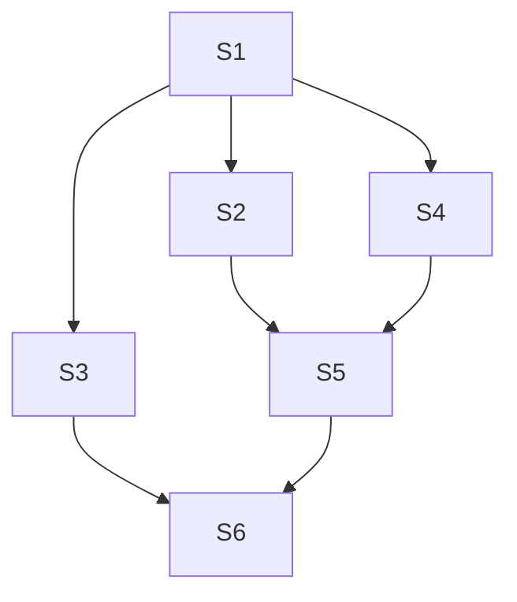
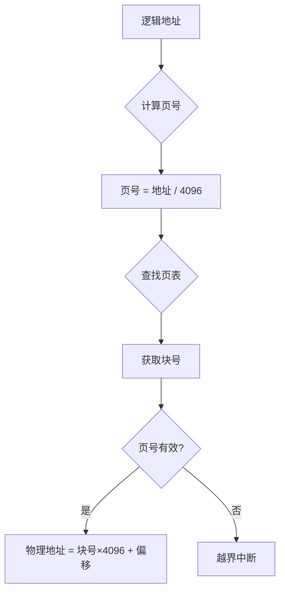
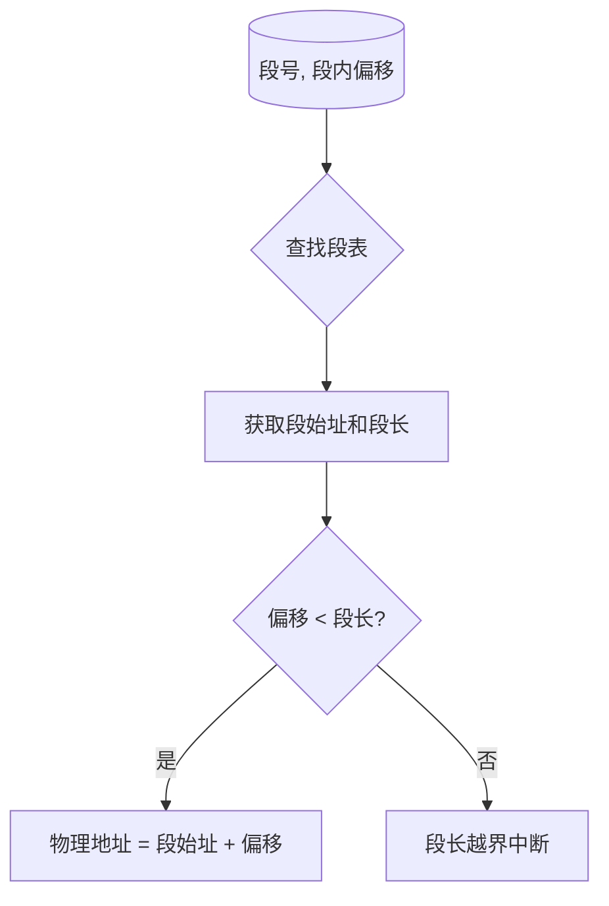

# 操作系统期末复习

---

**作业题汇总**

---

**作业1：多道程序运行时间计算（第1章）**

**题目描述**：设内存中有三道程序 A、B、C，它们按 A→B→C 的先后次序执行，它们进行"计算"和"I/O 操作"的时间如下表所示，假设三道程序使用相同的 I/O 设备。

| 程序 | 计算 | I/O 操作 | 计算 |
|------|------|----------|------|
| A | 20 | 20 | 10 |
| B | 30 | 40 | 20 |
| C | 10 | 20 | 10 |

试画出多道运行时三道程序的时间关系图，并计算完成三道程序要花多少时间。

**解析**

**时间线图**：

```mermaid
gantt
    title 多道程序运行时间线
    dateFormat  ss
    axisFormat %S

    section 程序A
    A计算1    : 0, 20ms
    A I/O     : 20, 20ms
    A计算2    : 40, 10ms

    section 程序B
    B计算1    : 20, 30ms
    B I/O     : 50, 40ms
    B计算2    : 90, 20ms

    section 程序C
    C计算1    : 50, 10ms
    C I/O     : 60, 20ms
    C计算2    : 80, 10ms

    section I/O设备
    I/O_A     : 20, 20ms
    I/O_B     : 50, 40ms
    I/O_C     : 80, 20ms
```



**关键分析**：
1. **0-20ms**：A 计算，B、C 等待
2. **20-40ms**：A I/O，B 计算（I/O 与计算并行）
3. **40-50ms**：A 计算完成，B 继续计算，C 等待
4. **50-60ms**：B I/O，C 开始计算
5. **60-80ms**：B I/O，C 等待 I/O 设备
6. **80-90ms**：B I/O，C 计算完成
7. **90-110ms**：B 计算完成

**总时间 = 110ms**

---

**作业2：进程同步（第3章）**

**题目描述**：进程之间的关系如下图所示，试用 P、V 操作描述它们之间的同步。



**进程依赖关系**：
- S3、S4、S2 都需要等待 S1 完成
- S5 需要等待 S2、S4 完成
- S6 需要等待 S3、S5 完成

**解析**

```c
// 定义信号量
semaphore s12 = 0, s13 = 0, s14 = 0;  // S1完成后通知S2,S3,S4
semaphore s25 = 0, s45 = 0;           // S2,S4完成后通知S5
semaphore s36 = 0, s56 = 0;          // S3,S5完成后通知S6

// 进程 S1
process S1() {
    // 执行 S1
    V(s12);  // 通知 S2
    V(s13);  // 通知 S3
    V(s14);  // 通知 S4
}

// 进程 S2
process S2() {
    P(s12);  // 等待 S1
    // 执行 S2
    V(s25);  // 通知 S5
}

// 进程 S3
process S3() {
    P(s13);  // 等待 S1
    // 执行 S3
    V(s36);  // 通知 S6
}

// 进程 S4
process S4() {
    P(s14);  // 等待 S1
    // 执行 S4
    V(s45);  // 通知 S5
}

// 进程 S5
process S5() {
    P(s25);  // 等待 S2
    P(s45);  // 等待 S4
    // 执行 S5
    V(s56);  // 通知 S6
}

// 进程 S6
process S6() {
    P(s36);  // 等待 S3
    P(s56);  // 等待 S5
    // 执行 S6
}
```

---

**作业3：调度算法计算（第4章）**

**题目描述**：设有5个进程，它们的提交时间和运行时间如下表所示：

| 进程名 | 提交时间 | 需运行时间 |
|--------|----------|------------|
| P1 | 10.1小时 | 0.3小时 |
| P2 | 10.3小时 | 0.6小时 |
| P3 | 10.5小时 | 0.3小时 |
| P4 | 10.6小时 | 0.3小时 |
| P5 | 10.7小时 | 0.2小时 |

请给出以下每种调度算法的各个进程的开始时间、完成时间、周转时间、带权周转时间，及所有进程的平均周转时间和平均带权周转时间。（结果除不尽时保留两位小数）

(1) 先来先服务调度算法
(2) 短进程优先
(3) 时间片轮转调度算法（假设时间片大小为 0.1 小时）
(4) 优先权调度算法（P1,P2,P3,P4,P5优先权分别为3,5,2,1,4，这里5为最高优先权）

**解析**

**(1) 先来先服务（FCFS）**

| 进程 | 提交 | 运行 | 开始 | 完成 | 周转 | 带权周转 |
|------|------|------|------|------|------|----------|
| P1 | 10.1 | 0.3 | 10.1 | 10.4 | 0.3 | 1.00 |
| P2 | 10.3 | 0.6 | 10.4 | 11.0 | 0.7 | 1.17 |
| P3 | 10.5 | 0.3 | 11.0 | 11.3 | 0.8 | 2.67 |
| P4 | 10.6 | 0.3 | 11.3 | 11.6 | 1.0 | 3.33 |
| P5 | 10.7 | 0.2 | 11.6 | 11.8 | 1.1 | 5.50 |

**平均周转时间 = 0.78**
**平均带权周转 = 2.73**

**(2) 短进程优先（SPF）**

| 进程 | 提交 | 运行 | 开始 | 完成 | 周转 | 带权周转 |
|------|------|------|------|------|------|----------|
| P1 | 10.1 | 0.3 | 10.1 | 10.4 | 0.3 | 1.00 |
| P5 | 10.7 | 0.2 | 10.4 | 10.6 | 0.2 | 1.00 |
| P3 | 10.5 | 0.3 | 10.6 | 10.9 | 0.4 | 1.33 |
| P4 | 10.6 | 0.3 | 10.9 | 11.2 | 0.6 | 2.00 |
| P2 | 10.3 | 0.6 | 11.2 | 11.8 | 1.5 | 2.50 |

**平均周转时间 = 0.60**
**平均带权周转 = 1.57**

**(3) 时间片轮转（RR, 时间片=0.1）**

| 进程 | 提交 | 运行 | 开始 | 完成 | 周转 | 带权周转 |
|------|------|------|------|------|------|----------|
| P1 | 10.1 | 0.3 | 10.1 | 10.6 | 0.5 | 1.67 |
| P2 | 10.3 | 0.6 | 10.3 | 11.8 | 1.5 | 2.50 |
| P3 | 10.5 | 0.3 | 10.5 | 11.1 | 0.6 | 2.00 |
| P4 | 10.6 | 0.3 | 10.6 | 11.3 | 0.7 | 2.33 |
| P5 | 10.7 | 0.2 | 10.7 | 11.0 | 0.3 | 1.50 |

**平均周转时间 = 0.72**
**平均带权周转 = 2.00**

**(4) 优先权调度（5最高）**

| 进程 | 提交 | 运行 | 优先级 | 开始 | 完成 | 周转 | 带权周转 |
|------|------|------|--------|------|------|------|----------|
| P1 | 10.1 | 0.3 | 3 | 10.1 | 10.4 | 0.3 | 1.00 |
| P2 | 10.3 | 0.6 | 5 | 10.4 | 11.0 | 0.7 | 1.17 |
| P5 | 10.7 | 0.2 | 4 | 11.0 | 11.2 | 0.5 | 2.50 |
| P3 | 10.5 | 0.3 | 2 | 11.2 | 11.5 | 1.0 | 3.33 |
| P4 | 10.6 | 0.3 | 1 | 11.5 | 11.8 | 1.2 | 4.00 |

**平均周转时间 = 0.74**
**平均带权周转 = 2.40**

---

**作业4：分页存储管理地址计算（第5章）**

**题目描述**：在分页存储管理方式下，页面大小为 4KB，已装入内存。内存的作业的页表如下：

| 页号 | 块号 |
|------|------|
| 0 | 2 |
| 1 | 6 |
| 2 | 12 |
| 3 | 20 |
| 4 | 27 |

请计算下列逻辑地址所对应的物理地址：376, 2872, 18702, 4769, 20837。

**解析**

**地址转换流程**：



**页面大小 = 4KB = 4096 字节**

| 逻辑地址 | 页号 | 页内偏移 | 块号 | 物理地址 |
|----------|------|----------|------|----------|
| 376 | 0 | 376 | 2 | **8568** |
| 2872 | 0 | 2872 | 2 | **11064** |
| 18702 | 4 | 2318 | 27 | **113090** |
| 4769 | 1 | 673 | 6 | **25249** |
| 20837 | 5 | 525 | - | **越界** |

---

**作业5：分段存储管理地址计算（第5章）**

**题目描述**：某个采用分段存储管理的系统为装入内存的一个作业建立了如下段表：

| 段号 | 段始址 | 段长 |
|------|--------|------|
| 0 | 2100 | 630B |
| 1 | 3500 | 140B |
| 2 | 190 | 100B |
| 3 | 1200 | 520B |
| 4 | 3900 | 970B |

计算该作业访问内存地址 (0,337), (1,100), (2,200), (3,550), (4,850) 时的物理地址。

**解析**

**地址转换流程**：



| 逻辑地址 | 段号 | 段内偏移 | 段始址 | 段长 | 是否越界 | 物理地址 |
|----------|------|----------|--------|------|----------|----------|
| (0,337) | 0 | 337 | 2100 | 630 | 否 | **2437** |
| (1,100) | 1 | 100 | 3500 | 140 | 否 | **3600** |
| (2,200) | 2 | 200 | 190 | 100 | **是** | 段长越界 |
| (3,550) | 3 | 550 | 1200 | 520 | **是** | 段长越界 |
| (4,850) | 4 | 850 | 3900 | 970 | 否 | **4750** |

---

# 第1章 操作系统引论

**1.1 操作系统的概念**

1. 【单选题】按照所起的作用和需要的运行环境，操作系统属于_______。
   - A. 系统软件
   - B. 应用软件
   - C. 支撑软件
   - D. 用户软件
   - **答案：A**

2. 【单选题】在计算机系统中，操作系统是_______。
   - A. 处于系统软件之上的用户软件
   - B. 处于应用软件之上的系统软件
   - C. 处于硬件之下的底层软件
   - D. 处于裸机之上的第一层软件
   - **答案：D**

3. 【单选题】操作系统是对_____进行管理的软件。
   - A. 软件
   - B. 计算机资源
   - C. 程序
   - D. 硬件
   - **答案：B**

4. 【单选题】从用户的观点，操作系统是______。
   - A. 用户与计算机之间的接口
   - B. 合理地组织计算机工作流程的软件
   - C. 控制和管理计算机资源的软件
   - D. 是扩充裸机功能的软件，是比裸机功能更强、使用方便的虚拟机
   - **答案：D**

5. 【填空题】计算机系统是由____和____两部分组成的。
   - **答案：硬件、软件**

**1.2 多道程序设计**

1. 【单选题】采用多道程序设计技术可以提高CPU和外部设备的______。
   - A. 稳定性
   - B. 兼容性
   - C. 可靠性
   - D. 利用率
   - **答案：D**

2. 【单选题】一个计算机系统采用多道程序设计技术后，使多道程序实现了。
   - A. 微观上并行
   - B. 微观和宏观上均串行
   - C. 微观和宏观上均并行
   - D. 宏观上并行
   - **答案：D**

3. 【填空题】采用多道程序设计技术能够充分发挥____和____并行工作的能力。
   - **答案：CPU、外设**

4. 【填空题】多道程序环境下的各道程序，宏观上它们是在____运行，微观上它们是在____运行。
   - **答案：并行、串行**

5. 【填空题】在操作系统的发展过程中，____和____的出现，标志着操作系统的正式形成。
   - **答案：多道、分时**

**1.3 操作系统的特征**

1. 【单选题】一个作业第一次执行时用了5min，而第二次执行时用了6min,这说明了操作系统的______特点。
   - A. 虚拟性
   - B. 共享性
   - C. 不确定性
   - D. 并发性
   - **答案：C**

2. 【单选题】操作系统的最基本的两个特征是资源共享和_______。
   - A. 程序的并发执行
   - B. 程序顺序执行
   - C. 多道程序设计
   - D. 中断
   - **答案：A**

3. 【单选题】在多道程序环境下，操作系统能够同时运行多个程序，并且宏观上各个程序都在向前推进，这种特征被称为（）
   - A. 并发性
   - B. 虚拟性
   - C. 共享性
   - D. 异步性
   - **答案：A**

4. 【单选题】操作系统通过分时技术将一个物理CPU虚拟为多个逻辑CPU，这种特征体现了操作系统的（）
   - A. 并发性
   - B. 共享性
   - C. 异步性
   - D. 虚拟性
   - **答案：D**

5. 【单选题】多个用户通过终端同时使用同一台计算机，共享CPU、内存等资源，这主要体现了操作系统的（）
   - A. 共享性和异步性
   - B. 并发性和虚拟性
   - C. 并发性和共享性
   - D. 虚拟性和异步性
   - **答案：C**

6. 【填空题】____和共享是操作系统两个最基本的特征，两者之间互为存在条件。
   - **答案：并发**

**1.4 操作系统的功能**

1. 【单选题】操作系统的主要功能是存储器管理、设备管理、文件管理、用户接口和______。
   - A. 进程管理
   - B. 操作系统管理
   - C. 用户管理
   - D. 信息管理
   - **答案：A**

2. 【填空题】操作系统的功能包括____管理、____管理、____管理、____管理，除此之外，操作系统还为用户使用计算机提供了用户接口。
   - **答案：进程、内存、设备、文件**

3. 【填空题】操作系统为程序员提供的是____，为一般用户提供的是____。
   - **答案：程序接口、命令接口**

**1.5 操作系统的类型**

1. 【单选题】设计实时操作系统必须首先考虑系统的______。
   - A. 效率
   - B. 可移植性
   - C. 可靠性
   - D. 使用的方便性
   - **答案：C**

2. 【单选题】操作系统的基本类型是_____。
   - A. 批处理系统、分时系统和多任务系统
   - B. 实时系统、分时系统和批处理系统
   - C. 实时系统、分时系统和多用户系统
   - D. 单用户系统、多用户系统和批处理系统
   - **答案：B**

3. 【单选题】为了使系统中的所有用户都得到及时的响应，操作系统应该是___。
   - A. 批处理系统
   - B. 分时系统
   - C. 网络系统
   - D. 实时系统
   - **答案：D**

4. 【单选题】如果分时系统的时间片一定，那么____会使响应时间越长。
   - A. 用户数越多
   - B. 内存越多
   - C. 用户数越少
   - D. 内存越少
   - **答案：A**

5. 【单选题】_______类型的操作系统允许在一台主机上同时连接多台终端，多个用户可以通过多台终端同时交互地使用计算机。
   - A. 分时系统
   - B. 实时系统
   - C. 网络系统
   - D. 批处理系统
   - **答案：A**

6. 【单选题】_______类型的操作系统允许用户把多个作业同时提交给计算机。
   - A. 分时系统
   - B. 批处理系统
   - C. 实时系统
   - D. 网络系统
   - **答案：B**

7. 【单选题】在______操作系统的控制下计算机系统能及时处理由过程控制反馈的数据并做出及时响应。
   - A. 网络系统
   - B. 实时系统
   - C. 分时系统
   - D. 批处理系统
   - **答案：B**

8. 【填空题】批处理系统按内存中同时存放的运行程序的数目可分为____和____。
   - **答案：单道批处理系统、多道批处理系统**

9. 【填空题】____是衡量分时系统性能的一项重要指标。
   - **答案：响应时间**

10. 【填空题】____系统不允许用户干预自己的程序。
    - **答案：批处理**

11. 【填空题】如果一个系统在用户提交作业后，不提供交互能力，则属于____类型;如果一个系统可靠性很强，时间响应及时且具有交互能力，则属于____类型;如果一个系统具有很强的交互性，可同时供多个用户使用，时间响应比较及时，则属于____类型。
    - **答案：批处理系统、实时系统、分时系统**

---

# 第2章 进程与线程

**2.1 进程的概念**

1. 【单选题】并发执行的程序具有_____特征。
   - A. 间断性
   - B. 封闭性
   - C. 可再现性
   - D. 顺序性
   - **答案：A**

2. 【单选题】进程和程序的本质区别是_____。
   - A. 动态或静态
   - B. 存储在内存和外存
   - C. 分时使用或独占计算机资源
   - D. 顺序或非顺序地执行其指令
   - **答案：A**

3. 【单选题】下面对进程的描述，错误的是______。
   - A. 进程是有生命期的
   - B. 进程是指令的集合
   - C. 进程的执行需要处理机
   - D. 进程是一个动态的概念
   - **答案：B**

4. 【单选题】下面关于进程的描述，_____不正确。
   - A. 进程是程序在一个数据集合上的执行过程，它是系统进行资源分配的单位
   - B. 进程是多道程序环境中的一个程序
   - C. 进程由程序、数据、栈、和PCB组成
   - D. 线程是一种特殊的进程
   - **答案：B**

5. 【单选题】进程是一个具有一定独立功能的程序在其数据集合上的一次_____。
   - A. 单独活动
   - B. 关联操作
   - C. 等待活动
   - D. 运行活动
   - **答案：D**

6. 【单选题】进程的并发执行是指若干个进程______。
   - A. 共享系统资源
   - B. 在执行时间上是重叠的
   - C. 在执行时间上是不重叠的
   - D. 同时执行
   - **答案：B**

7. 【填空题】单道程序执行时，具有____、____和可再现性的特点。
   - **答案：顺序性、封闭性**

8. 【填空题】多道程序执行时，具有间断性，将失去____和____的特点。
   - **答案：封闭性、可再现性**

9. 【填空题】进程是一个____的概念，而程序是一个____的概念。
   - **答案：动态、静态**

**2.2 进程状态与转换**

1. 【单选题】在进程状态转换图中，_____是不可能的。
   - A. 运行态->就绪态
   - B. 运行态->等待态
   - C. 等待态->运行态
   - D. 等待态->就绪态
   - **答案：C**

2. 【单选题】操作系统对进程进行管理与控制的基本数据结构是_____。
   - A. JCB
   - B. PCB
   - C. PMT
   - D. DCT
   - **答案：B**

3. 【单选题】一个进程当前处于等待状态，则_____。
   - A. 它可以被调度而获得处理机
   - B. 当I/O完成后，它将变成就绪状态
   - C. 它永远不会被执行
   - D. 它可能变成就绪状态，也可能直接获得处理机
   - **答案：B**

4. 【单选题】当一个进程处于_____状态时，不属于等待状态。
   - A. 进程正等待着输入一批数据
   - B. 进程正等待着打印输出
   - C. 进程正等待着另一个进程发来的消息
   - D. 进程正等待着给它一个时间片
   - **答案：D**

5. 【单选题】在单处理机的系统中，以下关于进程的说法，____正确。
   - A. 进程就是程序，它是程序的另一种说法
   - B. 进程被创建后，在它消亡之前，任何时刻总是处于运行、就绪或阻塞三种状态之一
   - C. 多个不同的进程可以包含相同的程序
   - D. 两个进程可以同时处于运行状态
   - **答案：C**

6. 【单选题】一个进程被唤醒意味着_____。
   - A. 进程重新得到CPU
   - B. 进程变为就绪状态
   - C. 进程的优先级变为最大
   - D. 将进程移至等待队列首部
   - **答案：B**

7. 【单选题】在单机处理系统中有n(n>2)个进程，___情况不可能发生。
   - A. 没有进程运行，没有就绪进程，n个等待进程
   - B. 有1个进程运行，没有就绪进程，n-1个等待进程
   - C. 有2个进程运行，有1个就绪进程，n-3个等待进程
   - D. 有1个进程运行，有n-1个就绪进程，没有等待进程
   - **答案：C**

8. 【单选题】在单处理机系统实现并发后，以下说法____正确。
   - A. 各进程在某一时刻并行运行，CPU与外设之间并行工作
   - B. 各进程在某一时间段并行运行，CPU 与外设之间串行工作
   - C. 各进程在某一时间段并行运行，CPU与外设之间并行工作
   - D. 各进程在某一时刻并行运行，CPU与外设之间串行工作
   - **答案：C**

9. 【填空题】进程的三种基本状态是____、____和____。
   - **答案：运行状态、就绪状态、阻塞状态**

10. 【填空题】判断一个进程是否处于挂起状态，要看该进程是否在____，挂起状态又分为____和____。
    - **答案：内存、就绪挂起、阻塞挂起**

**2.3 进程控制**

1. 【单选题】在操作系统中，要想读取文件中的数据，通过什么来实现?
   - A. 系统调用
   - B. 原语
   - C. 文件共享
   - D. 中断
   - **答案：A**

2. 【单选题】建立进程就是_____。
   - A. 建立进程的目标程序
   - B. 为其建立进程控制块
   - C. 将进程挂起
   - D. 建立进程及其子孙的进程控制块
   - **答案：B**

3. 【单选题】对进程的管理和控制使用_____。
   - A. 指令
   - B. 原语
   - C. 信号量
   - D. 信箱通信
   - **答案：B**

4. 【单选题】以下四项内容，____不是进程创建过程所必需的。
   - A. 为进程分配CPU
   - B. 建立进程控制块
   - C. 为进程分配内存
   - D. 将进程链入就绪队列
   - **答案：A**

5. 【单选题】_____必定引起进程切换。
   - A. 一个进程被创建
   - B. 一个进程变为等待状态
   - C. 一个进程变为就绪状态
   - D. 一个进程被撤销
   - **答案：B**

6. 【填空题】通常将处理机的执行状态分为____和____。
   - **答案：系统态、用户态**

**2.4 线程**

1. 【单选题】进程和线程的区别是______。
   - A. 大小不同
   - B. 独立调度的单位
   - C. 是否拥有资源
   - D. 对应的分别是程序和过程
   - **答案：C**

2. 【单选题】多道程序环境中，操作系统分配资源是以_____为单位。
   - A. 程序
   - B. 指令
   - C. 进程
   - D. 作业
   - **答案：C**

3. 【单选题】_____不是线程的实现方式。
   - A. 用户级线程
   - B. 内核级线程
   - C. 用户级线程与内核级线程组合的方式
   - D. 轻量级线程
   - **答案：D**

4. 【填空题】根据线程的切换是否依赖于内核把线程分为____和____。
   - **答案：用户级线程、内核级线程**

5. 【填空题】在实现了用户级线程的系统中，CPU调度的对象是____;在实现了内核级线程的系统中，CPU调度的对象是____。
   - **答案：进程、线程**

---

# 第3章 进程同步与通信

**3.1 进程同步的基本概念**

1. 【单选题】如果有三个进程共享同一程序段，而且每次最多允许两个进程进入该程序段，则信号量的初值应设置为______。
   - A. 3
   - B. 2
   - C. 1
   - D. 0
   - **答案：B**

2. 【单选题】设有四个进程共享一个资源，如果每次只允许一个进程使用该资源，则用P、V操作管理时信号量S的可能取值是_____。
   - A. 3,2,1,0,-1
   - B. 2,1,0,-1,-2
   - C. 1,0,-1,-2,-3
   - D. 4,3,2,1,0
   - **答案：C**

3. 【单选题】下面有关进程的描述，______是正确的。
   - A. 进程执行的相对速度不能由进程自己来控制
   - B. 进程利用信号量的P、V操作可以交换大量的信息
   - C. 并发进程在访问共享资源时，不可能出现与时间有关的错误
   - D. P、V操作不是原语操作
   - **答案：A**

4. 【单选题】信号灯可以用来实现进程之间的______。
   - A. 调度
   - B. 同步与互斥
   - C. 同步
   - D. 互斥
   - **答案：B**

5. 【单选题】对于两个并发进程都想进入临界区，设互斥信号量为S,若某时S=0，表示______。
   - A. 没有进程进入临界区
   - B. 有1个进程进入了临界区
   - C. 有2个进程进入了临界区
   - D. 有1个进程进入了临界区并且另一个进程正等待进入
   - **答案：B**

6. 【单选题】并发是指_____。
   - A. 可平行执行的进程
   - B. 可先后执行的进程
   - C. 可同时执行的进程
   - D. 不可中断的进程
   - **答案：C**

7. 【单选题】临界区是_____。
   - A. 一个缓冲区
   - B. 一段数据区
   - C. 一段程序
   - D. 栈
   - **答案：C**

8. 【单选题】进程在处理机上执行，它们的关系是_______。
   - A. 进程之间无关，系统是封闭的
   - B. 进程之间相互依赖、相互制约
   - C. 进程之间可能有关，也可能无关
   - D. 以上都不对
   - **答案：C**

9. 【单选题】以下关于P、V操作的描述_______正确。
   - A. 机器指令
   - B. 系统调用
   - C. 高级通信原语
   - D. 低级通信原语
   - **答案：D**

10. 【单选题】对临界区的正确论述是_______。
    - A. 临界区是指进程中用于实现进程互斥的那段代码
    - B. 临界区是指进程中用于实现进程同步的那段代码
    - C. 临界区是指进程中用于实现进程通信的那段代码
    - D. 临界区是指进程中访问临界资源的那段代码
    - **答案：D**

11. 【单选题】同步是指进程之间逻辑上的______关系。
    - A. 制约
    - B. 调用
    - C. 联接
    - D. 排斥
    - **答案：A**

12. 【填空题】在利用信号量实现互斥时，应将____置于____和____之间。
    - **答案：临界区、P操作、V操作**

13. 【填空题】有n个进程共享某一临界资源，如用信号量机制实现对临界资源的互斥访问，则信号量的变化范围是____。
    - **答案：-(n-1)~1**

14. 【填空题】对信号量的操作，只能是____操作和____操作，____操作相当于进程申请资源，____操作相对于进程释放资源。如果____操作使用不当，可能导致系统死锁。
    - **答案：P、V、P、P、P**

15. 【填空题】在多道程序环境中，进程之间存在的相互制约关系可以分为两种，即____和____。其中____是指进程之间使用共享资源时的相互约束关系，而____是指进程之间的相互协作、相互配合关系。
    - **答案：互斥、同步、互斥、同步**

16. 【填空题】如果信号量的初始值为3，则表示系统有3个____;如果信号量的当前值为-4，则表示在该信号量上有____个进程等待。
    - **答案：共享资源、4**

17. 【填空题】信号量的物理意义是:信号量的初始值大于0表示系统中____;信号量的初始值等于0表示系统中____;信号量的初始值小于0，其绝对值表示系统中____。
    - **答案：共享资源的个数、没有该类共享资源、等待该共享资源的进程数**

18. 【填空题】使用临界区的四个准则是:空闲让进、____、____和____。
    - **答案：忙则等待、有限等待、让权等待**

19. 【填空题】并发进程中涉及相同变量的程序段叫做____,对这段程序要____执行。
    - **答案：临界区、互斥**

20. 【填空题】对信号量S的P操作定义中，使进程进入等待队列的条件是____;V操作定义中，唤醒进程的条件是____。
    - **答案：S<0、S<=0**

**3.2 经典同步问题与PV操作**

1. 【简答题】设在公共汽车上，司机和售票员的活动分别为:
   - 司机的活动:启动汽车;正常行驶;到站停车;
   - 售票员的活动:关车门;售票;开车门;
   - 在汽车不断到站、停车、行驶的过程中，这两个活动有什么同步关系?用信号量和PV操作实现它们的同步。

2. 【简答题】设有两个进程Pl和P2的程序如下，其信号量的初始值S1=S2=0，试求P1、P2并发运行结束后，X、Y、Z的值。进程Pl和P2之间是什么关系?
   - 进程Pl: Y=1; Y=Y+2; Z=Y+1; V(S1); P(S2); Y=Z+X;
   - 进程P2: X=1; X=X+1; P(S1); X=X+Y; Z=Z+X; V(S2);
   - **答案：X=5，Y=14，Z=9。进程P1和P2之间是同步关系。**

3. 【简答题】《操作系统》课程的期末考试即将举行，假设把学生和监考教师都看作进程，学生有N人，教师1人。考场门口每次只能进出一个人，进考场的原则是先来先进。当N个学生都进入了考场后，教师才能发卷子。回答:
   - (1)请说明学生与教师两个进程之间的同步与互斥关系;
   - (2)补充P、V操作。
   - **答案：同步关系: N个学生都进入了考场后，教师才能发卷子；互斥关系:考场门口每次只能进出一个人**

4. 【简答题】有一只铁笼子，每次只能放入一只动物，猎手只能向笼中放入老虎，农民只能向笼中放入猪，动物园等待取笼中的老虎，饭店等待取笼中的猪，试用P、V操作写出能同步执行的程序。

5. 【填空题】设有两个优先级相同的进程User1与User2，试对它们的代码添加P、V操作，使Userl与User2的同步关系满足语序:W1，V1,V2,V3,W2的要求，所用信号量应给出初值。
   - **答案：s1=0,s2=0；P(s2)、P(s1)、V(s2)**

**3.3 进程通信**

1. 【单选题】在消息缓冲通信中，消息队列是一种_______资源。
   - A. 临界
   - B. 共享
   - C. 永久
   - D. 可剥夺
   - **答案：A**

2. 【单选题】_____不是进程之间的通信方式。
   - A. 过程调用
   - B. 消息传递
   - C. 共享存储器
   - D. 信箱通信
   - **答案：A**

3. 【单选题】信箱通信是一种______方式。
   - A. 直接通信
   - B. 间接通信
   - C. 低级通信
   - D. 信号量
   - **答案：B**

4. 【填空题】AND信号量的基本思想是，将进程在整个运行期间所需要的所有临界资源____地全部分配给进程，待该进程使用完后再一起释放。
   - **答案：一次性**

5. 【填空题】管程由三部分组成____、____、对共享变量的初始化。
   - **答案：共享变量的定义、能使进程并发执行的一组操作**

---

# 第4章 调度与死锁

**4.1 调度的基本概念**

1. 【单选题】设有4个作业同时到达，每个作业的执行时间是2min，它们在一台处理机上按单道方式运行，则平均周转时间为____。
   - A. 1min
   - B. 5min
   - C. 2.5min
   - D. 8min
   - **答案：B**

2. 【单选题】作业从提交到完成的时间间隔称为作业的_____。
   - A. 周转时间
   - B. 响应时间
   - C. 等待时间
   - D. 运行时间
   - **答案：A**

3. 【单选题】下面选择调度算法的准则中不正确的是_______。
   - A. 尽快响应交互式用户的请求
   - B. 尽量提高处理机的利用率
   - C. 尽可能提高系统的吞吐量
   - D. 尽量增加进程的等待时间
   - **答案：D**

4. 【填空题】____调度是高级调度，____调度是中级调度，____是低级调度。
   - **答案：作业、对换、进程**

**4.2 调度算法**

1. 【单选题】设有三个作业J1,J2,J3，它们的到达时间和执行时间如下表所示。
   - J1: 8:00, 2小时
   - J2: 8:00, 1小时
   - J3: 8:30, 0.25小时
   - 它们在一台处理机上按单道运行并采用短作业优先调度算法，则三个作业的执行次序是______。
   - A. J1,J2,J3
   - B. J2,J3,J1
   - C. J3,J2,J1
   - D. J2,J1,J3
   - **答案：B**

2. 【单选题】以下关于调度的说法______正确。
   - A. 进程通过调度得到CPU
   - B. 优先级是进程调度的主要依据，一旦确定就不能改变
   - C. 在单CPU的系统中，任何时刻都有一个进程处于运行状态
   - D. 进程申请CPU得不到时，其状态为阻塞
   - **答案：A**

3. 【单选题】下述______调度算法适用于分时系统。
   - A. 时间片轮转
   - B. 短进程优先
   - C. 优先级调度
   - D. 先来先服务
   - **答案：A**

4. 【单选题】以下关于优先级设定的说法，______正确。
   - A. 用户进程的优先级应高于系统进程的优先级
   - B. 资源要求多的进程优先级应高于资源要求少的进程的优先级
   - C. 随着进程的执行时间的增加，进程的优先级应降低
   - D. 随着进程的执行时间的增加，进程的优先级应提高
   - **答案：C**

5. 【填空题】在____算法中，系统按照进程进入就绪队列的先后次序来分配CPU。
   - **答案：先来先服务**

**4.3 死锁的概念**

1. 【单选题】若系统中有8台绘图仪，有多个进程均需要使用两台，规定每个进程一次仅允许申请一台，则至多允许______进程参与竞争，而不会发生死锁。
   - A. 5
   - B. 6
   - C. 7
   - D. 8
   - **答案：C**

2. 【单选题】设有12个同类资源可供四个进程共享，资源分配情况如下表所示。目前剩余资源数为2。当进程P1、P2、P3、P4又都相继提出申请要求，为使系统不致死锁，应先满足_____进程的要求。
   - P1: 2, 5
   - P2: 3, 5
   - P3: 4, 7
   - P4: 1, 4
   - A. P1
   - B. P2
   - C. P3
   - D. P4
   - **答案：B**

3. 【单选题】产生系统死锁的原因可能是______。
   - A. 一个进程进入死循环
   - B. 多个进程竞争资源出现了循环等待
   - C. 进程释放资源
   - D. 多个进程竞争共享型设备
   - **答案：B**

4. 【单选题】以下关于死锁的叙述，______是正确的。
   - A. 死锁的产生只与资源的分配策略有关
   - B. 死锁的产生只与并发进程的执行速度有关
   - C. 死锁是一种僵持状态，发生时系统中任何进程都无法继续执行
   - D. 竞争互斥资源是进程发生死锁的根本原因
   - **答案：D**

5. 【单选题】关于死锁的现象，描述正确的是______。
   - A. 多个进程共享某一资源
   - B. 多个进程竞争某一资源
   - C. 每个进程等待着某个不可能得到的资源
   - D. 每个进程等待着某个可能得到的资源
   - **答案：C**

6. 【填空题】产生死锁的原因是____和____。
   - **答案：资源不足、进程推进顺序非法**

7. 【填空题】在有n个进程的系统中，死锁进程个数k应满足的条件是____。
   - **答案：2 <= k <= n**

8. 【填空题】产生死锁的四个必要条件是____、____、____和环路条件。
   - **答案：互斥、请求与保持、不可剥夺**

9. 【填空题】死锁是一个系统中多个____，无限期地等待永远不会发生的条件。
   - **答案：进程**

**4.4 死锁的处理方法**

1. 【单选题】预防死锁不可以去掉以下______条件。
   - A. 互斥
   - B. 请求与保持
   - C. 不可剥夺
   - D. 环路
   - **答案：A**

2. 【单选题】采用有序分配资源的策略可以破坏产生死锁的_______。
   - A. 互斥条件
   - B. 请求与保持条件
   - C. 不可剥夺条件
   - D. 环路条件
   - **答案：D**

3. 【单选题】预防死锁可以从破坏死锁的四个必要条件入手，但破坏_____不太可能。
   - A. 互斥条件
   - B. 请求与保持条件
   - C. 不可剥夺条件
   - D. 环路条件
   - **答案：A**

4. 【单选题】以下解决死锁的方法中，属于预防策略的是_______。
   - A. 化简资源分配图
   - B. 银行家算法
   - C. 资源的有序分配
   - D. 死锁检测法
   - **答案：C**

5. 【填空题】资源预先静态分配方法和资源有序分配方法分别破坏了产生死锁的____条件和____条件。
   - **答案：请求与保持、环路**

6. 【填空题】解决死锁通常采用预防、避免、检测和解除等方法，其中银行家算法属于____，资源的有序分配属于____，剥夺资源属于____。
   - **答案：避免死锁的方法、预防死锁的方法、解除死锁的方法**

7. 【填空题】在银行算法中，当一个进程提出资源请求将导致系统从____进入____时，系统就拒绝它的资源请求。
   - **答案：安全状态、不安全状态**

8. 【单选题】资源分配图是不可以完全简化的是判断死锁的_____。
   - A. 充分条件
   - B. 必要条件
   - C. 充分必要条件
   - D. 什么也不是
   - **答案：C**

9. 【单选题】以下______方法可以解除死锁。
   - A. 挂起进程
   - B. 剥夺资源
   - C. 提高进程优先级
   - D. 降低进程优先级
   - **答案：B**

10. 【填空题】判断资源分配图是否可以简化是____死锁的方法。
    - **答案：检测**

---

# 第5章 存储管理

**5.1 存储管理的基本概念**

1. 【单选题】某系统采用基址、限长寄存器的方法来保护进程的存储信息，判断是否越界的公式为______。
   - A. 0<=被访问的逻辑地址<限长寄存器的内容
   - B. 0<=被访问的逻辑地址<=限长寄存器的内容
   - C. 0<=被访问的物理地址<限长寄存器的内容
   - D. 0<=被访问的物理地址<=限长寄存器的内容
   - **答案：A**

2. 【单选题】把程序地址空间中的逻辑地址转换为内存的物理地址称______。
   - A. 加载
   - B. 重定位
   - C. 物理化
   - D. 链接
   - **答案：B**

3. 【单选题】动态重定位技术依赖于_____。
   - A. 装入程序
   - B. 地址变换机制
   - C. 目标程序
   - D. 重定位寄存器
   - **答案：D**

4. 【单选题】静态重定位是在_____进行的。
   - A. 程序编译时
   - B. 程序链接时
   - C. 程序装入时
   - D. 程序运行时
   - **答案：C**

5. 【单选题】动态重定位在______进行的。
   - A. 程序编译时
   - B. 程序链接时
   - C. 程序装入时
   - D. 程序运行时
   - **答案：D**

6. 【填空题】将程序地址空间中的逻辑地址变换成物理地址的过程称为____。
   - **答案：重定位**

7. 【填空题】静态重定位是在____进行，动态重定位是在____进行。
   - **答案：程序装入内存、程序运行**

**5.2 分区存储管理**

1. 【单选题】在可变分区分配方案中，最佳适应法是将空闲块按______次序排序。
   - A. 地址递增
   - B. 地址递减
   - C. 大小递增
   - D. 大小递减
   - **答案：C**

2. 【单选题】在分区存储管理方式中，如果在按地址升序排列的未分配分区表中顺序登记了下列未分配分区:1-起始地址17K，分区长度为9KB;2-起始地址54KB,分区长度13KB,现有一个分区被释放，其起始地址为39KB，分区长度为15KB，则系统要______。
   - A. 合并第一个未分配分区
   - B. 合并第一个及第二个未分配分区
   - C. 合并第二个为分配分区
   - D. 不合并任何分区
   - **答案：C**

3. 【单选题】在固定分区存储管理中，处理器需设置下面_____寄存器以保证作业在所在分区内运行。
   - A. 变址
   - B. 上、下限
   - C. 段长
   - D. 空闲区
   - **答案：B**

4. 【单选题】在固定分区存储管理中，每个分区的大小是______。
   - A. 相同
   - B. 随进程的大小变化
   - C. 可以不同，需预先设定
   - D. 可以不同，根据进程的大小设定
   - **答案：C**

5. 【单选题】在可变分区存储管理中，合并分区的目的是_______。
   - A. 合并空闲区
   - B. 合并分区
   - C. 增加内存容量
   - D. 便于地址交换
   - **答案：A**

6. 【单选题】在可变分区系统中，当一个进程撤销后，系统回收其占用的内存空间，回收后造成空闲分区的个数减1的情况是______。
   - A. 回收区与空闲区无邻接
   - B. 回收区与上面的空闲区邻接
   - C. 回收区与下面的空闲区邻接
   - D. 回收区与上下两个空闲区邻接
   - **答案：D**

7. 【单选题】在可变分区分配方案中，首次适应法是将空闲块按_____次序排序。
   - A. 地址递增
   - B. 地址递减
   - C. 大小递增
   - D. 大小递减
   - **答案：A**

8. 【填空题】在可变分区中采用首次适应算法时，应将空闲区按____次序排列。
   - **答案：地址递增**

9. 【填空题】在可变分区的分配算法中，倾向于优先使用低地址部分空闲区的是____，能使内存空间的空间区分布得较均匀的是____,每次分配时，若内存中有和进程需要的分区的大小相等的空闲区，一定能分配给进程的是____。
   - **答案：首次适应算法、下次适应算法、最佳适应算法**

**5.3 分页存储管理**

1. 【单选题】快表的作用是加快地址变换过程，它采用的硬件是______。
   - A. 通用寄存器
   - B. 外存
   - C. 内存
   - D. Cache
   - **答案：D**

2. 【填空题】进程有8页，页的大小为1KB，它被映射到共有64个存储块的物理地址空间中，则该进程的逻辑地址的有效位是____，物理地址的有效位是____。
   - **答案：13位、16位**

**5.4 分段存储管理**

1. 【单选题】以下______不是段式存储管理系统的优点。
   - A. 方便编程
   - B. 方便内存管理
   - C. 方便程序共享
   - D. 方便对程序保护
   - **答案：B**

2. 【单选题】在段式存储管理系统中，若程序的逻辑地址用24位表示，其中8位表示段号，则每个段的最大长度是_______。
   - A. 2的8次方
   - B. 2的16次方
   - C. 2的24次方
   - D. 2的32次方
   - **答案：B**

3. 【单选题】有利于动态链接的内存管理方法是_____。
   - A. 可变分区管理
   - B. 段式管理
   - C. 固定分区管理
   - D. 页式管理
   - **答案：B**

4. 【填空题】在段式存储管理系统中，如果一个进程有15段，每段的大小不超过2KB，则该进程的逻辑地址空间的大小是____，其逻辑地址用____个二进制位表示。
   - **答案：30KB、15**

**5.5 段页式存储管理**

1. 【单选题】下列存储管理方案中，______不存在碎片问题。
   - A. 可变分区管理
   - B. 段式管
   - C. 可重定位分区管理
   - D. 段页式管理
   - **答案：D**

2. 【单选题】在以下存储管理方案中，不适用于多道程序设计系统的是_____。
   - A. 单一连续分区
   - B. 固定分区
   - C. 可变分区
   - D. 页式存储管理
   - **答案：A**

3. 【填空题】在段页式系统中，先将程序分____,____内分____。内存分配以____为单位，如果不考虑使用快表的情况，每条访问内存的指令需要____次访问内存，其中第____次是查页表。
   - **答案：段、段、页、页、3、2**

4. 【填空题】在____系统中，操作系统必须为每个进程建立一张段表，且每一段都对应一张页表。
   - **答案：段页式**

---

# 第6章 虚拟存储管理

**6.1 虚拟存储器的基本概念**

1. 【单选题】设主存的容量为4MB，辅存的容量为40MB,计算机的地址线24位,则虚存的最大容量是______。
   - A. 40M
   - B. 4MB+40MB
   - C. 16MB
   - D. 24MB
   - **答案：C**

2. 【单选题】虚拟存储管理策略可以______。
   - A. 扩大逻辑外存容量
   - B. 扩大物理外存容量
   - C. 扩大逻辑内存容量
   - D. 扩大物理内存容量
   - **答案：C**

3. 【单选题】进程在执行过程中发生了缺页中断，操作系统处理后，应让其继续执行______。
   - A. 被中断的指令
   - B. 被中断指令的前一条
   - C. 被中断指令的后一条
   - D. 启动时的第一条指令
   - **答案：A**

4. 【单选题】虚拟存储器的理论基础是______。
   - A. 局部性原理
   - B. 全局性原理
   - C. 动态性
   - D. 虚拟性
   - **答案：A**

5. 【单选题】内存空间是______。
   - A. 一维的
   - B. 二维的
   - C. 三维的
   - D. 四维的
   - **答案：A**

6. 【单选题】物理地址对应的是______。
   - A. 数据的地址
   - B. 模块的地址
   - C. 内存的地址
   - D. 外存的基址
   - **答案：C**

7. 【单选题】虚拟存储器受到的限制除了外存的容量，还有______。
   - A. 指令中的地址长度
   - B. 内存的容量
   - C. 硬件的好坏
   - D. 以上观点都对
   - **答案：A**

8. 【填空题】设一个计算机系统的CPU地址长度为32位，内存的大小是32MB，则该计算机的物理地址空间的大小为____，逻辑地址空间的大小为____。
   - **答案：32MB、4GB**

9. 【填空题】虚拟存储器的四大特征是____、____、____和____。
   - **答案：离散性、多次性、对换性、虚拟性**

**6.2 请求分页存储管理**

1. 【单选题】页式虚拟存储管理的主要特点是______。
   - A. 不要求动态重定位
   - B. 不要求将作业同时全部装入主存的连续区域
   - C. 不要求进行缺页中断处理
   - D. 不要求进行页面置换
   - **答案：B**

2. 【单选题】在请页式存储管理中，当所访问的页面不在内存时将产生缺页，缺页中断属于______。
   - A. I/O中断
   - B. 内中断
   - C. 外中断
   - D. 程序中断
   - **答案：D**

3. 【单选题】在请页式存储管理中，页的大小与缺页率的关系是_______。
   - A. 成正比
   - B. 成反比
   - C. 成固定比例
   - D. 无关
   - **答案：B**

4. 【单选题】在请页式存储管理中，若采用FIFO页面置换算法，则当分配给进程的页面增加时，缺页的次数______。
   - A. 无影响
   - B. 增加
   - C. 减少
   - D. 可能增加也可能减少
   - **答案：D**

5. 【单选题】下面的页面置换算法中，引起抖动可能性最大的是______。
   - A. OPT
   - B. FIFO
   - C. LRU
   - D. CLOCK
   - **答案：B**

6. 【单选题】在页式存储管理中，页表的作用是实现从页号到物理块号的_____。
   - A. 逻辑映射
   - B. 物理映射
   - C. 地址映射
   - D. 逻辑地址映射
   - **答案：C**

7. 【单选题】在请页式存储管理系统中，若逻辑地址中的页号超过页表控制寄存器中的页表长度，则会引起_____。
   - A. 输入、输出中断
   - B. 时钟中断
   - C. 越界中断
   - D. 缺页中断
   - **答案：C**

8. 【单选题】在请页式存储管理系统中，若所需的页不在内存，则会引起_____。
   - A. 输入、输出中断
   - B. 时钟中断
   - C. 越界中断
   - D. 缺页中断
   - **答案：D**

9. 【填空题】在请页式存储管理系统的页面置换算法中，____选择淘汰不再使用的页或最长时间不再使用的页;____选择淘汰在内存驻留时间最长的页;____选择淘汰最近一段时间内使用最少的页。
   - **答案：最佳置换算法(OPT)、先进先出置换算法(FIFO)、最近最久未使用置换算法(LRU)**

10. 【填空题】页面置换算法是在内存中没有____时被调用，它的目的是选出一个被____的页面，如果内存中有足够的____存放所调入的页，则不必使用页面置换。
    - **答案：空闲块、淘汰、空闲块**

11. 【填空题】请页式系统比起页式系统，页表中增加了____、____、____、和外存地址。
    - **答案：存在位、访问字段、修改位**

12. 【填空题】在请页式存储管理的页表中，状态位的作用是____,____的作用是判断某页是否要写回外存，访问字段是用于____。
    - **答案：判断是否缺页、修改位、页面置换**

13. 【填空题】在请页式存储管理中，地址变换过程可能会因为____、____、和____等原因产生中断。
    - **答案：地址越界、缺页、访问权限非法**

14. 【简答题】过度地增加多道程序的并行程序，在虚拟存储器系统中可能会引起_____现象，反而会降低系统的吞吐量。理论和实践证明，在______时，CPU利用率最好。
    - **答案：抖动（颠簸）、多道程序度适中**

**6.3 请求分段存储管理**

1. 【单选题】请段式存储管理系统的特点是______。
   - A. 不要求进行段的保护
   - B. 不要求将进程同时全部装入内存的连续区域
   - C. 不要求进行缺段中断处理
   - D. 不要求进行动态链接
   - **答案：B**

2. 【填空题】可以实现虚拟存储技术的管理方案有____、____和____，其中____方案实现起来最复杂。
   - **答案：请页式、请段式、请求段页式、请求段页式**

---

# 第7章 设备管理

**7.1 I/O设备与设备控制器**

1. 【单选题】以下______是CPU与I/O之间的接口，它接收从CPU发来的命令，并去控制I/O设备的工作，使CPU从繁杂的设备控制事务中解脱出来。
   - A. 中断装置
   - B. 系统设备表
   - C. 逻辑设备表
   - D. 设备控制器
   - **答案：D**

2. 【单选题】在操作系统中，以下哪个是一种硬件机制?
   - A. SPOOLing
   - B. 通道
   - C. 文件
   - D. 虚拟设备
   - **答案：B**

3. 【单选题】通道是一种_____。
   - A. I/O端口
   - B. I/O专用处理机
   - C. 数据通路
   - D. 卫星机
   - **答案：B**

4. 【填空题】通道是一个独立于____而专门负责I/O的处理机，它控制____与内存之间的信息交换。
   - **答案：CPU、外设**

5. 【填空题】打印机是____设备，磁盘是____设备。
   - **答案：独占、共享**

6. 【填空题】常用的I/O制作方式有程序直接控制方式____、____和____。
   - **答案：中断控制方式、DMA控制方式、通道方式**

**7.2 I/O控制方式**

**7.3 设备分配与虚拟设备**

1. 【单选题】为了实现设备无关性，应该______。
   - A. 用户程序必须使用物理设备名进行I/O申请
   - B. 系统必须设置系统设备表
   - C. 用户程序必须使用逻辑设备名进行I/O申请
   - D. 用户程序必须指定设备名
   - **答案：C**

2. 【单选题】用于设备分配的数据结构有______。
   - A. 系统设备表
   - B. 存取控制表
   - C. 设备开关表
   - D. 文件控制表
   - **答案：A**

3. 【单选题】通过软件手段，把独立设备改造成若干个用户可共享的设备，这种设备称为______。
   - A. 系统设备
   - B. 存储设备
   - C. 用户设备
   - D. 虚拟设备
   - **答案：D**

4. 【单选题】设备管理的_______功能来实现使用户所编制的程序与实际使用的物理设备无关的。
   - A. 设备独立性
   - B. 设备分配
   - C. 缓冲管理
   - D. 虚拟设备
   - **答案：A**

5. 【单选题】SPOOLing技术可以实现设备的______。
   - A. 独占分配
   - B. 共享分配
   - C. 虚拟分配
   - D. 物理分配
   - **答案：C**

6. 【填空题】设备分配程序在分配设备时，先分配____，再分配____，最后再分配____。
   - **答案：设备、控制器、通道**

7. 【填空题】设备分配时所需要的数据结构有设备控制表、____、 ____和____。
   - **答案：控制控制表、通道控制表、系统设备表**

**7.4 磁盘管理**

1. 【单选题】以下______是磁盘寻道调度算法。
   - A. 时间片轮转法
   - B. 优先级调度算法
   - C. 最近最久未使用算法
   - D. 最短寻道时间优先算法
   - **答案：D**

2. 【单选题】以下_____不是提高磁盘I/O速度的技术。
   - A. 热修复重定向
   - B. 预先读
   - C. 延迟写
   - D. 虚拟盘
   - **答案：A**

3. 【填空题】读/写磁盘时，一般把磁盘的访问时间分成____、____和____三部分。
   - **答案：寻道时间、旋转时间、数据传输时间**

**7.5 缓冲管理**

1. 【单选题】以下关系缓冲的描述正确的是_____。
   - A. 以空间换取时间
   - B. 以时间换取空间
   - C. 提高外设的处理速度
   - D. 提高CPU的处理速度
   - **答案：A**

2. 【单选题】为了使用多个进程有效地同时处理输入/输出，最好使用以下______技术。
   - A. 双缓冲
   - B. 缓冲池
   - C. 循环缓冲
   - D. 单缓冲
   - **答案：B**

3. 【单选题】引入缓冲的目的是______。
   - A. 改善用户的编程环境
   - B. 提高CPU的处理速度
   - C. 提高CPU与设备之间的并行程度
   - D. 降低计算机的硬件成本
   - **答案：C**

4. 【填空题】在计算机系统中，CPU输出数据的速度远远高于打印机的打印速度，为了解决这一矛盾，可以采用____技术。
   - **答案：缓冲**

---

# 第8章 文件管理

**8.1 文件与文件系统**

1. 【单选题】存放在磁盘上的文件_____。
   - A. 既可随机访问，又可顺序访问
   - B. 只能随机访问
   - C. 不能随机访问
   - D. 只能顺序访问
   - **答案：A**

2. 【单选题】常用的文件存取方法有两种:顺序和_____。
   - A. 索引
   - B. 流式
   - C. 串联
   - D. 随机
   - **答案：D**

**8.2 文件的逻辑结构与物理结构**

1. 【单选题】文件系统是指______。
   - A. 文件的集合
   - B. 实现文件管理的一组软件
   - C. 文件的目录
   - D. 文件及其属性、管理文件的软件和文件系统接口
   - **答案：D**

2. 【单选题】下列_____属于文件的逻辑结构。
   - A. 连续文件
   - B. 系统文件
   - C. 库文件
   - D. 流式文件
   - **答案：D**

3. 【填空题】逻辑文件结构有____和____两种。
   - **答案：流式文件、记录式文件**

4. 【填空题】文件结构就是文件的组织形式，从用户观点出发看到的文件组织形式称为文件的____;从实现观点出发看到的文件在外存上的存放组织形式称为文件的____。
   - **答案：逻辑结构、物理结构**

**8.3 文件目录**

**8.4 文件存储空间管理**

1. 【单选题】位示图可用于_____。
   - A. 文件目录的查找
   - B. 磁盘空间的管理
   - C. 内存空间的共享
   - D. 实现文件的保护和保密
   - **答案：B**

2. 【单选题】在UNIX文件系统中，为了对磁盘空间的空闲块进行有效的管理，采用的方法是______。
   - A. 空闲表
   - B. 成组链接法
   - C. FAT
   - D. 位示图法
   - **答案：B**

3. 【填空题】文件的物理组织结构有连续文件、____、____三种。
   - **答案：链接文件、索引文件**

4. 【填空题】某位示图有20行，30列(行号为0~19,类号为0~29)，当分配的盘块号为316时，其在位示图中的行列号为____、____。
   - **答案：10、16**

5. 【填空题】位示图在文件系统中的作用是管理文件系统中的____。
   - **答案：空闲物理块**

6. 【填空题】在文件系统中，要求物理块必须连续的文件物理组织方式是____文件。
   - **答案：顺序**