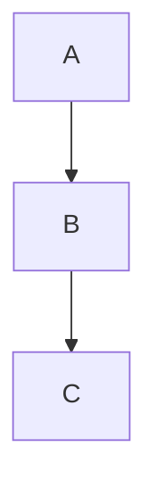

# 第1章 数据库入门 

## 一、数据库基础知识

1. **数据库概述**
   - 数据库(DB)是存储在计算机上的数据集合，相当于电子文件柜
   - 数据库系统三大部分：
     - 数据库：存储数据的空间
     - 数据库管理系统(DBMS)：管理数据的软件(如MySQL、Oracle等)
     - 数据库应用程序：与DBMS交互的工具
2. **数据库管理技术发展**
   - 人工管理阶段(1950s前)：数据不能长期保存，依赖应用程序
   - 文件系统阶段(1950s-1960s)：数据以文件形式存储，共享能力弱
   - 数据库系统阶段(1960s后)：数据结构化，共享性高，独立性高
3. **数据库系统结构**
   - 三级模式：
     - 外模式(用户视图)
     - 概念模式(全局逻辑结构)
     - 内模式(物理存储结构)
   - 二级映像：保证数据逻辑和物理独立性

## 二、数据模型

1. **数据模型分类**
   - 概念数据模型：E-R图(实体-联系模型)
   - 逻辑数据模型：关系模型、层次模型、网状模型等
   - 物理数据模型：数据实际存储方式
2. **关系模型**
   - 数据结构：二维表形式
   - 完整性约束：
     - 实体完整性(主键非空唯一)
     - 参照完整性(外键约束)
     - 用户自定义完整性
   - 关系运算：选择、投影、连接、并、交、差等

## 三、SQL语言

1. **SQL功能分类**
   - DQL(数据查询语言)
   - DML(数据操作语言)
   - DDL(数据定义语言)
   - DCL(数据控制语言)
2. **SQL语法规则**
   - 大小写敏感性因平台而异
   - 关键字通常大写
   - 语句以分号结束


# 第2章 MySQL基本操作

## 一、数据库操作

### 1. 创建数据库
```sql
CREATE DATABASE [IF NOT EXISTS] 数据库名称 
[DEFAULT] CHARACTER SET 字符集名称 
[COLLATE 校对集名称];
```
- 使用`IF NOT EXISTS`避免重复创建错误
- 可指定字符集和校对集

### 2. 查看数据库
```sql
SHOW DATABASES;  -- 查看所有数据库
SHOW CREATE DATABASE 数据库名称;  -- 查看数据库创建信息
```

### 3. 修改数据库
```sql
ALTER DATABASE 数据库名称 
CHARACTER SET 新字符集 
COLLATE 新校对集;
```

### 4. 选择数据库
```sql
USE 数据库名称;  -- 切换当前数据库
SELECT DATABASE();  -- 查看当前选择的数据库
```

### 5. 删除数据库
```sql
DROP DATABASE [IF EXISTS] 数据库名称;
```

## 二、数据表操作

### 1. 创建数据表
```sql
CREATE TABLE [IF NOT EXISTS] 表名 (
    字段名 数据类型 [字段属性],
    ...
) [表选项];
```
- 常用存储引擎：InnoDB(默认)、MyISAM等
- 字段属性：COMMENT注释、约束等

### 2. 查看数据表
```sql
SHOW TABLES;  -- 查看所有表
SHOW TABLE STATUS [LIKE 'pattern'];  -- 查看表状态信息
SHOW CREATE TABLE 表名;  -- 查看建表语句
DESC 表名;  -- 查看表结构
SHOW COLUMNS FROM 表名;  -- 查看列信息
```

### 3. 修改数据表
```sql
-- 重命名表
ALTER TABLE 旧表名 RENAME TO 新表名;
RENAME TABLE 旧表名 TO 新表名;

-- 修改字段
ALTER TABLE 表名 CHANGE 旧字段名 新字段名 数据类型;
ALTER TABLE 表名 MODIFY 字段名 新数据类型;

-- 添加字段
ALTER TABLE 表名 ADD 字段名 数据类型 [FIRST|AFTER 字段名];

-- 删除字段
ALTER TABLE 表名 DROP 字段名;
```

### 4. 删除数据表
```sql
DROP TABLE [IF EXISTS] 表名;
```

## 三、数据操作

### 1. 添加数据
```sql
-- 单条插入
INSERT INTO 表名 (字段1, 字段2) VALUES (值1, 值2);

-- 多条插入
INSERT INTO 表名 VALUES 
(值1, 值2),
(值1, 值2);

-- SET方式插入
INSERT INTO 表名 SET 字段1=值1, 字段2=值2;
```

### 2. 查询数据
```sql
SELECT * FROM 表名;  -- 查询所有数据
SELECT 字段1, 字段2 FROM 表名;  -- 查询指定字段
```

### 3. 修改数据
```sql
-- 条件更新
UPDATE 表名 SET 字段1=值1 WHERE 条件;

-- 全部更新(慎用)
UPDATE 表名 SET 字段1=值1;
```

### 4. 删除数据
```sql
-- 条件删除
DELETE FROM 表名 WHERE 条件;

-- 清空表(慎用)
DELETE FROM 表名;
```

## 四、实践要点
1. 操作前应先选择数据库(USE)
2. 修改和删除操作建议先查询确认
3. 无WHERE条件的UPDATE/DELETE会操作全部数据
4. 表结构修改会影响已有数据，需谨慎操作


# 第3章 数据库设计


## 一、数据类型
### （一）数值类型
| 类型分类   | 具体类型     | 字节数 | 取值范围（有符号/无符号）             | 特点及应用场景                         |
| ---------- | ------------ | ------ | ------------------------------------- | -------------------------------------- |
| 整数类型   | TINYINT      | 1      | -128~127 / 0~255                      | 适用于存储较小整数，如年龄分段         |
|            | SMALLINT     | 2      | -32768~32767 / 0~65535                | 中等范围整数，如短整型ID               |
|            | MEDIUMINT    | 3      | -8388608~8388607 / 0~16777215         | 较少使用，可用于特定范围统计           |
|            | INT          | 4      | -2147483648~2147483647 / 0~4294967295 | 常用整数类型，如用户ID                 |
|            | BIGINT       | 8      | -2^63~2^63-1 / 0~2^64-1               | 超大整数，如时间戳、金融数据           |
| 浮点数类型 | FLOAT        | 4      | 单精度浮点型，约7位有效数字           | 运算速度快，精度较低，适用于非精确计算 |
|            | DOUBLE       | 8      | 双精度浮点型，约15位有效数字          | 精度高，消耗内存大，适用于科学计算     |
| 定点数类型 | DECIMAL(M,D) | M+2    | 精确小数，M为总位数，D为小数位数      | 财务计算等需精确场景，如金额           |
| BIT类型    | BIT(M)       | 1~8    | 二进制数据，M为位数（1~64）           | 存储布尔值或二进制标志位               |

### （二）日期和时间类型
| 类型      | 字节数 | 格式                | 范围                                    | 典型用途                   |
| --------- | ------ | ------------------- | --------------------------------------- | -------------------------- |
| YEAR      | 1      | YYYY                | 1901-2155                               | 存储年份                   |
| DATE      | 3      | YYYY-MM-DD          | 1000-01-01~9999-12-31                   | 存储日期（年-月-日）       |
| TIME      | 3      | HH:MM:SS            | -838:59:59~838:59:59                    | 存储时间或时间间隔         |
| DATETIME  | 8      | YYYY-MM-DD HH:MM:SS | 1000-01-01 00:00:00~9999-12-31 23:59:59 | 存储日期+时间              |
| TIMESTAMP | 4      | YYYY-MM-DD HH:MM:SS | 1970-01-01 00:00:01~2038-01-19 03:14:07 | 自动记录时间戳，有时区依赖 |

### （三）字符串类型
| 类型                  | 存储方式       | 长度限制                                                     | 特点及应用场景                             |
| --------------------- | -------------- | ------------------------------------------------------------ | ------------------------------------------ |
| CHAR(M)               | 固定长度       | 0~255字节                                                    | 适合短文本，如性别（M/F），存储效率高      |
| VARCHAR(M)            | 可变长度       | 0~65535字节                                                  | 常用文本类型，如用户名、地址               |
| BINARY(M)             | 固定长度二进制 | 0~255字节                                                    | 存储二进制数据，如加密字符串               |
| VARBINARY(M)          | 可变长度二进制 | 0~65535字节                                                  | 二进制数据，如图片摘要                     |
| TEXT系列              | 可变长度文本   | TINYTEXT(0~255B)、TEXT(0~64KB)、MEDIUMTEXT(0~16MB)、LONGTEXT(0~4GB) | 长文本，如文章内容                         |
| BLOB系列              | 可变长度二进制 | 对应TEXT系列                                                 | 二进制大对象，如图像、音频                 |
| ENUM('值1','值2',...) | 枚举值         | 1~2字节                                                      | 单选列表，如性别（男/女/保密），存储索引值 |
| SET('值1','值2',...)  | 集合值         | 1~8字节                                                      | 多选列表，如爱好（读书,游戏），按位存储    |

## 二、表的约束
### （一）默认值约束（DEFAULT）
- **作用**：指定字段默认值，插入数据时若未赋值则自动填充。
- **语法**
    ```sql
    -- 创建表时设置
    CREATE TABLE my_table (age TINYINT DEFAULT 18);
    -- 修改表时添加
    ALTER TABLE my_table MODIFY age TINYINT DEFAULT 18;
    ```

### （二）非空约束（NOT NULL）
- **作用**：禁止字段存储NULL值。
- **语法**
    ```sql
    -- 创建表时设置
    CREATE TABLE my_table (name VARCHAR(20) NOT NULL);
    -- 修改表时添加
    ALTER TABLE my_table MODIFY name VARCHAR(20) NOT NULL;
    ```

### （三）唯一约束（UNIQUE）
- **作用**：确保字段值唯一（允许NULL，但只能有一个NULL）。
- **语法**
    ```sql
    -- 列级约束
    CREATE TABLE my_table (email VARCHAR(50) UNIQUE);
    -- 表级约束（多字段联合唯一）
    CREATE TABLE my_table (
        id INT,
        username VARCHAR(20),
        UNIQUE (id, username)
    );
    ```

### （四）主键约束（PRIMARY KEY）
- **作用**：唯一标识记录，非空且唯一（相当于UNIQUE + NOT NULL），每个表只能有一个主键。
- **语法**
    ```sql
    -- 列级约束
    CREATE TABLE my_table (id INT PRIMARY KEY AUTO_INCREMENT);
    -- 表级约束
    CREATE TABLE my_table (
        id INT,
        username VARCHAR(20),
        PRIMARY KEY (id)
    );
    ```

## 三、自动增长（AUTO_INCREMENT）
- **作用**：自动生成唯一整数，常用于主键字段。
- **规则**
    - 仅适用于整数类型（如INT、BIGINT），且需搭配主键或唯一约束。
    - 插入时可忽略字段或插入NULL/0/DEFAULT，自动生成下一个值。
    - 初始值默认为1，每次递增1，可通过`ALTER TABLE table_name AUTO_INCREMENT=新值`修改。
- **示例**
    ```sql
    CREATE TABLE users (
        id INT PRIMARY KEY AUTO_INCREMENT,
        name VARCHAR(20)
    );
    -- 插入数据时自动生成id
    INSERT INTO users (name) VALUES ('Alice'); -- id自动为1
    ```

## 四、字符集与校对集
### （一）核心概念
- **字符集**：规定字符的编码规则（如UTF-8、GBK）。
- **校对集**：定义字符的比较和排序规则（如utf8mb4_general_ci表示不区分大小写）。

### （二）常用字符集
| 字符集  | 说明                                  | 适用场景                 |
| ------- | ------------------------------------- | ------------------------ |
| utf8mb4 | UTF-8的扩展，支持4字节字符（如Emoji） | 国际化场景，推荐默认使用 |
| gbk     | 中文编码，支持2字节中文               | 仅中文环境，节省存储空间 |
| latin1  | 单字节编码，支持西欧语言              | legacy系统，不推荐新项目 |

### （三）设置方法
| 级别     | 语法示例                                                     |
| -------- | ------------------------------------------------------------ |
| 服务器级 | 修改配置文件`my.cnf`，添加`character-set-server=utf8mb4`     |
| 数据库级 | ```sql CREATE DATABASE mydb CHARACTER SET utf8mb4 COLLATE utf8mb4_general_ci; ``` |
| 表级     | ```sql CREATE TABLE my_table (...) DEFAULT CHARACTER SET utf8mb4; ``` |
| 字段级   | ```sql CREATE TABLE my_table (name VARCHAR(20) CHARACTER SET utf8mb4); ``` |

好，下面是**不带任何 emoji 的正式版总结**，结构清晰、表述偏考试答案风格，直接背就能用。

---

## 五 范式
### 一、第一范式（1NF）

#### 定义

第一范式要求**关系中的每个属性都是不可再分的原子值**。

---

#### 判断要点

* 每个字段只能存放一个值
* 不允许出现：

  * 重复组
  * 数组
  * 多值属性

---

#### 不满足 1NF 的例子

学生表：

| 学号  | 姓名 | 电话            |
| --- | -- | ------------- |
| 001 | 张三 | 138xxx,139xxx |

问题：
“电话”字段包含多个值，违反原子性。

---

#### 满足 1NF 的改进方式

方式一（拆行）：

| 学号  | 姓名 | 电话     |
| --- | -- | ------ |
| 001 | 张三 | 138xxx |
| 001 | 张三 | 139xxx |

方式二（拆表）：

* 学生表（学号，姓名）
* 电话表（学号，电话）

---

#### 记忆要点

一个字段一个值。

---

### 二、第二范式（2NF）

#### 定义

第二范式要求：**在满足 1NF 的前提下，非主属性必须完全依赖主键**。

---

#### 判断要点

* 必须先满足 1NF
* 重点检查是否存在**联合主键**
* 是否存在非主属性只依赖主键一部分的情况（部分依赖）

---

#### 不满足 2NF 的例子

成绩表：

| 学号 | 课程号 | 学生姓名 | 成绩 |
| -- | --- | ---- | -- |

主键：（学号，课程号）

问题分析：

* 学生姓名只依赖“学号”
* 不依赖整个联合主键

结论：存在**部分依赖**，不满足 2NF。

---

#### 满足 2NF 的改进方式

拆分为：

* 学生表（学号，学生姓名）
* 成绩表（学号，课程号，成绩）

---

#### 记忆要点

联合主键才会产生 2NF 问题。

---

### 三、第三范式（3NF）

#### 一句话定义

第三范式要求：**在满足 2NF 的前提下，非主属性之间不存在传递依赖**。

---

#### 判断要点

* 是否存在以下关系：

  主键 → 非主属性 A → 非主属性 B

* 即非主属性依赖于另一个非主属性

---

#### 不满足 3NF 的例子

用户表：

| 用户编号 | 用户名 | 用户等级 | 折扣 |
| ---- | --- | ---- | -- |

语义关系：

* 用户等级决定折扣

函数依赖：

* 用户编号 → 用户等级 → 折扣

结论：
“折扣”通过“用户等级”间接依赖主键，属于**传递依赖**，不满足 3NF。

---

#### 满足 3NF 的改进方式

拆分为：

* 用户表（用户编号，用户名，用户等级）
* 等级表（用户等级，折扣）

---

#### 记忆要点

非主属性不能决定非主属性。

---

### 四、三大范式对照总结表

| 范式  | 解决的问题  | 核心关键词 |
| --- | ------ | ----- |
| 1NF | 字段不可再分 | 原子性   |
| 2NF | 消除部分依赖 | 联合主键  |
| 3NF | 消除传递依赖 | 非主属性  |

---

### 五、考试快速判断流程

1. 字段是否原子化
   是 → 满足 1NF

2. 是否存在联合主键
   否 → 满足 2NF
   是 → 检查是否存在部分依赖

3. 是否存在非主属性之间的依赖
   存在 → 不满足 3NF

---


# 第5章 单表操作 

## 一、数据进阶操作

### 1. 复制表结构和数据
```sql
-- 复制表结构
CREATE TABLE new_table LIKE source_table;

-- 复制表数据(全字段)
INSERT INTO new_table SELECT * FROM source_table;

-- 复制表数据(指定字段)
INSERT INTO new_table (col1,col2) SELECT col1,col2 FROM source_table;
```

### 2. 解决主键冲突
```sql
-- 主键冲突更新
INSERT INTO table (id,name) VALUES (1,'A') 
ON DUPLICATE KEY UPDATE name='A';

-- 主键冲突替换
REPLACE INTO table (id,name) VALUES (1,'A');
```

### 3. 清空数据

| 操作     | 语法                 | 特点                                     | 适用场景     |
| -------- | -------------------- | ---------------------------------------- | ------------ |
| TRUNCATE | `TRUNCATE TABLE 表;` | 快速删除全表数据，重置自增字段，DDL 语句 | 大数据量清空 |
| DELETE   | `DELETE FROM 表;`    | 逐条删除，可带 WHERE 条件，DML 语句      | 选择性删除   |

```sql
TRUNCATE TABLE table_name;  -- 重置自增ID，不可回滚
DELETE FROM table_name;     -- 保留自增ID，可回滚
```

### 4. 去除重复记录
```sql
SELECT DISTINCT column FROM table;
```

## 二、排序和限量

### 1. 排序(ORDER BY)
```sql
-- 基本排序
SELECT * FROM table ORDER BY col1 ASC, col2 DESC;

-- 中文排序
SELECT * FROM table ORDER BY CONVERT(name USING gbk);

-- 自定义顺序排序
SELECT * FROM table 
ORDER BY FIELD(status,'待处理','处理中','已完成');
```

### 2. 限量(LIMIT)
```sql
-- 基本限量
SELECT * FROM table LIMIT 5;      -- 前5条
SELECT * FROM table LIMIT 5,10;   -- 第6-15条
```

## 三、分组与聚合函数

### 1. 分组(GROUP BY)

**语法**：`SELECT 分组字段, 聚合函数 FROM 表 [WHERE 条件] GROUP BY 分组字段;`

**注意**：

- `SELECT`列表只能包含分组字段或聚合函数。
- `NULL`值会被归为同一组。

```sql
-- 基本分组
SELECT department, COUNT(*) FROM employees GROUP BY department;

-- 多字段分组
SELECT year, month, SUM(sales) FROM orders GROUP BY year, month;
```

### 2. 常用聚合函数
| 函数           | 说明       | 示例                                      |
| -------------- | ---------- | ----------------------------------------- |
| COUNT()        | 计数       | `SELECT COUNT(*) FROM table`              |
| SUM()          | 求和       | `SELECT SUM(salary) FROM employees`       |
| AVG()          | 平均值     | `SELECT AVG(score) FROM tests`            |
| MAX()          | 最大值     | `SELECT MAX(price) FROM products`         |
| MIN()          | 最小值     | `SELECT MIN(age) FROM users`              |
| GROUP_CONCAT() | 连接字符串 | `SELECT GROUP_CONCAT(name) FROM students` |

### 3. 分组筛选(HAVING)
```sql
-- 筛选分组结果
SELECT department, AVG(salary) 
FROM employees 
GROUP BY department 
HAVING AVG(salary) > 5000;
```

### 4. 回溯统计(WITH ROLLUP)
```sql
-- 在分组结果中添加汇总行（NULL表示汇总）
SELECT year, SUM(sales) FROM orders GROUP BY year WITH ROLLUP;
```

## 四、常用运算符

### 1. 算术运算符
```sql
+ - * / DIV(整除) % MOD(取模)
```

### 2. 比较运算符
| 运算符    | 说明     | 示例                             |
| --------- | -------- | -------------------------------- |
| =         | 等于     | `WHERE id = 1`                   |
| <> !=     | 不等于   | `WHERE status <> 0`              |
| > < >= <= | 大小比较 | `WHERE age > 18`                 |
| BETWEEN   | 范围     | `WHERE price BETWEEN 10 AND 100` |
| LIKE      | 模糊匹配 | `WHERE name LIKE '张%'`          |
| REGEXP    | 正则匹配 | `WHERE email REGEXP '@qq\.com$'` |
| IS NULL   | 空值判断 | `WHERE phone IS NULL`            |

### 3. 逻辑运算符
```sql
AND OR NOT XOR(异或)
```

### 4. 位运算符
```sql
&(与) |(或) ^(异或) ~(取反) <<(左移) >>(右移)
```

### 5. 运算符优先级
1. 括号 `()` 
2. 算术运算符 `* / % + -` 
3. 比较运算符 `= > < >= <=` 
4. 逻辑运算符 `NOT AND OR`


# 第6章 多表操作

## 一、联合查询
### （一）核心概念
- **定义**：将多个查询结果合并为一个结果集，用于合并分表数据或组合不同条件的查询结果。  
- **语法**：  
  ```sql
  SELECT ... FROM 表1 [WHERE条件]
  UNION [ALL | DISTINCT]
  SELECT ... FROM 表2 [WHERE条件];
  ```
  - `ALL`：保留所有记录（包括重复）。  
  - `DISTINCT`：去重（默认）。  

### （二）注意事项
1. **字段一致性**：参与联合的查询字段数量、顺序必须一致，结果字段名以第一条查询为准。  
2. **排序与限量**：需用括号包裹单个查询，排序需添加`LIMIT`。  
   ```sql
   (SELECT * FROM 表1 ORDER BY 字段 LIMIT 5)
   UNION
   (SELECT * FROM 表2 ORDER BY 字段 LIMIT 5);
   ```

### （三）示例
- **合并不同分类数据**：  
  ```sql
  SELECT id, name, price FROM sh_goods WHERE category_id=9
  UNION
  SELECT id, name, keyword FROM sh_goods WHERE category_id=6;
  ```

## 二、连接查询
### （一）交叉连接（笛卡儿积）
- **定义**：返回两表所有行的组合，结果行数=表1行数×表2行数。  
- **语法**：  
  ```sql
  SELECT * FROM 表1 CROSS JOIN 表2; -- 显式
  SELECT * FROM 表1, 表2; -- 隐式
  ```
- **应用场景**：理论上用于生成测试数据，实际开发中需结合条件过滤。

### （二）内连接（INNER JOIN）
- **定义**：仅返回两表中满足连接条件的记录（交集）。  
- **分类**：  
  - **隐式**：通过`WHERE`指定连接条件。  
    ```sql
    SELECT * FROM 表1, 表2 WHERE 表1.字段=表2.字段;
    ```
  - **显式**：通过`ON`指定连接条件，性能更优。  
    ```sql
    SELECT * FROM 表1 JOIN 表2 ON 表1.字段=表2.字段;
    ```
- **自连接**：同一表连接自身，需设置别名。  
  ```sql
  SELECT a.id, b.id FROM 表 a JOIN 表 b ON a.字段=b.字段;
  ```

### （三）外连接
1. **左外连接（LEFT JOIN）**  
   - **定义**：返回左表所有记录和右表匹配记录，右表不匹配字段为`NULL`。  
   ```sql
   SELECT * FROM 左表 LEFT JOIN 右表 ON 连接条件;
   ```
   
2. **右外连接（RIGHT JOIN）**  
   - **定义**：返回右表所有记录和左表匹配记录，左表不匹配字段为`NULL`。  
   ```sql
   SELECT * FROM 左表 RIGHT JOIN 右表 ON 连接条件;
   ```

### （四）USING关键字
- **作用**：简化同名连接字段的条件书写。  
- **语法**：  
  ```sql
  SELECT * FROM 表1 JOIN 表2 USING(公共字段);
  ```
  ```sql
  -- 等价于 ON 表1.公共字段=表2.公共字段
  SELECT g1.name, g2.name FROM sh_goods g1 JOIN sh_goods g2 USING(category_id);
  ```

## 三、子查询
### （一）分类与应用
| 类型             | 返回结果           | 常用场景           | 示例                                                         |
| ---------------- | ------------------ | ------------------ | ------------------------------------------------------------ |
| **标量子查询**   | 单行单列（单个值） | 条件匹配（=, >等） | `SELECT * FROM 表 WHERE 字段=(SELECT MAX(字段) FROM 表);`    |
| **列子查询**     | 单列多行（集合）   | `IN/NOT IN`过滤    | `SELECT * FROM 表 WHERE 字段 IN (SELECT 字段 FROM 表);`      |
| **行子查询**     | 一行多列           | 多字段匹配         | `SELECT * FROM 表 WHERE (字段1, 字段2)=(SELECT 字段1, 字段2 FROM 表);` |
| **表子查询**     | 多行多列（虚拟表） | 作为数据源         | `SELECT * FROM (SELECT * FROM 表) AS t WHERE 条件;`          |
| **EXISTS子查询** | 存在性判断（1/0）  | 数据存在性校验     | `SELECT * FROM 表 WHERE EXISTS (SELECT 1 FROM 表 WHERE 关联条件);` |

### （二）关键字扩展
- **ANY/SOME**：满足子查询中的任意一个值。  
  ```sql
  SELECT * FROM 表 WHERE 字段 > ANY (SELECT 字段 FROM 表); -- 大于子查询任意值
  ```
- **ALL**：满足子查询中的所有值。  
  ```sql
  SELECT * FROM 表 WHERE 字段 > ALL (SELECT 字段 FROM 表); -- 大于子查询所有值
  ```

## 四、外键约束
### （一）核心概念
- **定义**：从表字段引用主表主键/唯一键，保证数据一致性。  
- **角色**：  
  - **主表**：被引用表（如部门表）。  
  - **从表**：引用表（如员工表）。  
- **存储引擎**：仅InnoDB支持外键。

### （二）操作语法
1. **创建表时添加**  
   
   ```sql
   CREATE TABLE 从表 (
     id INT PRIMARY KEY,
     dept_id INT,
     FOREIGN KEY(dept_id) REFERENCES 主表(id)
     ON DELETE CASCADE -- 主表删除时级联删除从表记录
   );
   ```
   
2. **修改表添加**  
   ```sql
   ALTER TABLE 从表 ADD FOREIGN KEY(dept_id) REFERENCES 主表(id);
   ```

3. **删除外键**  
   ```sql
   ALTER TABLE 从表 DROP FOREIGN KEY 外键名;
   ```

### （三）关联操作规则
| 主表操作  | 从表行为（ON DELETE/UPDATE）                                 |
| --------- | ------------------------------------------------------------ |
| 删除/更新 | `RESTRICT`：拒绝操作（默认）&lt;br&gt;`CASCADE`：级联删除/更新从表记录&lt;br&gt;`SET NULL`：从表字段设为`NULL`（需允许`NULL`）&lt;br&gt;`NO ACTION`：与`RESTRICT`相同 |

### （四）示例
- **添加数据**：先主表后从表，从表外键必须存在于主表。  
  ```sql
  INSERT INTO 主表 (id, name) VALUES (1, '研发部'); -- 先添加主表
  INSERT INTO 从表 (name, dept_id) VALUES ('Tom', 1); -- 再添加从表
  ```
- **更新数据**：主表更新，从表按规则响应（如`CASCADE`自动更新）。  
- **删除数据**：主表删除前需先删除从表关联记录（`RESTRICT`模式）。  


# 第7章 用户与权限

## 1. 用户与权限概述
### 1.1 用户表（`mysql.user`）字段分类
- **用户字段**：`Host`和`User`共同组成复合主键，区分MySQL用户。
- **用户身份验证字段**：`plugin`（验证插件名称）和`authentication_string`（加密后的密码）。
- **安全连接字段**：`ssl_type`、`ssl_cipher`、`x509_issuer`、`x509_subject`，用于SSL安全协议验证。
- **资源控制字段**：以`max_`开头，限制用户资源使用（如`max_questions`、`max_updates`等）。
- **权限字段**：以`_priv`结尾，保存用户权限。
- **账户锁定字段**：`account_locked`（`Y`表示锁定，`N`表示解锁）。

### 1.2 默认用户
- `mysql.infoschema`：管理和访问`information_schema`数据库。
- `mysql.session`：用于验证用户身份。
- `mysql.sys`：定义系统模式对象。
- `root`：超级管理员用户。

---

## 2. 用户管理
### 2.1 创建用户
**基本语法**：
```sql
CREATE USER [IF NOT EXISTS] '用户名'@'主机名' 
IDENTIFIED BY '密码' 
[WITH 资源控制选项] 
[PASSWORD EXPIRE] 
[ACCOUNT LOCK|UNLOCK];
```

**示例**：
1. 创建普通用户：
   ```sql
   CREATE USER 'test1'@'localhost' IDENTIFIED BY '123456';
   ```
2. 创建允许任意主机登录的用户：
   ```sql
   CREATE USER 'test2'@'%' IDENTIFIED BY '123456';
   ```
3. 设置资源限制：
   ```sql
   CREATE USER 'test3'@'localhost' WITH MAX_UPDATES_PER_HOUR 10;
   ```
4. 设置密码过期：
   ```sql
   CREATE USER 'test4'@'localhost' PASSWORD EXPIRE;
   ```
5. 锁定用户：
   ```sql
   CREATE USER 'test5'@'localhost' ACCOUNT LOCK;
   ```

### 2.2 修改用户
**基本语法**：
```sql
ALTER USER '用户名'@'主机名' 
[IDENTIFIED BY '新密码'] 
[WITH 资源控制选项] 
[ACCOUNT LOCK|UNLOCK];
```

**示例**：
1. 修改密码：
   ```sql
   ALTER USER 'test1'@'localhost' IDENTIFIED BY 'newpassword';
   ```
2. 解锁用户：
   ```sql
   ALTER USER 'test5'@'localhost' ACCOUNT UNLOCK;
   ```
3. 修改资源限制：
   ```sql
   ALTER USER 'test3'@'localhost' WITH MAX_USER_CONNECTIONS 2;
   ```

**其他方式**：
- 使用`SET PASSWORD`修改密码：
  ```sql
  SET PASSWORD FOR 'test1'@'localhost' = 'newpassword';
  ```
- 使用`mysqladmin`修改密码：
  ```bash
  mysqladmin -u test1 -p password 'newpassword'
  ```

### 2.3 删除用户
**基本语法**：
```sql
DROP USER [IF EXISTS] '用户名'@'主机名';
```

**示例**：
```sql
DROP USER IF EXISTS 'test1'@'localhost';
```

---

## 3. 权限管理
### 3.1 授予权限
**基本语法**：
```sql
GRANT 权限类型 ON 数据库.表 TO '用户名'@'主机名';
```

**权限级别**：
- `*.*`：全局权限。
- `数据库名.*`：数据库权限。
- `数据库名.表名`：表权限。
- `列名`：列权限。

**示例**：
1. 授予查询权限：
   ```sql
   GRANT SELECT ON shop.sh_goods TO 'test1'@'localhost';
   ```
2. 授予列权限：
   ```sql
   GRANT INSERT (name, price) ON shop.sh_goods TO 'test1'@'localhost';
   ```

### 3.2 查看权限
**基本语法**：
```sql
SHOW GRANTS FOR '用户名'@'主机名';
```

**示例**：
```sql
SHOW GRANTS FOR 'test1'@'localhost';
```

### 3.3 回收权限
**基本语法**：
```sql
REVOKE 权限类型 ON 数据库.表 FROM '用户名'@'主机名';
```

**示例**：
1. 回收插入权限：
   ```sql
   REVOKE INSERT ON shop.sh_goods FROM 'test1'@'localhost';
   ```
2. 回收所有权限：
   ```sql
   REVOKE ALL PRIVILEGES, GRANT OPTION FROM 'test1'@'localhost';
   ```

### 3.4 刷新权限
**基本语法**：
```sql
FLUSH PRIVILEGES;
```

**其他方式**：
```bash
mysqladmin -uroot -p reload
```

---

# 第8章 视图总结

## 1. 视图的基本概念
### 1.1 什么是视图
- **定义**：视图是从一个或多个表中导出的虚拟表，其结构和数据依赖于基本表。
- **特点**：
  - 不存储实际数据，仅保存定义视图的SQL语句。
  - 当基本表数据变化时，视图查询结果会自动更新。
  - 通过视图可以修改基本表中的数据（需满足条件）。

### 1.2 视图的优点
1. **简化查询**：封装复杂查询逻辑，简化用户操作。
2. **安全性**：通过视图限制用户访问敏感数据。
3. **逻辑独立性**：屏蔽表结构变化，减少对应用程序的影响。

---

## 2. 视图管理
### 2.1 创建视图
**基本语法**：
```sql
CREATE [OR REPLACE] [ALGORITHM = {UNDEFINED | MERGE | TEMPTABLE}]
VIEW 视图名称 [(字段列表)] AS 查询语句
[WITH [CASCADED | LOCAL] CHECK OPTION];
```

**参数说明**：
- **ALGORITHM**：
  - `UNDEFINED`（默认）：由MySQL选择算法。
  - `MERGE`：合并查询语句。
  - `TEMPTABLE`：使用临时表存储结果。
- **WITH CHECK OPTION**：
  - `CASCADED`（默认）：级联检查所有相关视图和表的条件。
  - `LOCAL`：仅检查当前视图的条件。

**示例**：
1. 基于单表创建视图：
   ```sql
   CREATE VIEW view_goods AS
   SELECT id, name, price FROM sh_goods;
   ```
2. 基于多表创建视图：
   ```sql
   CREATE VIEW view_goods_cate AS
   SELECT g.id, g.name, c.name AS category_name
   FROM sh_goods g LEFT JOIN sh_goods_category c ON g.category_id = c.id;
   ```

### 2.2 查看视图
1. **查看字段信息**：
   ```sql
   DESC 视图名称;  -- 或 DESCRIBE 视图名称;
   ```
2. **查看状态信息**：
   ```sql
   SHOW TABLE STATUS LIKE '视图名称';
   ```
3. **查看创建语句**：
   ```sql
   SHOW CREATE VIEW 视图名称;
   ```

### 2.3 修改视图
1. **使用`CREATE OR REPLACE VIEW`**：
   ```sql
   CREATE OR REPLACE VIEW view_goods AS
   SELECT id, name FROM sh_goods;  -- 修改字段
   ```
2. **使用`ALTER VIEW`**：
   ```sql
   ALTER VIEW view_goods AS
   SELECT id FROM sh_goods;  -- 进一步修改字段
   ```

### 2.4 删除视图
```sql
DROP VIEW [IF EXISTS] 视图名称;
```

---

## 3. 视图数据操作
### 3.1 添加数据
通过视图向基本表插入数据：
```sql
INSERT INTO 视图名称 VALUES (值1, 值2, ...);
```
**限制条件**：
1. 视图基于多表时，插入可能失败。
2. 字段需满足基本表约束。
3. 视图中不能包含数学表达式、聚合函数或`DISTINCT`、`GROUP BY`等子句。

**示例**：
```sql
INSERT INTO view_cate_t2 VALUES (21, 'test');  -- 需满足WITH CHECK OPTION条件
```

### 3.2 修改数据
通过视图更新基本表数据：
```sql
UPDATE 视图名称 SET 字段名=值 WHERE 条件;
```
**示例**：
```sql
UPDATE view_category SET name='家电' WHERE id=17;
```

### 3.3 删除数据
通过视图删除基本表数据：
```sql
DELETE FROM 视图名称 WHERE 条件;
```
**示例**：
```sql
DELETE FROM view_category WHERE id IN (17, 21, 30);
```

---

## 4. 视图安全控制
### 4.1 权限控制
- **DEFINER**：指定视图定义者，默认为当前用户。
- **SQL SECURITY**：
  - `DEFINER`（默认）：以定义者权限执行视图。
  - `INVOKER`：以调用者权限执行视图。

**示例**：
```sql
CREATE DEFINER='shop_test' SQL SECURITY INVOKER VIEW view_goods_t3 AS
SELECT id, name FROM sh_goods LIMIT 1;
```

### 4.2 安全实践
- 为视图分配最小必要权限，避免敏感数据泄露。
- 使用`WITH CHECK OPTION`限制数据操作范围。

---

## 5. 实践应用
### 5.1 常见场景
1. **简化复杂查询**：将多表关联查询封装为视图。
2. **数据权限控制**：通过视图限制用户访问特定字段或行。
3. **逻辑隔离**：屏蔽底层表结构变化。

---


# 第9章 事务

## 一、事务的概念
### （一）定义
事务是由一条或多条SQL语句组成的逻辑执行单元，具有**原子性、一致性、隔离性、持久性（ACID）**四大特性：
- **原子性**：事务中的操作要么全成功，要么全回滚，确保不可分割。  
- **一致性**：事务执行前后，数据库状态需保持一致（如转账前后总金额不变）。  
- **隔离性**：事务间相互隔离，互不干扰（通过隔离级别实现）。  
- **持久性**：事务提交后，数据修改永久生效（依赖redo日志）。

## 二、事务处理
### （一）基本操作
| 操作         | 语法                                                         | 说明                            |
| ------------ | ------------------------------------------------------------ | ------------------------------- |
| 开启事务     | `START TRANSACTION;`或`BEGIN;`                               | 显式开启一个事务，禁止嵌套      |
| 提交事务     | `COMMIT;`                                                    | 永久保存事务修改                |
| 回滚事务     | `ROLLBACK;`                                                  | 撤销事务内所有未提交操作        |
| 设置自动提交 | `SET AUTOCOMMIT = 0;`（关闭）&lt;br&gt;`SET AUTOCOMMIT = 1;`（开启） | 默认自动提交（每条SQL独立事务） |

事务仅针对数据操作（如增删改查），不包含创建/删除数据库、表结构修改等操作。

### （二）事务保存点（SAVEPOINT）

- **作用**：在事务中创建中间点，支持部分回滚。  
- **语法**：  
  ```sql
  SAVEPOINT 保存点名称; -- 创建保存点  
  ROLLBACK TO SAVEPOINT 保存点名称; -- 回滚到指定保存点  
  RELEASE SAVEPOINT 保存点名称; -- 删除保存点  
  ```
- **示例**：  
  ```sql
  START TRANSACTION;  
  UPDATE ...;  
  SAVEPOINT s1;  
  UPDATE ...;  
  ROLLBACK TO s1; -- 回滚到s1，撤销第二个UPDATE  
  COMMIT;  
  ```

## 三、事务日志
### （一）redo日志（重做日志）
- **作用**：保障事务的持久性，记录数据页修改后的物理日志。  
- **机制**：  
  - 事务提交时，先将redo日志写入磁盘（顺序写），而非立即更新数据页（随机写），提升性能（预写式日志WAL）。  
  - 数据库故障时，通过redo日志恢复未持久化的修改。

### （二）undo日志（回滚日志）
- **作用**：  
  - 保障事务的原子性，记录数据修改前的逻辑日志，用于回滚。  
  - 实现多版本并发控制（MVCC），提供旧版本数据查询。  

## 四、事务的隔离级别
### （一）隔离级别与问题
| 隔离级别             | 脏读 | 不可重复读 | 幻读                 | 锁机制         | 性能              |
| -------------------- | ---- | ---------- | -------------------- | -------------- | ----------------- |
| **READ UNCOMMITTED** | 允许 | 允许       | 允许                 | 无锁（性能高） | 最高              |
| **READ COMMITTED**   | 禁止 | 允许       | 允许                 | 行锁           | 较高（MySQL默认） |
| **REPEATABLE READ**  | 禁止 | 禁止       | 允许（InnoDB已解决） | 行锁+间隙锁    | 中等              |
| **SERIALIZABLE**     | 禁止 | 禁止       | 禁止                 | 表锁           | 最低              |

### （二）操作语法
1. **查看隔离级别**  
   ```sql
   SELECT @@global.transaction_isolation; -- 全局级别  
   SELECT @@session.transaction_isolation; -- 当前会话级别  
   ```
2. **修改隔离级别**  
   ```sql
   SET [GLOBAL | SESSION] TRANSACTION ISOLATION LEVEL READ COMMITTED;  
   ```
   - `GLOBAL`：全局生效（需重启或新会话）。  
   - `SESSION`：当前会话生效（仅对后续事务有效）。

### （三）典型问题演示
1. **脏读**：低隔离级别下读取未提交数据，通过提升至`READ COMMITTED`解决。  
2. **不可重复读**：同一事务内多次查询结果不一致，通过提升至`REPEATABLE READ`解决。  
3. **幻读**：事务中插入数据时出现虚增记录，InnoDB通过`REPEATABLE READ`+间隙锁解决。

## 五 总结
- **核心价值**：通过事务确保复杂操作的原子性和一致性，适用于金融交易、库存管理等场景。  
- **隔离级别选择**：根据业务需求平衡性能与数据一致性（如电商场景常用`REPEATABLE READ`）。  
- **日志机制**：redo/undo日志是事务持久化和回滚的底层保障，理解其原理有助于优化事务性能。


```mermaid
flowchart TD

A([开始]) --> B{负载因子 > 阈值?}

B -- 否 --> C([结束])
B -- 是 --> D[创建新哈希表 容量=原容量×2]

D --> E[遍历旧哈希表]
E --> F{当前槽位是否为空?}

F -- 是 --> G[跳过该槽位]
G --> H{是否遍历结束?}

F -- 否 --> I[重新计算哈希值 hash(key)%新容量]
I --> J[插入到新哈希表]
J --> H

H -- 否 --> E
H -- 是 --> K[用新表替换旧表]

K --> L([结束])
```




