# 计算机网络期末复习


# 老师强调的重点知识点


---

**三种交换技术**

核心问题：一条通信线路如何同时服务很多用户？

**电路交换**

- 干什么：通信前先建立一条端到端的专属物理通路，通信期间独占资源，就像铁路调度为专列预留一整条轨道。
- 工作过程：建立连接 → 数据传输 → 释放连接。
- 优点：时延稳定，实时性强，不会中途被抢占。
- 缺点：资源利用率低，即使不传数据也占用线路，建立连接耗时长。
- 典型应用：传统电话网。

**报文交换**

- 为什么出现：电路交换太浪费，希望线路能共享。
- 干什么：以完整报文为单位，逐跳存储转发，不需要预先建立连接。
- 过程：发送方→交换节点（完整接收报文）→下一交换节点（完整接收）→接收方。
- 优点：无需建链，线路利用率提高。
- 缺点：报文很长时延迟大，中间节点需要较大缓存。
- 典型应用：电报、电子邮件（非实时通信）。

**分组交换**

- 为什么出现：报文交换遇到大文件效率仍然低，且差错重传代价大。
- 干什么：将长报文切分成若干短小的分组，各分组独立转发。
- 优点：网络利用率最高，适合多用户共享，故障时可绕行，灵活。
- 缺点：分组可能乱序到达，可能丢包，需额外协议保证可靠性。
- **互联网采用的就是分组交换**。

比喻：电路交换像专用铁轨，报文交换像整列货车到站再编组，分组交换像把货物拆成标准集装箱，按实时路况分车运输。

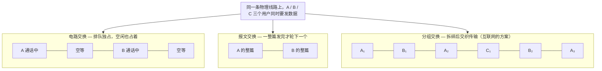

---

**网络协议三要素**

协议本质：通信双方共同遵守的规则。就像两个人对话，必须约定用哪种语言、每句话代表什么意思、谁先开口。

- **语法** ：数据长什么样——字段顺序、长度、格式，例如“姓名:张三;年龄:20”。相当于约定对话的词汇和文法。
- **语义** ：数据表示什么含义——例如HTTP状态码“404”，语法正确，语义是资源未找到。相当于约定每句话的动作意图。
- **同步** ：谁先发、后发、何时发——例如TCP三次握手的SYN→SYN+ACK→ACK顺序不能乱。相当于约定对话的节奏和轮次。

---

**计算机网络的定义和分类**

**计算机网络的定义**

- 干什么：将地理位置不同、功能独立的多台计算机及外部设备，通过通信线路连接起来，在网络操作系统、协议的管理与协调下，实现**资源共享**和**信息传递**的系统。
- 简单理解：用通信线缆把独立电脑连起来，让它们可以互传数据、共享打印机或互联网出口。

**计算机网络的分类（按覆盖范围）**

| 类型 | 范围 | 典型示例 |
| --- | --- | --- |
| PAN 个域网 | 个人设备周围 | 蓝牙耳机连手机 |
| LAN 局域网 | 房间、楼宇、校园 | 办公室Wi-Fi |
| MAN 城域网 | 城市 | 广电宽带网 |
| WAN 广域网 | 国家或全球 | 互联网 |

关系可以看作嵌套：PAN → LAN → MAN → WAN。

---

**计算机网络的性能指标**

网络好不好用，用下面这些“体检指标”衡量。

- **速率**：单位时间内传输的比特数，单位 bps。好比水管每秒流出多少升水。  
  *重点单位换算*：1 Byte（字节）= 8 bits，1 KB = 1024 B，1 MB = 1024 KB，但速率通常用十进制：1 kbps = 1000 bps，1 Mbps = 1000 kbps。做题时务必注意**大B（字节）和小b（比特）**，文件大小常用Byte，带宽常用bit/s。
- **带宽**：数字信道所能传送的“最高数据率”，单位 bps。可以理解为水管的粗度（最大通水能力），不是当前水流速度。
- **吞吐量**：单位时间内通过某个网络（或链路、接口）的实际数据量。受带宽或拥塞限制，像某条路实际的每小时车流量。
- **时延**：数据从源端到目的端的总花费时间，包含发送时延、传播时延、处理时延、排队时延。好比开车上路，总时间=装车时间+路上行驶+收费站处理+堵车排队。
- **时延带宽积**：时延 × 带宽，结果是以比特为单位的“管道容积”。描述一条链路最多能同时“在路上”容纳多少比特。像高速公路的长途大巴数量：车速慢但路很长（时延大），路上同时跑的车就多。
- **往返时间 RTT**：从发送端发出数据到收到接收端确认的总时间。可以用来判断网络交互的灵敏度。
- **利用率**：信道利用率和网络利用率。利用率越高，说明线路越忙，但时延也会急剧增大——像高速路车流量达到80%就开始龟速。
- **丢包率**：丢失分组占总发送分组的比例。反映网络拥塞程度或链路质量。像快递丢失率，高了肯定有问题。

---

**计算机网络体系结构**

**常见的三种体系结构**

- **OSI七层参考模型**：理论标准，层次清晰，但复杂。从上到下：应用层、表示层、会话层、传输层、网络层、数据链路层、物理层。
从底到上：物，数，网，传，会，表，应

- **TCP/IP四层模型**：事实上的工业标准。从上到下：应用层、运输层、网际层、网络接口层。
- **五层原理模型**（教学用）：综合两者，从上到下：应用层、运输层、网络层、数据链路层、物理层。

**层次对比（TCP/IP 与 OSI 对应）**

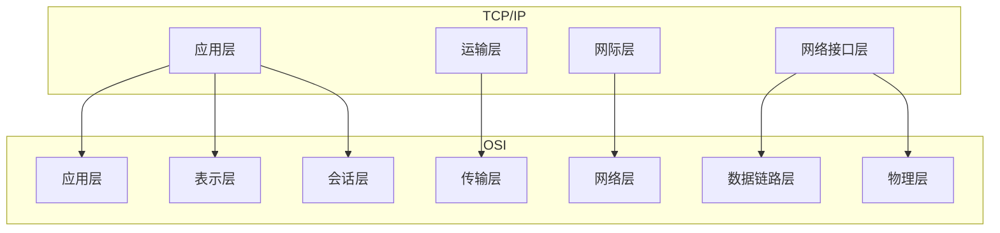

*TCP/IP的应用层合并了OSI的高三层，网络接口层合并了低两层。*

**分层的必要性**

- 干什么：把庞大复杂的网络问题分解成若干相对独立的子问题，每层只负责特定功能，下层为上层提供服务。
- 优点：各层独立发展，修改某一层不影响其他层；便于标准化；容易教学和理解。
- 比喻：像邮政系统，写信的人不用管货车走哪条路，只需按地址封装好交给邮局；运输部门不用看懂信件内容。

**分层思想举例**：你在浏览器输入网址 www.example.com
- 应用层：构造HTTP请求报文
- 运输层：封装为TCP报文段，添加端口号
- 网络层：封装为IP数据报，添加目的IP地址
- 数据链路层：封装为帧，添加MAC地址
- 物理层：转换成比特流，通过网线/无线电发送

**体系结构专用术语**

- **实体**：每一层中完成该层功能的软件/硬件模块。对等层之间仿佛在直接对话。
- **协议**：控制两个对等实体通信的规则集合，即同层间的约定。协议三要素就是语法、语义、同步。
- **服务**：下层为紧邻的上层提供的功能调用接口。是垂直的。
- **服务访问点 SAP**：上下层实体间交换信息的地方，如运输层的端口号、网络层的IP地址等。
- **数据单元**：  
  应用层——报文  
  运输层——报文段（TCP）或用户数据报（UDP）  
  网络层——IP数据报（或包）  
  数据链路层——帧  
  物理层——比特

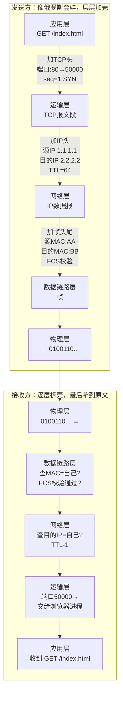

*直观理解：每层只关心自己那层的信息，下层看不懂上层的内容——就像邮局只看信封，不拆信。*

---

**物理层相关概念补充**

**同步传输与异步传输**

- 核心问题：接收方怎么知道一个比特单元或一个字符从哪开始、到哪结束？
- **异步传输**：每个字符独立发送，用起始位和停止位包裹。像说话时每个字后面都顿一下。  
  优点：简单，不需要严格时钟同步。  
  缺点：额外开销大（每个字符都有起止位）。
- **同步传输**：把多个字符组成数据块，在块前面加上同步字符，收发双方靠时钟同步连续收发。  
  优点：传输效率高。  
  缺点：实现复杂。

**曼彻斯特编码**

- 为什么需要：若连续发送很多0或1，接收方可能丢失时钟同步。
- 干什么：每个码元中间强制发生一次跳变，用跳变方向表示0或1。低→高为1，高→低为0。
- 优点：自带同步时钟，抗干扰能力强。
- 缺点：带宽利用率低（信号变化频率是数据率的两倍）。

**ASK、FSK、PSK（数字调制）**

- 问题：计算机的数字信号要放到电话线、无线等模拟信道上传，需要“骑”到载波上。
- **ASK 幅移键控**：改变振幅，大波=1，小波=0。简单但易受噪声干扰，像用灯光强弱传信息，雾天容易误判。
- **FSK 频移键控**：改变频率，高频=1，低频=0。抗干扰较强，但占用的频带较宽，像用两种声调的哨子。
- **PSK 相移键控**：改变相位，比如0°表示0，180°表示1。效率高，现代通信广泛使用，但对解调电路要求高。

**四种复用技术**

**先问一个问题：三个人分别要发 ○、□、△ 给远方，但只有一根线，怎么办？**

如果不复用，就只能排成一队，一个一个发——A 发完所有 ○，B 再发所有 □，C 最后发 △。浪费大量时间。

复用要解决的核心问题就是：**让多个用户同时共享一条物理链路，谁也不耽误谁。**

---

**FDM 频分复用 —— 把一根线的频带切成三份，每人用一份**

像收音机：中央人民广播电台用 95.6 兆赫，省台用 97.8 兆赫，而你用遥控器一拧就能选台——它们在同一根线上同时广播，互不干扰，因为各自的频率段不同。

```
FDM 的线： [频道A: ○○○○○|频道B: □□□□□|频道C: △△△△△]
           ↑ 频带切成了三段，三个人的数据同时发
```

---

**TDM 时分复用 —— 把时间切成小片，大家轮流用**

三台电脑共享一条网线，谁都不让谁。TDM 的做法：把 1 秒切成三小片，每人各占一片，快速轮转。

```
TDM 的时间线： [A][B][C][A][B][C][A][B][C]...
               ↑ 三人在时间上轮流，你一秒感觉不到的细粒度
```

---

**WDM 波分复用 —— 光纤版的 FDM，一条光纤里同时跑红绿蓝三束光**

本质就是光的频分复用。在一根光纤里，不同波长的激光（好比不同颜色的光）各自独立传输数据，互不影响。

```
WDM 的光纤： [🔴 红光束|🟢 绿光束|🔵 蓝光束]
              ↑ 不同波长的光合在一起跑
```

---

**CDM 码分复用 —— 所有人同时同频说话，但用不同"口音"区分**

典型场景是移动通信（3G）。所有人在同一时间、同一频率上一起说话，但每人的数据被乘以一串独特的"码型"。接收端用相同的码型去解，就能从嘈杂的混合信号里提取出想要的那一个人的信息。

```
CDM 的空中： [A码×○|B码×□|C码×△] 叠加在一起发出去，接收端用"码型钥匙"分别解开
```

---

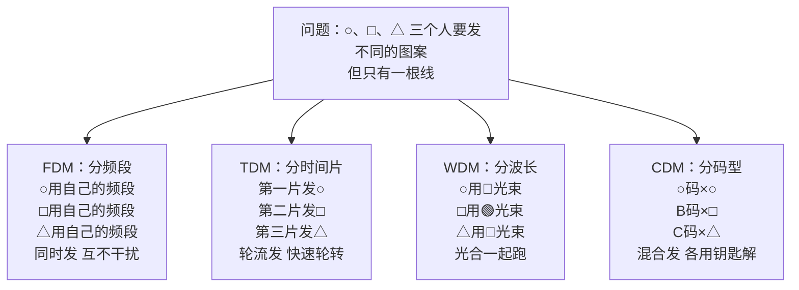

*四种复用方式解决的是同一个问题——多人共享一根线。区别在于"分"的方式不同：分频率、分时间、分波长、分码型。*

---


**数据链路层重点**

**封装成帧、透明传输、差错检测**

- **封装成帧**：在原始数据前后添加帧头和帧尾，划定帧的边界，像把散信纸放进信封并封口。
- **透明传输**：如果数据里恰好出现与帧边界标志相同的比特组合，必须用转义字符处理，使接收方能恢复原数据，好比信中若出现“到此为止”的字眼，要加注“这是正文，不是真的结束”。
- **差错检测（CRC）**：通过多项式运算生成校验码，接收端检测比特是否在传输中翻转。CRC能高效查出错误，但不纠错，只报警。

**共享式以太网（3.4）**

**网络适配器和MAC地址**

- **网络适配器（网卡）**：连接计算机和网络的接口设备，负责成帧、MAC寻址和介质访问控制。
- **MAC地址**：48位全球唯一的硬件地址，固化在网卡ROM中，用于数据链路层寻址，常表示为六组十六进制数（如 00:1A:2B:3C:4D:5E）。可以比喻为每个网络设备的“身份证号”，只在本网段内有效。

**CSMA/CD 协议（含 CRC 差错检测）**

- 为什么出现：早期总线型以太网共享同一条同轴电缆，多台机器同时发数据必然碰撞。
- 干什么：**先听后说，边听边说，冲突则停，随机后退再发。**
  - 载波监听：发之前先检测线路上是否有信号。
  - 碰撞检测：发送的同时继续监听，一旦发现信号叠加畸变（碰撞），立即停发。
  - 退避算法：碰撞后各自随机等待一段时间再尝试重发。
- CRC负责检测碰撞或被干扰导致的错误，发现错误帧直接丢弃。
- 优点：实现简单，适合早期总线网络。
- 缺点：在网络负载高时碰撞频繁，有效吞吐量下降严重。

**主机 A 向主机 B 发送数据的完整 5 步流程**

假设 A 和 B 在同一根总线（集线器）上：

```
第 1 步：侦听
A 想发数据，先听线路上有没有信号。
→ 有信号 → 继续侦听，直到线路空闲
→ 没信号（信道空闲）→ 进入第 2 步

第 2 步：发送 + 边发边听
A 开始发送数据帧，同时持续监视线路上的电压。
→ 电压正常（没碰撞）→ 继续发，直到发完 → 成功
→ 电压异常升高（碰撞！）→ 立即停发，进入第 3 步

第 3 步：强化冲突
A 发送一个短暂的 jam 信号（32 位），通知总线上其他站点"刚才撞车了"。

第 4 步：随机退避
A 执行"截断二进制指数退避"算法，算出一个随机等待时间，暂停发送。

第 5 步：重试
等待结束后，回到第 1 步重新侦听发送。
若重试次数达到 16 次 → 放弃发送，向上层报错。
```

**随机退避时间是怎么算的？**

碰撞后等待的时间不是随便拍脑袋，而是遵循一个公式：

```
退避时间 = 随机整数 r × 争用期（51.2μs）

随机整数 r 的范围：0 到 (2ᵏ - 1)，其中 k = min(重试次数, 10)
```

- 第 1 次碰撞：k = 1，r ∈ [0, 1] → 要么不等（0），要么等 51.2μs
- 第 2 次碰撞：k = 2，r ∈ [0, 3] → 等 0 / 51.2 / 102.4 / 153.6 μs
- 第 3 次碰撞：k = 3，r ∈ [0, 7] → 最多等 7 × 51.2 = 358.4 μs
- ...
- 第 10 次及之后：k 停在第 10，r ∈ [0, 1023]，但重试次数继续累加直到 16

> 这就是"截断二进制指数退避"这个名字的由来——等待时间随着碰撞次数翻倍增大，碰撞越频繁等得越久，这样可以缓解网络拥塞。

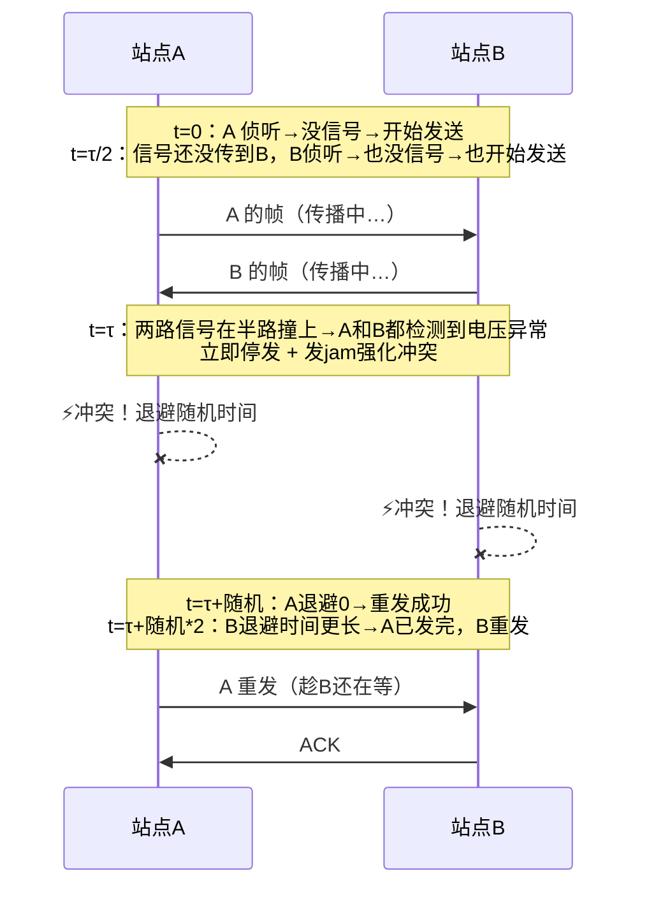

*核心理解：CD（碰撞检测）的精髓——嘴说话的时候耳朵还竖着，一听见撞车立刻闭嘴。*

**使用集线器的共享式以太网 & 在物理层扩展以太网**

- **集线器（Hub）**：物理层设备，收到一个端口的比特信号后，简单复制并转发到其他所有端口。用集线器连接起来的所有主机处于同一个**碰撞域**，仍然共享带宽，工作机制还是CSMA/CD。
- **在物理层扩展**：通过集线器级联或光纤调制解调器延长传输距离，但不隔离碰撞域。相当于把同一条总线拉得更长或增加更多接头，碰撞机会反而增大。

**在数据链路层扩展以太网**

- **网桥/交换机**：工作在数据链路层，能根据MAC地址做出转发决策，将网络划分成更小的碰撞域。相比Hub，交换机让每个端口基本成为独立碰撞域，大幅减少碰撞。网桥和交换机可以根据MAC地址表有选择地转发帧，如果目的地址在同一端口侧则不转发到其他端口。

**交换式以太网（3.5）**

**以太网交换机**

- 干什么：本质是多端口网桥，能够自学习源MAC地址，建立转发表，根据目的MAC地址精准转发帧，支持多个端口同时并行通信。
- 工作方式：存储转发或直通交换。
- 优点：每个端口独享带宽，无碰撞（全双工模式下），能隔离碰撞域。

**共享式以太网与交换式以太网的对比**

- 共享式：用集线器，半双工，带宽大家分，随时可能碰撞，核心协议是CSMA/CD。
- 交换式：用交换机，可全双工，端口带宽独享，不需要CSMA/CD（在全双工时无碰撞），效率高很多。

比喻：共享式像对讲机群聊，一次只能一个人说；交换式像电话交换机，两两可以同时通话且互不干扰。

**虚拟局域网 VLAN（3.7）**

- **为什么需要**：一个物理交换机上接了不同部门的电脑，如果不隔开，所有机器都在同一个广播域，广播包泛滥且安全无隔离。
- **概述**：VLAN通过逻辑划分，将一个物理局域网分割成多个相互隔离的虚拟局域网，每个VLAN是一个独立的广播域。
- **实现机制**：
  - 基于端口的VLAN：最常用。将交换机某些端口划归VLAN 10，另一些划归VLAN 20，端口间的转发只限同一VLAN。
  - 基于MAC地址的VLAN：按网卡地址决定归属。
  - 跨交换机的VLAN：用**802.1Q标签**在帧头插入VLAN ID，实现跨交换机的VLAN透传。Trunk端口承载多个VLAN流量。
- 优点：提高安全性，隔离广播，灵活管理。

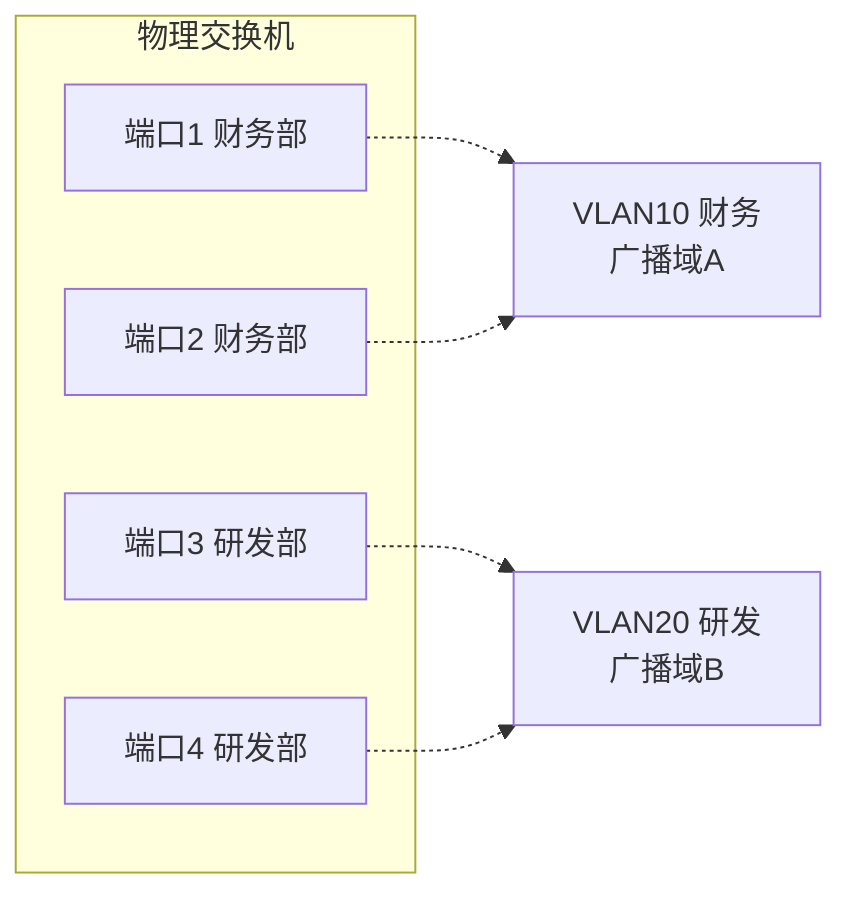

*同一个物理交换机，端口1/2 组成 VLAN10，端口3/4 组成 VLAN20——虽然插在同一台机器上，但广播包只在各自的 VLAN 内传播，互不干扰。*

**STP 生成树协议**

- 问题：交换机之间冗余连接形成环路，造成广播风暴和MAC表震荡。
- 干什么：自动阻塞部分冗余链路，将网络物理拓扑裁剪成无环的逻辑树形结构。
- 过程：选举根桥，然后每个交换机确定到根的最短路径，阻塞其他冗余端口。
- 优点：消除环路，自动切换备用链路。缺点：部分链路闲置，浪费带宽。

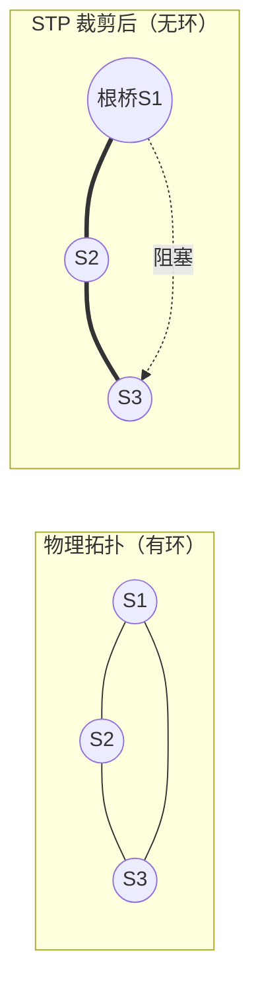

*左：三台交换机物理上连成环→广播风暴。右：STP 选举 S1 为根桥，阻塞 S1-S3 之间的冗余链路，逻辑上变回无环树。备用链路被阻塞但始终在线，一旦主干断就自动激活。*

---

**传输层可靠传输基础（停等、GBN、SR）**

*这些协议思想同样适用于链路层和传输层。*

- **停止等待**：发一个包→等确认→再发下一个。优点：最简单。缺点：信道利用率极低，大量时间在等待。
- **GBN 后退N帧**：连续发送窗口内的多个包，一旦某个包出错，从出错包开始重传后续所有包。实现较简单，但错误时重传量大，浪费带宽。
- **SR 选择重传**：只重传出错的那些包，缓存正确收到的后续包。效率最高，但接收方需要缓冲且需更多处理。

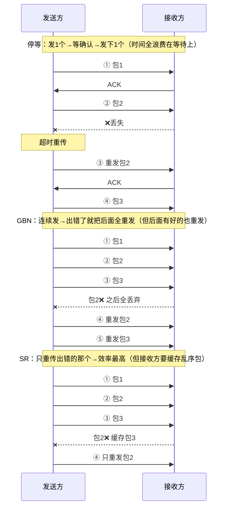

---

**网络层核心（第4章）**

**网络层两种服务**

- **虚电路服务**：类似电话网络，通信前先建立逻辑连接路径，分组沿同一路由顺序到达。适合需保证质量的场景，但网络复杂时不太灵活。
- **数据报服务**：互联网采用的方式。每个分组独立选路，可能走不同路径，不保证顺序和时限。网络结构简单，健壮性强，就像每封信独立走邮路，可能先后顺序错乱，但邮局本身不需为每对通信者维护状态。

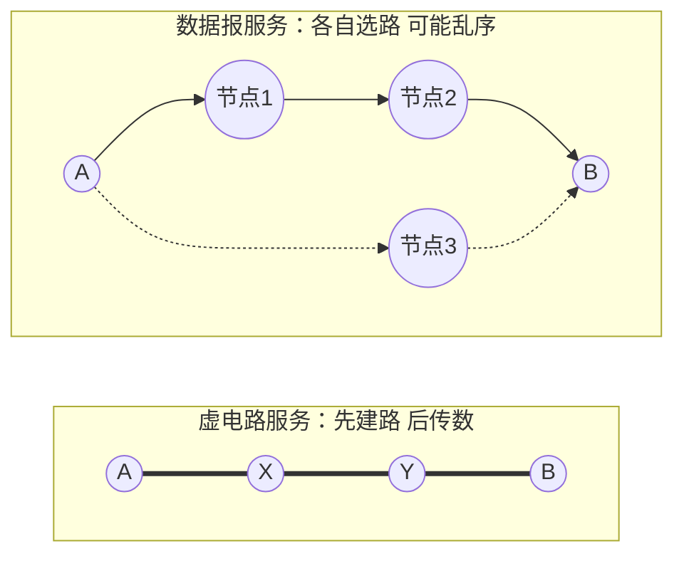

*虚电路=固定的路（像火车轨道），数据报=各自找路（像快递，每件走不同路线）。互联网选择了数据报——简单、健壮。*

**IPv4地址及编址方法（核心）**

**IP 地址是什么？**

IP 地址是网络层的"门牌号"，总共 32 位二进制（比如 `11000000.10101000.00000000.00000001`），为了方便人类读写，写成点分十进制 `192.168.0.1`。

一个 IP 地址分两半：**网络号**（你在哪个小区）+ **主机号**（你家是哪栋）。小区内的设备靠 MAC 地址找，跨小区的数据就靠 IP 地址的网络号来找。

**早期办法：分类编址（A/B/C 类）**

早期一刀切：网络号固定长度——A类8位，B类16位，C类24位。问题在于太死板：一个学校需要 1000 个地址，C 类太小（256个），B 类又太大（65536个），浪费严重。

于是有了 CIDR。

**CIDR 无分类编址（现在的做法）**

CIDR 的核心思想：**不再固定在 A/B/C 类，前缀想划多少位就划多少位**，用斜线记法 /N 表示前 N 位是网络号。

```
192.168.0.0/24  → 前 24 位是网络号，后 8 位是主机号（传统 C 类大小）
192.168.0.0/18  → 前 18 位是网络号，后 14 位是主机号（比 C 类大 64 倍）
```

> 好比以前只能买"小号 (C)"或"大号 (B)"两种尺码的衣服，CIDR 允许你任意定制——想要多大就多大。

**子网划分与借位**

子网划分要解决的是：**分给你的一个地址块太大了，怎么再切成更小的块分给不同部门？**

方法：从"主机号"部分借几位出来当作"子网号"，把一个大网络切成多个小网络。

```
原始 /24： 192.168.1.0 | 00000000     ← 网络号 24 位，主机号 8 位
借 2 位：  192.168.1.00 | 000000      ← 网络号变成 26 位，主机号剩 6 位
```

借 2 位 → 子网号有 2² = 4 种组合（00/01/10/11）→ 切成 4 个子网，每个子网的主机数 = 2⁶ - 2 = 62 台。

关键公式：
- 借 n 位 → 子网数 = **2ⁿ**
- 剩余主机位 m 位 → 每个子网可用主机数 = **2ᵐ - 2**（减 2 是因为去掉网络地址和广播地址）

> 借位好比你把公司一层的办公室（一个大网），用隔板分成 4 个小房间（子网），每个房间里的工位（主机位）就变少了。

**IPv4地址与MAC地址**

IP 地址和 MAC 地址各管一摊，分工不同：

- **IP 地址**：网络层使用，跨网络寻址。数据包从源主机到目的主机，源 IP 和目的 IP **全程不变**。
- **MAC 地址**：数据链路层使用，同一局域网上找设备。每经过一个路由器，源 MAC 和目的 MAC **都要换**。

> 可以这样理解：IP 地址是你的**最终收件地址**（北京市海淀区xx路xx号），MAC 地址是**快递员手上有你的门牌信息**。包裹每到一个中转站，中转站会换上新的"内部送件地址"，但最终收件地址始终不变。

**ARP 地址解析协议**

- 干什么：已知目标IP地址，求下一跳接口的MAC地址。
- 工作过程：主机在局域网内广播ARP请求（“谁是192.168.1.1？告诉你的MAC给我”），目标主机单播ARP响应。得到映射关系后缓存到ARP表。

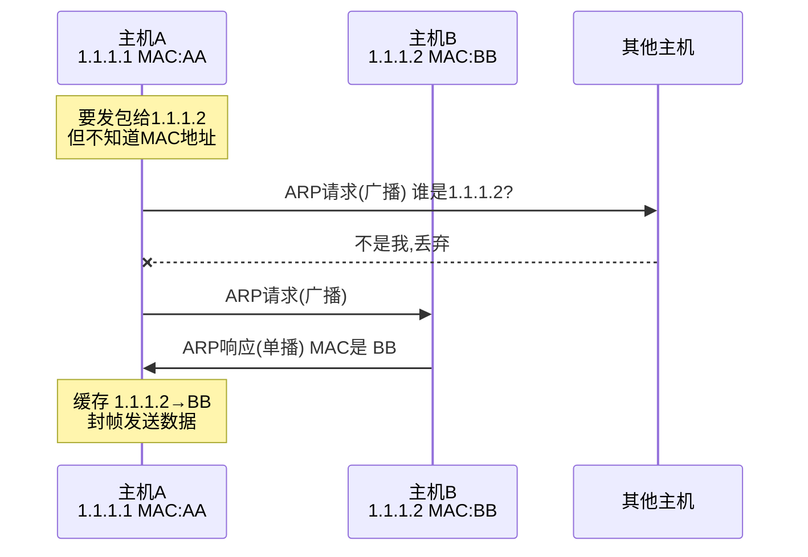

**IP数据报的首部格式**

- 干什么：承载网络层控制信息。重要字段：版本（IPv4）、首部长度、服务类型、总长度、标识、标志、片偏移（用于分片重组）、生存时间TTL（防兜圈）、协议（上层协议TCP/UDP）、首部校验和、源地址、目的地址。TTL每经过一个路由器减1，减到0则丢弃。

**IP数据报的发送和转发过程**

- 主机发送：判断目的IP是否同网段。同网段则直接交付（用ARP获得目的MAC）；不同网段则发给默认网关（路由器）。
- 路由器转发：收到数据报，根据路由表查找匹配项，选择下一跳接口，封装新帧头（新MAC地址），转发出去。

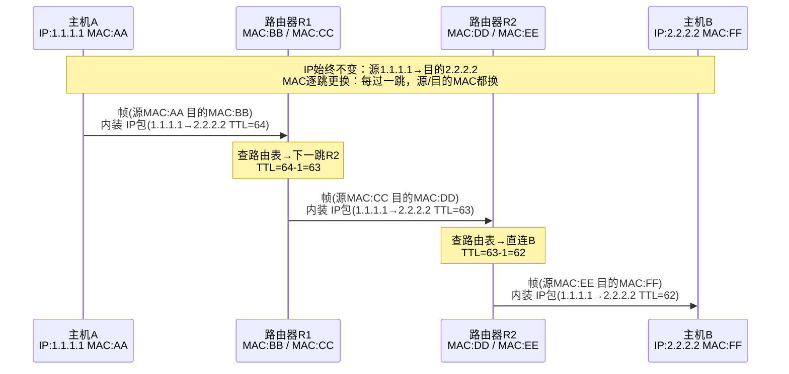

*核心理解：IP地址是"最终地址"全程不变；MAC地址是"下一跳地址"每跳都换。*

**路由器的基本工作原理**

路由器有三个核心环节：
1. **解封装**：收到帧后，拆掉帧头和帧尾，检查 IP 数据报的 TTL 和目的 IP
2. **查表转发**：用目的 IP 匹配路由表（最长前缀匹配），找到下一跳接口
3. **重新封装**：TTL 减 1，换上新的源/目的 MAC 地址，从匹配接口转发出去

> 路由器就像一个交通枢纽：快递到了（解封装），看地址找对应出口（查表），重新装车发出去（重新封装）。

**静态路由配置**

- **直连路由**：路由器接口所在网络自动加入路由表，无需配置。
- **非直连路由**：目的网络不直接与路由器相连，需要手工添加静态路由或通过动态路由协议学习。
- **默认路由**：0.0.0.0/0 匹配所有目的地址，当路由表找不到更具体匹配项时使用，常配置指向出口网关。
- **特定主机路由**：为单个主机IP指定专门路由，用于特殊情况测试或安全策略。
- 实操：在路由器接口配置IP并开启，使用 `ip route 目标网络 掩码 下一跳` 添加静态路由。

**动态路由协议 RIP 与 OSPF**

- **RIP 路由信息协议**：基于距离向量的内部网关协议，用跳数做度量，最大15跳。算法简单，通过周期性广播路由表学习。缺点是收敛慢，不适合大型网络。像邻居之间互相告知“我家到某地只需X步”，逐渐摸清全局。
- **OSPF 开放最短路径优先**：基于链路状态的内部网关协议，使用最短路径优先算法（Dijkstra）。每台路由器维护整个网络的拓扑数据库，计算以自己为根的最优树。收敛快、支持分层区域划分，适用于大型网络。像每个人都拿到一张城市地图，根据路况自己算最佳路径。

- **OSPF 开放最短路径优先**：基于链路状态的内部网关协议，使用最短路径优先算法（Dijkstra）。每台路由器维护整个网络的拓扑数据库，计算以自己为根的最优树。收敛快、支持分层区域划分，适用于大型网络。像每个人都拿到一张城市地图，根据路况自己算最佳路径。
- **BGP 边界网关协议**：不同自治系统（AS）之间的路由协议，属于外部网关协议（EGP）。BGP 不以"跳数最少"为目标，而是根据**路由策略**（如政治、经济、安全因素）选择路径。像国与国之间的外交路线——不一定走最近的路，但走最"合法"的路。
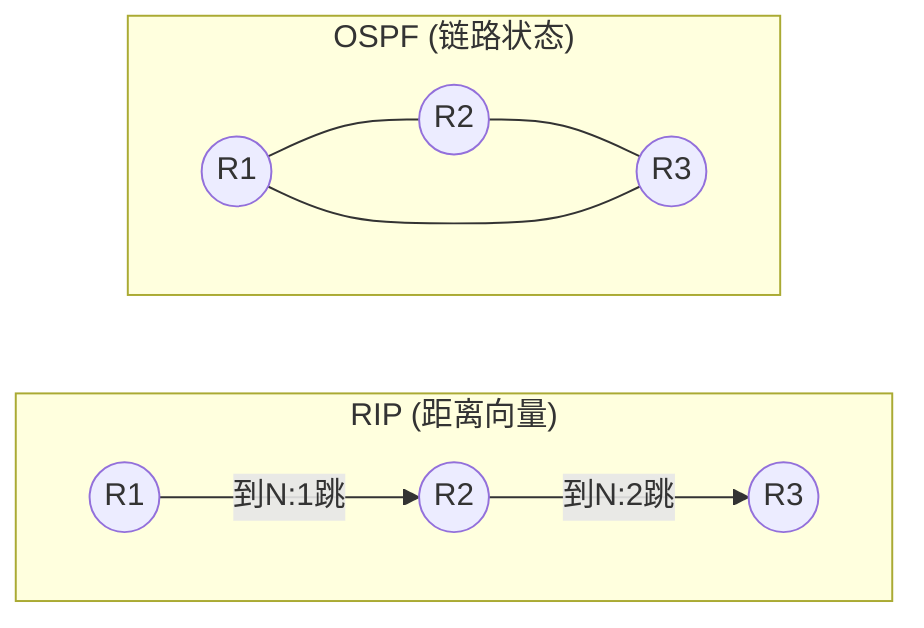

*RIP：邻居之间互相传"我到某网几步"（基于传闻，收敛慢，最多15跳）→ OSPF：每人拿到全局拓扑图，自己算最短路径（Dijkstra，收敛快，适合大网）*

---

**传输层（第5章）**

**运输层概述：进程间通信**

运输层位于网络层之上，解决的问题是：**网络层把数据包送到主机后，主机该把它交给哪个应用程序？** 答案是**端口号**。

- **复用**：发送方多个应用进程（浏览器、微信、邮件）都能通过同一个运输层协议把数据发出去
- **分用**：接收方收到数据后，根据 TCP/UDP 报文头里的**目的端口号**，把数据准确交给对应的应用程序
- 常见端口号：HTTP=80, HTTPS=443, DNS=53, SMTP=25, FTP=21

> 好比一栋楼的收发室：网络层负责把快递送到楼门口（主机），运输层负责根据房间号（端口号）把快递送到具体房间（进程）。

**UDP 与 TCP 全面对比**

| 对比项 | TCP | UDP |
| --- | --- | --- |
| 连接 | 面向连接（三次握手建立） | 无连接，直接发送 |
| 可靠性 | 可靠，保证顺序、无丢失、无重复 | 不可靠，尽力交付 |
| 流量/拥塞控制 | 有（滑动窗口、重传、拥塞控制） | 无，应用层自行处理 |
| 首部开销 | 20~60字节 | 8字节 |
| 传输效率 | 较低，因确认、重传等机制 | 高，实时性好 |
| 适用场景 | 文件传输、网页、邮件 | 视频直播、语音通话、DNS、DHCP |

比喻：TCP像打电话，先拨通确认对方在听，说话内容按顺序保证传到；UDP像寄明信片，塞进邮箱就不管了，可能丢失或乱序，但轻便快捷。

**TCP 报文段的首部格式**

TCP 报文段的首部至少 20 字节，核心字段包括：
- **源端口/目的端口**（各2字节）：标识发送方和接收方的进程
- **序号 seq**（4字节）：本报文段数据的第一个字节的序号，用于按序重组
- **确认号 ack**（4字节）：期望收到的下一个字节序号，表示之前的数据已全部收到
- **数据偏移**（4位）：TCP头部的长度
- **标志位**（各1位）：URG/ACK/PSH/RST/SYN/FIN——SYN 用来建立连接，FIN 用来释放连接，ACK 表示确认号有效
- **窗口**（2字节）：接收方告诉发送方自己还能收多少数据（流量控制）
- **校验和**（2字节）：检查数据有没有损坏

> TCP 头部可以理解为快递单——有发件人地址（源端口）、收件人地址（目的端口）、包裹编号（序号）和备注栏（标志位）。

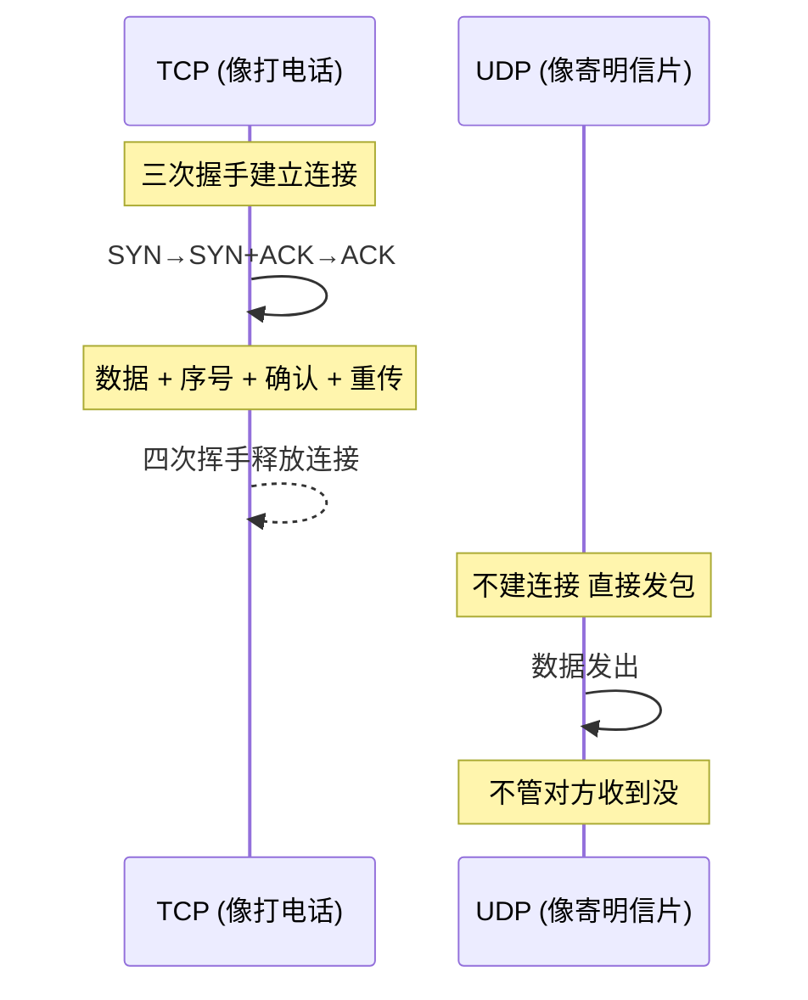

**TCP 三次握手建立连接**

- 目的：同步序列号，确保双方收发能力正常。
- 过程：
  ```mermaid
  sequenceDiagram
      客户端->>服务器: SYN, seq=x
      服务器->>客户端: SYN+ACK, seq=y, ack=x+1
      客户端->>服务器: ACK, ack=y+1
  ```
  三次后两端都确认自己和对方能正常收发。

**TCP 四次挥手释放连接**

- 原因：TCP是全双工的，每个方向需单独关闭。
- 过程：
  ```mermaid
  sequenceDiagram
      A->>B: FIN, seq=u
      B->>A: ACK, ack=u+1
      B->>A: FIN, seq=v
      A->>B: ACK, ack=v+1
  ```
  FIN发起方进入TIME_WAIT等待2MSL，确保最后的ACK能到达。

**TCP 可靠传输核心：重传机制**

- 干什么：保证数据块无差错、不丢失、按序到达。
- **超时重传**：每发送一个报文段启动一个计时器，若在超时时间RTO内未收到确认，就重传。RTO需根据RTT动态估算——RTT 波动大时 RTO 也相应调整，防止不必要的重传。
- **快速重传**：发送方收到3个相同的冗余ACK（表明接收方缺失了某个段）时，立即重传缺失的段，不用等超时，提高效率。
- **选择确认 SACK**：接收方可以告诉发送方"我收到了哪些数据，缺了哪些"，让发送方只重传缺失的部分，而不是把后面的全重传。
- 配合**滑动窗口**实现流量控制，**拥塞控制**算法（慢启动、拥塞避免、快速恢复）则防止网络负担过重。

---

**应用层（第6章）重点小节**

**DHCP 动态主机配置协议**

- **作用**：让主机自动获取IP地址、子网掩码、默认网关、DNS服务器等配置，免去手工设置。
- **工作过程**（简化为发现、提供、请求、确认四个阶段）：
  ```mermaid
  sequenceDiagram
      客户端->>服务器: DHCP DISCOVER (广播)
      服务器->>客户端: DHCP OFFER
      客户端->>服务器: DHCP REQUEST (选择某个提供)
      服务器->>客户端: DHCP ACK (确认租约)
  ```
  像入住酒店时前台自动分配房间号和wifi信息。

**DNS 域名系统**

- **作用**：将人类易记的域名（www.example.com）转换为机器可读的IP地址。
- **域名结构**：层次树状，从根域、顶级域（.com, .cn）、二级域一直到主机。
- **域名服务器**：根域名服务器、顶级域名服务器、权威域名服务器等，分级协作。
- **解析过程**：递归查询与迭代查询结合。本机先查缓存，若无则向本地DNS查询，本地DNS替客户端完成后续逐级查询。

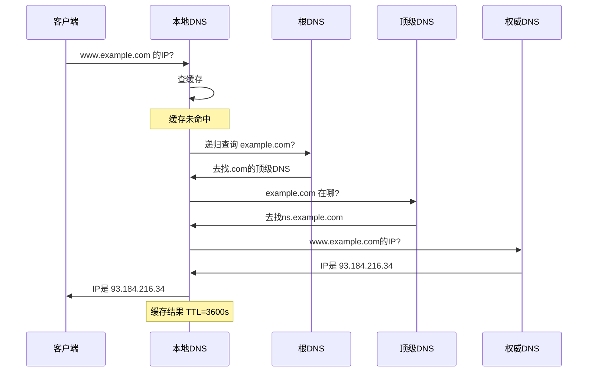
- **高速缓存**：各级DNS都会缓存解析结果，减少全网查询次数，提高响应速度。缓存有TTL限制，过期刷新。

**电子邮件系统**

- **组成**：用户代理（收发邮件的客户端）、邮件服务器、邮件传输协议。
- **SMTP**：用于发送邮件，或邮件服务器之间的转发。采用推的方式，命令/响应式交互。
- **邮件信息格式**：信封（传输信息）和内容（RFC 5322定义的首部+正文）。
- **MIME**：扩展邮件格式，使其支持非ASCII文本、图片、音频、附件等。
- **POP3**：从邮件服务器把邮件下载到本地，通常下载后服务器端删除。
- **IMAP4**：管理服务器上的邮件，可在线阅读、标记、多设备同步，不删除服务器副本。
- **基于万维网的电子邮件**：通过浏览器用HTTP收发邮件，后台邮件服务器之间仍用SMTP。

比喻：传统邮件系统，SMTP是邮局的转送卡车，POP3/IMAP是收件人收取信件的方式（取回家 vs 在邮箱管理）。

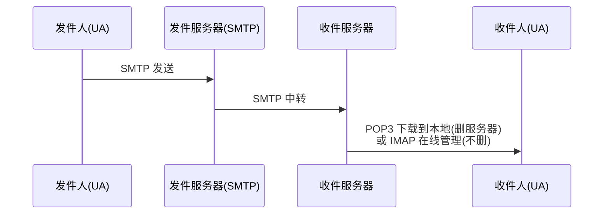

**万维网 WWW**

- **URL 统一资源定位符**：<协议>://<主机>:<端口>/<路径>，唯一标识网络资源位置。
- **HTTP 超文本传输协议**：万维网应用层协议，基于TCP，通常使用80端口。无状态协议。
- **Cookie 机制**：为弥补HTTP无状态，服务器在客户端存储小文本文件，用于会话保持、用户跟踪，像餐馆给顾客的号码牌，便于下次识别。
- **万维网缓存与代理服务器**：代理服务器位于客户端与服务器之间，缓存经常访问的网页。用户请求时先查代理缓存，命中则直接返回，减少网络带宽和延迟。像小区里的快递驿站代收常见包裹。

---

最后，整个网络的分层逻辑主线依然是最核心的：

**物理层** 负责将比特转换成物理信号传过去  
→ **数据链路层** 负责相邻节点间可靠/有效的帧传输  
→ **网络层** 负责跨网络选路和转发  
→ **运输层** 负责进程到进程的可靠/实时通信  
→ **应用层** 向用户提供具体网络服务

考试大题基本都沿着这条主线展开，你可以在脑海中用这一串流程把各知识点串起来。


---


---

# 老师布置的作业

**作业1：无分类编址CIDR计算**
给定的无分类编址的IPv4地址为206.0.64.8/18，请分别求出：
1. 地址块中的最小地址
2. 地址块中的最大地址
3. 地址块中的地址数量
4. 地址块中聚合某类网络（A类、B类、C类）的数量
5. 地址掩码

> 已知地址：206.0.64.8/18
> 其中 `/18` 表示网络号占18位，主机号占32−18=14位。

> 第一步：求地址掩码
> `/18` 表示前18位全为1，后14位全为0。
> 写成二进制：
>
> $$
> 11111111.11111111.11000000.00000000
> $$
>
> 每8位转换成十进制：
>
> * 11111111 = 255
> * 11111111 = 255
> * 11000000 = 192
> * 00000000 = 0
>
> 所以地址掩码为：
>
> $$
> 255.255.192.0
> $$

> 第二步：求最小地址（网络地址）
> 方法：IP地址 与 地址掩码进行按位与运算。
>
> 原IP地址：
>
> $$
> 206.0.64.8
> $$
>
> 转换成二进制：
>
> $$
> 11001110.00000000.01000000.00001000
> $$
>
> 掩码二进制：
>
> $$
> 11111111.11111111.11000000.00000000
> $$
>
> 进行按位与运算：
>
> $$
> 11001110.00000000.01000000.00001000
> $$
>
> $$
> \land
> $$
>
> $$
> 11111111.11111111.11000000.00000000
> $$
>
> 得到：
>
> $$
> 11001110.00000000.01000000.00000000
> $$
>
> 转换成十进制：
>
> $$
> 206.0.64.0
> $$
>
> 所以最小地址（网络地址）为：
>
> $$
> 206.0.64.0
> $$

> 第三步：求最大地址（广播地址）
> 方法：把主机号部分全部变成1。
>
> `/18` 说明：
>
> * 前18位固定为网络位
> * 后14位全部改成1
>
> 网络地址二进制：
>
> $$
> 11001110.00000000.01000000.00000000
> $$
>
> 后14位改成1：
>
> $$
> 11001110.00000000.01111111.11111111
> $$
>
> 转换成十进制：
>
> $$
> 206.0.127.255
> $$
>
> 所以最大地址（广播地址）为：
>
> $$
> 206.0.127.255
> $$

> 第四步：求地址数量
> IPv4总共32位。
> 主机位数量：
>
> $$
> 32-18=14
> $$
>
> 地址总数量公式：
>
> $$
> 2^{主机位数}
> $$
>
> 代入：
>
> 2^{14}=16384
>
> 所以地址块中的地址数量为：
>
> $$
> 16384
> $$

> 第五步：求聚合的A类、B类、C类网络数量
>
> **核心概念："聚合"的意思是这个 /18 地址块里，能完整装下多少个不同类别的网络。**
>
> 先列出各类网络的"大小"——前缀数字越小，网络越大：
>
> | 类别 | 默认前缀 | 含义 | 地址数 |
> |:---|:---|:---|:---|
> | A类 | /8 | 前 8 位是网络号 | 2²⁴ ≈ 1677 万 |
> | B类 | /16 | 前 16 位是网络号 | 2¹⁶ = 65536 |
> | C类 | /24 | 前 24 位是网络号 | 2⁸ = 256 |
> | **本题地址块** | **/18** | **前 18 位是网络号** | **2¹⁴ = 16384** |
>
> 现在拿本题的 /18 块跟每种类型比大小：
>
> **（1）能不能聚合 A 类？— 0**
>
> A 类网络是 /8，包含 1677 万个地址。本题 /18 只有 16384 个地址。
>
> 用一个 16384 的小容器去"装"一个 1677 万的大容器 → 装不下。
>
> 所以：**0 个**。
>
> **（2）能不能聚合 B 类？— 0**
>
> B 类网络是 /16，包含 65536 个地址。本题 /18 只有 16384 个。
>
> 同样，16384 < 65536 → 一个完整的 B 类网络都装不下。
>
> 这道题的地址块恰好落在 `206.0.0.0/16` 这个 B 类范围内，但它只占其中 1/4，不是完整 B 类。
>
> 所以：**0 个**。
>
> **（3）能不能聚合 C 类？— 64**
>
> C 类网络是 /24，每个只有 256 个地址。本题 /18 有 16384 个地址，比 C 类大得多。
>
> 所以能装下很多个 C 类。多少个？用公式：
>
> $$
> \text{数量} = 2^{\,(\text{C类前缀} - \text{本题前缀})}
> = 2^{\,24-18}
> = 2^{6}
> = 64
> $$
>
> **为什么要这样算？** 因为每增加 1 位前缀，地址块就"切成两半"（容量减半）；反之每减少 1 位，容量翻倍。从 /24 到 /18，前缀减少了 6 位，容量翻了 2⁶ = 64 倍。所以一个 /18 块恰好等于 64 个 /24 块。
>
> 所以：**64 个 C 类网络**。


> 最终答案汇总：
>
> 1. 最小地址：
>
> $$
> 206.0.64.0
> $$
>
> 2. 最大地址：
>
> $$
> 206.0.127.255
> $$
>
> 3. 地址数量：
>
> $$
> 16384
> $$
>
> 4. 聚合网络数量：
>
> * A类：0
>
> * B类：0
>
> * C类：64
>
> 5. 地址掩码：
>
> $$
> 255.255.192.0
> $$


**作业2：IPv4地址应用规划（定长+变长子网掩码）**
假设地址块为192.168.252.0/24，请分别使用定长子网掩码和变长子网掩码给下图所示的小型互联网中的各设备分配IP地址：
- 网络1：60台主机
- 网络2：20台主机
- 网络3：10台主机
- 网络4：路由器间链路（2台设备）
> 已知地址块：
>
> $$
> 192.168.252.0/24
> $$
>
> `/24` 表示：
>
> * 网络号24位
> * 主机号8位
>
> 总地址数量：
>
> 2^8=256
>
> 即：
>
> $$
> 192.168.252.0 \sim 192.168.252.255
> $$

---

> 一、定长子网掩码（FLSM）划分
>
> **核心**：所有子网掩码相同。以最大子网（60台）为准，选一个能装下它的最小掩码。
>
> ---
>
> **第一步：确定子网掩码**
>
> ```
> 2^n - 2 ≥ 60
> 2^5 - 2 = 30  ❌ 不够
> 2^6 - 2 = 62  ✅ 刚好
> → 主机位 n = 6 → 前缀 = 32 - 6 = /26
> ```
>
> 把地址写成二进制，`|` 左边是网络位（借了 2 位子网号），右边是主机位：
>
> ```
> 192.168.252 . 0 0 0 0 0 0 0 0
>             |   子网(2)   |主机(6)|
>             └─ 借位 → /26 ─┘
> ```
>
> 掩码：`11111111.11111111.11111111.11|000000` = **255.255.255.192**
>
> ---
>
> **第二步：4 个子网的二进制推导**
>
> 借 2 位子网位，共 `2² = 4` 个子网号（00/01/10/11），每个子网 64 个地址。
>
> | 子网号 | 最后一个字节(二进制) | 网络地址 | 广播地址 | 可用范围 |
> |:---|:---|:---|:---|:---|
> | 00 | `00\|000000` | **.0** | **.63** | .1 ~ .62 |
> | 01 | `01\|000000` | **.64** | **.127** | .65 ~ .126 |
> | 10 | `10\|000000` | **.128** | **.191** | .129 ~ .190 |
> | 11 | `11\|000000` | **.192** | **.255** | .193 ~ .254 |
>
> *规律：网络地址 = 子网号 × 64，广播 = 网络地址 + 63*
>
> ---
>
> **第三步：分配结果**
>
> | 子网 | 网络地址 | 可用范围 | 广播地址 | 掩码 | 浪费 |
> |:---|:---|:---|:---|:---|:---|
> | 网络1(60台) | 192.168.252.0 | .1 ~ .62 | .63 | /26 | 2 |
> | 网络2(20台) | 192.168.252.64 | .65 ~ .126 | .127 | /26 | 42 |
> | 网络3(10台) | 192.168.252.128 | .129 ~ .190 | .191 | /26 | 52 |
> | 网络4(2台) | 192.168.252.192 | .193 ~ .254 | .255 | /26 | 60 |
>
> FLSM 的本质：选一个"最大号"统一尺码——网络1刚好，网络2/3/4太大，浪费严重。
---

---

> 二、变长子网掩码（VLSM）划分
>
> **核心**：不同子网用不同掩码——网络需要多少主机就分多大块，不像 FLSM 一视同仁。
>
> ---
>
> **第一步：为每个网络选定前缀**
>
> 从大到小排序，逐个适配：
>
> | 网络 | 需主机 | 2ⁿ−2 ≥ 需 | n | 前缀 | 块大小 |
> |:---|:---|:---|:---|:---|:---|
> | 网络1 | 60 | 2⁶−2=62 ✅ | 6 | **/26** | 64 |
> | 网络2 | 20 | 2⁵−2=30 ✅ | 5 | **/27** | 32 |
> | 网络3 | 10 | 2⁴−2=14 ✅ | 4 | **/28** | 16 |
> | 网络4 | 2 | 2²−2=2 ✅ | 2 | **/30** | 4 |
>
> ---
>
> **第二步：用二进制看顺序切分**
>
> 从 0 开始，每个子网依块大小连续占用。`|` 位置 = 每种子网的网络/主机分界。
>
> ```
>  192.168.252 . 0  0  0  0  0  0  0  0
>  网络1 /26   |     子网     |   主机    |    0  ~ 63   (64个)
>  网络2 /27   |      子网      |  主机   |    64 ~ 95   (32个)
>  网络3 /28   |       子网       | 主机  |    96 ~ 111  (16个)
>  网络4 /30   |         子网         |主|    112 ~ 115 (4个)
>  剩余未分配                                         116 ~ 255
> ```
>
> 二进制推导 —— 注意 `|` 位置不同（因为掩码不同）：
>
> ```
>  .00|000000  = 0    (网络1起始)        .00|111111  = 63   (网络1广播)
>  .010|00000  = 64   (网络2起始)        .010|11111  = 95   (网络2广播)
>  .0110|0000  = 96   (网络3起始)        .0110|1111  = 111  (网络3广播)
>  .01110|00   = 112  (网络4起始)        .01110|11   = 115  (网络4广播)
> ```
>
> ---
>
> **第三步：结果表**
>
> | 网络 | 前缀 | 网络地址 | 可用范围 | 广播地址 | 消耗 |
> |:---|:---|:---|:---|:---|:---|
> | 网络1 | /26 | 192.168.252.0 | .1 ~ .62 | .63 | 64 |
> | 网络2 | /27 | 192.168.252.64 | .65 ~ .94 | .95 | 32 |
> | 网络3 | /28 | 192.168.252.96 | .97 ~ .110 | .111 | 16 |
> | 网络4 | /30 | 192.168.252.112 | .113 ~ .114 | .115 | 4 |
> | **已用** | | | | | **116** |
> | **剩余** | | | | | **140** |
>
> ---
>
> **FLSM vs VLSM 一图对比**
>
> ```
>  FLSM (/26 统一):  [0=======63][64======127][128======191][192======255]  全用光
>  VLSM (混合掩码):  [0=======63][64====95][96===111][112115][116=== 255 空闲]
>                    网络1(60)   网络2(20) 网络3(10) 网4(2)   ← 省了140个!
> ```
>
> VLSM 的价值：同一张 /24，FLSM 只能搭 4 个等大子网且大量浪费；VLSM 按需分配，省下一半多留给未来。


**作业3：定长子网划分（表格填写）**
202.168.25.0/24，划分出4个子网，填写下表：

| 子网编号 | 网络地址 | 子网掩码 | 广播地址 | 最小可分配的地址 | 最大可分配的地址 |
|----------|----------|----------|----------|------------------|------------------|
| 1        |          |          |          |                  |                  |
| 2        |          |          |          |                  |                  |
| 3        |          |          |          |                  |                  |
| 4        |          |          |          |                  |                  |

> 已知网络：
>
> $$
> 202.168.25.0/24
> $$
>
> 要划分为4个子网。

> 第一步：用二进制看 /24 → /26 的借位
>
> 4 个子网 → 借 2 位子网号（2²=4）。原 /24 → 新 /26。
>
> ```
> 202.168.25 . 0 0 0 0 0 0 0 0
>           |   子网(2)   |主机(6)|
>           └─ 借位 → /26 ─┘
> ```
>
> 掩码：`11111111.11111111.11111111.11|000000` = **255.255.255.192**
>
> 第二步：4 个子网的二进制推导
>
> 每个子网 2⁶ = **64** 个地址。
>
> | 子网号 | 最后一个字节(二进制) | 网络地址 | 广播地址 | 可用范围 |
> |:---|:---|:---|:---|:---|
> | 00 | `00\|000000` | **202.168.25.0** | .63 | .1 ~ .62 |
> | 01 | `01\|000000` | **202.168.25.64** | .127 | .65 ~ .126 |
> | 10 | `10\|000000` | **202.168.25.128** | .191 | .129 ~ .190 |
> | 11 | `11\|000000` | **202.168.25.192** | .255 | .193 ~ .254 |
>
> 填入原表：
> 第四个字节按64递增：
>
> * 0
> * 64
> * 128
> * 192

> 表格填写如下：

| 子网编号 | 网络地址           | 子网掩码                  | 广播地址           | 最小可分配的地址       | 最大可分配的地址       |
| ---- | -------------- | --------------------- | -------------- | -------------- | -------------- |
| 1    | 202.168.25.0   | 255.255.255.192 (/26) | 202.168.25.63  | 202.168.25.1   | 202.168.25.62  |
| 2    | 202.168.25.64  | 255.255.255.192 (/26) | 202.168.25.127 | 202.168.25.65  | 202.168.25.126 |
| 3    | 202.168.25.128 | 255.255.255.192 (/26) | 202.168.25.191 | 202.168.25.129 | 202.168.25.190 |
| 4    | 202.168.25.192 | 255.255.255.192 (/26) | 202.168.25.255 | 202.168.25.193 | 202.168.25.254 |

> 验证规律：
>
> * 网络地址 = 0、64、128、192
> * 广播地址 = 下一个网络地址 − 1
> * 最小可分配地址 = 网络地址 + 1
> * 最大可分配地址 = 广播地址 − 1
>
> 考试时看到“/24划分4个子网”，直接记住：
>
> * 新前缀：/26
> * 步长：64
> * 网络地址：0、64、128、192
>
> 然后依次填写广播地址和主机地址范围即可。

---


---

# 计算机网络实验（华为 eNSP）常用命令汇总

按**实验模块+功能场景**分类整理，标注命令适用视图和核心用途，覆盖考试高频考点。

---

**零、设备基础管理命令（所有实验前置，必考）**

**系统信息与时间配置**

| 命令 | 适用视图 | 核心用途 |
|:---|:---|:---|
| `display version` | 用户视图`<Huawei>` | 查看设备型号、VRP版本、运行时间 |
| `display clock` | 用户视图 | 查看当前系统时间和时区 |
| `clock timezone 时区名 add 08:00:00` | 用户视图 | 设置中国时区（UTC+8），必须先设时区再设时间 |
| `clock datetime HH:MM:SS YYYY-MM-DD` | 用户视图 | 修改系统时间 |

**Console口配置（本地登录管理，高频）**

```
# 进入Console口视图
[R1]user-interface console 0
# 开启密码认证模式，设置密文密码
[R1-ui-console0]authentication-mode password
[R1-ui-console0]set authentication password cipher Huawei@123
# 设置空闲超时时间（默认10分钟）
[R1-ui-console0]idle-timeout 20 0
```

**VTY远程登录配置（Telnet，高频）**

```
# 进入VTY虚拟终端视图（0-4表示同时允许5个用户登录）
[R1]user-interface vty 0 4
# 设置密文登录密码和权限级别（15为最高管理员权限）
[R1-ui-vty0-4]set authentication password cipher Huawei@123
[R1-ui-vty0-4]user privilege level 15
# 查看登录用户
<R1>display users
```

**接口基础配置（补充）**

| 命令 | 适用视图 | 核心用途 |
|:---|:---|:---|
| `interface GigabitEthernet 0/0/0` | 系统视图 | 进入指定物理接口 |
| `ip address IP地址 子网掩码` | 接口视图 | 配置接口IP（支持简写如`24`等价`255.255.255.0`） |
| `description 接口描述` | 接口视图 | 添加接口备注，如`description Connect-to-R2` |
| `display interface g0/0/0` | 任意视图 | 查看接口详细状态（物理/协议状态、MAC、带宽） |
| `shutdown` / `undo shutdown` | 接口视图 | 关闭/开启接口 |

**配置文件管理（必考，区分当前/保存配置）**

| 命令 | 适用视图 | 核心用途 |
|:---|:---|:---|
| `display current-configuration` / `dis cu` | 任意视图 | 查看**当前运行的配置**（内存中，重启后丢失） |
| `display saved-configuration` | 任意视图 | 查看**已保存到闪存的配置**（重启后生效） |
| `save` | 用户视图 | 保存当前配置到闪存 |
| `display startup` | 任意视图 | 查看下次启动使用的系统软件和配置文件 |
| `reset saved-configuration` | 用户视图 | 删除闪存中的配置文件（恢复出厂，重启后生效） |
| `dir` | 用户视图 | 查看闪存中的所有文件 |
| `reboot` | 用户视图 | 重启设备（实验环境选`n`不保存，避免残留配置） |

**一、基础操作与通用测试命令（所有实验必用）**

| 命令 | 适用视图 | 核心用途 |
|:---|:---|:---|
| `system-view` / `sys` | 用户视图`<Huawei>` | 进入系统视图（所有配置的前提） |
| `quit` | 任意视图 | 退回上一级视图 |
| `return` / `Ctrl+Z` | 任意视图 | 直接退回用户视图 |
| `sysname 设备名` | 系统视图`[Huawei]` | 修改设备名称（如`sysname LSW1`） |
| `ping 目标IP地址` | 用户视图/系统视图 | 测试网络连通性 |
| `tracert 目标IP地址` | 用户视图/系统视图 | 追踪数据包传输路径 |
| `ipconfig` | PC/客户端命令行 | 查看PC的IP地址、子网掩码、MAC地址 |
| `arp -a` | PC/客户端命令行 | 查看PC的ARP缓存表 |
| `display this` | 任意视图 | 查看**当前视图下的所有配置**（最常用验证命令） |

**操作技巧（考试提速必备）**

- 命令简写：无歧义时可缩写，如 `display`→`dis`，`interface`→`int`，`GigabitEthernet`→`g`
- Tab 补全：输入命令前缀按 Tab 自动补全
- 问号帮助：输入 `?` 查看当前可用命令，输入 `命令 ?` 查看该命令的参数

**二、交换机MAC地址表管理命令（实验3）**

**基础查看命令**

| 命令 | 适用视图 | 核心用途 |
|:---|:---|:---|
| `display mac-address` | 任意视图 | 查看交换机完整MAC地址表（含动态/静态表项） |
| `display mac-address dynamic` | 任意视图 | 仅查看动态学习的MAC地址表项 |
| `display mac-address static` | 任意视图 | 仅查看手动配置的静态MAC地址表项 |

**静态MAC与端口绑定配置**

| 命令 | 适用视图 | 核心用途 |
|:---|:---|:---|
| `mac-address static 设备MAC地址 接口编号 vlan VLAN号` | 系统视图 | 配置静态MAC地址表项 |
| `undo mac-address static 设备MAC地址 接口编号 vlan VLAN号` | 系统视图 | 删除指定静态MAC地址表项 |
| `mac-address aging-time 秒数` | 系统视图 | 修改动态MAC表项老化时间（默认300秒） |

**三、VLAN基础配置命令（实验4）**

**VLAN创建与删除**

| 命令 | 适用视图 | 核心用途 |
|:---|:---|:---|
| `vlan VLAN号` | 系统视图 | 创建单个VLAN并进入VLAN视图 |
| `vlan batch VLAN号1 VLAN号2` | 系统视图 | 批量创建多个VLAN |
| `undo vlan VLAN号` | 系统视图 | 删除指定VLAN |

**Access端口配置（接入终端）**

```
interface GigabitEthernet 0/0/11
port link-type access
port default vlan 10
```

**Trunk端口配置（交换机间互联）**

```
interface GigabitEthernet 0/0/24
port link-type trunk
port trunk allow-pass vlan 10 30
```

**批量端口加入VLAN（考试高频）**

```
# VLAN视图下批量添加端口
vlan 40
port GigabitEthernet 0/0/17 to GigabitEthernet 0/0/20

# 端口组批量配置
port-group 1
group-member GigabitEthernet 0/0/17 to GigabitEthernet 0/0/20
port link-type access
port default vlan 40
```

**VLAN信息查看**

| 命令 | 适用视图 | 核心用途 |
|:---|:---|:---|
| `display vlan` | 任意视图 | 查看所有VLAN的配置及端口成员 |
| `display vlan VLAN号` | 任意视图 | 查看指定VLAN的详细信息 |
| `display port vlan` | 任意视图 | 查看所有端口的VLAN类型和所属VLAN |

**四、VLANIF接口配置命令（实验5，实现VLAN间三层通信）**

```
interface Vlanif 10
ip address 192.168.10.1 255.255.255.0
```

**补充查看命令**

| 命令 | 适用视图 | 核心用途 |
|:---|:---|:---|
| `display ip interface brief` | 任意视图 | 查看所有三层接口（VLANIF/物理口）的IP状态 |
| `display ip routing-table` | 任意视图 | 查看交换机/路由器的IP路由表 |

**五、静态路由与默认路由配置命令（实验6）**

**静态路由**

```
# ip route-static 目标网段 子网掩码 下一跳IP地址
ip route-static 192.168.80.0 255.255.255.0 192.168.101.2
```

**默认路由（未知网段统一转发）**

```
# ip route-static 0.0.0.0 0.0.0.0 下一跳IP地址
ip route-static 0.0.0.0 0.0.0.0 192.168.101.1
```

**Loopback接口（模拟远端网络）**

```
interface LoopBack 0
ip address 10.1.1.10 255.255.254.0
```

**六、OSPF动态路由配置命令（实验7，单区域OSPF）**

**基本配置**

```
ospf 1 router-id 172.16.101.1
area 0
network 172.16.101.0 0.0.0.255
network 10.1.10.0 0.0.0.255
# 注意：network后接**反掩码**（255.255.255.0的反掩码是0.0.0.255）
```

**OSPF状态查看（考试高频）**

| 命令 | 适用视图 | 核心用途 |
|:---|:---|:---|
| `display ospf peer` | 任意视图 | 查看OSPF邻居关系（验证邻居是否建立成功） |
| `display ospf routing` | 任意视图 | 查看OSPF学习到的路由条目 |
| `display ospf lsdb` | 任意视图 | 查看OSPF链路状态数据库（LSDB） |

**接口启停**

```
interface GigabitEthernet 0/0/0
shutdown
undo shutdown
```

**七、考试高频查看命令速查表（考前必背）**

| 需求 | 命令 |
|:---|:---|
| 查看设备版本和型号 | `display version` |
| 查看当前配置 | `display current-configuration` |
| 查看MAC地址表 | `display mac-address` |
| 查看VLAN配置 | `display vlan` |
| 查看路由表 | `display ip routing-table` |
| 查看接口IP状态 | `display ip interface brief` |
| 查看OSPF邻居 | `display ospf peer` |
| 查看接口详细信息 | `display interface g0/0/0` |

---

# 填空题与单选题（教材配套习题，含答案）

**第1章 概述**

**填空题**

1-01. 网络由若干节点和连接这些节点的(链路)组成,而互联网由若干网络和连接这些网络的(路由器)组成。

> **1-01** 
> 网络由若干节点和连接这些节点的**(链路)**组成,而互联网由若干网络和连接这些网络的**(路由器)**组成。
> 
> **解析**：可以把"网络"想象成一个小区内部的通道,节点就是各家各户,链路就是连接各户的小路。而"互联网"是把很多个这样的小区连接起来,连接不同小区的关卡和岔路口,就是路由器。所以网络内部靠链路,网络之间靠路由器。
>
> ---


1-02. 当今世界上最大的互联网是(因特网/Internet),使用(TCP/IP)协议族作为通信规则,其前身是美国国防部于1969年创建的第一个分组交换网(ARPANET)。

> **1-02**
> 当今世界上最大的互联网是**(因特网/Internet)**,使用**(TCP/IP)**协议族作为通信规则,其前身是美国国防部于1969年创建的第一个分组交换网**(ARPANET)**。
> 
> **解析**：因特网就是咱们天天用的那个全球互联网,它规定大家必须用同一套"语言规则"来交流,这套规则就是TCP/IP协议族。它的前身是美国军方搞的一个实验网叫ARPANET,这是因特网的鼻祖。
>
> ---


1-03. 因特网现已发展成基于(因特网服务提供者/ISP)的多层次结构的互连网络。

> **1-03**
> 因特网现已发展成基于**(因特网服务提供者/ISP)**的多层次结构的互连网络。
> 
> **解析**：ISP就是给你家拉网线、提供上网服务的公司(比如电信、移动)。现在的因特网就像一座金字塔,顶层是跨国大ISP,中间是区域ISP,底层是给普通用户提供接入的本地ISP,层层相连。
>
> ---


1-04. 因特网的标准化工作是面向公众的,其任何一个建议标准在成为因特网标准之前,都以(RFC)技术文档的形式在因特网上发表。

> **1-04**
> 因特网的标准化工作是面向公众的,其任何一个建议标准在成为因特网标准之前,都以**(RFC)**技术文档的形式在因特网上发表。
> 
> **解析**：RFC全称是"请求评论",可以理解为网络技术的"公开征求意见稿"。谁有好点子都可以写成RFC文档发到网上,大家一起来讨论、修改,觉得靠谱了才有可能变成正式标准。这个过程完全公开透明。
>
> ---


1-05. 从所实现的功能来简单划分因特网的组成,可分成(边缘)和(核心)两部分。

> **1-05**
> 从所实现的功能来简单划分因特网的组成,可分成**(边缘)**和**(核心)**两部分。
> 
> **解析**：把因特网想象成快递系统。"边缘部分"就是寄快递和收快递的用户(你家里的电脑、手机);"核心部分"就是快递公司的分拣中心和中转站(路由器、交换机),它们负责在中间传递,自己不寄件也不收件。
>
> ---


1-06. 三种交换方式包括电路交换､报文交换和(分组交换)。

> **1-06**
> 三种交换方式包括电路交换、报文交换和**(分组交换)**。
> 
> **解析**：这三种是数据在网络中传输的不同组织方式。电路交换像"包车道"——通话期间这条路归你专用。报文交换像"整包寄信"——整封信一站一站传。分组交换像"拆包裹"——把大数据切成小块,每块自己找路走,到目的地再拼起来。现在因特网用的就是分组交换。
>
> ---


1-07. 在电路交换中,建立连接的目的是(为通话双方建立通信资源)。

> **1-07**
> 在电路交换中,建立连接的目的是**(为通话双方建立通信资源)**。
> 
> **解析**：电路交换最典型的例子就是老式固定电话。你拨号之后,电话局要在你和对方之间"搭"一条实实在在的物理通路,这条路上的资源(带宽)在这通电话期间就归你俩专用,别人不能用。建立连接就是提前把这条路占上。
>
> ---


1-08. 对于传送突发式的计算机数据,分组交换比电路交换的(通信线路利用率)大大提高。

> **1-08**
> 对于传送突发式的计算机数据,分组交换比电路交换的**(通信线路利用率)**大大提高。
> 
> **解析**：计算机上网不像打电话那样一直有数据在传,往往是"一阵一阵"的(点开网页那一刻有数据,加载完就安静了)。电路交换独占线路,安静时资源白白浪费。分组交换则是"谁有数据谁占用",没数据时线路可以给别人用,线路利用率自然就高了。
>
> ---


1-09. 早在ARPANET的研制初期,就采用了基于(存储转发)技术的分组交换。

> **1-09**
> 早在ARPANET的研制初期,就采用了基于**(存储转发)**技术的分组交换。
> 
> **解析**："存储转发"就是快递中转站的运作模式。中转站先把整件快递收下来(存储),检查一下地址,然后根据地址选择最佳路线再寄出去(转发)。网络中的路由器也是这么干的,先把一个数据分组完整收下,再决定往哪条路转发。
>
> ---


1-10. 按网络的覆盖范围分类,计算机网络可分为广域网､城域网､(局域网)､(个域网)。

> **1-10**
> 按网络的覆盖范围分类,计算机网络可分为广域网、城域网、**(局域网)**、**(个域网)**。
> 
> **解析**：按范围从小到大排：个域网(PAN,十米以内,比如蓝牙耳机连手机)、局域网(LAN,一栋楼一个校园)、城域网(MAN,覆盖一个城市)、广域网(WAN,跨省跨国)。
>
> ---


1-11. 带宽在计算机网络中常用来表示通信线路所能达到的(最高数据率/数据传输速率)。

> **1-11**
> 带宽在计算机网络中常用来表示通信线路所能达到的**(最高数据率/数据传输速率)**。
> 
> **解析**：口语里说"我家带宽100兆",指的就是这条网线最快能跑到100Mbps的数据传输速率。可以理解为水管粗细——管子越粗(带宽越大),单位时间内能流过去的水(数据)就越多。
>
> ---


1-12. 时延是计算机网络的主要性能指标之一,包括发送时延､排队时延､(传播时延)､(处理时延)。

> **1-12**
> 时延是计算机网络的主要性能指标之一,包括发送时延、排队时延、**(传播时延)**、**(处理时延)**。
> 
> **解析**：数据从A到B花的全部时间可以拆成四段：①处理时延——路由器查地址表的时间;②排队时延——数据在路由器出口排队等待的时间;③发送时延——把数据推到链路上所花的时间(和带宽有关);④传播时延——数据在链路上跑的时间(和距离有关)。
>
> ---


1-13. 时延带宽积是带宽与(传播)时延的乘积。

> **1-13**
> 时延带宽积是带宽与**(传播)**时延的乘积。
> 
> **解析**：时延带宽积=传播时延×带宽。把它想象成一根很长的水管,水管截面积是"带宽",水管长度对应"传播时延"。时延带宽积就是这根水管里能装下的水量,也就是第一个比特到达对方之前,发送方已经塞进链路里去的比特数。
>
> ---


1-14. 网络利用率并不是越大越好,过高的网络利用率会产生非常大的(时延)。

> **1-14**
> 网络利用率并不是越大越好,过高的网络利用率会产生非常大的**(时延)**。
> 
> **解析**：网络利用率和高速路上的车辆占用率一样。路上车少(利用率低)时,一路畅通。当车流接近饱和(利用率逼近100%)时,一点点小状况就会引发大堵车,排队时延急剧飙升。所以网络利用率越高,时延增长得越快,并不是越高越好。
>
> ---


1-15. 开放系统互连参考模型､TCP/IP参考模型､原理体系结构各自的分层数量分别为(7)､(4)､(5)。

> **1-15**
> 开放系统互连参考模型、TCP/IP参考模型、原理体系结构各自的分层数量分别为**(7)**、**(4)**、**(5)**。
> 
> **解析**：OSI模型是学术上的"标准答案",有7层。TCP/IP是实际因特网用的,只分4层。国内教材常把TCP/IP的网际接口层再拆成两层(数据链路层+物理层),变成5层的"原理体系结构",教学上更方便讲解。
>
> ---


1-16. TCP/IP网际层的核心协议是(网际协议/IP)。

> **1-16**
> TCP/IP网际层的核心协议是**(网际协议/IP)**。
> 
> **解析**：网际层(也叫网络层)负责把数据包从源主机送到目的主机,要跨越不同的网络。这层的核心就是IP协议,它给每台联网设备分配一个IP地址,并规定数据包怎么寻址、怎么转发。TCP/IP体系结构就是以IP协议为中心来设计的。
>
> ---


1-17. (分层)是计算机网络体系结构最重要的思想,它可将庞大而复杂的问题转化为若干较小的局部问题,而这些较小的局部问题就比较容易研究和处理。

> **1-17**
> **(分层)**是计算机网络体系结构最重要的思想,它可将庞大而复杂的问题转化为若干较小的局部问题,而这些较小的局部问题就比较容易研究和处理。
> 
> **解析**：分层思想就是"分而治之"。好比一家大公司,高层只管决策,不管具体怎么拧螺丝;流水线工人只管装配,不管公司战略。每层只关心自己的活儿,层与层之间通过标准接口配合,整个系统就井井有条了。
>
> ---


1-18. 实体是指任何可发送或接收信息的硬件或(软件进程)。

> **1-18**
> 实体是指任何可发送或接收信息的硬件或**(软件进程)**。
> 
> **解析**："实体"是一个统称,只要它能收发信息就叫实体。可以是一块物理网卡(硬件),也可以是浏览器里负责收发数据的那个程序模块(软件进程)。分层体系里,每层都有这样的"干活的人",就叫该层的实体。
>
> ---


1-19. 通信双方网络体系结构相同层次中的实体称为(对等实体)。

> **1-19**
> 通信双方网络体系结构相同层次中的实体称为**(对等实体)**。
> 
> **解析**："对等"就是"门当户对"。你的电脑的网络层和对方服务器的网络层是同一层,它们之间的通信叫"对等通信"。虽然实际上数据要经过下面各层传递,但在逻辑上,就是你的网络层和对方网络层在直接对话。
>
> ---


1-20. 计算机网络协议的三要素是(语法)､(语义)､(同步)。其中,定义通信双方所交换信息的格式的网络协议要素是(语法),定义通信双方所要完成的操作的网络协议要素是(语义),定义通信双方时序关系的网络协议要素是(同步)。

> **1-20**
> 计算机网络协议的三要素是**(语法)**、**(语义)**、**(同步)**。其中,定义通信双方所交换信息的格式的网络协议要素是**(语法)**,定义通信双方所要完成的操作的网络协议要素是**(语义)**,定义通信双方时序关系的网络协议要素是**(同步)**。
> 
> **解析**：协议就是通信双方约定好的规矩。用写信来类比：**语法**是信纸的格式(抬头怎么写、落款怎么写);**语义**是信里的话代表什么含义("请发货"是要求对方做某件事);**同步**是寄信和回信的先后顺序(你先发请求,我才回复你)。
>
> ---


1-21. 通信双方相同层次对等实体之间传送的数据包称为该层的(协议数据单元/PDU)。例如,物理层对等实体间逻辑通信的数据包称为比特流;数据链路层对等实体间逻辑通信的数据包称为(帧)。

> **1-21**
> 通信双方相同层次对等实体之间传送的数据包称为该层的**(协议数据单元/PDU)**。例如,物理层对等实体间逻辑通信的数据包称为比特流;数据链路层对等实体间逻辑通信的数据包称为**(帧)**。
> 
> **解析**：PDU就是每一层自己打包的数据"包裹"。每一层的叫法不同：物理层叫比特流,数据链路层叫帧,网络层叫分组(或包),传输层叫报文段。这样起名字可以方便区分正在讨论的是哪一层的数据。
>
> ---


1-22. 同一系统内层与层之间交换的数据包称为(服务数据单元/SDU)。

> **1-22**
> 同一系统内层与层之间交换的数据包称为**(服务数据单元/SDU)**。
> 
> **解析**：PDU是同一层之间横着传的包裹,SDU是同一个设备里上下层之间竖着传的数据。比如你的数据链路层(下层)收到一个帧后,把帧头帧尾拆掉,剩下"净载荷"交给网络层(上层),这个交上去的净载荷就是SDU。上层拿SDU加上自己的头部,就成了自己层的PDU。
>
> ---


**单选题**

1-23. **题目**：因特网上的数据交换方式是()。

    A. 电路交换

    B. 报文交换

    C. 分组交换

    D. 光交换

**1-23**
> **答案：C**
>
> **解析**：因特网现在的数据交换方式是**分组交换**。可以这样理解：电路交换像包下一整条车道，你过的时候别人不能用（打电话）；报文交换像把整封信一站一站传；分组交换则像把一大车货物拆成一个个小包裹，每个包裹单独走最优路线，到目的地再拼起来。因特网上的数据正是切成一个个"分组"来传送的，线路利用率高，灵活性也强。
>
> - A 电路交换：打电话用的，因特网不用。
> - B 报文交换：早期电报网用的，现在已被分组交换取代。
> - D 光交换：还在研究阶段，不是因特网的主流方式。

1-24. **题目**：对于计算机的突发性数据传输,通信线路利用率最低的是()。

    A. 分组交换

    B. 电路交换

    C. 报文交换

    D. 光分组交换


**1-24**
> **答案：B**
>
> **解析**：计算机上网的特点是突发性的——点击网页一瞬间有数据，加载完就安静了。**电路交换**的致命伤是，连接建立后整条线路被你独占，安静时资源也白白浪费，别人不能用，所以线路利用率最低。分组交换则是"谁有数据谁占用"，没事干时线路可以给别人用，利用率就高了。
>
> - A 分组交换：按需占用，利用率高。
> - C 报文交换：也是存储转发，比电路交换利用率高。
> - D 光分组交换：理论上利用率也高。

1-25. **题目**：以下有关计算机网络的叙述中,正确的是()。

    A. 计算机网络是由若干节点和连接这些节点的链路组成的

    B. 计算机网络是由多个无CPU的终端机组成的大型机系统

    C. 计算机网络是执行数据传送的软件系统

    D. 计算机网络是执行数据传送的硬件系统


**1-25**
> **答案：A**
>
> **解析**：计算机网络本质就是**节点**（计算机、服务器等）加上连接它们的**链路**（网线、光纤等）组成的。这是教材的定义，直接对应。
>
> - B 说的是"终端机+大型机"那是早期的主机-终端系统，不是计算机网络。
> - C 和 D 都片面，网络是软硬件结合的系统，不能只说软件或硬件。

1-26. **题目**：计算机网络可分为公用网和专用网,这样的分类角度是()。

    A. 网络的作用范围

    B. 网络的拓扑结构

    C. 网络的通信方式

    D. 网络的使用者

**1-26**
> **答案：D**
>
> **解析**：公用网和专用网是按**谁在使用**来分的。公用网是面向全社会开放的（比如你家的宽带网），专用网是某个单位内部自建自用的（比如军队、铁路的专网）。
>
> - A 作用范围：分广域网、城域网、局域网、个域网。
> - B 拓扑结构：分星形、环形、总线形等。
> - C 通信方式：分广播式、点对点式。

1-27. **题目**：比特(bit)是计算机中数据量的最小单位,可简记为b。字节(Byte)也是计算机中数据量的单位,可简记为B, \(1 ~B=8 bit\)。常用的数据量单位还有KB､MB､GB､TB等,其中K､M､G､T的数值为()。

    A. \(10^3,10^6,10^9,10^{12}\)

    B. \(2^{10},2^{20},2^{30},2^{40}\)

    C. \(10^{10},10^{20},10^{30},10^{40}\)

    D. \(2^3,2^6,2^9,2^{12}\)

**1-27**
> **答案：B**
>
> **解析**：计算机领域的数据量单位 K、M、G、T 是以 **2 的 10 次方（1024）** 为进制步进的。1KB = 1024 字节，1MB = 1024 KB，所以：
> - K = \( 2^{10} \)
> - M = \( 2^{20} \)
> - G = \( 2^{30} \)
> - T = \( 2^{40} \)
>
> 这是因为计算机用二进制，内存、文件大小都用这个标准。
>
> - A 是以 1000 为步进，那是速率单位（kbps、Mbps）的算法，和数据量不同。
> - C、D 为错误数值。


1-28. **题目**：连接在计算机网络上的主机在数字信道上传送比特的速率也称为比特率或数据率,其最小单位为bps,常用单位还有kbps､Mbps､Gbps､Tbps等,其中k､M､G､T的数值为()。

    A. \(10^3,10^6,10^9,10^{12}\)

    B. \(10^{10},10^{20},10^{30},10^{40}\)

    C. \(2^{10},2^{20},2^{30},2^{40}\)

    D. \(2^3,2^6,2^9,2^{12}\)

> **答案：A**
>
> **解析**：速率的单位 kbps、Mbps 里的 k、M 是按国际单位制，以 **1000** 为步进。1kbps = 1000 bps，1Mbps = 1000 kbps。这是通信领域的惯例。
>
> - B 为错误数值。
> - C 是数据量单位（KB、MB）的算法，注意和数据率区分。
> - D 为错误数值。

1-29. **题目**：TCP/IP体系结构中的网络接口层对应OSI/RM体系结构的()。

    A. I､II

    B. II､III

    C. I､III

    D. II､IV

> **答案：A**
>
> **解析**：TCP/IP 的网络接口层把 OSI/RM 的**物理层（第I层）和数据链路层（第II层）**合并到了一起，负责底层的物理传输和相邻节点间的数据帧传输。
>
> - B II、III：第III层是网络层，TCP/IP 里对应网际层。
> - C I、III：跨了一层。
> - D II、IV：第IV层是运输层。

1-30. **题目**：在OSI/RM体系结构中,运输层的相邻上层为()。

    A. 数据链路层

    B. 会话层

    C. 应用层

    D. 网络层

> **答案：B**
>
> **解析**：OSI/RM 七层从上到下是：应用层(7) → 表示层(6) → 会话层(5) → 运输层(4) → 网络层(3) → 数据链路层(2) → 物理层(1)。运输层上面是会话层。
>
> - A 数据链路层：在运输层下面。
> - C 应用层：在运输层上面的上面。
> - D 网络层：在运输层下面。

1-31. **题目**：在TCP/IP体系结构中,网际层的相邻下层为()。

    A. 应用层

    B. 表示层

    C. 会话层

    D. 网络接口层

> **答案：D**
>
> **解析**：TCP/IP 四层从上到下是：应用层 → 运输层 → 网际层 → **网络接口层**。网际层（IP 层）的紧挨着的下层就是网络接口层，负责把 IP 数据报封装成帧送出去。
>
> - A 应用层：在运输层上面，离得更远。
> - B 表示层：TCP/IP 没这层。
> - C 会话层：TCP/IP 也没这层。

1-32. **题目**：在TCP/IP参考模型中,运输层的相邻下层实现的主要功能是()。

    A. 对话管理

    B. 数据格式转换

    C. 可靠数据传输

    D. IP数据报在多个网络间的传输

> **答案：D**
>
> **解析**：运输层的下层是网际层，网际层的核心功能就是**IP数据报在多个网络间的传输**——负责寻址、路由选择，把数据包从源主机送到目的主机。
>
> - A 对话管理：这是会话层的功能（OSI 第5层）。
> - B 数据格式转换：这是表示层的功能（OSI 第6层）。
> - C 可靠数据传输：这是运输层自己的功能（TCP），不是它下层干的。

1-33. **题目**：在OSI参考模型中,控制两个对等实体进行逻辑通信的规则的集合称为()。

    A. 实体

    B. 协议

    C. 服务

    D. 对等实体

> **答案：B**
>
> **解析**：控制两个对等实体进行逻辑通信的规则的集合就是**协议**。协议约定了双方该怎么说话、说什么话、说话的顺序是什么。
>
> - A 实体：就是收发信息的主体本身，不是规则。
> - C 服务：是下层提供给上层的能力，不是通信规则。
> - D 对等实体：是通信双方同一层次的两个实体，不是规则的集合。

1-34. **题目**：在OSI参考模型中,第n层与它之上的第n+1层的关系是()。

    A. 第n层为第n+1层提供服务

    B. 第n+1层中的实体“看得见”第n层中的协议实现细节

    C. 第n层“享受”第n+1层提供的服务

    D. 第n+1层为第n层交付上来的PDU添加一个首部

> **答案：A**
>
> **解析**：分层的核心理念就是**下层为上层提供服务**。第 n 层把复杂细节封装起来，对外只暴露服务接口给第 n+1 层使用。就像快递公司（下层）为你（上层）提供送货服务，你不需要知道具体怎么分拣、走哪条路。
>
> - B：恰恰相反，上层"看不见"下层的实现细节，这叫透明性。
> - C：说反了，是 n+1 层享受 n 层的服务。
> - D：是 n 层给 n+1 层交上来的 PDU 加首部（封装），说反了。

1-35. **题目**：TCP通信双方在基于TCP连接进行通信之前,首先要通过“三报文握手”来建立TCP连接,这属于网络协议三要素中的()。

    A. 语法

    B. 语义

    C. 同步

    D. 透明

> **答案：C**
>
> **解析**：协议三要素：语法（格式）、语义（含义）、**同步（时序关系）**。"三报文握手"是先发 SYN，再回 SYN+ACK，最后发 ACK——规定了严格的操作顺序，这属于时序关系的约定，也就是"同步"要素。
>
> - A 语法：定义数据格式，比如 TCP 报文段的首部结构。
> - B 语义：定义每步操作的含义，比如 SYN=1 表示请求建立连接。
> - D 透明：不是三要素之一。

1-36. **题目**：在数据从源主机传送至目的主机的过程中,不参与数据封装工作的是()。

    A. 数据链路层

    B. 网络层

    C. 运输层

    D. 物理层

> **答案：D**
>
> **解析**：数据封装是一层层加上自己这一层的"头部"（有时还有尾部）。物理层是**面向比特流**的，它只管把 0、1 比特转成电信号或光信号发出去，不管数据包长什么样，所以它**不参与封装**。
>
> - A 数据链路层：给上层的包加帧头帧尾封装成"帧"。
> - B 网络层：加上 IP 头封装成"分组"。
> - C 运输层：加上 TCP 或 UDP 头封装成"报文段"。


1-37. **题目**：物理层､数据链路层､网络层､运输层的传输单位(或称协议数据单元PDU)分别是()。

    A. I､II､IV､III

    B. II､I､IV､III

    C. I､IV､II､III

    D. III､IV､II､I

> **答案：B**
>
> **解析**：题目要求对应 II、I、IV、III，需要知道这四个选项分别代表什么。回顾选项组合，这是一道排序匹配题：
> - 物理层 PDU：**比特流**（对应 II）
> - 数据链路层 PDU：**帧**（对应 I）
> - 网络层 PDU：**分组**（对应 IV）
> - 运输层 PDU：**报文段**（对应 III）
>
> 排序为：物理层(II)、数据链路层(I)、网络层(IV)、运输层(III)，对应 **B**。
>
> 其他选项的顺序打乱了这四层的 PDU 配对。

**第3章 数据链路层**

**填空题**

**3-21. 计算机中的网络适配器(俗称网卡)一般都包含有网络体系结构中(物理)层和(数据链路)层的功能。**

> **解析**：网卡是插在电脑里让你能上网的那块硬件。它干两件事：一是把数据变成电信号或光信号送出去，这是**物理层**的活儿（管电压、时序、物理介质）；二是把数据打包成"帧"，写上源MAC地址和目的MAC地址，检查传输有没有出错，这是**数据链路层**的活儿。所以一块网卡就包揽了底下两层的工作。

---

**3-22. MAC地址又称为物理地址或硬件地址,属于网络体系结构中(数据链路)层的范畴。**

> **解析**：MAC地址就是网卡出厂时烧录进去的那个全球唯一的编号（比如 `00-1A-2B-3C-4D-5E`）。它的作用是在同一个局域网内精准定位到某一台设备。这一层的传输单位叫"帧"，帧的头部就写着源MAC和目的MAC，所以MAC地址属于**数据链路层**的概念。到了网络层就用IP地址了，不在这一层。

---

**3-23. IEEE 802标准为局域网规定了一种由(48)比特构成的MAC地址。**

> **解析**：你看到的MAC地址像这样：`00-1A-2B-3C-4D-5E`，一共6个字节。1个字节是8比特，6×8 = **48**比特。所以MAC地址的长度是固定的48位。全球所有网卡都有唯一的48位编号，由IEEE统一分配，保证不会重复。

---

**3-24. CSMA/CD中,CS的意思是载波监听,MA的意思是多址接入,CD的意思是(碰撞检测/冲突检测)。**

> **解析**：CSMA/CD 是以太网早期在共享线路上用的协议。CS（Carrier Sense，载波监听）就是"先听再说"——发之前先听听线上有没有人在传；MA（Multiple Access，多址接入）就是"多台设备共用一条线"；CD（Collision Detection，碰撞检测）就是"边说边听"——一边发一边检测有没有和别人撞车，撞了就停，然后随机等一会儿再重发。

---

**3-25. 10Mb/s共享总线以太网规定争用期为(51.2)μs;以太网的最小帧长为(64)B､最大帧长(不考虑划分VLAN)为(1518)B。**

> **解析**：10Mb/s以太网，争用期是端到端往返时间，规定为 512 比特时间。10Mb/s 速率下，传 1 比特要 0.1μs，所以 512×0.1 = **51.2μs**。最小帧长由争用期决定：512 比特 = 512÷8 = **64 字节**，比这个还短的帧就是无效的冲突碎片。最大帧长规定数据部分不超过 1500 字节，加上 18 字节的帧头帧尾（目的MAC+源MAC+类型+FCS），总共 **1518 字节**。

---

**3-26. 10Mb/s共享总线以太网中的各站点采用截断二进制指数退避算法来选择退避的随机时间,其中基本退避时间为(51.2)μs。**

> **解析**：发生碰撞后，站点需要随机等待一段时间再重发。这个等待的基准单位叫"基本退避时间"，就等于争用期 **51.2μs**。算法从中随机选一个倍数（比如第一次碰撞从0、1里选，第二次从0、1、2、3里选，以此类推），乘以51.2μs，就是实际要等的退避时间。

---

**3-27. 集线器只工作在网络体系结构的(物理)层;使用集线器扩展共享式以太网的覆盖范围和站点数量的同时,还扩大了(碰撞/冲突)域和(广播)域。**

> **解析**：集线器就是个"多口信号放大器"，它收到信号后原样复制到所有其他端口，不识别帧结构，纯属**物理层**设备。因为所有端口都在同一个冲突域里（一台在发，别人不能发），也都在同一个广播域里（广播帧所有人都收到），所以用集线器连起来的网，碰撞域和广播域都被扩大了，人多就容易堵。

---

**3-28. 在数据链路层扩展以太网可使用的网络设备是(网桥),这类设备是以太网交换机的前身。**

> **解析**：集线器只在物理层扩展，而**网桥**升级了——它能识别帧里的MAC地址，工作在了**数据链路层**。网桥可以根据转发表决定帧往哪个端口转发，不会无脑广播到所有口，这样就把冲突域隔离开了。后来网桥进化成了多端口、更快的以太网交换机。

---

**3-29. 网桥中的转发表对于帧的转发起着决定性的作用,透明网桥通过(自学习)算法建立转发表。**

> **解析**：透明网桥刚插上电时，转发表是空的。它通过"偷看"每个端口收到的帧的**源MAC地址**，记录下"这个MAC地址在端口X那边"，这样一点点把表填满。比如收到一个帧，源MAC是A，来自端口1，它就记下"A→端口1"。这个过程完全自动，不需要管理员手动配置，所以叫**自学习**算法。

---

**3-30. 为了避免帧在网络中永久兜圈,透明网桥使用(生成树/STP)协议,既可以增加冗余链路来提高网络可靠性,又能避免环路带来的各种问题。**

> **解析**：为了提高可靠性，网络中常常连了多条备用链路，但这会形成环路，帧在里面会无限循环兜圈子。**生成树协议（STP）** 的做法是：在逻辑上把环路的某条冗余链路"阻塞"掉，让物理上有环、逻辑上无环，变成一个树状结构。一旦主链路断了，它再自动激活备用的，做到既防环路又保冗余。

---

**3-31. 以太网交换机工作在网络体系结构的物理层和(数据链路)层;使用以太网交换机扩展以太网的覆盖范围和站点数量的同时,还扩大了(广播)域,但(碰撞/冲突)域被以太网交换机隔离。**

> **解析**：交换机本质是多端口网桥，所以它工作在**数据链路层**（也涉及物理层）。和集线器不同，交换机的每个端口都是一个独立的**冲突域**（端口A和端口B可以同时通信互不干扰），但它不隔离广播帧——广播帧还是会被转发到所有端口，所以所有端口仍属于同一个**广播域**。

---

**3-32. 网络管理员使用(虚拟局域网/VLAN)技术,可将局域网内的站点划分成与物理位置无关的逻辑组,进而可将巨大的广播域分隔成若干个较小的广播域。**

> **解析**：交换机虽然隔离了冲突域，但广播域还是只有一个，网络大了广播风暴是问题。**VLAN** 就是"在交换机上把端口逻辑上分成多个小组"，不同VLAN之间广播帧不互通。这样，三楼财务部和五楼研发部即使连在同一台交换机上，也能划入不同的VLAN，彼此隔离，既安全又减少广播。

---

**3-33. IEEE 802.1Q帧对以太网V2的MAC帧格式进行了扩展,在源地址字段和类型字段之间插入了4B的(VLAN标签)字段。**

> **解析**：为了让交换机知道一个帧属于哪个VLAN，需要在帧里加个标记。802.1Q 标准在原始以太网帧的"源MAC地址"和"类型"字段之间，插入了 4 字节的 **VLAN 标签**，里面包含了VLAN ID（12位，能表示 0~4095 个VLAN）等信息。这样帧在Trunk链路上传输时，对方设备就知道它属于哪个VLAN了。

---

**3-34. 以太网交换机的接口类型一般分为Access和(Trunk)两种。**

> **解析**：交换机的端口有两种常见模式。**Access 口**：连接普通终端（如PC），这个口只属于一个VLAN，收到的帧打上这个VLAN的标签，发出的帧去掉标签。**Trunk 口**：连接另一台交换机或路由器，允许多个VLAN的帧带着标签通过，通过识别帧里的VLAN标签来区分不同VLAN的流量。

**单选题**

3-47. **题目**：下面地址中是广播MAC地址的是()。

    A. 00-00-00-00-00-00

    B. FF-FF-FF-FF-FF-FF

    C. AB-CD-EF-11-22-33

    D. 11-11-11-11-11-11

> **答案**：B
>
> **解析**：广播MAC地址是48位全为1的地址，用十六进制表示就是 **FF-FF-FF-FF-FF-FF**。当一台主机发送帧给这个地址时，该帧会被同一个广播域内的所有设备接收。
>
> - A 00-00-00-00-00-00：全0地址，通常表示无效或未知地址，不是广播地址。
> - B FF-FF-FF-FF-FF-FF：全1地址，标准的广播MAC地址，正确。
> - C AB-CD-EF-11-22-33：这是一个普通的单播地址。
> - D 11-11-11-11-11-11：也是单播地址，不具有广播含义。

---

3-48. **题目**：使用CSMA/CD的以太网,若提高数据传输速率,则帧的发送时延会相应地缩短,为了不影响碰撞检测,可以使用的解决方法是()。

    A. 减少传输媒体的长度或减少最短帧长

    B. 减少传输媒体的长度或增加最短帧长

    C. 增加传输媒体的长度或减少最短帧长

    D. 增加传输媒体的长度或增加最短帧长

> **答案**：B
>
> **解析**：CSMA/CD要求发送方在发完最小帧之前，必须能够检测到可能发生的碰撞。条件为：**最短帧的发送时间 ≥ 争用期（即信号在最远两端往返的传播时延）**。当数据传输速率提高时，发送相同长度帧所需时间会缩短（发送时延变小），这就可能破坏上述条件，导致冲突检测失效。为了重新满足条件，可以：
> ① **减少传输媒体的长度**：缩短端到端距离，从而减小传播时延，使争用期变短。
> ② **增加最短帧长**：延长发送时间，使其依然大于或等于争用期。
>
> - A：减少最短帧长会让发送时间更短，反而更加不利于碰撞检测，错误。
> - B：减少媒体长度（减小争用期）或增加最短帧长（增大发送时间），正确。
> - C：增加媒体长度会增大争用期，加剧本问题；减少最短帧长使发送时间更短，错误。
> - D：增加媒体长度错误，错误。

---

3-49. **题目**：有一个长度为56B的网络层PDU需要通过DIX v2以太网进行传输,则以太网帧的数据载荷部分需要填充的字节数量是()。

    A. 0

    B. 4

    C. 8

    D. 12

> **答案**：A
>
> **解析**：以太网规定，帧的数据载荷（Data字段）必须在 **46 字节到 1500 字节** 之间。如果上层交付的PDU小于46字节，就需要填充到46字节以保证满足最小帧长的要求。现在PDU长度为 **56 字节**，已经大于46字节，因此**无需填充**，填充字节数为0。
>
> - A：0，正确。
> - B、C、D：均错误认为需要填充。

---

3-50. **题目**：以下有关仅用集线器互连而成的共享式以太网的叙述中,正确的是()。

    A. 网络中各站点属于同一个冲突域和同一个广播域

    B. 网络中各站点属于同一个冲突域,但属于不同的广播域

    C. 网络中各站点属于不同的冲突域,但属于同一个广播域

    D. 网络中各站点属于不同的冲突域和不同的广播域

> **答案**：A
>
> **解析**：集线器工作在物理层，其原理是将一个端口收到的信号复制后向其他所有端口转发，不进行任何过滤。因此，所有通过集线器连接的站点共享同一带宽，任何时刻只能有一个站点发送数据，否则就会发生冲突，所以它们处于**同一个冲突域**。同时，广播帧也会被集线器无条件转发到所有端口，所以它们也处于**同一个广播域**。
>
> - A：正确描述了集线器的特点。
> - B：错误地认为广播域不同。
> - C：错误地认为冲突域不同（集线器不能隔离冲突域）。
> - D：完全错误。

---

3-51. **题目**：以下有关仅用以太网二层交换机互连(且不划分VLAN)而成的交换式以太网的叙述中,正确的是()。

    A. 网络中各站点属于同一个冲突域和同一个广播域

    B. 网络中各站点属于同一个冲突域,但属于不同的广播域

    C. 网络中各站点属于同一个广播域

    D. 网络中各站点属于不同的广播域

> **答案**：C
>
> **解析**：以太网交换机工作在数据链路层，其每个端口都是一个独立的冲突域（可以实现同时收发而不冲突），因此它能够**隔离冲突域**。但在不划分VLAN的默认情况下，交换机对广播帧的处理方式是向所有其他端口转发，因此所有端口仍然属于**同一个广播域**。
>
> - A：认为冲突域相同，错误。
> - B：冲突域相同错误，广播域不同也错误。
> - C：正确指出各站点属于同一个广播域（隐含了冲突域被隔离）。
> - D：错误，未划分VLAN时广播域相同。

---

3-52. **题目**：以太网交换机的自学习是指()。

    A. 记录帧的源MAC地址与该帧进入交换机的端口号

    B. 仅记录帧的目的MAC地址

    C. 记录IP数据报的目的IP地址与该数据报进入交换机的端口号

    D. 仅记录IP数据报的源IP地址

> **答案**：A
>
> **解析**：以太网交换机的“自学习”算法是通过解析每个端口收到的帧的**源MAC地址**，自动建立起“MAC地址 — 端口号”的映射关系，并存入转发表。当需要转发帧时，就查找目的MAC地址对应的端口，实现精确转发。
>
> - A：正确描述了自学习过程。
> - B：目的MAC地址用于转发查找，而不是用来学习建立表的。
> - C、D：交换机工作在数据链路层，基于MAC地址而非IP地址进行学习和转发，这两项均涉及IP层，错误。

---

3-53. **题目**：以太网交换机使用生成树协议STP的目的是()。

    A. 提高网络带宽

    B. 形成网络环路

    C. 消除网络环路

    D. 提高网络可靠性

> **答案**：C
>
> **解析**：在有冗余链路的交换式以太网中，物理环路会导致广播帧反复转发，形成“广播风暴”和MAC地址表震荡。**生成树协议（STP）** 通过阻塞某些端口，在网络逻辑上切断环路，使网络拓扑成为一棵无环的树，从而**消除网络环路**。同时，在主链路故障时，STP可重新激活被阻塞的冗余链路，客观上提高了可靠性，但其直接目的是消除环路。
>
> - A：STP不增加带宽，反而阻塞端口降低总带宽。
> - B：STP的目的恰好是避免环路，而非形成环路。
> - C：直接目的，正确。
> - D：是附加好处，但不是协议设计的主要直接目的，且题目常以“消除环路”为标准答案。

---

3-54. **题目**：以下关于VLAN的描述中,错误的是()。

    A. 从数据链路层的角度看,不同VLAN中的站点之间不能直接通信

    B. 属于同一个VLAN中的两个站点可能连接在不同的交换机上

    C. 虚拟局域网只是局域网给用户提供的一种服务,而不是一种新型局域网

    D. VLAN使用的802.1Q帧的最大长度为1518字节

> **答案**：D
>
> **解析**：VLAN（虚拟局域网）是二层隔离广播的技术。不同VLAN间的通信必须经过三层路由。同一VLAN可跨越交换机。802.1Q帧在标准以太网帧基础上插入4字节VLAN标签，使帧的最大长度由原来的1518字节变为 **1522字节**。因此D的描述错误。
>
> - A：正确，不同VLAN属于不同广播域，二层不能直接通信。
> - B：正确，VLAN可以跨交换机存在。
> - C：正确，VLAN是一种逻辑划分技术，并非一种全新的网络类型。
> - D：错误，802.1Q帧的最大长度应为1522字节，不是1518。

---

3-55. **题目**：以下关于VLAN的描述中,错误的是()。

    A. IEEE 802.1Q帧对以太网的MAC帧格式进行了扩展,插入了4字节的VLAN标记

    B. 从交换机Access端口进入交换机的普通以太网帧会被交换机插入4字节VLAN标记

    C. 交换机之间传送的帧可能是IEEE 802.1Q帧,也可能是普通以太网帧

    D. 交换机的Trunk类型端口转发IEEE 802.1Q帧时,必须删除其4字节VLAN标记

> **答案**：D
>
> **解析**：Trunk端口用于交换机之间承载多个VLAN的流量，其特点是在发送帧时**保留或添加VLAN标记**（除native VLAN可能不打标签外），以便对端设备能识别该帧属于哪个VLAN。D说Trunk端口必须删除VLAN标记，这是完全错误的。
>
> - A：正确，802.1Q在源地址和类型字段之间插入4字节VLAN标签。
> - B：正确，Access端口收到无标记帧时，会打上该端口所属VLAN（PVID）的标签，在交换机内部以带标签形式处理。
> - C：正确，交换机之间的Trunk链路可以同时传送带标签的802.1Q帧和未打标签的帧（如native VLAN）。
> - D：错误，Trunk端口转发时通常保留标签，而不是删除。

**第4章 网络层**

**填空题**

**4-01. 网络层的主要任务就是将分组从源主机经过多个网络和多段链路传输到目的主机,可以将该任务划分为分组转发和(路由选择)两种重要的功能。**

> **解析**：网络层的核心工作可以拆成两个动作。**分组转发**是"到站后怎么走"，即路由器收到一个分组后，查表决定从哪个端口把它送出去，这是本地瞬间的决策。**路由选择**是"出发前规划路线"，即全网路由器通过路由协议互相交换信息，共同算出到达各个目的地的最佳路径，并生成转发表。一个管决策，一个管计划。

---

**4-02. 路由选择方式主要有三种:集中式路由选择、人工路由选择、(分布式)路由选择。**

> **解析**：三种方式对应三种管理思路。**集中式**像一个总调度中心，全网路径由一个核心节点统一计算再下发。**人工**就是网管手动一条条配置。**分布式**是现在因特网的主流，每个路由器只和相邻路由器交换信息，各自独立计算路由，没有中心节点，灵活且容错性好。

---

**4-03. 网络层可以向其上层提供两种服务:面向连接的虚电路服务、(无连接)的数据报服务。**

> **解析**：两种服务理念相反。**虚电路服务**像打电话——通信前先建立连接，数据沿固定路径顺序到达，网络层保证可靠性。**数据报服务**像寄快递——每个包裹独立走，路径可以不同，先后顺序也不保证，可靠性交给上层（运输层）去管。因特网用的是后者，也就是无连接服务。

---

**4-04. 虚电路服务的核心思想是可靠通信应由(网络自身)来保证;数据报服务的核心思想是可靠通信应由(用户主机)来保证。**

> **解析**：这是两种服务理念最根本的分歧。虚电路服务把网络当成可靠的管道，所有差错控制、顺序控制都由网络层的路由器来负责。数据报服务则认为网络只管尽力送达，丢了、错了、乱了，都由两端的主机（比如用TCP协议）自己去补救。因特网选择了后者，所以网络层只提供"尽力而为"的服务。

---

**4-05. TCP/IP 体系结构网络层中的核心协议是(网际协议/IP)。**

> **解析**：TCP/IP 协议族的网络层（又称网际层）就是以 IP 协议为中心构建的。IP 协议规定了数据分组的格式，给每台设备分配逻辑地址（IP 地址），并定义了寻址和转发的规则。该层的其他协议（如 ARP、ICMP、IGMP）都是围绕 IP 协议来辅助工作的，所以 IP 是核心。

---

**4-06. TCP/IP 网际层中除IP、RARP、IGMP,另外两个重要协议分别是(ARP)和(ICMP)。**

> **解析**：网际层有四大辅助协议，常与 IP 配合使用。**ARP**（地址解析协议）负责把 IP 地址翻译成 MAC 地址。**ICMP**（网际控制报文协议）负责传递网络诊断和差错信息，比如你 ping 一个地址用的就是 ICMP。RARP 是 ARP 的反向操作（已基本淘汰），IGMP 管多播组管理。

---

**4-07. 以太网MAC 地址、IPv4 地址、IPv6 地址的比特长度分别是(48)、(32)、(128)。**

> **解析**：三个层级的地址长度不同，容易记混。MAC 地址是数据链路层的硬件地址，6 字节共 48 位。IPv4 地址是网络层的逻辑地址，4 字节共 32 位。IPv6 地址是为解决 IPv4 枯竭设计的，16 字节共 128 位，地址空间大得几乎用不完。

---

**4-08. IPv4 地址的编址方法经历了三个历史阶段,分别是分类编址、划分子网、(无分类编址)。**

> **解析**：IPv4 地址的使用方式随着互联网规模扩大不断进化。**第一阶段**是分类编址，把地址分为 A、B、C 类，但分配太死板，造成大量浪费。**第二阶段**是在分类基础上划分子网，从主机位借位。**第三阶段**是无分类编址（CIDR），彻底废弃了类别概念，用"地址/前缀长度"灵活分配，是现在的主流。

---

**4-09. A 类、B 类、C 类IPv4 地址的网络号的比特数量分别为(8)、(16)、(24),主机号的比特数量分别为(24)、(16)、(8)。**

> **解析**：分类编址中，地址结构是"网络号+主机号"。A 类网络号少（8 位）但主机位多（24 位），一个 A 类网能容纳约 1677 万台主机，给大型机构。B 类各 16 位，约 65534 台主机，给中型机构。C 类网络号 24 位，主机号仅 8 位，最多 254 台主机，给小型机构。

---

**4-10. 主机号为"全0"的IPv4 地址为(网络)地址,主机号为"全1"的IPv4 地址为(广播)地址,这两种地址不能分配给网络中的主机(或路由器)的各接口。**

> **解析**：每个网段都有两个保留地址。主机位全 0 的地址用来标识这个网络本身，叫**网络地址**。主机位全 1 的地址用来向该网络内所有主机发送广播，叫**广播地址**。这两个地址都不能绑定在具体设备上。

---

**4-11. 最小的IPv4 本地软件环回测试地址为(127.0.0.1),最大的IPv4 本地软件环回测试地址为(127.255.255.254)。**

> **解析**：整个 127.0.0.0/8 地址段都被保留给本地环回测试，用来检查本机 TCP/IP 协议栈是否正常。数据发送到任何一个 127 开头的地址，都不会真的传到网络上，而是被操作系统"弹回来"。最常用的是 127.0.0.1，全段可用地址从 127.0.0.1 到 127.255.255.254，注意 127.255.255.255 是广播地址，不能用。

---

**4-12. IPv4 分类编址方法的最大缺点是(容易造成IPv4 地址的大量浪费)。**

> **解析**：分类编址太"一刀切"。一个只有几十人的小公司如果需要一个 B 类地址，就得独占 65534 个地址，其余的全都浪费。随着接入互联网的机构剧增，这种分配方式迅速把 IPv4 地址推向枯竭的边缘，于是才有了后来的子网划分和 CIDR。

---

**4-13. 从IPv4 地址的(主机号)部分借用一些比特作为子网号,来区分不同的子网,就可以利用原有网络中剩余的大量IPv4 地址,而不用申请新的网络地址了。**

> **解析**：一个单位分到一个大的网络地址（比如 B 类），内部只有几百台主机，但剩下几万个地址不能给外面的单位用。划分子网就是从**主机号**的高位"借"几位作为子网号，把一个大的地址块切成若干个小块，每块给一个部门，既充分利用了地址，又隔离了不同部门的网络。

---

**4-14. IPv4 地址的子网掩码由(32)个比特构成,将划分子网的IPv4 地址与相应的子网掩码进行逐比特的(逻辑与)运算,就可得到该IPv4 地址所在子网的网络地址。**

> **解析**：子网掩码也是一串 32 位的二进制数，左边连续为 1 的位对应网络号和子网号，右边连续为 0 的位对应主机号。把 IP 地址和子网掩码做**逻辑与**运算，主机位就被清零，剩下网络号和子网号，就得到了该地址所属的子网地址。

---

**4-15. 默认子网掩码是指在未划分子网的情况下使用的子网掩码,A 类、B 类、C 类IPv4 地址的默认子网掩码分别是(255.0.0.0)、(255.255.0.0)、(255.255.255.0)。**

> **解析**：未划分子网时，掩码就是边界在网络号与主机号之间。A 类网络号 8 位，掩码前 8 位是 1，即 255.0.0.0。B 类网络号 16 位，255.255.0.0。C 类网络号 24 位，255.255.255.0。记住 A、B、C 对应的掩码，是算网络地址的基础。

---

**4-16. 分类IPv4 编址中的网络号在CIDR 中称为(网络前缀),它是不定长的,这与分类编址的定长网络号是不同的。**

> **解析**：CIDR 把"网络号"改称"网络前缀"，最大的变化是**前缀长度不再固定**。分类编址中，看到首字节就知道网络号是 8 位、16 位还是 24 位。CIDR 用"/n"标记，n 可以是 0 到 32 任意整数，按需分配，极其灵活，彻底解决了分类编址的浪费问题。

---

**4-17. CIDR 路由聚合的方法是(找共同前缀);网络前缀越长,CIDR 地址块就越(小)、路由就越(具体);若路由器查表转发分组时发现有多条路由条目匹配,则选择网络前缀最长的那条路由条目,这称为(最长前缀匹配)。**

> **解析**：多个相邻的地址块如果前缀部分相同，可以合并成一条路由，这叫路由聚合，方法是找它们的共同前缀。前缀越长，涵盖的地址越少，路由越精确。转发时如果有多个条目匹配（比如 /16 和 /18 都能匹配），路由器选前缀最长（/18）的那条，因为它更具体、更准确。

---

**4-18. 进行定长子网划分,每个子网所使用的子网掩码必须(相同),并且每个子网所分配的IPv4 地址的数量是(相同的),容易造成地址资源的浪费。**

> **解析**：定长子网划分（FLSM）就是所有子网都用同一个掩码，每个子网大小完全一样。如果公司最大部门需要 50 个地址，最小部门只要 10 个，你用掩码给每个部门都划出 64 个地址，小部门那多余的 50 多个就浪费了。

---

**4-19. 进行变长子网划分,每个子网所使用的子网掩码可以(不同),并且每个子网所分配的IPv4 地址的数量可以(不同),这样就尽可能地减少了对地址资源的浪费。**

> **解析**：变长子网划分（VLSM）就是给大部门划大子网（掩码短），给小部门划小子网（掩码长），按需分配，地址利用率大幅提高。比如大部门给 /26（64 地址），小部门给 /28（16 地址），互不影响。

---

**4-20. 从TCP/IP 体系结构的角度看,网际层和以上各层使用的是(IP)地址,而网络接口层中数据链路层使用的是(MAC/硬件/物理)地址。**

> **解析**：TCP/IP 协议栈中，地址的使用有明显分层。应用层和运输层在通信时，用 IP 地址来标识主机。但到了最底层真正传输数据帧时，在一条具体的链路（比如交换机连接的两台机器）上，必须用网卡上的 MAC 地址来寻址。

---

**4-21. 在不考虑网络地址转换NAT 的情况下,分组从源主机发出经过多个路由器转发最终到达目的主机的过程中,(IP)地址始终保持不变,而(MAC/硬件/物理)地址会逐网络(或逐链路)变化。**

> **解析**：IP 地址是逻辑地址，代表最终目的地，就像信上写的收件人地址，全程不变。MAC 地址是物理地址，代表当前链路段的下一跳，就像每段快递运输中下一站中转站的地址。数据帧每经过一台路由器，源 MAC 和目的 MAC 都会被替换为当前路段的对应地址，但 IP 头部始终不变。

---

**4-22. 地址解析协议ARP 的主要功能是(通过已知IP 地址找到其相应的MAC 地址);封装ARP 请求报文的MAC 帧的目的地址为(FF-FF-FF-FF-FF-FF);封装ARP 响应报文的MAC 帧的目的地址的类型为(单播MAC/硬件/物理地址)。**

> **解析**：ARP 就是"IP 地址找 MAC 地址"的翻译官。主机要发包时，知道对方 IP 但不知道对方 MAC，就发一个 ARP 请求，用广播 MAC（全 F）发给全网络，问"谁是 192.168.1.1？"。对应主机收到后，用单播 MAC 直接回复自己的 MAC 地址，双方即可通信。

---

**4-23. 同一个网络中的主机之间可以直接通信,这属于(直接)交付;不同网络中的主机之间的通信,需要通过默认网关(路由器)来中转,这属于(间接)交付。**

> **解析**：源主机判断目的 IP 和自己是否在同一网段。如果在同一网段，直接把数据帧发给对方，这叫直接交付。如果不在同一网段，说明对方在别的网络，源主机就把数据帧发给默认网关（路由器），由路由器来帮忙转发，这叫间接交付。

---

**4-24. IPv4 地址中,受限的广播地址为(255.255.255.255)。**

> **解析**：广播地址有两种。一种是直接广播地址，如 192.168.1.255，可以向特定网络广播，允许跨路由器。另一种是受限广播地址，全是 1，即 255.255.255.255，表示向本网络所有主机广播，路由器不转发，只在本局域网内传播。

---

**4-25. 工作在物理层的集线器,既不隔离碰撞域也不隔离广播域;工作在(数据链路)层的二层交换机,(隔离)碰撞域,(不隔离)广播域;工作在(网络)层的路由器,(隔离)碰撞域,(隔离)广播域。**

> **解析**：三种设备对冲突域和广播域的隔离能力逐级增强。集线器是物理层信号放大器，什么都隔不了。二层交换机每个端口是独立冲突域，但广播帧仍会转发。路由器是三层设备，收到广播帧直接丢弃，不会转发到其他网络，所以连广播域一起隔了。

---

**4-26. IPv4 数据报的首部由(20)字节的固定部分和最大(40)字节的可变部分组成。其中,首部长度字段的取值以(4)字节为单位;总长度字段的取值以(1)字节为单位;片偏移字段的取值以(8)字节为单位。**

> **解析**：IPv4 首部最小 20 字节，可选部分最长 40 字节，总共不超过 60 字节。首部长度字段以 4 字节为单位（最小值 5，即 5×4=20 字节）。总长度以 1 字节为单位。片偏移以 8 字节为单位，因为偏移量字段共 13 位，能表示的偏移范围 0~8191，乘以 8 正好覆盖最大数据报长度。

---

**4-27. 路由器正确收到待转发的IPv4 数据报时,将其首部中的(生存时间/TTL)字段的值减1,若结果不为0 则转发,否则就丢弃。**

> **解析**：TTL 是数据报的"寿命上限"，防止它在网络中死循环。每经过一台路由器，TTL 减 1。如果减到 0，路由器就把它丢弃，并给源端发一个 ICMP 超时报文。tracert 命令就是利用这个机制，故意发 TTL=1、2、3……的包，探测路径上的每一跳路由器。

---

**4-28. 由用户或网络运维人员使用路由器的相关命令给路由器人工配置路由表,这种路由配置方式称为(静态路由配置)。**

> **解析**：静态路由是管理员手工一条条写入的固定路径，不会随网络拓扑变化自动调整。优点是简单、不占用 CPU 和带宽。缺点是一旦链路断了，它就不知道怎么绕，需要人工改。通常用于小型网络或作为备用。

---

**4-29. 默认路由条目中目的网络的IPv4 地址为(0.0.0.0),其网络前缀的长度为(0),根据"最长前缀"匹配原则,默认路由条目的匹配优先级(最低)。**

> **解析**：默认路由是路由表中的"万能保底项"。0.0.0.0/0 表示前缀长度为 0，能匹配任何目的 IP。按照最长前缀匹配原则，它是最不具体的条目，所以只有当其他所有精确条目都匹配不上时，才用它。一般指向通往互联网的出口网关。

---

**4-30. 特定主机路由条目中目的网络的IPv4 地址为(特定主机的IP 地址),其网络前缀的长度为(32),根据"最长前缀"匹配原则,特定主机路由条目的匹配优先级(最高)。**

> **解析**：特定主机路由是路由表里最精确的条目，掩码为 255.255.255.255，前缀 /32，只匹配一台具体的机器。管理员有时为了测试或特殊策略，会专门添加一条到某台特定主机的路由。因为前缀最长，匹配优先级最高。

---

**4-31. 因特网所采用的路由选择协议具有三个主要特点:自适应、分布式、(分层次)。**

> **解析**：因特网太大，路由必须分级管理。**自适应**指能根据网络状态自动调整路由。**分布式**指没有中央控制节点，各路由器独立计算。**分层次**指把互联网划分为多个自治系统（AS），每个 AS 内部用一种路由协议（如 RIP、OSPF），AS 之间用另一种（如 BGP），这样各管各的，效率高且可扩展。

---

**4-32. AS 之间使用的路由选择协议类别是(外部网关协议/EGP);AS 内部使用的路由选择协议类别是(内部网关协议/IGP)。**

> **解析**：AS（自治系统）是统一管理下的一组网络，比如某个运营商或大公司的网络。在一个 AS 内部，路由器之间用 IGP（如 RIP、OSPF）交换路由信息。不同 AS 之间，需要用 EGP（如今唯一标准是 BGP）来跨域交换路由，实现全球互联。

---

**4-33. RIP 要求自治系统内的每一个路由器,都要维护从它自己到自治系统内其他每一个网络的距离记录。这一组距离称为(距离向量)。**

> **解析**：RIP 的核心数据结构就是距离向量——从本路由器出发，到 AS 内每一个已知网络各需要多少跳。每个路由器都把自己的距离向量表发给邻居，邻居根据"你到那边要 X 跳，那从我这走就是 X+1 跳"的规则来更新自己的表。

---

**4-34. RIP 使用(跳数)作为度量来衡量到达目的网络的距离,路由器到直连网络的RIP 距离为(1),RIP 距离为(16)时相当于不可达,因此RIP 只适用于小型互联网。**

> **解析**：RIP 的度量值非常简单，就是经过的路由器数量（跳数）。直连网络算 1 跳。因为数据包在超过 15 跳的路径上被认为不可靠，所以 RIP 规定最大度量为 15，16 代表不可达。这限制了 RIP 的网络直径，只能用于小型自治系统。

---

**4-35. RIP 认为好的路由是(RIP 距离短的路由),也就是所通过路由器数量最少的路由。**

> **解析**：RIP 判断路径好坏的标准很朴素——经过的路由器越少越好。但"跳数少"不等于"速度快"，有可能一条 2 跳的链路是两条老旧的 1M 线，而一条 3 跳的链路是万兆光纤。RIP 会固执地选择 2 跳路径，这是它的一大局限，因为它不考虑带宽、延迟等因素。

---

**4-36. RIP 的三个重要特点是:和谁交换信息、交换什么信息、(何时交换信息)。**

> **解析**：理解 RIP 就抓这三个问题。①和谁交换：只和相邻路由器交换信息。②交换什么信息：交换的是本路由器的整个路由表（距离向量）。③何时交换：周期性定时交换（比如每 30 秒），或者网络拓扑发生变化时触发更新。

---

**4-37. RIP 的主要缺点是存在路由环路(或称RIP 距离无穷计数)问题,被比喻为(坏消息传得慢)。**

> **解析**：当某个网络突然不可达时，RIP 的邻居之间互相通告，容易出现"A 说能到，B 学 A 的再告诉 A"这种循环往复，跳数慢慢往上累加，直到 16 才发现不可达。这个过程很慢，所以叫"坏消息传得慢"。而好消息（某个网络可达了）会迅速传遍全网，称为"好消息传得快"。

---

**4-38. RIP 相关报文使用运输层的(用户数据报协议/UDP)协议进行传送,端口号为(520),从该角度看,RIP 属于TCP/IP 体系结构的(应用)层;但RIP 的核心功能是路由选择,这属于TCP/IP 体系结构的(网际/网络)层。**

> **解析**：RIP 在实现上很有意思，它用 UDP 端口 520 来封装报文，就这点看像个应用层程序。但从功能本质看，RIP 的职责是生成和维护路由表，这是网络层的核心工作。所以 RIP 是"应用层实现的网络层协议"，考试中通常会强调其功能归属是网络层。

---

**4-39. 与RIP 基于距离向量不同,OSPF 基于(链路状态),并使用了Dijkstra 提出的(最短路径)算法来计算路由。**

> **解析**：OSPF 比 RIP 先进很多。它不交换路由表，而是交换链路状态信息（自己和各邻居的连接状态及开销）。每台路由器都拥有全网的拓扑图，然后用 Dijkstra 算法，以自己为根节点，计算出去每个网络的最短路径，这条路才是真正意义上的"开销最小"。

---

**4-40. OSPF 包含五种分组类型:问候,数据库描述,链路状态更新,(链路状态请求),链路状态确认。其中,(问候)分组用来发现和维护邻居关系,(链路状态更新)分组被洪泛发送。OSPF 分组在网际层使用(网际/IP)协议封装。**

> **解析**：OSPF 的五种报文各司其职。Hello（问候）包定期发送，发现邻居并维持关系。LSU（链路状态更新）是核心，携带实际的拓扑变化信息，采用洪泛方式传遍全网。值得注意的是，OSPF 报文直接用 IP 封装（协议号 89），不像 RIP 那样借助 UDP，效率更高。

---

**4-41. RIP、OSPF、BGP 各自所属的路由选择协议类别分别是(内部网关协议/IGP)、(内部网关协议/IGP)、(外部网关协议/EGP)。**

> **解析**：三种常用路由协议的定位要分清。RIP 和 OSPF 都是在一个自治系统（AS）内部使用的，属于 IGP。前者简单但老旧，后者高效且功能强大。BGP 是不同 AS 之间交换路由用的，属于 EGP，是全球互联网的"交通枢纽总调度"。

---

**4-42. BGP 发言人之间基于运输层的(传输控制/TCP)协议进行通信,端口号为(179)。**

> **解析**：BGP 对可靠性要求极高，因为交换的是跨域路由信息，一旦出错影响面非常大。所以它选择 TCP 协议来传输，端口号 179。TCP 本身提供可靠连接和差错重传，让 BGP 可以专注于复杂的路由策略，不用操心数据丢没丢。

---

**4-43. 主机或路由器使用ICMP 来发送(询问)报文和(差错报告)报文。当路由器或主机不能交付IP 数据报时,就向源点发送错误类型为(终点不可达)的报文;当路由器或主机收到IP 数据报后发现其首部中有不正确的字段值时,就向源点发送错误类型为(参数问题)的报文。**

> **解析**：ICMP 报文分两大类：询问报文（如回显请求和应答，就是 ping）和差错报告报文。常见的差错类型：网络或主机不可达发送"终点不可达"；TTL 减到 0 发送"超时"；IP 头里字段值不对发"参数问题"。这些报文帮助源端诊断网络故障。

---

**4-44. 利用ICMP 实现的两个典型应用是PING 和(tracert)。**

> **解析**：PING 用 ICMP 的回显请求和回显应答，测试目的主机是否可达及计算往返时间。tracert 则利用 IP 头里的 TTL 字段，依次发送 TTL=1、2、3……的探测包，途中路由器因 TTL 超时逐一回复 ICMP 超时报文，从而逐跳绘制出路由路径。

---

**4-45. 因特网中的所有路由器,对目的地址是专用地址(私有地址)的IP 数据报一律不进行转发,这需要由因特网服务提供者对其拥有的因特网路由器进行设置来实现。[RFC 1918] 规定的三个专用地址块为10.0.0.0 ~ (10.255.255.255),172.16.0.0 ~ (172.31.255.255),192.168.0.0 ~(192.168.255.255)。**

> **解析**：公网上不允许出现私有地址的数据包，运营商路由器会直接过滤掉。这三个地址块任何单位都可以在内部免费使用，不需要申请，但必须通过 NAT 转换成公网地址才能上网。10.0.0.0/8 规模最大，172.16.0.0/12 居中，192.168.0.0/16 最小也最常用。

---

**4-46. 为了缓解IPv4 地址空间即将耗尽的问题,1994 年提出了(网络地址转换/NAT)方法,该方法能使大量使用内部专用地址的专用网络用户共享少量外部全球地址,来访问因特网上的主机和资源。**

> **解析**：NAT 就像公司总机和分机。内部所有主机用私有地址，对外只暴露一个（或几个）公网 IP。出网时，NAT 路由器把私网源 IP 替换为公网 IP 和某个端口号并记下映射；回包时根据映射表还原成正确的私网 IP。这样大量内网设备就能共享少量的公网地址上网。

---

**4-47. 在视频内容的分发应用中,与单播方式相比,多播方式的优点是(可以极大地节省网络资源)。**

> **解析**：单播像快递单独送——100 个人看同一段直播，服务器就要发 100 份相同的视频流，中间链路压力巨大。多播像广播——服务器只发一份流，路由器在分叉路口才复制给有需要的接收者，无论多少观众，服务器和主干链路只传一份数据，极大节约带宽。

---

**4-48. IPv4 地址中,(D)类地址被作为多播地址,其范围是(224.0.0.0~239.255.255.255)。使用同一个IP 多播地址接收多播数据报的所有主机就构成了一个(多播组)。**

> **解析**：IPv4 把地址分为五类，D 类地址专门用于多播。首字节前四位是 1110，所以范围从 224.0.0.0 到 239.255.255.255。对某个直播节目感兴趣的主机都加入同一个多播组地址，就形成了一个多播组。主机可以随时加入或离开，很灵活。

---

**4-49. IP 多播可以分为两种:在(局域网)上进行的硬件多播、在因特网上进行的多播。**

> **解析**：多播在本地和远程的实现方式不同。在局域网内，IP 多播地址会映射为以太网多播 MAC 地址，网卡可以通过硬件过滤识别，这叫硬件多播。要在互联网范围实现多播，就需要路由器支持多播路由协议（如 PIM），构造多播转发树。

---

**4-50. 在因特网上进行IP 多播需要两种协议:(网际组管理/IGMP)协议和多播路由选择协议。**

> **解析**：因特网多播需要两类协议配合。IGMP 管"需求端"——让主机向本地路由器声明自己想加入或离开哪个多播组，路由器就知道哪些端口下面有观众。多播路由选择协议管"供给端"——让路由器之间协作，建立起从源端到所有组成员的转发路径，如 DVMRP、PIM 等。

**单选题**

**4-61.** 下列关于虚电路服务和数据报服务的叙述中正确的是()。

A. 虚电路服务的可靠通信应当由用户主机来保证
B. 数据报服务的可靠通信应当由网络来保证
C. 虚电路服务不需要建立网络层连接
D. 数据报服务的分组到达终点时不一定按发送顺序

> **答案：D**
>
> **解析**：虚电路服务需要先建立连接，可靠通信由网络负责；数据报服务无连接，每个分组独立选路，后发的可能先到。A、B 说反了，C 错在虚电路需要建立连接。

---

**4-62.** 分类编址的IPv4 地址共分()。

A. 3 类
B. 4 类
C. 5 类
D. 6 类

> **答案：C**
>
> **解析**：分类编址分为 A、B、C、D、E 五类。A/B/C 用于单播，D 用于多播，E 保留。

---

**4-63.** 以下属于C 类IPv4 地址,但又不能分配给主机的是()。

A. 196.2.3.8
B. 192.0.0.255
C. 191.255.255.252
D. 126.255.255.255

> **答案：B**
>
> **解析**：C 类地址范围是 192.0.0.0~223.255.255.255。B 处于 C 类范围，但主机号全 1（255），是广播地址，不能分配。A 是普通可用地址；C 首字节 191 属于 B 类；D 首字节 126 属于 A 类，且 126.255.255.255 是 A 类广播地址，但题目问的是“属于 C 类”，因此 D 不符合前提。

---

**4-64.** 访问因特网的每台主机都需要分配IP 地址(假定采用默认子网掩码),下列分类的IPv4 地址可以分配给主机的是()。

A. 192.46.10.0
B. 110.47.10.0
C. 127.10.10.17
D. 211.60.256.21

> **答案：B**
>
> **解析**：A 是 C 类地址，但主机位全 0，是网络地址；B 是 A 类地址，默认掩码 255.0.0.0，主机位不全 0 也不全 1，合法；C 是环回地址 127 网段，不可对外使用；D 中 256 非法。判断某地址能否分配给主机，关键看两点：地址本身是否合法（每字节 ≤255），以及主机号是否全 0 或全 1。

---

**4-65.** 某个IPv4 地址的CIDR 表示形式为126.166.66.99/22,则以下描述错误的是()。

A. 网络前缀占用22 个比特
B. 主机编号占用10 个比特
C. 所在地址块包含地址数量为1024
D. 126.166.66.99 是所在地址块中的第一个地址

> **答案：D**
>
> **解析**：/22 说明前缀 22 位，主机位 10 位，地址数 2^10=1024。网络地址是主机位全 0，即把 126.166.66.99 后 10 位清零，得 126.166.64.0，所以第一个地址（网络地址）是 126.166.64.0，不是 126.166.66.99。

---

**4-66.** 在一条点对点的链路上,为了减少IPv4 地址的浪费,可为其分配的地址块为()。

A. /8
B. /16
C. /24
D. /30 或/31

> **答案：D**
>
> **解析**：点对点链路只需 2 个地址。地址块越大浪费越多。/30 有 4 个地址，可用 2 个；/31 可专门用于点对点，不设网络和广播地址，更节省。

---

**4-67.** 下列IPv4 地址中,可以配置给主机使用的是()。

A. 0.0.0.0
B. 255.255.255.255
C. 127.0.0.1
D. 192.168.0.1

> **答案：D**
>
> **解析**：0.0.0.0 表示本机或默认路由，不能配置给接口；255.255.255.255 是受限广播地址；127.0.0.1 是环回测试地址；192.168.0.1 是私有地址，可正常配置给主机。

---

**4-68.** 某个网络中有四台主机,子网掩码为255.255.255.224,给四台主机分别配置了IP 地址后,其中有一台因IP 地址分配不当而存在通信故障,这台主机的IP 地址是()。

A. 211.67.230.63
B. 211.67.230.66
C. 211.67.230.73
D. 211.67.230.86

> **答案：A**
>
> **解析**：掩码末段 224，块大小 = 256-224 = 32。子网划分：0~31、32~63、64~95……每个子网的首个地址是网络地址，末个是广播地址，均不可用。A 的 .63 是 32~63 子网的广播地址，分配即故障；其余都在 64~95 子网的可用范围内。同类题通用解法：用 `256 - 掩码末段` 得块大小，然后观察 IP 末段是否等于某段起始或结束值。

---

**4-69.** 封装有ARP 请求报文的以太网帧的目的地址为()。

A. 255.255.255.255
B. FF-FF-FF-FF-FF-FF
C. 0.0.0.0
D. 00:12:34:AB:CD:EF

> **答案：B**
>
> **解析**：ARP 请求为二层广播帧，目的 MAC 地址是 48 位全 1，即 FF-FF-FF-FF-FF-FF。A 是三层广播地址，C 是未指定 IPv4 地址，D 是单播 MAC。

---

**4-70.** 路由器转发IP 数据报的依据是IP 数据报首部中的()。

A. 硬件地址
B. IP 地址
C. 端口号
D. URL

> **答案：B**
>
> **解析**：路由器工作在网络层，依据目的 IP 地址查路由表转发。硬件地址是二层交换依据，端口号是运输层，URL 是应用层标识。

---

**4-71.** 下列关于IP 路由器功能的描述中,正确的是()。

A. 仅I､II
B. 仅I､II､III
C. 仅I､II､IV
D. I､II､III､IV

> **答案：无法判断**
>
> **解析**：题干未列出 I、II、III、IV 的具体描述，无法给出答案。

---

**4-72.** 以下关于IPv4 数据报首部格式的描述中,错误的是()。

A. IPv4 数据报首部的长度是可变的
B. 协议字段表示IP 的版本,值为4 表示IPv4
C. IPv4 数据报首部长度字段以4B 为单位,总长度字段以字节为单位
D. 生存时间字段值表示一个IPv4 数据报可以经过的最多的跳数

> **答案：B**
>
> **解析**：协议字段表示上层协议类型（如 6 代表 TCP），版本字段才表示 IP 版本。首部长度可变（20~60 字节），总长度单位是字节，TTL 限制经过的路由器数。

---

**4-73.** 在IPv4 数据报的首部各字段中,与分片和重组无关的字段是()。

A. 标识
B. 标志
C. 片偏移
D. TTL

> **答案：D**
>
> **解析**：标识用于识别同一数据报的分片，标志含 DF、MF 控制分片，片偏移表示分片在原数据报中的位置。TTL 与分片完全无关，只用于限制跳数。

---

**4-74.** 以下关于IPv4 数据报分片方法的描述中,错误的是()。

A. IPv4 数据报长度大于MTU 时,必须对其进行分片
B. DF=1 表示IPv4 数据报允许被分片
C. 分片的 \(MF=1\) 表示这不是一组分片中的最后一个分片
D. 属于同一个原始IPv4 数据报的分片具有相同的标识

> **答案：B**
>
> **解析**：DF（Don't Fragment）为 1 代表“禁止分片”，路由器应丢弃并返回差错。MF=1 表示后面还有分片，同一数据报的分片标识相同。A、C、D 正确。

---

**4-75.** 在路由表中设置一条默认路由,则其目的网络地址和子网掩码应分别设置为()。

A. 192.168.1.1､255.255.255.0
B. 127.0.0.0､255.0.0.0
C. 0.0.0.0､0.0.0.0
D. 0.0.0.0､255.255.255.255

> **答案：C**
>
> **解析**：默认路由表示所有未知目的，目的网络 0.0.0.0，掩码 0.0.0.0，即 0.0.0.0/0。A 是具体主机路由，B 是环回网段，D 是特定主机路由掩码但网络位不对。

---

**4-76.** 在路由表中为IP 地址为192.168.1.1 的主机设置一条特定主机路由,以下设置正确的是()。

A. 192.168.1.1､0.0.0.0
B. 192.168.1.1､255.255.255.255
C. 0.0.0.0､255.255.255.255
D. 0.0.0.0､0.0.0.0

> **答案：B**
>
> **解析**：特定主机路由要求掩码为全 1（255.255.255.255），网络地址是该主机 IP。A 掩码为 0 是默认路由，C 目的网络不对，D 是默认路由。

---

**4-77.** 可用于因特网域间路由选择的协议是()。

A. RIP
B. BGP
C. OSPF
D. ARP

> **答案：B**
>
> **解析**：域间路由（AS 之间）使用外部网关协议 EGP，目前唯一标准是 BGP。RIP、OSPF 是域内协议（IGP），ARP 是地址解析协议。

---

**4-78.** 下列属于EGP 这类协议的是()。

A. AS
B. BGP
C. RIP
D. OSPF

> **答案：B**
>
> **解析**：EGP（外部网关协议）的代表是 BGP。AS 是自治系统，不是协议；RIP 和 OSPF 是 IGP。

---

**4-79.** 在RIP 中,到某个网络的RIP 距离值为16,其意义是()。

A. 该网络不可达
B. 存在路由环路
C. 该网络为直连网络
D. 到达该网络要经过17 次转发

> **答案：A**
>
> **解析**：RIP 最大跳数为 15，16 表示不可达。直连网络距离为 1，不存在环路（环路会导致跳数持续增加直到 16）。

---

**4-80.** 以下关于OSPF 协议的描述中,正确的是()。

A. 根据链路状态法计算最佳路由
B. 用于自治系统之间的外部网关协议
C. 不能根据网络通信情况动态地改变路由
D. 只适用于小型网络

> **答案：A**
>
> **解析**：OSPF 是内部网关协议，基于链路状态，能动态适应拓扑变化，适用于大型网络。B 错在它是 IGP，C 错在它是动态协议，D 错在适用于大型网络。

---

**4-81.** RIP､OSPF､BGP 分别基于()。

A. 路径向量､链路状态､距离向量
B. 距离向量､路径向量､链路状态
C. 路径向量､距离向量､链路状态
D. 距离向量､链路状态､路径向量

> **答案：D**
>
> **解析**：RIP 基于距离向量（跳数），OSPF 基于链路状态（SPF 算法），BGP 基于路径向量（路径属性）。顺序为距离向量、链路状态、路径向量。

---

**4-82.** 若路由器因为IP 分组首部中的TTL 字段的值为0 而将其丢弃,则此时路由器向该IP 分组的源主机发送的ICMP 报文类型是()。

A. 目的不可达
B. 重定向
C. 超时
D. 参数问题

> **答案：C**
>
> **解析**：TTL 减到 0 丢弃，回复 ICMP 超时报文。目的不可达是找不到网络/主机，重定向是路由优化，参数问题是首部字段异常。

---

**4-83.** 因特网上的路由器不会转发目的地址为下列IP 地址中()的IP 数据报。

A. 11.1.2.3
B. 173.16.0.1
C. 192.166.16.16
D. 10.1.2.3

> **答案：D**
>
> **解析**：10.1.2.3 是私有地址（10.0.0.0/8），公网路由器不转发。A 是公网地址；B 虽类似私有但 173 开头不在 172.16.0.0/12 私有范围（172.16.0.0~172.31.255.255），是公网地址；C 也是公网地址。

---

**4-84.** 为了解决IPv4 地址耗尽的问题,可以采用以下一些措施,其中治本的是()。

A. 划分子网
B. 采用无分类编址
C. 采用NAT
D. 采用IPv6

> **答案：D**
>
> **解析**：子网划分、CIDR、NAT 都是延缓耗尽的方法，治本之策是升级到地址空间巨大的 IPv6。

---

**4-85.** 以下IPv6 地址表示方法错误的是()。

A. ::
B. ::1/128
C. ::ffff:192.168.1.1
D. 2001::abcd::1234

> **答案：D**
>
> **解析**：IPv6 中“::”只能使用一次，表示省略连续零段。D 中出现了两个“::”，非法。A 是全零地址，B 是环回地址，C 是 IPv4 映射地址，均合法。

---

**4-86.** 下列有关SDN 的描述中,错误的是()。

A. SDN 是近年来出现的一种新型网络体系结构
B. OpenFlow 可被看作SDN 的控制层面与数据层面的通信接口
C. SDN 远程控制器位于OpenFlow 交换机中
D. OpenFlow 交换机基于“流表”来转发分组

> **答案：C**
>
> **解析**：SDN 将控制平面分离到独立的远程控制器上，控制器不在交换机内部。C 说反了，A、B、D 正确。

**第5章 运输层**

**填空题**

**5-01. 运输层的主要任务是为运行在不同主机上的(应用进程)提供直接的逻辑通信服务。**

> **解析**：运输层是计算机网络中唯一负责“端到端”通信的层次。它不关心数据在网络中间怎么走，只关心从源主机的一个应用程序（比如你的浏览器）到目的主机的对应应用程序（比如网页服务器）这条逻辑通道是否畅通。所以，它服务的对象是**应用进程**，而不是主机本身。可以把运输层想象成“应用进程的邮差”，邮差只认信件上的房间号（端口号），不认整栋楼。

---

**5-02. 在因特网所采用的TCP/IP体系结构中，运输层为其应用层提供了两个不同的运输层协议，分别是:(传输控制/TCP)协议､(用户数据报/UDP)协议。其中，(用户数据报/UDP)协议为其上层提供的是无连接的不可靠的数据传输服务；(传输控制/TCP)协议为其上层提供的是面向连接的可靠的数据传输服务。**

> **解析**：运输层有两个主要协议，就像两种快递服务。**UDP** 像寄明信片：直接扔进邮筒，不管对方收没收到，速度快但不可靠。**TCP** 像寄挂号信：先建立连接（确认收件人存在），传输过程中确认每一段数据都正确到达，如果丢了会重发，保证数据完整无误按序到达。记住：需要可靠的用 TCP（网页、文件），允许少量丢失但要求实时的用 UDP（视频通话、直播）。

---

**5-03. TCP/IP体系结构的运输层使用(端口号)来标识和区分应用层的不同应用进程，其长度为(16)比特，取值范围是(0~65535)。**

> **解析**：一台主机上可能同时运行着 QQ、浏览器、邮件客户端等多个网络应用，数据到达主机后怎么区分该交给谁？靠的就是**端口号**。端口号是一个 16 位的二进制数，2^16=65536，所以范围是 0 到 65535。IP 地址定位主机，端口号定位主机上的具体应用，两者结合就能唯一确定网络中某个进程。

---

**5-04. 服务器端使用的端口号分为两类:一类是熟知端口号(又称为全球通用端口号)，取值范围是(0~1023)；另一类是(登记)端口号，取值范围是(1024~49151)。**

> **解析**：端口号的分配有规矩。0~1023 是**熟知端口**，由国际组织统一分配给常用服务，比如 HTTP 用 80，DNS 用 53。这样全世界的浏览器都知道去 80 端口找网页服务器。1024~49151 是**登记端口**，留给那些没那么通用但也要固定的服务，比如某些数据库。记住前 1024 个是“知名品牌专柜”，后面的是“注册商家”。

---

**5-05. 客户端使用的端口号称为(临时)端口号，取值范围是(49152~65535)。**

> **解析**：客户端发起连接时，自己也需要一个端口号，但这个端口号不需要固定，用完就释放。操作系统会在 49152~65535 里随机挑一个给客户端用，这种叫**临时端口号**。比如你浏览器访问网页，浏览器自己可能被分配 49153 端口，访问完关闭后这个端口就被回收。

---

**5-06. 使用UDP的通信双方，在传送数据之前(不需要)建立连接，可以随时发送数据；而使用TCP的通信双方，在传送数据之前(需要)建立连接，之后才能进行数据传输。**

> **解析**：UDP 是无连接的，像对讲机，按下就说，不用拨号。TCP 是面向连接的，像打电话，必须先拨号、对方接听，双方确认通话了才能开始交流。TCP 建立连接的过程就是著名的“三次握手”。

---

**5-07. UDP支持单播､多播和(广播)，而TCP仅支持(单播)。**

> **解析**：UDP 很灵活，可以把数据发往一个主机（单播）、一组主机（多播）或本网络所有主机（广播）。因为 UDP 不需要提前建立连接，所以可以任意撒网。而 TCP 必须先和指定的一方建立点到点的连接，所以只能**单播**。

---

**5-08. 对比UDP和TCP对应用层报文的处理，UDP是面向应用报文的，而TCP却是面向(字节流)的。**

> **解析**：UDP 是怎么收到就怎么发，保留数据报的边界，发 100 字节，对方就一次收到 100 字节（如果没丢的话）。TCP 则是把应用程序交下来的数据看作一连串没有结构的**字节流**，它会根据网络状况把字节流拆成若干个段发出去，或者把小的数据块合并成一个段，接收方收到的字节流和发出来的完全一致，但分段方式和发送时可能不同。

---

**5-09. UDP用户数据报的首部长度为(8)字节，而TCP报文段首部的最小长度为(20)字节､最大长度为(60)字节。**

> **解析**：UDP 功能简单，首部只包含端口、长度和检验和，共 8 字节，开销小。TCP 要实现可靠传输，首部包含序号、确认号、窗口、各种标志位等，最小也要 20 字节，若加上选项可达 60 字节。记住：8 和 20 这两个数字常考。

---

**5-10. IP数据报首部､UDP用户数据报首部､TCP报文段首部中，有一个作用和计算方法都相同的字段，称为(检验和)字段。**

> **解析**：这三层协议都带有**检验和**字段，用来检查数据在传输过程中是否出错。计算时都会包含一部分伪首部信息（如 IP 地址），目的是双重验证数据是否正确送达了目标。虽然它们的具体覆盖范围略有不同，但名字和作用机制是一致的。

---

**5-11. TCP运输连接的三个阶段依次为:(建立连接)､(数据传送)､(释放连接)。**

> **解析**：TCP 连接有完整生命周期。首先是“三次握手”**建立连接**，然后是双向**数据传送**，最后通过“四次挥手”**释放连接**。任何基于 TCP 的通信都要经历这三个阶段。

---

**5-12. 两台要基于TCP进行通信的主机，其中一台主机中的某个应用进程主动发起TCP连接，称为(TCP客户)，另一台主机中被动等待TCP连接的应用进程称为(TCP服务器)。**

> **解析**：TCP 连接由一方主动发起。主动发起连接请求的就是**客户**，通常使用临时端口；被动等待并接受连接的就是**服务器**，使用熟知端口。这种客户-服务器模型是互联网服务的基本架构。

---

**5-13. TCP建立连接过程中的五个状态分别是:关闭(CLOSED)状态､(监听/LISTEN)状态､(同步已发送/SYN-SENT)状态､同步已接收(SYN-RCVD)状态､(连接已建立/ESTABLISHED)状态。**

> **解析**：TCP 建立连接过程中，双方的状态会按序切换。服务器启动后进入 **LISTEN** 状态；客户发 SYN 后进入 **SYN-SENT** 状态；服务器收到 SYN 并回复 SYN+ACK 后进入 **SYN-RCVD** 状态；客户收到 SYN+ACK 后发 ACK，双方进入 **ESTABLISHED** 状态。这五个状态描述了从关闭到建立的全过程。

---

**5-14. TCP建立连接的过程被比喻为(三报文握手)，其中使用到的三个报文段分别是:TCP连接请求报文段､(TCP连接请求报文段的确认)报文段､(TCP普通确认)报文段。**

> **解析**：三次握手的三次交互对应三种报文：第一次，客户发 SYN（连接请求）；第二次，服务器回 SYN+ACK（对请求的确认，同时发起自己方向的请求）；第三次，客户发 ACK（对服务器方向请求的确认）。第三个报文是纯 ACK 的**普通确认**，所以不消耗序号。

---

**5-15. TCP规定SYN被设置为1的报文段不能携带数据，但要消耗掉一个(序号)。**

> **解析**：SYN 报文只用来同步序列号，即使不传数据，也当成传了一个字节，所以它要占用一个序号。这样做的目的是保证后续数据的序号从下一个值开始，避免混淆。

---

**5-16. TCP释放连接的过程被比喻为(四报文挥手)，其中使用到的两个报文段都是TCP普通确认报文段，另外两个报文段都是(TCP连接释放)报文段。**

> **解析**：四次挥手中，主动关闭方和被动关闭方各发一个 FIN（连接释放）报文，另一方回复 ACK（普通确认）确认。由于 TCP 是全双工的，每个方向都要单独释放，所以需要四个报文。其中两个是**TCP连接释放**报文（FIN=1），两个是普通的确认报文。

---

**5-17. TCP释放连接过程中的七个状态分别是:连接已建立(ESTABLISHED)状态，终止等待1(FIN-WAIT-1)状态，关闭等待(CLOSE-WAIT)状态､(终止等待2/FIN-WAIT-2)状态､最后确认(LAST-ACK)状态､(时间等待/TIME-WAIT)状态､(关闭/CLOSED)状态。**

> **解析**：四次挥手过程中，主动关闭方经历：ESTABLISHED→FIN-WAIT-1→FIN-WAIT-2→TIME-WAIT→CLOSED；被动关闭方经历：ESTABLISHED→CLOSE-WAIT→LAST-ACK→CLOSED。其中 **FIN-WAIT-2** 是主动方收到被动方对第一个 FIN 的 ACK 后进入的状态；**TIME-WAIT** 是主动方发完最后 ACK 后等待 2MSL 的状态；最终回到 **CLOSED**。

---

**5-18. TCP为应用程序提供了(流量控制)机制，以解决发送方发送数据太快而导致接收方来不及接收，进而造成接收方的接收缓存溢出的问题，该机制的基本方法是(接收方根据自己的接收能力/接收缓存的可用空间大小控制发送方的发送速率)。**

> **解析**：流量控制就是接收方告诉发送方：“我还能接收多少数据，别发太快把我淹死了”。TCP 通过报文段首部的“窗口”字段，让接收方实时告知发送方自己的剩余缓存大小，发送方据此调整发送速率，确保数据不会因溢出而丢失。

---

**5-19. 在某段时间，若对网络中某一资源的需求超过了该资源所能提供的可用部分，网络性能就要变坏，这种情况称为(拥塞)，若出现这种情况而不进行控制，则整个网络的吞吐量将随着输入负荷的增大而(下降)。**

> **解析**：拥塞就像堵车，所有车都涌上高架路，超过了路的最大容量，最终每条道都堵死，整体通行效率反而极低。网络拥塞时，如果继续增大负载，路由器缓存溢出、丢包严重，吞吐量会不升反降，甚至趋近于零。

---

**5-20. 从控制论的角度看，拥塞控制可以分为(开环)控制和(闭环)控制两大类，因特网中拥塞控制主要采用(闭环)控制。**

> **解析**：开环控制是在通信前预设好资源，试图避免拥塞；闭环控制是根据网络当前状态动态调整发送速率。因特网复杂多变，无法预知，所以采用**闭环**控制：通过检测拥塞信号（如丢包、延迟增大），再反馈调整发送窗口。

---

**5-21. 根据拥塞信息的反馈形式，可将闭环拥塞控制算法分为(显式)反馈算法和(隐式)反馈算法，TCP采用的是(隐式)反馈算法。**

> **解析**：显式反馈是路由器明确告诉发送方“我这儿堵了”（如 ECN 标记）。隐式反馈则是发送方自己“猜”——比如发现丢包或超时，就认为网络拥塞。TCP 传统上就是通过检测超时和重复确认来**隐式**推断拥塞的。

---

**5-22. TCP的四种拥塞控制方法是:慢开始，(拥塞避免)，快重传，(快恢复)。**

> **解析**：这四种方法构成 TCP 拥塞控制的完整流程。“慢开始”并不是真的慢，而是指数增长 cwnd 探索可用带宽；“拥塞避免”阶段线性增长，防止一下子冲太猛；“快重传”是收到 3 个重复 ACK 不等超时就重发；“快恢复”是在快重传后，将 cwnd 减半，直接进入拥塞避免，避免重新慢开始。这样可以提高效率。

---

**5-23. 在TCP中，拥塞窗口记为cwnd，发送窗口记为swnd，接收窗口记为rwnd，慢开始门限值记为ssthresh。其中，swnd由发送方维护，cwnd由(发送方)维护，rwnd由(接收方)维护，ssthresh由(发送方)维护；通过cwnd和rwnd求得swnd的关系式为(swnd=min(cwnd,rwnd))。**

> **解析**：发送窗口的大小由两部分决定：一是接收方给出的接收窗口 rwnd（流量控制），二是发送方自己维护的拥塞窗口 cwnd（拥塞控制）。发送方取两者的**最小值**，确保既不会压垮接收方，也不会加重网络拥塞。cwnd 和 ssthresh 是发送方用于拥塞控制的自有变量。

---

**5-24. 在TCP慢开始阶段，若出现超时重传时的拥塞窗口值为cwnd，则慢开始门限值ssthresh将更新为(cwnd/2)，cwnd的值将更新为(1)，之后进入的拥塞控制阶段为(慢开始)。**

> **解析**：超时重传是严重拥塞信号。TCP 会把 ssthresh 设为当前 cwnd 的一半，cwnd 重置为 1 个最大报文段长度（即 1），然后重新从**慢开始**算法开始探测网络。这是最剧烈的调整，因为超时意味着网络很可能已经严重堵塞。

---

**5-25. 在TCP拥塞避免阶段，若出现超时重传时的拥塞窗口值为cwnd，则慢开始门限值ssthresh将更新为(cwnd/2)，cwnd的值将更新为(1)，之后采用的拥塞控制算法为(慢开始)。**

> **解析**：不论在哪个阶段，只要发生超时重传，处理都一样：ssthresh 减半，cwnd 归 1，然后回到**慢开始**。这体现了 TCP 对丢包的统一反应——网络可能拥塞严重，需要重新探测。

---

**5-26. 在TCP慢开始阶段，若收到3个重复确认时的拥塞窗口值为cwnd，则慢开始门限值ssthresh将更新为(cwnd/2)，cwnd的值将更新为(cwnd/2)，之后进入的拥塞控制阶段为(拥塞避免)。**

> **解析**：3 个重复确认也代表丢包，但比超时轻微（网络还能传一些包）。此时 ssthresh 和 cwnd 都设为当前 cwnd 的一半，然后直接进入**拥塞避免**阶段。这避免了直接降到 1 重新慢开始，从而更快恢复，这叫“快恢复”。

---

**5-27. 在TCP拥塞避免阶段，若收到3个重复确认时的拥塞窗口值为cwnd，则慢开始门限值ssthresh将更新为(cwnd/2)，cwnd的值将更新为(cwnd/2)，之后进入的拥塞控制阶段为(拥塞避免)。**

> **解析**：与上一题相同，无论在慢开始还是拥塞避免阶段，收到 3 个重复 ACK 后的处理完全一致：ssthresh = cwnd/2，cwnd = cwnd/2，然后执行**拥塞避免**算法。这是 TCP Reno 版本的标准行为。

---

**5-28. TCP基于以(字节)为单位的滑动窗口来实现可靠传输。**

> **解析**：TCP 的序号和确认都是针对字节的，而不是针对报文段的。它的滑动窗口也是以**字节**为单位进行滑动和控制的。比如发送方发送了 1~1000 字节，收到确认号 601，窗口就从 601 开始滑动，保留已确认的字节。

---

**5-29. TCP超时重传时间RTO的值应设置为(略大于)TCP报文段RTT的值。**

> **解析**：RTT 是往返时间，RTO 是超时重传定时器的时限。如果 RTO 等于 RTT，正常的回包稍微延迟一点就会触发误重发，导致网络充斥无用包。所以 RTO 要**略大于**加权平均的 RTT，通常再考虑 RTT 的偏差，这样才能准确判断真正的丢包。

5-31. **题目**：以下能够在因特网上唯一标识一个通信进程的是()。

    A. 主机名和MAC地址

    B. IP地址和MAC地址

    C. 端口号和MAC地址

    D. IP地址和端口号

>     **答案**：D

5-32. **题目**：若网络应用在运输层使用UDP，则负责可靠传输的层是()。

    A. 应用层

    B. 运输层

    C. 网际层

    D. 网络接口层

>     **答案**：A

5-33. **题目**：接收方收到有差错的UDP用户数据报时的处理方式是()。

    A. 丢弃

    B. 请求重传

    C. 纠错

    D. 忽略差错

>     **答案**：A

5-34. **题目**：UDP数据报首部不包含的字段是()。

    A. 源端口号

    B. 目的端口号

    C. 检验和

    D. UDP用户数据报首部长度

>     **答案**：D

5-35. **题目**：UDP用户数据报比IP数据报多提供了()。

    A. 流量控制

    B. 拥塞控制

    C. 端口功能

    D. 路由转发

>     **答案**：C

5-36. **题目**：以下关于UDP协议的主要特点的描述中，错误的是()。

    A. UDP首部包含源端口号､目的端口号､长度､校验和共四个字段

    B. UDP首部中的长度字段是UDP数据报的长度，包括伪首部的长度

    C. UDP校验和对伪首部､UDP首部及应用层数据进行校验

    D. 伪首部包括IP数据报首部的一部分

>     **答案**：B

5-37. **题目**：下列关于UDP协议的叙述中，正确的是()。

    A. 仅I

    B. 仅I､III

    C. 仅II､IV

    D. I､II､III､IV

>     **答案**：C

5-38. **题目**：下列不属于TCP服务特点的是()。

    A. 面向字节流

    B. 全双工

    C. 可靠

    D. 支持广播

>     **答案**：D

5-39. **题目**：包含在TCP首部中，但不包含在UDP首部中的字段是()。

    A. 目的端口号

    B. 序号

    C. 检验和

    D. 目的IP地址

>     **答案**：B

5-40. **题目**：以下叙述错误的是()。

    A. 运输层是OSI模型自下而上的第四层

    B. 运输层提供的是主机间的点到点数据传输

    C. TCP是面向连接的，UDP是无连接的

    D. TCP进行流量控制和拥塞控制，而UDP既不进行流量控制，又不进行拥塞控制

>     **答案**：B

5-41. **题目**：下列关于TCP协议的叙述中，正确的是()。

    A. 仅I

    B. 仅I､II

    C. 仅II､IV

    D. 仅IV

>     **答案**：D

5-42. **题目**：TCP“三报文握手”过程中，第二个报文首部中被置为1的标志位有()。

    A. 仅SYN

    B. 仅ACK

    C. ACK和RST

    D. SYN和ACK

>     **答案**：D

5-43. **题目**：甲乙双方采用TCP通信，甲发送了FIN标志位被置1的段，这表明需要执行的操作是()。

    A. 断开甲乙双方的TCP连接

    B. 甲到乙方向的TCP连接被释放，但甲可以接收乙发来的TCP段

    C. 甲复位TCP连接

    D. 乙需要重新建立TCP连接

>     **答案**：B

5-44. **题目**：以下有关TCP连接管理的叙述中，错误的是()。

    A. TCP“三报文握手”的第三个报文段可以携带数据，也可以不携带数据

    B. TCP客户端与服务器端的应用进程可基于已建立的TCP连接进行全双工的字节流传输

    C. TCP“四报文挥手”释放连接的过程只能由TCP客户端发起

    D. 某些情况下，TCP释放连接也可通过“三报文挥手”来完成

>     **答案**：C

5-45. **题目**：在TCP的流量控制和拥塞控制中，发送窗口记为swnd､接收窗口记为rwnd､拥塞窗口记为cwnd，则swnd与rwnd和cwnd的关系是()。

    A. swnd=min(rwnd,cwnd)

    B. swnd=max(rwnd,cwnd)

    C. swnd=rwnd - cwnd

    D. swnd=rwnd + cwnd

>     **答案**：A

**第6章 应用层**

**填空题**

6-01. 应用层的主要任务是通过(应用进程基于网络)的交互来实现特定网络应用。

6-02. 网络应用程序在各种端系统上的组织方式和它们之间的关系，目前流行的主要有两种:客户/服务器(C/S)方式､(对等/P2P)方式。

6-03. 在C/S方式下，(客户)是服务的请求方，服务器是服务的提供方。服务器具有固定的运输层(端口号)，而运行服务器程序的主机也具有固定的(IP)地址。

6-04. 在P2P方式下，对等方之间直接通信，没有固定的服务请求者和(服务提供者)。

6-05. (动态主机配置/DHCP)协议可为计算机自动配置网络参数(例如IP地址､子网掩码､默认网关的IP地址等)，使得计算机“即插即联网”。

6-06. DHCP使用运输层的(用户数据报/UDP)协议所提供的服务，DHCP服务器使用的运输层端口号为(67)，DHCP客户使用的运输层端口号为(68)。

6-07. 封装有DHCP DISCOVER报文的IP数据报的源IP地址为(0.0.0.0)，目的IP地址为(255.255.255.255)。

6-08. DHCP服务器在给DHCP客户挑选IP地址时，会使用网际层的(地址解析ARP)协议来确保所挑选的IP地址未被网络中其他主机占用。DHCP客户在使用所租用的IP地址之前，会使用网际层的(地址解析/ARP)协议来检测该IP地址是否已被网络中其他主机占用。

6-09. 为了使路由器可以转发DHCP DISCOVER报文，需要在路由器上配置DHCP服务器的IP地址并使之成为(DHCP中继代理)。

6-10. 对于大多数因特网应用，一般使用(域名)来访问目的主机，而不是直接使用IP地址来访问。

6-11. 因特网采用(层次树状)结构的域名结构，域名服务器分为以下四种类型:根域名服务器､(顶级域名服务器)､(权限域名服务器)､(本地域名服务器)。

6-12. 因特网的两种域名查询方式分别是(递归)查询和(迭代)查询。

6-13. DNS报文使用运输层的(用户数据报/UDP)协议进行封装，熟知端口号为(53)。

6-14. 为了提高域名系统的查询效率，并减轻根域名服务器的负荷以及减少因特网上的DNS查询报文的数量，在域名服务器中广泛地使用了(高速缓存)，它被用来存放最近查询过的域名以及从何处获得域名映射信息的记录。

6-15. FTP是因特网上使用得最广泛的文件传送协议，它的两种工作模式分别是(主动)模式和(被动)模式。

6-16. FTP使用的运输层协议是(传输控制协议/TCP)，熟知端口号为(21)。

6-17. (控制)连接在整个会话期间一直保持打开，用于传送FTP相关的(命令)，而(数据)连接用于文件传送，在每次文件传送时才建立，传送结束就关闭。

6-18. 在主动模式下，当建立数据通道时，FTP服务器(主动连接)FTP客户，因此称为主动模式；在被动模式下，当建立数据通道时，FTP服务器(被动等待)FTP客户的连接，因此称为被动模式。

6-19. (简单邮件传送协议/SMTP)属于邮件发送协议，其服务器使用的熟知端口号为25，其使用的运输层协议为(传输控制协议/TCP)。

6-20. 一个电子邮件包含(信封)和内容两部分，而内容又由(首部)和主体两部分构成。

6-21. SMTP只能传送(ASCII码文本)数据，不能传送带有图片､音频或视频的多媒体邮件。为了解决该问题，提出了(多用途因特网邮件扩展/MIME)。

6-22. 常用的邮件读取协议有(邮局/POP3)协议和(因特网邮件访问/IMAP)协议，它们都采用基于TCP连接的客户/服务器方式，熟知端口号分别为110和143。

6-23. 为了方便地访问在世界范围的文档，万维网使用(统一资源定位符/URL)来指明因特网上任何种类“资源”的位置，它的一般格式由四部分组成:协议､主机､(端口)､(路径)。

6-24. 万维网文档采用HTML､CSS以及JavaScript来编写，其中，(JavaScript)是一种用来控制网页行为的脚本语言，(CSS)用来描述网页的样式，(HTML)用来描述网页的结构和内容。万维网文档由(浏览器)负责解析和渲染。

6-25. (超文本传送/HTTP)协议用于万维网文档的请求和传送，它使用的运输层协议是(传输控制协议/TCP)，熟知端口号为(80)。

6-26. HTTP/1.0采用(非持续连接)方式，在该方式下，每次浏览器进程要请求一个文件都要与万维网服务器建立TCP连接，当收到响应后就立即关闭连接；HTTP/1.1支持(持续连接)方式，在该方式下，万维网服务器在发送响应后仍然保持TCP连接，使同一个万维网客户和自己可以继续在这条TCP连接上传送后续的HTTP请求报文和响应报文。为了进一步提高效率，HTTP/1.1还可以使用(流水线)方式，即万维网客户在收到HTTP的响应报文之前就能够连续发送多个HTTP请求报文。

6-27. 在用户访问网站时，浏览器通常会使用(Cookie)在万维网服务器上记录用户信息，它是一种对无状态的HTTP进行状态化的技术。

**单选题**

6-28. **题目**：在C/S模型中，客户指的是()。

    A. 服务的请求方

    B. 服务的提供方

    C. 用户主机

    D. 服务器主机

>     **答案**：A

6-29. **题目**：以下有关P2P的叙述中，错误的是()。

    A. 扩展性强

    B. 服务分散

    C. 依赖中心服务器

    D. 适合大规模文件分发

>     **答案**：C

6-30. **题目**：与域名具有一一对应关系的是()。

    A. IP地址

    B. MAC地址

    C. 主机

    D. 以上都不是

>     **答案**：D

6-31. **题目**：在访问某个网站时，DNS所起到的作用是()。

    A. 验证网站证书以防止钓鱼攻击

    B. 存储网页内容以加速访问

    C. 将用户输入的网站的域名转换为对应的IP地址

    D. 加密浏览器与服务器之间的通信

>     **答案**：C

6-32. **题目**：DNS是基于()模式的分布式系统。

    A. C/S

    B. CSMA/CD

    C. P2P

    D. CSMA/CA

>     **答案**：A

6-33. **题目**：以下不包含在域名服务器等级结构中的是()。

    A. 根域名服务器

    B. 顶级域名服务器

    C. 权限域名服务器

    D. 本地域名服务器

>     **答案**：D

6-34. **题目**：在DNS查询过程中，可能发起迭代查询的是()。

    A. 用户个人电脑

    B. 本地域名服务器

    C. 权限域名服务器

    D. 根域名服务器

>     **答案**：B

6-35. **题目**：在查询test.example.com的IP地址时，不考虑缓存，则直接提供解析结果的是()。

    A. 根域名服务器

    B. .com的顶级域名服务器

    C. example.com的权限域名服务器

    D. 本地域名服务器

>     **答案**：C

6-36. **题目**：假设所有域名服务器均采用迭代查询方式进行域名解析。当主机访问规范域名为www.nic.hnust.edu.cn的网站时，本地域名服务器在完成该域名解析的过程中，可能发出DNS查询的最少和最多次数分别是()。

    A. 0,4

    B. 1,4

    C. 0,5

    D. 1,5

>     **答案**：C

6-37. **题目**：在FTP会话中，控制连接的主要作用是()。

    A. 加密客户端与服务器之间的通信

    B. 用于控制超时重传

    C. 发送命令和接收状态码

    D. 传输实际文件的内容

>     **答案**：C

6-38. **题目**：在FTP主动模式(PORT)中，数据连接默认使用的端口号为()。

    A. 20

    B. 21

    C. 67

    D. 68

>     **答案**：A

6-39. **题目**：某FTP客户给服务器发送了一个LIST命令以获取文件列表，则服务器传输该文件列表时所使用的运输层端口号可以是()。

    A. 20

    B. 21

    C. 53

    D. 67

>     **答案**：A

6-40. **题目**：下列有关因特网电子邮件系统相关协议的说法中，正确的是()。

    A. 发送邮件和接收邮件都采用SMTP

    B. 发送邮件通常使用SMTP，而接收邮件通常使用POP3

    C. 发送邮件通常使用POP3，而接收邮件通常使用SMTP

    D. 发送邮件和接收邮件都采用POP3

>     **答案**：B

6-41. **题目**：TCP/IP体系的电子邮件系统规定电子邮件地址的格式是()。

    A. 用户名@邮件服务器的域名

    B. 邮件服务器的域名@用户名

    C. 用户代理@邮件服务器的域名

    D. 邮件服务器的域名@用户代理

>     **答案**：A

6-42. **题目**：下列关于电子邮件格式的叙述中，错误的是()。

    A. 电子邮件内容包括邮件首部与主体两部分

    B. 邮件首部中发信人地址(From:)､发送时间､收信人地址(To:)及邮件主题(Subject:)是由系统自动生成的

    C. 邮件主体是实际要传送的信函内容

    D. MIME允许电子邮件系统传输文件､图像､语音与视频等多种信息

>     **答案**：B

6-43. **题目**：SMTP和POP3使用的运输层协议分别是()。

    A. TCP,TCP

    B. TCP,UDP

    C. UDP,UDP

    D. UDP,TCP

>     **答案**：A

6-44. **题目**：某用户需要从邮件服务器接收邮件，则不可能用到的协议是()。

    A. HTTP

    B. POP3

    C. IMAP

    D. SMTP

>     **答案**：D

6-45. **题目**：下列协议中，可以使用TCP/IP运输层面向连接服务的是()。

    A. DNS

    B. DHCP

    C. HTTP

    D. RIP

>     **答案**：C

6-46. **题目**：用户使用万维网浏览器向万维网服务器请求万维网文档时，可以使用的应用层协议及相应的运输层熟知端口号分别是()。

    A. HTTP,21

    B. HTTP,80

    C. HTTPS,21

    D. HTTPS,80

>     **答案**：B

6-47. **题目**：某浏览器发出的HTTP请求报文如下:

    A. 该浏览器请求浏览index.html

    B. index.html存放在www.hnust.cn上

    C. 该浏览器请求使用非持续连接

    D. 该浏览器曾经浏览过www.hnust.cn

>     **答案**：C

6-48. **题目**：在实际应用中，一些万维网站点常常希望能够识别用户，但却受限于HTTP是无状态的，可采取的解决方法是()。

    A. 持续连接

    B. 流水线

    C. Web缓存

    D. Cookie

>     **答案**：D

6-49. **题目**：以下有关在HTTP中使用Cookie的叙述，错误的是()。

    A. 万维网站点可以使用Cookie来跟踪用户的访问

    B. Cookie识别码由服务器产生

    C. Cookie识别码存储在服务器上

    D. 使用Cookie可能会侵犯用户隐私

>     **答案**：C

6-50. **题目**：使用浏览器访问某大学Web网站主页时，不可能使用到的协议是()。

    A. TCP

    B. SMTP

    C. ARP

    D. PPP

>     **答案**：B

**历年408真题**

A. 30ms

B. 40ms

C. 50ms

D. 60ms

【答案】B

6-44. **题目**：某用户需要从邮件服务器接收邮件，则不可能用到的协议是()。

6-45. **题目**：下列协议中，可以使用TCP/IP运输层面向连接服务的是()。

6-46. **题目**：用户使用万维网浏览器向万维网服务器请求万维网文档时，可以使用的应用层协议及相应的运输层熟知端口号分别是()。

6-47. **题目**：某浏览器发出的HTTP请求报文如下:

6-48. **题目**：在实际应用中，一些万维网站点常常希望能够识别用户，但却受限于HTTP是无状态的，可采取的解决方法是()。

6-49. **题目**：以下有关在HTTP中使用Cookie的叙述，错误的是()。

6-50. **题目**：使用浏览器访问某大学Web网站主页时，不可能使用到的协议是()。

**历年408真题**

A. 30ms

B. 40ms

C. 50ms

D. 60ms

【答案】B


**579. 什么是虚拟局域网VLAN？列举一种实现VLAN的方法**
> **答案**：
> 1. **定义**：虚拟局域网VLAN是由一些局域网网段构成的**与物理位置无关的逻辑组**，这些网段中的主机具有某些共同的需求，就像在同一个物理局域网中一样通信。
> 2. **实现方法**：最常用的是**基于端口划分VLAN**，将交换机的不同端口分配到不同的VLAN中。此外还有基于MAC地址划分、基于IP地址划分等方法。

**考点**：VLAN的核心是"逻辑隔离"，可以在不改变物理拓扑的情况下划分广播域，提高网络安全性和性能。

---

**580. 分组交换网中，要传送的报文共100KB，从源站到目的站经过5段链路，每段链路的传播时延为0.2us，数据率为100Mb/s，各结点的排队等待时间可以忽略不计，则数据从源站到目的站经历的总时延是多少？**
> **答案**：
> 总时延 = 发送时延 + 传播时延
> - 单位转换：100KB = 100 × 1024 × 8 bit = 819200 bit；100Mb/s = 100 × 10^6 bit/s
> - 发送时延 = 数据长度 / 数据率 = 819200 bit / 10^8 bit/s = 0.008192 s = **8192 us**
> - 传播时延 = 每段传播时延 × 链路数 = 0.2 us × 5 = **1 us**
> - 总时延 = 8192 us + 1 us = **8193 us**

**考点**：时延的组成（发送、传播、处理、排队），本题忽略处理和排队时延。

---

**581. 已知一个/27网络中有一个地址是167.199.170.82，问这个网络的网络掩码、网络前缀长度和网络后缀长度是多少？求这个地址块的地址数、首地址及末地址各是多少？**
> **答案**：
> - 网络掩码：**255.255.255.224**（/27表示前27位是网络位）
> - 网络前缀长度：**27位**
> - 网络后缀长度（主机位）：32 - 27 = **5位**
> - 地址数：2^5 = **32个**（包含网络地址和广播地址）
> - 首地址（网络地址）：将主机位（最后5位）置0。82的二进制是01010010，最后5位置0得01000000（64），所以首地址是**167.199.170.64**
> - 末地址（广播地址）：将主机位（最后5位）置1。最后5位置1得01011111（95），所以末地址是**167.199.170.95**

**考点**：CIDR表示法，子网掩码与前缀长度的转换，网络地址和广播地址的计算。

---

**582. 物理层的作用是什么？**
> **答案**：
> 物理层的作用是**在传输介质上透明地传输比特流**，尽可能屏蔽掉不同传输媒体和通信手段带来的差异，使数据链路层不需要考虑网络的具体传输介质是什么。

**考点**："透明传输"是核心，即比特流的内容不会被物理层改变，物理层只负责传输0和1的电信号/光信号。

---

**583. 列举五层协议的网络体系结构的分层，并指出各层的协议数据单位**
> **答案**：

| 层次       | 协议数据单位（PDU） |
|------------|----------------------|
| 应用层     | 应用报文             |
| 运输层     | 报文段（TCP）/用户数据报（UDP） |
| 网络层     | 分组（数据报）       |
| 数据链路层 | 帧                   |
| 物理层     | 比特                 |

**考点**：五层模型是TCP/IP模型的简化，也是考试重点，必须牢记各层的名称和数据单位。

---

**584. 在TCP传输连接建立的过程被称为"三次握手"。问：为什么要使用第三次握手？**
> **答案**：
> 主要是为了**防止已失效的连接请求报文段突然又传送到了服务器，导致服务器错误地建立连接，浪费资源**。
> - 假设没有第三次握手：客户端发送的一个连接请求在网络中滞留，客户端超时重发并成功建立连接，之后释放连接。此时滞留的旧请求到达服务器，服务器会认为是新的连接请求，发送确认并进入连接建立状态，等待客户端发送数据。但客户端已经释放了连接，不会理会服务器的确认，导致服务器一直等待，浪费资源。
> - 有了第三次握手：客户端收到服务器的确认后，会发送第三次握手报文。如果是旧的连接请求，客户端不会发送第三次握手，服务器收不到第三次握手，就不会建立连接。

**考点**：三次握手的必要性是TCP可靠连接的核心考点，必须理解"失效连接请求"的问题。

---

**585. 与下列掩码相对应的网络前缀各有多少位？**
1) 192.0.0.0
2) 240.0.0.0
3) 255.224.0.0
4) 255.255.255.252

> **答案**：
> 1) **2位**（192的二进制是11000000，前2位是1）
> 2) **4位**（240的二进制是11110000，前4位是1）
> 3) **11位**（255是8位1，224是11100000，前3位是1，总共8+3=11位）
> 4) **30位**（前三个字节24位1，252是11111100，前6位是1，总共24+6=30位）

**考点**：子网掩码转前缀长度的方法：将掩码的每个字节转换为二进制，数连续的1的个数。

---

**586. 物理层的主要任务描述为确定与传输媒体的接口的一些特性，请简述各接口特性**
> **答案**：
> 1. **机械特性**：指明接口所用接线器的形状和尺寸、引脚数目和排列、固定和锁定装置等。
> 2. **电气特性**：指明在接口电缆的各条线上出现的电压的范围、信号的电平、传输速率等。
> 3. **功能特性**：指明某条线上出现的某一电平的电压表示何种意义（是数据信号、控制信号还是时钟信号）。
> 4. **过程特性**：指明对于不同功能的各种可能事件的出现顺序，即信号传输的时序关系。

**考点**：物理层四大特性是高频考点，必须准确记忆每个特性的含义。

---

**587. 简述客户-服务器方式的工作过程**
> **答案**：
> 客户-服务器（C/S）方式是网络应用最常用的工作模式，描述的是进程之间服务与被服务的关系：
> 1. 服务器进程：被动等待连接请求，提供某种服务（如Web服务、文件服务），通常一直运行。
> 2. 客户进程：主动向服务器发起连接请求，请求服务。
> 3. 工作过程：客户A向服务器B发送服务请求 → 服务器B处理请求 → 服务器B向客户A返回服务结果 → 客户A接收并处理结果。

**考点**：客户是主动方，服务器是被动方；服务器可以同时处理多个客户的请求。

---

**588. 网络协议的三要素是什么？各有什么含义？**
> **答案**：
> 网络协议的三要素是**语法、语义、同步**：
> 1. **语法**：数据与控制信息的结构或格式，即"怎么说"。
> 2. **语义**：需要发出何种控制信息、完成何种动作以及做出何种响应，即"说什么"。
> 3. **同步**：事件实现顺序的详细说明，即"什么时候说"。

**考点**：网络协议的定义和三要素是基础考点，必须牢记。

---

**589. 以下地址中的哪一个和86.32/12匹配？请说明理由**
1) 86.58.119.74
2) 86.68.206.154
3) 86.33.224.123
4) 86.79.65.216

> **答案**：
**第3个地址86.33.224.123匹配**。
- 86.32/12表示前12位是网络前缀。将86.32转换为二进制：`01010110.00100000`，前12位是`01010110.0010`。
- 分别将每个地址的前两个字节转换为二进制，比较前12位：
  1. 86.58：`01010110.00111010` → 前12位`01010110.0011`（不匹配）
  2. 86.68：`01010110.01000100` → 前12位`01010110.0100`（不匹配）
  3. 86.33：`01010110.00100001` → 前12位`01010110.0010`（匹配）
  4. 86.79：`01010110.01001111` → 前12位`01010110.0100`（不匹配）

**考点**：CIDR地址匹配的方法：将地址和前缀长度对应的掩码做与运算，结果相同则属于同一网络。

---

**591. 假定使用连续ARQ协议，发送窗口大小是3，序号范围是[0,15]，传输媒体保证在接收方能够按序收到分组。若某一时刻，在接收方，下一个期望收到的序号是5。**
(1) 在发送方的发送窗口中可能出现的序号组合有哪些？
(2) 接收方已经发送出的、但在网络中（即还未到达发送方）的确认分组可能有哪些？

> **答案**：
> (1) 发送窗口可能的序号组合有4种：**(2,3,4)、(3,4,5)、(4,5,6)、(5,6,7)**
>     - 情况1：发送方还未收到对2、3、4号的确认，发送窗口为(2,3,4)
>     - 情况2：发送方收到了对2号的确认，未收到3、4号的确认，发送窗口为(3,4,5)
>     - 情况3：发送方收到了对2、3号的确认，未收到4号的确认，发送窗口为(4,5,6)
>     - 情况4：发送方收到了对2、3、4号的确认，发送窗口为(5,6,7)

(2) 可能在网络中的确认分组的确认号是**3、4、5**
    - 接收方期望收到5号，说明已经正确收到了2、3、4号分组，并且发送了对应的确认。
    - 确认号是期望收到的下一个序号，因此确认2号的确认号是3，确认3号的是4，确认4号的是5。这些确认可能还在网络中传输，未到达发送方。

**考点**：连续ARQ协议的滑动窗口机制，累计确认的原理。

---

**592. 共有4个站进行码分多址通信。4个站的码片序列为**
A：(-1-1-1+1+1-1+1+1)
B：(-1-1+1-1+1+1+1-1)
C：(-1+1-1+1+1+1-1-1)
D：(-1+1-1-1-1-1+1-1)
现收到这样的码片序列S：(-1+1-3+1-1-3+1+1)。问哪个站发送数据了？发送数据的站发送的是0还是1？

> **答案**：
> 将收到的序列S分别与每个站的码片序列做**内积运算**，结果除以码片长度（8）：
> - S·A = [(-1)(-1)+(1)(-1)+(-3)(-1)+(1)(1)+(-1)(1)+(-3)(-1)+(1)(1)+(1)(1)] / 8 = (1-1+3+1-1+3+1+1)/8 = 8/8 = 1 → **A发送了1**
> - S·B = [(-1)(-1)+(1)(-1)+(-3)(1)+(1)(-1)+(-1)(1)+(-3)(1)+(1)(1)+(1)(-1)] / 8 = (1-1-3-1-1-3+1-1)/8 = -8/8 = -1 → **B发送了0**
> - S·C = [(-1)(-1)+(1)(1)+(-3)(-1)+(1)(1)+(-1)(1)+(-3)(1)+(1)(-1)+(1)(-1)] / 8 = (1+1+3+1-1-3-1-1)/8 = 0/8 = 0 → **C没有发送数据**
> - S·D = [(-1)(-1)+(1)(1)+(-3)(-1)+(1)(-1)+(-1)(-1)+(-3)(-1)+(1)(1)+(1)(-1)] / 8 = (1+1+3-1+1+3+1-1)/8 = 8/8 = 1 → **D发送了1**

**考点**：码分多址（CDMA）的基本原理，内积运算的方法。

---

**593. (1) 计算机网络的体系结构是指什么？(2) OSI七层协议模型分哪几层？**
> **答案**：
> (1) 计算机网络的体系结构是指**计算机网络的各层及其协议的集合**，也就是网络的分层结构、每层的功能以及每层使用的协议。
> (2) OSI七层协议模型从下到上依次为：**物理层、数据链路层、网络层、运输层、会话层、表示层、应用层**。

**考点**：网络体系结构的定义，OSI七层模型的分层顺序。

---

**594. 简述RIP协议的三个方面**
> **答案**：
> RIP（路由信息协议）是一种内部网关协议（IGP），基于距离矢量算法，其核心特点有三个：
> 1. **仅和相邻的路由器交换信息**：不与不相邻的路由器交换路由信息。
> 2. **按固定时间间隔交换信息**：例如每隔30秒交换一次路由表。
> 3. **交换的信息是当前路由器知道的全部信息，即自己的路由表**：告诉相邻路由器自己到各个网络的距离。

**考点**：RIP协议的三个核心特点，考试常考。

---

**595. 一A类网络的子网掩码为255.255.0.255；它是否为一个有效的子网掩码？**
> **答案**：
**不是一个有效的子网掩码**。
- 子网掩码的二进制形式必须是**连续的1后跟连续的0**，不能出现0和1交替的情况。
- 将255.255.0.255转换为二进制：`11111111.11111111.00000000.11111111`，中间出现了连续的0，后面又出现了连续的1，不符合子网掩码的格式要求。

**考点**：子网掩码的格式要求，必须是连续的1和连续的0。

---

**596. 试找出可产生以下数目的A类子网的子网掩码（采用连续掩码）**
1) 2
2) 6
3) 30
4) 62

> **答案**：
> A类网络默认网络位是8位，子网位从第9位开始。可用子网数公式：`2^n - 2 ≥ 子网数`（n是子网位，减去全0和全1子网）。
> 1) 2个子网：2^n - 2 ≥ 2 → n=2 → 子网掩码：**255.192.0.0**（前10位是1：8+2）
> 2) 6个子网：2^n - 2 ≥ 6 → n=3 → 子网掩码：**255.224.0.0**（前11位是1：8+3）
> 3) 30个子网：2^n - 2 ≥ 30 → n=5 → 子网掩码：**255.248.0.0**（前13位是1：8+5）
> 4) 62个子网：2^n - 2 ≥ 62 → n=6 → 子网掩码：**255.252.0.0**（前14位是1：8+6）

**考点**：子网划分的计算，子网位与子网数的关系。

---

**597. 简述TCP协议的特点**
> **答案**：
> TCP（传输控制协议）是运输层的核心协议，具有以下特点：
> 1. **面向连接**：通信前必须先建立TCP连接，通信结束后必须释放连接。
> 2. **可靠交付**：保证数据无差错、不丢失、不重复、按序到达。
> 3. **点对点**：每一条TCP连接只能有两个端点，只能是一对一的通信。
> 4. **全双工通信**：连接建立后，双方可以同时发送和接收数据。
> 5. **面向字节流**：TCP将应用层交下来的数据看成是一连串的字节流，不保留报文的边界。

**考点**：TCP的五大特点，与UDP的区别是考试重点。

---

**598. 万维网要解决的四个问题是什么？如何解决的？**
> **答案**：
> 万维网（WWW）要解决的四个核心问题及解决方案：
> 1. **怎样标志分布在整个互联网上的万维网文档？** → 使用**URL（统一资源定位符）**唯一标志每个文档。
> 2. **用什么样的协议来实现万维网上的各种链接？** → 使用**HTTP（超文本传输协议）**在客户和服务器之间传输数据。
> 3. **怎样使不同作者创作的不同风格的万维网文档，都能在互联网上的各种主机上显示出来？** → 使用**HTML（超文本标记语言）**描述文档的结构和内容。
> 4. **怎样使用户能够很方便地找到所需的信息？** → 使用**搜索引擎**（如百度、谷歌）帮助用户检索信息。

**考点**：万维网的核心技术，URL、HTTP、HTML的作用。

---

**599. 有一比特串01111100111111011100 用PPP协议传送，为了实现透明传输，采用零比特填充方法。**
(1) 问填充后变成什么样的字符串？
(2) 若接受端收到的PPP帧的数据部分为10111110011111011100，问删除发送端加入的0比特后变成什么样的比特串？

> **答案**：
> 零比特填充规则：**发送方在比特流中每遇到连续5个1，就插入一个0；接收方每遇到连续5个1，就删除后面的一个0**。

(1) 原比特串：`01111100111111011100`
    - 第一个连续5个1后插入0 → `0111110001111101011100`
    - 填充后结果：**0111110001111101011100**

(2) 收到的比特串：`10111110011111011100`
    - 第一个连续5个1后删除0 → `1011111011111111100`
    - 删除后结果：**1011111011111111100**

**考点**：PPP协议的零比特填充方法，实现透明传输的原理。

---

**600. 详述ARP协议的作用和工作过程**
> **答案**：
> 1. **作用**：**ARP（地址解析协议）的作用是根据IP地址解析出对应的MAC地址**，因为数据链路层传输数据时需要使用MAC地址，而网络层使用IP地址。

2. **工作过程**（以同一局域网内的通信为例）：
    1. 主机A要向主机B发送IP数据报，首先检查自己的**ARP缓存**，看是否有主机B的IP地址到MAC地址的映射。
    2. 如果有，直接使用该MAC地址封装成帧，发送给主机B。
    3. 如果没有，主机A在本局域网内**广播发送ARP请求分组**，内容是"我的IP地址是X，我的MAC地址是Y，我想知道IP地址为Z的主机的MAC地址"。
    4. 局域网内的所有主机都会收到这个ARP请求。只有IP地址为Z的主机B会**单播发送ARP响应分组**给主机A，内容是"我的IP地址是Z，我的MAC地址是W"。
    5. 主机A收到ARP响应后，将主机B的IP地址和MAC地址的映射**写入自己的ARP缓存**，然后使用该MAC地址封装成帧，发送给主机B。

**考点**：ARP协议的作用和工作过程，ARP缓存的作用，跨网段通信时ARP的工作方式（解析网关的MAC地址）。

---

---

# 补充习题（非老师提供，对应视频目录）

**1. 冗余码计算（CRC循环冗余校验）**
- 题目1：已知CRC码的生成多项式 $G(X)=X^5+X^3+X+1$，若信息位是1101100000，求冗余多项式 $R(X)$。
- 题目2：要发送的数据为1101011011，采用CRC的生成多项式是 $P(x)=x^4+x+1$。试求：
  1. 应添加在数据后面的余数
  2. 数据在传输过程中最后一个1变成了0，问接收端能否发现？
  3. 若数据在传输过程中最后两个1都变成了0，问接收端能否发现？

> **CRC循环冗余校验原理简述**
> 
> 模2除法：加减都不进位、不借位，等同于按位异或（XOR）。  
> 给定生成多项式最高次为 \(r\)，则除数二进制有 \(r+1\) 位。  
> 在要发送的数据后面补 \(r\) 个 0，除以除数，得到的 \(r\) 位余数即为冗余码。  
> 接收端用收到的完整比特串除以同一个除数，余数为 0 则判定无错。

> **题目1**
> 
> 生成多项式 \(G(X)=X^5+X^3+X+1\)  
> 对应二进制除数：\(101011\) （\(r=5\)，6 位）  
> 信息位：\(1101100000\)  
> 补 5 个 0 后：\(1101100000\ 00000\)  
> 
> 长除法求余数（模2除）：
> ```
>             1 1 0 1 1 0 0 0 0 0 0 0 0 0 0
>   101011 ) 1 1 0 1 1 0 0 0 0 0 0 0 0 0 0
>             1 0 1 0 1 1
>             -----------
>               1 1 1 0 1 0          (110110 XOR 101011 = 011101, 落0)
>               1 0 1 0 1 1
>               ---------
>                 1 0 0 0 1 0        (111010 XOR 101011 = 010001, 落0)
>                 1 0 1 0 1 1
>                 ---------
>                     1 0 0 1 0 0    (100010 XOR 101011 = 001001, 落两个0)
>                     1 0 1 0 1 1
>                     ---------
>                       1 1 1 1 0 0  (100100 XOR 101011 = 001111, 落两个0)
>                       1 0 1 0 1 1
>                       ---------
>                         1 0 1 1 1 0(111100 XOR 101011 = 010111, 落一个0)
>                         1 0 1 0 1 1
>                         ---------
>                             0 0 1 0 1 0 0 (101110 XOR 101011 = 000101, 落两个0)
>                             (至此被除数全用完)
> ```
> 最后余数为 \(10100\)，即 5 位冗余码 \(10100\)。  
> 冗余多项式 \(R(X) = X^4 + X^2\) （对应二进制 \(10100\)）。

> **题目2**
> 
> 生成多项式 \(P(x)=x^4+x+1\)  
> 二进制除数：\(10011\) （\(r=4\)，5 位）  
> 数据：\(1101011011\)  
> 补 4 个 0：\(1101011011\ 0000\)  
> 
> **(1) 求余数**
> 
> 长除法：
> ```
>             1 1 0 1 0 1 1 0 1 1 0 0 0 0
>   10011 ) 1 1 0 1 0 1 1 0 1 1 0 0 0 0
>           1 0 0 1 1
>           ---------
>             1 0 0 0 0 1              (11010 XOR 10011 = 01001, 落1)
>             1 0 0 1 1
>             ---------
>                   1 0 0 1 0          (100001 XOR 10011 = 000111, 落两个0? 重新精确写)
> ```
> 更清晰的分步模2除法（采用移位法结果）：
> 余数计算得：\(1110\)。  
> 应添加在数据后面的余数为 **1110**。
> 
> 完整发送序列 = 数据 + 余数 = \(1101011011\ 1110\)  
> （即 \(1\ 1\ 0\ 1\ 0\ 1\ 1\ 0\ 1\ 1\ \ 1\ 1\ 1\ 0\)）
> 
> **(2) 传输中最后一个 1 变成 0**
> 
> 发送序列最后一个 1 是第 13 位（从1起算）。将其翻转为 0，收到序列变为：
> \(1101011011\ 1100\)  
> 接收端用该序列除以生成多项式 \(10011\)（模2除，不补0）：
> 
> ```
> 处理收到的 14 位：11010110111100
> 模拟寄存器计算，最终余数为 0010（非 0）
> ```
> 余数不为 0 → **能发现错误**。
> 
> **(3) 传输中最后两个 1 都变成 0**
> 
> 最后两个 1 是第 12、13 位。翻转后收到：
> \(1101011011\ 1000\)  
> 模2除后余数为 \(0110\)（非 0）→ **能发现错误**。
> 
> 结论：采用的生成多项式 \(P(x)=x^4+x+1\) 能够检测出本例中的单比特及双比特错误。

**2. 数据报分片**
- 题目1：已知一个分组的数据部分长度为3800字节，网络规定分组的分片长度不能超过1420字节，假设IP分组的首部采用固定首部20个字节。请问原始分组需要分成几个分片？每个分片的总长度、标识字段（原始分组标识字段是666）、DF标志位（0表示可分片，1表示不可分片）、MF标志位（0表示是最后分片，1表示后面还有分片）、分片偏移字段各是多少？
- 题目2：一个UDP用户数据报的数据字段为6192字节，在链路层要使用以太网来传送。试问应当划分为几个IP数据报片？说明每一个数据报数据字段长度和片偏移字段的值。

**3. 码分多址通信（CDMA）**
- 题目：共有4个站进行码分多址CDMA通信。4个站的码片序列为：
  - A：(-1 -1 -1 +1 +1 -1 +1 +1)
  - B：(-1 -1 +1 -1 +1 +1 +1 -1)
  - C：(-1 +1 -1 +1 +1 +1 -1 -1)
  - D：(-1 +1 -1 -1 -1 -1 +1 -1)
  现收到这样的码片序列：(-1 +1 -3 +1 -1 -3 +1 +1)。问哪个站发送数据了？发送数据的站发送的1还是0？

> **码片序列：**
>
> - A: `(-1, -1, -1, +1, +1, -1, +1, +1)`
> - B: `(-1, -1, +1, -1, +1, +1, +1, -1)`
> - C: `(-1, +1, -1, +1, +1, +1, -1, -1)`
> - D: `(-1, +1, -1, -1, -1, -1, +1, -1)`
>
> 收到序列 S: `(-1, +1, -3, +1, -1, -3, +1, +1)`
>
> **竖式计算各站内积（S·站），再除以8归一化：**
>
> A站：
> ```
> 位序:  1   2   3   4   5   6   7   8
> S:    -1  +1  -3  +1  -1  -3  +1  +1
> A:    -1  -1  -1  +1  +1  -1  +1  +1
> 积:   +1  -1  +3  +1  -1  +3  +1  +1   → 和 = 8 / 8 = +1 (发送1)
> ```
>
> B站：
> ```
> 位序:  1   2   3   4   5   6   7   8
> S:    -1  +1  -3  +1  -1  -3  +1  +1
> B:    -1  -1  +1  -1  +1  +1  +1  -1
> 积:   +1  -1  -3  -1  -1  -3  +1  -1   → 和 = -8 / 8 = -1 (发送0)
> ```
>
> C站：
> ```
> 位序:  1   2   3   4   5   6   7   8
> S:    -1  +1  -3  +1  -1  -3  +1  +1
> C:    -1  +1  -1  +1  +1  +1  -1  -1
> 积:   +1  +1  +3  +1  -1  -3  -1  -1   → 和 = 0 / 8 = 0 (未发送)
> ```
>
> D站：
> ```
> 位序:  1   2   3   4   5   6   7   8
> S:    -1  +1  -3  +1  -1  -3  +1  +1
> D:    -1  +1  -1  -1  -1  -1  +1  -1
> 积:   +1  +1  +3  -1  +1  +3  +1  -1   → 和 = 8 / 8 = +1 (发送1)
> ```
>
> **结论：** A 发送了 1，B 发送了 0，C 未发送，D 发送了 1。

**4. 地址聚合**
- 题目：有如下的四个/24地址块，试进行最大可能的聚合：
  - 212.56.132.0/24
  - 212.56.133.0/24
  - 212.56.134.0/24
  - 212.56.135.0/24

**5. 路由表更新（距离矢量算法/RIP）**
- 题目1：假定网络中的路由器B的路由表有如下项目：

| 目的网络 | 距离 | 下一跳路由器 |
|----------|------|--------------|
| N1       | 7    | A            |
| N2       | 2    | C            |
| N6       | 8    | F            |
| N8       | 4    | E            |
| N9       | 4    | F            |

现在B收到从C发来的路由信息：

| 目的网络 | 距离 |
|----------|------|
| N2       | 4    |
| N3       | 8    |
| N6       | 4    |
| N8       | 3    |
| N9       | 5    |

试求出路由器B更新后的路由表。

> **距离矢量算法（RIP）更新规则**
>
> 路由器B从邻居C收到路由信息，每条路由的度量值需要加上B到C的代价（本题中默认为1，即收到的距离 **+1** 后再进行比较）。
>
> 更新原则：
> 1. 若目的网络不在原路由表中，直接添加。
> 2. 若目的网络已存在：
>    - **下一跳相同**（均为C）：无论距离增大或减小，都更新为该新距离。
>    - **下一跳不同**：比较距离，取距离更小的；若距离相等，通常保留原有下一跳（不更新）。

> **原始路由表（B）**
>
> | 目的网络 | 距离 | 下一跳 |
> |----------|------|--------|
> | N1       | 7    | A      |
> | N2       | 2    | C      |
> | N6       | 8    | F      |
> | N8       | 4    | E      |
> | N9       | 4    | F      |

> **从C收到的路由信息（距离已显示）**
>
> | 目的网络 | C报距离 |
> |----------|----------|
> | N2       | 4        |
> | N3       | 8        |
> | N6       | 4        |
> | N8       | 3        |
> | N9       | 5        |

> **逐条处理（收到的距离 +1 后与B表比较）**
>
> - **N2**：收到4 → 新距离 = 5。原路由存在，下一跳为C（相同），更新距离为 **5**。
> - **N3**：收到8 → 新距离 = 9。原路由不存在，添加：目的N3，距离9，下一跳C。
> - **N6**：收到4 → 新距离 = 5。原路由存在，下一跳为F（不同），新距离5 < 原距离8，更新为 **5**，下一跳改为 **C**。
> - **N8**：收到3 → 新距离 = 4。原路由存在，下一跳为E（不同），新距离4 = 原距离4，不更新，保留下一跳 **E**。
> - **N9**：收到5 → 新距离 = 6。原路由存在，下一跳为F（不同），新距离6 > 原距离4，不更新。

> **更新后的路由表（B）**
>
> | 目的网络 | 距离 | 下一跳 |
> |----------|------|--------|
> | N1       | 7    | A      |
> | N2       | 5    | C      |
> | N3       | 9    | C      |
> | N6       | 5    | C      |
> | N8       | 4    | E      |
> | N9       | 4    | F      |
>
> （N1 未从C收到信息，保持原样；N8 距离相等且下一跳不同，未作更改。）


- 题目2：在假定网络中的路由器R1的路由表有如下项目：

| 目的网络 | 距离 | 下一跳 |
|----------|------|--------|
| 10.0.0.0 | 0    | 直接   |
| 30.0.0.0 | 7    | R7     |
| 40.0.0.0 | 3    | R2     |
| 45.0.0.0 | 4    | R8     |
| 180.0.0.0| 5    | R2     |
| 190.0.0.0| 10   | R5     |

现在R1收到从R2发来的路由信息：

| 目的网络 | 距离 |
|----------|------|
| 10.0.0.0 | 4    |
| 30.0.0.0 | 4    |
| 40.0.0.0 | 2    |
| 41.0.0.0 | 3    |
| 180.0.0.0| 5    |

试求出路由器R1更新后的路由表（详细说明每一个步骤）。

> **距离矢量算法（RIP）更新规则回顾**
>
> 路由器 R1 从邻居 R2 收到路由更新，每条路由的度量值需 **加 1**（即 R1 到 R2 的代价为 1）后再与原路由表比较。
>
> 更新原则：
> 1. 若目的网络不在原路由表中，直接添加。
> 2. 若目的网络已存在：
>    - **下一跳相同**（均为 R2）：无论新距离比原来大或小，都必须更新为该新距离。
>    - **下一跳不同**：比较距离，取距离更小的；若距离相等，通常保留原有下一跳。

> **R1 原始路由表**
>
> | 目的网络    | 距离 | 下一跳 |
> |-------------|------|--------|
> | 10.0.0.0    | 0    | 直接   |
> | 30.0.0.0    | 7    | R7     |
> | 40.0.0.0    | 3    | R2     |
> | 45.0.0.0    | 4    | R8     |
> | 180.0.0.0   | 5    | R2     |
> | 190.0.0.0   | 10   | R5     |

> **从 R2 收到的路由信息（距离）**
>
> | 目的网络    | 距离 |
> |-------------|------|
> | 10.0.0.0    | 4    |
> | 30.0.0.0    | 4    |
> | 40.0.0.0    | 2    |
> | 41.0.0.0    | 3    |
> | 180.0.0.0   | 5    |

> **计算新距离（收到的距离 +1）**
>
> | 目的网络    | 新距离 |
> |-------------|--------|
> | 10.0.0.0    | 5      |
> | 30.0.0.0    | 5      |
> | 40.0.0.0    | 3      |
> | 41.0.0.0    | 4      |
> | 180.0.0.0   | 6      |

> **逐条更新处理**
>
> - **10.0.0.0**：原表距离 0，下一跳 “直接”（不是 R2）。新距离 5 > 0，不更新。
> - **30.0.0.0**：原表距离 7，下一跳 R7（不同）。新距离 5 < 7，更新为距离 **5**，下一跳改为 **R2**。
> - **40.0.0.0**：原表距离 3，下一跳 R2（相同）。下一跳相同，必须接受更新，距离仍为 **3**，下一跳保持 **R2**（无变化）。
> - **41.0.0.0**：原表无此网络，新增条目，距离 **4**，下一跳 **R2**。
> - **180.0.0.0**：原表距离 5，下一跳 R2（相同）。下一跳相同，新距离 6 > 5，仍须更新为距离 **6**，下一跳保持 **R2**。
> - 其余未出现的网络（45.0.0.0、190.0.0.0）保持原样。

> **更新后的 R1 路由表**
>
> | 目的网络    | 距离 | 下一跳 |
> |-------------|------|--------|
> | 10.0.0.0    | 0    | 直接   |
> | 30.0.0.0    | 5    | R2     |
> | 40.0.0.0    | 3    | R2     |
> | 41.0.0.0    | 4    | R2     |
> | 45.0.0.0    | 4    | R8     |
> | 180.0.0.0   | 6    | R2     |
> | 190.0.0.0   | 10   | R5     |
>
> **注意**：10.0.0.0 是直连路由，距离 0，不会被任何来自其他路由器的更新覆盖。40.0.0.0 下一跳未变，距离不变。180.0.0.0 因下一跳相同被迫接受增大的距离（RIP 特性）。


**6. 路由表下一跳**
- 题目：设某路由器建立了如下路由表：

| 目的网络     | 子网掩码           | 下一跳     |
|--------------|--------------------|------------|
| 128.96.40.0  | 255.255.255.128   | 接口Eth0   |
| 128.96.40.128| 255.255.255.128  | 接口Eth1   |
| 128.96.41.0  | 255.255.255.128  | R2         |
| 192.4.123.0  | 255.255.255.192  | R3         |
| *（默认）    | -                  | R4         |

现共收到5个分组，其目的地址分别为：
1. 128.96.40.10
2. 128.96.41.12
3. 128.96.41.151
4. 192.4.123.17
5. 192.4.123.90

试分别计算下一跳。

**7. 网桥转发表（自学习算法）**
- 题目：如图表示有五个站分别连接在三个局域网上，并且用网桥1和网桥2连接起来。每一个网桥都有两个接口(1和2)。在一开始，两个网桥中的转发表都是空的。以后有以下各站向其他的站按先后顺序发送了数据帧：A发送给E，C发送给B，D发送给C，B发送给A，D发送给A，试把有关数据填写在表中。


| 发送的帧 | 网桥1转发表-地址 | 网桥1转发表-接口 | 网桥2转发表-地址 | 网桥2转发表-接口 | 网桥1的处理 | 网桥2的处理 |
|----------|------------------|------------------|------------------|------------------|--------------|--------------|
| A→E      |                  |                  |                  |                  |              |              |
| C→B      |                  |                  |                  |                  |              |              |
| D→C      |                  |                  |                  |                  |              |              |
| B→A      |                  |                  |                  |                  |              |              |
| D→A      |                  |                  |                  |                  |              |              |


**8. 子网划分**
- 题目1（定长子网掩码）：现有一个C类网段193.160.80.0，要将其划分为6个子网，请问如何指定子网掩码？每个子网的网络地址、广播地址分别是多少？可分配的主机地址范围是多少？
- 题目2（变长子网掩码VLSM）：某单位分配到一个起始地址为14.24.74.0/24的地址块。该单位需要用到三个子网，他们的三个子地址块的具体要求是：子网N1需要120个地址，子网N2需要60个地址，子网N3需要10个地址。请给出地址块的分配方案。

**9. 拥塞控制算法**

- 题目1：假设TCP拥塞控制算法中，慢开始的阈值为10，当拥塞窗口上升到16时，发送端检测出超时，TCP重新启用慢开始和拥塞避免。请计算第1次到第15次传输过程中拥塞窗口的值。
- 题目2：TCP的拥塞窗口cwnd大小与传输轮次n的关系如下所示：


| 传输轮次 n | 拥塞窗口 cwnd |
|------------|---------------|
| 1          | 1             |
| 2          | 2             |
| 3          | 4             |
| 4          | 8             |
| 5          | 16            |
| 6          | 32            |
| 7          | 33            |
| 8          | 34            |
| 9          | 35            |
| 10         | 36            |
| 11         | 37            |
| 12         | 38            |
| 13         | 39            |
| 14         | 40            |
| 15         | 41            |
| 16         | 42            |
| 17         | 21            |
| 18         | 22            |
| 19         | 23            |
| 20         | 24            |
| 21         | 25            |
| 22         | 26            |
| 23         | 1             |
| 24         | 2             |
| 25         | 4             |
| 26         | 8             |
试回答：
1. 试画出拥塞窗口与传输轮次的关系曲线。
2. 假定在第26轮次之后收到了三个重复的确认，因而检测出了报文段的丢失，那么拥塞窗口cwnd和门限ssthresh应设置为多大？