# 计算机网络期末复习


# 老师强调的重点知识点


---

**三种交换技术**

核心问题：一条通信线路如何同时服务很多用户？

**电路交换**

- 干什么：通信前先建立一条端到端的专属物理通路，通信期间独占资源，就像铁路调度为专列预留一整条轨道。
- 工作过程：建立连接 → 数据传输 → 释放连接。
- 优点：时延稳定，实时性强，不会中途被抢占。
- 缺点：资源利用率低，即使不传数据也占用线路，建立连接耗时长。
- 典型应用：传统电话网。

**报文交换**

- 为什么出现：电路交换太浪费，希望线路能共享。
- 干什么：以完整报文为单位，逐跳存储转发，不需要预先建立连接。
- 过程：发送方→交换节点（完整接收报文）→下一交换节点（完整接收）→接收方。
- 优点：无需建链，线路利用率提高。
- 缺点：报文很长时延迟大，中间节点需要较大缓存。
- 典型应用：电报、电子邮件（非实时通信）。

**分组交换**

- 为什么出现：报文交换遇到大文件效率仍然低，且差错重传代价大。
- 干什么：将长报文切分成若干短小的分组，各分组独立转发。
- 优点：网络利用率最高，适合多用户共享，故障时可绕行，灵活。
- 缺点：分组可能乱序到达，可能丢包，需额外协议保证可靠性。
- **互联网采用的就是分组交换**。

比喻：电路交换像专用铁轨，报文交换像整列货车到站再编组，分组交换像把货物拆成标准集装箱，按实时路况分车运输。

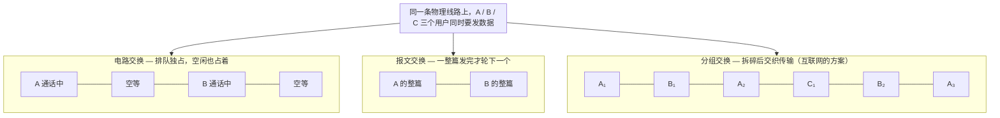

---

**网络协议三要素**

协议本质：通信双方共同遵守的规则。就像两个人对话，必须约定用哪种语言、每句话代表什么意思、谁先开口。

- **语法** ：数据长什么样——字段顺序、长度、格式，例如“姓名:张三;年龄:20”。相当于约定对话的词汇和文法。
- **语义** ：数据表示什么含义——例如HTTP状态码“404”，语法正确，语义是资源未找到。相当于约定每句话的动作意图。
- **同步** ：谁先发、后发、何时发——例如TCP三次握手的SYN→SYN+ACK→ACK顺序不能乱。相当于约定对话的节奏和轮次。

---

**计算机网络的定义和分类**

**计算机网络的定义**

- 干什么：将地理位置不同、功能独立的多台计算机及外部设备，通过通信线路连接起来，在网络操作系统、协议的管理与协调下，实现**资源共享**和**信息传递**的系统。
- 简单理解：用通信线缆把独立电脑连起来，让它们可以互传数据、共享打印机或互联网出口。

**计算机网络的分类（按覆盖范围）**

| 类型 | 范围 | 典型示例 |
| --- | --- | --- |
| PAN 个域网 | 个人设备周围 | 蓝牙耳机连手机 |
| LAN 局域网 | 房间、楼宇、校园 | 办公室Wi-Fi |
| MAN 城域网 | 城市 | 广电宽带网 |
| WAN 广域网 | 国家或全球 | 互联网 |

关系可以看作嵌套：PAN → LAN → MAN → WAN。

---

**计算机网络的性能指标**

网络好不好用，用下面这些“体检指标”衡量。

- **速率**：单位时间内传输的比特数，单位 bps。好比水管每秒流出多少升水。  
  *重点单位换算*：1 Byte（字节）= 8 bits，1 KB = 1024 B，1 MB = 1024 KB，但速率通常用十进制：1 kbps = 1000 bps，1 Mbps = 1000 kbps。做题时务必注意**大B（字节）和小b（比特）**，文件大小常用Byte，带宽常用bit/s。
- **带宽**：数字信道所能传送的“最高数据率”，单位 bps。可以理解为水管的粗度（最大通水能力），不是当前水流速度。
- **吞吐量**：单位时间内通过某个网络（或链路、接口）的实际数据量。受带宽或拥塞限制，像某条路实际的每小时车流量。
- **时延**：数据从源端到目的端的总花费时间，包含发送时延、传播时延、处理时延、排队时延。好比开车上路，总时间=装车时间+路上行驶+收费站处理+堵车排队。
- **时延带宽积**：时延 × 带宽，结果是以比特为单位的“管道容积”。描述一条链路最多能同时“在路上”容纳多少比特。像高速公路的长途大巴数量：车速慢但路很长（时延大），路上同时跑的车就多。
- **往返时间 RTT**：从发送端发出数据到收到接收端确认的总时间。可以用来判断网络交互的灵敏度。
- **利用率**：信道利用率和网络利用率。利用率越高，说明线路越忙，但时延也会急剧增大——像高速路车流量达到80%就开始龟速。
- **丢包率**：丢失分组占总发送分组的比例。反映网络拥塞程度或链路质量。像快递丢失率，高了肯定有问题。

---

**计算机网络体系结构**

**常见的三种体系结构**

- **OSI七层参考模型**：理论标准，层次清晰，但复杂。从上到下：应用层、表示层、会话层、传输层、网络层、数据链路层、物理层。
从底到上：物，数，网，传，会，表，应

- **TCP/IP四层模型**：事实上的工业标准。从上到下：应用层、运输层、网际层、网络接口层。
- **五层原理模型**（教学用）：综合两者，从上到下：应用层、运输层、网络层、数据链路层、物理层。

**层次对比（TCP/IP 与 OSI 对应）**

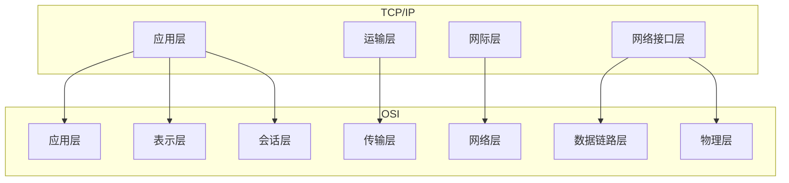

*TCP/IP的应用层合并了OSI的高三层，网络接口层合并了低两层。*

**分层的必要性**

- 干什么：把庞大复杂的网络问题分解成若干相对独立的子问题，每层只负责特定功能，下层为上层提供服务。
- 优点：各层独立发展，修改某一层不影响其他层；便于标准化；容易教学和理解。
- 比喻：像邮政系统，写信的人不用管货车走哪条路，只需按地址封装好交给邮局；运输部门不用看懂信件内容。

**分层思想举例**：你在浏览器输入网址 www.example.com
- 应用层：构造HTTP请求报文
- 运输层：封装为TCP报文段，添加端口号
- 网络层：封装为IP数据报，添加目的IP地址
- 数据链路层：封装为帧，添加MAC地址
- 物理层：转换成比特流，通过网线/无线电发送

**体系结构专用术语**

- **实体**：每一层中完成该层功能的软件/硬件模块。对等层之间仿佛在直接对话。
- **协议**：控制两个对等实体通信的规则集合，即同层间的约定。协议三要素就是语法、语义、同步。
- **服务**：下层为紧邻的上层提供的功能调用接口。是垂直的。
- **服务访问点 SAP**：上下层实体间交换信息的地方，如运输层的端口号、网络层的IP地址等。
- **数据单元**：  
  应用层——报文  
  运输层——报文段（TCP）或用户数据报（UDP）  
  网络层——IP数据报（或包）  
  数据链路层——帧  
  物理层——比特

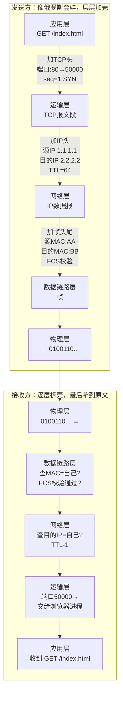

*直观理解：每层只关心自己那层的信息，下层看不懂上层的内容——就像邮局只看信封，不拆信。*

---

**物理层相关概念补充**

**同步传输与异步传输**

- 核心问题：接收方怎么知道一个比特单元或一个字符从哪开始、到哪结束？
- **异步传输**：每个字符独立发送，用起始位和停止位包裹。像说话时每个字后面都顿一下。  
  优点：简单，不需要严格时钟同步。  
  缺点：额外开销大（每个字符都有起止位）。
- **同步传输**：把多个字符组成数据块，在块前面加上同步字符，收发双方靠时钟同步连续收发。  
  优点：传输效率高。  
  缺点：实现复杂。

**曼彻斯特编码**

- 为什么需要：若连续发送很多0或1，接收方可能丢失时钟同步。
- 干什么：每个码元中间强制发生一次跳变，用跳变方向表示0或1。低→高为1，高→低为0。
- 优点：自带同步时钟，抗干扰能力强。
- 缺点：带宽利用率低（信号变化频率是数据率的两倍）。

**ASK、FSK、PSK（数字调制）**

- 问题：计算机的数字信号要放到电话线、无线等模拟信道上传，需要“骑”到载波上。
- **ASK 幅移键控**：改变振幅，大波=1，小波=0。简单但易受噪声干扰，像用灯光强弱传信息，雾天容易误判。
- **FSK 频移键控**：改变频率，高频=1，低频=0。抗干扰较强，但占用的频带较宽，像用两种声调的哨子。
- **PSK 相移键控**：改变相位，比如0°表示0，180°表示1。效率高，现代通信广泛使用，但对解调电路要求高。

**四种复用技术**

**先问一个问题：三个人分别要发 ○、□、△ 给远方，但只有一根线，怎么办？**

如果不复用，就只能排成一队，一个一个发——A 发完所有 ○，B 再发所有 □，C 最后发 △。浪费大量时间。

复用要解决的核心问题就是：**让多个用户同时共享一条物理链路，谁也不耽误谁。**

---

**FDM 频分复用 —— 把一根线的频带切成三份，每人用一份**

像收音机：中央人民广播电台用 95.6 兆赫，省台用 97.8 兆赫，而你用遥控器一拧就能选台——它们在同一根线上同时广播，互不干扰，因为各自的频率段不同。

```
FDM 的线： [频道A: ○○○○○|频道B: □□□□□|频道C: △△△△△]
           ↑ 频带切成了三段，三个人的数据同时发
```

---

**TDM 时分复用 —— 把时间切成小片，大家轮流用**

三台电脑共享一条网线，谁都不让谁。TDM 的做法：把 1 秒切成三小片，每人各占一片，快速轮转。

```
TDM 的时间线： [A][B][C][A][B][C][A][B][C]...
               ↑ 三人在时间上轮流，你一秒感觉不到的细粒度
```

---

**WDM 波分复用 —— 光纤版的 FDM，一条光纤里同时跑红绿蓝三束光**

本质就是光的频分复用。在一根光纤里，不同波长的激光（好比不同颜色的光）各自独立传输数据，互不影响。

```
WDM 的光纤： [🔴 红光束|🟢 绿光束|🔵 蓝光束]
              ↑ 不同波长的光合在一起跑
```

---

**CDM 码分复用 —— 所有人同时同频说话，但用不同"口音"区分**

典型场景是移动通信（3G）。所有人在同一时间、同一频率上一起说话，但每人的数据被乘以一串独特的"码型"。接收端用相同的码型去解，就能从嘈杂的混合信号里提取出想要的那一个人的信息。

```
CDM 的空中： [A码×○|B码×□|C码×△] 叠加在一起发出去，接收端用"码型钥匙"分别解开
```

---

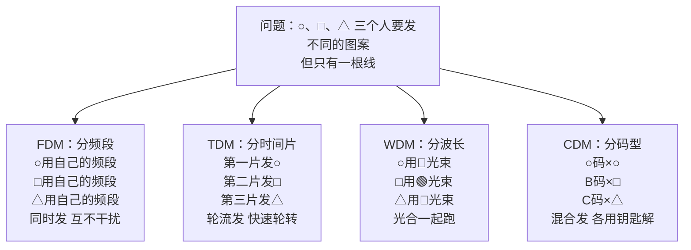

*四种复用方式解决的是同一个问题——多人共享一根线。区别在于"分"的方式不同：分频率、分时间、分波长、分码型。*

---


**数据链路层重点**

**封装成帧、透明传输、差错检测**

- **封装成帧**：在原始数据前后添加帧头和帧尾，划定帧的边界，像把散信纸放进信封并封口。
- **透明传输**：如果数据里恰好出现与帧边界标志相同的比特组合，必须用转义字符处理，使接收方能恢复原数据，好比信中若出现“到此为止”的字眼，要加注“这是正文，不是真的结束”。
- **差错检测（CRC）**：通过多项式运算生成校验码，接收端检测比特是否在传输中翻转。CRC能高效查出错误，但不纠错，只报警。

**共享式以太网（3.4）**

**网络适配器和MAC地址**

- **网络适配器（网卡）**：连接计算机和网络的接口设备，负责成帧、MAC寻址和介质访问控制。
- **MAC地址**：48位全球唯一的硬件地址，固化在网卡ROM中，用于数据链路层寻址，常表示为六组十六进制数（如 00:1A:2B:3C:4D:5E）。可以比喻为每个网络设备的“身份证号”，只在本网段内有效。

**CSMA/CD 协议（含 CRC 差错检测）**

- 为什么出现：早期总线型以太网共享同一条同轴电缆，多台机器同时发数据必然碰撞。
- 干什么：**先听后说，边听边说，冲突则停，随机后退再发。**
  - 载波监听：发之前先检测线路上是否有信号。
  - 碰撞检测：发送的同时继续监听，一旦发现信号叠加畸变（碰撞），立即停发。
  - 退避算法：碰撞后各自随机等待一段时间再尝试重发。
- CRC负责检测碰撞或被干扰导致的错误，发现错误帧直接丢弃。
- 优点：实现简单，适合早期总线网络。
- 缺点：在网络负载高时碰撞频繁，有效吞吐量下降严重。

**主机 A 向主机 B 发送数据的完整 5 步流程**

假设 A 和 B 在同一根总线（集线器）上：

```
第 1 步：侦听
A 想发数据，先听线路上有没有信号。
→ 有信号 → 继续侦听，直到线路空闲
→ 没信号（信道空闲）→ 进入第 2 步

第 2 步：发送 + 边发边听
A 开始发送数据帧，同时持续监视线路上的电压。
→ 电压正常（没碰撞）→ 继续发，直到发完 → 成功
→ 电压异常升高（碰撞！）→ 立即停发，进入第 3 步

第 3 步：强化冲突
A 发送一个短暂的 jam 信号（32 位），通知总线上其他站点"刚才撞车了"。

第 4 步：随机退避
A 执行"截断二进制指数退避"算法，算出一个随机等待时间，暂停发送。

第 5 步：重试
等待结束后，回到第 1 步重新侦听发送。
若重试次数达到 16 次 → 放弃发送，向上层报错。
```

**随机退避时间是怎么算的？**

碰撞后等待的时间不是随便拍脑袋，而是遵循一个公式：

```
退避时间 = 随机整数 r × 争用期（51.2μs）

随机整数 r 的范围：0 到 (2ᵏ - 1)，其中 k = min(重试次数, 10)
```

- 第 1 次碰撞：k = 1，r ∈ [0, 1] → 要么不等（0），要么等 51.2μs
- 第 2 次碰撞：k = 2，r ∈ [0, 3] → 等 0 / 51.2 / 102.4 / 153.6 μs
- 第 3 次碰撞：k = 3，r ∈ [0, 7] → 最多等 7 × 51.2 = 358.4 μs
- ...
- 第 10 次及之后：k 停在第 10，r ∈ [0, 1023]，但重试次数继续累加直到 16

> 这就是"截断二进制指数退避"这个名字的由来——等待时间随着碰撞次数翻倍增大，碰撞越频繁等得越久，这样可以缓解网络拥塞。

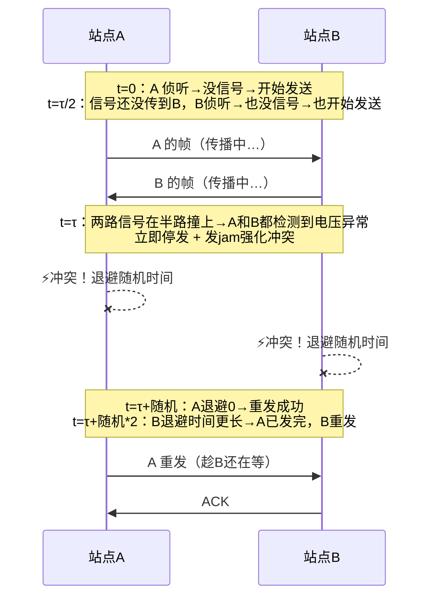

*核心理解：CD（碰撞检测）的精髓——嘴说话的时候耳朵还竖着，一听见撞车立刻闭嘴。*

**使用集线器的共享式以太网 & 在物理层扩展以太网**

- **集线器（Hub）**：物理层设备，收到一个端口的比特信号后，简单复制并转发到其他所有端口。用集线器连接起来的所有主机处于同一个**碰撞域**，仍然共享带宽，工作机制还是CSMA/CD。
- **在物理层扩展**：通过集线器级联或光纤调制解调器延长传输距离，但不隔离碰撞域。相当于把同一条总线拉得更长或增加更多接头，碰撞机会反而增大。

**在数据链路层扩展以太网**

- **网桥/交换机**：工作在数据链路层，能根据MAC地址做出转发决策，将网络划分成更小的碰撞域。相比Hub，交换机让每个端口基本成为独立碰撞域，大幅减少碰撞。网桥和交换机可以根据MAC地址表有选择地转发帧，如果目的地址在同一端口侧则不转发到其他端口。

**交换式以太网（3.5）**

**以太网交换机**

- 干什么：本质是多端口网桥，能够自学习源MAC地址，建立转发表，根据目的MAC地址精准转发帧，支持多个端口同时并行通信。
- 工作方式：存储转发或直通交换。
- 优点：每个端口独享带宽，无碰撞（全双工模式下），能隔离碰撞域。

**共享式以太网与交换式以太网的对比**

- 共享式：用集线器，半双工，带宽大家分，随时可能碰撞，核心协议是CSMA/CD。
- 交换式：用交换机，可全双工，端口带宽独享，不需要CSMA/CD（在全双工时无碰撞），效率高很多。

比喻：共享式像对讲机群聊，一次只能一个人说；交换式像电话交换机，两两可以同时通话且互不干扰。

**虚拟局域网 VLAN（3.7）**

- **为什么需要**：一个物理交换机上接了不同部门的电脑，如果不隔开，所有机器都在同一个广播域，广播包泛滥且安全无隔离。
- **概述**：VLAN通过逻辑划分，将一个物理局域网分割成多个相互隔离的虚拟局域网，每个VLAN是一个独立的广播域。
- **实现机制**：
  - 基于端口的VLAN：最常用。将交换机某些端口划归VLAN 10，另一些划归VLAN 20，端口间的转发只限同一VLAN。
  - 基于MAC地址的VLAN：按网卡地址决定归属。
  - 跨交换机的VLAN：用**802.1Q标签**在帧头插入VLAN ID，实现跨交换机的VLAN透传。Trunk端口承载多个VLAN流量。
- 优点：提高安全性，隔离广播，灵活管理。

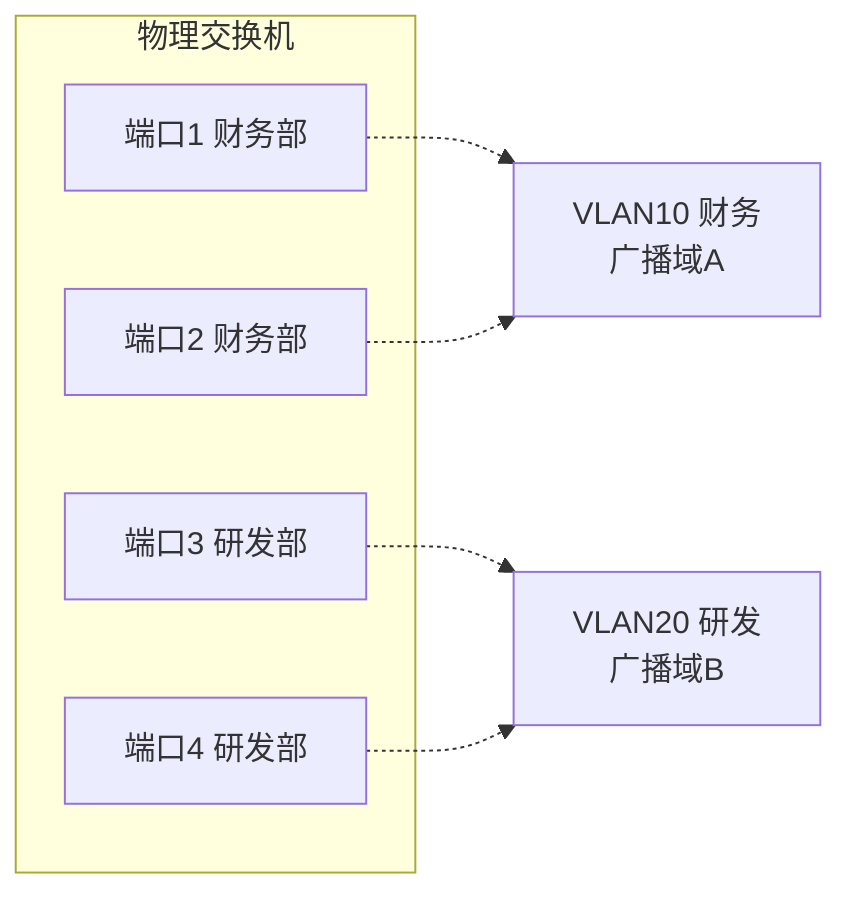

*同一个物理交换机，端口1/2 组成 VLAN10，端口3/4 组成 VLAN20——虽然插在同一台机器上，但广播包只在各自的 VLAN 内传播，互不干扰。*

**STP 生成树协议**

- 问题：交换机之间冗余连接形成环路，造成广播风暴和MAC表震荡。
- 干什么：自动阻塞部分冗余链路，将网络物理拓扑裁剪成无环的逻辑树形结构。
- 过程：选举根桥，然后每个交换机确定到根的最短路径，阻塞其他冗余端口。
- 优点：消除环路，自动切换备用链路。缺点：部分链路闲置，浪费带宽。

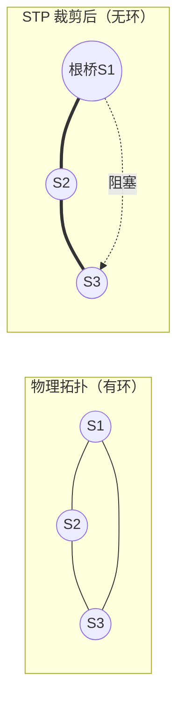

*左：三台交换机物理上连成环→广播风暴。右：STP 选举 S1 为根桥，阻塞 S1-S3 之间的冗余链路，逻辑上变回无环树。备用链路被阻塞但始终在线，一旦主干断就自动激活。*

---

**传输层可靠传输基础（停等、GBN、SR）**

*这些协议思想同样适用于链路层和传输层。*

- **停止等待**：发一个包→等确认→再发下一个。优点：最简单。缺点：信道利用率极低，大量时间在等待。
- **GBN 后退N帧**：连续发送窗口内的多个包，一旦某个包出错，从出错包开始重传后续所有包。实现较简单，但错误时重传量大，浪费带宽。
- **SR 选择重传**：只重传出错的那些包，缓存正确收到的后续包。效率最高，但接收方需要缓冲且需更多处理。

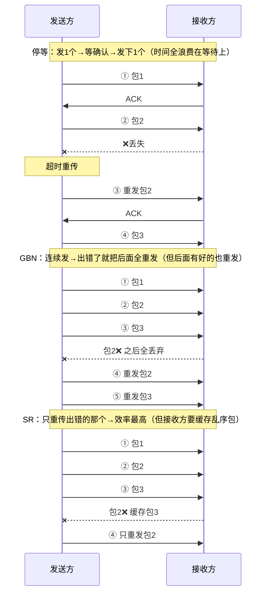

---

**网络层核心（第4章）**

**网络层两种服务**

- **虚电路服务**：类似电话网络，通信前先建立逻辑连接路径，分组沿同一路由顺序到达。适合需保证质量的场景，但网络复杂时不太灵活。
- **数据报服务**：互联网采用的方式。每个分组独立选路，可能走不同路径，不保证顺序和时限。网络结构简单，健壮性强，就像每封信独立走邮路，可能先后顺序错乱，但邮局本身不需为每对通信者维护状态。

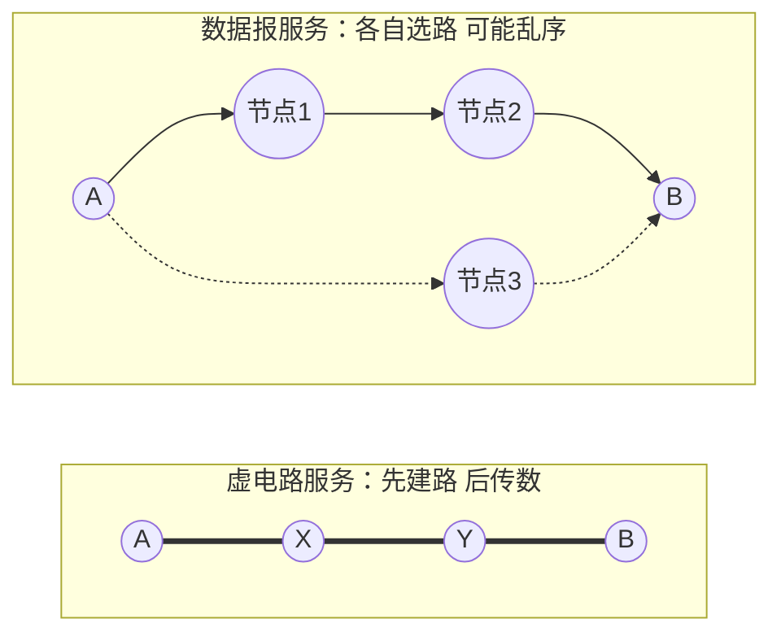

*虚电路=固定的路（像火车轨道），数据报=各自找路（像快递，每件走不同路线）。互联网选择了数据报——简单、健壮。*

**IPv4地址及编址方法（核心）**

**IP 地址是什么？**

IP 地址是网络层的"门牌号"，总共 32 位二进制（比如 `11000000.10101000.00000000.00000001`），为了方便人类读写，写成点分十进制 `192.168.0.1`。

一个 IP 地址分两半：**网络号**（你在哪个小区）+ **主机号**（你家是哪栋）。小区内的设备靠 MAC 地址找，跨小区的数据就靠 IP 地址的网络号来找。

**早期办法：分类编址（A/B/C 类）**

早期一刀切：网络号固定长度——A类8位，B类16位，C类24位。问题在于太死板：一个学校需要 1000 个地址，C 类太小（256个），B 类又太大（65536个），浪费严重。

于是有了 CIDR。

**CIDR 无分类编址（现在的做法）**

CIDR 的核心思想：**不再固定在 A/B/C 类，前缀想划多少位就划多少位**，用斜线记法 /N 表示前 N 位是网络号。

```
192.168.0.0/24  → 前 24 位是网络号，后 8 位是主机号（传统 C 类大小）
192.168.0.0/18  → 前 18 位是网络号，后 14 位是主机号（比 C 类大 64 倍）
```

> 好比以前只能买"小号 (C)"或"大号 (B)"两种尺码的衣服，CIDR 允许你任意定制——想要多大就多大。

**子网划分与借位**

子网划分要解决的是：**分给你的一个地址块太大了，怎么再切成更小的块分给不同部门？**

方法：从"主机号"部分借几位出来当作"子网号"，把一个大网络切成多个小网络。

```
原始 /24： 192.168.1.0 | 00000000     ← 网络号 24 位，主机号 8 位
借 2 位：  192.168.1.00 | 000000      ← 网络号变成 26 位，主机号剩 6 位
```

借 2 位 → 子网号有 2² = 4 种组合（00/01/10/11）→ 切成 4 个子网，每个子网的主机数 = 2⁶ - 2 = 62 台。

关键公式：
- 借 n 位 → 子网数 = **2ⁿ**
- 剩余主机位 m 位 → 每个子网可用主机数 = **2ᵐ - 2**（减 2 是因为去掉网络地址和广播地址）

> 借位好比你把公司一层的办公室（一个大网），用隔板分成 4 个小房间（子网），每个房间里的工位（主机位）就变少了。

**IPv4地址与MAC地址**

IP 地址和 MAC 地址各管一摊，分工不同：

- **IP 地址**：网络层使用，跨网络寻址。数据包从源主机到目的主机，源 IP 和目的 IP **全程不变**。
- **MAC 地址**：数据链路层使用，同一局域网上找设备。每经过一个路由器，源 MAC 和目的 MAC **都要换**。

> 可以这样理解：IP 地址是你的**最终收件地址**（北京市海淀区xx路xx号），MAC 地址是**快递员手上有你的门牌信息**。包裹每到一个中转站，中转站会换上新的"内部送件地址"，但最终收件地址始终不变。

**ARP 地址解析协议**

- 干什么：已知目标IP地址，求下一跳接口的MAC地址。
- 工作过程：主机在局域网内广播ARP请求（“谁是192.168.1.1？告诉你的MAC给我”），目标主机单播ARP响应。得到映射关系后缓存到ARP表。

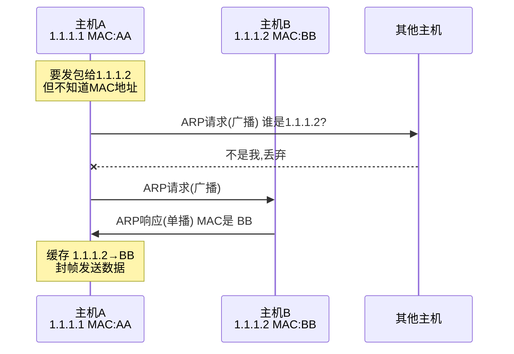

**IP数据报的首部格式**

- 干什么：承载网络层控制信息。重要字段：版本（IPv4）、首部长度、服务类型、总长度、标识、标志、片偏移（用于分片重组）、生存时间TTL（防兜圈）、协议（上层协议TCP/UDP）、首部校验和、源地址、目的地址。TTL每经过一个路由器减1，减到0则丢弃。

**IP数据报的发送和转发过程**

- 主机发送：判断目的IP是否同网段。同网段则直接交付（用ARP获得目的MAC）；不同网段则发给默认网关（路由器）。
- 路由器转发：收到数据报，根据路由表查找匹配项，选择下一跳接口，封装新帧头（新MAC地址），转发出去。

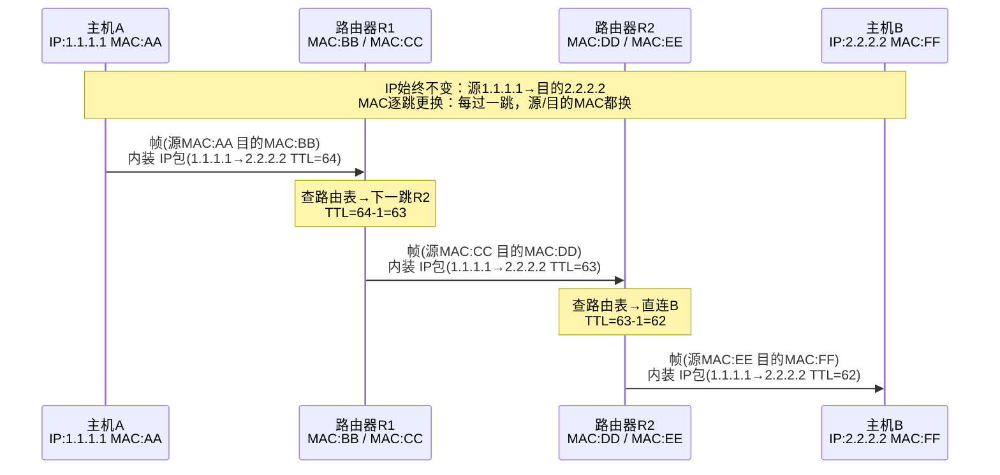

*核心理解：IP地址是"最终地址"全程不变；MAC地址是"下一跳地址"每跳都换。*

**路由器的基本工作原理**

路由器有三个核心环节：
1. **解封装**：收到帧后，拆掉帧头和帧尾，检查 IP 数据报的 TTL 和目的 IP
2. **查表转发**：用目的 IP 匹配路由表（最长前缀匹配），找到下一跳接口
3. **重新封装**：TTL 减 1，换上新的源/目的 MAC 地址，从匹配接口转发出去

> 路由器就像一个交通枢纽：快递到了（解封装），看地址找对应出口（查表），重新装车发出去（重新封装）。

**静态路由配置**

- **直连路由**：路由器接口所在网络自动加入路由表，无需配置。
- **非直连路由**：目的网络不直接与路由器相连，需要手工添加静态路由或通过动态路由协议学习。
- **默认路由**：0.0.0.0/0 匹配所有目的地址，当路由表找不到更具体匹配项时使用，常配置指向出口网关。
- **特定主机路由**：为单个主机IP指定专门路由，用于特殊情况测试或安全策略。
- 实操：在路由器接口配置IP并开启，使用 `ip route 目标网络 掩码 下一跳` 添加静态路由。

**动态路由协议 RIP 与 OSPF**

- **RIP 路由信息协议**：基于距离向量的内部网关协议，用跳数做度量，最大15跳。算法简单，通过周期性广播路由表学习。缺点是收敛慢，不适合大型网络。像邻居之间互相告知“我家到某地只需X步”，逐渐摸清全局。
- **OSPF 开放最短路径优先**：基于链路状态的内部网关协议，使用最短路径优先算法（Dijkstra）。每台路由器维护整个网络的拓扑数据库，计算以自己为根的最优树。收敛快、支持分层区域划分，适用于大型网络。像每个人都拿到一张城市地图，根据路况自己算最佳路径。

- **OSPF 开放最短路径优先**：基于链路状态的内部网关协议，使用最短路径优先算法（Dijkstra）。每台路由器维护整个网络的拓扑数据库，计算以自己为根的最优树。收敛快、支持分层区域划分，适用于大型网络。像每个人都拿到一张城市地图，根据路况自己算最佳路径。
- **BGP 边界网关协议**：不同自治系统（AS）之间的路由协议，属于外部网关协议（EGP）。BGP 不以"跳数最少"为目标，而是根据**路由策略**（如政治、经济、安全因素）选择路径。像国与国之间的外交路线——不一定走最近的路，但走最"合法"的路。
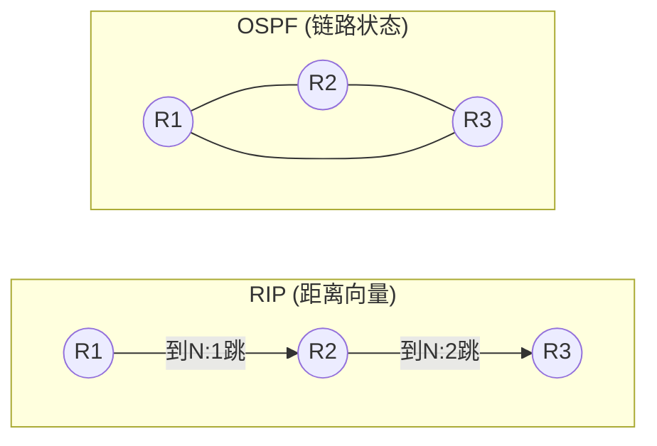

*RIP：邻居之间互相传"我到某网几步"（基于传闻，收敛慢，最多15跳）→ OSPF：每人拿到全局拓扑图，自己算最短路径（Dijkstra，收敛快，适合大网）*

---

**传输层（第5章）**

**运输层概述：进程间通信**

运输层位于网络层之上，解决的问题是：**网络层把数据包送到主机后，主机该把它交给哪个应用程序？** 答案是**端口号**。

- **复用**：发送方多个应用进程（浏览器、微信、邮件）都能通过同一个运输层协议把数据发出去
- **分用**：接收方收到数据后，根据 TCP/UDP 报文头里的**目的端口号**，把数据准确交给对应的应用程序
- 常见端口号：HTTP=80, HTTPS=443, DNS=53, SMTP=25, FTP=21

> 好比一栋楼的收发室：网络层负责把快递送到楼门口（主机），运输层负责根据房间号（端口号）把快递送到具体房间（进程）。

**UDP 与 TCP 全面对比**

| 对比项 | TCP | UDP |
| --- | --- | --- |
| 连接 | 面向连接（三次握手建立） | 无连接，直接发送 |
| 可靠性 | 可靠，保证顺序、无丢失、无重复 | 不可靠，尽力交付 |
| 流量/拥塞控制 | 有（滑动窗口、重传、拥塞控制） | 无，应用层自行处理 |
| 首部开销 | 20~60字节 | 8字节 |
| 传输效率 | 较低，因确认、重传等机制 | 高，实时性好 |
| 适用场景 | 文件传输、网页、邮件 | 视频直播、语音通话、DNS、DHCP |

比喻：TCP像打电话，先拨通确认对方在听，说话内容按顺序保证传到；UDP像寄明信片，塞进邮箱就不管了，可能丢失或乱序，但轻便快捷。

**TCP 报文段的首部格式**

TCP 报文段的首部至少 20 字节，核心字段包括：
- **源端口/目的端口**（各2字节）：标识发送方和接收方的进程
- **序号 seq**（4字节）：本报文段数据的第一个字节的序号，用于按序重组
- **确认号 ack**（4字节）：期望收到的下一个字节序号，表示之前的数据已全部收到
- **数据偏移**（4位）：TCP头部的长度
- **标志位**（各1位）：URG/ACK/PSH/RST/SYN/FIN——SYN 用来建立连接，FIN 用来释放连接，ACK 表示确认号有效
- **窗口**（2字节）：接收方告诉发送方自己还能收多少数据（流量控制）
- **校验和**（2字节）：检查数据有没有损坏

> TCP 头部可以理解为快递单——有发件人地址（源端口）、收件人地址（目的端口）、包裹编号（序号）和备注栏（标志位）。

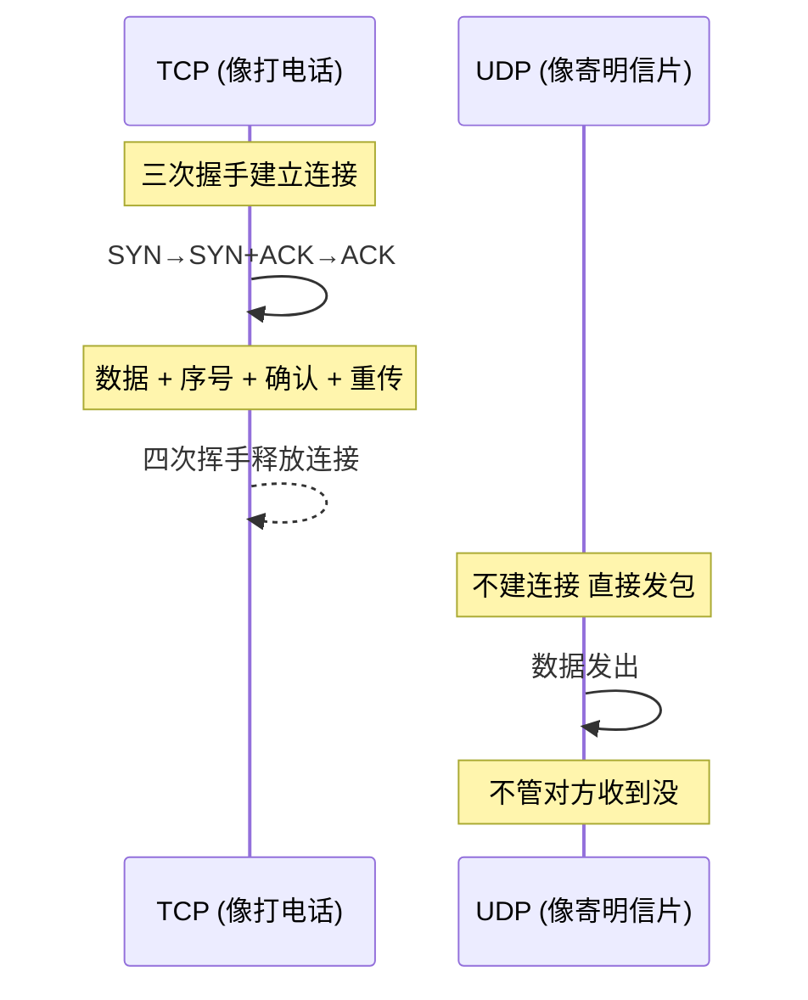

**TCP 三次握手建立连接**

- 目的：同步序列号，确保双方收发能力正常。
- 过程：
  ```mermaid
  sequenceDiagram
      客户端->>服务器: SYN, seq=x
      服务器->>客户端: SYN+ACK, seq=y, ack=x+1
      客户端->>服务器: ACK, ack=y+1
  ```
  三次后两端都确认自己和对方能正常收发。

**TCP 四次挥手释放连接**

- 原因：TCP是全双工的，每个方向需单独关闭。
- 过程：
  ```mermaid
  sequenceDiagram
      A->>B: FIN, seq=u
      B->>A: ACK, ack=u+1
      B->>A: FIN, seq=v
      A->>B: ACK, ack=v+1
  ```
  FIN发起方进入TIME_WAIT等待2MSL，确保最后的ACK能到达。

**TCP 可靠传输核心：重传机制**

- 干什么：保证数据块无差错、不丢失、按序到达。
- **超时重传**：每发送一个报文段启动一个计时器，若在超时时间RTO内未收到确认，就重传。RTO需根据RTT动态估算——RTT 波动大时 RTO 也相应调整，防止不必要的重传。
- **快速重传**：发送方收到3个相同的冗余ACK（表明接收方缺失了某个段）时，立即重传缺失的段，不用等超时，提高效率。
- **选择确认 SACK**：接收方可以告诉发送方"我收到了哪些数据，缺了哪些"，让发送方只重传缺失的部分，而不是把后面的全重传。
- 配合**滑动窗口**实现流量控制，**拥塞控制**算法（慢启动、拥塞避免、快速恢复）则防止网络负担过重。

---

**应用层（第6章）重点小节**

**DHCP 动态主机配置协议**

- **作用**：让主机自动获取IP地址、子网掩码、默认网关、DNS服务器等配置，免去手工设置。
- **工作过程**（简化为发现、提供、请求、确认四个阶段）：
  ```mermaid
  sequenceDiagram
      客户端->>服务器: DHCP DISCOVER (广播)
      服务器->>客户端: DHCP OFFER
      客户端->>服务器: DHCP REQUEST (选择某个提供)
      服务器->>客户端: DHCP ACK (确认租约)
  ```
  像入住酒店时前台自动分配房间号和wifi信息。

**DNS 域名系统**

- **作用**：将人类易记的域名（www.example.com）转换为机器可读的IP地址。
- **域名结构**：层次树状，从根域、顶级域（.com, .cn）、二级域一直到主机。
- **域名服务器**：根域名服务器、顶级域名服务器、权威域名服务器等，分级协作。
- **解析过程**：递归查询与迭代查询结合。本机先查缓存，若无则向本地DNS查询，本地DNS替客户端完成后续逐级查询。

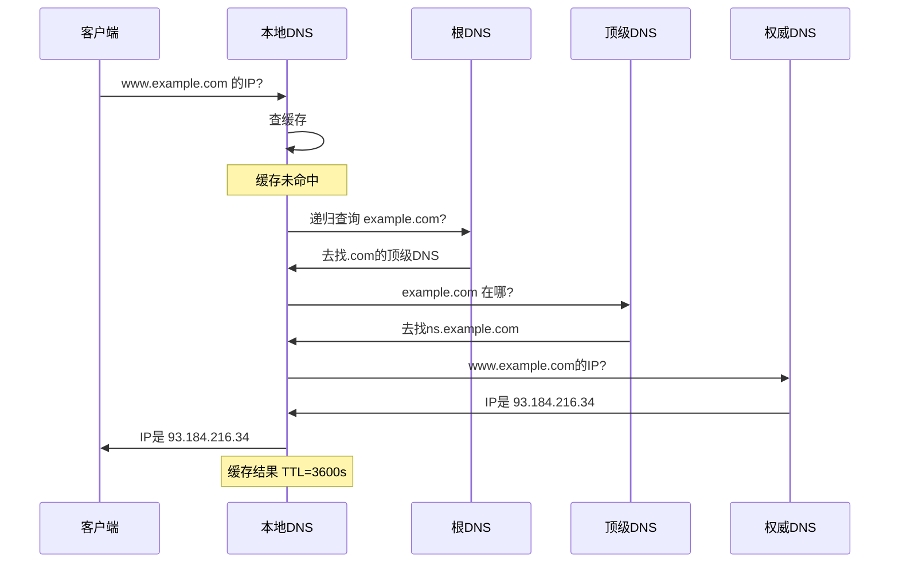
- **高速缓存**：各级DNS都会缓存解析结果，减少全网查询次数，提高响应速度。缓存有TTL限制，过期刷新。

**电子邮件系统**

- **组成**：用户代理（收发邮件的客户端）、邮件服务器、邮件传输协议。
- **SMTP**：用于发送邮件，或邮件服务器之间的转发。采用推的方式，命令/响应式交互。
- **邮件信息格式**：信封（传输信息）和内容（RFC 5322定义的首部+正文）。
- **MIME**：扩展邮件格式，使其支持非ASCII文本、图片、音频、附件等。
- **POP3**：从邮件服务器把邮件下载到本地，通常下载后服务器端删除。
- **IMAP4**：管理服务器上的邮件，可在线阅读、标记、多设备同步，不删除服务器副本。
- **基于万维网的电子邮件**：通过浏览器用HTTP收发邮件，后台邮件服务器之间仍用SMTP。

比喻：传统邮件系统，SMTP是邮局的转送卡车，POP3/IMAP是收件人收取信件的方式（取回家 vs 在邮箱管理）。

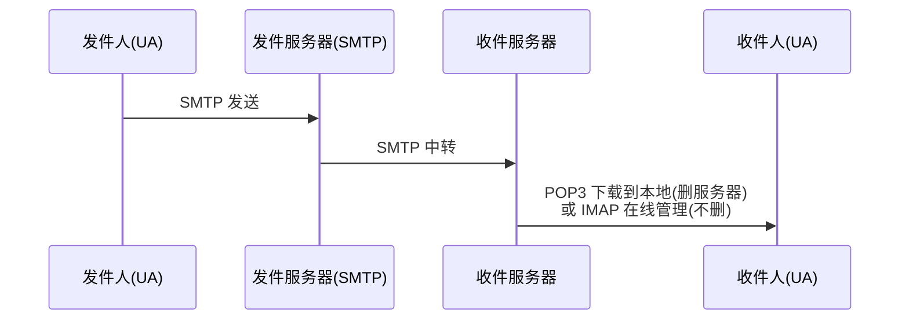

**万维网 WWW**

- **URL 统一资源定位符**：<协议>://<主机>:<端口>/<路径>，唯一标识网络资源位置。
- **HTTP 超文本传输协议**：万维网应用层协议，基于TCP，通常使用80端口。无状态协议。
- **Cookie 机制**：为弥补HTTP无状态，服务器在客户端存储小文本文件，用于会话保持、用户跟踪，像餐馆给顾客的号码牌，便于下次识别。
- **万维网缓存与代理服务器**：代理服务器位于客户端与服务器之间，缓存经常访问的网页。用户请求时先查代理缓存，命中则直接返回，减少网络带宽和延迟。像小区里的快递驿站代收常见包裹。

---

最后，整个网络的分层逻辑主线依然是最核心的：

**物理层** 负责将比特转换成物理信号传过去  
→ **数据链路层** 负责相邻节点间可靠/有效的帧传输  
→ **网络层** 负责跨网络选路和转发  
→ **运输层** 负责进程到进程的可靠/实时通信  
→ **应用层** 向用户提供具体网络服务

考试大题基本都沿着这条主线展开，你可以在脑海中用这一串流程把各知识点串起来。


---


---

# 老师布置的作业

**作业1：无分类编址CIDR计算**
给定的无分类编址的IPv4地址为206.0.64.8/18，请分别求出：
1. 地址块中的最小地址
2. 地址块中的最大地址
3. 地址块中的地址数量
4. 地址块中聚合某类网络（A类、B类、C类）的数量
5. 地址掩码

> 已知地址：206.0.64.8/18
> 其中 `/18` 表示网络号占18位，主机号占32−18=14位。

> 第一步：求地址掩码
> `/18` 表示前18位全为1，后14位全为0。
> 写成二进制：
>
> $$
> 11111111.11111111.11000000.00000000
> $$
>
> 每8位转换成十进制：
>
> * 11111111 = 255
> * 11111111 = 255
> * 11000000 = 192
> * 00000000 = 0
>
> 所以地址掩码为：
>
> $$
> 255.255.192.0
> $$

> 第二步：求最小地址（网络地址）
> 方法：IP地址 与 地址掩码进行按位与运算。
>
> 原IP地址：
>
> $$
> 206.0.64.8
> $$
>
> 转换成二进制：
>
> $$
> 11001110.00000000.01000000.00001000
> $$
>
> 掩码二进制：
>
> $$
> 11111111.11111111.11000000.00000000
> $$
>
> 进行按位与运算：
>
> $$
> 11001110.00000000.01000000.00001000
> $$
>
> $$
> \land
> $$
>
> $$
> 11111111.11111111.11000000.00000000
> $$
>
> 得到：
>
> $$
> 11001110.00000000.01000000.00000000
> $$
>
> 转换成十进制：
>
> $$
> 206.0.64.0
> $$
>
> 所以最小地址（网络地址）为：
>
> $$
> 206.0.64.0
> $$

> 第三步：求最大地址（广播地址）
> 方法：把主机号部分全部变成1。
>
> `/18` 说明：
>
> * 前18位固定为网络位
> * 后14位全部改成1
>
> 网络地址二进制：
>
> $$
> 11001110.00000000.01000000.00000000
> $$
>
> 后14位改成1：
>
> $$
> 11001110.00000000.01111111.11111111
> $$
>
> 转换成十进制：
>
> $$
> 206.0.127.255
> $$
>
> 所以最大地址（广播地址）为：
>
> $$
> 206.0.127.255
> $$

> 第四步：求地址数量
> IPv4总共32位。
> 主机位数量：
>
> $$
> 32-18=14
> $$
>
> 地址总数量公式：
>
> $$
> 2^{主机位数}
> $$
>
> 代入：
>
> 2^{14}=16384
>
> 所以地址块中的地址数量为：
>
> $$
> 16384
> $$

> 第五步：求聚合的A类、B类、C类网络数量
>
> **核心概念："聚合"的意思是这个 /18 地址块里，能完整装下多少个不同类别的网络。**
>
> 先列出各类网络的"大小"——前缀数字越小，网络越大：
>
> | 类别 | 默认前缀 | 含义 | 地址数 |
> |:---|:---|:---|:---|
> | A类 | /8 | 前 8 位是网络号 | 2²⁴ ≈ 1677 万 |
> | B类 | /16 | 前 16 位是网络号 | 2¹⁶ = 65536 |
> | C类 | /24 | 前 24 位是网络号 | 2⁸ = 256 |
> | **本题地址块** | **/18** | **前 18 位是网络号** | **2¹⁴ = 16384** |
>
> 现在拿本题的 /18 块跟每种类型比大小：
>
> **（1）能不能聚合 A 类？— 0**
>
> A 类网络是 /8，包含 1677 万个地址。本题 /18 只有 16384 个地址。
>
> 用一个 16384 的小容器去"装"一个 1677 万的大容器 → 装不下。
>
> 所以：**0 个**。
>
> **（2）能不能聚合 B 类？— 0**
>
> B 类网络是 /16，包含 65536 个地址。本题 /18 只有 16384 个。
>
> 同样，16384 < 65536 → 一个完整的 B 类网络都装不下。
>
> 这道题的地址块恰好落在 `206.0.0.0/16` 这个 B 类范围内，但它只占其中 1/4，不是完整 B 类。
>
> 所以：**0 个**。
>
> **（3）能不能聚合 C 类？— 64**
>
> C 类网络是 /24，每个只有 256 个地址。本题 /18 有 16384 个地址，比 C 类大得多。
>
> 所以能装下很多个 C 类。多少个？用公式：
>
> $$
> \text{数量} = 2^{\,(\text{C类前缀} - \text{本题前缀})}
> = 2^{\,24-18}
> = 2^{6}
> = 64
> $$
>
> **为什么要这样算？** 因为每增加 1 位前缀，地址块就"切成两半"（容量减半）；反之每减少 1 位，容量翻倍。从 /24 到 /18，前缀减少了 6 位，容量翻了 2⁶ = 64 倍。所以一个 /18 块恰好等于 64 个 /24 块。
>
> 所以：**64 个 C 类网络**。


> 最终答案汇总：
>
> 1. 最小地址：
>
> $$
> 206.0.64.0
> $$
>
> 2. 最大地址：
>
> $$
> 206.0.127.255
> $$
>
> 3. 地址数量：
>
> $$
> 16384
> $$
>
> 4. 聚合网络数量：
>
> * A类：0
>
> * B类：0
>
> * C类：64
>
> 5. 地址掩码：
>
> $$
> 255.255.192.0
> $$


**作业2：IPv4地址应用规划（定长+变长子网掩码）**
假设地址块为192.168.252.0/24，请分别使用定长子网掩码和变长子网掩码给下图所示的小型互联网中的各设备分配IP地址：
- 网络1：60台主机
- 网络2：20台主机
- 网络3：10台主机
- 网络4：路由器间链路（2台设备）
> 已知地址块：
>
> $$
> 192.168.252.0/24
> $$
>
> `/24` 表示：
>
> * 网络号24位
> * 主机号8位
>
> 总地址数量：
>
> 2^8=256
>
> 即：
>
> $$
> 192.168.252.0 \sim 192.168.252.255
> $$

---

> 一、定长子网掩码（FLSM）划分
>
> **核心**：所有子网掩码相同。以最大子网（60台）为准，选一个能装下它的最小掩码。
>
> ---
>
> **第一步：确定子网掩码**
>
> ```
> 2^n - 2 ≥ 60
> 2^5 - 2 = 30  ❌ 不够
> 2^6 - 2 = 62  ✅ 刚好
> → 主机位 n = 6 → 前缀 = 32 - 6 = /26
> ```
>
> 把地址写成二进制，`|` 左边是网络位（借了 2 位子网号），右边是主机位：
>
> ```
> 192.168.252 . 0 0 0 0 0 0 0 0
>             |   子网(2)   |主机(6)|
>             └─ 借位 → /26 ─┘
> ```
>
> 掩码：`11111111.11111111.11111111.11|000000` = **255.255.255.192**
>
> ---
>
> **第二步：4 个子网的二进制推导**
>
> 借 2 位子网位，共 `2² = 4` 个子网号（00/01/10/11），每个子网 64 个地址。
>
> | 子网号 | 最后一个字节(二进制) | 网络地址 | 广播地址 | 可用范围 |
> |:---|:---|:---|:---|:---|
> | 00 | `00\|000000` | **.0** | **.63** | .1 ~ .62 |
> | 01 | `01\|000000` | **.64** | **.127** | .65 ~ .126 |
> | 10 | `10\|000000` | **.128** | **.191** | .129 ~ .190 |
> | 11 | `11\|000000` | **.192** | **.255** | .193 ~ .254 |
>
> *规律：网络地址 = 子网号 × 64，广播 = 网络地址 + 63*
>
> ---
>
> **第三步：分配结果**
>
> | 子网 | 网络地址 | 可用范围 | 广播地址 | 掩码 | 浪费 |
> |:---|:---|:---|:---|:---|:---|
> | 网络1(60台) | 192.168.252.0 | .1 ~ .62 | .63 | /26 | 2 |
> | 网络2(20台) | 192.168.252.64 | .65 ~ .126 | .127 | /26 | 42 |
> | 网络3(10台) | 192.168.252.128 | .129 ~ .190 | .191 | /26 | 52 |
> | 网络4(2台) | 192.168.252.192 | .193 ~ .254 | .255 | /26 | 60 |
>
> FLSM 的本质：选一个"最大号"统一尺码——网络1刚好，网络2/3/4太大，浪费严重。
---

---

> 二、变长子网掩码（VLSM）划分
>
> **核心**：不同子网用不同掩码——网络需要多少主机就分多大块，不像 FLSM 一视同仁。
>
> ---
>
> **第一步：为每个网络选定前缀**
>
> 从大到小排序，逐个适配：
>
> | 网络 | 需主机 | 2ⁿ−2 ≥ 需 | n | 前缀 | 块大小 |
> |:---|:---|:---|:---|:---|:---|
> | 网络1 | 60 | 2⁶−2=62 ✅ | 6 | **/26** | 64 |
> | 网络2 | 20 | 2⁵−2=30 ✅ | 5 | **/27** | 32 |
> | 网络3 | 10 | 2⁴−2=14 ✅ | 4 | **/28** | 16 |
> | 网络4 | 2 | 2²−2=2 ✅ | 2 | **/30** | 4 |
>
> ---
>
> **第二步：用二进制看顺序切分**
>
> 从 0 开始，每个子网依块大小连续占用。`|` 位置 = 每种子网的网络/主机分界。
>
> ```
>  192.168.252 . 0  0  0  0  0  0  0  0
>  网络1 /26   |     子网     |   主机    |    0  ~ 63   (64个)
>  网络2 /27   |      子网      |  主机   |    64 ~ 95   (32个)
>  网络3 /28   |       子网       | 主机  |    96 ~ 111  (16个)
>  网络4 /30   |         子网         |主|    112 ~ 115 (4个)
>  剩余未分配                                         116 ~ 255
> ```
>
> 二进制推导 —— 注意 `|` 位置不同（因为掩码不同）：
>
> ```
>  .00|000000  = 0    (网络1起始)        .00|111111  = 63   (网络1广播)
>  .010|00000  = 64   (网络2起始)        .010|11111  = 95   (网络2广播)
>  .0110|0000  = 96   (网络3起始)        .0110|1111  = 111  (网络3广播)
>  .01110|00   = 112  (网络4起始)        .01110|11   = 115  (网络4广播)
> ```
>
> ---
>
> **第三步：结果表**
>
> | 网络 | 前缀 | 网络地址 | 可用范围 | 广播地址 | 消耗 |
> |:---|:---|:---|:---|:---|:---|
> | 网络1 | /26 | 192.168.252.0 | .1 ~ .62 | .63 | 64 |
> | 网络2 | /27 | 192.168.252.64 | .65 ~ .94 | .95 | 32 |
> | 网络3 | /28 | 192.168.252.96 | .97 ~ .110 | .111 | 16 |
> | 网络4 | /30 | 192.168.252.112 | .113 ~ .114 | .115 | 4 |
> | **已用** | | | | | **116** |
> | **剩余** | | | | | **140** |
>
> ---
>
> **FLSM vs VLSM 一图对比**
>
> ```
>  FLSM (/26 统一):  [0=======63][64======127][128======191][192======255]  全用光
>  VLSM (混合掩码):  [0=======63][64====95][96===111][112115][116=== 255 空闲]
>                    网络1(60)   网络2(20) 网络3(10) 网4(2)   ← 省了140个!
> ```
>
> VLSM 的价值：同一张 /24，FLSM 只能搭 4 个等大子网且大量浪费；VLSM 按需分配，省下一半多留给未来。


**作业3：定长子网划分（表格填写）**
202.168.25.0/24，划分出4个子网，填写下表：

| 子网编号 | 网络地址 | 子网掩码 | 广播地址 | 最小可分配的地址 | 最大可分配的地址 |
|----------|----------|----------|----------|------------------|------------------|
| 1        |          |          |          |                  |                  |
| 2        |          |          |          |                  |                  |
| 3        |          |          |          |                  |                  |
| 4        |          |          |          |                  |                  |

> 已知网络：
>
> $$
> 202.168.25.0/24
> $$
>
> 要划分为4个子网。

> 第一步：用二进制看 /24 → /26 的借位
>
> 4 个子网 → 借 2 位子网号（2²=4）。原 /24 → 新 /26。
>
> ```
> 202.168.25 . 0 0 0 0 0 0 0 0
>           |   子网(2)   |主机(6)|
>           └─ 借位 → /26 ─┘
> ```
>
> 掩码：`11111111.11111111.11111111.11|000000` = **255.255.255.192**
>
> 第二步：4 个子网的二进制推导
>
> 每个子网 2⁶ = **64** 个地址。
>
> | 子网号 | 最后一个字节(二进制) | 网络地址 | 广播地址 | 可用范围 |
> |:---|:---|:---|:---|:---|
> | 00 | `00\|000000` | **202.168.25.0** | .63 | .1 ~ .62 |
> | 01 | `01\|000000` | **202.168.25.64** | .127 | .65 ~ .126 |
> | 10 | `10\|000000` | **202.168.25.128** | .191 | .129 ~ .190 |
> | 11 | `11\|000000` | **202.168.25.192** | .255 | .193 ~ .254 |
>
> 填入原表：
> 第四个字节按64递增：
>
> * 0
> * 64
> * 128
> * 192

> 表格填写如下：

| 子网编号 | 网络地址           | 子网掩码                  | 广播地址           | 最小可分配的地址       | 最大可分配的地址       |
| ---- | -------------- | --------------------- | -------------- | -------------- | -------------- |
| 1    | 202.168.25.0   | 255.255.255.192 (/26) | 202.168.25.63  | 202.168.25.1   | 202.168.25.62  |
| 2    | 202.168.25.64  | 255.255.255.192 (/26) | 202.168.25.127 | 202.168.25.65  | 202.168.25.126 |
| 3    | 202.168.25.128 | 255.255.255.192 (/26) | 202.168.25.191 | 202.168.25.129 | 202.168.25.190 |
| 4    | 202.168.25.192 | 255.255.255.192 (/26) | 202.168.25.255 | 202.168.25.193 | 202.168.25.254 |

> 验证规律：
>
> * 网络地址 = 0、64、128、192
> * 广播地址 = 下一个网络地址 − 1
> * 最小可分配地址 = 网络地址 + 1
> * 最大可分配地址 = 广播地址 − 1
>
> 考试时看到“/24划分4个子网”，直接记住：
>
> * 新前缀：/26
> * 步长：64
> * 网络地址：0、64、128、192
>
> 然后依次填写广播地址和主机地址范围即可。

---


---

# 计算机网络实验（华为 eNSP）常用命令汇总

按**实验模块+功能场景**分类整理，标注命令适用视图和核心用途，覆盖考试高频考点。

---

**零、设备基础管理命令（所有实验前置，必考）**

**系统信息与时间配置**

| 命令 | 适用视图 | 核心用途 |
|:---|:---|:---|
| `display version` | 用户视图`<Huawei>` | 查看设备型号、VRP版本、运行时间 |
| `display clock` | 用户视图 | 查看当前系统时间和时区 |
| `clock timezone 时区名 add 08:00:00` | 用户视图 | 设置中国时区（UTC+8），必须先设时区再设时间 |
| `clock datetime HH:MM:SS YYYY-MM-DD` | 用户视图 | 修改系统时间 |

**Console口配置（本地登录管理，高频）**

```
# 进入Console口视图
[R1]user-interface console 0
# 开启密码认证模式，设置密文密码
[R1-ui-console0]authentication-mode password
[R1-ui-console0]set authentication password cipher Huawei@123
# 设置空闲超时时间（默认10分钟）
[R1-ui-console0]idle-timeout 20 0
```

**VTY远程登录配置（Telnet，高频）**

```
# 进入VTY虚拟终端视图（0-4表示同时允许5个用户登录）
[R1]user-interface vty 0 4
# 设置密文登录密码和权限级别（15为最高管理员权限）
[R1-ui-vty0-4]set authentication password cipher Huawei@123
[R1-ui-vty0-4]user privilege level 15
# 查看登录用户
<R1>display users
```

**接口基础配置（补充）**

| 命令 | 适用视图 | 核心用途 |
|:---|:---|:---|
| `interface GigabitEthernet 0/0/0` | 系统视图 | 进入指定物理接口 |
| `ip address IP地址 子网掩码` | 接口视图 | 配置接口IP（支持简写如`24`等价`255.255.255.0`） |
| `description 接口描述` | 接口视图 | 添加接口备注，如`description Connect-to-R2` |
| `display interface g0/0/0` | 任意视图 | 查看接口详细状态（物理/协议状态、MAC、带宽） |
| `shutdown` / `undo shutdown` | 接口视图 | 关闭/开启接口 |

**配置文件管理（必考，区分当前/保存配置）**

| 命令 | 适用视图 | 核心用途 |
|:---|:---|:---|
| `display current-configuration` / `dis cu` | 任意视图 | 查看**当前运行的配置**（内存中，重启后丢失） |
| `display saved-configuration` | 任意视图 | 查看**已保存到闪存的配置**（重启后生效） |
| `save` | 用户视图 | 保存当前配置到闪存 |
| `display startup` | 任意视图 | 查看下次启动使用的系统软件和配置文件 |
| `reset saved-configuration` | 用户视图 | 删除闪存中的配置文件（恢复出厂，重启后生效） |
| `dir` | 用户视图 | 查看闪存中的所有文件 |
| `reboot` | 用户视图 | 重启设备（实验环境选`n`不保存，避免残留配置） |

**一、基础操作与通用测试命令（所有实验必用）**

| 命令 | 适用视图 | 核心用途 |
|:---|:---|:---|
| `system-view` / `sys` | 用户视图`<Huawei>` | 进入系统视图（所有配置的前提） |
| `quit` | 任意视图 | 退回上一级视图 |
| `return` / `Ctrl+Z` | 任意视图 | 直接退回用户视图 |
| `sysname 设备名` | 系统视图`[Huawei]` | 修改设备名称（如`sysname LSW1`） |
| `ping 目标IP地址` | 用户视图/系统视图 | 测试网络连通性 |
| `tracert 目标IP地址` | 用户视图/系统视图 | 追踪数据包传输路径 |
| `ipconfig` | PC/客户端命令行 | 查看PC的IP地址、子网掩码、MAC地址 |
| `arp -a` | PC/客户端命令行 | 查看PC的ARP缓存表 |
| `display this` | 任意视图 | 查看**当前视图下的所有配置**（最常用验证命令） |

**操作技巧（考试提速必备）**

- 命令简写：无歧义时可缩写，如 `display`→`dis`，`interface`→`int`，`GigabitEthernet`→`g`
- Tab 补全：输入命令前缀按 Tab 自动补全
- 问号帮助：输入 `?` 查看当前可用命令，输入 `命令 ?` 查看该命令的参数

**二、交换机MAC地址表管理命令（实验3）**

**基础查看命令**

| 命令 | 适用视图 | 核心用途 |
|:---|:---|:---|
| `display mac-address` | 任意视图 | 查看交换机完整MAC地址表（含动态/静态表项） |
| `display mac-address dynamic` | 任意视图 | 仅查看动态学习的MAC地址表项 |
| `display mac-address static` | 任意视图 | 仅查看手动配置的静态MAC地址表项 |

**静态MAC与端口绑定配置**

| 命令 | 适用视图 | 核心用途 |
|:---|:---|:---|
| `mac-address static 设备MAC地址 接口编号 vlan VLAN号` | 系统视图 | 配置静态MAC地址表项 |
| `undo mac-address static 设备MAC地址 接口编号 vlan VLAN号` | 系统视图 | 删除指定静态MAC地址表项 |
| `mac-address aging-time 秒数` | 系统视图 | 修改动态MAC表项老化时间（默认300秒） |

**三、VLAN基础配置命令（实验4）**

**VLAN创建与删除**

| 命令 | 适用视图 | 核心用途 |
|:---|:---|:---|
| `vlan VLAN号` | 系统视图 | 创建单个VLAN并进入VLAN视图 |
| `vlan batch VLAN号1 VLAN号2` | 系统视图 | 批量创建多个VLAN |
| `undo vlan VLAN号` | 系统视图 | 删除指定VLAN |

**Access端口配置（接入终端）**

```
interface GigabitEthernet 0/0/11
port link-type access
port default vlan 10
```

**Trunk端口配置（交换机间互联）**

```
interface GigabitEthernet 0/0/24
port link-type trunk
port trunk allow-pass vlan 10 30
```

**批量端口加入VLAN（考试高频）**

```
# VLAN视图下批量添加端口
vlan 40
port GigabitEthernet 0/0/17 to GigabitEthernet 0/0/20

# 端口组批量配置
port-group 1
group-member GigabitEthernet 0/0/17 to GigabitEthernet 0/0/20
port link-type access
port default vlan 40
```

**VLAN信息查看**

| 命令 | 适用视图 | 核心用途 |
|:---|:---|:---|
| `display vlan` | 任意视图 | 查看所有VLAN的配置及端口成员 |
| `display vlan VLAN号` | 任意视图 | 查看指定VLAN的详细信息 |
| `display port vlan` | 任意视图 | 查看所有端口的VLAN类型和所属VLAN |

**四、VLANIF接口配置命令（实验5，实现VLAN间三层通信）**

```
interface Vlanif 10
ip address 192.168.10.1 255.255.255.0
```

**补充查看命令**

| 命令 | 适用视图 | 核心用途 |
|:---|:---|:---|
| `display ip interface brief` | 任意视图 | 查看所有三层接口（VLANIF/物理口）的IP状态 |
| `display ip routing-table` | 任意视图 | 查看交换机/路由器的IP路由表 |

**五、静态路由与默认路由配置命令（实验6）**

**静态路由**

```
# ip route-static 目标网段 子网掩码 下一跳IP地址
ip route-static 192.168.80.0 255.255.255.0 192.168.101.2
```

**默认路由（未知网段统一转发）**

```
# ip route-static 0.0.0.0 0.0.0.0 下一跳IP地址
ip route-static 0.0.0.0 0.0.0.0 192.168.101.1
```

**Loopback接口（模拟远端网络）**

```
interface LoopBack 0
ip address 10.1.1.10 255.255.254.0
```

**六、OSPF动态路由配置命令（实验7，单区域OSPF）**

**基本配置**

```
ospf 1 router-id 172.16.101.1
area 0
network 172.16.101.0 0.0.0.255
network 10.1.10.0 0.0.0.255
# 注意：network后接**反掩码**（255.255.255.0的反掩码是0.0.0.255）
```

**OSPF状态查看（考试高频）**

| 命令 | 适用视图 | 核心用途 |
|:---|:---|:---|
| `display ospf peer` | 任意视图 | 查看OSPF邻居关系（验证邻居是否建立成功） |
| `display ospf routing` | 任意视图 | 查看OSPF学习到的路由条目 |
| `display ospf lsdb` | 任意视图 | 查看OSPF链路状态数据库（LSDB） |

**接口启停**

```
interface GigabitEthernet 0/0/0
shutdown
undo shutdown
```

**七、考试高频查看命令速查表（考前必背）**

| 需求 | 命令 |
|:---|:---|
| 查看设备版本和型号 | `display version` |
| 查看当前配置 | `display current-configuration` |
| 查看MAC地址表 | `display mac-address` |
| 查看VLAN配置 | `display vlan` |
| 查看路由表 | `display ip routing-table` |
| 查看接口IP状态 | `display ip interface brief` |
| 查看OSPF邻居 | `display ospf peer` |
| 查看接口详细信息 | `display interface g0/0/0` |

---

# 单选题（教材配套习题，含答案+解析）


**第1章 概述**

1-23. **题目**：因特网上的数据交换方式是（ ）。

    A. 电路交换
    
    B. 报文交换
    
    C. 分组交换
    
    D. 光交换
    
    **答案**：C


1-24. **题目**：对于计算机的突发性数据传输，通信线路利用率最低的是（ ）。

    A. 分组交换
    
    B. 电路交换
    
    C. 报文交换
    
    D. 光分组交换
    
    **答案**：B


1-25. **题目**：以下有关计算机网络的叙述中，正确的是（ ）。

    A. 计算机网络是由若干节点和连接这些节点的链路组成的
    
    B. 计算机网络是由多个无 CPU 的终端机组成的大型机系统
    
    C. 计算机网络是执行数据传送的软件系统
    
    D. 计算机网络是执行数据传送的硬件系统
    
    **答案**：A


1-26. **题目**：计算机网络可分为公用网和专用网，这样的分类角度是（ ）。

    A. 网络的作用范围
    
    B. 网络的拓扑结构
    
    C. 网络的通信方式
    
    D. 网络的使用者
    
    **答案**：D


1-27. **题目**：比特（bit）是计算机中数据量的最小单位。常用的数据量单位 KB、MB、GB、TB 中的 K、M、G、T 数值为（ ）。

    A. 103，106，109，1012
    
    B. 210，220，230，240
    
    C. 1010，1020，1030，1040
    
    D. 23，26，29，212
    
    **答案**：B


1-28. **题目**：比特率单位 kbps、Mbps、Gbps、Tbps 中的 k、M、G、T 数值为（ ）。

    A. 103，106，109，1012
    
    B. 1010，1020，1030，1040
    
    C. 210，220，230，240
    
    D. 23，26，29，212
    
    **答案**：A


1-29. **题目**：TCP/IP 体系结构中的网络接口层对应 OSI/RM 体系结构的（ ）。I. 物理层  II. 数据链路层  III. 网络层  IV. 运输层

    A. I、II
    
    B. II、III
    
    C. I、III
    
    D. II、IV
    
    **答案**：A


1-30. **题目**：在 OSI/RM 体系结构中，运输层的相邻上层为（ ）。

    A. 数据链路层
    
    B. 会话层
    
    C. 应用层
    
    D. 网络层
    
    **答案**：B


1-31. **题目**：在 TCP/IP 体系结构中，网际层的相邻下层为（ ）。

    A. 应用层
    
    B. 表示层
    
    C. 会话层
    
    D. 网络接口层
    
    **答案**：D


1-32. **题目**：在 TCP/IP 参考模型中，运输层的相邻下层实现的主要功能是（ ）。

    A. 对话管理
    
    B. 数据格式转换
    
    C. 可靠数据传输
    
    D. IP 数据报在多个网络间的传输
    
    **答案**：D


1-33. **题目**：在 OSI 参考模型中，控制两个对等实体进行逻辑通信的规则的集合称为（ ）。

    A. 实体
    
    B. 协议
    
    C. 服务
    
    D. 对等实体
    
    **答案**：B


1-34. **题目**：在 OSI 参考模型中，第 n 层与它之上的第 n+1 层的关系是（ ）。

    A. 第 n 层为第 n+1 层提供服务
    
    B. 第 n+1 层中的实体看得见第 n 层中的协议实现细节
    
    C. 第 n 层享受第 n+1 层提供的服务
    
    D. 第 n+1 层为第 n 层交付上来的 PDU 添加一个首部
    
    **答案**：A


1-35. **题目**：TCP 通信双方在基于 TCP 连接进行通信之前，首先要通过"三报文握手"来建立 TCP 连接，这属于网络协议三要素中的（ ）。

    A. 语法
    
    B. 语义
    
    C. 同步
    
    D. 透明
    
    **答案**：C


1-36. **题目**：在数据从源主机传送至目的主机的过程中，不参与数据封装工作的是（ ）。

    A. 数据链路层
    
    B. 网络层
    
    C. 运输层
    
    D. 物理层
    
    **答案**：D


1-37. **题目**：物理层、数据链路层、网络层、运输层的传输单位（PDU）分别是（ ）。I. 帧  II. 比特  III. 报文段  IV. 分组（数据报）

    A. I、II、IV、III
    
    B. II、I、IV、III
    
    C. I、IV、II、III
    
    D. III、IV、II、I
    
    **答案**：B

**第3章 数据链路层**

3-39. **题目**：3-39 数据链路层传输和处理数据的单位是（ ）。

    A. 报文段

    B. 比特流

    C. 应用报文

    D. 帧

    A. 帧编号

    B. 检错码

    C. 超时重传

    D. ACK

    A. 从滑动窗口角度看，发送窗口的尺寸为 1

    B. 从滑动窗口角度看，接收窗口的尺寸为 1

    C. 仅用 1 比特给数据帧编号

    D. 有比较高的信道利用率

    A. 1

    B. 2

    C. 5

    D. 6

    A. 4

    B. 5

    C. 6

    D. 7

    A. 8

    B. 7

    C. 6

    D. 5

    A. I、II

    B. I、III

    C. II、III

    D. I、II、III

    A. 链路身份鉴别，以实现链路安全

    B. 传输错误检测，以实现可靠传输

    C. 配置网络层协议，以支持不同的网络层协议

    D. 建立、配置、测试数据链路的连接以及协商一些选项

    A. 00-00-00-00-00-00

    B. FF-FF-FF-FF-FF-FF

    C. AB-CD-EF-11-22-33

    D. 11-11-11-11-11-11

    A. 减少传输媒体的长度或减少最短帧长

    B. 减少传输媒体的长度或增加最短帧长

    C. 增加传输媒体的长度或减少最短帧长

    D. 增加传输媒体的长度或增加最短帧长

    A. 0

    B. 4

    C. 8

    D. 12

    A. 网络中各站点属于同一个冲突域和同一个广播域

    B. 网络中各站点属于同一个冲突域，但属于不同的广播域

    C. 网络中各站点属于不同的冲突域，但属于同一个广播域

    D. 网络中各站点属于不同的冲突域和不同的广播域

    A. 网络中各站点属于同一个冲突域和同一个广播域

    B. 网络中各站点属于同一个冲突域，但属于不同的广播域

    C. 网络中各站点属于同一个广播域

    D. 网络中各站点属于不同的广播域

    A. 记录帧的源 MAC 地址与该帧进入交换机的端口号

    B. 仅记录帧的目的 MAC 地址

    C. 记录 IP 数据报的目的 IP 地址与该数据报进入交换机的端口号

    D. 仅记录 IP 数据报的源 IP 地址

    A. 提高网络带宽

    B. 形成网络环路

    C. 消除网络环路

    D. 提高网络可靠性

    A. 从数据链路层的角度看，不同 VLAN 中的站点之间不能直接通信

    B. 属于同一个 VLAN 中的两个站点可能连接在不同的交换机上

    C. 虚拟局域网只是局域网给用户提供的一种服务，而不是一种新型局域网

    D. VLAN 使用的 802.1Q 帧的最大长度为 1518 字节

    A. IEEE 802.1Q 帧对以太网的 MAC 帧格式进行了扩展，插入了 4 字节的 VLAN

    B. 从交换机 Access 端口进入交换机的普通以太网帧会被交换机插入 4 字节

    C. 交换机之间传送的帧可能是 IEEE 802.1Q 帧，也可能是普通以太网帧

    D. 交换机的 Trunk 类型端口转发 IEEE 802.1Q 帧时，必须删除其 4 字节 VLAN

    A. 传输介质的最长距离为 1000 米

    B. 网络中最大主机数量为 1000

    C. 传输带宽为 1000Mb/s

    D. 争用期为 1000μs

    A. CSMA/CD， CSMA/CA

    B. CSMA/CA， CDMA

    C. CSMA/CD， CDMA

    D. CSMA/CA， Wi-Fi

    A. FDMA

    B. CDMA

    C. CSMA/CA

    D. CSMA/CD

    **答案**：C

    > **解析**：C


3-72. **题目**：3-72

    **答案**：

    > **解析**：


【2009 年 题 35】数据链路层采用. **题目**：【2009 年 题 35】数据链路层采用后退 N 帧（GBN）协议，发送方已经发送了编号 为 0~7 的帧。当计时器超时时，若发送方只收到 0、2、3 号帧的确认，则发送方需 要重发的帧数是（ ）。

    A. 2

    B. 3

    C. 4

    D. 5

    **答案**：C

    > **解析**：C


【2009 年 题 36】以太网交换机进. **题目**：【2009 年 题 36】以太网交换机进行转发决策时使用的 PDU 地址是（ ）。

    A. 目的物理地址

    B. 目的 IP 地址

    C. 源物理地址

    D. 源 IP 地址

    **答案**：A

    > **解析**：A


【2009 年 题 37】在一个采用 C. **题目**：【2009 年 题 37】在一个采用 CSMA/CD 协议的网络中，传输介质是一根完整的电 缆，传输速率为 1Gbps，电缆中的信号传播速度是 200 000km/s。若最小数据帧长度 减少 800 比特，则最远的两个站点之间的距离至少需要（ ）。

    A. 增加 160m

    B. 增加 80m

    C. 减少 160m

    D. 减少 80m

    **答案**：D

    > **解析**：D


【2011 年 题 35】数据链路层采用. **题目**：【2011 年 题 35】数据链路层采用选择重传协议（SR）传输数据，发送方已发送了 0~3 号数据帧，现已收到 1 号帧的确认，而 0、2 号帧依次超时，则此时需要重传的 帧数是（ ）。

    A. 1

    B. 2

    C. 3

    D. 4

    **答案**：B

    > **解析**：B


【2011 年 题 36】下列选项中，对. **题目**：【2011 年 题 36】下列选项中，对正确接收到的数据帧进行确认的 MAC 协议是（ ）。

    A. CSMA

    B. CDMA

    C. CSMA/CD

    D. CSMA/CA

    **答案**：D

    > **解析**：D


【2012 年 题 35】以太网的 MA. **题目**：【2012 年 题 35】以太网的 MAC 协议提供的是（ ）。

    A. 无连接不可靠服务

    B. 无连接可靠服务

    C. 有连接不可靠服务

    D. 有连接可靠服务

    **答案**：A

    > **解析**：A


【2012 年 题 36】两台主机之间的. **题目**：【2012 年 题 36】两台主机之间的数据链路层采用后退 N 帧协议（GBN）传输数据， 数据传输速率为 16kbps，单向传播时延为 270ms，数据帧长度范围是 128~512 字节， 接收方总是以与数据帧等长的帧进行确认。为使信道利用率达到最高，帧序号的比 特数至少是（ ）。

    A. 5

    B. 4

    C. 3

    D. 2

    **答案**：B

    > **解析**：B


【2013 年 题 36】下列介质访问控. **题目**：【2013 年 题 36】下列介质访问控制方法中，可能发生冲突的是（ ）。

    A. CDMA

    B. CSMA

    C. TDMA

    D. FDMA

    **答案**：B

    > **解析**：B


【2013 年 题 38】对于 100M. **题目**：【2013 年 题 38】对于 100Mbps 的以太网交换机，当输出端口无排队，以直通交换 （cut-through switching）方式转发一个以太网帧（不包括前导码）时，引入的转发延 迟至少是（ ）。

    A. 0μs

    B. 0.48μs

    C. 5.12μs

    D. 121.44μs

    A. {3}和{1}

    B. {2,3}和{1}

    C. {2,3}和{1,2}

    D. {1,2,3}和{1}

    **答案**：B

    > **解析**：B


【2014 年 题 36】主机甲与主机乙. **题目**：【2014 年 题 36】主机甲与主机乙之间使用后退 N 帧协议（GBN）传输数据，甲的 发送窗口尺寸为 1000，数据帧长为 1000 字节，信道带宽为 100Mbps，乙每收到一个

    A. 10Mbps

    B. 20Mbps

    C. 80Mbps

    D. 100Mbps

    **答案**：C

    > **解析**：C


【2015 年 题 35】主机甲通过 1. **题目**：【2015 年 题 35】主机甲通过 128 kbps 卫星链路，采用滑动窗口协议向主机乙发送 数据，链路单向传播延迟为 250ms，帧长为 1000 字节。不考虑确认帧的开销，为使 链路利用率不小于 80％，帧序号的比特数至少是（ ）。

    A. 3

    B. 4

    C. 7

    D. 8

    **答案**：B

    > **解析**：B


【2015 年 题 36】下列关于 CS. **题目**：【2015 年 题 36】下列关于 CSMA/CD 协议的叙述中，错误的是（ ）。

    A. 边发送数据帧，边检测是否发生冲突

    B. 适用于无线网络，以实现无线链路共享

    C. 需要根据网络跨距和数据传输速率限定最小帧长

    D. 当信号传播延迟趋近 0 时，信道利用率趋近 100％

    **答案**：B

    > **解析**：B


【2015 年 题 37】下列关于交换机. **题目**：【2015 年 题 37】下列关于交换机的叙述中，正确的是（ ）。

    A. 以太网交换机本质上是一种多端口网桥

    B. 通过交换机互连的一组工作站构成一个冲突域

    C. 交换机每个端口所连网络构成一个独立的广播域

    D. 以太网交换机可实现采用不同网络层协议的网络互联

    **答案**：A

    > **解析**：A


【2016 年 题 35】若下图中主机 . **题目**：【2016 年 题 35】若下图中主机 H2 向主机 H4 发送 1 个数据帧，主机 H4 向主机 H2 立即发送一个确认帧，则除 H4 外，从物理层上能够收到该确认帧的主机还有（ ）。

    A. 仅 H2

    B. 仅 H3

    C. 仅 H1、H2

    D. 仅 H2、H3

    **答案**：D

    > **解析**：D


【2016 年 题 36】若题 3-86. **题目**：【2016 年 题 36】若题 3-86 的图中的 Hub 再生比特流过程中，会产生 1.535μs 延时， 信号传播速度为 200m/μs，不考虑以太网帧的前导码，则 H3 与 H4 之间理论上可以 相距的最远距离是（ ）。

    A. 200m

    B. 205m

    C. 359m

    D. 512m

    **答案**：B

    > **解析**：B


【2017 年 题 35】在下图所示的网. **题目**：【2017 年 题 35】在下图所示的网络中，若主机 H 发送一个封装访问 Internet 的 IP 分组的 IEEE 802.11 数据帧 F，则帧 F 的地址 1、地址 2 和地址 3 分别是（ ）。

    A. 00-12-34-56-78-9a, 00-12-34-56-78-9b, 00-12-34-56-78-9c

    B. 00-12-34-56-78-9b, 00-12-34-56-78-9a, 00-12-34-56-78-9c

    C. 00-12-34-56-78-9b, 00-12-34-56-78-9c, 00-12-34-56-78-9a

    D. 00-12-34-56-78-9a, 00-12-34-56-78-9c, 00-12-34-56-78-9b

    **答案**：B

    > **解析**：B


【2018 年 题 35】IEEE 80. **题目**：【2018 年 题 35】IEEE 802.11 无线局域网的 MAC 协议 CSMA/CA 进行信道预约的 方法是（ ）。

    A. 发送确认帧

    B. 采用二进制指数退避

    C. 使用多个 MAC 地址

    D. 交换 RTS 与 CTS 帧

    **答案**：D

    > **解析**：D


【2018 年 题 36】主机甲采用停-. **题目**：【2018 年 题 36】主机甲采用停-等协议向主机乙发送数据，数据传输速率是 3kbps， 单向传播延时是 200ms，忽略确认帧的传输延时。当信道利用率等于 40%时，数据 帧的长度为（ ）。

    A. 240 比特

    B. 400 比特

    C. 480 比特

    D. 800 比特

    **答案**：D

    > **解析**：D


【2018 年 题 37】路由器 R 通. **题目**：【2018 年 题 37】路由器 R 通过以太网交换机 S1 和 S2 连接两个网络，R 的接口、 主机 H1 和 H2 的 IP 地址与 MAC 地址如下图所示。若 H1 向 H2 发送一个 IP 分组 P， 则 H1 发出的封装 P 的以太网帧的目的 MAC 地址、H2 收到的封装 P 的以太网帧的 源 MAC 地址分别是（ ）。

    A. 00-a1-b2-c3-d4-62，00-1a-2b-3c-4d-52

    B. 00-a1-b2-c3-d4-62，00-a1-b2-c3-d4-61

    C. 00-1a-2b-3c-4d-51，00-1a-2b-3c-4d-52

    D. 00-1a-2b-3c-4d-51，00-a1-b2-c3-d4-61

    **答案**：D

    > **解析**：D


【2019 年 题 35】对于滑动窗口协. **题目**：【2019 年 题 35】对于滑动窗口协议，如果分组序号采用 3 比特编号，发送窗口大 小为 5，则接收窗口最大是（ ）。

    A. 2

    B. 3

    C. 4

    D. 5

    **答案**：B

    > **解析**：B


【2019 年 题 36】假设一个采用 . **题目**：【2019 年 题 36】假设一个采用 CSMA/CD 协议的 100Mbps 局域网， 最小帧长是 128B， 则在一个冲突域内两个站点之间的单向传播延时最多是（ ）。

    A. 2.56μs

    B. 5.12μs

    C. 10.24μs

    D. 20.48μs

    **答案**：B

    > **解析**：B


【2020 年 题 36】假设主机甲采用. **题目**：【2020 年 题 36】假设主机甲采用停-等协议向主机乙发送数据帧，数据帧长与确认 帧长均为 1000B。数据传输速率是 10kbps，单向传播时延是 200ms。则主机甲的最 大信道利用率为（ ）。

    A. 80%

    B. 66.7%

    C. 44.4%

    D. 40%

    A. IFS1

    B. IFS2

    C. IFS3

    D. IFS4

    **答案**：A

    > **解析**：A


【2023 年 题 35】假设通过同一条. **题目**：【2023 年 题 35】假设通过同一条信道，数据链路层分别采用停-等协议、GBN 协议 和 SR 协议（发送窗口和接收窗口相等）传输数据，3 个协议的数据帧长相同，忽略 确认帧长度，帧序号位数为 3 比特。若对应 3 个协议的发送方最大信道利用率分别 是 U1、U2 和 U3，则 U1、U2 和 U3 满足的关系是（ ）。

    A.

    B.

    C.

    D.

    **答案**：B

    > **解析**：B


**第4章 网络层**

4-61. **题目**：4-61 下列关于虚电路服务和数据报服务的叙述中正确的是（ ）。

    A. 虚电路服务的可靠通信应当由用户主机来保证

    B. 数据报服务的可靠通信应当由网络来保证

    C. 虚电路服务不需要建立网络层连接

    D. 数据报服务的分组到达终点时不一定按发送顺序

    A. 3 类

    B. 4 类

    C. 5 类

    D. 6 类

    A. 196.2.3.8

    B. 192.0.0.255

    C. 191.255.255.252

    D. 126.255.255.255

    A. 192.46.10.0

    B.

    C.

    D.

    A. 网络前缀占用 22 个比特

    B. 主机编号占用 10 个比特

    C. 所在地址块包含地址数量为 1024

    D. 126.166.66.99 是所在地址块中的第一个地址

    A. /8

    B. /16

    C. /24

    D. /30 或/31

    A. 0.0.0.0

    B. 255.255.255.255

    C. 127.0.0.1

    D. 192.168.0.1

    A. 211.67.230.63

    B. 211.67.230.66

    C. 211.67.230.73

    D. 211.67.230.86

    A. 255.255.255.255

    B. FF-FF-FF-FF-FF-FF

    C. 0.0.0.0

    D. 00:12:34:AB:CD:EF

    A. 硬件地址

    B. IP 地址

    C. 端口号

    D. URL

    A. 仅 I、II

    B. 仅 I、II、III

    C. 仅 I、II、IV

    D. I、II、III、IV

    A. IPv4 数据报首部的长度是可变的

    B. 协议字段表示 IP 的版本，值为 4 表示 IPv4

    C. IPv4 数据报首部长度字段以 4B 为单位，总长度字段以字节为单位

    D. 生存时间字段值表示一个 IPv4 数据报可以经过的最多的跳数

    A. 标识

    B. 标志

    C. 片偏移

    D. TTL

    A. IPv4 数据报长度大于 MTU 时，必须对其进行分片

    B. DF=1 表示 IPv4 数据报允许被分片

    C. 分片的 MF=1 表示这不是一组分片中的最后一个分片

    D. 属于同一个原始 IPv4 数据报的分片具有相同的标识

    A. 192.168.1.1、255.255.255.0

    B. 127.0.0.0、255.0.0.0

    C. 0.0.0.0、0.0.0.0

    D. 0.0.0.0、255.255.255.255

    A. 192.168.1.1、0.0.0.0

    B. 192.168.1.1、255.255.255.255

    C. 0.0.0.0、255.255.255.255

    D. 0.0.0.0、0.0.0.0

    A. RIP

    B. BGP

    C. OSPF

    D. ARP

    A. AS

    B. BGP

    C. RIP

    D. OSPF

    A. 该网络不可达

    B. 存在路由环路

    C.

    D.

    A. 根据链路状态法计算最佳路由

    B. 用于自治系统之间的外部网关协议

    C. 不能根据网络通信情况动态地改变路由

    D. 只适用于小型网络

    A. 路径向量、链路状态、距离向量

    B. 距离向量、路径向量、链路状态

    C. 路径向量、距离向量、链路状态

    D. 距离向量、链路状态、路径向量

    A. 目的不可达

    B. 重定向

    C. 超时

    D. 参数问题

    A. 11.1.2.3

    B. 173.16.0.1

    C. 192.166.16.16

    D. 10.1.2.3

    A. 划分子网

    B. 采用无分类编址

    C. 采用 NAT

    D. 采用 IPv6

    A. ::

    B. ::1/128

    C. ::ffff:192.168.1.1

    D.

    A. SDN 是近年来出现的一种新型网络体系结构

    B. OpenFlow 可被看作 SDN 的控制层面与数据层面的通信接口

    C. SDN 远程控制器位于 OpenFlow 交换机中

    D. OpenFlow 交换机基于“流表”来转发分组

    **答案**：C

    > **解析**：C


4-116. **题目**：4-116

    **答案**：

    > **解析**：


【2010 年 题 35】某自治系统内采. **题目**：【2010 年 题 35】某自治系统内采用 RIP 协议，若该自治系统内的路由器 R1 收到其 邻居路由器 R2 的距离矢量，距离矢量中包含信息<net1, 16>，则能得出的结论是（ ）。

    A. R2 可以经过 R1 到达 net1，跳数为 17

    B. R2 可以到达 net1，跳数为 16

    C. R1 可以经过 R2 到达 net1，跳数为 17

    D. R1 不能经过 R2 到达 net1

    **答案**：D

    > **解析**：D


【2010 年 题 36】若路由器 R . **题目**：【2010 年 题 36】若路由器 R 因为拥塞丢弃 IP 分组，则此时 R 可向发出该 IP 分组 的源主机发送的 ICMP 报文类型是（ ）。

    A. 路由重定向

    B. 目的不可达

    C. 源点抑制

    D. 超时

    **答案**：C

    > **解析**：C


【2010 年 题 37】某网络的 IP. **题目**：【2010 年 题 37】某网络的 IP 地址空间为 192.168.5.0/24，采用定长子网划分，子网 掩码为 255.255.255.248，则该网络中的最大子网个数、每个子网内的最大可分配地 址个数分别是（ ）。

    A. 32，8

    B. 32，6

    C. 8，32

    D. 8，30

    **答案**：B

    > **解析**：B


【2010 年 题 38】下列网络设备中. **题目**：【2010 年 题 38】下列网络设备中，能够抑制广播风暴的是（ ）。 I. 中继器 II. 集线器 III. 网桥 IV. 路由器

    A. 仅 I 和 II

    B. 仅 III

    C. 仅 III 和 IV

    D. 仅 IV

    **答案**：D

    > **解析**：D


【2011 年 题 33】TCP/IP . **题目**：【2011 年 题 33】TCP/IP 参考模型的网络层提供的是（ ）。

    A. 无连接不可靠的数据报服务

    B. 无连接可靠的数据报服务

    C. 有连接不可靠的虚电路服务

    D. 有连接可靠的虚电路服务

    **答案**：A

    > **解析**：A


【2011 年 题 37】某网络拓扑如下. **题目**：【2011 年 题 37】某网络拓扑如下图所示，路由器 R1 只有到达子网 192.168.1.0/24 的路由。为使 R1 可以将 IP 分组正确地路由到图中所有子网，则在 R1 中需要增加的 一条路由（目的网络、子网掩码、下一跳）是（ ）。 题 4-121 的图

    A. 192.168.2.0，255.255.255.128，192.168.1.1

    B. 192.168.2.0，255.255.255.0，192.168.1.1

    C. 192.168.2.0，255.255.255.128，192.168.1.2

    D. 192.168.2.0，255.255.255.0，192.168.1.2

    **答案**：D

    > **解析**：D


【2011 年 题 38】在子网 192. **题目**：【2011 年 题 38】在子网 192.168.4.0/30 中，能接收目的地址为 192.168.4.3 的 IP 分 组的最大主机数是（ ）。

    A. 0

    B. 1

    C. 2

    D. 4

    **答案**：C

    > **解析**：C


【2012 年 题 33】在 TCP/I. **题目**：【2012 年 题 33】在 TCP/IP 体系结构中，直接为 ICMP 提供服务的协议是（ ）。

    A. PPP

    B. IP

    C. UDP

    D. TCP

    **答案**：B

    > **解析**：B


【2012 年 题 37】下列关于 IP. **题目**：【2012 年 题 37】下列关于 IP 路由器功能的描述中，正确的是（ ）。 I. 运行路由协议，设置路由表 II. 监测到拥塞时，合理丢弃 IP 分组 III. 对收到的 IP 分组头进行差错校验，确保传输的 IP 分组不丢失 IV. 根据收到的 IP 分组的目的 IP 地址，将其转发到合适的输出线路上

    A. 仅 III、IV

    B. 仅 I、II、III

    C. 仅 I、II、IV

    D. I、II、III、IV

    **答案**：C

    > **解析**：C


【2012 年 题 38】ARP 协议的. **题目**：【2012 年 题 38】ARP 协议的功能是（ ）。

    A. 根据 IP 地址查询 MAC 地址

    B. 根据 MAC 地址查询 IP 地址

    C. 根据域名查询 IP 地址

    D. 根据 IP 地址查询域名

    **答案**：A

    > **解析**：A


【2012 年 题 39】某主机的 IP. **题目**：【2012 年 题 39】某主机的 IP 地址为 180.80.77.55，子网掩码为 255.255.252.0。若该 主机向其所在子网发送广播分组，则目的地址可以是（ ）。

    A. 180.80.76.0

    B. 180.80.76.255

    C. 180.80.77.255

    D. 180.80.79.255

    **答案**：D

    > **解析**：D


【2015 年 题 38】某路由器的路由. **题目**：【2015 年 题 38】某路由器的路由表如下图所示，若路由器收到一个目的地址为 169.96.40.5 的 IP 分组，则转发该 IP 分组的接口是（ ）。

    A. S1

    B. S2

    C. S3

    D. S4

    **答案**：C

    > **解析**：C


【2016 年 题 33】在 OSI 参. **题目**：【2016 年 题 33】在 OSI 参考模型中，下图中的 R1、Switch、Hub 实现的最高功能 层分别是（ ）。 题 4-128 的图

    A.

    B.

    C.

    D.

    **答案**：C

    > **解析**：C


【2016 年 题 37】假设题 4-1. **题目**：【2016 年 题 37】假设题 4-128 的图中 R1、R2、R3 采用 RIP 协议交换路由信息，且 均已收敛。若 R3 检测到网络 201.1.2.0/25 不可达，并向 R2 通告一次新的距离向量， 则 R2 更新后，其到达该网络的距离是（ ）。

    A. 2

    B. 3

    C. 16

    D. 17

    **答案**：B

    > **解析**：B


【2016 年 题 38】假设题 4-1. **题目**：【2016 年 题 38】假设题 4-128 的图中连接 R1、R2 和 R3 之间的点对点链路使用 201.1.3.x/30 地址，当 H3 访问 Web 服务器 S 时，R2 转发出去的封装 HTTP 请求报文 的 IP 分组的源 IP 地址和目的 IP 地址分别是（ ）。

    A. 192.168.3.251，130.18.10.1

    B. 192.168.3.251，201.1.3.9

    C. 201.1.3.8，130.18.10.1

    D. 201.1.3.10，130.18.10.1

    **答案**：D

    > **解析**：D


【2016 年 题 39】假设题 4-1. **题目**：【2016 年 题 39】假设题 4-128 的图中 H1 与 H2 的默认网关和子网掩码均分别配置 为 192.168.3.1 和 255.255.255.128，H3 与 H4 的默认网关和子网掩码均分别配置为 192.168.3.254 和 255.255.255.128，则下列现象中可能发生的是（ ）。

    A. H1 不能与 H2 进行正常 IP 通信

    B. H2 与 H4 均不能访问 Internet

    C. H1 不能与 H3 进行正常 IP 通信

    D. H3 不能与 H4 进行正常 IP 通信

    **答案**：C

    > **解析**：C


【2017 年 题 36】下列 IP 地. **题目**：【2017 年 题 36】下列 IP 地址中，只能作为 IP 分组的源 IP 地址但不能作为目的 IP 地址的是（ ）。

    A. 0.0.0.0

    B. 127.0.0.1

    C. 200.10.10.3

    D. 255.255.255.255

    **答案**：A

    > **解析**：A


【2017 年 题 37】直接封装 RI. **题目**：【2017 年 题 37】直接封装 RIP、OSPF、BGP 报文的协议分别是（ ）。

    A. TCP、UDP、IP

    B. TCP、IP、UDP

    C. UDP、TCP、IP

    D. UDP、IP、TCP

    **答案**：D

    > **解析**：D


【2017 年 题 38】若将网络 21. **题目**：【2017 年 题 38】若将网络 21.3.0.0/16 划分为 128 个规模相同的子网，则每个子网 可分配的最大 IP 地址个数是（ ）。

    A. 254

    B. 256

    C. 510

    D. 512

    **答案**：C

    > **解析**：C


【2018 年 题 38】某路由表中有转. **题目**：【2018 年 题 38】某路由表中有转发接口相同的 4 条路由表项，其目的网络地址分 别为 35.230.32.0/21、35.230.40.0/21、35.230.48.0/21 和 35.230.56.0/21，将该 4 条路由 聚合后的目的网络地址为（ ）。

    A. 35.230.0.0/19

    B. 35.230.0.0/20

    C. 35.230.32.0/19

    D. 35.230.32.0/20

    **答案**：C

    > **解析**：C


【2019 年 题 37】若将 101.. **题目**：【2019 年 题 37】若将 101.200.16.0/20 划分为 5 个子网，则可能的最小子网的可分 配 IP 地址数是（ ）。

    A. 126

    B. 254

    C. 510

    D. 1022

    **答案**：B

    > **解析**：B


【2020 年 题 34】下列关于虚电路. **题目**：【2020 年 题 34】下列关于虚电路网络的叙述中错误的是（ ）。

    A. 可以确保数据分组传输顺序

    B. 需要为每条虚电路预分配带宽

    C. 建立虚电路时需要进行路由选择

    D. 依据虚电路号（VCID）进行数据分组转发

    **答案**：B

    > **解析**：B


【2020 年 题 35】下图所示的网络. **题目**：【2020 年 题 35】下图所示的网络冲突域和广播域的个数分别是（ ）。 题 4-138 的图

    A. 2，2

    B. 2，4

    C. 4，2

    D. 4，4

    A. 192.168.9.0/25

    B. 192.168.9.0/26

    C. 192.168.9.192/26

    D. 192.168.9.192/27

    **答案**：B

    > **解析**：B


【2021 年 题 36】若路由器向 M. **题目**：【2021 年 题 36】若路由器向 MTU=800B 的链路转发一个总长度为 1580B 的 IP 数 据报（首部长度为 20B）时，进行了分片，且每个分片尽可能大，则第 2 个分片的总 长度字段和 MF 标志位的值分别是（ ）。

    A. 796，0

    B. 796，1

    C. 800，0

    D. 800，1

    **答案**：B

    > **解析**：B


【2021 年 题 37】某网络中的所有. **题目**：【2021 年 题 37】某网络中的所有路由器均采用距离向量路由算法计算路由。若路 由器 E 与邻居路由器 A、B、C 和 D 之间的直接链路距离分别是 8、10、12 和 6，且 E 收到邻居路由器的距离向量如下图所示，则路由器 E 更新后的到达目的网络 Net1~Net4 的距离分别是（ ）。 题 4-140 的图

    A. 9，10，12，6

    B. 9，10，28，20

    C. 9，20，12，20

    D. 9，20，28，20

    **答案**：D

    > **解析**：D


【2022 年 题 35】若某主机的 I. **题目**：【2022 年 题 35】若某主机的 IP 地址是 183.80.72.48，子网掩码是 255.255.192.0，则 该主机所在网络的网络地址是（ ）。

    A. 183.80.0.0

    B. 183.80.64.0

    C. 183.80.72.0

    D. 183.80.192.0

    **答案**：B

    > **解析**：B


【2022 年 题 36】下图所示网络中. **题目**：【2022 年 题 36】下图所示网络中的主机 H 的子网掩码与默认网关分别是（ ）。

    A.

    B.

    C.

    D.

    **答案**：D

    > **解析**：D


【2022 年 题 37】在 SDN 网. **题目**：【2022 年 题 37】在 SDN 网络体系结构中，SDN 控制器向数据平面的 SDN 交换机 下发流表时所使用的接口是（ ）。

    A. 东向接口

    B. 南向接口

    C. 西向接口

    D. 北向接口

    **答案**：B

    > **解析**：B


【2023 年 题 38】某网络拓扑如下. **题目**：【2023 年 题 38】某网络拓扑如下图所示，其中路由器 R2 实现 NAT 功能。若主机 H 向 Internet 发送 1 个 IP 分组，则经过 R2 转发后，该 IP 分组的源 IP 地址是（ ）。 题 4-145 的图

    A. 195.123.0.33

    B. 195.123.0.35

    C. 192.168.0.1

    D. 192.168.0.3

    **答案**：A

    > **解析**：A


【2023 年 题 39】主机 168.. **题目**：【2023 年 题 39】主机 168.16.84.24/20 所在子网的最小可分配 IP 地址和最大可分配 IP 地址分别是（ ）。

    A. 168.16.80.1，168.16.84.254

    B. 168.16.80.1，168.16.95.254

    C. 168.16.84.1，168.16.84.254

    D. 168.16.84.1，168.16.95.254

    **答案**：B

    > **解析**：B


【2023 年 题 40】下列关于 IP. **题目**：【2023 年 题 40】下列关于 IPv4 和 IPv6 的叙述中，正确的是（ ）。 I. IPv6 地址空间是 IPv4 地址空间的 96 倍 II. IPv4 首部和 IPv6 基本首部的长度均可变 III. IPv4 向 IPv6 过渡可以采用双协议栈和隧道技术 IV. IPv6 首部的 Hop Limit 字段等价于 IPv4 首部的 TTL 字段

    A. I、II

    B. I、IV

    C. II、III

    D. III、IV

    **答案**：D

    > **解析**：D


**第5章 运输层**

5-30. **题目**：5-30 在 TCP/IP 体系结构中，为其上层提供端到端数据传输服务、差错控制以及流量控制 的层是（ ）。

    A. 物理层

    B. 数据链路层

    C. 网际层

    D. 运输层

    A. 主机名和 MAC 地址

    B. IP 地址和 MAC 地址

    C. 端口号和 MAC 地址

    D. IP 地址和端口号

    A. 应用层

    B. 运输层

    C. 网际层

    D. 网络接口层

    A. 丢弃

    B. 请求重传

    C. 纠错

    D.

    A. 源端口号

    B. 目的端口号

    C. 检验和

    D. UDP 用户数据报首部长度

    A. 流量控制

    B. 拥塞控制

    C. 端口功能

    D. 路由转发

    A. UDP 首部包含源端口号、目的端口号、长度、校验和共四个字段

    B. UDP 首部中的长度字段是 UDP 数据报的长度，包括伪首部的长度

    C. UDP 校验和对伪首部、UDP 首部及应用层数据进行校验

    D. 伪首部包括 IP 数据报首部的一部分

    A. 仅 I

    B. 仅 I、III

    C. 仅 II、IV

    D. I、II、III、IV

    A. 面向字节流

    B. 全双工

    C. 可靠

    D. 支持广播

    A. 目的端口号

    B. 序号

    C. 检验和

    D. 目的 IP 地址

    A. 运输层是 OSI 模型自下而上的第四层

    B. 运输层提供的是主机间的点到点数据传输

    C. TCP 是面向连接的，UDP 是无连接的

    D. TCP 进行流量控制和拥塞控制，而 UDP 既不进行流量控制，又不进行拥塞

    A. 仅 I

    B. 仅 I、II

    C. 仅 II、IV

    D. 仅 IV

    A. 仅 SYN

    B. 仅 ACK

    C. ACK 和 RST

    D. SYN 和 ACK

    A. 断开甲乙双方的 TCP 连接

    B. 甲到乙方向的 TCP 连接被释放，但甲可以接收乙发来的 TCP 段

    C. 甲复位 TCP 连接

    D. 乙需要重新建立 TCP 连接

    A. TCP“三报文握手”的第三个报文段可以携带数据，也可以不携带数据

    B. TCP 客户端与服务器端的应用进程可基于已建立的 TCP 连接进行全双工的

    C. TCP“四报文挥手”释放连接的过程只能由 TCP 客户端发起

    D. 某些情况下，TCP 释放连接也可通过“三报文挥手”来完成

    A. swnd=min(rwnd，cwnd)

    B. swnd=max(rwnd，cwnd)

    C. swnd=rwnd - cwnd

    D. swnd=rwnd + cwnd

    **答案**：A

    > **解析**：A


5-61. **题目**：5-61

    **答案**：

    > **解析**：


【2009 年 题 38】主机甲与主机乙. **题目**：【2009 年 题 38】主机甲与主机乙之间已建立一个 TCP 连接，主机甲向主机乙发送 了两个连续的 TCP 段，分别包含 300 字节和 500 字节的有效载荷，第一个段的序列 号为 200，主机乙正确接收到两个段后，发送给主机甲的确认序列号是（ ）。

    A. 500

    B. 700

    C. 800

    D. 1000

    **答案**：D

    > **解析**：D


【2009 年 题 39】一个 TCP . **题目**：【2009 年 题 39】一个 TCP 连接总是以 1KB 的最大段长发送 TCP 段，发送方有足 够多的数据要发送。当拥塞窗口为 16KB 时发生了超时，如果接下来的 4 个 RTT（往 返时间）时间内的 TCP 段的传输都是成功的，那么当第 4 个 RTT 时间内发送的所有 TCP 段都得到肯定应答时，拥塞窗口大小是（ ）。

    A. 7KB

    B. 8KB

    C. 9KB

    D. 16KB

    **答案**：C

    > **解析**：C


【2010 年 题 39】主机甲和主机乙. **题目**：【2010 年 题 39】主机甲和主机乙之间已建立了一个 TCP 连接，TCP 最大段长度为 1000 字节。若主机甲的当前拥塞窗口为 4000 字节，在主机甲向主机乙连续发送两个 最大段后，成功收到主机乙发送的第一个段的确认段，确认段中通告的接收窗口大 小为 2000 字节，则此时主机甲还可以向主机乙发送的最大字节数是（ ） 。

    A. 1000

    B. 2000

    C. 3000

    D. 4000

    **答案**：A

    > **解析**：A


【2011 年 题 39】主机甲向主机乙. **题目**：【2011 年 题 39】主机甲向主机乙发送一个(SYN＝1，seq＝11220)的 TCP 段，期望 与主机乙建立 TCP 连接，若主机乙接受该连接请求，则主机乙向主机甲发送的正确 的 TCP 段可能是（ ）。

    A. (SYN＝0，ACK＝0，seq＝11221，ack＝11221)

    B. (SYN＝1，ACK＝1，seq＝11220，ack＝11220)

    C. (SYN＝1，ACK＝1，seq＝11221，ack＝11221)

    D. (SYN＝0，ACK＝0，seq＝11220，ack＝11220)

    **答案**：C

    > **解析**：C


【2011 年 题 40】主机甲与主机乙. **题目**：【2011 年 题 40】主机甲与主机乙之间已建立一个 TCP 连接，主机甲向主机乙发送 了 3 个连续的 TCP 段，分别包含 300 字节、400 字节和 500 字节的有效载荷，第 3 个段的序号为 900。若主机乙仅正确接收到第 1 和第 3 个段，则主机乙发送给主机甲 的确认序号是（ ）。

    A. 300

    B. 500

    C. 1200

    D. 1400

    **答案**：B

    > **解析**：B


【2013 年 题 39】主机甲与主机乙. **题目**：【2013 年 题 39】主机甲与主机乙之间已建立一个 TCP 连接，双方持续有数据传输， 且数据无差错与丢失。若甲收到 1 个来自乙的 TCP 段，该段的序号为 1913、确认序 号为 2046、有效载荷为 100 字节，则甲立即发送给乙的 TCP 段的序号和确认序号分 别是（ ）。

    A. 2046、2012

    B. 2046、2013

    C. 2047、2012

    D. 2047、2013

    **答案**：B

    > **解析**：B


【2014 年 题 38】主机甲和主机乙. **题目**：【2014 年 题 38】主机甲和主机乙已建立了 TCP 连接，甲始终以 MSS=1KB 大小的 段发送数据，并一直有数据发送；乙每收到一个数据段都会发出一个接收窗口为 10KB 的确认段。若甲在 t 时刻发生超时时拥塞窗口为 8KB，则从 t 时刻起，不再发 生超时的情况下，经过 10 个 RTT 后，甲的发送窗口是（ ）。

    A. 10KB

    B. 12KB

    C. 14KB

    D. 15KB

    **答案**：A

    > **解析**：A


【2014 年 题 39】下列关于 UD. **题目**：【2014 年 题 39】下列关于 UDP 协议的叙述中，正确的是（ ） 。 I. 提供无连接服务 II. 提供复用/分用服务 III. 通过差错校验，保障可靠数据传输

    A. 仅 I

    B. 仅 I、II

    C. 仅 II、III

    D. I、II、III

    **答案**：B

    > **解析**：B


【2015 年 题 39】主机甲和主机乙. **题目**：【2015 年 题 39】主机甲和主机乙新建一个 TCP 连接，甲的拥塞控制初始阈值为 32 KB，甲向乙始终以 MSS=1 KB 大小的段发送数据，并一直有数据发送；乙为该连接 分配 16 KB 接收缓存，并对每个数据段进行确认，忽略段传输延迟。若乙收到的数 据全部存入缓存，不被取走，则甲从连接建立成功时刻起，未发生超时的情况下， 经过 4 个 RTT 后，甲的发送窗口是（ ） 。

    A. 1KB

    B. 8KB

    C. 16KB

    D. 32KB

    **答案**：A

    > **解析**：A


【2017 年 题 39】若甲向乙发起一. **题目**：【2017 年 题 39】若甲向乙发起一个 TCP 连接，最大段长 MSS=1KB，RTT=5ms， 乙开辟的接收缓存为 64KB，则甲从连接建立成功至发送窗口达到 32KB，需经过的 时间至少是（ ）。

    A. 25ms

    B. 30ms

    C. 160ms

    D. 165ms

    **答案**：A

    > **解析**：A


【2018 年 题 39】UDP 协议实. **题目**：【2018 年 题 39】UDP 协议实现分用（demultiplexing）时所依据的头部字段是（ ）。

    A. 源端口号

    B. 目的端口号

    C. 长度

    D. 校验和

    **答案**：B

    > **解析**：B


【2019 年 题 38】某客户通过一个. **题目**：【2019 年 题 38】某客户通过一个 TCP 连接向服务器发送数据的部分过程如下图所 示。客户在 t0 时刻第一次收到确认序列号 ack_seq=100 的段，并发送序列号 seq=100 的段，但发生丢失。若 TCP 支持快速重传，则客户重新发送 seq=100 段的时刻是（ ）。 题 5-72 的图

    A. t1

    B. t2

    C. t3

    D. t4

    **答案**：C

    > **解析**：C


【2019 年 题 39】主机甲主动发起. **题目**：【2019 年 题 39】主机甲主动发起一个与主机乙的 TCP 连接，甲、乙选择的初始序 列号分别为 2018 和 2046，则第三次握手 TCP 段的确认序列号是（ ）。

    A. 2018

    B. 2019

    C. 2046

    D. 2047

    **答案**：D

    > **解析**：D


【2020 年 题 38】若主机甲与主机. **题目**：【2020 年 题 38】若主机甲与主机乙已建立一条 TCP 连接，最大段长 MSS 为 1KB， 往返时间 RTT 为 2ms，则在不出现拥塞的前提下，拥塞窗口从 8KB 增长到 20KB 所 需的最长时间是（ ）。

    A. 4ms

    B. 8ms

    C. 24ms

    D. 48ms

    **答案**：C

    > **解析**：C


【2020 年 题 39】若主机甲与主机. **题目**：【2020 年 题 39】若主机甲与主机乙建立 TCP 连接时发送的 SYN 段中的序号为 1000， 在断开连接时，甲发送给乙的 FIN 段中的序号为 5001，则在无任何重传的情况下， 甲向乙已经发送的应用层数据的字节数为（ ）。

    A. 4002

    B. 4001

    C. 4000

    D. 3999

    **答案**：C

    > **解析**：C


【2021 年 题 38】若客户首先向服. **题目**：【2021 年 题 38】若客户首先向服务器发送 FIN 段请求断开 TCP 连接，则当客户收 到服务器发送的 FIN 段并向服务器发送了 ACK 段后，客户的 TCP 状态转换为（ ）。

    A. CLOSE_WAIT

    B. TIME_WAIT

    C. FIN_WAIT_1

    D. FIN_WAIT_2

    **答案**：B

    > **解析**：B


【2021 年 题 39】若大小为 12. **题目**：【2021 年 题 39】若大小为 12B 的应用层数据分别通过 1 个 UDP 数据报和 1 个 TCP 段传输，则该 UDP 数据报和 TCP 段实现的有效载荷（应用层数据）最大传输效率分 别是（ ）。

    A. 37.5%，16.7%

    B. 37.5%，37.5%

    C. 60.0%，16.7%

    D. 60.0%，37.5%

    **答案**：D

    > **解析**：D


【2021 年 题 40】假设主机甲通过. **题目**：【2021 年 题 40】假设主机甲通过 TCP 向主机乙发送数据，部分过程如下图所示。 甲在 t0 时刻发送了一个序号 seq=501、封装 200B 数据的段，在 t1 时刻收到乙发送的 序号 seq=601、确认序号 ack_seq=501、接收窗口 rcvwnd=500B 的段，则甲在未收到 新的确认段之前可以继续向乙发送的数据序号范围是（ ）。 题 5-78 的图

    A. 501~1000

    B. 601~1100

    C. 701~1000

    D. 801~1100

    **答案**：C

    > **解析**：C


【2022 年 题 38】假设主机甲和主. **题目**：【2022 年 题 38】假设主机甲和主机乙已建立一个 TCP 连接，最大段长 MSS=1KB， 甲一直有数据向乙发送，当甲的拥塞窗口为 16KB 时，计时器发生了超时，则甲的拥 塞窗口再次增长到 16KB 所需要的时间至少是（ ）。

    A. 4RTT

    B. 5RTT

    C. 11RTT

    D. 16RTT

    **答案**：C

    > **解析**：C


【2022 年 题 39】假设客户 C . **题目**：【2022 年 题 39】假设客户 C 和服务器 S 已建立一个 TCP 连接、通信往返时间 RTT=50ms，最长报文段寿命 MSL=800ms，数据传输结束后，C 主动请求断开连接。 若从 C 主动向 S 发出 FIN 段时刻算起，则 C 和 S 进入 CLOSED 状态所需的时间至 少分别是（ ）。

    A. 850ms，50ms

    B. 1650ms，50ms

    C. 850ms，75ms

    D. 1650ms，75ms

    **答案**：D

    > **解析**：D


**第6章 应用层**

6-28. **题目**：6-28 在 C/S 模型中，客户指的是（ ）。

    A. 服务的请求方

    B. 服务的提供方

    C. 用户主机

    D. 服务器主机

    A. 扩展性强

    B. 服务分散

    C. 依赖中心服务器

    D. 适合大规模文件分发

    A. IP 地址

    B. MAC 地址

    C. 主机

    D. 以上都不是

    A. 验证网站证书以防止钓鱼攻击

    B. 存储网页内容以加速访问

    C. 将用户输入的网站的域名转换为对应的 IP 地址

    D. 加密浏览器与服务器之间的通信

    A. C/S

    B. CSMA/CD

    C. P2P

    D. CSMA/CA

    A. 根域名服务器

    B. 顶级域名服务器

    C. 权限域名服务器

    D. 本地域名服务器

    A. 用户个人电脑

    B. 本地域名服务器

    C. 权限域名服务器

    D. 根域名服务器

    A. 根域名服务器

    B. .com 的顶级域名服务器

    C. example.com 的权限域名服务器

    D. 本地域名服务器

    A. 0，4

    B. 1，4

    C. 0，5

    D. 1，5

    A. 加密客户端与服务器之间的通信

    B. 用于控制超时重传

    C. 发送命令和接收状态码

    D. 传输实际文件的内容

    A. 20

    B. 21

    C. 67

    D. 68

    A. 20

    B. 21

    C. 53

    D. 67

    A. 发送邮件和接收邮件都采用 SMTP

    B. 发送邮件通常使用 SMTP，而接收邮件通常使用 POP3

    C. 发送邮件通常使用 POP3，而接收邮件通常使用 SMTP

    D. 发送邮件和接收邮件都采用 POP3

    A. 用户名@邮件服务器的域名

    B. 邮件服务器的域名@用户名

    C. 用户代理@邮件服务器的域名

    D. 邮件服务器的域名@用户代理

    A. 电子邮件内容包括邮件首部与主体两部分

    B. 邮件首部中发信人地址（From:）、发送时间、收信人地址（To:）及邮件主

    C. 邮件主体是实际要传送的信函内容

    D. MIME 允许电子邮件系统传输文件、图像、语音与视频等多种信息

    A. TCP，TCP

    B. TCP，UDP

    C. UDP，UDP

    D. UDP，TCP

    A. HTTP

    B. POP3

    C. IMAP

    D. SMTP

    A. DNS

    B. DHCP

    C. HTTP

    D. RIP

    A. HTTP，21

    B. HTTP，80

    C. HTTPS，21

    D. HTTPS，80

    A. 该浏览器请求浏览 index.html

    B. index.html 存放在 www.hnust.cn 上

    C. 该浏览器请求使用非持续连接

    D. 该浏览器曾经浏览过 www.hnust.cn

    A. 持续连接

    B. 流水线

    C. Web 缓存

    D. Cookie

    A. 万维网站点可以使用 Cookie 来跟踪用户的访问

    B. Cookie 识别码由服务器产生

    C. Cookie 识别码存储在服务器上

    D. 使用 Cookie 可能会侵犯用户隐私

    A. TCP

    B. SMTP

    C. ARP

    D. PPP

    **答案**：B

    > **解析**：B


6-58. **题目**：6-58

    **答案**：

    > **解析**：


【2009 年 题 40】FTP 客户和. **题目**：【2009 年 题 40】FTP 客户和服务器间传递 FTP 命令时，使用的连接是（ ）。

    A.建立在 TCP 之上的控制连接

    B.建立在 TCP 之上的数据连接

    C.建立在 UDP 之上的控制连接

    D.建立在 UDP 之上的数据连接

    **答案**：A

    > **解析**：A


【2012 年 题 40】若用户 1 与. **题目**：【2012 年 题 40】若用户 1 与用户 2 之间发送和接收电子邮件的过程如下图所示， 则图中①、②、③阶段分别使用的应用层协议可以是（ ）。 题 6-59 的图

    A.SMTP、SMTP、SMTP

    B.POP3、SMTP、POP3

    C.POP3、SMTP、SMTP

    D.SMTP、SMTP、POP3

    **答案**：D

    > **解析**：D


【2013 年 题 40】下列关于 SM. **题目**：【2013 年 题 40】下列关于 SMTP 协议的叙述中，正确的是（ ）。 I. 只支持传输 7 比特 ASCII 码内容 II. 支持在邮件服务器之间发送邮件 III. 支持从用户代理向邮件服务器发送邮件 IV. 支持从邮件服务器向用户代理发送邮件

    A.仅 I、II 和 III

    B.仅 I、II 和 IV

    C.仅 I、III 和 IV

    D.仅 II、III 和 IV

    **答案**：A

    > **解析**：A


【2014 年 题 40】使用浏览器访问. **题目**：【2014 年 题 40】使用浏览器访问某大学 Web 网站主页时，不可能使用到的协议是 （ ）。

    A.PPP

    B.ARP

    C.UDP

    D.SMTP

    **答案**：D

    > **解析**：D


【2015 年 题 33】通过 POP3. **题目**：【2015 年 题 33】通过 POP3 协议接收邮件时，使用的传输层服务类型是（ ）。

    A.无连接不可靠的数据传输服务

    B.无连接可靠的数据传输服务

    C.有连接不可靠的数据传输服务

    D.有连接可靠的数据传输服务

    **答案**：D

    > **解析**：D


【2015 年 题 40】某浏览器发出的. **题目**：【2015 年 题 40】某浏览器发出的 HTTP 请求报文如下： GET /index.html HTTP/1.1 Host: www.test.edu.cn Connection: Close Cookie:123456 下列叙述中，错误的是（ ）。

    A.该浏览器请求浏览 index.html

    B.index.html 存放在 www.test.edu.cn 上

    C.该浏览器请求使用持续连接

    D.该浏览器曾经浏览过 www.test.edu.cn

    **答案**：C

    > **解析**：C


【2016 年 题 40】假设所有域名服. **题目**：【2016 年 题 40】假设所有域名服务器均采用迭代查询方式进行域名解析。当下图 中的 H4 访问规范域名为 www.abc.xyz.com 的网站时，域名服务器 201.1.1.1 在完成该 域名解析过程中，可能发出 DNS 查询的最少和最多次数分别是（ ） 。

    A.0，3

    B.1，3

    C.0，4

    D.1，4

    **答案**：C

    > **解析**：C


【2017 年 题 40】下列关于 FT. **题目**：【2017 年 题 40】下列关于 FTP 协议的叙述中，错误的是（ ）。

    A.数据连接在每次数据传输完毕后就关闭

    B.控制连接在整个会话期间保持打开状态

    C.服务器与客户端的 TCP 20 端口建立数据连接

    D.客户端与服务器的 TCP 21 端口建立控制连接

    **答案**：C

    > **解析**：C


【2018 年 题 33】下列 TCP/. **题目**：【2018 年 题 33】下列 TCP/IP 应用层协议中，可以使用传输层无连接服务的是（ ）。

    A.FTP

    B.DNS

    C.SMTP

    D.HTTP

    **答案**：B

    > **解析**：B


【2018 年 题 40】无须转换即可由. **题目**：【2018 年 题 40】无须转换即可由 SMTP 协议直接传输的内容是（ ）。

    A.JPEG 图形

    B.MPEG 视频

    C.EXE 文件

    D.ASCII 文本

    **答案**：D

    > **解析**：D


【2019 年 题 40】下列关于网络应. **题目**：【2019 年 题 40】下列关于网络应用模型的叙述中，错误的是（ ）。

    A.在 P2P 模型中，节点之间具有对等关系

    B.在客户/服务器（C/S）模型中，客户与客户之间可以直接通信

    C.在 C/S 模型中，主动发起通信的是客户，被动通信的是服务器

    D.在向多用户分发一个文件时，P2P 模型通常比 C/S 模型所需时间短

    **答案**：B

    > **解析**：B


【2020 年 题 40】假设下图所示网. **题目**：【2020 年 题 40】假设下图所示网络中的本地域名服务器只提供递归查询服务，其 他域名服务器均只提供迭代查询服务；局域网内主机访问 Internet 上各服务器的往返 时 间 RTT 均 为 10ms ， 忽 略 其 他 各 种 时 延 ， 若 主 机 通 过 超 链 接 http://www.abc.com/index.html，请求浏览纯文本 Web 页 index.html，则从点击超链接 开始到浏览器接收到 index.html 页面为止，所需最短、最长时间分别是（ ）。 题 6-69 的图

    A.10ms，40ms

    B.10ms，50ms

    C.20ms，40ms

    D.20ms，50ms

    **答案**：D

    > **解析**：D


【2022 年 题 40】假设主机 H . **题目**：【2022 年 题 40】假设主机 H 通过 HTTP/1.1 请求浏览某个 Web 服务器 S 上的 Web 页 news408.html，news408.html 引用了同目录下的 1 幅图像，news408.html 文件大小 为 1MSS（最大段长），图像文件大小为 3MSS，H 访问 S 的往返时间 RTT=10ms，忽 略 HTTP 响应报文的首部开销和 TCP 段传输的时延。若 H 已完成域名解析，则从 H 请求与 S 建立 TCP 连接时刻起，到接收到全部内容止，所需的时间至少是（ ）。

    A.30ms

    B.40ms

    C.50ms

    D.60ms

    **答案**：B

    > **解析**：B


# 简答题（视频提供，含标准答案+考点解析）

**579. 什么是虚拟局域网VLAN？列举一种实现VLAN的方法**
**答案**：
1. **定义**：虚拟局域网VLAN是由一些局域网网段构成的**与物理位置无关的逻辑组**，这些网段中的主机具有某些共同的需求，就像在同一个物理局域网中一样通信。
2. **实现方法**：最常用的是**基于端口划分VLAN**，将交换机的不同端口分配到不同的VLAN中。此外还有基于MAC地址划分、基于IP地址划分等方法。

**考点**：VLAN的核心是"逻辑隔离"，可以在不改变物理拓扑的情况下划分广播域，提高网络安全性和性能。

---

**580. 分组交换网中，要传送的报文共100KB，从源站到目的站经过5段链路，每段链路的传播时延为0.2us，数据率为100Mb/s，各结点的排队等待时间可以忽略不计，则数据从源站到目的站经历的总时延是多少？**
**答案**：
总时延 = 发送时延 + 传播时延
- 单位转换：100KB = 100 × 1024 × 8 bit = 819200 bit；100Mb/s = 100 × 10^6 bit/s
- 发送时延 = 数据长度 / 数据率 = 819200 bit / 10^8 bit/s = 0.008192 s = **8192 us**
- 传播时延 = 每段传播时延 × 链路数 = 0.2 us × 5 = **1 us**
- 总时延 = 8192 us + 1 us = **8193 us**

**考点**：时延的组成（发送、传播、处理、排队），本题忽略处理和排队时延。

---

**581. 已知一个/27网络中有一个地址是167.199.170.82，问这个网络的网络掩码、网络前缀长度和网络后缀长度是多少？求这个地址块的地址数、首地址及末地址各是多少？**
**答案**：
- 网络掩码：**255.255.255.224**（/27表示前27位是网络位）
- 网络前缀长度：**27位**
- 网络后缀长度（主机位）：32 - 27 = **5位**
- 地址数：2^5 = **32个**（包含网络地址和广播地址）
- 首地址（网络地址）：将主机位（最后5位）置0。82的二进制是01010010，最后5位置0得01000000（64），所以首地址是**167.199.170.64**
- 末地址（广播地址）：将主机位（最后5位）置1。最后5位置1得01011111（95），所以末地址是**167.199.170.95**

**考点**：CIDR表示法，子网掩码与前缀长度的转换，网络地址和广播地址的计算。

---

**582. 物理层的作用是什么？**
**答案**：
物理层的作用是**在传输介质上透明地传输比特流**，尽可能屏蔽掉不同传输媒体和通信手段带来的差异，使数据链路层不需要考虑网络的具体传输介质是什么。

**考点**："透明传输"是核心，即比特流的内容不会被物理层改变，物理层只负责传输0和1的电信号/光信号。

---

**583. 列举五层协议的网络体系结构的分层，并指出各层的协议数据单位**
**答案**：

| 层次       | 协议数据单位（PDU） |
|------------|----------------------|
| 应用层     | 应用报文             |
| 运输层     | 报文段（TCP）/用户数据报（UDP） |
| 网络层     | 分组（数据报）       |
| 数据链路层 | 帧                   |
| 物理层     | 比特                 |

**考点**：五层模型是TCP/IP模型的简化，也是考试重点，必须牢记各层的名称和数据单位。

---

**584. 在TCP传输连接建立的过程被称为"三次握手"。问：为什么要使用第三次握手？**
**答案**：
主要是为了**防止已失效的连接请求报文段突然又传送到了服务器，导致服务器错误地建立连接，浪费资源**。
- 假设没有第三次握手：客户端发送的一个连接请求在网络中滞留，客户端超时重发并成功建立连接，之后释放连接。此时滞留的旧请求到达服务器，服务器会认为是新的连接请求，发送确认并进入连接建立状态，等待客户端发送数据。但客户端已经释放了连接，不会理会服务器的确认，导致服务器一直等待，浪费资源。
- 有了第三次握手：客户端收到服务器的确认后，会发送第三次握手报文。如果是旧的连接请求，客户端不会发送第三次握手，服务器收不到第三次握手，就不会建立连接。

**考点**：三次握手的必要性是TCP可靠连接的核心考点，必须理解"失效连接请求"的问题。

---

**585. 与下列掩码相对应的网络前缀各有多少位？**
1) 192.0.0.0
2) 240.0.0.0
3) 255.224.0.0
4) 255.255.255.252

**答案**：
1) **2位**（192的二进制是11000000，前2位是1）
2) **4位**（240的二进制是11110000，前4位是1）
3) **11位**（255是8位1，224是11100000，前3位是1，总共8+3=11位）
4) **30位**（前三个字节24位1，252是11111100，前6位是1，总共24+6=30位）

**考点**：子网掩码转前缀长度的方法：将掩码的每个字节转换为二进制，数连续的1的个数。

---

**586. 物理层的主要任务描述为确定与传输媒体的接口的一些特性，请简述各接口特性**
**答案**：
1. **机械特性**：指明接口所用接线器的形状和尺寸、引脚数目和排列、固定和锁定装置等。
2. **电气特性**：指明在接口电缆的各条线上出现的电压的范围、信号的电平、传输速率等。
3. **功能特性**：指明某条线上出现的某一电平的电压表示何种意义（是数据信号、控制信号还是时钟信号）。
4. **过程特性**：指明对于不同功能的各种可能事件的出现顺序，即信号传输的时序关系。

**考点**：物理层四大特性是高频考点，必须准确记忆每个特性的含义。

---

**587. 简述客户-服务器方式的工作过程**
**答案**：
客户-服务器（C/S）方式是网络应用最常用的工作模式，描述的是进程之间服务与被服务的关系：
1. 服务器进程：被动等待连接请求，提供某种服务（如Web服务、文件服务），通常一直运行。
2. 客户进程：主动向服务器发起连接请求，请求服务。
3. 工作过程：客户A向服务器B发送服务请求 → 服务器B处理请求 → 服务器B向客户A返回服务结果 → 客户A接收并处理结果。

**考点**：客户是主动方，服务器是被动方；服务器可以同时处理多个客户的请求。

---

**588. 网络协议的三要素是什么？各有什么含义？**
**答案**：
网络协议的三要素是**语法、语义、同步**：
1. **语法**：数据与控制信息的结构或格式，即"怎么说"。
2. **语义**：需要发出何种控制信息、完成何种动作以及做出何种响应，即"说什么"。
3. **同步**：事件实现顺序的详细说明，即"什么时候说"。

**考点**：网络协议的定义和三要素是基础考点，必须牢记。

---

**589. 以下地址中的哪一个和86.32/12匹配？请说明理由**
1) 86.58.119.74
2) 86.68.206.154
3) 86.33.224.123
4) 86.79.65.216

**答案**：
**第3个地址86.33.224.123匹配**。
- 86.32/12表示前12位是网络前缀。将86.32转换为二进制：`01010110.00100000`，前12位是`01010110.0010`。
- 分别将每个地址的前两个字节转换为二进制，比较前12位：
  1. 86.58：`01010110.00111010` → 前12位`01010110.0011`（不匹配）
  2. 86.68：`01010110.01000100` → 前12位`01010110.0100`（不匹配）
  3. 86.33：`01010110.00100001` → 前12位`01010110.0010`（匹配）
  4. 86.79：`01010110.01001111` → 前12位`01010110.0100`（不匹配）

**考点**：CIDR地址匹配的方法：将地址和前缀长度对应的掩码做与运算，结果相同则属于同一网络。

---

**591. 假定使用连续ARQ协议，发送窗口大小是3，序号范围是[0,15]，传输媒体保证在接收方能够按序收到分组。若某一时刻，在接收方，下一个期望收到的序号是5。**
(1) 在发送方的发送窗口中可能出现的序号组合有哪些？
(2) 接收方已经发送出的、但在网络中（即还未到达发送方）的确认分组可能有哪些？

**答案**：
(1) 发送窗口可能的序号组合有4种：**(2,3,4)、(3,4,5)、(4,5,6)、(5,6,7)**
    - 情况1：发送方还未收到对2、3、4号的确认，发送窗口为(2,3,4)
    - 情况2：发送方收到了对2号的确认，未收到3、4号的确认，发送窗口为(3,4,5)
    - 情况3：发送方收到了对2、3号的确认，未收到4号的确认，发送窗口为(4,5,6)
    - 情况4：发送方收到了对2、3、4号的确认，发送窗口为(5,6,7)

(2) 可能在网络中的确认分组的确认号是**3、4、5**
    - 接收方期望收到5号，说明已经正确收到了2、3、4号分组，并且发送了对应的确认。
    - 确认号是期望收到的下一个序号，因此确认2号的确认号是3，确认3号的是4，确认4号的是5。这些确认可能还在网络中传输，未到达发送方。

**考点**：连续ARQ协议的滑动窗口机制，累计确认的原理。

---

**592. 共有4个站进行码分多址通信。4个站的码片序列为**
A：(-1-1-1+1+1-1+1+1)
B：(-1-1+1-1+1+1+1-1)
C：(-1+1-1+1+1+1-1-1)
D：(-1+1-1-1-1-1+1-1)
现收到这样的码片序列S：(-1+1-3+1-1-3+1+1)。问哪个站发送数据了？发送数据的站发送的是0还是1？

**答案**：
将收到的序列S分别与每个站的码片序列做**内积运算**，结果除以码片长度（8）：
- S·A = [(-1)(-1)+(1)(-1)+(-3)(-1)+(1)(1)+(-1)(1)+(-3)(-1)+(1)(1)+(1)(1)] / 8 = (1-1+3+1-1+3+1+1)/8 = 8/8 = 1 → **A发送了1**
- S·B = [(-1)(-1)+(1)(-1)+(-3)(1)+(1)(-1)+(-1)(1)+(-3)(1)+(1)(1)+(1)(-1)] / 8 = (1-1-3-1-1-3+1-1)/8 = -8/8 = -1 → **B发送了0**
- S·C = [(-1)(-1)+(1)(1)+(-3)(-1)+(1)(1)+(-1)(1)+(-3)(1)+(1)(-1)+(1)(-1)] / 8 = (1+1+3+1-1-3-1-1)/8 = 0/8 = 0 → **C没有发送数据**
- S·D = [(-1)(-1)+(1)(1)+(-3)(-1)+(1)(-1)+(-1)(-1)+(-3)(-1)+(1)(1)+(1)(-1)] / 8 = (1+1+3-1+1+3+1-1)/8 = 8/8 = 1 → **D发送了1**

**考点**：码分多址（CDMA）的基本原理，内积运算的方法。

---

**593. (1) 计算机网络的体系结构是指什么？(2) OSI七层协议模型分哪几层？**
**答案**：
(1) 计算机网络的体系结构是指**计算机网络的各层及其协议的集合**，也就是网络的分层结构、每层的功能以及每层使用的协议。
(2) OSI七层协议模型从下到上依次为：**物理层、数据链路层、网络层、运输层、会话层、表示层、应用层**。

**考点**：网络体系结构的定义，OSI七层模型的分层顺序。

---

**594. 简述RIP协议的三个方面**
**答案**：
RIP（路由信息协议）是一种内部网关协议（IGP），基于距离矢量算法，其核心特点有三个：
1. **仅和相邻的路由器交换信息**：不与不相邻的路由器交换路由信息。
2. **按固定时间间隔交换信息**：例如每隔30秒交换一次路由表。
3. **交换的信息是当前路由器知道的全部信息，即自己的路由表**：告诉相邻路由器自己到各个网络的距离。

**考点**：RIP协议的三个核心特点，考试常考。

---

**595. 一A类网络的子网掩码为255.255.0.255；它是否为一个有效的子网掩码？**
**答案**：
**不是一个有效的子网掩码**。
- 子网掩码的二进制形式必须是**连续的1后跟连续的0**，不能出现0和1交替的情况。
- 将255.255.0.255转换为二进制：`11111111.11111111.00000000.11111111`，中间出现了连续的0，后面又出现了连续的1，不符合子网掩码的格式要求。

**考点**：子网掩码的格式要求，必须是连续的1和连续的0。

---

**596. 试找出可产生以下数目的A类子网的子网掩码（采用连续掩码）**
1) 2
2) 6
3) 30
4) 62

**答案**：
A类网络默认网络位是8位，子网位从第9位开始。可用子网数公式：`2^n - 2 ≥ 子网数`（n是子网位，减去全0和全1子网）。
1) 2个子网：2^n - 2 ≥ 2 → n=2 → 子网掩码：**255.192.0.0**（前10位是1：8+2）
2) 6个子网：2^n - 2 ≥ 6 → n=3 → 子网掩码：**255.224.0.0**（前11位是1：8+3）
3) 30个子网：2^n - 2 ≥ 30 → n=5 → 子网掩码：**255.248.0.0**（前13位是1：8+5）
4) 62个子网：2^n - 2 ≥ 62 → n=6 → 子网掩码：**255.252.0.0**（前14位是1：8+6）

**考点**：子网划分的计算，子网位与子网数的关系。

---

**597. 简述TCP协议的特点**
**答案**：
TCP（传输控制协议）是运输层的核心协议，具有以下特点：
1. **面向连接**：通信前必须先建立TCP连接，通信结束后必须释放连接。
2. **可靠交付**：保证数据无差错、不丢失、不重复、按序到达。
3. **点对点**：每一条TCP连接只能有两个端点，只能是一对一的通信。
4. **全双工通信**：连接建立后，双方可以同时发送和接收数据。
5. **面向字节流**：TCP将应用层交下来的数据看成是一连串的字节流，不保留报文的边界。

**考点**：TCP的五大特点，与UDP的区别是考试重点。

---

**598. 万维网要解决的四个问题是什么？如何解决的？**
**答案**：
万维网（WWW）要解决的四个核心问题及解决方案：
1. **怎样标志分布在整个互联网上的万维网文档？** → 使用**URL（统一资源定位符）**唯一标志每个文档。
2. **用什么样的协议来实现万维网上的各种链接？** → 使用**HTTP（超文本传输协议）**在客户和服务器之间传输数据。
3. **怎样使不同作者创作的不同风格的万维网文档，都能在互联网上的各种主机上显示出来？** → 使用**HTML（超文本标记语言）**描述文档的结构和内容。
4. **怎样使用户能够很方便地找到所需的信息？** → 使用**搜索引擎**（如百度、谷歌）帮助用户检索信息。

**考点**：万维网的核心技术，URL、HTTP、HTML的作用。

---

**599. 有一比特串01111100111111011100 用PPP协议传送，为了实现透明传输，采用零比特填充方法。**
(1) 问填充后变成什么样的字符串？
(2) 若接受端收到的PPP帧的数据部分为10111110011111011100，问删除发送端加入的0比特后变成什么样的比特串？

**答案**：
零比特填充规则：**发送方在比特流中每遇到连续5个1，就插入一个0；接收方每遇到连续5个1，就删除后面的一个0**。

(1) 原比特串：`01111100111111011100`
    - 第一个连续5个1后插入0 → `0111110001111101011100`
    - 填充后结果：**0111110001111101011100**

(2) 收到的比特串：`10111110011111011100`
    - 第一个连续5个1后删除0 → `1011111011111111100`
    - 删除后结果：**1011111011111111100**

**考点**：PPP协议的零比特填充方法，实现透明传输的原理。

---

**600. 详述ARP协议的作用和工作过程**
**答案**：
1. **作用**：**ARP（地址解析协议）的作用是根据IP地址解析出对应的MAC地址**，因为数据链路层传输数据时需要使用MAC地址，而网络层使用IP地址。

2. **工作过程**（以同一局域网内的通信为例）：
    1. 主机A要向主机B发送IP数据报，首先检查自己的**ARP缓存**，看是否有主机B的IP地址到MAC地址的映射。
    2. 如果有，直接使用该MAC地址封装成帧，发送给主机B。
    3. 如果没有，主机A在本局域网内**广播发送ARP请求分组**，内容是"我的IP地址是X，我的MAC地址是Y，我想知道IP地址为Z的主机的MAC地址"。
    4. 局域网内的所有主机都会收到这个ARP请求。只有IP地址为Z的主机B会**单播发送ARP响应分组**给主机A，内容是"我的IP地址是Z，我的MAC地址是W"。
    5. 主机A收到ARP响应后，将主机B的IP地址和MAC地址的映射**写入自己的ARP缓存**，然后使用该MAC地址封装成帧，发送给主机B。

**考点**：ARP协议的作用和工作过程，ARP缓存的作用，跨网段通信时ARP的工作方式（解析网关的MAC地址）。

---

---

# 补充习题（非老师提供，对应视频目录）

**1. 冗余码计算（CRC循环冗余校验）**
- 题目1：已知CRC码的生成多项式 $G(X)=X^5+X^3+X+1$，若信息位是1101100000，求冗余多项式 $R(X)$。
- 题目2：要发送的数据为1101011011，采用CRC的生成多项式是 $P(x)=x^4+x+1$。试求：
  1. 应添加在数据后面的余数
  2. 数据在传输过程中最后一个1变成了0，问接收端能否发现？
  3. 若数据在传输过程中最后两个1都变成了0，问接收端能否发现？

> **CRC循环冗余校验原理简述**
> 
> 模2除法：加减都不进位、不借位，等同于按位异或（XOR）。  
> 给定生成多项式最高次为 \(r\)，则除数二进制有 \(r+1\) 位。  
> 在要发送的数据后面补 \(r\) 个 0，除以除数，得到的 \(r\) 位余数即为冗余码。  
> 接收端用收到的完整比特串除以同一个除数，余数为 0 则判定无错。

> **题目1**
> 
> 生成多项式 \(G(X)=X^5+X^3+X+1\)  
> 对应二进制除数：\(101011\) （\(r=5\)，6 位）  
> 信息位：\(1101100000\)  
> 补 5 个 0 后：\(1101100000\ 00000\)  
> 
> 长除法求余数（模2除）：
> ```
>             1 1 0 1 1 0 0 0 0 0 0 0 0 0 0
>   101011 ) 1 1 0 1 1 0 0 0 0 0 0 0 0 0 0
>             1 0 1 0 1 1
>             -----------
>               1 1 1 0 1 0          (110110 XOR 101011 = 011101, 落0)
>               1 0 1 0 1 1
>               ---------
>                 1 0 0 0 1 0        (111010 XOR 101011 = 010001, 落0)
>                 1 0 1 0 1 1
>                 ---------
>                     1 0 0 1 0 0    (100010 XOR 101011 = 001001, 落两个0)
>                     1 0 1 0 1 1
>                     ---------
>                       1 1 1 1 0 0  (100100 XOR 101011 = 001111, 落两个0)
>                       1 0 1 0 1 1
>                       ---------
>                         1 0 1 1 1 0(111100 XOR 101011 = 010111, 落一个0)
>                         1 0 1 0 1 1
>                         ---------
>                             0 0 1 0 1 0 0 (101110 XOR 101011 = 000101, 落两个0)
>                             (至此被除数全用完)
> ```
> 最后余数为 \(10100\)，即 5 位冗余码 \(10100\)。  
> 冗余多项式 \(R(X) = X^4 + X^2\) （对应二进制 \(10100\)）。

> **题目2**
> 
> 生成多项式 \(P(x)=x^4+x+1\)  
> 二进制除数：\(10011\) （\(r=4\)，5 位）  
> 数据：\(1101011011\)  
> 补 4 个 0：\(1101011011\ 0000\)  
> 
> **(1) 求余数**
> 
> 长除法：
> ```
>             1 1 0 1 0 1 1 0 1 1 0 0 0 0
>   10011 ) 1 1 0 1 0 1 1 0 1 1 0 0 0 0
>           1 0 0 1 1
>           ---------
>             1 0 0 0 0 1              (11010 XOR 10011 = 01001, 落1)
>             1 0 0 1 1
>             ---------
>                   1 0 0 1 0          (100001 XOR 10011 = 000111, 落两个0? 重新精确写)
> ```
> 更清晰的分步模2除法（采用移位法结果）：
> 余数计算得：\(1110\)。  
> 应添加在数据后面的余数为 **1110**。
> 
> 完整发送序列 = 数据 + 余数 = \(1101011011\ 1110\)  
> （即 \(1\ 1\ 0\ 1\ 0\ 1\ 1\ 0\ 1\ 1\ \ 1\ 1\ 1\ 0\)）
> 
> **(2) 传输中最后一个 1 变成 0**
> 
> 发送序列最后一个 1 是第 13 位（从1起算）。将其翻转为 0，收到序列变为：
> \(1101011011\ 1100\)  
> 接收端用该序列除以生成多项式 \(10011\)（模2除，不补0）：
> 
> ```
> 处理收到的 14 位：11010110111100
> 模拟寄存器计算，最终余数为 0010（非 0）
> ```
> 余数不为 0 → **能发现错误**。
> 
> **(3) 传输中最后两个 1 都变成 0**
> 
> 最后两个 1 是第 12、13 位。翻转后收到：
> \(1101011011\ 1000\)  
> 模2除后余数为 \(0110\)（非 0）→ **能发现错误**。
> 
> 结论：采用的生成多项式 \(P(x)=x^4+x+1\) 能够检测出本例中的单比特及双比特错误。

**2. 数据报分片**
- 题目1：已知一个分组的数据部分长度为3800字节，网络规定分组的分片长度不能超过1420字节，假设IP分组的首部采用固定首部20个字节。请问原始分组需要分成几个分片？每个分片的总长度、标识字段（原始分组标识字段是666）、DF标志位（0表示可分片，1表示不可分片）、MF标志位（0表示是最后分片，1表示后面还有分片）、分片偏移字段各是多少？
- 题目2：一个UDP用户数据报的数据字段为6192字节，在链路层要使用以太网来传送。试问应当划分为几个IP数据报片？说明每一个数据报数据字段长度和片偏移字段的值。

**3. 码分多址通信（CDMA）**
- 题目：共有4个站进行码分多址CDMA通信。4个站的码片序列为：
  - A：(-1 -1 -1 +1 +1 -1 +1 +1)
  - B：(-1 -1 +1 -1 +1 +1 +1 -1)
  - C：(-1 +1 -1 +1 +1 +1 -1 -1)
  - D：(-1 +1 -1 -1 -1 -1 +1 -1)
  现收到这样的码片序列：(-1 +1 -3 +1 -1 -3 +1 +1)。问哪个站发送数据了？发送数据的站发送的1还是0？

> **码片序列：**
>
> - A: `(-1, -1, -1, +1, +1, -1, +1, +1)`
> - B: `(-1, -1, +1, -1, +1, +1, +1, -1)`
> - C: `(-1, +1, -1, +1, +1, +1, -1, -1)`
> - D: `(-1, +1, -1, -1, -1, -1, +1, -1)`
>
> 收到序列 S: `(-1, +1, -3, +1, -1, -3, +1, +1)`
>
> **竖式计算各站内积（S·站），再除以8归一化：**
>
> A站：
> ```
> 位序:  1   2   3   4   5   6   7   8
> S:    -1  +1  -3  +1  -1  -3  +1  +1
> A:    -1  -1  -1  +1  +1  -1  +1  +1
> 积:   +1  -1  +3  +1  -1  +3  +1  +1   → 和 = 8 / 8 = +1 (发送1)
> ```
>
> B站：
> ```
> 位序:  1   2   3   4   5   6   7   8
> S:    -1  +1  -3  +1  -1  -3  +1  +1
> B:    -1  -1  +1  -1  +1  +1  +1  -1
> 积:   +1  -1  -3  -1  -1  -3  +1  -1   → 和 = -8 / 8 = -1 (发送0)
> ```
>
> C站：
> ```
> 位序:  1   2   3   4   5   6   7   8
> S:    -1  +1  -3  +1  -1  -3  +1  +1
> C:    -1  +1  -1  +1  +1  +1  -1  -1
> 积:   +1  +1  +3  +1  -1  -3  -1  -1   → 和 = 0 / 8 = 0 (未发送)
> ```
>
> D站：
> ```
> 位序:  1   2   3   4   5   6   7   8
> S:    -1  +1  -3  +1  -1  -3  +1  +1
> D:    -1  +1  -1  -1  -1  -1  +1  -1
> 积:   +1  +1  +3  -1  +1  +3  +1  -1   → 和 = 8 / 8 = +1 (发送1)
> ```
>
> **结论：** A 发送了 1，B 发送了 0，C 未发送，D 发送了 1。

**4. 地址聚合**
- 题目：有如下的四个/24地址块，试进行最大可能的聚合：
  - 212.56.132.0/24
  - 212.56.133.0/24
  - 212.56.134.0/24
  - 212.56.135.0/24

**5. 路由表更新（距离矢量算法/RIP）**
- 题目1：假定网络中的路由器B的路由表有如下项目：

| 目的网络 | 距离 | 下一跳路由器 |
|----------|------|--------------|
| N1       | 7    | A            |
| N2       | 2    | C            |
| N6       | 8    | F            |
| N8       | 4    | E            |
| N9       | 4    | F            |

现在B收到从C发来的路由信息：

| 目的网络 | 距离 |
|----------|------|
| N2       | 4    |
| N3       | 8    |
| N6       | 4    |
| N8       | 3    |
| N9       | 5    |

试求出路由器B更新后的路由表。

> **距离矢量算法（RIP）更新规则**
>
> 路由器B从邻居C收到路由信息，每条路由的度量值需要加上B到C的代价（本题中默认为1，即收到的距离 **+1** 后再进行比较）。
>
> 更新原则：
> 1. 若目的网络不在原路由表中，直接添加。
> 2. 若目的网络已存在：
>    - **下一跳相同**（均为C）：无论距离增大或减小，都更新为该新距离。
>    - **下一跳不同**：比较距离，取距离更小的；若距离相等，通常保留原有下一跳（不更新）。

> **原始路由表（B）**
>
> | 目的网络 | 距离 | 下一跳 |
> |----------|------|--------|
> | N1       | 7    | A      |
> | N2       | 2    | C      |
> | N6       | 8    | F      |
> | N8       | 4    | E      |
> | N9       | 4    | F      |

> **从C收到的路由信息（距离已显示）**
>
> | 目的网络 | C报距离 |
> |----------|----------|
> | N2       | 4        |
> | N3       | 8        |
> | N6       | 4        |
> | N8       | 3        |
> | N9       | 5        |

> **逐条处理（收到的距离 +1 后与B表比较）**
>
> - **N2**：收到4 → 新距离 = 5。原路由存在，下一跳为C（相同），更新距离为 **5**。
> - **N3**：收到8 → 新距离 = 9。原路由不存在，添加：目的N3，距离9，下一跳C。
> - **N6**：收到4 → 新距离 = 5。原路由存在，下一跳为F（不同），新距离5 < 原距离8，更新为 **5**，下一跳改为 **C**。
> - **N8**：收到3 → 新距离 = 4。原路由存在，下一跳为E（不同），新距离4 = 原距离4，不更新，保留下一跳 **E**。
> - **N9**：收到5 → 新距离 = 6。原路由存在，下一跳为F（不同），新距离6 > 原距离4，不更新。

> **更新后的路由表（B）**
>
> | 目的网络 | 距离 | 下一跳 |
> |----------|------|--------|
> | N1       | 7    | A      |
> | N2       | 5    | C      |
> | N3       | 9    | C      |
> | N6       | 5    | C      |
> | N8       | 4    | E      |
> | N9       | 4    | F      |
>
> （N1 未从C收到信息，保持原样；N8 距离相等且下一跳不同，未作更改。）


- 题目2：在假定网络中的路由器R1的路由表有如下项目：

| 目的网络 | 距离 | 下一跳 |
|----------|------|--------|
| 10.0.0.0 | 0    | 直接   |
| 30.0.0.0 | 7    | R7     |
| 40.0.0.0 | 3    | R2     |
| 45.0.0.0 | 4    | R8     |
| 180.0.0.0| 5    | R2     |
| 190.0.0.0| 10   | R5     |

现在R1收到从R2发来的路由信息：

| 目的网络 | 距离 |
|----------|------|
| 10.0.0.0 | 4    |
| 30.0.0.0 | 4    |
| 40.0.0.0 | 2    |
| 41.0.0.0 | 3    |
| 180.0.0.0| 5    |

试求出路由器R1更新后的路由表（详细说明每一个步骤）。

> **距离矢量算法（RIP）更新规则回顾**
>
> 路由器 R1 从邻居 R2 收到路由更新，每条路由的度量值需 **加 1**（即 R1 到 R2 的代价为 1）后再与原路由表比较。
>
> 更新原则：
> 1. 若目的网络不在原路由表中，直接添加。
> 2. 若目的网络已存在：
>    - **下一跳相同**（均为 R2）：无论新距离比原来大或小，都必须更新为该新距离。
>    - **下一跳不同**：比较距离，取距离更小的；若距离相等，通常保留原有下一跳。

> **R1 原始路由表**
>
> | 目的网络    | 距离 | 下一跳 |
> |-------------|------|--------|
> | 10.0.0.0    | 0    | 直接   |
> | 30.0.0.0    | 7    | R7     |
> | 40.0.0.0    | 3    | R2     |
> | 45.0.0.0    | 4    | R8     |
> | 180.0.0.0   | 5    | R2     |
> | 190.0.0.0   | 10   | R5     |

> **从 R2 收到的路由信息（距离）**
>
> | 目的网络    | 距离 |
> |-------------|------|
> | 10.0.0.0    | 4    |
> | 30.0.0.0    | 4    |
> | 40.0.0.0    | 2    |
> | 41.0.0.0    | 3    |
> | 180.0.0.0   | 5    |

> **计算新距离（收到的距离 +1）**
>
> | 目的网络    | 新距离 |
> |-------------|--------|
> | 10.0.0.0    | 5      |
> | 30.0.0.0    | 5      |
> | 40.0.0.0    | 3      |
> | 41.0.0.0    | 4      |
> | 180.0.0.0   | 6      |

> **逐条更新处理**
>
> - **10.0.0.0**：原表距离 0，下一跳 “直接”（不是 R2）。新距离 5 > 0，不更新。
> - **30.0.0.0**：原表距离 7，下一跳 R7（不同）。新距离 5 < 7，更新为距离 **5**，下一跳改为 **R2**。
> - **40.0.0.0**：原表距离 3，下一跳 R2（相同）。下一跳相同，必须接受更新，距离仍为 **3**，下一跳保持 **R2**（无变化）。
> - **41.0.0.0**：原表无此网络，新增条目，距离 **4**，下一跳 **R2**。
> - **180.0.0.0**：原表距离 5，下一跳 R2（相同）。下一跳相同，新距离 6 > 5，仍须更新为距离 **6**，下一跳保持 **R2**。
> - 其余未出现的网络（45.0.0.0、190.0.0.0）保持原样。

> **更新后的 R1 路由表**
>
> | 目的网络    | 距离 | 下一跳 |
> |-------------|------|--------|
> | 10.0.0.0    | 0    | 直接   |
> | 30.0.0.0    | 5    | R2     |
> | 40.0.0.0    | 3    | R2     |
> | 41.0.0.0    | 4    | R2     |
> | 45.0.0.0    | 4    | R8     |
> | 180.0.0.0   | 6    | R2     |
> | 190.0.0.0   | 10   | R5     |
>
> **注意**：10.0.0.0 是直连路由，距离 0，不会被任何来自其他路由器的更新覆盖。40.0.0.0 下一跳未变，距离不变。180.0.0.0 因下一跳相同被迫接受增大的距离（RIP 特性）。


**6. 路由表下一跳**
- 题目：设某路由器建立了如下路由表：

| 目的网络     | 子网掩码           | 下一跳     |
|--------------|--------------------|------------|
| 128.96.40.0  | 255.255.255.128   | 接口Eth0   |
| 128.96.40.128| 255.255.255.128  | 接口Eth1   |
| 128.96.41.0  | 255.255.255.128  | R2         |
| 192.4.123.0  | 255.255.255.192  | R3         |
| *（默认）    | -                  | R4         |

现共收到5个分组，其目的地址分别为：
1. 128.96.40.10
2. 128.96.41.12
3. 128.96.41.151
4. 192.4.123.17
5. 192.4.123.90

试分别计算下一跳。

**7. 网桥转发表（自学习算法）**
- 题目：如图表示有五个站分别连接在三个局域网上，并且用网桥1和网桥2连接起来。每一个网桥都有两个接口(1和2)。在一开始，两个网桥中的转发表都是空的。以后有以下各站向其他的站按先后顺序发送了数据帧：A发送给E，C发送给B，D发送给C，B发送给A，D发送给A，试把有关数据填写在表中。


| 发送的帧 | 网桥1转发表-地址 | 网桥1转发表-接口 | 网桥2转发表-地址 | 网桥2转发表-接口 | 网桥1的处理 | 网桥2的处理 |
|----------|------------------|------------------|------------------|------------------|--------------|--------------|
| A→E      |                  |                  |                  |                  |              |              |
| C→B      |                  |                  |                  |                  |              |              |
| D→C      |                  |                  |                  |                  |              |              |
| B→A      |                  |                  |                  |                  |              |              |
| D→A      |                  |                  |                  |                  |              |              |


**8. 子网划分**
- 题目1（定长子网掩码）：现有一个C类网段193.160.80.0，要将其划分为6个子网，请问如何指定子网掩码？每个子网的网络地址、广播地址分别是多少？可分配的主机地址范围是多少？
- 题目2（变长子网掩码VLSM）：某单位分配到一个起始地址为14.24.74.0/24的地址块。该单位需要用到三个子网，他们的三个子地址块的具体要求是：子网N1需要120个地址，子网N2需要60个地址，子网N3需要10个地址。请给出地址块的分配方案。

**9. 拥塞控制算法**

- 题目1：假设TCP拥塞控制算法中，慢开始的阈值为10，当拥塞窗口上升到16时，发送端检测出超时，TCP重新启用慢开始和拥塞避免。请计算第1次到第15次传输过程中拥塞窗口的值。
- 题目2：TCP的拥塞窗口cwnd大小与传输轮次n的关系如下所示：


| 传输轮次 n | 拥塞窗口 cwnd |
|------------|---------------|
| 1          | 1             |
| 2          | 2             |
| 3          | 4             |
| 4          | 8             |
| 5          | 16            |
| 6          | 32            |
| 7          | 33            |
| 8          | 34            |
| 9          | 35            |
| 10         | 36            |
| 11         | 37            |
| 12         | 38            |
| 13         | 39            |
| 14         | 40            |
| 15         | 41            |
| 16         | 42            |
| 17         | 21            |
| 18         | 22            |
| 19         | 23            |
| 20         | 24            |
| 21         | 25            |
| 22         | 26            |
| 23         | 1             |
| 24         | 2             |
| 25         | 4             |
| 26         | 8             |
试回答：
1. 试画出拥塞窗口与传输轮次的关系曲线。
2. 假定在第26轮次之后收到了三个重复的确认，因而检测出了报文段的丢失，那么拥塞窗口cwnd和门限ssthresh应设置为多大？