# 计算机网络期末复习


# 老师强调的重点知识点


---

**三种交换技术**

核心问题：一条通信线路如何同时服务很多用户？

**电路交换**

- 干什么：通信前先建立一条端到端的专属物理通路，通信期间独占资源，就像铁路调度为专列预留一整条轨道。
- 工作过程：建立连接 → 数据传输 → 释放连接。
- 优点：时延稳定，实时性强，不会中途被抢占。
- 缺点：资源利用率低，即使不传数据也占用线路，建立连接耗时长。
- 典型应用：传统电话网。

**报文交换**

- 为什么出现：电路交换太浪费，希望线路能共享。
- 干什么：以完整报文为单位，逐跳存储转发，不需要预先建立连接。
- 过程：发送方→交换节点（完整接收报文）→下一交换节点（完整接收）→接收方。
- 优点：无需建链，线路利用率提高。
- 缺点：报文很长时延迟大，中间节点需要较大缓存。
- 典型应用：电报、电子邮件（非实时通信）。

**分组交换**

- 为什么出现：报文交换遇到大文件效率仍然低，且差错重传代价大。
- 干什么：将长报文切分成若干短小的分组，各分组独立转发。
- 优点：网络利用率最高，适合多用户共享，故障时可绕行，灵活。
- 缺点：分组可能乱序到达，可能丢包，需额外协议保证可靠性。
- **互联网采用的就是分组交换**。

比喻：电路交换像专用铁轨，报文交换像整列货车到站再编组，分组交换像把货物拆成标准集装箱，按实时路况分车运输。

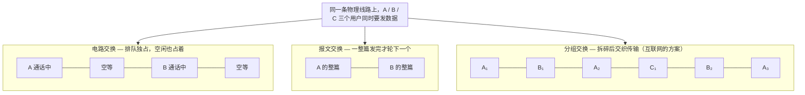

---

**网络协议三要素**

协议本质：通信双方共同遵守的规则。就像两个人对话，必须约定用哪种语言、每句话代表什么意思、谁先开口。

- **语法** ：数据长什么样——字段顺序、长度、格式，例如“姓名:张三;年龄:20”。相当于约定对话的词汇和文法。
- **语义** ：数据表示什么含义——例如HTTP状态码“404”，语法正确，语义是资源未找到。相当于约定每句话的动作意图。
- **同步** ：谁先发、后发、何时发——例如TCP三次握手的SYN→SYN+ACK→ACK顺序不能乱。相当于约定对话的节奏和轮次。

---

**计算机网络的定义和分类**

**计算机网络的定义**

- 干什么：将地理位置不同、功能独立的多台计算机及外部设备，通过通信线路连接起来，在网络操作系统、协议的管理与协调下，实现**资源共享**和**信息传递**的系统。
- 简单理解：用通信线缆把独立电脑连起来，让它们可以互传数据、共享打印机或互联网出口。

**计算机网络的分类（按覆盖范围）**

| 类型 | 范围 | 典型示例 |
| --- | --- | --- |
| PAN 个域网 | 个人设备周围 | 蓝牙耳机连手机 |
| LAN 局域网 | 房间、楼宇、校园 | 办公室Wi-Fi |
| MAN 城域网 | 城市 | 广电宽带网 |
| WAN 广域网 | 国家或全球 | 互联网 |

关系可以看作嵌套：PAN → LAN → MAN → WAN。

---

**计算机网络的性能指标**

网络好不好用，用下面这些“体检指标”衡量。

- **速率**：单位时间内传输的比特数，单位 bps。好比水管每秒流出多少升水。  
  *重点单位换算*：1 Byte（字节）= 8 bits，1 KB = 1024 B，1 MB = 1024 KB，但速率通常用十进制：1 kbps = 1000 bps，1 Mbps = 1000 kbps。做题时务必注意**大B（字节）和小b（比特）**，文件大小常用Byte，带宽常用bit/s。
- **带宽**：数字信道所能传送的“最高数据率”，单位 bps。可以理解为水管的粗度（最大通水能力），不是当前水流速度。
- **吞吐量**：单位时间内通过某个网络（或链路、接口）的实际数据量。受带宽或拥塞限制，像某条路实际的每小时车流量。
- **时延**：数据从源端到目的端的总花费时间，包含发送时延、传播时延、处理时延、排队时延。好比开车上路，总时间=装车时间+路上行驶+收费站处理+堵车排队。
- **时延带宽积**：时延 × 带宽，结果是以比特为单位的“管道容积”。描述一条链路最多能同时“在路上”容纳多少比特。像高速公路的长途大巴数量：车速慢但路很长（时延大），路上同时跑的车就多。
- **往返时间 RTT**：从发送端发出数据到收到接收端确认的总时间。可以用来判断网络交互的灵敏度。
- **利用率**：信道利用率和网络利用率。利用率越高，说明线路越忙，但时延也会急剧增大——像高速路车流量达到80%就开始龟速。
- **丢包率**：丢失分组占总发送分组的比例。反映网络拥塞程度或链路质量。像快递丢失率，高了肯定有问题。

---

**计算机网络体系结构**

**常见的三种体系结构**

- **OSI七层参考模型**：理论标准，层次清晰，但复杂。从上到下：应用层、表示层、会话层、传输层、网络层、数据链路层、物理层。
- **TCP/IP四层模型**：事实上的工业标准。从上到下：应用层、运输层、网际层、网络接口层。
- **五层原理模型**（教学用）：综合两者，从上到下：应用层、运输层、网络层、数据链路层、物理层。

**层次对比（TCP/IP 与 OSI 对应）**

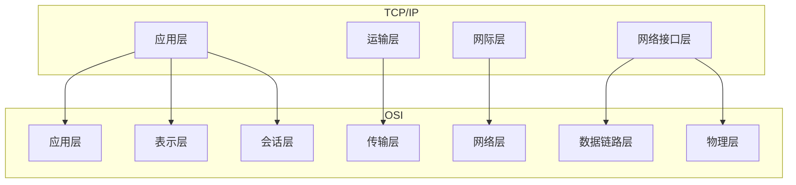

*TCP/IP的应用层合并了OSI的高三层，网络接口层合并了低两层。*

**分层的必要性**

- 干什么：把庞大复杂的网络问题分解成若干相对独立的子问题，每层只负责特定功能，下层为上层提供服务。
- 优点：各层独立发展，修改某一层不影响其他层；便于标准化；容易教学和理解。
- 比喻：像邮政系统，写信的人不用管货车走哪条路，只需按地址封装好交给邮局；运输部门不用看懂信件内容。

**分层思想举例**：你在浏览器输入网址 www.example.com
- 应用层：构造HTTP请求报文
- 运输层：封装为TCP报文段，添加端口号
- 网络层：封装为IP数据报，添加目的IP地址
- 数据链路层：封装为帧，添加MAC地址
- 物理层：转换成比特流，通过网线/无线电发送

**体系结构专用术语**

- **实体**：每一层中完成该层功能的软件/硬件模块。对等层之间仿佛在直接对话。
- **协议**：控制两个对等实体通信的规则集合，即同层间的约定。协议三要素就是语法、语义、同步。
- **服务**：下层为紧邻的上层提供的功能调用接口。是垂直的。
- **服务访问点 SAP**：上下层实体间交换信息的地方，如运输层的端口号、网络层的IP地址等。
- **数据单元**：  
  应用层——报文  
  运输层——报文段（TCP）或用户数据报（UDP）  
  网络层——IP数据报（或包）  
  数据链路层——帧  
  物理层——比特

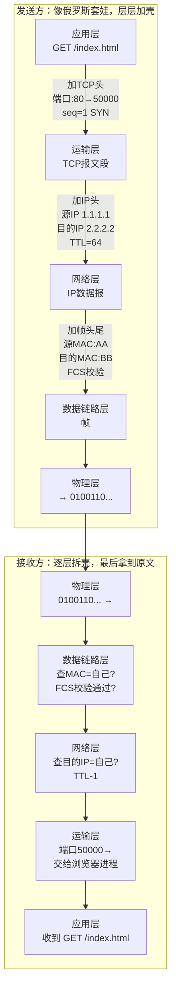

*直观理解：每层只关心自己那层的信息，下层看不懂上层的内容——就像邮局只看信封，不拆信。*

---

**物理层相关概念补充**

**同步传输与异步传输**

- 核心问题：接收方怎么知道一个比特单元或一个字符从哪开始、到哪结束？
- **异步传输**：每个字符独立发送，用起始位和停止位包裹。像说话时每个字后面都顿一下。  
  优点：简单，不需要严格时钟同步。  
  缺点：额外开销大（每个字符都有起止位）。
- **同步传输**：把多个字符组成数据块，在块前面加上同步字符，收发双方靠时钟同步连续收发。  
  优点：传输效率高。  
  缺点：实现复杂。

**曼彻斯特编码**

- 为什么需要：若连续发送很多0或1，接收方可能丢失时钟同步。
- 干什么：每个码元中间强制发生一次跳变，用跳变方向表示0或1。低→高为1，高→低为0。
- 优点：自带同步时钟，抗干扰能力强。
- 缺点：带宽利用率低（信号变化频率是数据率的两倍）。

**ASK、FSK、PSK（数字调制）**

- 问题：计算机的数字信号要放到电话线、无线等模拟信道上传，需要“骑”到载波上。
- **ASK 幅移键控**：改变振幅，大波=1，小波=0。简单但易受噪声干扰，像用灯光强弱传信息，雾天容易误判。
- **FSK 频移键控**：改变频率，高频=1，低频=0。抗干扰较强，但占用的频带较宽，像用两种声调的哨子。
- **PSK 相移键控**：改变相位，比如0°表示0，180°表示1。效率高，现代通信广泛使用，但对解调电路要求高。

**四种复用技术**

多用户共享一条物理链路。

- **FDM 频分复用**：把总频带切成多个子频带，每个用户各占一段，同时传输。就像收音机各个频道同时广播。
- **TDM 时分复用**：把时间切成等长的时间片，用户轮流占用。如同会议室排期，每个人在规定时段使用。
- **WDM 波分复用**：光纤里用不同波长的光同时传数据，本质是光域的频分复用，可看成一条光纤同时亮红、绿、蓝三种激光。
- **CDM 码分复用**：所有用户同一时间同一频带发送，靠不同的正交码型区分。如同一个房间里多人用不同语言同时交谈，接收者只听懂其中一种。

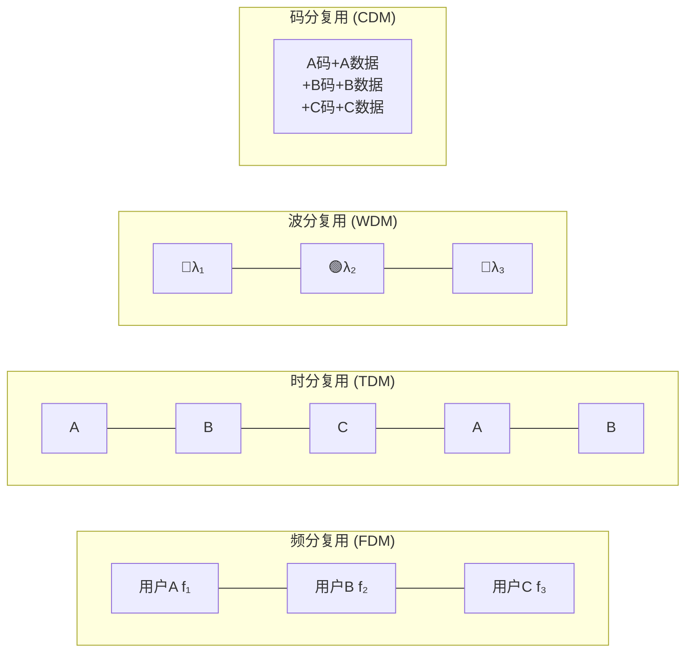

*FDM=分频段、TDM=分时间片、WDM=分波长（光频段）、CDM=分码型——四种"分家"方式，本质都是共享一条物理线路。*

---


**数据链路层重点**

**封装成帧、透明传输、差错检测**

- **封装成帧**：在原始数据前后添加帧头和帧尾，划定帧的边界，像把散信纸放进信封并封口。
- **透明传输**：如果数据里恰好出现与帧边界标志相同的比特组合，必须用转义字符处理，使接收方能恢复原数据，好比信中若出现“到此为止”的字眼，要加注“这是正文，不是真的结束”。
- **差错检测（CRC）**：通过多项式运算生成校验码，接收端检测比特是否在传输中翻转。CRC能高效查出错误，但不纠错，只报警。

**共享式以太网（3.4）**

**网络适配器和MAC地址**

- **网络适配器（网卡）**：连接计算机和网络的接口设备，负责成帧、MAC寻址和介质访问控制。
- **MAC地址**：48位全球唯一的硬件地址，固化在网卡ROM中，用于数据链路层寻址，常表示为六组十六进制数（如 00:1A:2B:3C:4D:5E）。可以比喻为每个网络设备的“身份证号”，只在本网段内有效。

**CSMA/CD 协议（含 CRC 差错检测）**

- 为什么出现：早期总线型以太网共享同一条同轴电缆，多台机器同时发数据必然碰撞。
- 干什么：**先听后说，边听边说，冲突则停，随机后退再发。**
  - 载波监听：发之前先检测线路上是否有信号。
  - 碰撞检测：发送的同时继续监听，一旦发现信号叠加畸变（碰撞），立即停发。
  - 退避算法：碰撞后各自随机等待一段时间再尝试重发。
- CRC负责检测碰撞或被干扰导致的错误，发现错误帧直接丢弃。
- 优点：实现简单，适合早期总线网络。
- 缺点：在网络负载高时碰撞频繁，有效吞吐量下降严重。
- 比喻：几个人在一条窄巷子里用对讲机说话，出口前先听一下有没有人说话，如果两人同时开口导致听不清，就都闭嘴，各自退后随机时长再尝试。

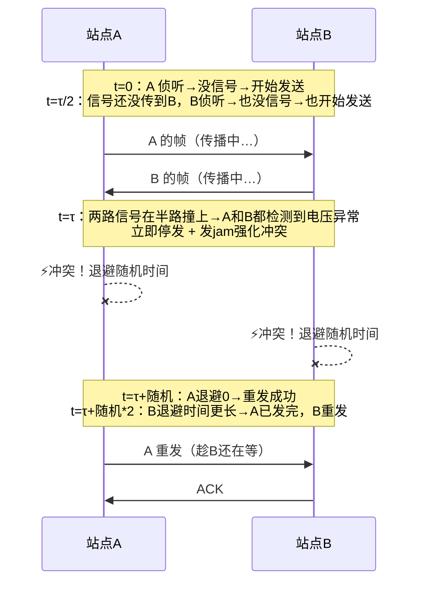

*核心理解：CD（碰撞检测）的精髓——嘴说话的时候耳朵还竖着，一听见撞车立刻闭嘴。*

**使用集线器的共享式以太网 & 在物理层扩展以太网**

- **集线器（Hub）**：物理层设备，收到一个端口的比特信号后，简单复制并转发到其他所有端口。用集线器连接起来的所有主机处于同一个**碰撞域**，仍然共享带宽，工作机制还是CSMA/CD。
- **在物理层扩展**：通过集线器级联或光纤调制解调器延长传输距离，但不隔离碰撞域。相当于把同一条总线拉得更长或增加更多接头，碰撞机会反而增大。

**在数据链路层扩展以太网**

- **网桥/交换机**：工作在数据链路层，能根据MAC地址做出转发决策，将网络划分成更小的碰撞域。相比Hub，交换机让每个端口基本成为独立碰撞域，大幅减少碰撞。网桥和交换机可以根据MAC地址表有选择地转发帧，如果目的地址在同一端口侧则不转发到其他端口。

**交换式以太网（3.5）**

**以太网交换机**

- 干什么：本质是多端口网桥，能够自学习源MAC地址，建立转发表，根据目的MAC地址精准转发帧，支持多个端口同时并行通信。
- 工作方式：存储转发或直通交换。
- 优点：每个端口独享带宽，无碰撞（全双工模式下），能隔离碰撞域。

**共享式以太网与交换式以太网的对比**

- 共享式：用集线器，半双工，带宽大家分，随时可能碰撞，核心协议是CSMA/CD。
- 交换式：用交换机，可全双工，端口带宽独享，不需要CSMA/CD（在全双工时无碰撞），效率高很多。

比喻：共享式像对讲机群聊，一次只能一个人说；交换式像电话交换机，两两可以同时通话且互不干扰。

**虚拟局域网 VLAN（3.7）**

- **为什么需要**：一个物理交换机上接了不同部门的电脑，如果不隔开，所有机器都在同一个广播域，广播包泛滥且安全无隔离。
- **概述**：VLAN通过逻辑划分，将一个物理局域网分割成多个相互隔离的虚拟局域网，每个VLAN是一个独立的广播域。
- **实现机制**：
  - 基于端口的VLAN：最常用。将交换机某些端口划归VLAN 10，另一些划归VLAN 20，端口间的转发只限同一VLAN。
  - 基于MAC地址的VLAN：按网卡地址决定归属。
  - 跨交换机的VLAN：用**802.1Q标签**在帧头插入VLAN ID，实现跨交换机的VLAN透传。Trunk端口承载多个VLAN流量。
- 优点：提高安全性，隔离广播，灵活管理。

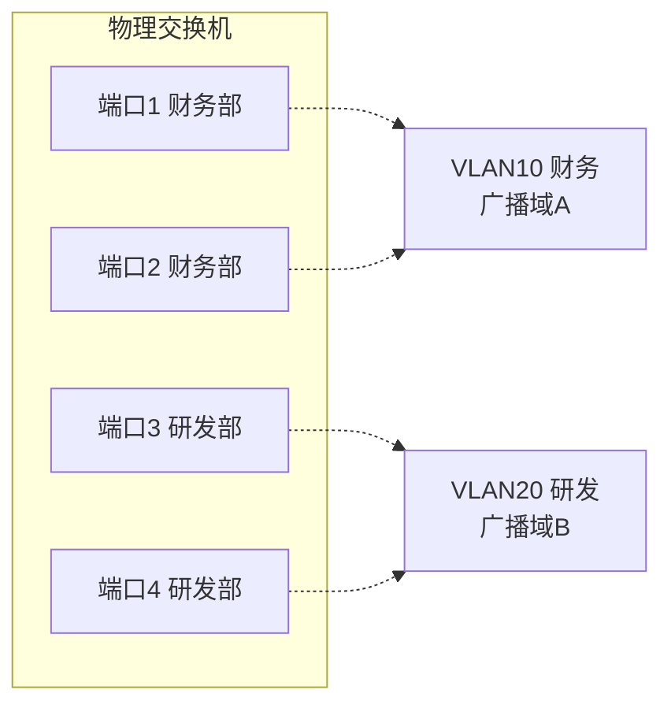

*同一个物理交换机，端口1/2 组成 VLAN10，端口3/4 组成 VLAN20——虽然插在同一台机器上，但广播包只在各自的 VLAN 内传播，互不干扰。*

**STP 生成树协议**

- 问题：交换机之间冗余连接形成环路，造成广播风暴和MAC表震荡。
- 干什么：自动阻塞部分冗余链路，将网络物理拓扑裁剪成无环的逻辑树形结构。
- 过程：选举根桥，然后每个交换机确定到根的最短路径，阻塞其他冗余端口。
- 优点：消除环路，自动切换备用链路。缺点：部分链路闲置，浪费带宽。

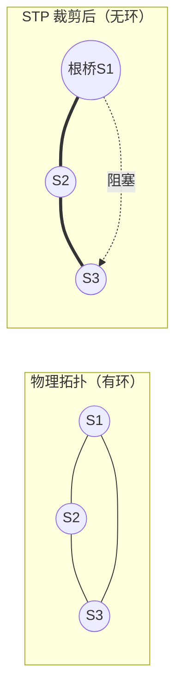

*左：三台交换机物理上连成环→广播风暴。右：STP 选举 S1 为根桥，阻塞 S1-S3 之间的冗余链路，逻辑上变回无环树。备用链路被阻塞但始终在线，一旦主干断就自动激活。*

---

**传输层可靠传输基础（停等、GBN、SR）**

*这些协议思想同样适用于链路层和传输层。*

- **停止等待**：发一个包→等确认→再发下一个。优点：最简单。缺点：信道利用率极低，大量时间在等待。
- **GBN 后退N帧**：连续发送窗口内的多个包，一旦某个包出错，从出错包开始重传后续所有包。实现较简单，但错误时重传量大，浪费带宽。
- **SR 选择重传**：只重传出错的那些包，缓存正确收到的后续包。效率最高，但接收方需要缓冲且需更多处理。

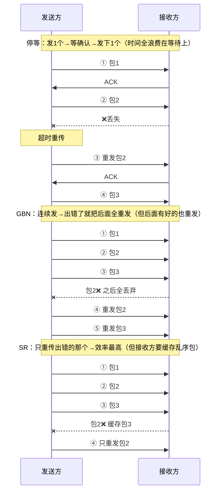

---

**网络层核心（第4章）**

**网络层两种服务**

- **虚电路服务**：类似电话网络，通信前先建立逻辑连接路径，分组沿同一路由顺序到达。适合需保证质量的场景，但网络复杂时不太灵活。
- **数据报服务**：互联网采用的方式。每个分组独立选路，可能走不同路径，不保证顺序和时限。网络结构简单，健壮性强，就像每封信独立走邮路，可能先后顺序错乱，但邮局本身不需为每对通信者维护状态。

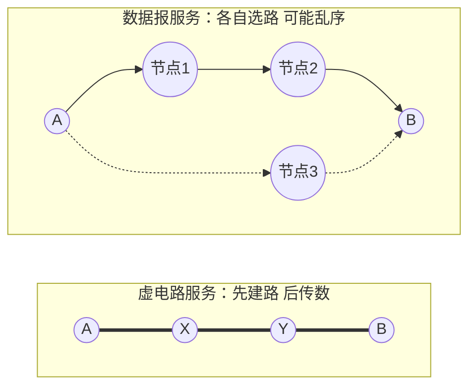

*虚电路=固定的路（像火车轨道），数据报=各自找路（像快递，每件走不同路线）。互联网选择了数据报——简单、健壮。*

**IPv4地址及编址方法（核心）**

- **子网划分与借位**：将标准IP地址的主机号部分“借”若干位作为子网号，从而将一个大的网络分成多个小子网。核心计算：给定网络地址和子网掩码，求出子网个数、每个子网的主机数、子网地址范围等。关键公式：借 n 位，子网数 = 2^n，每个子网可用主机数 = 2^(剩余主机位数) - 2（扣除网络地址和广播地址）。
- **CIDR 无分类编址**：取消传统A、B、C类限制，用斜线记法（如 /22）自由指定前缀长度，支持路由聚合，提高地址利用率。
- **IPv4地址与MAC地址**：IP地址用于网络层寻址，可以跨网络；MAC地址用于数据链路层同一网段内寻址。数据报在跨路由器时，源目IP不变，但每跳的MAC地址会更换。

**ARP 地址解析协议**

- 干什么：已知目标IP地址，求下一跳接口的MAC地址。
- 工作过程：主机在局域网内广播ARP请求（“谁是192.168.1.1？告诉你的MAC给我”），目标主机单播ARP响应。得到映射关系后缓存到ARP表。

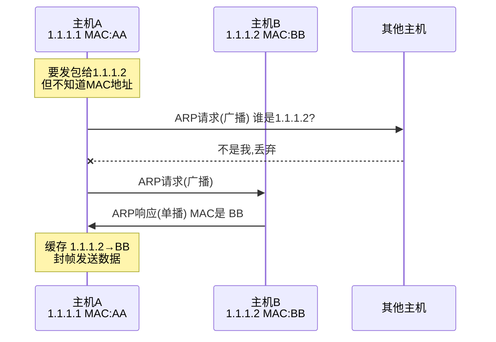

**IP数据报的首部格式**

- 干什么：承载网络层控制信息。重要字段：版本（IPv4）、首部长度、服务类型、总长度、标识、标志、片偏移（用于分片重组）、生存时间TTL（防兜圈）、协议（上层协议TCP/UDP）、首部校验和、源地址、目的地址。TTL每经过一个路由器减1，减到0则丢弃。

**IP数据报的发送和转发过程**

- 主机发送：判断目的IP是否同网段。同网段则直接交付（用ARP获得目的MAC）；不同网段则发给默认网关（路由器）。
- 路由器转发：收到数据报，根据路由表查找匹配项，选择下一跳接口，封装新帧头（新MAC地址），转发出去。

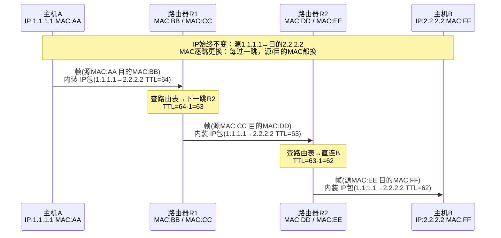

*核心理解：IP地址是"最终地址"全程不变；MAC地址是"下一跳地址"每跳都换。*

**静态路由配置**

- **直连路由**：路由器接口所在网络自动加入路由表，无需配置。
- **非直连路由**：目的网络不直接与路由器相连，需要手工添加静态路由或通过动态路由协议学习。
- **默认路由**：0.0.0.0/0 匹配所有目的地址，当路由表找不到更具体匹配项时使用，常配置指向出口网关。
- **特定主机路由**：为单个主机IP指定专门路由，用于特殊情况测试或安全策略。
- 实操：在路由器接口配置IP并开启，使用 `ip route 目标网络 掩码 下一跳` 添加静态路由。

**动态路由协议 RIP 与 OSPF**

- **RIP 路由信息协议**：基于距离向量的内部网关协议，用跳数做度量，最大15跳。算法简单，通过周期性广播路由表学习。缺点是收敛慢，不适合大型网络。像邻居之间互相告知“我家到某地只需X步”，逐渐摸清全局。
- **OSPF 开放最短路径优先**：基于链路状态的内部网关协议，使用最短路径优先算法（Dijkstra）。每台路由器维护整个网络的拓扑数据库，计算以自己为根的最优树。收敛快、支持分层区域划分，适用于大型网络。像每个人都拿到一张城市地图，根据路况自己算最佳路径。

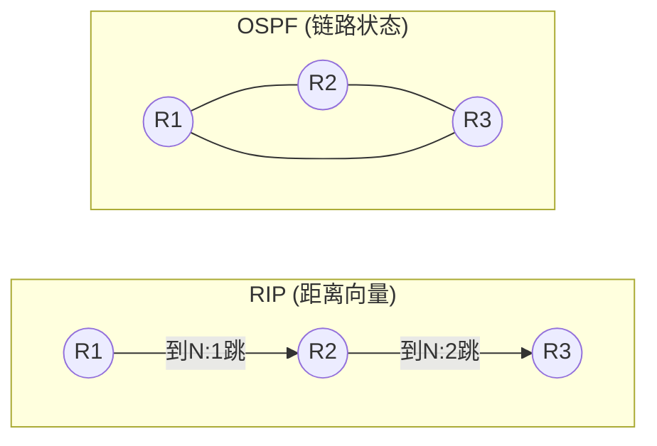

*RIP：邻居之间互相传"我到某网几步"（基于传闻，收敛慢，最多15跳）→ OSPF：每人拿到全局拓扑图，自己算最短路径（Dijkstra，收敛快，适合大网）*

---

**传输层（第5章）**

**UDP 与 TCP 全面对比**

| 对比项 | TCP | UDP |
| --- | --- | --- |
| 连接 | 面向连接（三次握手建立） | 无连接，直接发送 |
| 可靠性 | 可靠，保证顺序、无丢失、无重复 | 不可靠，尽力交付 |
| 流量/拥塞控制 | 有（滑动窗口、重传、拥塞控制） | 无，应用层自行处理 |
| 首部开销 | 20~60字节 | 8字节 |
| 传输效率 | 较低，因确认、重传等机制 | 高，实时性好 |
| 适用场景 | 文件传输、网页、邮件 | 视频直播、语音通话、DNS、DHCP |

比喻：TCP像打电话，先拨通确认对方在听，说话内容按顺序保证传到；UDP像寄明信片，塞进邮箱就不管了，可能丢失或乱序，但轻便快捷。

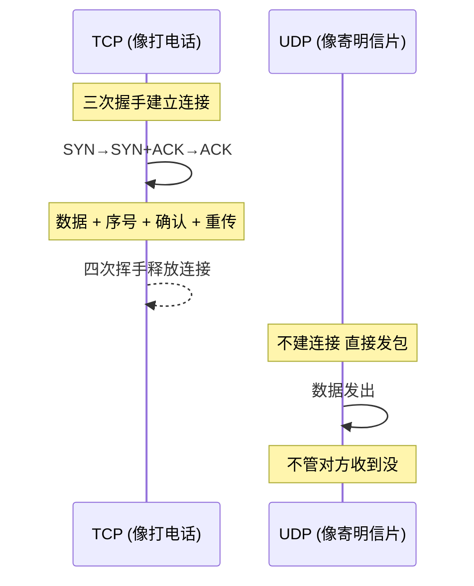

**TCP 三次握手建立连接**

- 目的：同步序列号，确保双方收发能力正常。
- 过程：
  ```mermaid
  sequenceDiagram
      客户端->>服务器: SYN, seq=x
      服务器->>客户端: SYN+ACK, seq=y, ack=x+1
      客户端->>服务器: ACK, ack=y+1
  ```
  三次后两端都确认自己和对方能正常收发。

**TCP 四次挥手释放连接**

- 原因：TCP是全双工的，每个方向需单独关闭。
- 过程：
  ```mermaid
  sequenceDiagram
      A->>B: FIN, seq=u
      B->>A: ACK, ack=u+1
      B->>A: FIN, seq=v
      A->>B: ACK, ack=v+1
  ```
  FIN发起方进入TIME_WAIT等待2MSL，确保最后的ACK能到达。

**TCP 可靠传输核心：重传机制**

- 干什么：保证数据块无差错、不丢失、按序到达。
- **超时重传**：每发送一个报文段启动一个计时器，若在超时时间RTO内未收到确认，就重传。RTO需根据RTT动态估算。
- **快速重传**：发送方收到3个相同的冗余ACK（表明接收方缺失了某个段）时，立即重传缺失的段，不用等超时，提高效率。
- 配合**滑动窗口**实现流量控制，**拥塞控制**算法（慢启动、拥塞避免、快速恢复）则防止网络负担过重，但拥塞控制细节不在本次重点列表内。

---

**应用层（第6章）重点小节**

**DHCP 动态主机配置协议**

- **作用**：让主机自动获取IP地址、子网掩码、默认网关、DNS服务器等配置，免去手工设置。
- **工作过程**（简化为发现、提供、请求、确认四个阶段）：
  ```mermaid
  sequenceDiagram
      客户端->>服务器: DHCP DISCOVER (广播)
      服务器->>客户端: DHCP OFFER
      客户端->>服务器: DHCP REQUEST (选择某个提供)
      服务器->>客户端: DHCP ACK (确认租约)
  ```
  像入住酒店时前台自动分配房间号和wifi信息。

**DNS 域名系统**

- **作用**：将人类易记的域名（www.example.com）转换为机器可读的IP地址。
- **域名结构**：层次树状，从根域、顶级域（.com, .cn）、二级域一直到主机。
- **域名服务器**：根域名服务器、顶级域名服务器、权威域名服务器等，分级协作。
- **解析过程**：递归查询与迭代查询结合。本机先查缓存，若无则向本地DNS查询，本地DNS替客户端完成后续逐级查询。

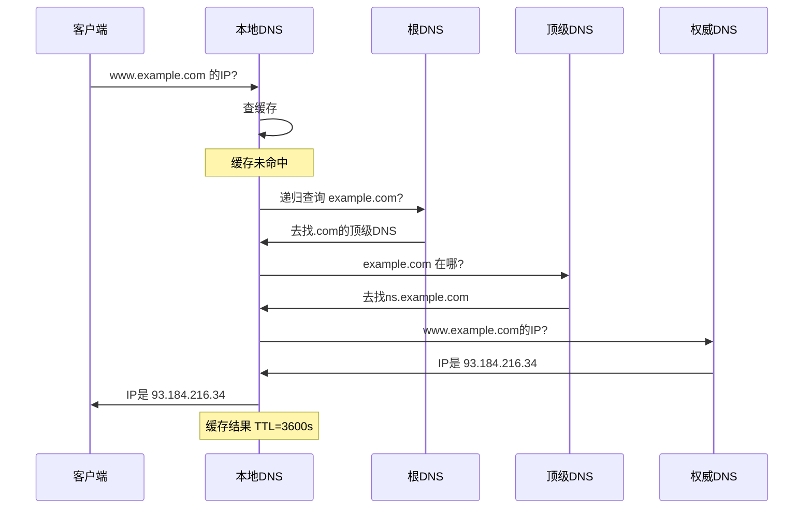
- **高速缓存**：各级DNS都会缓存解析结果，减少全网查询次数，提高响应速度。缓存有TTL限制，过期刷新。

**电子邮件系统**

- **组成**：用户代理（收发邮件的客户端）、邮件服务器、邮件传输协议。
- **SMTP**：用于发送邮件，或邮件服务器之间的转发。采用推的方式，命令/响应式交互。
- **邮件信息格式**：信封（传输信息）和内容（RFC 5322定义的首部+正文）。
- **MIME**：扩展邮件格式，使其支持非ASCII文本、图片、音频、附件等。
- **POP3**：从邮件服务器把邮件下载到本地，通常下载后服务器端删除。
- **IMAP4**：管理服务器上的邮件，可在线阅读、标记、多设备同步，不删除服务器副本。
- **基于万维网的电子邮件**：通过浏览器用HTTP收发邮件，后台邮件服务器之间仍用SMTP。

比喻：传统邮件系统，SMTP是邮局的转送卡车，POP3/IMAP是收件人收取信件的方式（取回家 vs 在邮箱管理）。

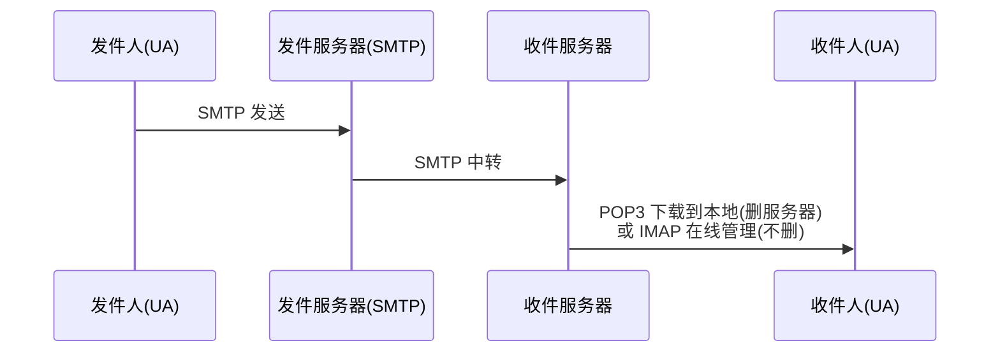

**万维网 WWW**

- **URL 统一资源定位符**：<协议>://<主机>:<端口>/<路径>，唯一标识网络资源位置。
- **HTTP 超文本传输协议**：万维网应用层协议，基于TCP，通常使用80端口。无状态协议。
- **Cookie 机制**：为弥补HTTP无状态，服务器在客户端存储小文本文件，用于会话保持、用户跟踪，像餐馆给顾客的号码牌，便于下次识别。
- **万维网缓存与代理服务器**：代理服务器位于客户端与服务器之间，缓存经常访问的网页。用户请求时先查代理缓存，命中则直接返回，减少网络带宽和延迟。像小区里的快递驿站代收常见包裹。

---

最后，整个网络的分层逻辑主线依然是最核心的：

**物理层** 负责将比特转换成物理信号传过去  
→ **数据链路层** 负责相邻节点间可靠/有效的帧传输  
→ **网络层** 负责跨网络选路和转发  
→ **运输层** 负责进程到进程的可靠/实时通信  
→ **应用层** 向用户提供具体网络服务

考试大题基本都沿着这条主线展开，你可以在脑海中用这一串流程把各知识点串起来。


---


---

# 老师布置的作业

**作业1：无分类编址CIDR计算**
给定的无分类编址的IPv4地址为206.0.64.8/18，请分别求出：
1. 地址块中的最小地址
2. 地址块中的最大地址
3. 地址块中的地址数量
4. 地址块中聚合某类网络（A类、B类、C类）的数量
5. 地址掩码

> 已知地址：206.0.64.8/18
> 其中 `/18` 表示网络号占18位，主机号占32−18=14位。

> 第一步：求地址掩码
> `/18` 表示前18位全为1，后14位全为0。
> 写成二进制：
>
> $$
> 11111111.11111111.11000000.00000000
> $$
>
> 每8位转换成十进制：
>
> * 11111111 = 255
> * 11111111 = 255
> * 11000000 = 192
> * 00000000 = 0
>
> 所以地址掩码为：
>
> $$
> 255.255.192.0
> $$

> 第二步：求最小地址（网络地址）
> 方法：IP地址 与 地址掩码进行按位与运算。
>
> 原IP地址：
>
> $$
> 206.0.64.8
> $$
>
> 转换成二进制：
>
> $$
> 11001110.00000000.01000000.00001000
> $$
>
> 掩码二进制：
>
> $$
> 11111111.11111111.11000000.00000000
> $$
>
> 进行按位与运算：
>
> $$
> 11001110.00000000.01000000.00001000
> $$
>
> $$
> \land
> $$
>
> $$
> 11111111.11111111.11000000.00000000
> $$
>
> 得到：
>
> $$
> 11001110.00000000.01000000.00000000
> $$
>
> 转换成十进制：
>
> $$
> 206.0.64.0
> $$
>
> 所以最小地址（网络地址）为：
>
> $$
> 206.0.64.0
> $$

> 第三步：求最大地址（广播地址）
> 方法：把主机号部分全部变成1。
>
> `/18` 说明：
>
> * 前18位固定为网络位
> * 后14位全部改成1
>
> 网络地址二进制：
>
> $$
> 11001110.00000000.01000000.00000000
> $$
>
> 后14位改成1：
>
> $$
> 11001110.00000000.01111111.11111111
> $$
>
> 转换成十进制：
>
> $$
> 206.0.127.255
> $$
>
> 所以最大地址（广播地址）为：
>
> $$
> 206.0.127.255
> $$

> 第四步：求地址数量
> IPv4总共32位。
> 主机位数量：
>
> $$
> 32-18=14
> $$
>
> 地址总数量公式：
>
> $$
> 2^{主机位数}
> $$
>
> 代入：
>
> 2^{14}=16384
>
> 所以地址块中的地址数量为：
>
> $$
> 16384
> $$

> 第五步：求聚合的A类、B类、C类网络数量
>
> **核心概念："聚合"的意思是这个 /18 地址块里，能完整装下多少个不同类别的网络。**
>
> 先列出各类网络的"大小"——前缀数字越小，网络越大：
>
> | 类别 | 默认前缀 | 含义 | 地址数 |
> |:---|:---|:---|:---|
> | A类 | /8 | 前 8 位是网络号 | 2²⁴ ≈ 1677 万 |
> | B类 | /16 | 前 16 位是网络号 | 2¹⁶ = 65536 |
> | C类 | /24 | 前 24 位是网络号 | 2⁸ = 256 |
> | **本题地址块** | **/18** | **前 18 位是网络号** | **2¹⁴ = 16384** |
>
> 现在拿本题的 /18 块跟每种类型比大小：
>
> **（1）能不能聚合 A 类？— 0**
>
> A 类网络是 /8，包含 1677 万个地址。本题 /18 只有 16384 个地址。
>
> 用一个 16384 的小容器去"装"一个 1677 万的大容器 → 装不下。
>
> 所以：**0 个**。
>
> **（2）能不能聚合 B 类？— 0**
>
> B 类网络是 /16，包含 65536 个地址。本题 /18 只有 16384 个。
>
> 同样，16384 < 65536 → 一个完整的 B 类网络都装不下。
>
> 这道题的地址块恰好落在 `206.0.0.0/16` 这个 B 类范围内，但它只占其中 1/4，不是完整 B 类。
>
> 所以：**0 个**。
>
> **（3）能不能聚合 C 类？— 64**
>
> C 类网络是 /24，每个只有 256 个地址。本题 /18 有 16384 个地址，比 C 类大得多。
>
> 所以能装下很多个 C 类。多少个？用公式：
>
> $$
> \text{数量} = 2^{\,(\text{C类前缀} - \text{本题前缀})}
> = 2^{\,24-18}
> = 2^{6}
> = 64
> $$
>
> **为什么要这样算？** 因为每增加 1 位前缀，地址块就"切成两半"（容量减半）；反之每减少 1 位，容量翻倍。从 /24 到 /18，前缀减少了 6 位，容量翻了 2⁶ = 64 倍。所以一个 /18 块恰好等于 64 个 /24 块。
>
> 所以：**64 个 C 类网络**。


> 最终答案汇总：
>
> 1. 最小地址：
>
> $$
> 206.0.64.0
> $$
>
> 2. 最大地址：
>
> $$
> 206.0.127.255
> $$
>
> 3. 地址数量：
>
> $$
> 16384
> $$
>
> 4. 聚合网络数量：
>
> * A类：0
>
> * B类：0
>
> * C类：64
>
> 5. 地址掩码：
>
> $$
> 255.255.192.0
> $$


**作业2：IPv4地址应用规划（定长+变长子网掩码）**
假设地址块为192.168.252.0/24，请分别使用定长子网掩码和变长子网掩码给下图所示的小型互联网中的各设备分配IP地址：
- 网络1：60台主机
- 网络2：20台主机
- 网络3：10台主机
- 网络4：路由器间链路（2台设备）
> 已知地址块：
>
> $$
> 192.168.252.0/24
> $$
>
> `/24` 表示：
>
> * 网络号24位
> * 主机号8位
>
> 总地址数量：
>
> 2^8=256
>
> 即：
>
> $$
> 192.168.252.0 \sim 192.168.252.255
> $$

---

> 一、定长子网掩码（FLSM）划分
>
> **核心**：所有子网掩码相同。以最大子网（60台）为准，选一个能装下它的最小掩码。
>
> ---
>
> **第一步：确定子网掩码**
>
> ```
> 2^n - 2 ≥ 60
> 2^5 - 2 = 30  ❌ 不够
> 2^6 - 2 = 62  ✅ 刚好
> → 主机位 n = 6 → 前缀 = 32 - 6 = /26
> ```
>
> 把地址写成二进制，`|` 左边是网络位（借了 2 位子网号），右边是主机位：
>
> ```
> 192.168.252 . 0 0 0 0 0 0 0 0
>             |   子网(2)   |主机(6)|
>             └─ 借位 → /26 ─┘
> ```
>
> 掩码：`11111111.11111111.11111111.11|000000` = **255.255.255.192**
>
> ---
>
> **第二步：4 个子网的二进制推导**
>
> 借 2 位子网位，共 `2² = 4` 个子网号（00/01/10/11），每个子网 64 个地址。
>
> | 子网号 | 最后一个字节(二进制) | 网络地址 | 广播地址 | 可用范围 |
> |:---|:---|:---|:---|:---|
> | 00 | `00\|000000` | **.0** | **.63** | .1 ~ .62 |
> | 01 | `01\|000000` | **.64** | **.127** | .65 ~ .126 |
> | 10 | `10\|000000` | **.128** | **.191** | .129 ~ .190 |
> | 11 | `11\|000000` | **.192** | **.255** | .193 ~ .254 |
>
> *规律：网络地址 = 子网号 × 64，广播 = 网络地址 + 63*
>
> ---
>
> **第三步：分配结果**
>
> | 子网 | 网络地址 | 可用范围 | 广播地址 | 掩码 | 浪费 |
> |:---|:---|:---|:---|:---|:---|
> | 网络1(60台) | 192.168.252.0 | .1 ~ .62 | .63 | /26 | 2 |
> | 网络2(20台) | 192.168.252.64 | .65 ~ .126 | .127 | /26 | 42 |
> | 网络3(10台) | 192.168.252.128 | .129 ~ .190 | .191 | /26 | 52 |
> | 网络4(2台) | 192.168.252.192 | .193 ~ .254 | .255 | /26 | 60 |
>
> FLSM 的本质：选一个"最大号"统一尺码——网络1刚好，网络2/3/4太大，浪费严重。
---

---

> 二、变长子网掩码（VLSM）划分
>
> **核心**：不同子网用不同掩码——网络需要多少主机就分多大块，不像 FLSM 一视同仁。
>
> ---
>
> **第一步：为每个网络选定前缀**
>
> 从大到小排序，逐个适配：
>
> | 网络 | 需主机 | 2ⁿ−2 ≥ 需 | n | 前缀 | 块大小 |
> |:---|:---|:---|:---|:---|:---|
> | 网络1 | 60 | 2⁶−2=62 ✅ | 6 | **/26** | 64 |
> | 网络2 | 20 | 2⁵−2=30 ✅ | 5 | **/27** | 32 |
> | 网络3 | 10 | 2⁴−2=14 ✅ | 4 | **/28** | 16 |
> | 网络4 | 2 | 2²−2=2 ✅ | 2 | **/30** | 4 |
>
> ---
>
> **第二步：用二进制看顺序切分**
>
> 从 0 开始，每个子网依块大小连续占用。`|` 位置 = 每种子网的网络/主机分界。
>
> ```
>  192.168.252 . 0  0  0  0  0  0  0  0
>  网络1 /26   |     子网     |   主机    |    0  ~ 63   (64个)
>  网络2 /27   |      子网      |  主机   |    64 ~ 95   (32个)
>  网络3 /28   |       子网       | 主机  |    96 ~ 111  (16个)
>  网络4 /30   |         子网         |主|    112 ~ 115 (4个)
>  剩余未分配                                         116 ~ 255
> ```
>
> 二进制推导 —— 注意 `|` 位置不同（因为掩码不同）：
>
> ```
>  .00|000000  = 0    (网络1起始)        .00|111111  = 63   (网络1广播)
>  .010|00000  = 64   (网络2起始)        .010|11111  = 95   (网络2广播)
>  .0110|0000  = 96   (网络3起始)        .0110|1111  = 111  (网络3广播)
>  .01110|00   = 112  (网络4起始)        .01110|11   = 115  (网络4广播)
> ```
>
> ---
>
> **第三步：结果表**
>
> | 网络 | 前缀 | 网络地址 | 可用范围 | 广播地址 | 消耗 |
> |:---|:---|:---|:---|:---|:---|
> | 网络1 | /26 | 192.168.252.0 | .1 ~ .62 | .63 | 64 |
> | 网络2 | /27 | 192.168.252.64 | .65 ~ .94 | .95 | 32 |
> | 网络3 | /28 | 192.168.252.96 | .97 ~ .110 | .111 | 16 |
> | 网络4 | /30 | 192.168.252.112 | .113 ~ .114 | .115 | 4 |
> | **已用** | | | | | **116** |
> | **剩余** | | | | | **140** |
>
> ---
>
> **FLSM vs VLSM 一图对比**
>
> ```
>  FLSM (/26 统一):  [0=======63][64======127][128======191][192======255]  全用光
>  VLSM (混合掩码):  [0=======63][64====95][96===111][112115][116=== 255 空闲]
>                    网络1(60)   网络2(20) 网络3(10) 网4(2)   ← 省了140个!
> ```
>
> VLSM 的价值：同一张 /24，FLSM 只能搭 4 个等大子网且大量浪费；VLSM 按需分配，省下一半多留给未来。


**作业3：定长子网划分（表格填写）**
202.168.25.0/24，划分出4个子网，填写下表：

| 子网编号 | 网络地址 | 子网掩码 | 广播地址 | 最小可分配的地址 | 最大可分配的地址 |
|----------|----------|----------|----------|------------------|------------------|
| 1        |          |          |          |                  |                  |
| 2        |          |          |          |                  |                  |
| 3        |          |          |          |                  |                  |
| 4        |          |          |          |                  |                  |

> 已知网络：
>
> $$
> 202.168.25.0/24
> $$
>
> 要划分为4个子网。

> 第一步：用二进制看 /24 → /26 的借位
>
> 4 个子网 → 借 2 位子网号（2²=4）。原 /24 → 新 /26。
>
> ```
> 202.168.25 . 0 0 0 0 0 0 0 0
>           |   子网(2)   |主机(6)|
>           └─ 借位 → /26 ─┘
> ```
>
> 掩码：`11111111.11111111.11111111.11|000000` = **255.255.255.192**
>
> 第二步：4 个子网的二进制推导
>
> 每个子网 2⁶ = **64** 个地址。
>
> | 子网号 | 最后一个字节(二进制) | 网络地址 | 广播地址 | 可用范围 |
> |:---|:---|:---|:---|:---|
> | 00 | `00\|000000` | **202.168.25.0** | .63 | .1 ~ .62 |
> | 01 | `01\|000000` | **202.168.25.64** | .127 | .65 ~ .126 |
> | 10 | `10\|000000` | **202.168.25.128** | .191 | .129 ~ .190 |
> | 11 | `11\|000000` | **202.168.25.192** | .255 | .193 ~ .254 |
>
> 填入原表：
> 第四个字节按64递增：
>
> * 0
> * 64
> * 128
> * 192

> 表格填写如下：

| 子网编号 | 网络地址           | 子网掩码                  | 广播地址           | 最小可分配的地址       | 最大可分配的地址       |
| ---- | -------------- | --------------------- | -------------- | -------------- | -------------- |
| 1    | 202.168.25.0   | 255.255.255.192 (/26) | 202.168.25.63  | 202.168.25.1   | 202.168.25.62  |
| 2    | 202.168.25.64  | 255.255.255.192 (/26) | 202.168.25.127 | 202.168.25.65  | 202.168.25.126 |
| 3    | 202.168.25.128 | 255.255.255.192 (/26) | 202.168.25.191 | 202.168.25.129 | 202.168.25.190 |
| 4    | 202.168.25.192 | 255.255.255.192 (/26) | 202.168.25.255 | 202.168.25.193 | 202.168.25.254 |

> 验证规律：
>
> * 网络地址 = 0、64、128、192
> * 广播地址 = 下一个网络地址 − 1
> * 最小可分配地址 = 网络地址 + 1
> * 最大可分配地址 = 广播地址 − 1
>
> 考试时看到“/24划分4个子网”，直接记住：
>
> * 新前缀：/26
> * 步长：64
> * 网络地址：0、64、128、192
>
> 然后依次填写广播地址和主机地址范围即可。

---


---

# 计算机网络实验（华为 eNSP）常用命令汇总

按**实验模块+功能场景**分类整理，标注命令适用视图和核心用途，覆盖考试高频考点。

---

**零、设备基础管理命令（所有实验前置，必考）**

**系统信息与时间配置**

| 命令 | 适用视图 | 核心用途 |
|:---|:---|:---|
| `display version` | 用户视图`<Huawei>` | 查看设备型号、VRP版本、运行时间 |
| `display clock` | 用户视图 | 查看当前系统时间和时区 |
| `clock timezone 时区名 add 08:00:00` | 用户视图 | 设置中国时区（UTC+8），必须先设时区再设时间 |
| `clock datetime HH:MM:SS YYYY-MM-DD` | 用户视图 | 修改系统时间 |

**Console口配置（本地登录管理，高频）**

```
# 进入Console口视图
[R1]user-interface console 0
# 开启密码认证模式，设置密文密码
[R1-ui-console0]authentication-mode password
[R1-ui-console0]set authentication password cipher Huawei@123
# 设置空闲超时时间（默认10分钟）
[R1-ui-console0]idle-timeout 20 0
```

**VTY远程登录配置（Telnet，高频）**

```
# 进入VTY虚拟终端视图（0-4表示同时允许5个用户登录）
[R1]user-interface vty 0 4
# 设置密文登录密码和权限级别（15为最高管理员权限）
[R1-ui-vty0-4]set authentication password cipher Huawei@123
[R1-ui-vty0-4]user privilege level 15
# 查看登录用户
<R1>display users
```

**接口基础配置（补充）**

| 命令 | 适用视图 | 核心用途 |
|:---|:---|:---|
| `interface GigabitEthernet 0/0/0` | 系统视图 | 进入指定物理接口 |
| `ip address IP地址 子网掩码` | 接口视图 | 配置接口IP（支持简写如`24`等价`255.255.255.0`） |
| `description 接口描述` | 接口视图 | 添加接口备注，如`description Connect-to-R2` |
| `display interface g0/0/0` | 任意视图 | 查看接口详细状态（物理/协议状态、MAC、带宽） |
| `shutdown` / `undo shutdown` | 接口视图 | 关闭/开启接口 |

**配置文件管理（必考，区分当前/保存配置）**

| 命令 | 适用视图 | 核心用途 |
|:---|:---|:---|
| `display current-configuration` / `dis cu` | 任意视图 | 查看**当前运行的配置**（内存中，重启后丢失） |
| `display saved-configuration` | 任意视图 | 查看**已保存到闪存的配置**（重启后生效） |
| `save` | 用户视图 | 保存当前配置到闪存 |
| `display startup` | 任意视图 | 查看下次启动使用的系统软件和配置文件 |
| `reset saved-configuration` | 用户视图 | 删除闪存中的配置文件（恢复出厂，重启后生效） |
| `dir` | 用户视图 | 查看闪存中的所有文件 |
| `reboot` | 用户视图 | 重启设备（实验环境选`n`不保存，避免残留配置） |

**一、基础操作与通用测试命令（所有实验必用）**

| 命令 | 适用视图 | 核心用途 |
|:---|:---|:---|
| `system-view` / `sys` | 用户视图`<Huawei>` | 进入系统视图（所有配置的前提） |
| `quit` | 任意视图 | 退回上一级视图 |
| `return` / `Ctrl+Z` | 任意视图 | 直接退回用户视图 |
| `sysname 设备名` | 系统视图`[Huawei]` | 修改设备名称（如`sysname LSW1`） |
| `ping 目标IP地址` | 用户视图/系统视图 | 测试网络连通性 |
| `tracert 目标IP地址` | 用户视图/系统视图 | 追踪数据包传输路径 |
| `ipconfig` | PC/客户端命令行 | 查看PC的IP地址、子网掩码、MAC地址 |
| `arp -a` | PC/客户端命令行 | 查看PC的ARP缓存表 |
| `display this` | 任意视图 | 查看**当前视图下的所有配置**（最常用验证命令） |

**操作技巧（考试提速必备）**

- 命令简写：无歧义时可缩写，如 `display`→`dis`，`interface`→`int`，`GigabitEthernet`→`g`
- Tab 补全：输入命令前缀按 Tab 自动补全
- 问号帮助：输入 `?` 查看当前可用命令，输入 `命令 ?` 查看该命令的参数

**二、交换机MAC地址表管理命令（实验3）**

**基础查看命令**

| 命令 | 适用视图 | 核心用途 |
|:---|:---|:---|
| `display mac-address` | 任意视图 | 查看交换机完整MAC地址表（含动态/静态表项） |
| `display mac-address dynamic` | 任意视图 | 仅查看动态学习的MAC地址表项 |
| `display mac-address static` | 任意视图 | 仅查看手动配置的静态MAC地址表项 |

**静态MAC与端口绑定配置**

| 命令 | 适用视图 | 核心用途 |
|:---|:---|:---|
| `mac-address static 设备MAC地址 接口编号 vlan VLAN号` | 系统视图 | 配置静态MAC地址表项 |
| `undo mac-address static 设备MAC地址 接口编号 vlan VLAN号` | 系统视图 | 删除指定静态MAC地址表项 |
| `mac-address aging-time 秒数` | 系统视图 | 修改动态MAC表项老化时间（默认300秒） |

**三、VLAN基础配置命令（实验4）**

**VLAN创建与删除**

| 命令 | 适用视图 | 核心用途 |
|:---|:---|:---|
| `vlan VLAN号` | 系统视图 | 创建单个VLAN并进入VLAN视图 |
| `vlan batch VLAN号1 VLAN号2` | 系统视图 | 批量创建多个VLAN |
| `undo vlan VLAN号` | 系统视图 | 删除指定VLAN |

**Access端口配置（接入终端）**

```
interface GigabitEthernet 0/0/11
port link-type access
port default vlan 10
```

**Trunk端口配置（交换机间互联）**

```
interface GigabitEthernet 0/0/24
port link-type trunk
port trunk allow-pass vlan 10 30
```

**批量端口加入VLAN（考试高频）**

```
# VLAN视图下批量添加端口
vlan 40
port GigabitEthernet 0/0/17 to GigabitEthernet 0/0/20

# 端口组批量配置
port-group 1
group-member GigabitEthernet 0/0/17 to GigabitEthernet 0/0/20
port link-type access
port default vlan 40
```

**VLAN信息查看**

| 命令 | 适用视图 | 核心用途 |
|:---|:---|:---|
| `display vlan` | 任意视图 | 查看所有VLAN的配置及端口成员 |
| `display vlan VLAN号` | 任意视图 | 查看指定VLAN的详细信息 |
| `display port vlan` | 任意视图 | 查看所有端口的VLAN类型和所属VLAN |

**四、VLANIF接口配置命令（实验5，实现VLAN间三层通信）**

```
interface Vlanif 10
ip address 192.168.10.1 255.255.255.0
```

**补充查看命令**

| 命令 | 适用视图 | 核心用途 |
|:---|:---|:---|
| `display ip interface brief` | 任意视图 | 查看所有三层接口（VLANIF/物理口）的IP状态 |
| `display ip routing-table` | 任意视图 | 查看交换机/路由器的IP路由表 |

**五、静态路由与默认路由配置命令（实验6）**

**静态路由**

```
# ip route-static 目标网段 子网掩码 下一跳IP地址
ip route-static 192.168.80.0 255.255.255.0 192.168.101.2
```

**默认路由（未知网段统一转发）**

```
# ip route-static 0.0.0.0 0.0.0.0 下一跳IP地址
ip route-static 0.0.0.0 0.0.0.0 192.168.101.1
```

**Loopback接口（模拟远端网络）**

```
interface LoopBack 0
ip address 10.1.1.10 255.255.254.0
```

**六、OSPF动态路由配置命令（实验7，单区域OSPF）**

**基本配置**

```
ospf 1 router-id 172.16.101.1
area 0
network 172.16.101.0 0.0.0.255
network 10.1.10.0 0.0.0.255
# 注意：network后接**反掩码**（255.255.255.0的反掩码是0.0.0.255）
```

**OSPF状态查看（考试高频）**

| 命令 | 适用视图 | 核心用途 |
|:---|:---|:---|
| `display ospf peer` | 任意视图 | 查看OSPF邻居关系（验证邻居是否建立成功） |
| `display ospf routing` | 任意视图 | 查看OSPF学习到的路由条目 |
| `display ospf lsdb` | 任意视图 | 查看OSPF链路状态数据库（LSDB） |

**接口启停**

```
interface GigabitEthernet 0/0/0
shutdown
undo shutdown
```

**七、考试高频查看命令速查表（考前必背）**

| 需求 | 命令 |
|:---|:---|
| 查看设备版本和型号 | `display version` |
| 查看当前配置 | `display current-configuration` |
| 查看MAC地址表 | `display mac-address` |
| 查看VLAN配置 | `display vlan` |
| 查看路由表 | `display ip routing-table` |
| 查看接口IP状态 | `display ip interface brief` |
| 查看OSPF邻居 | `display ospf peer` |
| 查看接口详细信息 | `display interface g0/0/0` |

---

# 单选题（视频提供，含答案+解析）

**1-10题**
1. **题目**：以太网采用的发送策略是（）

    A. 站点可随时发送，仅在发送后检测冲突

    B. 站点在发送前需侦听信道，只在信道空闲时发送，之后无需特别操作

    C. 站点采用带冲突检测的CSMA/CD协议进行发送

    D. 站点在获得令牌后发送

    **答案**：C

    > 这道题考的是：以太网里的电脑用什么样的"交通规则"来避免大家抢路口。
    >
    > **C 选项（CSMA/CD）就是正确的"以太网交规"**。可以把以太网想象成一群人在一间没有主持人的大房间里说话。你想说话时，先竖起耳朵听有没有人正在说（载波监听），等你觉得没人了才开口。但问题在于——你开口时，远处的人也以为没人，他也开口了。所以你在说话时耳朵还得保持在线（边发边听），一旦发现有人也在说（冲突检测），立刻闭嘴（停发），然后各自默数随机秒数再重新尝试（退避重发）。这套"先听后发、边发边听、撞了就停、随机重试"的规则就是 CSMA/CD。
    >
    > **三个错误选项各错在哪：**
    >
    > A 说的是"想说就说，发完再检查撞没撞"——这是**纯 ALOHA 协议**。相当于你跟房间里所有人都喊了一大段话，喊完了才问一句"刚才有人也说话了吗？"这种策略在夏威夷那种稀疏无线环境还行，但在拥挤的以太网上效率极低。
    >
    > B 说的是"开口前听一次，但一开口耳朵就聋了"——这是**CSMA 协议**。缺少了最后的"冲突检测"能力，撞车了也不知道，白白把整段话说完，对方听到的却是噪音。
    >
    > D 说的是"拿到令牌才能说话"——这是**令牌环网协议**。一根"发言棒"在电脑之间轮流传，拿到棒子才能开口。虽然绝对不会撞车，但如果棒子丢了，整个网络就瘫痪了。

2. **题目**：邮件发送方采用的协议是（）

    A. POP3

    B. SMTP

    C. IMAP

    D. ICMP

    **答案**：B

    > 这道题考的是：发邮件时，是哪个协议负责把信从你电脑"运"出去的。
    >
    > **B 选项（SMTP）是正确答案**。SMTP 全称"简单邮件传输协议"，它干的事就是——你把邮件写好后点"发送"，它负责把你的信从你的电脑/网页端送到邮件服务器，再从你的邮件服务器送到对方的邮件服务器。可以把它想象成**快递公司的送货车**，它只管"运"这个过程，不管是上门揽件还是跨城运输。
    >
    > **三个错误选项各错在哪：**
    >
    > A（POP3）和 C（IMAP）都是**收邮件**的协议，和发送没关系。POP3 像你跑到快递站把快递搬回家（取完后服务器上就没了），IMAP 像你用手机随时查看云端的快递箱（信件始终在服务器上）。它们的工作时间是"取信"，不是"送信"。
    >
    > D（ICMP）是个完全不同工种——**互联网控制报文协议**。它不运数据，它负责发"你在吗（ping）"、"去不了（目的不可达）"这类网络体检消息。相当于网络世界的**交警**，跟送信完全不沾边。

3. **题目**：连接局域网中的计算机与传输介质的网络连接设备是（）

    A. 路由器

    B. 网卡

    C. 交换机

    D. 集线器

    **答案**：B

    > 这道题考的是：电脑是靠哪块硬件"插上网线"来联网的。
    >
    > **B 选项（网卡）是正确答案**。网卡也叫网络适配器，是电脑内部的一块硬件，它一端接电脑总线（主板），另一端接网线接口。它干两件事：一是把电脑里的数据（二进制的0和1）转换成网线上能跑的电信号/光信号发出去；二是给电脑一个全球唯一的"门牌号"——MAC 地址。可以理解为网卡就是电脑的**网络"身份证"加"嘴巴耳朵"**。
    >
    > **三个错误选项各错在哪：**
    >
    > A（路由器）负责连接**不同**的网络（比如把家里的局域网和互联网连起来），它根据 IP 地址做跨网络转发。它不是让单台电脑"接入"网线的东西，而是让**一个网络**连到**另一个网络**的枢纽。
    >
    > C（交换机）负责连接局域网内部的**多台电脑**，它记住每台电脑网卡的 MAC 地址来做精准转发。它解决的是"很多人互相传数据"，不是"一台电脑怎么插上网线"。
    >
    > D（集线器）和交换机很像但更"傻"——收到任何数据都向所有端口广播一遍。它也解决的是多机互联，不是单机接入。

4. **题目**：170.2.3.255是（）

    A. 受限广播地址

    B. 直接广播地址

    C. 单播地址

    D. 组播地址

    **答案**：B

    > 这道题考的是：IP 地址 `170.2.3.255` 里面的 `255` 意味着什么类型的地址。
    >
    > **B 选项（直接广播地址）是正确答案**。要明白 `170.2.3.255`，得先看懂它怎么分的。`170` 是 B 类地址（128-191 之间），B 类默认前两段是网络号、后两段是主机号。这里第三个字节 `3` 其实是子网号，第四个字节 `255` 是主机号全为1——"主机位全部为1"就是广播的意思。可以想象成你在小区里对着所有住户的广播：**"3栋全体居民注意！"**（指定了哪栋楼，而不是全小区）。
    >
    > **三个错误选项各错在哪：**
    >
    > A（受限广播地址）说的是 **255.255.255.255**——四个字节全是1。它不指定具体网络，相当于你在自己小区喊"全体邻居注意！"路由器听到这种地址不会转发出去，只限本地。
    >
    > C（单播地址）是说 IP 地址的主机位既不全0也不全1，才是发给某台具体电脑的地址。这里的末尾是 255，显然不是。
    >
    > D（组播地址）落在 **224.0.0.0 ~ 239.255.255.255** 这个范围，相当于"只发给广场舞群里的成员"，而不是全体住户。170 开头不属于这个范围。

5. **题目**：Web浏览器向侦听标准端口的Web服务器发出请求之后，在服务器响应的TCP报头中，源端口号是多少（）

    A. 13

    B. 53

    C. 80

    D. 1024

    **答案**：C

    > 这道题考的是：Web 服务器收到请求后，回复的 TCP 包的"寄件人门牌号"是多少。
    >
    > **C 选项（80）是正确答案**。Web 服务器启动后就一直守着 80 端口等别人来找它。你打开浏览器访问一个网站，你的电脑用临时分配的一个随机高位端口（比如 50000）去敲服务器的 80 端口。服务器处理完请求要回信时，TCP 包头里**源端口当然就是它自己的 80**（因为这是它"寄出"的信），而目的端口是你刚才用过的那个临时端口（50000）。可以理解成：**你打 400 客服电话（80 端口），客服回拨你手机时，来电显示当然是 400 号码，不是你的号码**。
    >
    > **三个错误选项各错在哪：**
    >
    > A（13）是 **Daytime 协议**的端口——一个古老的获取时间服务，和网页访问没任何关系。
    >
    > B（53）是 **DNS 域名解析服务**的端口。浏览器在访问网站之前，会先问 DNS 服务器（53 端口）"www.example.com 的 IP 是多少？"但这不是 Web 服务器自己回信时用的端口。
    >
    > D（1024）是客户端临时端口的起点。服务器回信时，**目的端口**就是 1024 以上某个随机值（比如 50000），但服务器自己的**源端口**永远是它提供服务的那个标准端口——80。

6. **题目**：在Internet中，某WWW服务器提供的网页地址为http://www.microsoft.com，其中的"http"指的是（）

    A. WWW服务器主机名

    B. 访问类型为超文本传输协议

    C. 访问类型为文件传输协议

    D. WWW服务器域名

    **答案**：B

    > 这道题考的是：URL 里的 `http` 这个前缀代表什么意思。
    >
    > **B 选项（超文本传输协议）是正确答案**。`http` 的全称是 HyperText Transfer Protocol（超文本传输协议），它告诉浏览器"这次访问要用 HTTP 这套规则来跟服务器对话"。就像你写快递单时，在"快递方式"那栏填了"空运"——`http` 就是网络世界的"空运"标识。
    >
    > **三个错误选项各错在哪：**
    >
    > A（WWW 服务器主机名）—— 主机名是 `www`，不是 `http`。`www` 才是那台服务器的名字。
    >
    > C（文件传输协议）—— 这是 **FTP** 的缩写。如果 URL 开头是 `ftp://`，那才是用文件传输协议访问。
    >
    > D（WWW 服务器域名）—— 域名是 `microsoft.com`，也不是 `http`。所以 `http` 既不等于主机名也不等于域名。

7. **题目**：数据链路层的传送单位是（）

    A. 位

    B. 字符

    C. 速率

    D. 帧

    **答案**：D

    > 这道题考的是：数据链路层在传输时，把数据打包成什么"包裹"。
    >
    > **D 选项（帧）是正确答案**。数据在网络上层层"打包"——数据链路层打包后的东西就叫"帧"（Frame）。可以把帧想象成一个**快递信封**：帧头写着收件人和寄件人的 MAC 地址，帧尾贴着"有没有被拆过"的密封条（FCS 校验）。所以数据链路层操作的基本单位就是帧。好比物理层只负责传送带上的一个个小包裹（比特），数据链路层就把这些散包裹装进了**有地址、有封条的正式信封里**。
    >
    > **三个错误选项各错在哪：**
    >
    > A（位/比特）—— 这是**物理层**的传输单位，物理层只关心 0 和 1 怎么变成电信号传出去，不管这些 0 和 1 组合成什么意义。
    >
    > B（字符）—— 这不是网络模型中任何一层的标准数据单位。虽然数据最终由字节组成，但各层协议在谈论自己的数据单位时，不会用"字符"这个概念。
    >
    > C（速率）—— 这是衡量传输快慢的**性能指标**，不是数据的封装单位。就像问"快递公司用的什么包装"，你说"快递很快"——答非所问。

8. **题目**：交换机依据（）地址转发数据帧

    A. 源MAC

    B. 目的MAC

    C. 源IP

    D. 目的IP

    **答案**：B

    > 这道题考的是：交换机收到一个数据帧时，靠什么信息来决定把它从哪个端口转出去。
    >
    > **B 选项（目的 MAC）是正确答案**。交换机内部有一个 MAC 地址表，记录了哪个 MAC 地址对应哪个端口。收到一个数据帧时，它先看帧头上的**目的 MAC 地址**（收件人是谁），然后查这张表：如果表中能找到这个 MAC 地址，就直接从对应的端口发出去（精准投递）；如果找不到，就从除了进来的那个端口以外的所有端口都发一遍（泛洪）。可以想象成收发室的同事，他手上有本小本子：**张三→A区，李四→C区**。收到一封信时，他看的是收件人（目的 MAC）来决定往哪投，顺手记下寄件人（源 MAC）来更新本子。
    >
    > **三个错误选项各错在哪：**
    >
    > A（源 MAC）—— 这个地址用于交换机**学习和构建 MAC 地址表**，但不用于决定转发方向。等于寄件人地址，是用来"记住谁从哪来的"，不是用来决定邮件往哪送的。
    >
    > C（源 IP）和 D（目的 IP）—— 这两个是**网络层（IP 层）**的信息，交换机默认工作在**数据链路层**，它不关心也不看 IP 地址。路由器才看 IP 地址来转发数据包。

9. **题目**：TCP和UDP协议的相似之处是 （）

    A. 面向连接的协议

    B. 面向非连接的协议

    C. 运输层协议

    D. 以上均不对

    **答案**：C

    > 这道题考的是：TCP 和 UDP 这两个传输层协议，它们的**共同身份**是什么。
    >
    > **C 选项（运输层协议）是正确答案**。TCP 和 UDP 虽然性格完全不同——一个可靠有连接（TCP 像打电话），一个不可靠无连接（UDP 像寄明信片）——但它们俩的"工作部门"是一样的，都属于 TCP/IP 模型中的**运输层**。可以想象成一家公司里的两个员工：一个认真负责、事事确认（TCP），一个风风火火、发了就不管（UDP），**但它们俩的工作证上都写着同一个部门——运输部**。
    >
    > **三个错误选项各错在哪：**
    >
    > A（面向连接的协议）—— 这是**TCP 独有的特点**，不是 UDP 的。UDP 发数据前根本不需要建立连接，上来就发。
    >
    > B（面向非连接的协议）—— 这是**UDP 独有的特点**，不是 TCP 的。TCP 必须三次握手建立连接后才能传输数据。
    >
    > D（以上均不对）—— 既然它们都是运输层协议，D 自然就不对了。

10. **题目**：下面属于宽带网接入方式的是（）

    A. ADSL

    B. ISDN

    C. 电话拨号上网

    D. ATM

    **答案**：A

    > 这道题考的是：早期家庭上网，哪种技术属于"宽带"。
    >
    > **A 选项（ADSL）是正确答案**。ADSL（非对称数字用户线路）是第一个真正走进千家万户的宽带技术。它厉害的地方在于：把一根普通电话线分成了三个独立通道（频分复用）——低频段打电话、中高频段下载、高频段上传。**打电话和上网可以同时进行，互不干扰**。这就是"宽带"和"窄带"的根本区别——宽带像一条多车道高速公路，窄带像一条单车道土路。
    >
    > **三个错误选项各错在哪：**
    >
    > B（ISDN）—— 这是"一线通"，虽然也是数字线路，但最高速率只有 128kbps，属于**窄带**。可以理解为把土路铺成了水泥路，但还是自行车道，不是高速路。
    >
    > C（电话拨号上网）—— 这是最早的窄带上网方式，速率只有 56kbps，而且最致命的是**上网时电话就占线了**——单车道，要么走车（上网）要么走人（打电话），不能同时。
    >
    > D（ATM）—— 这是**交换技术**，不是接入方式。它负责的是数据在骨干网内部怎么打包和传输，而不是你家怎么连到运营商。题目问的是"宽带网接入方式"，这是概念偷换。

**11-20题**

11. **题目**：下列关于IP路由器功能的描述中，错误的是（）

    A. 运行路由协议，设置路由表

    B. 检测到拥塞时，合理丢弃IP分组

    C. 对收到的IP分组头进行差错校验，确保传输的IP分组不丢失

    D. 根据收到的IP分组的目的IP地址，将其转发至合适的输出线路

    **答案**：C

    > **解析**：
    >
    > 这道题考的是：TCP 协议的可靠传输和确认机制
    >
    > **正确选项**：IP协议是无连接不可靠的，路由器仅校验IP分组头，出错则丢弃，但**不保证分组不丢失、不重传**，可靠性由运输层TCP保证。

12. **题目**：TCP/IP参考模型的网际层提供的是（ ）

    A. 无连接不可靠的数据报服务

    B. 无连接可靠的数据报服务

    C. 有连接不可靠的虚电路服务

    D. 有连接可靠的虚电路服务

    **答案**：A

    > **解析**：
    >
    > 这道题考的是：网络分层模型和数据单元
    >
    > **正确选项**：TCP/IP网际层（对应OSI网络层）使用IP协议，提供**无连接、不可靠**的数据报服务。

13. **题目**：（）是计算机中实现以太网功能的设备

    A. 交换机

    B. 网线

    C. 网络适配器

    D. 集线器

    **答案**：C

    > **解析**：
    >
    > 这道题考的是：数据链路层怎么把数据传到正确的设备上
    >
    > **正确选项**：网络适配器（网卡）安装在计算机内部，实现以太网的物理层和数据链路层功能。交换机/集线器是网络设备，网线是传输介质。

14. **题目**：Internet的前身是

    A. ARPANET

    B. Ethernet

    C. Cernet

    D. Intranet

    **答案**：A

    > **解析**：
    >
    > 这道题考的是：数据链路层怎么把数据传到正确的设备上
    >
    > **正确选项**：Internet起源于1969年美国国防部的ARPANET（阿帕网）。Ethernet是以太网，Cernet是中国教育科研网，Intranet是企业内部网。

15. **题目**：调制解调器实现的信号转换是()

    A. 模/数和数/模

    B. 调制/解调

    C. 无线/有线

    D. 电信号/光信号

    **答案**：A

    > **解析**：
    >
    > 这道题考的是：家庭宽带接入方式的特点
    >
    > **正确选项**：调制解调器（Modem）的核心是实现**数字信号与模拟信号的相互转换**：发送时数转模（调制），接收时模转数（解调）。B是功能名称，不是信号转换类型。

16. **题目**：（）定义CSMA/CD（以太网）的有关规约

    A. 802.2

    B. 802.3

    C. 802.4

    D. 802.5

    **答案**：B

    > **解析**：
    >
    > 这道题考的是：数据链路层怎么把数据传到正确的设备上
    >
    > **正确选项**：IEEE 802.3标准定义了CSMA/CD总线介质访问控制和物理层规范（以太网标准）。802.2是LLC子层，802.4是令牌总线，802.5是令牌环。

17. **题目**：IGP的作用范围是()

    A. 区域内

    B. 局域网内

    C. 自治系统内

    D. 自然子网范围内

    **答案**：C

    > **解析**：
    >
    > 这道题考的是：路由选择协议的作用和分类
    >
    > **正确选项**：IGP（内部网关协议）用于**一个自治系统（AS）内部**的路由选择，如RIP、OSPF；EGP（外部网关协议）用于不同自治系统之间，如BGP。

18. **题目**：IP地址为140.111.0.0的B类网络，若要切割为9个子网，而且都要连上Internet，请问子网掩码设为

    A. 255.0.0.0

    B. 255.255.0.0

    C. 255.255.128.0

    D. 255.255.240.0

    **答案**：D

    > **解析**：
    >
    > 这道题考的是：子网划分和网络前缀的计算
    >
    > **正确选项**：B类网络默认掩码255.255.0.0。要划分9个子网，需要至少4位子网位（2³=8<9，2⁴=16≥9）。子网位在第三个字节前4位，即11110000（十进制240），最终掩码为255.255.240.0。

19. **题目**：设立数据链路层的主要目的是将一条原始的、有差错的物理线路变为对网络层无差错的（）

    A. 物理链路

    B. 数据链路

    C. 传输介质

    D. 端到端连接

    **答案**：B

    > **解析**：
    >
    > 这道题考的是：网络基础知识
    >
    > **正确选项**：数据链路层通过差错控制、流量控制等机制，将有差错的物理链路转换为**无差错的数据链路**，向上层（网络层）提供服务。

20. **题目**：PPP帧格式中标志字段（F）是（）

    A. 11111111

    B. 11111110

    C. 01111111

    D. 01111110

    **答案**：D

    > **解析**：
    >
    > 这道题考的是：数据链路层的帧结构和透明传输
    >
    > **正确选项**：PPP帧的标志字段为0x7E，即二进制**01111110**，用于标识帧的开始和结束。

**21-30题**
21. **题目**：下列关于IP地址的说法中错误的是______

    A. 一个IP地址只能标识网络中的唯一的一台计算机

    B. IPv4地址一般用点分十进制表示

    C. 地址205.106.286.36是一个非法的IP地址

    D. 同一个网络中不能有两台计算机的IP地址相同

    **答案**：A

    > **解析**：
    >
    > 这道题考的是：数据链路层怎么把数据传到正确的设备上
    >
    > **正确选项**：IP地址标识的是**网络接口**，一台计算机可能有多个网卡（多个接口），因此可以拥有多个IP地址。C正确，IP地址每个字节最大为255，286超出范围。

22. **题目**：主机甲和主机乙已建立一个TCP连接，主机甲向主机乙发送了两个连续的TCP段，分别包括300字节和500字节的有效载荷，第一个段的序列号为200，主机乙正确接收到两个段后，发送给主机甲的确认序列号是

    A. 500

    B. 700

    C. 800

    D. 1000

    **答案**：D

    > **解析**：
    >
    > 这道题考的是：TCP 协议的可靠传输和确认机制
    >
    > **正确选项**：TCP确认序列号是**期望收到的下一个字节的序号**。第一个段：200~499（300字节），第二个段：500~999（500字节），因此确认号为999+1=1000。

23. **题目**：MAC地址通常存储在计算机的（）

    A. 内存中

    B. 硬盘上

    C. 网卡上

    D. 高速缓冲区

    **答案**：C

    > **解析**：
    >
    > 这道题考的是：数据链路层怎么把数据传到正确的设备上
    >
    > **正确选项**：MAC地址（物理地址）是网卡的全球唯一标识，固化在网卡的ROM芯片中。

24. **题目**：物理层中，指明某条线上出现的某一电平的电压表示何种意义，这是物理层与媒体的接口的是（）

    A. 机械特性

    B. 电气特性

    C. 功能特性

    D. 过程特性

    **答案**：C

    > **解析**：
    >
    > 这道题考的是：物理层接口的四大特性
    >
    > **正确选项**：物理层四大特性：机械特性（接口形状、尺寸、引脚数）、电气特性（电压范围、信号电平、传输速率）、**功能特性**（某条线上的电平表示的意义）、过程特性（事件出现的顺序）。

25. **题目**：运输层的两个数据报传输协议是TCP和（）

    A. UDP

    B. IP

    C. IGMP

    D. ICMP

    **答案**：A

    > **解析**：
    >
    > 这道题考的是：运输层各协议的特点和区别
    >
    > **正确选项**：运输层核心协议：TCP（面向连接可靠）和UDP（无连接不可靠）。IP、IGMP、ICMP均属于网际层协议。

26. **题目**：OSI参考模型把对等层次之间传送的数据单元称为该层的（ ）

    A. SDU

    B. PDU

    C. IDU

    D. SDH

    **答案**：B

    > **解析**：
    >
    > 这道题考的是：网络分层模型和数据单元
    >
    > **正确选项**：PDU（协议数据单元）是对等层之间传送的数据单元。SDU是服务数据单元（层间交换），IDU是接口数据单元，SDH是同步数字体系（传输技术）。

27. **题目**：在下列局域网拓扑结构中，中心结点的故障可能导致全网瘫痪的是()

    A. 星型拓扑结构

    B. 环形拓扑结构

    C. 树型拓扑结构

    D. 网状拓扑结构

    **答案**：A

    > **解析**：
    >
    > 这道题考的是：数据链路层怎么把数据传到正确的设备上
    >
    > **正确选项**：星型拓扑所有节点都连接到中心节点（交换机/集线器），中心节点故障会导致全网瘫痪。

28. **题目**：目前住宅用户接入因特网广泛使用的数据链路层协议是（）

    A. PPP

    B. SLIP

    C. HDLC

    D. 802.3MAC

    **答案**：A

    > **解析**：
    >
    > 这道题考的是：数据链路层怎么把数据传到正确的设备上
    >
    > **正确选项**：PPP（点对点协议）是目前ADSL、光纤等住宅接入方式中最常用的数据链路层协议，支持身份验证、多协议封装。SLIP已被淘汰，HDLC主要用于广域网专线，802.3MAC是以太网协议。

29. **题目**：以下IPv6地址表示正确的是()

    A. 2010:00000:0000:0000:0006:0600:0000:200C:416B

    B. FEDC:CDB0:7674:3110:FEDC:BC78:7654:1234

    C. 2101:0:0:0:6:600:200G:416B

    D. 2101::3246::200C:416B

    **答案**：B

    > **解析**：
    >
    > 这道题考的是：IPv6 地址的表示规则
    >
    > **正确选项**：IPv6地址由8组4位十六进制数组成，用冒号分隔。A错误（第一组有5位）；C错误（包含非法字符G）；D错误（出现两个双冒号，IPv6中只能有一个双冒号用于压缩连续0）。

30. **题目**：下列哪一项不是顶级域名

    A. .int

    B. .cn

    C. .com

    D. .www

    **答案**：D

    > **解析**：
    >
    > 这道题考的是：域名的结构和分类
    >
    > **正确选项**：顶级域名包括通用顶级域名（.com、.org、.int等）和国家顶级域名（.cn、.us等）。.www是主机名的一部分，不是顶级域名。

**31-40题**

31. **题目**：透明传输是数据链路层的基本功能，所谓透明性是指（）

    A. 传输的数据内容、格式及编码有限

    B. 传输数据的方式透明

    C. 传输的数据内容、格式及编码无限

    D. 传输数据的方向透明

    **答案**：C

    > **解析**：
    >
    > 这道题考的是：网络基础知识
    >
    > **正确选项**：透明传输的核心是"对上层透明"，即无论传输的数据包含何种比特组合（包括与帧定界符相同的序列），都能正确传输，不会因数据内容而中断或出错。

32. **题目**：以下关于IPv6地址说法错误的是（）

    A. 双冒号可以使用多次

    B. 一个或多个相邻的全零的分段可以用双冒号::表示

    C. 用冒号将128比特分割成8个16比特的部分，每个部分包括4位的16进制数字

    D. 每个16位的分段中开头的零可以省略

    **答案**：A

    > **解析**：
    >
    > 这道题考的是：IPv6 地址的表示规则
    >
    > **正确选项**：IPv6地址中**双冒号::只能使用一次**，否则无法确定被压缩的零的数量，导致地址还原错误。

33. **题目**：下列电子邮件的正确格式是什么（）

    A. abc@chzu.edu.cn

    B. 2909.qq.com.cn

    C. 无

    D. 没

    **答案**：A

    > **解析**：
    >
    > 这道题考的是：电子邮件系统中各个协议的分工
    >
    > **正确选项**：电子邮件标准格式为`用户名@域名`，必须包含@符号分隔用户名和邮件服务器域名。

34. **题目**：网际协议即为（）协议

    A. TCP协议

    B. UDP

    C. ARP

    D. IP

    **答案**：D

    > **解析**：
    >
    > 这道题考的是：网络基础知识
    >
    > **正确选项**：IP（Internet Protocol）即网际协议，是TCP/IP体系中网际层的核心协议。

35. **题目**：某网络地址为192.168.5.0/24，采用定长子网划分，子网掩码为255.255.255.248，则该网络的最大子网个数、每个子网的最大可分配地址个数分别是

    A. 32,8

    B. 32,6

    C. 8,32

    D. 8,30

    **答案**：B

    > **解析**：
    >
    > 这道题考的是：子网划分和网络前缀的计算
    >
    > **正确选项**：掩码255.255.255.248对应前缀长度/29，子网位=29-24=5位，子网数=2⁵=32；主机位=3位，可用主机数=2³-2=6（减去网络地址和广播地址）。

36. **题目**：以下关于TCP/IP协议的描述中，哪个是错误的______

    A. TCP/IP协议属于应用层

    B. TCP、UDP协议都要通过IP协议来发送、接收数据

    C. TCP协议提供可靠的面向连接服务

    D. UDP协议提供简单的无连接服务

    **答案**：A

    > **解析**：
    >
    > 这道题考的是：运输层各协议的特点和区别
    >
    > **正确选项**：TCP/IP是一个完整的协议族，包含应用层、运输层、网际层和网络接口层，并非单一的应用层协议。

37. **题目**：下列网络设备中，能够抑制广播风暴的是
    I.中继器 II.集线器 III.网桥 IV.路由器

    A. 仅I和II

    B. 仅III

    C. 仅III和IV

    D. 仅IV

    **答案**：D

    > **解析**：
    >
    > 这道题考的是：数据链路层怎么把数据传到正确的设备上
    >
    > **正确选项**：路由器工作在网络层，可以**隔离广播域**，从而抑制广播风暴。中继器、集线器（物理层）和网桥（数据链路层）都不能隔离广播域。

38. **题目**：静态划分信道是用户只要分配到信道就不会和其它用户发生冲突,下列方法中不属于静态划分信道方法的是（）

    A. 频分复用

    B. 调相复用

    C. 波分复用

    D. 码分复用

    **答案**：B

    > **解析**：
    >
    > 这道题考的是：网络基础知识
    >
    > **正确选项**：静态信道划分方法包括频分复用（FDM）、时分复用（TDM）、波分复用（WDM）和码分复用（CDM）。调相是调制方式，不是信道划分方法。

39. **题目**：一个TCP连接总是以1KB的最大段发送TCP段，发送方有足够多的数据要发送。当拥塞窗口为16KB时发生了超时，如果接下来的4个RTT（往返时间）时间内的TCP段的传输都是成功的，那么当第4个RTT时间内发送的所有TCP段都得到肯定应答时，拥塞窗口大小是（）

    A. 7KB

    B. 8KB

    C. 9KB

    D. 16KB

    **答案**：C

    > **解析**：
    >
    > 这道题考的是：TCP 协议的可靠传输和确认机制
    >
    > **正确选项**：超时后，慢启动阈值ssthresh=16KB/2=8KB，拥塞窗口cwnd=1KB。第1个RTT后cwnd=2KB，第2个RTT后cwnd=4KB，第3个RTT后cwnd=8KB（达到ssthresh，进入拥塞避免），第4个RTT后cwnd=9KB（拥塞避免阶段每次增加1KB）。

40. **题目**：（题目缺失）

**41-50题**
41. **题目**：以下不是IPv4存在的技术局限性的是（）

    A. 地址空间匮乏

    B. 速度太慢

    C. 不提供服务质量保证

    D. 缺少移动性支持

    **答案**：B

    > **解析**：
    >
    > 这道题考的是：网络基础知识
    >
    > **正确选项**：IPv4的局限性主要包括地址耗尽、缺乏QoS支持、移动性差等。网络速度取决于物理链路和设备性能，与IPv4协议本身无关。

42. **题目**：在多路复用技术中,FDM表示的是()

    A. 时分多路复用

    B. 波分多路复用

    C. 频分多路复用

    D. 统计时分多路复用

    **答案**：C

    > **解析**：
    >
    > 这道题考的是：网络基础知识
    >
    > **正确选项**：FDM（Frequency Division Multiplexing）即频分多路复用，通过不同频率传输多路信号。

43. **题目**：连接在因特网上的计算机称为（）

    A. 主机

    B. 路由器

    C. 交换机

    D. 电脑

    **答案**：A

    > **解析**：
    >
    > 这道题考的是：网络基础知识
    >
    > **正确选项**：在网络术语中，连接在网络上的计算机统称为**主机**，包括客户机和服务器。

44. **题目**：物理层中，指明某条线上出现的某一电平的电压表示何种意义，这是物理层与媒体的接口的是（）

    A. 机械特性

    B. 电气特性

    C. 功能特性

    D. 过程特性

    **答案**：C

    > **解析**：
    >
    > 这道题考的是：物理层接口的四大特性
    >
    > **正确选项**：功能特性定义了接口引脚的功能，即某条线上的电平表示的是数据、控制还是时钟信号。

45. **题目**：双绞线分（）两种

    A. 基带和窄带

    B. 粗和细

    C. 屏蔽和非屏蔽

    D. 基带和宽带

    **答案**：C

    > **解析**：
    >
    > 这道题考的是：网络基础知识
    >
    > **正确选项**：双绞线分为**屏蔽双绞线（STP）**和**非屏蔽双绞线（UTP）**，前者有金属屏蔽层，抗干扰能力更强。

46. **题目**：当一台主机从一个网络移到另一个网络时，以下说法正确的是 （）

    A. 必须改变它的IP地址和MAC地址

    B. 必须改变它的IP地址，但不需改动MAC地址

    C. 必须改变它的MAC地址，但不需改动IP地址

    D. MAC地址、IP地址都不需改动

    **答案**：B

    > **解析**：
    >
    > 这道题考的是：数据链路层怎么把数据传到正确的设备上
    >
    > **正确选项**：IP地址是网络层地址，标识主机在网络中的位置，移动网络后必须改变；MAC地址是物理地址，固化在网卡中，全球唯一，无需改变。

47. **题目**：以下哪组网络地址和子网掩码正确标识了172.16.128.0---172.16.159.255地址块（）

    A. 172.16.128.0、255.255.255.224

    B. 172.16.128.0、255.255.0.0

    C. 172.16.128.0、255.255240.0

    D. 172.16.128.0、255.255.224.0

    **答案**：D

    > **解析**：
    >
    > 这道题考的是：子网划分和网络前缀的计算
    >
    > **正确选项**：128（10000000）到159（10011111）的前3位相同，因此网络位为16+3=19位，子网掩码为255.255.224.0（11100000）。

48. **题目**：0比特插入/删除方法规定，在两个标志字段为F之间的比特序列中，如果检查出连续的（）个1，不管它后面的比特是0或1，都增加1个0

    A. 4

    B. 5

    C. 6

    D. 8

    **答案**：B

    > **解析**：
    >
    > 这道题考的是：数据链路层的帧结构和透明传输
    >
    > **正确选项**：0比特插入法是HDLC和PPP协议中实现透明传输的方法，规则是连续5个1后插入一个0，接收端删除。

49. **题目**：数据链路层的三个基本问题是封装成帧、透明传输和()

    A. 差错纠正

    B. 信息确认

    C. 差错检测

    D. 载波监听

    **答案**：C

    > **解析**：
    >
    > 这道题考的是：网络基础知识
    >
    > **正确选项**：数据链路层的三大核心问题：封装成帧（确定帧的边界）、透明传输（解决数据与定界符冲突）、差错检测（检测传输中的错误）。

50. **题目**：能够给主机动态分配IP地址的协议是（）

    A. DNS

    B. DHCP

    C. eMail

    D. 无

    **答案**：B

    > **解析**：
    >
    > 这道题考的是：子网划分和网络前缀的计算
    >
    > **正确选项**：DHCP（动态主机配置协议）用于自动为网络中的主机分配IP地址、子网掩码、网关和DNS服务器等参数。

**51-60题**
51. **题目**：10BASE-T中T是指 （），10是指（）

    A. 粗同轴电缆 ，10Gb/s

    B. 细同轴电缆，10Mb/s

    C. 双绞线，10Mb/s

    D. 光纤，10Tb/s

    **答案**：C

    > **解析**：
    >
    > 这道题考的是：数据链路层怎么把数据传到正确的设备上
    >
    > **正确选项**：10BASE-T是以太网标准，10表示传输速率10Mb/s，BASE表示基带传输，T表示双绞线（Twisted Pair）。

52. **题目**：224.0.0.5 代表的是（）

    A. 主机地址

    B. 网络地址

    C. 组播地址

    D. 广播地址

    **答案**：C

    > **解析**：
    >
    > 这道题考的是：路由选择协议的作用和分类
    >
    > **正确选项**：IPv4组播地址范围是224.0.0.0~239.255.255.255，224.0.0.5是OSPF协议使用的组播地址。

53. **题目**：（题目选项缺失）

54. **题目**：一个PPP帧的数据部分（用十六进制写出）是7D 5E FE 27 7D 5D 7D 5D 65 7D 5E。试问真正的数据是什么（用十六进制写出）？

    A. 7E FE 27 7D 5D 65 7D 7E

    B. 7E FE 27 7D 65 7E

    C. 7D 5E FE 27 7D 5D 7D 5D 65 7D 5E

    D. 7E FE 27 7D 7D 65 7E

    **答案**：D

    > **解析**：
    >
    > 这道题考的是：数据链路层的帧结构和透明传输
    >
    > **正确选项**：PPP字节填充规则：0x7E→0x7
    >
    > **错误选项分析：**
    >
    > D 0x5E，0x7D→0x7
    >
    > D 0x5D。还原时将上述组合替换为原字节，得到7E FE 27 7
    >
    > D 65 7E。

55. **题目**：以太网中使用()协议来进行协调

    A. 载波监听

    B. 多点接入

    C. 碰撞检测

    D. 载波监听多点接入碰撞检测

    **答案**：D

    > **解析**：
    >
    > 这道题考的是：数据链路层怎么把数据传到正确的设备上
    >
    > **正确选项**：以太网的介质访问控制协议是CSMA/CD（Carrier Sense Multiple Access with Collision Detection），即载波监听多点接入碰撞检测。

56. **题目**：MAC地址通常存储在计算机的()

    A. 内存中

    B. 硬盘上

    C. 网卡上

    D. 高速缓冲区

    **答案**：C

    > **解析**：
    >
    > 这道题考的是：数据链路层怎么把数据传到正确的设备上
    >
    > **正确选项**：MAC地址是网卡的物理地址，固化在网卡的ROM芯片中，全球唯一。

57. **题目**：以下关于IPv6地址说法错误的是()

    A. 双冒号可以使用多次

    B. 一个或多个相邻的全零的分段可以用双冒号::表示

    C. 用冒号将128比特分割成8个16比特的部分,每个部分包括4位的16进制数字

    D. 每个16位的分段中开头的零可以省略

    **答案**：A

    > **解析**：
    >
    > 这道题考的是：IPv6 地址的表示规则
    >
    > **正确选项**：同第32题，IPv6地址中双冒号只能使用一次。

58. **题目**：C类地址的最高三个比特位，依次是（）

    A. 010

    B. 110

    C. 100

    D. 101

    **答案**：B

    > **解析**：
    >
    > 这道题考的是：网络基础知识
    >
    > **正确选项**：IPv4地址分类：A类最高位为0，B类最高两位为10，C类最高三位为110。

59. **题目**：用（）表示在单位时间内通过某个网络（或信道、接口）的实际数据量

    A. 速率

    B. 带宽

    C. 吞吐量

    D. 发送速率

    **答案**：C

    > **解析**：
    >
    > 这道题考的是：网络基础知识
    >
    > **正确选项**：吞吐量是实际传输的数据量，带宽是理论上的最大传输速率。

60. **题目**：发送邮件的协议是（）

    A. SMTP协议

    B. POP协议

    C. MIME协议

    D. PPP协议

    **答案**：A

    > **解析**：
    >
    > 这道题考的是：电子邮件系统中各个协议的分工
    >
    > **正确选项**：SMTP（简单邮件传输协议）负责邮件发送，POP3/IMAP负责邮件接收。

**61-70题**

61. **题目**：以下（）不是分组交换的特点

    A. 不需要事先建立连接

    B. 每个分组可以独立选择路由

    C. 采用静态分配信道的策略

    D. 分组数据在各节点存储转发时会因排队而造成一定的延时

    **答案**：C

    > **解析**：
    >
    > 这道题考的是：网络基础知识
    >
    > **正确选项**：分组交换采用**动态分配信道**的策略，按需占用资源，这是其与电路交换（静态分配）的核心区别。

62. **题目**：使用网桥带来的缺点是()

    A. 扩大了物理范围

    B. 过滤通信量,增大吞吐量

    C. 提高了可靠性

    D. 流量控制功能

    **答案**：D

    > **解析**：
    >
    > 这道题考的是：数据链路层怎么把数据传到正确的设备上
    >
    > **正确选项**：网桥工作在数据链路层，没有流量控制功能，这是其缺点之一。
    >
    > **错误选项分析：**
    >
    > B、C都是网桥的优点。

63. **题目**：下面属于宽带网接入方式的是()

    A. ADSL

    B. ISDN

    C. 电话拨号上网

    D. ATM

    **答案**：A

    > **解析**：
    >
    > 这道题考的是：家庭宽带接入方式的特点
    >
    > **正确选项**：ADSL（非对称数字用户线路）是经典宽带接入技术。ISDN和电话拨号上网属于窄带接入；ATM是一种分组交换技术，不是接入方式。

64. **题目**：在数据帧中，当所传的数据中出现了控制字符时，就必须采取适当的措施，使接收方不至于将数据误认为是控制信息。这样才能保证数据链路层的传输是（）的

    A. 透明

    B. 面向连接

    C. 冗余

    D. 无连接

    **答案**：A

    > **解析**：
    >
    > 这道题考的是：网络基础知识
    >
    > **正确选项**：这正是**透明传输**的定义：无论传输的数据包含何种比特组合，都能正确传输，不会被误判为控制信息。

65. **题目**：双绞线由两根具有绝缘保护层的铜导线按一定密度互相绞在一起组成，这样可以（）

    A. 降低信号干扰的程度

    B. 降低成本

    C. 提高传输速度

    D. 没有任何作用

    **答案**：A

    > **解析**：
    >
    > 这道题考的是：网络基础知识
    >
    > **正确选项**：双绞线绞合的目的是减少电磁干扰和串扰，每对线的绞距不同可以进一步降低干扰。

66. **题目**：下列有关集线器的说法正确的是（）

    **答案**：（选项缺失）

    > **解析**：
    >
    > 这道题考的是：运输层各协议的特点和区别
    >
    > **正确选项**：集线器工作在物理层，是共享带宽设备，所有端口在同一个冲突域和广播域，采用广播方式转发数据。

67. **题目**：在TCP/IP协议簇中，（）协议属于运输层的无连接协议

    A. IP

    B. SMTP

    C. UDP

    D. TCP

    **答案**：C

    > **解析**：
    >
    > 这道题考的是：运输层各协议的特点和区别
    >
    > **正确选项**：UDP（用户数据报协议）是运输层无连接不可靠协议；TCP是面向连接可靠协议；IP是网际层协议；SMTP是应用层协议。

68. **题目**：下列静态路由配置正确的是()

    A. ip route 129.1.0.0 16 serial 0

    B. ip route 10.0.0.216 129.1.0.0

    C. ip route 129.1.0.0 16 10.0.0.2

    D. ip route 129.1.0.0 255.255.0.0 10.0.0.2

    **答案**：D

    > **解析**：
    >
    > 这道题考的是：子网划分和网络前缀的计算
    >
    > **正确选项**：静态路由标准格式：`ip route 目标网络 子网掩码 下一跳IP地址`。D选项完全符合格式要求。

69. **题目**：以下不是IPv4存在的技术局限性的是()

    A. 地址空间匮乏

    B. 速度太慢

    C. 不提供服务质量保证

    D. 缺少移动性支持

    **答案**：B

    > **解析**：
    >
    > 这道题考的是：网络基础知识
    >
    > **正确选项**：网络传输速度取决于物理链路和设备性能，与IPv4协议本身无关。IPv4的核心局限性是地址耗尽、QoS不足和移动性差。

70. **题目**：从源向目的传送数据段的过程中，TCP使用什么机制提供流量控制（）

    A. 序列号

    B. 会话创建

    C. 窗口大小

    D. 确认

    **答案**：C

    > **解析**：
    >
    > 这道题考的是：TCP 协议的可靠传输和确认机制
    >
    > **正确选项**：TCP通过**滑动窗口机制**实现流量控制，接收方通过窗口大小字段告知发送方自己的接收能力，防止发送方发送过快导致接收方溢出。

**71-80题**

71. **题目**：开放系统互连参考模型（OSI/RM）将网络体系结构化分为（）层

    A. 七

    B. 五

    C. 四

    D. 三

    **答案**：A

    > **解析**：
    >
    > 这道题考的是：物理层接口的四大特性
    >
    > **正确选项**：OSI七层模型从下到上依次为：物理层、数据链路层、网络层、传输层、会话层、表示层、应用层。

72. **题目**：三次握手方法用于（）

    A. 传输层连接的建立

    B. 传输层连接的释放

    C. 传输层的拥塞控制

    D. 传输层的流量控制

    **答案**：A

    > **解析**：
    >
    > 这道题考的是：网络基础知识
    >
    > **正确选项**：TCP使用三次握手建立可靠连接，四次挥手释放连接。

73. **题目**：在OSI参考模型中，自下而上第一个提供端到端服务的层次是

    A. 数据链路层

    B. 传输层

    C. 会话层

    D. 应用层

    **答案**：B

    > **解析**：
    >
    > 这道题考的是：网络基础知识
    >
    > **正确选项**：数据链路层提供点到点（相邻节点）服务，传输层是第一个提供端到端（源主机到目的主机进程）服务的层次。

74. **题目**：调制解调器实现的信号转换是（）

    A. 模/数和数/模

    B. 调制/解调

    C. 无线/有线

    D. 电信号/光信号

    **答案**：A

    > **解析**：
    >
    > 这道题考的是：家庭宽带接入方式的特点
    >
    > **正确选项**：调制解调器的核心功能是实现数字信号与模拟信号的相互转换：发送时数字转模拟（调制），接收时模拟转数字（解调）。

75. **题目**：光的频分复用技术叫()

    A. 频分复用

    B. 时分复用

    C. 波分复用

    D. 码分复用

    **答案**：C

    > **解析**：
    >
    > 这道题考的是：网络基础知识
    >
    > **正确选项**：波分复用（WDM）本质上是光的频分复用，通过不同波长的光载波在同一根光纤中传输多路信号。

76. **题目**：在TCP/IP体系结构中，网络层的数据传输单位是（）

    A. 比特

    B. 字节

    C. 分组

    D. 帧

    **答案**：C

    > **解析**：
    >
    > 这道题考的是：运输层各协议的特点和区别
    >
    > **正确选项**：各层传输单位：物理层-比特，数据链路层-帧，网络层-分组（数据报），运输层-报文段/用户数据报。

77. **题目**：数据链路层的传送单位是()

    A. 位

    B. 字符

    C. 速率

    D. 帧

    **答案**：D

    > **解析**：
    >
    > 这道题考的是：网络基础知识
    >
    > **正确选项**：同第76题。

78. **题目**：以太网在检测到（）次冲突后，控制器会放弃发送

    A. 10

    B. 16

    C. 24

    D. 32

    **答案**：B

    > **解析**：
    >
    > 这道题考的是：数据链路层怎么把数据传到正确的设备上
    >
    > **正确选项**：以太网采用截断二进制指数退避算法，当冲突次数达到16次时，认为网络拥塞严重，放弃发送并向上层报告错误。

79. **题目**：IEEE802.3协议是

    A. CSMA/CD

    B. Token Ring

    C. 局域网令牌总线标准

    D. 局域网互连标准

    **答案**：A

    > **解析**：
    >
    > 这道题考的是：数据链路层怎么把数据传到正确的设备上
    >
    > **正确选项**：IEEE 802.3标准定义了CSMA/CD总线介质访问控制方法和物理层规范，即以太网标准。

80. **题目**：在下列局域网拓扑结构中，中心结点故障可能导致全网瘫痪的是（）

    A. 星型拓扑结构

    B. 环形拓扑结构

    C. 树型拓扑结构

    D. 网状拓扑结构

    **答案**：A

    > **解析**：
    >
    > 这道题考的是：数据链路层怎么把数据传到正确的设备上
    >
    > **正确选项**：星型拓扑所有节点都连接到中心节点（交换机/集线器），中心节点故障会导致整个网络无法通信。

**81-90题**
81. **题目**：HTTP服务使用的熟知端口号是（）

    A. 20

    B. 21

    C. 69

    D. 80

    **答案**：D

    > **解析**：
    >
    > 这道题考的是：运输层各协议的特点和区别
    >
    > **正确选项**：常用熟知端口：HTTP-80，FTP-20/21，TFTP-69，DNS-53，SMTP-25。

82. **题目**：零比特填充方法规定，在两个标志字段为F之间的比特序列中，如果检查出连续的（）个1，不管它后面的比特是0或1，都增加1个0

    A. 4

    B. 5

    C. 6

    D. 8

    **答案**：B

    > **解析**：
    >
    > 这道题考的是：数据链路层的帧结构和透明传输
    >
    > **正确选项**：零比特填充是HDLC和PPP协议实现透明传输的方法，规则是连续5个1后插入一个0，接收端删除该0。

83. **题目**：在TCP/IP体系结构中，直接为ICMP提供服务的协议是

    A. PPP

    B. IP

    C. UDP

    D. TCP

    **答案**：B

    > **解析**：
    >
    > 这道题考的是：网络基础知识
    >
    > **正确选项**：ICMP（互联网控制报文协议）报文直接封装在IP数据报中传输，因此IP协议直接为ICMP提供服务。

84. **题目**：在TCP/IP中，解决计算机到计算机之间通信问题的层次是（）

    A. 网络接口层

    B. 网际层

    C. 传输层

    D. 应用层

    **答案**：B

    > **解析**：
    >
    > 这道题考的是：网络基础知识
    >
    > **正确选项**：网际层（IP层）负责主机到主机的通信；传输层负责进程到进程的通信；应用层负责应用程序之间的通信。

85. **题目**：在TCP协议中，建立连接时第一次握手就需要将（）字段中的（）标志位置1

    A. 保留，ACK

    B. 保留，SYN

    C. 偏移，ACK

    D. （选项缺失）

    **答案**：B

    > **解析**：
    >
    > 这道题考的是：网络基础知识
    >
    > **正确选项**：TCP三次握手：第一次握手客户端发送SYN报文（SYN=1），请求建立连接。

86. **题目**：在下列传输介质中，不受电磁干扰或噪声影响的是（）

    A. 双绞线

    B. 通信卫星

    C. 同轴电缆

    D. 光纤

    **答案**：D

    > **解析**：
    >
    > 这道题考的是：网络基础知识
    >
    > **正确选项**：光纤通过光信号传输数据，完全不受电磁干扰和噪声影响，传输距离远、带宽高。

87. **题目**：与10.110.12.29 mask 255.255.255.224属于同一网段的主机IP地址是（）

    A. 10.110.12.0

    B. 10.110.12.30

    C. 10.110.12.41

    D. 10.110.12.32

    **答案**：B

    > **解析**：
    >
    > 这道题考的是：子网划分和网络前缀的计算
    >
    > **正确选项**：掩码255.255.255.224的块大小为32。29属于0-31网段（网络地址10.110.12.0，广播地址10.110.12.31），因此同网段可用主机地址是1-30，只有30符合。

88. **题目**：TCP使用的流量控制协议是()

    A. 停等ARQ协议

    B. 选择重传ARQ协议

    C. （选项缺失）

    **答案**：B

    > **解析**：
    >
    > 这道题考的是：TCP 协议的可靠传输和确认机制
    >
    > **正确选项**：TCP的可靠传输机制基于选择重传ARQ协议，结合滑动窗口实现流量控制和拥塞控制。

89. **题目**：（缺失）

90. **题目**：只有信息的发送方和接收方才能懂得所发送的信息的内容,这体现计算机网络的()

    A. 信息完整性

    B. 站点鉴别

    C. 运行的安全性

    D. 保密性

    **答案**：D

    > **解析**：
    >
    > 这道题考的是：网络基础知识
    >
    > **正确选项**：保密性是指信息不被未授权的第三方获取，只有合法的收发双方能够理解信息内容。

**91-98题**
91. **题目**：关于帧描述错误的是（）

    A. 首部和尾部的一个重要作用就是进行帧定界

    B. 每个链路层协议都规定了帧的数据部分的长度上限即最大传送单元MTU

    C. 在数据链路层传送的帧中使用了FRC的检错技术

    D. 为提高帧的传输效率应使数据部分长度尽可能大于首部和尾部的长度

    **答案**：C

    > **解析**：
    >
    > 这道题考的是：数据链路层的帧结构和透明传输
    >
    > **正确选项**：数据链路层常用的检错技术是CRC（循环冗余校验），不是FRC。

92. **题目**：假如10个站通过一个10Mb/s的集线器相连，每一个站平均得到的带宽为

    A. 10Mbs

    B. 1Mbs

    C. 100Mbs

    D. 10bs

    **答案**：B

    > **解析**：
    >
    > 这道题考的是：运输层各协议的特点和区别
    >
    > **正确选项**：集线器是共享带宽设备，所有端口共享总带宽，因此10个站平均每个站得到10Mb/s ÷ 10 = 1Mb/s带宽。

93. **题目**：在数据帧中，当所传的数据中出现了控制字符时，就必须采取适当的措施，使接收方不至于将数据误认为是控制信息，这样才能保证数据链路层的传输是（）的

    A. 透明

    B. （选项缺失）

    **答案**：A

    > **解析**：
    >
    > 这道题考的是：网络基础知识
    >
    > **正确选项**：同第64题。

94. **题目**：运输层上，通信的两端是用（）来表示

    A. 进程标识符

    B. 端口号

    C. IP地址

    D. MAC地址

    **答案**：B

    > **解析**：
    >
    > 这道题考的是：运输层各协议的特点和区别
    >
    > **正确选项**：IP地址标识主机，端口号标识主机上的进程，运输层通过端口号实现进程间的通信。

95. **题目**：物理层中,指明对于不同功能的各种可能事件的出现顺序,这是物理层与媒体的接口的是()

    A. 机械特性

    B. 电气特性

    C. 功能特性

    D. 过程特性

    **答案**：D

    > **解析**：
    >
    > 这道题考的是：物理层接口的四大特性
    >
    > **正确选项**：物理层四大特性：过程特性（定义信号传输的时序和事件发生顺序）、功能特性（定义引脚的功能）、电气特性（定义电压、电流等电气参数）、机械特性（定义接口的物理形状和尺寸）。

96. **题目**：目前网络应用系统采用的主要模型是

    A. 离散个人计算模型

    B. 主机计算模型

    C. 客户/服务器模型

    D. 网络/文件服务器模型

    **答案**：C

    > **解析**：
    >
    > 这道题考的是：网络基础知识
    >
    > **正确选项**：客户/服务器（C/S）模型是目前网络应用最主流的模型，此外还有浏览器/服务器（B/S）模型，本质上是C/S模型的一种特殊形式。

97. **题目**：下列只能简单再生信号的设备是（）

    A. 网卡

    B. 网桥

    C. 中继器

    D. 路由器

    **答案**：C

    > **解析**：
    >
    > 这道题考的是：物理层接口的四大特性
    >
    > **正确选项**：中继器工作在物理层，仅能对衰减的信号进行放大和再生，延长传输距离，不具备任何智能处理能力。

98. **题目**：如果一个C类网络用掩码255.255.255.192划分子网，那么会有（）个可用的子网

    A. 2

    B. 4

    C. 6

    D. 8

    **答案**：A

    > **解析**：
    >
    > 这道题考的是：子网划分和网络前缀的计算
    >
    > **正确选项**：C类网络默认掩码255.255.255.0，子网掩码255.255.255.192表示借用2位作为子网位。传统上全0和全1子网不可用，因此可用子网数=2²-2=2个。

---


---

# 简答题（视频提供，含标准答案+考点解析）

**579. 什么是虚拟局域网VLAN？列举一种实现VLAN的方法**
**答案**：
1. **定义**：虚拟局域网VLAN是由一些局域网网段构成的**与物理位置无关的逻辑组**，这些网段中的主机具有某些共同的需求，就像在同一个物理局域网中一样通信。
2. **实现方法**：最常用的是**基于端口划分VLAN**，将交换机的不同端口分配到不同的VLAN中。此外还有基于MAC地址划分、基于IP地址划分等方法。

**考点**：VLAN的核心是"逻辑隔离"，可以在不改变物理拓扑的情况下划分广播域，提高网络安全性和性能。

---

**580. 分组交换网中，要传送的报文共100KB，从源站到目的站经过5段链路，每段链路的传播时延为0.2us，数据率为100Mb/s，各结点的排队等待时间可以忽略不计，则数据从源站到目的站经历的总时延是多少？**
**答案**：
总时延 = 发送时延 + 传播时延
- 单位转换：100KB = 100 × 1024 × 8 bit = 819200 bit；100Mb/s = 100 × 10^6 bit/s
- 发送时延 = 数据长度 / 数据率 = 819200 bit / 10^8 bit/s = 0.008192 s = **8192 us**
- 传播时延 = 每段传播时延 × 链路数 = 0.2 us × 5 = **1 us**
- 总时延 = 8192 us + 1 us = **8193 us**

**考点**：时延的组成（发送、传播、处理、排队），本题忽略处理和排队时延。

---

**581. 已知一个/27网络中有一个地址是167.199.170.82，问这个网络的网络掩码、网络前缀长度和网络后缀长度是多少？求这个地址块的地址数、首地址及末地址各是多少？**
**答案**：
- 网络掩码：**255.255.255.224**（/27表示前27位是网络位）
- 网络前缀长度：**27位**
- 网络后缀长度（主机位）：32 - 27 = **5位**
- 地址数：2^5 = **32个**（包含网络地址和广播地址）
- 首地址（网络地址）：将主机位（最后5位）置0。82的二进制是01010010，最后5位置0得01000000（64），所以首地址是**167.199.170.64**
- 末地址（广播地址）：将主机位（最后5位）置1。最后5位置1得01011111（95），所以末地址是**167.199.170.95**

**考点**：CIDR表示法，子网掩码与前缀长度的转换，网络地址和广播地址的计算。

---

**582. 物理层的作用是什么？**
**答案**：
物理层的作用是**在传输介质上透明地传输比特流**，尽可能屏蔽掉不同传输媒体和通信手段带来的差异，使数据链路层不需要考虑网络的具体传输介质是什么。

**考点**："透明传输"是核心，即比特流的内容不会被物理层改变，物理层只负责传输0和1的电信号/光信号。

---

**583. 列举五层协议的网络体系结构的分层，并指出各层的协议数据单位**
**答案**：

| 层次       | 协议数据单位（PDU） |
|------------|----------------------|
| 应用层     | 应用报文             |
| 运输层     | 报文段（TCP）/用户数据报（UDP） |
| 网络层     | 分组（数据报）       |
| 数据链路层 | 帧                   |
| 物理层     | 比特                 |

**考点**：五层模型是TCP/IP模型的简化，也是考试重点，必须牢记各层的名称和数据单位。

---

**584. 在TCP传输连接建立的过程被称为"三次握手"。问：为什么要使用第三次握手？**
**答案**：
主要是为了**防止已失效的连接请求报文段突然又传送到了服务器，导致服务器错误地建立连接，浪费资源**。
- 假设没有第三次握手：客户端发送的一个连接请求在网络中滞留，客户端超时重发并成功建立连接，之后释放连接。此时滞留的旧请求到达服务器，服务器会认为是新的连接请求，发送确认并进入连接建立状态，等待客户端发送数据。但客户端已经释放了连接，不会理会服务器的确认，导致服务器一直等待，浪费资源。
- 有了第三次握手：客户端收到服务器的确认后，会发送第三次握手报文。如果是旧的连接请求，客户端不会发送第三次握手，服务器收不到第三次握手，就不会建立连接。

**考点**：三次握手的必要性是TCP可靠连接的核心考点，必须理解"失效连接请求"的问题。

---

**585. 与下列掩码相对应的网络前缀各有多少位？**
1) 192.0.0.0
2) 240.0.0.0
3) 255.224.0.0
4) 255.255.255.252

**答案**：
1) **2位**（192的二进制是11000000，前2位是1）
2) **4位**（240的二进制是11110000，前4位是1）
3) **11位**（255是8位1，224是11100000，前3位是1，总共8+3=11位）
4) **30位**（前三个字节24位1，252是11111100，前6位是1，总共24+6=30位）

**考点**：子网掩码转前缀长度的方法：将掩码的每个字节转换为二进制，数连续的1的个数。

---

**586. 物理层的主要任务描述为确定与传输媒体的接口的一些特性，请简述各接口特性**
**答案**：
1. **机械特性**：指明接口所用接线器的形状和尺寸、引脚数目和排列、固定和锁定装置等。
2. **电气特性**：指明在接口电缆的各条线上出现的电压的范围、信号的电平、传输速率等。
3. **功能特性**：指明某条线上出现的某一电平的电压表示何种意义（是数据信号、控制信号还是时钟信号）。
4. **过程特性**：指明对于不同功能的各种可能事件的出现顺序，即信号传输的时序关系。

**考点**：物理层四大特性是高频考点，必须准确记忆每个特性的含义。

---

**587. 简述客户-服务器方式的工作过程**
**答案**：
客户-服务器（C/S）方式是网络应用最常用的工作模式，描述的是进程之间服务与被服务的关系：
1. 服务器进程：被动等待连接请求，提供某种服务（如Web服务、文件服务），通常一直运行。
2. 客户进程：主动向服务器发起连接请求，请求服务。
3. 工作过程：客户A向服务器B发送服务请求 → 服务器B处理请求 → 服务器B向客户A返回服务结果 → 客户A接收并处理结果。

**考点**：客户是主动方，服务器是被动方；服务器可以同时处理多个客户的请求。

---

**588. 网络协议的三要素是什么？各有什么含义？**
**答案**：
网络协议的三要素是**语法、语义、同步**：
1. **语法**：数据与控制信息的结构或格式，即"怎么说"。
2. **语义**：需要发出何种控制信息、完成何种动作以及做出何种响应，即"说什么"。
3. **同步**：事件实现顺序的详细说明，即"什么时候说"。

**考点**：网络协议的定义和三要素是基础考点，必须牢记。

---

**589. 以下地址中的哪一个和86.32/12匹配？请说明理由**
1) 86.58.119.74
2) 86.68.206.154
3) 86.33.224.123
4) 86.79.65.216

**答案**：
**第3个地址86.33.224.123匹配**。
- 86.32/12表示前12位是网络前缀。将86.32转换为二进制：`01010110.00100000`，前12位是`01010110.0010`。
- 分别将每个地址的前两个字节转换为二进制，比较前12位：
  1. 86.58：`01010110.00111010` → 前12位`01010110.0011`（不匹配）
  2. 86.68：`01010110.01000100` → 前12位`01010110.0100`（不匹配）
  3. 86.33：`01010110.00100001` → 前12位`01010110.0010`（匹配）
  4. 86.79：`01010110.01001111` → 前12位`01010110.0100`（不匹配）

**考点**：CIDR地址匹配的方法：将地址和前缀长度对应的掩码做与运算，结果相同则属于同一网络。

---

**591. 假定使用连续ARQ协议，发送窗口大小是3，序号范围是[0,15]，传输媒体保证在接收方能够按序收到分组。若某一时刻，在接收方，下一个期望收到的序号是5。**
(1) 在发送方的发送窗口中可能出现的序号组合有哪些？
(2) 接收方已经发送出的、但在网络中（即还未到达发送方）的确认分组可能有哪些？

**答案**：
(1) 发送窗口可能的序号组合有4种：**(2,3,4)、(3,4,5)、(4,5,6)、(5,6,7)**
    - 情况1：发送方还未收到对2、3、4号的确认，发送窗口为(2,3,4)
    - 情况2：发送方收到了对2号的确认，未收到3、4号的确认，发送窗口为(3,4,5)
    - 情况3：发送方收到了对2、3号的确认，未收到4号的确认，发送窗口为(4,5,6)
    - 情况4：发送方收到了对2、3、4号的确认，发送窗口为(5,6,7)

(2) 可能在网络中的确认分组的确认号是**3、4、5**
    - 接收方期望收到5号，说明已经正确收到了2、3、4号分组，并且发送了对应的确认。
    - 确认号是期望收到的下一个序号，因此确认2号的确认号是3，确认3号的是4，确认4号的是5。这些确认可能还在网络中传输，未到达发送方。

**考点**：连续ARQ协议的滑动窗口机制，累计确认的原理。

---

**592. 共有4个站进行码分多址通信。4个站的码片序列为**
A：(-1-1-1+1+1-1+1+1)
B：(-1-1+1-1+1+1+1-1)
C：(-1+1-1+1+1+1-1-1)
D：(-1+1-1-1-1-1+1-1)
现收到这样的码片序列S：(-1+1-3+1-1-3+1+1)。问哪个站发送数据了？发送数据的站发送的是0还是1？

**答案**：
将收到的序列S分别与每个站的码片序列做**内积运算**，结果除以码片长度（8）：
- S·A = [(-1)(-1)+(1)(-1)+(-3)(-1)+(1)(1)+(-1)(1)+(-3)(-1)+(1)(1)+(1)(1)] / 8 = (1-1+3+1-1+3+1+1)/8 = 8/8 = 1 → **A发送了1**
- S·B = [(-1)(-1)+(1)(-1)+(-3)(1)+(1)(-1)+(-1)(1)+(-3)(1)+(1)(1)+(1)(-1)] / 8 = (1-1-3-1-1-3+1-1)/8 = -8/8 = -1 → **B发送了0**
- S·C = [(-1)(-1)+(1)(1)+(-3)(-1)+(1)(1)+(-1)(1)+(-3)(1)+(1)(-1)+(1)(-1)] / 8 = (1+1+3+1-1-3-1-1)/8 = 0/8 = 0 → **C没有发送数据**
- S·D = [(-1)(-1)+(1)(1)+(-3)(-1)+(1)(-1)+(-1)(-1)+(-3)(-1)+(1)(1)+(1)(-1)] / 8 = (1+1+3-1+1+3+1-1)/8 = 8/8 = 1 → **D发送了1**

**考点**：码分多址（CDMA）的基本原理，内积运算的方法。

---

**593. (1) 计算机网络的体系结构是指什么？(2) OSI七层协议模型分哪几层？**
**答案**：
(1) 计算机网络的体系结构是指**计算机网络的各层及其协议的集合**，也就是网络的分层结构、每层的功能以及每层使用的协议。
(2) OSI七层协议模型从下到上依次为：**物理层、数据链路层、网络层、运输层、会话层、表示层、应用层**。

**考点**：网络体系结构的定义，OSI七层模型的分层顺序。

---

**594. 简述RIP协议的三个方面**
**答案**：
RIP（路由信息协议）是一种内部网关协议（IGP），基于距离矢量算法，其核心特点有三个：
1. **仅和相邻的路由器交换信息**：不与不相邻的路由器交换路由信息。
2. **按固定时间间隔交换信息**：例如每隔30秒交换一次路由表。
3. **交换的信息是当前路由器知道的全部信息，即自己的路由表**：告诉相邻路由器自己到各个网络的距离。

**考点**：RIP协议的三个核心特点，考试常考。

---

**595. 一A类网络的子网掩码为255.255.0.255；它是否为一个有效的子网掩码？**
**答案**：
**不是一个有效的子网掩码**。
- 子网掩码的二进制形式必须是**连续的1后跟连续的0**，不能出现0和1交替的情况。
- 将255.255.0.255转换为二进制：`11111111.11111111.00000000.11111111`，中间出现了连续的0，后面又出现了连续的1，不符合子网掩码的格式要求。

**考点**：子网掩码的格式要求，必须是连续的1和连续的0。

---

**596. 试找出可产生以下数目的A类子网的子网掩码（采用连续掩码）**
1) 2
2) 6
3) 30
4) 62

**答案**：
A类网络默认网络位是8位，子网位从第9位开始。可用子网数公式：`2^n - 2 ≥ 子网数`（n是子网位，减去全0和全1子网）。
1) 2个子网：2^n - 2 ≥ 2 → n=2 → 子网掩码：**255.192.0.0**（前10位是1：8+2）
2) 6个子网：2^n - 2 ≥ 6 → n=3 → 子网掩码：**255.224.0.0**（前11位是1：8+3）
3) 30个子网：2^n - 2 ≥ 30 → n=5 → 子网掩码：**255.248.0.0**（前13位是1：8+5）
4) 62个子网：2^n - 2 ≥ 62 → n=6 → 子网掩码：**255.252.0.0**（前14位是1：8+6）

**考点**：子网划分的计算，子网位与子网数的关系。

---

**597. 简述TCP协议的特点**
**答案**：
TCP（传输控制协议）是运输层的核心协议，具有以下特点：
1. **面向连接**：通信前必须先建立TCP连接，通信结束后必须释放连接。
2. **可靠交付**：保证数据无差错、不丢失、不重复、按序到达。
3. **点对点**：每一条TCP连接只能有两个端点，只能是一对一的通信。
4. **全双工通信**：连接建立后，双方可以同时发送和接收数据。
5. **面向字节流**：TCP将应用层交下来的数据看成是一连串的字节流，不保留报文的边界。

**考点**：TCP的五大特点，与UDP的区别是考试重点。

---

**598. 万维网要解决的四个问题是什么？如何解决的？**
**答案**：
万维网（WWW）要解决的四个核心问题及解决方案：
1. **怎样标志分布在整个互联网上的万维网文档？** → 使用**URL（统一资源定位符）**唯一标志每个文档。
2. **用什么样的协议来实现万维网上的各种链接？** → 使用**HTTP（超文本传输协议）**在客户和服务器之间传输数据。
3. **怎样使不同作者创作的不同风格的万维网文档，都能在互联网上的各种主机上显示出来？** → 使用**HTML（超文本标记语言）**描述文档的结构和内容。
4. **怎样使用户能够很方便地找到所需的信息？** → 使用**搜索引擎**（如百度、谷歌）帮助用户检索信息。

**考点**：万维网的核心技术，URL、HTTP、HTML的作用。

---

**599. 有一比特串01111100111111011100 用PPP协议传送，为了实现透明传输，采用零比特填充方法。**
(1) 问填充后变成什么样的字符串？
(2) 若接受端收到的PPP帧的数据部分为10111110011111011100，问删除发送端加入的0比特后变成什么样的比特串？

**答案**：
零比特填充规则：**发送方在比特流中每遇到连续5个1，就插入一个0；接收方每遇到连续5个1，就删除后面的一个0**。

(1) 原比特串：`01111100111111011100`
    - 第一个连续5个1后插入0 → `0111110001111101011100`
    - 填充后结果：**0111110001111101011100**

(2) 收到的比特串：`10111110011111011100`
    - 第一个连续5个1后删除0 → `1011111011111111100`
    - 删除后结果：**1011111011111111100**

**考点**：PPP协议的零比特填充方法，实现透明传输的原理。

---

**600. 详述ARP协议的作用和工作过程**
**答案**：
1. **作用**：**ARP（地址解析协议）的作用是根据IP地址解析出对应的MAC地址**，因为数据链路层传输数据时需要使用MAC地址，而网络层使用IP地址。

2. **工作过程**（以同一局域网内的通信为例）：
    1. 主机A要向主机B发送IP数据报，首先检查自己的**ARP缓存**，看是否有主机B的IP地址到MAC地址的映射。
    2. 如果有，直接使用该MAC地址封装成帧，发送给主机B。
    3. 如果没有，主机A在本局域网内**广播发送ARP请求分组**，内容是"我的IP地址是X，我的MAC地址是Y，我想知道IP地址为Z的主机的MAC地址"。
    4. 局域网内的所有主机都会收到这个ARP请求。只有IP地址为Z的主机B会**单播发送ARP响应分组**给主机A，内容是"我的IP地址是Z，我的MAC地址是W"。
    5. 主机A收到ARP响应后，将主机B的IP地址和MAC地址的映射**写入自己的ARP缓存**，然后使用该MAC地址封装成帧，发送给主机B。

**考点**：ARP协议的作用和工作过程，ARP缓存的作用，跨网段通信时ARP的工作方式（解析网关的MAC地址）。

---

---

# 补充习题（非老师提供，对应视频目录）

**1. 冗余码计算（CRC循环冗余校验）**
- 题目1：已知CRC码的生成多项式 $G(X)=X^5+X^3+X+1$，若信息位是1101100000，求冗余多项式 $R(X)$。
- 题目2：要发送的数据为1101011011，采用CRC的生成多项式是 $P(x)=x^4+x+1$。试求：
  1. 应添加在数据后面的余数
  2. 数据在传输过程中最后一个1变成了0，问接收端能否发现？
  3. 若数据在传输过程中最后两个1都变成了0，问接收端能否发现？

**2. 数据报分片**
- 题目1：已知一个分组的数据部分长度为3800字节，网络规定分组的分片长度不能超过1420字节，假设IP分组的首部采用固定首部20个字节。请问原始分组需要分成几个分片？每个分片的总长度、标识字段（原始分组标识字段是666）、DF标志位（0表示可分片，1表示不可分片）、MF标志位（0表示是最后分片，1表示后面还有分片）、分片偏移字段各是多少？
- 题目2：一个UDP用户数据报的数据字段为6192字节，在链路层要使用以太网来传送。试问应当划分为几个IP数据报片？说明每一个数据报数据字段长度和片偏移字段的值。

**3. 码分多址通信（CDMA）**
- 题目：共有4个站进行码分多址CDMA通信。4个站的码片序列为：
  - A：(-1 -1 -1 +1 +1 -1 +1 +1)
  - B：(-1 -1 +1 -1 +1 +1 +1 -1)
  - C：(-1 +1 -1 +1 +1 +1 -1 -1)
  - D：(-1 +1 -1 -1 -1 -1 +1 -1)
  现收到这样的码片序列：(-1 +1 -3 +1 -1 -3 +1 +1)。问哪个站发送数据了？发送数据的站发送的1还是0？

**4. 地址聚合**
- 题目：有如下的四个/24地址块，试进行最大可能的聚合：
  - 212.56.132.0/24
  - 212.56.133.0/24
  - 212.56.134.0/24
  - 212.56.135.0/24

**5. 路由表更新（距离矢量算法/RIP）**
- 题目1：假定网络中的路由器B的路由表有如下项目：

| 目的网络 | 距离 | 下一跳路由器 |
|----------|------|--------------|
| N1       | 7    | A            |
| N2       | 2    | C            |
| N6       | 8    | F            |
| N8       | 4    | E            |
| N9       | 4    | F            |

现在B收到从C发来的路由信息：

| 目的网络 | 距离 |
|----------|------|
| N2       | 4    |
| N3       | 8    |
| N6       | 4    |
| N8       | 3    |
| N9       | 5    |

试求出路由器B更新后的路由表。

- 题目2：在假定网络中的路由器R1的路由表有如下项目：

| 目的网络 | 距离 | 下一跳 |
|----------|------|--------|
| 10.0.0.0 | 0    | 直接   |
| 30.0.0.0 | 7    | R7     |
| 40.0.0.0 | 3    | R2     |
| 45.0.0.0 | 4    | R8     |
| 180.0.0.0| 5    | R2     |
| 190.0.0.0| 10   | R5     |

现在R1收到从R2发来的路由信息：

| 目的网络 | 距离 |
|----------|------|
| 10.0.0.0 | 4    |
| 30.0.0.0 | 4    |
| 40.0.0.0 | 2    |
| 41.0.0.0 | 3    |
| 180.0.0.0| 5    |

试求出路由器R1更新后的路由表（详细说明每一个步骤）。

**6. 路由表下一跳**
- 题目：设某路由器建立了如下路由表：

| 目的网络     | 子网掩码           | 下一跳     |
|--------------|--------------------|------------|
| 128.96.40.0  | 255.255.255.128   | 接口Eth0   |
| 128.96.40.128| 255.255.255.128  | 接口Eth1   |
| 128.96.41.0  | 255.255.255.128  | R2         |
| 192.4.123.0  | 255.255.255.192  | R3         |
| *（默认）    | -                  | R4         |

现共收到5个分组，其目的地址分别为：
1. 128.96.40.10
2. 128.96.41.12
3. 128.96.41.151
4. 192.4.123.17
5. 192.4.123.90

试分别计算下一跳。

**7. 网桥转发表（自学习算法）**
- 题目：如图表示有五个站分别连接在三个局域网上，并且用网桥1和网桥2连接起来。每一个网桥都有两个接口(1和2)。在一开始，两个网桥中的转发表都是空的。以后有以下各站向其他的站按先后顺序发送了数据帧：A发送给E，C发送给B，D发送给C，B发送给A，D发送给A，试把有关数据填写在表中。


| 发送的帧 | 网桥1转发表-地址 | 网桥1转发表-接口 | 网桥2转发表-地址 | 网桥2转发表-接口 | 网桥1的处理 | 网桥2的处理 |
|----------|------------------|------------------|------------------|------------------|--------------|--------------|
| A→E      |                  |                  |                  |                  |              |              |
| C→B      |                  |                  |                  |                  |              |              |
| D→C      |                  |                  |                  |                  |              |              |
| B→A      |                  |                  |                  |                  |              |              |
| D→A      |                  |                  |                  |                  |              |              |


**8. 子网划分**
- 题目1（定长子网掩码）：现有一个C类网段193.160.80.0，要将其划分为6个子网，请问如何指定子网掩码？每个子网的网络地址、广播地址分别是多少？可分配的主机地址范围是多少？
- 题目2（变长子网掩码VLSM）：某单位分配到一个起始地址为14.24.74.0/24的地址块。该单位需要用到三个子网，他们的三个子地址块的具体要求是：子网N1需要120个地址，子网N2需要60个地址，子网N3需要10个地址。请给出地址块的分配方案。

**9. 拥塞控制算法**

- 题目1：假设TCP拥塞控制算法中，慢开始的阈值为10，当拥塞窗口上升到16时，发送端检测出超时，TCP重新启用慢开始和拥塞避免。请计算第1次到第15次传输过程中拥塞窗口的值。
- 题目2：TCP的拥塞窗口cwnd大小与传输轮次n的关系如下所示：


| 传输轮次 n | 拥塞窗口 cwnd |
|------------|---------------|
| 1          | 1             |
| 2          | 2             |
| 3          | 4             |
| 4          | 8             |
| 5          | 16            |
| 6          | 32            |
| 7          | 33            |
| 8          | 34            |
| 9          | 35            |
| 10         | 36            |
| 11         | 37            |
| 12         | 38            |
| 13         | 39            |
| 14         | 40            |
| 15         | 41            |
| 16         | 42            |
| 17         | 21            |
| 18         | 22            |
| 19         | 23            |
| 20         | 24            |
| 21         | 25            |
| 22         | 26            |
| 23         | 1             |
| 24         | 2             |
| 25         | 4             |
| 26         | 8             |
试回答：
1. 试画出拥塞窗口与传输轮次的关系曲线。
2. 假定在第26轮次之后收到了三个重复的确认，因而检测出了报文段的丢失，那么拥塞窗口cwnd和门限ssthresh应设置为多大？